# Business Logic Layer Architecture

<cite>
**Referenced Files in This Document**   
- [TaskManager.swift](file://To%20Do%20List/ViewControllers/TaskManager.swift)
- [ProjectManager.swift](file://To%20Do%20List/ViewControllers/ProjectManager.swift)
- [TaskScoringService.swift](file://To%20Do%20List/Services/TaskScoringService.swift)
- [DependencyContainer.swift](file://To%20Do%20List/Managers/DependencyContainer.swift)
- [TaskRepository.swift](file://To%20Do%20List/Repositories/TaskRepository.swift)
- [CoreDataTaskRepository.swift](file://To%20Do%20List/Repositories/CoreDataTaskRepository.swift)
- [TaskData.swift](file://To%20Do%20List/Models/TaskData.swift)
- [README.md](file://README.md)
</cite>

## Table of Contents
1. [Introduction](#introduction)
2. [Core Components Overview](#core-components-overview)
3. [Legacy Singleton Managers](#legacy-singleton-managers)
4. [Task Scoring Service](#task-scoring-service)
5. [Dependency Injection with DependencyContainer](#dependency-injection-with-dependencycontainer)
6. [Transition to Repository Pattern](#transition-to-repository-pattern)
7. [Business Rule Enforcement](#business-rule-enforcement)
8. [State Management and Cross-Component Coordination](#state-management-and-cross-component-coordination)
9. [Architectural Trade-offs](#architectural-trade-offs)
10. [Extending Business Logic](#extending-business-logic)

## Introduction
Tasker is an iOS productivity application that implements a gamified task management system using Swift and UIKit. The business logic layer orchestrates task creation, scoring, project management, and data persistence through a hybrid architecture that combines legacy singleton managers with modern repository-based components. This document provides a comprehensive analysis of the business logic layer, focusing on the coexistence of legacy and modern patterns, dependency management, and the transition strategy toward a clean, testable architecture.

## Core Components Overview
The business logic layer in Tasker consists of several key components that work together to manage application state, enforce business rules, and coordinate between the UI and data layers. These components include legacy singleton managers (TaskManager, ProjectManager), modern repository-based services (TaskRepository, CoreDataTaskRepository), specialized business logic services (TaskScoringService), and a dependency injection container (DependencyContainer). The architecture is evolving from a tightly coupled MVC pattern toward a more modular, testable design using protocol-oriented programming and dependency injection.

## Legacy Singleton Managers

The legacy architecture relies heavily on singleton managers to provide centralized access to business logic and data operations. These managers encapsulate CRUD operations, complex queries, and business rules while maintaining tight coupling with Core Data and the UI layer.

### TaskManager Responsibilities
`TaskManager` serves as the central hub for all task-related operations in the application. As a singleton (`TaskManager.sharedInstance`), it provides a unified interface for task management across the entire app.

**Core Responsibilities:**
- **Core Data Management**: Handles all CRUD operations for `NTask` entities using the managed object context
- **Task Lifecycle Operations**: Implements methods for creating, updating, completing, and deleting tasks
- **Advanced Query Interface**: Provides specialized methods for filtering tasks by date, project, completion status, and type
- **Data Integrity**: Ensures consistency through methods like `fixMissingTasksDataWithDefaults()`

**Key Methods:**
```swift
func addNewTask(name: String, taskType: TaskType, taskPriority: TaskPriority) -> NTask
func getMorningTasks(for date: Date) -> [NTask]
func getEveningTasksForToday() -> [NTask]
func getTasksForProjectByName(projectName: String) -> [NTask]
func toggleTaskComplete(task: NTask)
```

### ProjectManager Responsibilities
`ProjectManager` manages project-related operations and maintains the relationship between projects and tasks. It also ensures data integrity by enforcing business rules around project naming and task assignment.

**Core Responsibilities:**
- **Project Lifecycle Management**: Handles creation, updating, and deletion of projects
- **Default Project Enforcement**: Ensures the "Inbox" project exists and is properly configured
- **Task Reassignment**: Automatically reassigns tasks when projects are renamed or deleted
- **Data Integrity**: Merges duplicate "Inbox" projects and fixes missing project data

**Key Methods:**
```swift
func addNewProject(with name: String, and description: String) -> Bool
func updateProject(_ projectToUpdate: Projects, newName: String, newDescription: String) -> Bool
func deleteProject(_ projectToDelete: Projects) -> Bool
func fixMissingProjecsDataWithDefaultsInternal()
```

### Interaction Between Managers
The legacy managers exhibit tight coupling, with `ProjectManager` directly invoking methods on `TaskManager` to maintain data consistency:

```swift
// When renaming a project, update associated tasks
private func updateTasksForProjectRename(oldName: String, newName: String) {
    let tasksToUpdate = TaskManager.sharedInstance.getTasksForProjectByName(projectName: oldName)
    if !tasksToUpdate.isEmpty {
        for task in tasksToUpdate {
            task.project = newName
        }
        TaskManager.sharedInstance.saveContext()
    }
}
```

This direct dependency creates challenges for testing and makes it difficult to modify one manager without affecting the other.

**Section sources**
- [TaskManager.swift](file://To%20Do%20List/ViewControllers/TaskManager.swift#L1-L1004)
- [ProjectManager.swift](file://To%20Do%20List/ViewControllers/ProjectManager.swift#L1-L339)

## Task Scoring Service

The `TaskScoringService` encapsulates the gamification logic responsible for calculating task scores and tracking user streaks. This service represents a successful extraction of business logic from the monolithic managers into a dedicated, reusable component.

### Daily Score Calculation
The scoring system calculates points based on task priority, with higher priority tasks yielding more points:

```swift
func calculateScore(for taskPriority: TaskPriority) -> Int {
    switch taskPriority {
    case .high:   return 7  // P0 tasks
    case .medium: return 4  // P1 tasks
    case .low:    return 2  // P2 tasks
    case .veryLow: return 1 // P3 tasks
    @unknown default:
        return 1
    }
}
```

The service provides methods to calculate scores for individual tasks, daily totals, and weekly aggregates:

```swift
func calculateTotalScore(for date: Date, using repository: TaskRepository, completion: @escaping (Int) -> Void)
func calculateWeeklyScore(tasks: [TaskData]) -> Int
```

### Streak Tracking
The streak calculation determines consecutive days with completed tasks by checking for non-zero daily scores:

```swift
func calculateStreak(from fromDate: Date, using repository: TaskRepository, completion: @escaping (Int) -> Void) {
    let calendar = Calendar.current
    let startOfToday = calendar.startOfDay(for: Date())
    var currentDate = startOfToday
    var streak = 0
    var checkNextDay = true
    
    for dayOffset in 0..<30 {
        currentDate = calendar.date(byAdding: .day, value: -dayOffset, to: startOfToday)!
        
        group.enter()
        calculateTotalScore(for: currentDate, using: repository) { score in
            if score > 0 {
                streak += 1
                checkNextDay = true
            } else {
                checkNextDay = false
            }
            group.leave()
        }
        
        group.wait()
    }
    
    completion(streak)
}
```

The implementation uses synchronous dispatch groups to ensure sequential processing of days, guaranteeing accurate streak calculation.

### Efficiency Metrics
Beyond scoring and streaks, the service also calculates efficiency metrics:

```swift
func calculateEfficiency(for date: Date, using repository: TaskRepository, completion: @escaping (Double) -> Void) {
    repository.getTasksForInbox(date: date) { tasks in
        let totalTasks = tasks.count
        let completedTasks = tasks.filter { $0.isComplete }.count
        
        guard totalTasks > 0 else {
            completion(0.0)
            return
        }
        
        let efficiency = Double(completedTasks) / Double(totalTasks) * 100.0
        completion(efficiency)
    }
}
```

This demonstrates the service's role in providing comprehensive analytics for the gamification system.

**Section sources**
- [TaskScoringService.swift](file://To%20Do%20List/Services/TaskScoringService.swift#L1-L154)

## Dependency Injection with DependencyContainer

The `DependencyContainer` facilitates dependency injection and enables better testability and modularity in the application. It represents a key component in the transition from the legacy singleton architecture to a more modern, decoupled design.

### Container Implementation
The container uses a singleton pattern to provide global access to shared dependencies:

```swift
class DependencyContainer {
    static let shared = DependencyContainer()
    
    private(set) var taskRepository: TaskRepository!
    private(set) var persistentContainer: NSPersistentContainer!
}
```

Dependencies are configured during app initialization:

```swift
func configure(with container: NSPersistentContainer) {
    self.persistentContainer = container
    self.taskRepository = CoreDataTaskRepository(container: container)
}
```

### Dependency Injection
The container injects dependencies into view controllers using reflection and protocol conformance:

```swift
func inject(into viewController: UIViewController) {
    if let dependentVC = viewController as? TaskRepositoryDependent {
        dependentVC.taskRepository = taskRepository
    }
    
    // Recursively inject into child view controllers
    for child in viewController.children {
        inject(into: child)
    }
}
```

This approach enables automatic dependency propagation throughout the view controller hierarchy.

### Protocol-Based Abstraction
The injection system relies on the `TaskRepositoryDependent` protocol:

```swift
protocol TaskRepositoryDependent: AnyObject {
    var taskRepository: TaskRepository! { get set }
}
```

This protocol-oriented design allows for flexible dependency management and makes components more testable.

### Benefits of Dependency Injection
The container provides several key benefits:
- **Testability**: Dependencies can be easily mocked in unit tests
- **Modularity**: Components are decoupled from specific implementations
- **Consistency**: Ensures all components use the same instances of services
- **Lifecycle Management**: Centralizes the creation and configuration of dependencies

**Section sources**
- [DependencyContainer.swift](file://To%20Do%20List/Managers/DependencyContainer.swift#L1-L81)

## Transition to Repository Pattern

Tasker is undergoing a strategic transition from a tightly coupled MVC architecture to a decoupled service-oriented design using the repository pattern. This evolution is being implemented in phases to maintain backward compatibility while gradually improving code quality.

### Repository Pattern Implementation
The modern architecture introduces a protocol-based abstraction for data access:

```swift
protocol TaskRepository {
    func fetchTasks(predicate: NSPredicate?, sortDescriptors: [NSSortDescriptor]?, completion: @escaping ([TaskData]) -> Void)
    func addTask(data: TaskData, completion: ((Result<NTask, Error>) -> Void)?)
    func toggleComplete(taskID: NSManagedObjectID, completion: ((Result<Void, Error>) -> Void)?)
    // ... other methods
}
```

The concrete implementation uses Core Data with proper concurrency handling:


**Diagram sources**
- [TaskRepository.swift](file://To%20Do%20List/Repositories/TaskRepository.swift#L1-L118)
- [CoreDataTaskRepository.swift](file://To%20Do%20List/Repositories/CoreDataTaskRepository.swift#L1-L455)

### Concurrency and Context Management
The repository implementation properly handles Core Data concurrency by using separate contexts for different operations:

```swift
init(container: NSPersistentContainer, defaultProject: String = "Inbox") {
    self.viewContext = container.viewContext
    self.backgroundContext = container.newBackgroundContext()
    self.defaultProject = defaultProject
    
    self.viewContext.automaticallyMergesChangesFromParent = true
    self.backgroundContext.mergePolicy = NSMergeByPropertyObjectTrumpMergePolicy
}
```

All data modifications occur on the background context, while reads typically use the view context:

```swift
func toggleComplete(taskID: NSManagedObjectID, completion: ((Result<Void, Error>) -> Void)?) {
    backgroundContext.perform {
        // Perform operations on background context
        try self.backgroundContext.save()
        DispatchQueue.main.async { completion?(.success(())) }
    }
}
```

### Presentation Model
The `TaskData` struct decouples the UI from Core Data dependencies:

```swift
struct TaskData {
    let id: UUID
    let name: String
    let details: String?
    let type: TaskType
    let priority: TaskPriority
    let dueDate: Date?
    let project: String?
    let isComplete: Bool
    let dateAdded: Date?
    let dateCompleted: Date?
}
```

This presentation model enables better separation of concerns and facilitates testing.

### Migration Roadmap
The transition is being implemented in phases:

```mermaid
flowchart TD
A[Legacy Architecture] --> B[Phase 1: Predicate-Driven Fetching]
B --> C[Phase 2: Type-Safe Enums]
C --> D[Phase 3: Repository Layer & DI]
D --> E[Phase 4: Concurrency & NSFetchedResultsController]
E --> F[Phase 5: Utility Layers]
F --> G[Phase 6: SwiftUI Integration]
G --> H[Phase 7: Core Data → Domain Mapping]
H --> I[Phase 8: Project Repository & Relations]
I --> J[Clean Architecture]
```



**Diagram sources**
- [README.md](file://README.md#L1-L1617)

**Section sources**
- [TaskRepository.swift](file://To%20Do%20List/Repositories/TaskRepository.swift#L1-L118)
- [CoreDataTaskRepository.swift](file://To%20Do%20List/Repositories/CoreDataTaskRepository.swift#L1-L455)
- [TaskData.swift](file://To%20Do%20List/Models/TaskData.swift#L1-L100)
- [README.md](file://README.md#L1-L1617)

## Business Rule Enforcement

The business logic layer enforces several critical rules to maintain data integrity and provide a consistent user experience.

### Project Management Rules
The `ProjectManager` enforces strict rules around project naming and modification:

```swift
func addNewProject(with name: String, and description: String) -> Bool {
    let trimmedName = name.trimmingCharacters(in: .whitespacesAndNewlines)
    if trimmedName.isEmpty { return false }
    if trimmedName.lowercased() == defaultProject.lowercased() { return false }
    if self.projects.contains(where: { $0.projectName?.lowercased() == trimmedName.lowercased() }) { return false }
    // ... create project
}
```

Similar rules prevent renaming projects to "Inbox" or modifying the "Inbox" project name.

### Task Validation
The `TaskManager` ensures data consistency through various validation mechanisms:

```swift
func getTasksForInboxForDate_All(date: Date) -> [NTask] {
    // Combine multiple predicates to handle different task states
    let combinedPredicate = NSCompoundPredicate(orPredicateWithSubpredicates: [
        dueTodayPredicate,
        overduePredicate,
        completedTodayPredicate,
        nilProjectPredicate
    ])
    return fetchTasks(predicate: combinedPredicate)
}
```

### Data Integrity Checks
Both managers include methods to repair data inconsistencies:

```swift
private func fixMissingProjecsDataWithDefaultsInternal() {
    // Ensure "Inbox" project exists
    // Merge duplicate "Inbox" projects
    // Reassign tasks from deleted projects
}
```

These methods are called during app initialization to ensure a consistent state.

**Section sources**
- [ProjectManager.swift](file://To%20Do%20List/ViewControllers/ProjectManager.swift#L1-L339)
- [TaskManager.swift](file://To%20Do%20List/ViewControllers/TaskManager.swift#L1-L1004)

## State Management and Cross-Component Coordination

The business logic layer manages application state through a combination of singleton managers, dependency injection, and notification patterns.

### Shared State Management
The legacy managers maintain shared state through their singleton instances:

```swift
class TaskManager {
    static let sharedInstance = TaskManager()
    private var tasks = [NTask]() // Legacy in-memory cache
    let context: NSManagedObjectContext!
}
```

The modern approach uses dependency injection to share state:

```swift
class DependencyContainer {
    static let shared = DependencyContainer()
    private(set) var taskRepository: TaskRepository!
}
```

### Cross-Component Communication
Components coordinate through several mechanisms:

**Direct Method Calls:**
```swift
// ProjectManager calls TaskManager directly
let tasksToUpdate = TaskManager.sharedInstance.getTasksForProjectByName(projectName: oldName)
```

**Dependency Injection:**
```swift
// View controllers receive dependencies through injection
func inject(into viewController: UIViewController) {
    if let dependentVC = viewController as? TaskRepositoryDependent {
        dependentVC.taskRepository = taskRepository
    }
}
```

**Notification Center:**
```swift
// CoreDataTaskRepository posts notifications for UI updates
NotificationCenter.default.post(name: NSNotification.Name("TaskCompletionChanged"), object: nil)
```

### Concurrency Coordination
The repository pattern properly handles concurrency through background contexts:

```swift
func toggleComplete(taskID: NSManagedObjectID, completion: ((Result<Void, Error>) -> Void)?) {
    backgroundContext.perform {
        // All operations on background context
        try self.backgroundContext.save()
        DispatchQueue.main.async { completion?(.success(())) }
    }
}
```

This ensures that UI operations remain responsive while data operations occur on background threads.

**Section sources**
- [TaskManager.swift](file://To%20Do%20List/ViewControllers/TaskManager.swift#L1-L1004)
- [ProjectManager.swift](file://To%20Do%20List/ViewControllers/ProjectManager.swift#L1-L339)
- [CoreDataTaskRepository.swift](file://To%20Do%20List/Repositories/CoreDataTaskRepository.swift#L1-L455)

## Architectural Trade-offs

The hybrid architecture presents several trade-offs between simplicity, testability, and maintainability.

### Singleton vs. Injected Services
The coexistence of legacy singletons and modern injected services creates both opportunities and challenges.

**Advantages of Singletons:**
- Simple access pattern (`TaskManager.sharedInstance`)
- Global state consistency
- Easy to implement and understand
- Backward compatibility with existing code

**Disadvantages of Singletons:**
- Difficult to test due to global state
- Tight coupling between components
- Hidden dependencies that are not obvious from method signatures
- Challenges with mocking in unit tests

**Advantages of Injected Services:**
- Explicit dependencies that are visible in method signatures
- Easy to mock for unit testing
- Better separation of concerns
- More flexible and modular design

**Disadvantages of Injected Services:**
- More complex setup and configuration
- Requires additional infrastructure (container, protocols)
- Slightly more verbose code
- Learning curve for developers accustomed to singletons

### Migration Strategy Trade-offs
The phased migration approach balances several competing concerns:


The current hybrid state allows for gradual migration while maintaining application functionality, but it also creates complexity from having two parallel systems for similar functionality.

**Section sources**
- [README.md](file://README.md#L1-L1617)
- [TaskManager.swift](file://To%20Do%20List/ViewControllers/TaskManager.swift#L1-L1004)
- [DependencyContainer.swift](file://To%20Do%20List/Managers/DependencyContainer.swift#L1-L81)

## Extending Business Logic

The architecture provides clear guidance for extending business logic while maintaining separation of concerns.

### Adding New Features
When adding new features, developers should follow the modern patterns:

1. **Define a Protocol**: Create a protocol that abstracts the new functionality
2. **Implement with Dependency Injection**: Use the `DependencyContainer` to inject dependencies
3. **Use Presentation Models**: Decouple UI from data models using structs like `TaskData`
4. **Handle Concurrency Properly**: Use background contexts for data operations

### Example: Adding a New Analytics Service
```swift
protocol AnalyticsService {
    func calculateProductivityScore(for date: Date, completion: @escaping (Double) -> Void)
}

class ProductivityAnalyticsService: AnalyticsService {
    private let taskRepository: TaskRepository
    
    init(taskRepository: TaskRepository) {
        self.taskRepository = taskRepository
    }
    
    func calculateProductivityScore(for date: Date, completion: @escaping (Double) -> Void) {
        // Implementation using injected repository
    }
}
```

Register with the container:
```swift
extension DependencyContainer {
    private(set) var analyticsService: AnalyticsService!
    
    func configure(with container: NSPersistentContainer) {
        // ... existing configuration
        self.analyticsService = ProductivityAnalyticsService(taskRepository: self.taskRepository)
    }
}
```

### Best Practices for Extension
- **Prefer Protocols Over Concrete Types**: Define interfaces before implementations
- **Inject Dependencies**: Avoid direct references to singletons in new code
- **Use Presentation Models**: Keep UI code decoupled from data persistence
- **Handle Errors Explicitly**: Use Result types and proper error handling
- **Respect Concurrency**: Perform data operations on background contexts
- **Maintain Separation of Concerns**: Keep business logic separate from UI and data access

The architecture roadmap in the README provides additional guidance for future extensions, including planned migrations to SwiftUI, domain model mapping, and enhanced test coverage.

**Section sources**
- [README.md](file://README.md#L1-L1617)
- [TaskRepository.swift](file://To%20Do%20List/Repositories/TaskRepository.swift#L1-L118)
- [DependencyContainer.swift](file://To%20Do%20List/Managers/DependencyContainer.swift#L1-L81)