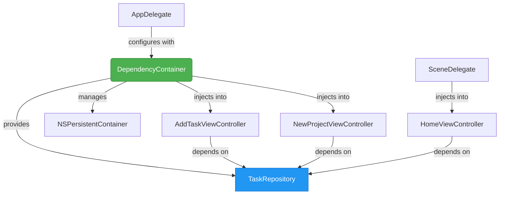
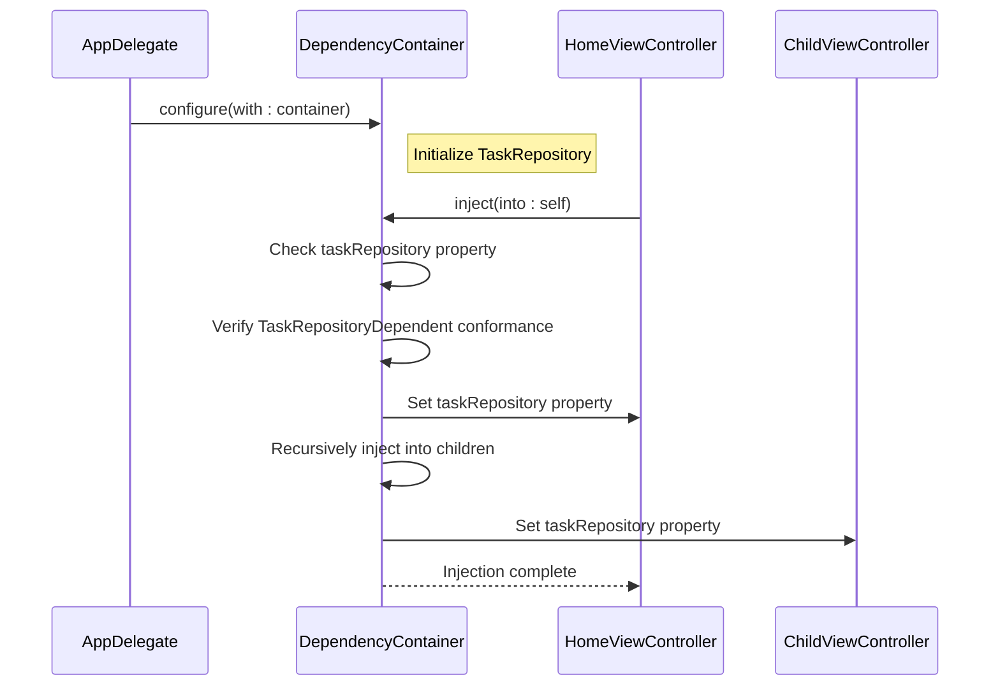
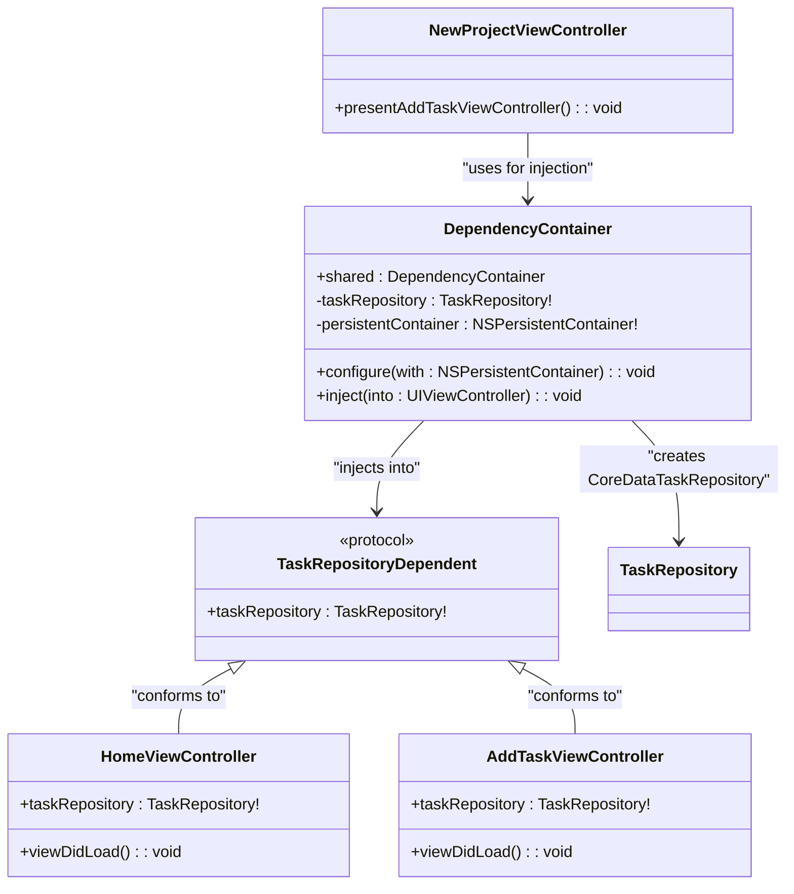

# DependencyContainer

<cite>
**Referenced Files in This Document**   
- [DependencyContainer.swift](file://To%20Do%20List/Managers/DependencyContainer.swift)
- [AppDelegate.swift](file://To%20Do%20List/AppDelegate.swift)
- [SceneDelegate.swift](file://To%20Do%20List/SceneDelegate.swift)
- [HomeViewController.swift](file://To%20Do%20List/ViewControllers/HomeViewController.swift)
- [AddTaskViewController.swift](file://To%20Do%20List/ViewControllers/AddTaskViewController.swift)
- [NewProjectViewController.swift](file://To%20Do%20List/ViewControllers/NewProjectViewController.swift)
- [TaskRepository.swift](file://To%20Do%20List/Repositories/TaskRepository.swift)
- [CoreDataTaskRepository.swift](file://To%20Do%20List/Repositories/CoreDataTaskRepository.swift)
</cite>

## Table of Contents
1. [Introduction](#introduction)
2. [Architecture Overview](#architecture-overview)
3. [Core Components](#core-components)
4. [Dependency Injection Patterns](#dependency-injection-patterns)
5. [Initialization and Configuration](#initialization-and-configuration)
6. [View Controller Integration](#view-controller-integration)
7. [Testing and Mocking](#testing-and-mocking)
8. [Registration and Lifetime Management](#registration-and-lifetime-management)
9. [Common Pitfalls and Best Practices](#common-pitfalls-and-best-practices)
10. [Extending the Container](#extending-the-container)

## Introduction

The DependencyContainer serves as the central dependency injection mechanism in the Tasker application, providing a structured approach to managing and resolving application-wide dependencies. This container enables loose coupling between components by centralizing the creation and distribution of shared services and repositories. The implementation follows a singleton pattern with lazy initialization, ensuring that dependencies are only created when needed while maintaining a single instance throughout the application lifecycle. By abstracting the creation of dependencies behind protocols, the container enhances testability and allows for flexible configuration of different implementations. This documentation provides a comprehensive analysis of the container's architecture, integration points, and usage patterns across the application.

## Architecture Overview

The DependencyContainer implements a service locator pattern that coordinates the initialization and injection of core application components. It acts as a bridge between the application's infrastructure (Core Data stack) and its consumer components (view controllers and services). The container maintains references to essential services like the TaskRepository and NSPersistentContainer, making them available to any component that requires them. This architecture promotes separation of concerns by removing dependency creation logic from individual view controllers and centralizing it in a single, well-defined location. The container's design supports both immediate configuration during app launch and deferred injection into view controllers as they are instantiated.

**Diagram sources**
- [DependencyContainer.swift](file://To%20Do%20List/Managers/DependencyContainer.swift#L1-L81)
- [AppDelegate.swift](file://To%20Do%20List/AppDelegate.swift#L1-L193)
- [SceneDelegate.swift](file://To%20Do%20List/SceneDelegate.swift#L1-L72)

## Core Components

The DependencyContainer class is implemented as a singleton with a shared static instance, ensuring that all components access the same set of dependencies. It maintains private references to critical services like the TaskRepository and NSPersistentContainer, exposing them through controlled access points. The container uses protocol-based dependencies to enable polymorphism and testing, with the TaskRepository protocol defining the contract for task data operations. During configuration, the container initializes the CoreDataTaskRepository implementation with the application's persistent container, establishing the connection between the dependency injection system and the underlying data storage layer. The container also implements reflection-based injection, using runtime introspection to identify and populate dependency properties on view controllers.

**Section sources**
- [DependencyContainer.swift](file://To%20Do%20List/Managers/DependencyContainer.swift#L1-L81)
- [TaskRepository.swift](file://To%20Do%20List/Repositories/TaskRepository.swift#L1-L118)
- [CoreDataTaskRepository.swift](file://To%20Do%20List/Repositories/CoreDataTaskRepository.swift#L1-L455)

## Dependency Injection Patterns

The DependencyContainer employs a hybrid injection pattern that combines constructor injection for service creation with property injection for view controller dependencies. The container itself uses constructor injection during the configuration phase, receiving the NSPersistentContainer from the AppDelegate. For view controllers, it implements property injection through the inject(into:) method, which uses Swift's runtime reflection capabilities to identify and populate the taskRepository property. This approach allows the container to inject dependencies into existing view controller instances without requiring changes to their initialization signatures. The injection process follows a recursive pattern, automatically propagating dependencies to child view controllers, ensuring that entire view controller hierarchies receive the necessary dependencies.

**Diagram sources**
- [DependencyContainer.swift](file://To%20Do%20List/Managers/DependencyContainer.swift#L50-L81)
- [HomeViewController.swift](file://To%20Do%20List/ViewControllers/HomeViewController.swift#L1-L1106)

## Initialization and Configuration

The DependencyContainer is initialized and configured during the application's startup sequence in the AppDelegate's didFinishLaunchingWithOptions method. The configuration process begins after the Core Data stack has been established and before any view controllers are presented. The AppDelegate obtains a reference to the shared container instance and calls the configure(with:) method, passing the NSPersistentContainer as a parameter. This method initializes the container's internal state, creating the CoreDataTaskRepository instance with the provided persistent container. The configuration includes setting up the background context for data operations and enabling automatic merging of changes. The container logs its configuration status, providing visibility into the initialization process and helping diagnose potential issues with dependency setup.

**Section sources**
- [AppDelegate.swift](file://To%20Do%20List/AppDelegate.swift#L25-L45)
- [DependencyContainer.swift](file://To%20Do%20List/Managers/DependencyContainer.swift#L60-L75)

## View Controller Integration

View controllers integrate with the DependencyContainer by conforming to the TaskRepositoryDependent protocol, which declares the taskRepository property as a dependency. The container's inject(into:) method uses Swift's runtime introspection to detect this property and populate it with the configured TaskRepository instance. This integration occurs at various points in the view controller lifecycle, including during scene connection in SceneDelegate and when presenting new view controllers programmatically. For example, the SceneDelegate injects dependencies into the HomeViewController immediately after instantiation from the storyboard. Similarly, when the NewProjectViewController completes its operation, it injects dependencies into a newly instantiated AddTaskViewController before presentation. This pattern ensures that all view controllers have access to the necessary data services without hard-coding dependencies or requiring complex initialization parameters.

**Diagram sources**
- [DependencyContainer.swift](file://To%20Do%20List/Managers/DependencyContainer.swift#L1-L81)
- [HomeViewController.swift](file://To%20Do%20List/ViewControllers/HomeViewController.swift#L1-L1106)
- [AddTaskViewController.swift](file://To%20Do%20List/ViewControllers/AddTaskViewController.swift#L1-L518)
- [NewProjectViewController.swift](file://To%20Do%20List/ViewControllers/NewProjectViewController.swift#L1-L271)

## Testing and Mocking

The DependencyContainer's design facilitates testing by enabling the replacement of real dependencies with mock implementations. The protocol-based approach to the TaskRepository allows test suites to create mock objects that conform to the same interface but provide controlled behavior for testing purposes. During unit tests, developers can inject mock repositories into view controllers to verify their behavior without relying on actual data storage. This capability is particularly valuable for testing edge cases and error conditions that would be difficult to reproduce with a real database. The container's singleton nature does require careful management in test environments to prevent state leakage between test cases, typically addressed by resetting the container's state or using dependency injection frameworks designed for testing.

**Section sources**
- [TaskRepository.swift](file://To%20Do%20List/Repositories/TaskRepository.swift#L1-L118)
- [CoreDataTaskRepository.swift](file://To%20Do%20List/Repositories/CoreDataTaskRepository.swift#L1-L455)

## Registration and Lifetime Management

The DependencyContainer manages component lifetimes through a combination of singleton and transient patterns. The container itself follows the singleton pattern, with a single shared instance throughout the application. The services it manages, such as the TaskRepository and NSPersistentContainer, are also maintained as singletons, ensuring that all components interact with the same data state. This approach is appropriate for stateful services that coordinate access to shared resources like databases. The container does not currently implement a sophisticated lifetime management system with scoped or transient registrations, instead relying on the natural lifetime of the application for its managed services. This simple approach reduces complexity while meeting the application's current requirements for dependency management.

**Section sources**
- [DependencyContainer.swift](file://To%20Do%20List/Managers/DependencyContainer.swift#L1-L81)

## Common Pitfalls and Best Practices

Several common pitfalls can arise when working with the DependencyContainer. One potential issue is the timing of dependency injection, as view controllers may attempt to use their dependencies before injection occurs. This is mitigated by the container's logging and guard statements that detect and report uninitialized dependencies. Another concern is the potential for memory retention if the container maintains strong references to view controllers, though the current implementation only holds references to long-lived services. Best practices include ensuring that all dependent view controllers conform to the TaskRepositoryDependent protocol and calling injection methods at appropriate points in the view controller lifecycle. Developers should also be aware of the container's recursive injection behavior, which automatically propagates dependencies to child view controllers, potentially leading to unexpected behavior if not properly understood.

**Section sources**
- [DependencyContainer.swift](file://To%20Do%20List/Managers/DependencyContainer.swift#L70-L81)
- [HomeViewController.swift](file://To%20Do%20List/ViewControllers/HomeViewController.swift#L1-L1106)

## Extending the Container

Extending the DependencyContainer to support additional services follows a consistent pattern established by the existing implementation. New services should be defined as protocols to enable abstraction and testing, then implemented as concrete classes that can be instantiated by the container. The container's properties should be extended to include the new service, with appropriate access controls to prevent external modification. Configuration methods may need to be updated to accept additional parameters required by the new service, or the service can be initialized with default parameters within the container. When adding services with specific lifetime requirements, consideration should be given to whether they should follow the singleton pattern like existing services or if a different lifetime management strategy is needed. The injection mechanism can automatically support new dependencies by extending the reflection-based property detection to recognize additional dependency protocols.

**Section sources**
- [DependencyContainer.swift](file://To%20Do%20List/Managers/DependencyContainer.swift#L1-L81)