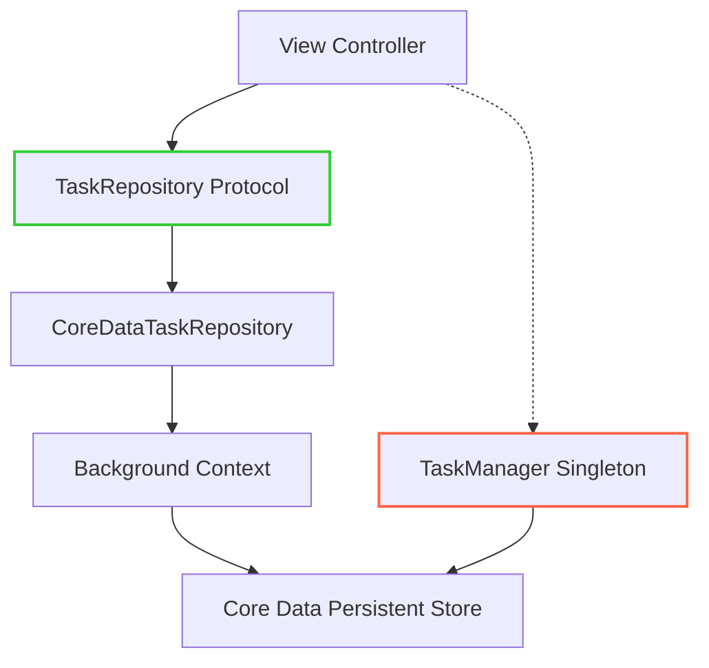
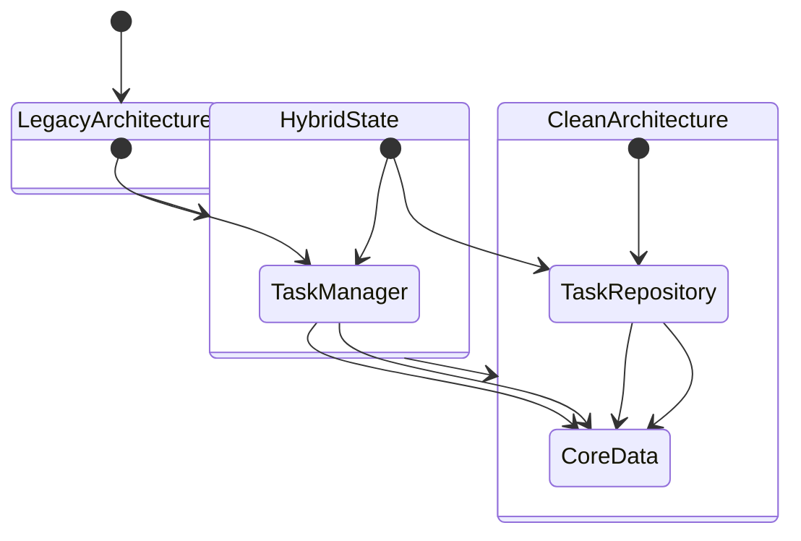

# TaskManager Implementation

<cite>
**Referenced Files in This Document**   
- [TaskManager.swift](file://To%20Do%20List/ViewControllers/TaskManager.swift)
- [DependencyContainer.swift](file://To%20Do%20List/Managers/DependencyContainer.swift)
- [TaskRepository.swift](file://To%20Do%20List/Repositories/TaskRepository.swift)
- [CoreDataTaskRepository.swift](file://To%20Do%20List/Repositories/CoreDataTaskRepository.swift)
- [README.md](file://README.md)
</cite>

## Table of Contents
1. [Introduction](#introduction)
2. [Core Architecture and Role of TaskManager](#core-architecture-and-role-of-taskmanager)
3. [Task Lifecycle Operations](#task-lifecycle-operations)
4. [Business Rule Enforcement](#business-rule-enforcement)
5. [Thread Safety and State Management](#thread-safety-and-state-management)
6. [Integration with Modern Repository Layer](#integration-with-modern-repository-layer)
7. [Migration Guidance: TaskManager vs TaskRepository](#migration-guidance-taskmanager-vs-taskrepository)
8. [Conclusion](#conclusion)

## Introduction

The **TaskManager** component is a legacy singleton class that serves as the central hub for task business logic in the Tasker application. It encapsulates all core operations related to task creation, retrieval, modification, completion, and deletion. Built on top of Core Data, TaskManager provides a high-level interface for view controllers and other components to interact with task data while enforcing critical business rules such as priority constraints, due date handling, and project categorization.

This document provides a comprehensive analysis of the TaskManager implementation, detailing its internal mechanisms, interaction with Core Data through the `NTask` entity, integration with the modern repository pattern via `DependencyContainer`, and its transitional role in the application's ongoing architectural evolution from a monolithic MVC design toward Clean Architecture.

## Core Architecture and Role of TaskManager

### Singleton Pattern and Initialization

TaskManager follows the singleton design pattern, ensuring a single shared instance across the entire application:

```swift
static let sharedInstance = TaskManager()
```

The singleton is initialized during app startup, typically from the AppDelegate, where it acquires a reference to the Core Data managed object context:

```swift
private init() {
    let appDelegate = UIApplication.shared.delegate as! AppDelegate
    context = appDelegate.persistentContainer.viewContext
    fetchTasks()
}
```

This initialization establishes the connection to Core Data and performs an initial fetch of all tasks, populating the internal state.

### Core Data Integration via NTask Entity

TaskManager interacts directly with Core Data using the `NTask` entity, which defines the persistent data model for tasks. Key properties of the `NTask` entity include:

**: NTask Entity Properties**
- **name**: String – Task title
- **isComplete**: Bool – Completion status
- **dueDate**: NSDate? – Due date for scheduling
- **taskDetails**: String? – Additional task description
- **taskPriority**: Int32 – Priority level (stored as enum raw value)
- **taskType**: Int32 – Category (stored as enum raw value)
- **project**: String? – Associated project name
- **dateAdded**: NSDate? – Creation timestamp
- **dateCompleted**: NSDate? – Completion timestamp
- **isEveningTask**: Bool – Evening task flag

The use of `Int32` for `taskPriority` and `taskType` enables efficient storage while allowing type-safe access through Swift enums.

### Type-Safe Enumerations

TaskManager leverages Swift enums to provide type safety and eliminate magic numbers:

```swift
enum TaskType: Int32, CaseIterable {
    case morning = 1
    case evening = 2
    case upcoming = 3
}

enum TaskPriority: Int32, CaseIterable {
    case low = 1
    case medium = 2
    case high = 3
    case veryLow = 4
}
```

These enums are used throughout the codebase to represent task categories and priority levels, improving code readability and reducing errors.

**Section sources**
- [TaskManager.swift](file://To%20Do%20List/ViewControllers/TaskManager.swift#L15-L60)
- [README.md](file://README.md#L436-L474)

## Task Lifecycle Operations

### Task Creation Methods

TaskManager provides multiple methods for creating new tasks, each tailored to specific use cases:

#### Basic Task Creation

The primary method for adding a new task with explicit parameters:

```swift
@discardableResult
func addNewTask(name: String, taskType: TaskType, taskPriority: TaskPriority) -> NTask {
    let task = NSEntityDescription.insertNewObject(forEntityName: "NTask", into: context) as! NTask
    
    task.name = name
    task.isComplete = false
    task.taskDetails = ""
    task.type = taskType
    task.priority = taskPriority
    
    saveContext()
    return task
}
```

This method creates a new `NTask` entity, sets its properties, and persists the changes to Core Data.

#### Date-Specific Creation Methods

TaskManager includes specialized methods for creating tasks scheduled for today or a future date:

```swift
@discardableResult
func addNewTask_Today(name: String, taskType: TaskType, taskPriority: TaskPriority, isEveningTask: Bool, project: String) -> NTask {
    let task = NSEntityDescription.insertNewObject(forEntityName: "NTask", into: context) as! NTask
    
    task.name = name
    task.isComplete = false
    task.taskDetails = ""
    task.type = taskType
    task.priority = taskPriority
    task.dateAdded = Date.today() as NSDate
    task.dueDate = Date.today() as NSDate
    task.setValue(isEveningTask, forKey: "isEveningTask")
    
    if project.isEmpty {
        task.project = ProjectManager.sharedInstance.defaultProject
    } else {
        task.project = project
    }
    
    saveContext()
    return task
}
```

This method automatically sets the `dateAdded` and `dueDate` to the current date, making it ideal for immediate tasks.

#### Future-Dated Task Creation

For tasks scheduled in the future:

```swift
@discardableResult
func addNewTask_Future(name: String, taskType: TaskType, taskPriority: TaskPriority, futureTaskDate: Date, isEveningTask: Bool, project: String) -> NTask {
    let task = NSEntityDescription.insertNewObject(forEntityName: "NTask", into: context) as! NTask
    
    task.name = name
    task.isComplete = false
    task.taskDetails = ""
    task.type = taskType
    task.priority = taskPriority
    task.dateAdded = Date.today() as NSDate
    task.dueDate = futureTaskDate as NSDate
    task.setValue(isEveningTask, forKey: "isEveningTask")
    
    if project.isEmpty {
        task.project = "inbox"
    } else {
        task.project = project
    }
    
    saveContext()
    return task
}
```

This method allows scheduling tasks for specific future dates, supporting the application's planning functionality.

**Section sources**
- [TaskManager.swift](file://To%20Do%20List/ViewControllers/TaskManager.swift#L600-L800)

### Task Modification and Completion

#### Task Completion Toggle

The `toggleTaskComplete` method handles the completion status of a task:

```swift
func toggleTaskComplete(task: NTask) {
    let wasComplete = task.isComplete
    task.isComplete.toggle()
    if task.isComplete {
        task.dateCompleted = Date.today() as NSDate
    } else {
        task.dateCompleted = nil
    }
    saveContext()
    
    NotificationCenter.default.post(name: NSNotification.Name("TaskCompletionChanged"), object: nil)
}
```

This method not only updates the `isComplete` flag but also manages the `dateCompleted` timestamp, setting it when a task is completed and clearing it when reopened.

#### Task Rescheduling

Tasks can be rescheduled to new dates:

```swift
func reschedule(task: NTask, to newDate: Date) {
    task.dueDate = newDate as NSDate
    saveContext()
}
```

This simple method updates the `dueDate` property and persists the change.

#### Task Deletion

Tasks are removed by deleting the managed object:

```swift
func removeTaskAtIndex(index: Int) {
    let task = taskAtIndex(index: index)
    context.delete(task)
    saveContext()
}
```

The method retrieves the task at the specified index and deletes it from the managed object context.

**Section sources**
- [TaskManager.swift](file://To%20Do%20List/ViewControllers/TaskManager.swift#L800-L900)

## Business Rule Enforcement

### Priority Constraints and Default Values

TaskManager enforces business rules through its method signatures and internal logic. When creating tasks, it requires explicit priority values, ensuring that no task is created without a defined priority level. The use of the `TaskPriority` enum prevents invalid values from being assigned.

For legacy compatibility, TaskManager provides overloaded methods that accept integer parameters, converting them to the appropriate enum values:

```swift
func addNewTask(name: String, taskType: Int, taskPriority: Int) {
    let type = TaskType(rawValue: Int32(taskType)) ?? .morning
    let priority = TaskPriority(rawValue: Int32(taskPriority)) ?? .medium
    addNewTask(name: name, taskType: type, taskPriority: priority)
}
```

This conversion includes fallback values (`.morning` and `.medium`) to handle invalid input, maintaining data integrity.

### Due Date Handling and Scheduling Logic

TaskManager implements sophisticated due date handling through its various retrieval methods. For example, when fetching tasks for a specific date, it considers multiple conditions:

```swift
func getAllTasksForDate(date: Date) -> [NTask] {
    let startOfDay = date.startOfDay
    let endOfDay = Calendar.current.date(byAdding: .day, value: 1, to: startOfDay)!
    
    var predicates = [
        NSPredicate(format: "dueDate >= %@ AND dueDate < %@", startOfDay as NSDate, endOfDay as NSDate)
    ]
    
    if Calendar.current.isDateInToday(date) {
        let overduePredicate = NSPredicate(
            format: "dueDate < %@ AND isComplete == NO",
            startOfDay as NSDate
        )
        predicates.append(overduePredicate)
    }
    
    let completedTodayPredicate = NSPredicate(
        format: "dateCompleted >= %@ AND dateCompleted < %@ AND isComplete == YES",
        startOfDay as NSDate,
        endOfDay as NSDate
    )
    predicates.append(completedTodayPredicate)
    
    let finalPredicate = NSCompoundPredicate(orPredicateWithSubpredicates: predicates)
    return fetchTasks(predicate: finalPredicate)
}
```

This logic ensures that:
- Tasks due on the specified date are included
- Overdue tasks are shown only when viewing today's date
- Completed tasks from the specified date are included

### Project Assignment and Default Handling

TaskManager enforces project assignment rules by defaulting to the "inbox" project when no project is specified:

```swift
if project.isEmpty {
    task.project = ProjectManager.sharedInstance.defaultProject
} else {
    task.project = project
}
```

Additionally, it includes a data integrity method to fix missing project assignments:

```swift
func fixMissingTasksDataWithDefaults() {
    let allTasks = fetchTasks(predicate: nil)
    
    for each in allTasks {
        if each.project?.isEmpty ?? true {
            each.project = "inbox"
            saveContext()
        }
    }
}
```

This proactive approach ensures data consistency across the application.

**Section sources**
- [TaskManager.swift](file://To%20Do%20List/ViewControllers/TaskManager.swift#L600-L900)
- [README.md](file://README.md#L730-L771)

## Thread Safety and State Management

### Current State and Risks

As a singleton with direct Core Data access, TaskManager presents potential thread-safety concerns. It uses the main queue context (`viewContext`) from the persistent container, which is safe for UI operations but can lead to performance issues if used for intensive operations.

The current implementation does not explicitly handle concurrent access from multiple threads, relying on Core Data's internal thread confinement rules. This means that all operations should ideally be performed on the main thread to avoid crashes.

### Data Synchronization

TaskManager maintains an internal array of tasks for backward compatibility:

```swift
private var tasks = [NTask]()
```

However, most methods now use predicate-based fetching directly from Core Data, reducing reliance on this in-memory cache. The `fetchTasks()` method synchronizes this array with the database:

```swift
func fetchTasks() {
    tasks = fetchTasks(predicate: nil, sortDescriptors: nil)
}
```

This approach helps maintain consistency but requires careful management to avoid stale data.

### Recommendations for Safe Usage

When accessing TaskManager from view controllers:

1. Always perform operations on the main thread
2. Call `fetchTasks()` before accessing the `tasks` array if using index-based methods
3. Prefer predicate-based retrieval methods over array indexing
4. Be aware that the singleton state is shared across all components

The transition to the repository pattern addresses these concerns by using background contexts for data operations.

**Section sources**
- [TaskManager.swift](file://To%20Do%20List/ViewControllers/TaskManager.swift#L30-L50)
- [README.md](file://README.md#L278-L306)

## Integration with Modern Repository Layer

### DependencyContainer and Service Resolution

The application is transitioning to dependency injection using the `DependencyContainer` class:

```swift
class DependencyContainer {
    static let shared = DependencyContainer()
    
    private(set) var taskRepository: TaskRepository!
    private(set) var persistentContainer: NSPersistentContainer!
    
    func configure(with container: NSPersistentContainer) {
        self.persistentContainer = container
        self.taskRepository = CoreDataTaskRepository(container: container)
    }
    
    func inject(into viewController: UIViewController) {
        if let dependentVC = viewController as? TaskRepositoryDependent {
            dependentVC.taskRepository = taskRepository
        }
    }
}
```

This container manages the lifecycle of services and injects them into view controllers that conform to the `TaskRepositoryDependent` protocol.

### TaskRepository Protocol

The modern repository layer is defined by the `TaskRepository` protocol:

```swift
protocol TaskRepository {
    func fetchTasks(predicate: NSPredicate?, sortDescriptors: [NSSortDescriptor]?, completion: @escaping ([TaskData]) -> Void)
    func addTask(data: TaskData, completion: ((Result<NTask, Error>) -> Void)?)
    func toggleComplete(taskID: NSManagedObjectID, completion: ((Result<Void, Error>) -> Void)?)
    // ... other methods
}
```

This protocol provides a testable, asynchronous interface for task operations.

### CoreDataTaskRepository Implementation

The concrete implementation uses background contexts for improved performance:

```swift
final class CoreDataTaskRepository: TaskRepository {
    private let viewContext: NSManagedObjectContext
    private let backgroundContext: NSManagedObjectContext
    
    init(container: NSPersistentContainer) {
        self.viewContext = container.viewContext
        self.backgroundContext = container.newBackgroundContext()
        self.viewContext.automaticallyMergesChangesFromParent = true
    }
    
    func addTask(data: TaskData, completion: ((Result<NTask, Error>) -> Void)?) {
        backgroundContext.perform {
            // Perform operation on background context
            // ...
            try self.backgroundContext.save()
        }
    }
}
```

This approach prevents UI blocking and improves application responsiveness.



**Diagram sources**
- [DependencyContainer.swift](file://To%20Do%20List/Managers/DependencyContainer.swift#L10-L80)
- [TaskRepository.swift](file://To%20Do%20List/Repositories/TaskRepository.swift#L10-L117)
- [CoreDataTaskRepository.swift](file://To%20Do%20List/Repositories/CoreDataTaskRepository.swift#L10-L199)

**Section sources**
- [DependencyContainer.swift](file://To%20Do%20List/Managers/DependencyContainer.swift#L10-L80)
- [TaskRepository.swift](file://To%20Do%20List/Repositories/TaskRepository.swift#L10-L117)
- [CoreDataTaskRepository.swift](file://To%20Do%20List/Repositories/CoreDataTaskRepository.swift#L10-L199)

## Migration Guidance: TaskManager vs TaskRepository

### Current Hybrid State

The application exists in a hybrid architectural state:

**: Architecture Comparison**
| **Aspect** | **TaskManager (Legacy)** | **TaskRepository (Modern)** |
|-----------|-------------------------|----------------------------|
| **Pattern** | Singleton | Dependency Injection |
| **Threading** | Main context only | Background contexts |
| **Error Handling** | Silent (boolean returns) | Explicit (Result types) |
| **Testability** | Difficult (singleton) | Easy (protocol-based) |
| **Usage** | HomeViewController, AddTaskViewController | TaskListViewController |

### When to Use Each Component

#### Use TaskManager When:
- Working in legacy view controllers that haven't been refactored
- Need backward compatibility with existing code
- Performing simple operations in components that already depend on the singleton
- Accessing specialized methods not yet implemented in the repository

#### Use TaskRepository When:
- Developing new features or view controllers
- Requiring better testability and dependency management
- Needing asynchronous operations with proper error handling
- Working on components that support dependency injection
- Building SwiftUI interfaces with ViewModel patterns

### Migration Strategy

The recommended migration path involves:

1. **Incremental Adoption**: Migrate one view controller at a time
2. **Dependency Injection**: Use `DependencyContainer` to inject `TaskRepository`
3. **Protocol Conformance**: Make view controllers conform to `TaskRepositoryDependent`
4. **Method Replacement**: Replace `TaskManager.sharedInstance` calls with injected `taskRepository`
5. **Testing**: Implement unit tests using mock repositories

The README indicates that 60% of the migration is complete, with `TaskListViewController` fully migrated while `HomeViewController` still depends heavily on the singleton.



**Diagram sources**
- [README.md](file://README.md#L148-L184)

**Section sources**
- [README.md](file://README.md#L974-L985)
- [README.md](file://README.md#L278-L306)

## Conclusion

The TaskManager component represents a critical piece of the Tasker application's legacy architecture, providing essential task management functionality through a singleton pattern tightly coupled to Core Data. While effective, this design presents challenges for testing, maintainability, and scalability.

The ongoing architectural evolution toward Clean Architecture, centered on the repository pattern and dependency injection, addresses these limitations by introducing the `TaskRepository` protocol and `DependencyContainer`. This modern approach offers improved testability, better thread management, and clearer separation of concerns.

For developers working on the codebase, understanding both systems is crucial. The TaskManager remains necessary for maintaining existing functionality, while the TaskRepository represents the future direction of the application. The recommended approach is to use the repository pattern for new development while gradually refactoring legacy components to adopt the modern architecture.

This transitional state reflects a pragmatic approach to software evolution, balancing the need for stability with the pursuit of architectural excellence.