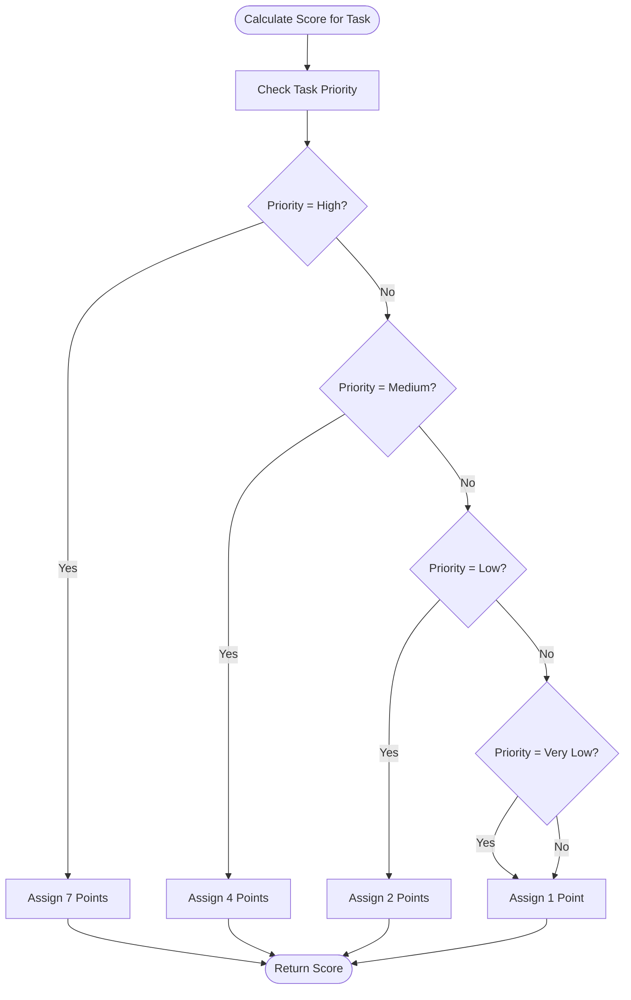
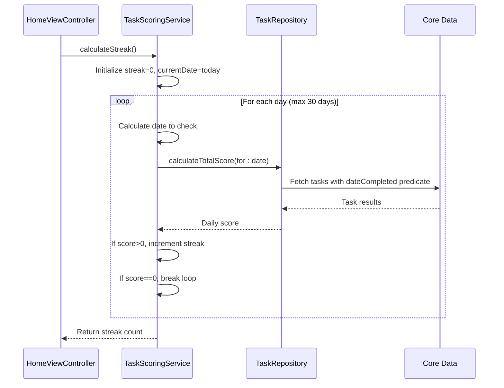
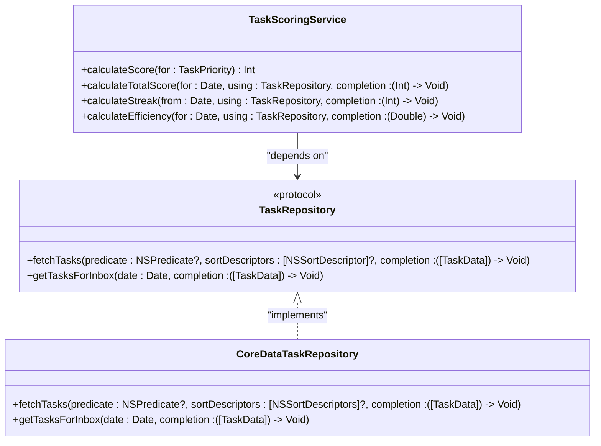
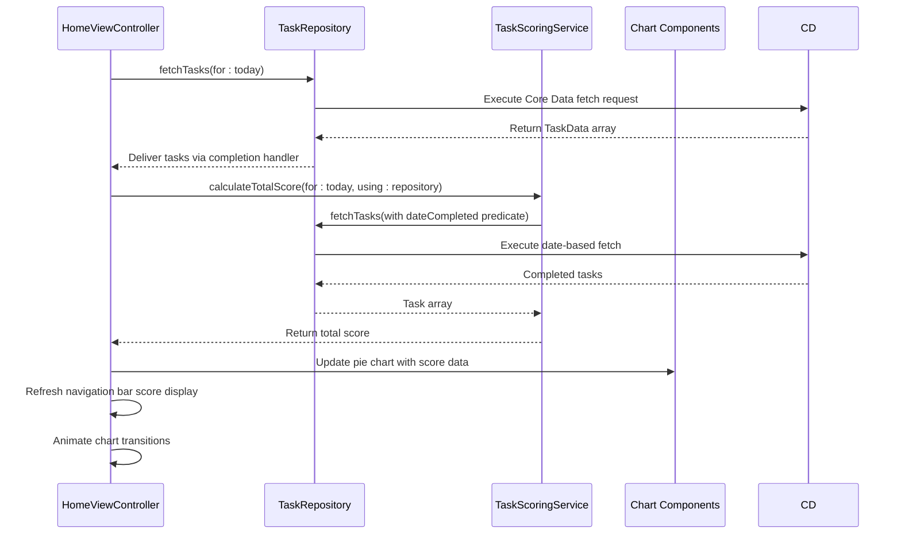

# TaskScoringService

<cite>
**Referenced Files in This Document**   
- [TaskScoringService.swift](file://To%20Do%20List/Services/TaskScoringService.swift#L1-L153)
- [HomeViewController.swift](file://To%20Do%20List/ViewControllers/HomeViewController.swift#L0-L1106)
- [TaskRepository.swift](file://To%20Do%20List/Repositories/TaskRepository.swift#L0-L117)
- [README.md](file://README.md#L652-L690)
</cite>

## Table of Contents
1. [Introduction](#introduction)
2. [Core Scoring Algorithm](#core-scoring-algorithm)
3. [Streak Calculation Logic](#streak-calculation-logic)
4. [Efficiency Score Implementation](#efficiency-score-implementation)
5. [Integration with TaskRepository](#integration-with-taskrepository)
6. [UI Integration and Analytics Flow](#ui-integration-and-analytics-flow)
7. [Public Interface and Method Usage](#public-interface-and-method-usage)
8. [Architecture and Design Patterns](#architecture-and-design-patterns)
9. [Edge Cases and System Behavior](#edge-cases-and-system-behavior)
10. [Performance Considerations](#performance-considerations)

## Introduction

The **TaskScoringService** is a dedicated component within the Tasker application responsible for implementing gamification logic through a comprehensive scoring system. This service calculates user performance metrics based on task completion patterns, priority levels, and consistency of engagement. Designed as a decoupled, injectable component, it enables flexible integration across various parts of the application while maintaining separation of concerns.

The service plays a critical role in promoting user engagement by transforming routine task management into a rewarding experience through positive reinforcement mechanics. It calculates daily scores based on completed tasks, evaluates streaks of consecutive productive days, and computes efficiency metrics that reflect task completion rates. These metrics are then used to power visual analytics, provide feedback in the UI, and potentially unlock achievements or rewards within the app's gamification framework.

Although the service currently uses a singleton pattern for global access (`static let shared`), the code includes a note indicating that dependency injection is preferred for better testability and architectural purity. The service interacts with the data layer through the `TaskRepository` protocol, ensuring loose coupling between business logic and data persistence mechanisms.

**Section sources**
- [TaskScoringService.swift](file://To%20Do%20List/Services/TaskScoringService.swift#L1-L153)

## Core Scoring Algorithm

The TaskScoringService implements a priority-based scoring system where tasks are assigned point values according to their importance level. The core algorithm maps each task priority to a specific point value, creating a tiered reward structure that incentivizes users to complete higher-priority items.

The scoring logic is implemented through multiple overloaded `calculateScore` methods that accept different input types, providing flexibility in how scoring can be invoked:

- **TaskPriority Input**: The primary scoring method takes a `TaskPriority` enum and returns base points
- **TaskData Input**: A convenience method that extracts priority from a `TaskData` object
- **NTask Input**: A Core Data-specific method that converts raw priority values to enum and calculates score

The base point structure is as follows:
- **High Priority**: 7 points
- **Medium Priority**: 4 points  
- **Low Priority**: 2 points
- **Very Low Priority**: 1 point

This tiered approach creates meaningful differentiation between task importance levels, with high-priority tasks offering more than triple the points of low-priority tasks. The algorithm ensures that only completed tasks contribute to scoring by checking the `isComplete` status internally.

The service also provides a `calculateTotalScore` method that aggregates scores for all completed tasks within a specific date range. This method uses Core Data predicates to filter tasks completed on a given day, then iterates through them to sum individual task scores. The asynchronous completion handler pattern ensures that scoring calculations do not block the main thread, especially important when dealing with large task datasets.

**Diagram sources**
- [TaskScoringService.swift](file://To%20Do%20List/Services/TaskScoringService.swift#L25-L50)

**Section sources**
- [TaskScoringService.swift](file://To%20Do%20List/Services/TaskScoringService.swift#L25-L85)

## Streak Calculation Logic

The TaskScoringService includes functionality to calculate user streaks, which represent consecutive days of productive activity. The `calculateStreak` method determines how many days in a row the user has completed at least one task, providing a measure of consistency and habit formation.

The streak calculation algorithm works by examining recent days in reverse chronological order, starting from the current day and moving backward. For each day, it calls `calculateTotalScore` to determine if any tasks were completed (score > 0). The process continues until it encounters a day with no completed tasks or reaches the maximum lookback period of 30 days.

Key aspects of the streak implementation:
- **Time-aware Processing**: Uses `Calendar.current.startOfDay(for: Date())` to ensure accurate day boundaries
- **Sequential Evaluation**: Processes days in order from most recent to oldest
- **Early Termination**: Stops counting when it encounters the first day with no completed tasks
- **Synchronous Execution**: Uses `DispatchGroup` with `group.wait()` to ensure all score calculations complete before returning the final streak count

The synchronous nature of this implementation ensures that the streak value is immediately available when needed, though it may impact performance if many days need to be evaluated. The 30-day maximum prevents excessive processing while still providing a meaningful measure of long-term consistency.

The streak metric serves as a powerful motivational tool, encouraging users to maintain their productivity momentum. While the current implementation only calculates streaks, the architecture could be extended to include streak bonuses in future versions, where longer streaks might multiply base scores or unlock special rewards.

**Diagram sources**
- [TaskScoringService.swift](file://To%20Do%20List/Services/TaskScoringService.swift#L100-L130)

**Section sources**
- [TaskScoringService.swift](file://To%20Do%20List/Services/TaskScoringService.swift#L100-L130)

## Efficiency Score Implementation

In addition to raw point scoring, the TaskScoringService provides an efficiency calculation through the `calculateEfficiency` method. This metric represents the percentage of planned tasks that were successfully completed on a given day, offering insight into productivity effectiveness rather than just activity volume.

The efficiency algorithm works by:
1. Fetching all tasks scheduled for a specific date using `getTasksForInbox(date:)`
2. Counting the total number of tasks for that date
3. Filtering to count only completed tasks
4. Calculating the percentage as (completed tasks / total tasks) × 100

The method handles edge cases gracefully by returning 0.0 when no tasks are scheduled for the date, preventing division by zero errors. The result is returned as a double value between 0.0 and 100.0, representing the completion percentage.

This efficiency metric complements the point-based scoring system by providing a normalized measure of performance that accounts for workload size. A user who completes 5 out of 5 tasks (100% efficiency) demonstrates different productivity characteristics than a user who completes 10 out of 20 tasks (50% efficiency), even if the latter earns more total points.

The efficiency calculation leverages existing repository methods rather than implementing custom Core Data queries, adhering to the principle of reusing established data access patterns. By depending on `getTasksForInbox(date:)`, it focuses on the primary task list rather than including all possible projects, providing a consistent measure of daily inbox management effectiveness.

**Section sources**
- [TaskScoringService.swift](file://To%20Do%20List/Services/TaskScoringService.swift#L135-L153)

## Integration with TaskRepository

The TaskScoringService is designed to work seamlessly with the TaskRepository protocol, which defines the contract for data access operations in the Tasker application. This dependency injection approach allows the scoring service to remain agnostic of the underlying data persistence mechanism while ensuring testability and flexibility.

The service interacts with the repository through several key methods:
- **fetchTasks**: Used by `calculateTotalScore` to retrieve completed tasks within a date range
- **getTasksForInbox**: Used by `calculateEfficiency` to obtain the daily task list
- **Asynchronous Completion Handlers**: All repository methods use completion closures, which the scoring service properly handles with weak self references to prevent retain cycles

The relationship between TaskScoringService and TaskRepository follows the dependency inversion principle, where high-level modules (scoring logic) depend on abstractions (protocol) rather than concrete implementations. This design enables easy substitution of different repository implementations, such as mock repositories for testing or alternative persistence layers.

The service expects a `TaskRepository` instance to be provided when calling methods that require data access, though the current implementation in the codebase may rely on global access patterns. The use of protocol-based dependencies makes the system more modular and maintainable, allowing for independent evolution of the scoring logic and data access layers.

**Diagram sources**
- [TaskScoringService.swift](file://To%20Do%20List/Services/TaskScoringService.swift#L1-L153)
- [TaskRepository.swift](file://To%20Do%20List/Repositories/TaskRepository.swift#L0-L117)

**Section sources**
- [TaskScoringService.swift](file://To%20Do%20List/Services/TaskScoringService.swift#L87-L153)
- [TaskRepository.swift](file://To%20Do%20List/Repositories/TaskRepository.swift#L0-L117)

## UI Integration and Analytics Flow

The TaskScoringService is integrated into the user interface through the HomeViewController, where its calculations power visual analytics and real-time feedback. The primary integration point occurs in the daily scoring and analytics workflow, where task completion data is transformed into meaningful metrics for user consumption.

According to the documented use-case sequence flows, the integration follows this pattern:
1. **HomeViewController** requests today's tasks from **TaskRepository**
2. **TaskRepository** fetches data from Core Data using appropriate predicates
3. **TaskRepository** returns task data to **HomeViewController**
4. **HomeViewController** passes tasks to **TaskScoringService** for scoring
5. **TaskScoringService** returns the calculated score
6. **HomeViewController** updates charts and labels with the new score

This flow is evident in the HomeViewController's implementation, particularly in methods related to chart updating and navigation bar score display. The controller calls scoring methods to obtain values for:
- **Navigation Bar Display**: Showing today's score in the header
- **Pie Chart Visualization**: Powering the priority breakdown chart
- **Historical Analytics**: Contributing to trend analysis over time

The integration leverages NotificationCenter observers to ensure scores are updated when task completion status changes. The HomeViewController listens for "TaskCompletionChanged" notifications and responds by refreshing the daily score and associated visual elements.

Visual components powered by the scoring service include:
- **Navigation Pie Chart**: Shows task completion breakdown by priority
- **Daily Score Label**: Displays the total points earned for the current day
- **Streak Visualization**: Line charts tracking consecutive completion days
- **Efficiency Metrics**: Percentage-based performance indicators

**Diagram sources**
- [HomeViewController.swift](file://To%20Do%20List/ViewControllers/HomeViewController.swift#L0-L1106)
- [TaskScoringService.swift](file://To%20Do%20List/Services/TaskScoringService.swift#L87-L100)

**Section sources**
- [HomeViewController.swift](file://To%20Do%20List/ViewControllers/HomeViewController.swift#L0-L1106)

## Public Interface and Method Usage

The TaskScoringService exposes a comprehensive public interface through several key methods that enable various scoring and analytics capabilities. These methods follow consistent patterns in their design, using completion handlers for asynchronous operations and clear parameter naming for readability.

**Primary Public Methods:**

- **calculateScore(for: TaskPriority) -> Int**
  - *Purpose*: Calculate base points for a single task based on priority
  - *Usage*: Direct scoring of individual tasks
  - *Invocation*: Called internally by other scoring methods

- **calculateScore(for: TaskData) -> Int**
  - *Purpose*: Convenience method to score a task data object
  - *Usage*: When working with TaskData transfer objects
  - *Invocation*: Delegates to priority-based scoring

- **calculateScore(for: NTask) -> Int** 
  - *Purpose*: Score a Core Data managed object directly
  - *Usage*: When working with persistent task entities
  - *Invocation*: Extracts priority from managed object

- **calculateTotalScore(for: Date, using: TaskRepository, completion: @escaping (Int) -> Void)**
  - *Purpose*: Calculate aggregate score for all completed tasks on a date
  - *Usage*: Daily performance tracking
  - *Invocation*: Called by UI components and analytics systems

- **calculateStreak(from: Date, using: TaskRepository, completion: @escaping (Int) -> Void)**
  - *Purpose*: Determine consecutive days of task completion
  - *Usage*: Streak tracking and habit formation metrics
  - *Invocation*: Periodically updated in the home view

- **calculateEfficiency(for: Date, using: TaskRepository, completion: @escaping (Double) -> Void)**
  - *Purpose*: Calculate percentage of tasks completed for a date
  - *Usage*: Productivity effectiveness measurement
  - *Invocation*: Analytics and performance reporting

The service is typically invoked from the HomeViewController or other UI components that need to display scoring information. The singleton pattern (`TaskScoringService.shared`) allows easy access from any part of the application, though dependency injection would be preferable for testability.

Common invocation patterns include:
- Updating the UI when the view appears or reloads
- Responding to task completion notifications
- Initializing analytics components
- Refreshing dashboard metrics

**Section sources**
- [TaskScoringService.swift](file://To%20Do%20List/Services/TaskScoringService.swift#L25-L153)

## Architecture and Design Patterns

The TaskScoringService exemplifies several key architectural patterns and design principles that contribute to the overall maintainability and scalability of the Tasker application. The service is designed as a focused, single-responsibility component that encapsulates all gamification and scoring logic.

**Key Architectural Features:**

- **Single Responsibility Principle**: The service handles only scoring-related functionality, avoiding feature creep into task management or data persistence
- **Dependency Injection**: Uses the TaskRepository protocol for data access, allowing for flexible composition and easier testing
- **Asynchronous Design**: Employs completion handlers for all data-dependent operations, preventing UI blocking
- **Type Safety**: Leverages Swift's strong typing with enum-based priorities and clear method signatures
- **Protocol-Oriented Programming**: Depends on the TaskRepository protocol rather than concrete implementations

The service follows a functional approach to scoring, where methods take inputs and produce outputs without maintaining internal state. This stateless design makes the service predictable and easier to reason about, as scoring results depend solely on the input parameters and current data state.

The architecture supports the application's transition from legacy patterns to a more modern repository-based design. While the service currently uses a singleton pattern for global access, the code includes a note acknowledging that dependency injection is preferred, indicating awareness of architectural best practices.

The separation between scoring logic and data access is particularly well-executed, with the service knowing only about the TaskRepository interface and not about Core Data specifics. This abstraction layer allows the underlying data storage mechanism to change without affecting the scoring algorithms.

Integration with analytics systems is achieved through simple data exchange rather than tight coupling, enabling the scoring service to focus on its core competency while allowing other components to interpret and visualize the results.

**Section sources**
- [TaskScoringService.swift](file://To%20Do%20List/Services/TaskScoringService.swift#L1-L153)

## Edge Cases and System Behavior

The TaskScoringService handles several edge cases and potential system states to ensure robust behavior under various conditions. These considerations are critical for maintaining data integrity and providing a consistent user experience, especially when dealing with time-based calculations and asynchronous operations.

**Key Edge Cases Addressed:**

- **Unknown Priority Levels**: The `@unknown default` case in the priority switch statement ensures that any unrecognized priority values default to 1 point, preventing crashes if new priority levels are introduced without updating the scoring logic
- **Empty Task Lists**: The efficiency calculation gracefully handles days with no scheduled tasks by returning 0.0 rather than attempting division by zero
- **Date Boundary Conditions**: Uses `startOfDay` and `Calendar.current.date(byAdding: .day)` to properly handle day boundaries, accounting for timezone differences and daylight saving time changes
- **Asynchronous Safety**: Uses `[weak self]` in completion handlers to prevent retain cycles when capturing self in closures
- **Maximum Lookback Limit**: The streak calculation limits its search to 30 days, preventing excessive processing and potential performance issues with long-term users

The service also demonstrates consideration for system-level edge cases:
- **Time Changes**: By using calendar-aware date calculations, it can handle device time changes more gracefully
- **Data Consistency**: Relies on the TaskRepository for data access, inheriting its error handling and consistency mechanisms
- **Memory Management**: Uses value types and avoids strong reference cycles in its asynchronous patterns

Potential edge cases that may require additional handling include:
- **Timezone Changes**: When users travel across timezones, daily scoring boundaries might shift unexpectedly
- **Clock Adjustments**: Manual device time changes could affect streak calculations
- **Data Migration**: When upgrading between app versions with different scoring algorithms
- **Offline Operation**: Scoring calculations when CloudKit synchronization is delayed

The current implementation does not appear to persist streak data separately, instead recalculating it each time from task completion history. This approach ensures accuracy but may impact performance with large datasets. A hybrid approach could cache the current streak while validating it against the historical record.

**Section sources**
- [TaskScoringService.swift](file://To%20Do%20List/Services/TaskScoringService.swift#L1-L153)

## Performance Considerations

The TaskScoringService implementation includes several performance considerations that balance responsiveness with computational efficiency. The design prioritizes user experience by ensuring that scoring calculations do not block the main thread, while also being mindful of resource usage.

**Performance Characteristics:**

- **Asynchronous Operations**: All data-dependent methods use completion handlers, preventing UI freezing during score calculations
- **Batch Processing**: The total score calculation fetches all relevant tasks in a single Core Data request rather than individual queries
- **Limited Lookback**: The streak calculation caps at 30 days, preventing unbounded processing for long-term users
- **Synchronous Wait in Streak Calculation**: Uses `DispatchGroup.wait()` which could potentially block threads if not managed carefully

The most significant performance consideration is the streak calculation method, which synchronously waits for each day's score calculation to complete before proceeding to the next day. While this ensures accurate results, it could lead to performance issues if many days need to be evaluated, as each `calculateTotalScore` call involves a separate Core Data fetch operation.

Potential performance optimizations include:
- **Caching**: Storing the current streak value and only recalculating when task completion status changes
- **Batch Date Queries**: Fetching multiple days of task data in a single request rather than individual day queries
- **Background Processing**: Moving streak calculations entirely to background queues with proper progress reporting
- **Incremental Updates**: Updating streaks based on the previous day's result rather than recalculating from scratch

The service benefits from Core Data's efficient predicate-based filtering, which allows the database layer to handle much of the computational work. The `NSPredicate` used for date-based task filtering is optimized for Core Data's indexing system, making date range queries relatively efficient.

Memory usage is generally well-managed, as the service processes tasks in a streaming fashion rather than loading all data into memory at once. However, for users with very large task histories, even filtered result sets could consume significant memory.

The efficiency calculation could be optimized by reusing the same task fetch operation used for total scoring, rather than making a separate call to `getTasksForInbox`, reducing redundant data access.

**Section sources**
- [TaskScoringService.swift](file://To%20Do%20List/Services/TaskScoringService.swift#L87-L130)