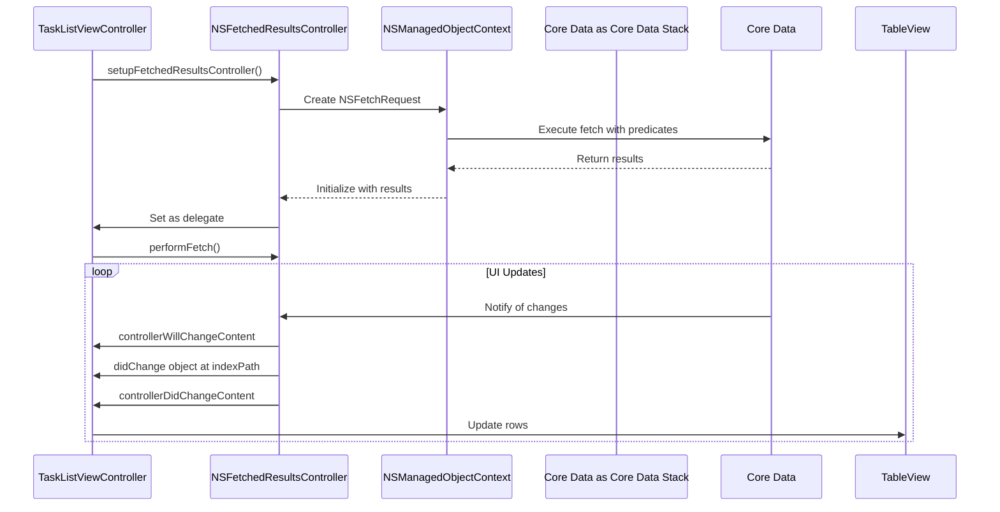
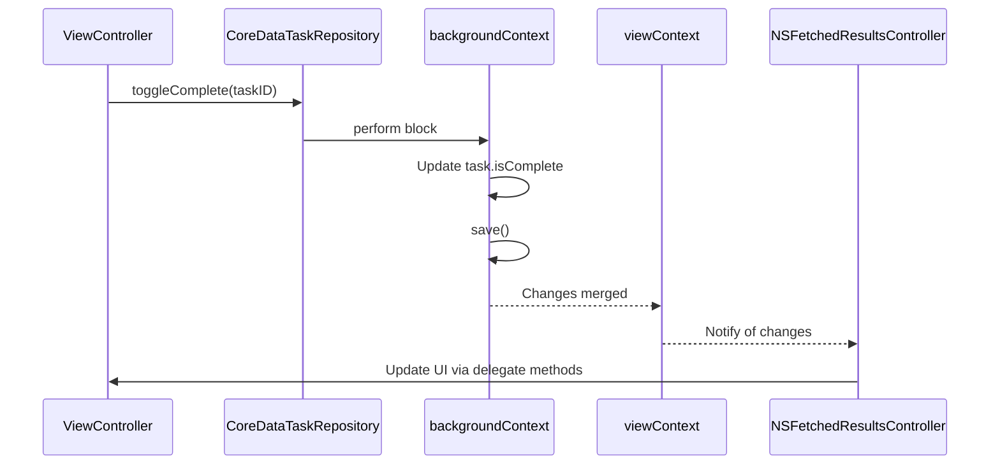
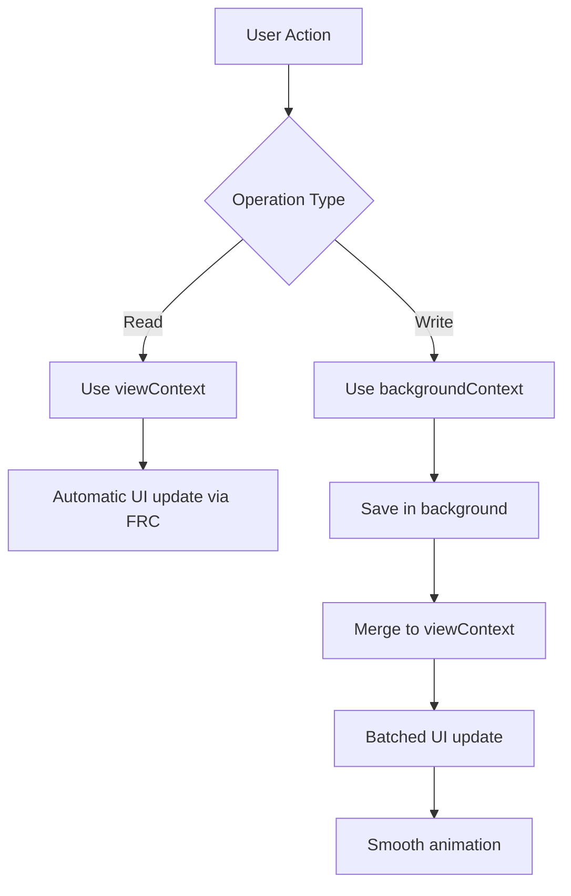

# Data Fetching and Performance Optimization

<cite>
**Referenced Files in This Document**   
- [TaskListViewController.swift](file://To%20Do%20List/ViewControllers/TaskListViewController.swift#L0-L479)
- [CoreDataTaskRepository.swift](file://To%20Do%20List/Repositories/CoreDataTaskRepository.swift#L0-L455)
- [README.md](file://README.md#L572-L651)
</cite>

## Table of Contents
1. [Introduction](#introduction)
2. [Core Data Fetching Strategies](#core-data-fetching-strategies)
3. [NSFetchedResultsController Implementation](#nsfetchedresultscontroller-implementation)
4. [Background Context Operations](#background-context-operations)
5. [Fetch Request Configuration](#fetch-request-configuration)
6. [Performance Optimization Techniques](#performance-optimization-techniques)
7. [Common Performance Bottlenecks and Solutions](#common-performance-bottlenecks-and-solutions)
8. [Profiling and Best Practices](#profiling-and-best-practices)

## Introduction
This document provides a comprehensive analysis of data fetching strategies and performance optimization techniques implemented in the Tasker application. The application leverages Core Data with NSFetchedResultsController for efficient data management and UI updates, while employing background contexts for long-running operations. The architecture has evolved from a legacy singleton pattern to a modern repository pattern with dependency injection, significantly improving performance, testability, and maintainability.

## Core Data Fetching Strategies

The Tasker application implements a sophisticated data fetching strategy that combines the repository pattern with Core Data's powerful querying capabilities. This approach ensures efficient data retrieval while maintaining a clean separation of concerns between the data layer and presentation layer.

The core fetching strategy revolves around the `CoreDataTaskRepository` class, which serves as the concrete implementation of the `TaskRepository` protocol. This repository pattern abstracts data access operations and provides a consistent interface for the rest of the application.

```swift
final class CoreDataTaskRepository: TaskRepository {
    private let viewContext: NSManagedObjectContext
    private let backgroundContext: NSManagedObjectContext
    private let defaultProject: String
}
```

The repository maintains two managed object contexts:
- **viewContext**: Used for reading data and displaying in the UI
- **backgroundContext**: Used for background operations like saving and updating

This separation allows the application to perform long-running operations without blocking the main thread, ensuring a responsive user interface.

**Section sources**
- [CoreDataTaskRepository.swift](file://To%20Do%20List/Repositories/CoreDataTaskRepository.swift#L15-L25)

## NSFetchedResultsController Implementation

The `TaskListViewController` demonstrates a comprehensive implementation of `NSFetchedResultsController` for efficient UI updates. This controller is specifically designed to work with table views, providing automatic change tracking and UI updates when the underlying data changes.



**Diagram sources**
- [TaskListViewController.swift](file://To%20Do%20List/ViewControllers/TaskListViewController.swift#L15-L20)

The implementation includes several key components:

### Fetch Request Configuration
The fetch request is dynamically configured based on various filters including task type, project name, date range, and completion status. The predicates are built programmatically to handle complex filtering requirements.

```swift
private func setupFetchedResultsController() {
    let fetchRequest: NSFetchRequest<NTask> = NTask.fetchRequest()
    
    var predicates: [NSPredicate] = []
    
    // Filter by task type if specified
    if let taskType = taskType {
        predicates.append(NSPredicate(format: "taskType == %d", taskType.rawValue))
    }
    
    // Filter by project name if specified
    if let projectName = projectName {
        predicates.append(NSPredicate(format: "project ==[c] %@", projectName))
    }
}
```

### Delegate Methods for UI Updates
The `NSFetchedResultsControllerDelegate` methods handle UI updates efficiently by batching changes and animating row insertions, deletions, and updates.

```swift
extension TaskListViewController: NSFetchedResultsControllerDelegate {
    func controllerWillChangeContent(_ controller: NSFetchedResultsController<NSFetchRequestResult>) {
        tableView.beginUpdates()
    }
    
    func controller(_ controller: NSFetchedResultsController<NSFetchRequestResult>, 
                   didChange anObject: Any, 
                   at indexPath: IndexPath?, 
                   for type: NSFetchedResultsChangeType, 
                   newIndexPath: IndexPath?) {
        
        switch type {
        case .insert:
            guard let newIndexPath = newIndexPath else { return }
            tableView.insertRows(at: [newIndexPath], with: .automatic)
            
        case .delete:
            guard let indexPath = indexPath else { return }
            tableView.deleteRows(at: [indexPath], with: .automatic)
            
        case .update:
            guard let indexPath = indexPath else { return }
            if let cell = tableView.cellForRow(at: indexPath) as? TaskCell,
               let task = controller.object(at: indexPath) as? NTask {
                cell.configure(with: task)
            }
            
        case .move:
            guard let indexPath = indexPath, let newIndexPath = newIndexPath else { return }
            tableView.moveRow(at: indexPath, to: newIndexPath)
            
        @unknown default:
            break
        }
    }
    
    func controllerDidChangeContent(_ controller: NSFetchedResultsController<NSFetchRequestResult>) {
        tableView.endUpdates()
    }
}
```

The delegate methods wrap all UI updates in `beginUpdates()` and `endUpdates()` calls, which ensures that multiple changes are animated as a single batch, improving performance and providing a smoother user experience.

**Section sources**
- [TaskListViewController.swift](file://To%20Do%20List/ViewControllers/TaskListViewController.swift#L200-L300)

## Background Context Operations

The application employs background contexts for long-running operations such as bulk imports, analytics calculations, and data synchronization. This approach prevents UI blocking and ensures a responsive user interface.

### Context Configuration
The `CoreDataTaskRepository` initializes both view and background contexts with appropriate configurations:

```swift
init(container: NSPersistentContainer, defaultProject: String = "Inbox") {
    self.viewContext = container.viewContext
    self.backgroundContext = container.newBackgroundContext()
    self.defaultProject = defaultProject
    
    // Configure contexts
    self.viewContext.automaticallyMergesChangesFromParent = true
    self.backgroundContext.mergePolicy = NSMergeByPropertyObjectTrumpMergePolicy
}
```

Key configuration settings:
- **viewContext.automaticallyMergesChangesFromParent = true**: Ensures the main context automatically receives changes from parent contexts
- **backgroundContext.mergePolicy = NSMergeByPropertyObjectTrumpMergePolicy**: Resolves merge conflicts by favoring changes from the background context

### Asynchronous Operations
All write operations are performed on the background context using `perform` blocks:

```swift
func addTask(data: TaskData, completion: ((Result<NTask, Error>) -> Void)?) {
    backgroundContext.perform {
        let managed = NTask(context: self.backgroundContext)
        // Configure task properties
        managed.name = data.name
        managed.taskDetails = data.details
        managed.taskType = data.type.rawValue
        // ... other properties
        
        do {
            try self.backgroundContext.save()
            // Get the object in the main context for the delegate
            guard let mainContextTask = self.viewContext.object(with: managed.objectID) as? NTask else {
                // Handle error
                return
            }
            DispatchQueue.main.async { completion?(.success(mainContextTask)) }
        } catch {
            print("❌ Task add error: \(error)")
            DispatchQueue.main.async { completion?(.failure(error)) }
        }
    }
}
```

This pattern ensures that:
1. Data manipulation occurs on a background thread
2. Context saving happens off the main thread
3. Completion callbacks are dispatched to the main queue for UI updates
4. The main context is updated with changes from the background context

### Change Propagation
When a background context saves changes, those changes are automatically propagated to the view context due to the `automaticallyMergesChangesFromParent` setting. This triggers the `NSFetchedResultsController` to update the UI through its delegate methods.



**Diagram sources**
- [CoreDataTaskRepository.swift](file://To%20Do%20List/Repositories/CoreDataTaskRepository.swift#L100-L150)

**Section sources**
- [CoreDataTaskRepository.swift](file://To%20Do%20List/Repositories/CoreDataTaskRepository.swift#L50-L150)

## Fetch Request Configuration

The application implements sophisticated fetch request configurations to support various filtering and sorting requirements across different views.

### Sorting Strategies
Tasks are sorted by priority (highest first) and then by due date (earliest first):

```swift
fetchRequest.sortDescriptors = [
    NSSortDescriptor(key: "taskPriority.rawValue", ascending: false),  // Higher priority first
    NSSortDescriptor(key: "dueDate", ascending: true)                  // Earlier due date first
]
```

This sorting strategy ensures that high-priority tasks appear at the top of the list, while tasks with earlier due dates are grouped together.

### Filtering by Date
The application implements complex date-based filtering to handle various scenarios:

```swift
// Filter by date range
let startOfDay = selectedDate.startOfDay
let endOfDay = Calendar.current.date(byAdding: .day, value: 1, to: startOfDay)!

// For today, include overdue items
if Calendar.current.isDateInToday(selectedDate) {
    // Include both due today and overdue
    let dueTodayPredicate = NSPredicate(
        format: "dueDate >= %@ AND dueDate < %@ AND isComplete == NO",
        startOfDay as NSDate,
        endOfDay as NSDate
    )
    
    let overduePredicate = NSPredicate(
        format: "dueDate < %@ AND isComplete == NO",
        startOfDay as NSDate
    )
    
    predicates.append(NSCompoundPredicate(
        orPredicateWithSubpredicates: [dueTodayPredicate, overduePredicate]
    ))
}
```

This approach ensures that overdue tasks are visible in the today's view, providing users with a comprehensive view of their immediate tasks.

### Filtering by Project
Project-based filtering uses case-insensitive string comparison:

```swift
if let projectName = projectName {
    predicates.append(NSPredicate(format: "project ==[c] %@", projectName))
}
```

The `[c]` modifier makes the comparison case-insensitive, improving the user experience when filtering by project names.

### Compound Predicates
The application combines multiple predicates using `NSCompoundPredicate` to create complex filtering conditions:

```swift
// Combine all predicates with AND
if predicates.count > 1 {
    fetchRequest.predicate = NSCompoundPredicate(andPredicateWithSubpredicates: predicates)
} else if predicates.count == 1 {
    fetchRequest.predicate = predicates.first
}
```

This allows for flexible filtering by combining multiple criteria such as task type, project, date range, and completion status.

**Section sources**
- [TaskListViewController.swift](file://To%20Do%20List/ViewControllers/TaskListViewController.swift#L250-L300)

## Performance Optimization Techniques

The application implements several performance optimization techniques to ensure smooth scrolling, fast search responses, and minimal UI lag.

### Efficient UI Updates
The use of `NSFetchedResultsController` with proper delegate implementation ensures that only the necessary UI updates are performed:

```swift
func controllerWillChangeContent(_ controller: NSFetchedResultsController<NSFetchRequestResult>) {
    tableView.beginUpdates()
}

func controller(_ controller: NSFetchedResultsController<NSFetchRequestResult>, 
               didChange anObject: Any, 
               at indexPath: IndexPath?, 
               for type: NSFetchedResultsChangeType, 
               newIndexPath: IndexPath?) {
    
    switch type {
    case .insert:
        guard let newIndexPath = newIndexPath else { return }
        tableView.insertRows(at: [newIndexPath], with: .automatic)
        
    case .delete:
        guard let indexPath = indexPath else { return }
        tableView.deleteRows(at: [indexPath], with: .automatic)
        
    case .update:
        guard let indexPath = indexPath else { return }
        if let cell = tableView.cellForRow(at: indexPath) as? TaskCell,
           let task = controller.object(at: indexPath) as? NTask {
            cell.configure(with: task)
        }
        
    case .move:
        guard let indexPath = indexPath, let newIndexPath = newIndexPath else { return }
        tableView.moveRow(at: indexPath, to: newIndexPath)
        
    @unknown default:
        break
    }
}

func controllerDidChangeContent(_ controller: NSFetchedResultsController<NSFetchRequestResult>) {
    tableView.endUpdates()
}
```

This approach minimizes UI updates by:
- Batching multiple changes together
- Animating insertions, deletions, and moves efficiently
- Only updating cells that have actually changed

### Context Management
The separation of view and background contexts prevents UI blocking during data operations:

```swift
// View context for reading
viewContext.perform {
    // Fetch operations
}

// Background context for writing
backgroundContext.perform {
    // Save operations
}
```

This ensures that even during intensive data operations, the UI remains responsive.

### Memory Efficiency
The application avoids caching fetched results by setting `cacheName: nil`:

```swift
fetchedResultsController = NSFetchedResultsController(
    fetchRequest: fetchRequest,
    managedObjectContext: viewContext,
    sectionNameKeyPath: nil,
    cacheName: nil            // Don't cache results
)
```

This prevents memory bloat when dealing with large result sets, as the results are not stored in memory beyond what's needed for the current UI state.

**Section sources**
- [TaskListViewController.swift](file://To%20Do%20List/ViewControllers/TaskListViewController.swift#L300-L350)

## Common Performance Bottlenecks and Solutions

### Large Result Sets
**Problem**: Fetching large numbers of tasks can cause memory pressure and slow UI updates.

**Solution**: The application addresses this by:
1. Using `NSFetchedResultsController` which only keeps visible rows in memory
2. Implementing efficient sorting and filtering to reduce result set size
3. Avoiding result caching to prevent memory bloat

```swift
// No batch size explicitly set, but NSFetchedResultsController handles memory efficiently
// by only faulting in objects as needed
```

### Frequent UI Updates
**Problem**: Rapid task modifications (completing, rescheduling) can trigger excessive UI updates.

**Solution**: The application uses:
1. Batched UI updates with `beginUpdates()` and `endUpdates()`
2. Background contexts to prevent UI blocking
3. Efficient change tracking with `NSFetchedResultsController`



**Diagram sources**
- [CoreDataTaskRepository.swift](file://To%20Do%20List/Repositories/CoreDataTaskRepository.swift#L100-L150)

### Complex Filtering Operations
**Problem**: Combining multiple filters (date, project, priority) can slow down fetch operations.

**Solution**: The application optimizes filtering by:
1. Building predicates programmatically based on active filters
2. Using compound predicates to combine multiple conditions efficiently
3. Leveraging Core Data's indexing capabilities

```swift
// Example of optimized predicate building
var predicates: [NSPredicate] = []

if let taskType = taskType {
    predicates.append(NSPredicate(format: "taskType == %d", taskType.rawValue))
}

if let projectName = projectName {
    predicates.append(NSPredicate(format: "project ==[c] %@", projectName))
}

// Combine with AND
if predicates.count > 1 {
    fetchRequest.predicate = NSCompoundPredicate(andPredicateWithSubpredicates: predicates)
} else if predicates.count == 1 {
    fetchRequest.predicate = predicates.first
}
```

## Profiling and Best Practices

### Profiling with Instruments
To identify and resolve performance issues, use the following Instruments tools:

1. **Core Data Instruments**: Monitor fetch request performance and identify slow queries
2. **Time Profiler**: Identify CPU bottlenecks in data processing
3. **Allocations**: Track memory usage and identify leaks
4. **Leaks**: Detect memory leaks in Core Data objects

**Best Practices for Core Data Performance:**

1. **Use NSFetchedResultsController**: For table views and collection views to minimize UI updates
2. **Separate Contexts**: Use background contexts for write operations to prevent UI blocking
3. **Efficient Predicates**: Build predicates carefully to leverage Core Data indexing
4. **Minimize Faulting**: Access only the properties you need to reduce faulting
5. **Batch Updates**: Use `beginUpdates()` and `endUpdates()` for multiple changes
6. **Avoid Caching**: Set `cacheName: nil` unless you specifically need result caching
7. **Proper Merging**: Configure context merging policies appropriately
8. **Asynchronous Completion**: Always dispatch completion callbacks to the main queue

**Performance Monitoring:**
The application uses Firebase Performance Monitoring to track key metrics:

```swift
// Firebase is initialized in AppDelegate for performance monitoring
// This helps identify slow operations and optimize accordingly
```

By following these best practices and using the implemented patterns, the Tasker application achieves smooth scrolling, fast search responses, and responsive UI even with large task lists.

**Section sources**
- [README.md](file://README.md#L1391-L1404)