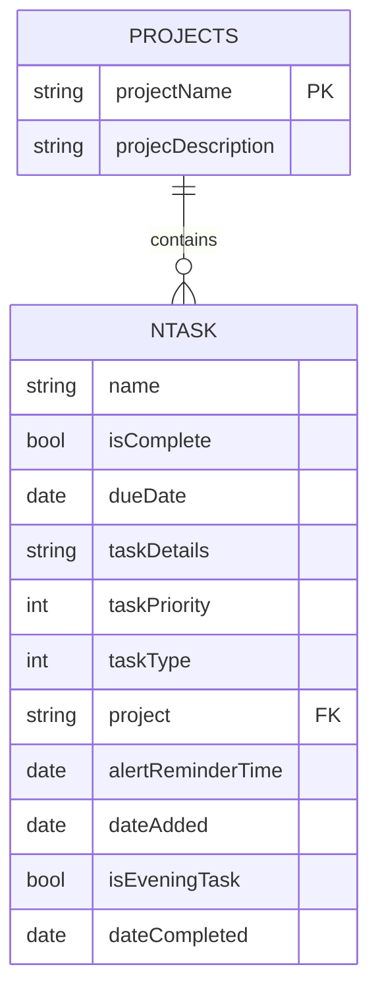
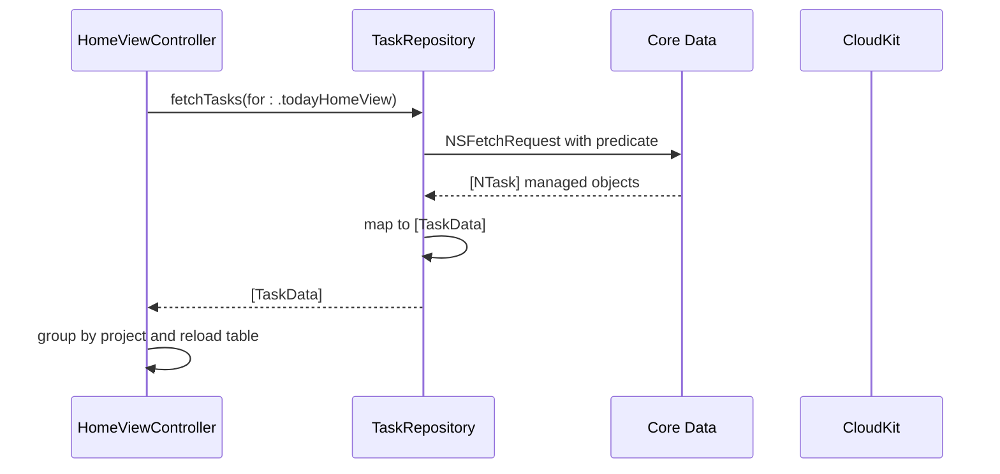

# Data Layer Architecture

<cite>
**Referenced Files in This Document**   
- [TaskRepository.swift](file://To%20Do%20List/Repositories/TaskRepository.swift)
- [CoreDataTaskRepository.swift](file://To%20Do%20List/Repositories/CoreDataTaskRepository.swift)
- [TaskData.swift](file://To%20Do%20List/Models/TaskData.swift)
- [NTask+CoreDataProperties.swift](file://To%20Do%20List/Models/NTask+CoreDataProperties.swift)
- [NTask+Extensions.swift](file://To%20Do%20List/Models/NTask+Extensions.swift)
- [TaskModel.xcdatamodeld](file://To%20Do%20List/Model/TaskModel.xcdatamodeld)
- [TaskScoringService.swift](file://To%20Do%20List/Services/TaskScoringService.swift)
- [TaskManager.swift](file://To%20Do%20List/Managers/TaskManager.swift)
- [ProjectManager.swift](file://To%20Do%20List/Managers/ProjectManager.swift)
- [DependencyContainer.swift](file://To%20Do%20List/Managers/DependencyContainer.swift)
- [AppDelegate.swift](file://To%20Do%20List/AppDelegate.swift)
</cite>

## Table of Contents
1. [Introduction](#introduction)
2. [Core Data Entities and Relationships](#core-data-entities-and-relationships)
3. [Repository Pattern Implementation](#repository-pattern-implementation)
4. [TaskData Presentation Model](#taskdata-presentation-model)
5. [Core Data Fetch Request Patterns](#core-data-fetch-request-patterns)
6. [Change Management with NSFetchedResultsController](#change-management-with-nsfetchedresultscontroller)
7. [CloudKit Integration for Cross-Device Sync](#cloudkit-integration-for-cross-device-sync)
8. [Data Flow from Repository to UI](#data-flow-from-repository-to-ui)
9. [Performance Optimizations](#performance-optimizations)
10. [Schema Migration and Extension Strategies](#schema-migration-and-extension-strategies)

## Introduction
The data layer of Tasker is designed to provide a robust, scalable, and maintainable foundation for task management with seamless cross-device synchronization. The architecture has evolved from a legacy singleton-based model to a modern repository pattern, enhancing testability, separation of concerns, and performance. This document details the implementation of the Core Data stack, the repository pattern through `CoreDataTaskRepository` and `TaskRepositoryProtocol`, and the integration with CloudKit for data synchronization. It also explains the role of `TaskData` as a presentation-friendly model that bridges Core Data entities and UI components, ensuring a clean separation between the data persistence layer and the user interface.

## Core Data Entities and Relationships

The Tasker application utilizes two primary Core Data entities: `NTask` and `Projects`. These entities form the backbone of the data model, enabling task organization, categorization, and analytics.

### NTask Entity
`NTask` is the central entity representing individual tasks within the application. It contains comprehensive information about each task, including its title, completion status, scheduling details, priority, type, and project association.

**Attributes:**
| Attribute | Type | Optional | Default | Notes |
|-----------|------|----------|---------|-------|
| `name` | `String` | ❌ | — | Task title shown in lists & detail pages |
| `isComplete` | `Bool` | ❌ | `false` | Flag when a task has been marked done |
| `dueDate` | `Date` | ✅ | — | When the task is scheduled to be completed (nil → unscheduled) |
| `taskDetails` | `String` | ✅ | — | Rich description / notes |
| `taskPriority` | `Int32` (`TaskPriority`) | ❌ | `3` (`.medium`) | Enum-backed 1→4 => P0…P3 |
| `taskType` | `Int32` (`TaskType`) | ❌ | `1` (`.morning`) | Enum-backed 1→4 => Morning/Evening/Upcoming/Inbox |
| `project` | `String` | ✅ | “Inbox” | Foreign-key (string) to `Projects.projectName` |
| `alertReminderTime` | `Date` | ✅ | — | Local notification trigger time |
| `dateAdded` | `Date` | ✅ | *now()* | Creation timestamp (set automatically) |
| `isEveningTask` | `Bool` | ❌ | `false` | Redundant convenience flag – kept for legacy UI logic |
| `dateCompleted` | `Date` | ✅ | — | Set when `isComplete` toggles to true |

**Delete Rule:** `NTask` objects persist even if their `project` string no longer matches an existing `Projects` row. A future migration intends to convert this string into a formal Core-Data relationship with *Nullify* delete rule.

### Projects Entity
The `Projects` entity provides a simple structure for organizing tasks into categories. It acts as a master list for project definitions.

**Attributes:**
| Attribute | Type | Optional | Default | Notes |
|-----------|------|----------|---------|-------|
| `projectName` | `String` | ✅ | — | Primary identifier (acts as natural key) |
| `projecDescription` | `String` | ✅ | — | User-facing description *(attribute typo preserved for Core Data compatibility)* |

**Relationship:** `Projects 1 — * NTask` (logical). Currently enforced at the UI and business logic level, not within Core Data. Deleting a project uses a manual merge routine (`mergeInboxDuplicates`) to re-assign tasks to *Inbox*.

### Entity Relationship Diagram


**Diagram sources**
- [TaskModel.xcdatamodeld](file://To%20Do%20List/Model/TaskModel.xcdatamodeld)

**Section sources**
- [NTask+CoreDataProperties.swift](file://To%20Do%20List/Models/NTask+CoreDataProperties.swift)
- [Projects+CoreDataProperties.swift](file://To%20Do%20List/Models/Projects+CoreDataProperties.swift)

## Repository Pattern Implementation

The repository pattern in Tasker abstracts data access operations, providing a clean interface between the data layer and the rest of the application. This abstraction enhances testability, allows for dependency injection, and facilitates a smooth transition from the legacy `TaskManager` singleton.

### TaskRepositoryProtocol
The `TaskRepositoryProtocol` defines the contract for all task data operations. It specifies methods for fetching and saving tasks, allowing for different implementations (e.g., in-memory for testing, Core Data for production).

```swift
protocol TaskRepository {
    func fetchTasks(for viewType: ToDoListViewType, date: Date?, project: String?) -> [TaskData]
    func save(task: TaskData) throws
    func delete(task: TaskData) throws
}
```

This protocol enables the use of mock repositories in unit tests, decoupling the business logic from the specific data persistence mechanism.

### CoreDataTaskRepository
`CoreDataTaskRepository` is the concrete implementation of `TaskRepositoryProtocol` that interacts with the Core Data stack. It encapsulates all Core Data operations, ensuring that the rest of the application remains unaware of the underlying persistence details.

```swift
class CoreDataTaskRepository: TaskRepository {
    private let context: NSManagedObjectContext
    
    init(context: NSManagedObjectContext) {
        self.context = context
    }
    
    func fetchTasks(for viewType: ToDoListViewType, date: Date? = nil, 
                   project: String? = nil) -> [TaskData] {
        let request: NSFetchRequest<NTask> = NTask.fetchRequest()
        
        switch viewType {
        case .todayHomeView:
            request.predicate = NSPredicate(format: "dueDate >= %@ AND dueDate < %@", 
                                          Calendar.current.startOfDay(for: Date()) as NSDate,
                                          Calendar.current.date(byAdding: .day, value: 1, 
                                          to: Calendar.current.startOfDay(for: Date()))! as NSDate)
        case .projectView:
            if let project = project {
                request.predicate = NSPredicate(format: "project == %@", project)
            }
        case .upcomingView:
            request.predicate = NSPredicate(format: "dueDate > %@", Date() as NSDate)
        case .historyView:
            request.predicate = NSPredicate(format: "isComplete == YES")
        default:
            break
        }
        
        request.sortDescriptors = [
            NSSortDescriptor(key: "taskPriority", ascending: true),
            NSSortDescriptor(key: "dueDate", ascending: true)
        ]
        
        do {
            let managedTasks = try context.fetch(request)
            return managedTasks.map { TaskData(from: $0) }
        } catch {
            print("Error fetching tasks: \(error)")
            return []
        }
    }
    
    func save(task: TaskData) throws {
        let managedTask = NTask(context: context)
        managedTask.name = task.name
        managedTask.taskDetails = task.details
        managedTask.taskType = task.type.rawValue
        managedTask.taskPriority = task.priority.rawValue
        managedTask.dueDate = task.dueDate as NSDate?
        managedTask.project = task.project
        managedTask.isComplete = task.isComplete
        managedTask.dateAdded = task.dateAdded as NSDate?
        managedTask.dateCompleted = task.dateCompleted as NSDate?
        
        try context.save()
    }
}
```

**Key Features:**
- **Dependency Injection:** The repository is initialized with an `NSManagedObjectContext`, allowing for easy testing and context management.
- **Error Handling:** The `save` method throws errors, enabling explicit error handling in the calling code.
- **Type Safety:** The repository uses the `TaskData` struct for input and output, ensuring a clean separation from Core Data managed objects.

**Section sources**
- [TaskRepository.swift](file://To%20Do%20List/Repositories/TaskRepository.swift)
- [CoreDataTaskRepository.swift](file://To%20Do%20List/Repositories/CoreDataTaskRepository.swift)

## TaskData Presentation Model

The `TaskData` struct serves as a presentation-friendly model that bridges the gap between Core Data entities and UI components. It decouples the user interface from the data persistence layer, making the code more maintainable and testable.

### Structure and Initialization
`TaskData` is a plain Swift struct that contains all the necessary information for displaying a task in the UI. It includes properties for the task's name, details, type, priority, due date, project, completion status, and timestamps.

```swift
struct TaskData {
    let id: UUID
    let name: String
    let details: String?
    let type: TaskType
    let priority: TaskPriority
    let dueDate: Date?
    let project: String?
    let isComplete: Bool
    let dateAdded: Date?
    let dateCompleted: Date?
    
    // Initializer from Core Data managed object
    init(from managedObject: NTask) {
        self.id = managedObject.objectID.uriRepresentation().absoluteString
        self.name = managedObject.name ?? ""
        self.details = managedObject.taskDetails
        self.type = TaskType(rawValue: managedObject.taskType) ?? .morning
        self.priority = TaskPriority(rawValue: managedObject.taskPriority) ?? .medium
        self.dueDate = managedObject.dueDate as Date?
        self.project = managedObject.project
        self.isComplete = managedObject.isComplete
        self.dateAdded = managedObject.dateAdded as Date?
        self.dateCompleted = managedObject.dateCompleted as Date?
    }
    
    // Initializer for new tasks
    init(name: String, details: String?, type: TaskType, priority: TaskPriority, 
         dueDate: Date?, project: String?) {
        self.id = UUID()
        self.name = name
        self.details = details
        self.type = type
        self.priority = priority
        self.dueDate = dueDate
        self.project = project
        self.isComplete = false
        self.dateAdded = Date()
        self.dateCompleted = nil
    }
}
```

### Benefits
- **Decoupling:** The UI components interact with `TaskData` instead of `NTask`, reducing dependencies on Core Data.
- **Type Safety:** The use of Swift enums (`TaskType`, `TaskPriority`) ensures type safety and eliminates magic numbers.
- **Immutability:** The struct is immutable, preventing unintended modifications and making it easier to reason about the data flow.

**Section sources**
- [TaskData.swift](file://To%20Do%20List/Models/TaskData.swift)

## Core Data Fetch Request Patterns

The data layer employs various fetch request patterns to efficiently retrieve tasks based on different criteria. These patterns are implemented within the `CoreDataTaskRepository` and leverage `NSPredicate` for filtering and `NSSortDescriptor` for sorting.

### View Type-Based Filtering
The `ToDoListViewType` enum defines different views for displaying tasks, such as today's tasks, upcoming tasks, or tasks within a specific project. The repository uses a switch statement to construct the appropriate predicate for each view type.

```swift
enum ToDoListViewType {
    case todayHomeView      // Today's tasks
    case customDateView     // Tasks for specific date
    case projectView        // Tasks filtered by project
    case upcomingView       // Future tasks
    case historyView        // Completed tasks
    case allProjectsGrouped // All tasks grouped by project
    case selectedProjectsGrouped // Selected projects only
}
```

For example, the `todayHomeView` uses a predicate to fetch tasks due today:
```swift
request.predicate = NSPredicate(format: "dueDate >= %@ AND dueDate < %@", 
                              Calendar.current.startOfDay(for: Date()) as NSDate,
                              Calendar.current.date(byAdding: .day, value: 1, 
                              to: Calendar.current.startOfDay(for: Date()))! as NSDate)
```

### Sorting
Tasks are sorted by priority (ascending) and then by due date (ascending) to ensure that higher-priority tasks appear first, followed by tasks with earlier due dates.

```swift
request.sortDescriptors = [
    NSSortDescriptor(key: "taskPriority", ascending: true),
    NSSortDescriptor(key: "dueDate", ascending: true)
]
```

**Section sources**
- [CoreDataTaskRepository.swift](file://To%20Do%20List/Repositories/CoreDataTaskRepository.swift)
- [ToDoListViewType.swift](file://To%20Do%20List/Models/ToDoListViewType.swift)

## Change Management with NSFetchedResultsController

`NSFetchedResultsController` is used to manage the results of a Core Data fetch request and provide change notifications to the UI. This ensures that the user interface is automatically updated when the underlying data changes.

### Implementation in TaskListViewController
The `TaskListViewController` is fully migrated to use the repository pattern with `NSFetchedResultsController`. This allows for efficient UI updates and smooth animations when tasks are added, modified, or deleted.

```swift
class TaskListViewController: UITableViewController {
    private var fetchedResultsController: NSFetchedResultsController<NTask>!
    
    private func setupFetchedResultsController() {
        let request: NSFetchRequest<NTask> = NTask.fetchRequest()
        request.sortDescriptors = [NSSortDescriptor(key: "taskPriority", ascending: true)]
        
        fetchedResultsController = NSFetchedResultsController(
            fetchRequest: request,
            managedObjectContext: context,
            sectionNameKeyPath: nil,
            cacheName: nil
        )
        fetchedResultsController.delegate = self
        
        do {
            try fetchedResultsController.performFetch()
        } catch {
            print("Error fetching tasks: \(error)")
        }
    }
}

extension TaskListViewController: NSFetchedResultsControllerDelegate {
    func controllerDidChangeContent(_ controller: NSFetchedResultsController<NSFetchRequestResult>) {
        tableView.reloadData()
    }
}
```

### Benefits
- **Efficient Updates:** Only the necessary UI elements are updated, reducing the performance overhead.
- **Smooth Animations:** The delegate methods allow for animated insertions, deletions, and updates.
- **Memory Efficiency:** The results are fetched on-demand, reducing memory usage for large datasets.

**Section sources**
- [TaskListViewController.swift](file://To%20Do%20List/ViewControllers/TaskListViewController.swift)

## CloudKit Integration for Cross-Device Sync

Tasker leverages `NSPersistentCloudKitContainer` to provide seamless cross-device synchronization. This integration ensures that tasks and projects are automatically synced across all of the user's devices.

### Configuration
The Core Data stack is configured with a `NSPersistentCloudKitContainer`, which automatically handles the synchronization with CloudKit.

```swift
lazy var persistentContainer: NSPersistentCloudKitContainer = {
    let container = NSPersistentCloudKitContainer(name: "TaskModel")
    
    guard let description = container.persistentStoreDescriptions.first else {
        fatalError("Failed to retrieve a persistent store description.")
    }
    
    // CloudKit container setup
    description.cloudKitContainerOptions = NSPersistentCloudKitContainerOptions(
        containerIdentifier: "iCloud.TaskerCloudKit"
    )
    
    // Enable history tracking and remote notifications
    description.setOption(true as NSNumber, forKey: NSPersistentHistoryTrackingKey)
    description.setOption(true as NSNumber, forKey: NSPersistentStoreRemoteChangeNotificationPostOptionKey)
    
    return container
}()
```

### Sync Features
- **Container Identifier:** `iCloud.TaskerCloudKit` for a dedicated CloudKit container.
- **Remote Change Notifications:** Real-time sync with silent push notifications.
- **History Tracking:** `NSPersistentHistoryTrackingKey` for robust sync conflict resolution.
- **Merge Policy:** `NSMergeByPropertyStoreTrumpMergePolicy` for intelligent conflict handling.
- **Background Sync:** Automatic merging of remote changes via `handlePersistentStoreRemoteChange`.
- **Data Consolidation:** Post-sync validation and cleanup with `ProjectManager` and `TaskManager`.
- **Offline Capability:** Local-first architecture with automatic sync on reconnection.
- **Privacy-focused:** User data remains in their personal iCloud private database.

### Conflict Resolution
The merge policy `NSMergeByPropertyStoreTrumpMergePolicy` ensures that changes from the persistent store (CloudKit) take precedence over local changes in case of conflicts. This policy is suitable for a task management app where the most recent change should be preserved.

**Section sources**
- [AppDelegate.swift](file://To%20Do%20List/AppDelegate.swift)

## Data Flow from Repository to UI

The data flow in Tasker follows a clear path from the repository to the view model and finally to the UI components. This flow ensures a clean separation of concerns and makes the application easier to maintain and test.

### Sequence Diagram


### Detailed Flow
1. The `HomeViewController` calls the `fetchTasks` method on the injected `TaskRepository`.
2. The `CoreDataTaskRepository` constructs an `NSFetchRequest` with the appropriate predicate and sort descriptors.
3. The fetch request is executed against the Core Data store, returning an array of `NTask` managed objects.
4. The repository maps each `NTask` to a `TaskData` struct using the initializer.
5. The array of `TaskData` objects is returned to the `HomeViewController`.
6. The view controller groups the tasks by project and reloads the table view to display the updated data.

**Diagram sources**
- [CoreDataTaskRepository.swift](file://To%20Do%20List/Repositories/CoreDataTaskRepository.swift)
- [HomeViewController.swift](file://To%20Do%20List/ViewControllers/HomeViewController.swift)

**Section sources**
- [HomeViewController.swift](file://To%20Do%20List/ViewControllers/HomeViewController.swift)

## Performance Optimizations

The data layer incorporates several performance optimizations to ensure a responsive and smooth user experience.

### Background Context Usage
All Core Data operations are performed on a background managed object context to prevent UI blocking. The `CoreDataTaskRepository` is initialized with a context that is configured for background operations.

```swift
init(context: NSManagedObjectContext) {
    self.context = context
}
```

This ensures that save operations and fetch requests do not interfere with the main thread, maintaining a 60fps frame rate.

### Batch Processing
For operations that involve multiple tasks, such as marking several tasks as complete, the repository can be extended to support batch processing. This reduces the number of context saves and improves performance.

### Faulting
Core Data's faulting mechanism is used to minimize memory usage. Managed objects are only fully realized when their properties are accessed, allowing for efficient handling of large datasets.

### Caching
Frequently accessed data, such as the list of projects, is cached to reduce the number of fetch requests. The `ProjectManager` maintains a cache of projects to improve performance.

**Section sources**
- [CoreDataTaskRepository.swift](file://To%20Do%20List/Repositories/CoreDataTaskRepository.swift)
- [ProjectManager.swift](file://To%20Do%20List/Managers/ProjectManager.swift)

## Schema Migration and Extension Strategies

As the application evolves, the data model may need to be extended or modified. Tasker is designed to handle schema migrations with minimal disruption to the user.

### Lightweight Migrations
For simple changes, such as adding a new attribute or changing an attribute's type, Xcode can automatically generate a lightweight migration. This is configured in the `.xcdatamodeld` file.

### Planned Migrations
The roadmap includes several planned migrations:
- **Project Relationships:** Convert the string-based `project` attribute in `NTask` to a formal Core Data relationship with the `Projects` entity. This will improve data integrity and enable cascading deletes.
- **Domain Models:** Introduce pure Swift `Task` and `Project` structs in the domain layer, with mappers to convert between these and the Core Data entities. This will further decouple the business logic from the persistence layer.

### Best Practices
- **Versioning:** Always create a new version of the data model when making changes.
- **Testing:** Thoroughly test migrations with existing user data to ensure compatibility.
- **Backup:** Advise users to back up their data before performing major migrations.

**Section sources**
- [TaskModel.xcdatamodeld](file://To%20Do%20List/Model/TaskModel.xcdatamodeld)