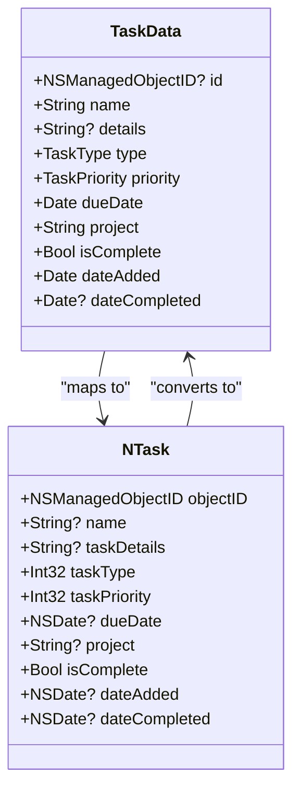
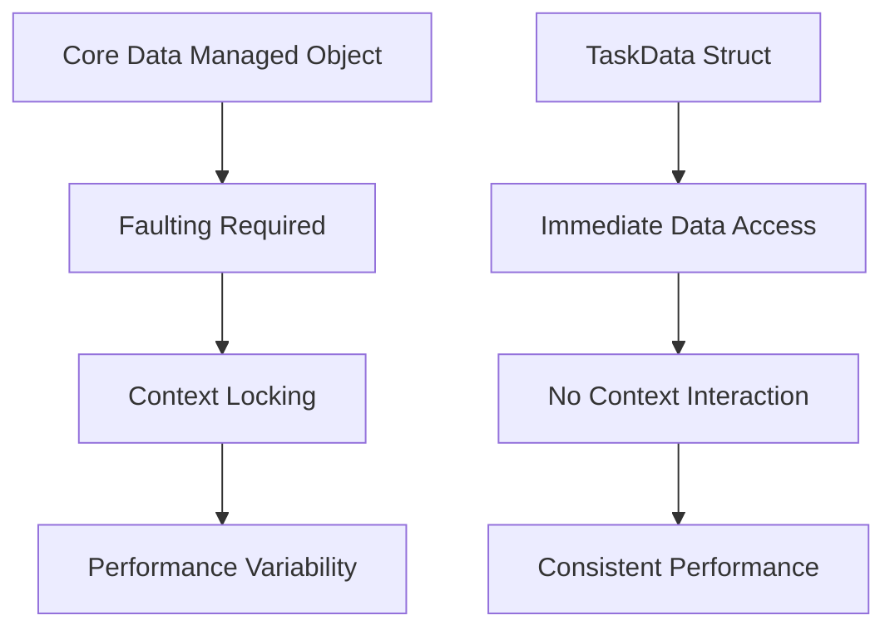
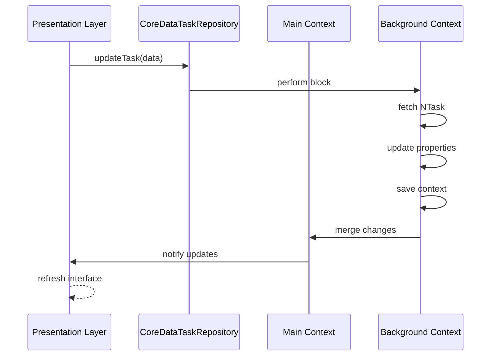

# Data Model Abstraction with TaskData

<cite>
**Referenced Files in This Document**   
- [TaskData.swift](file://To%20Do%20List/Models/TaskData.swift)
- [NTask+CoreDataProperties.swift](file://To%20Do%20List/NTask+CoreDataProperties.swift)
- [NTask+Extensions.swift](file://To%20Do%20List/NTask+Extensions.swift)
- [TaskManager.swift](file://To%20Do%20List/ViewControllers/TaskManager.swift)
- [CoreDataTaskRepository.swift](file://To%20Do%20List/Repositories/CoreDataTaskRepository.swift)
- [HomeViewController.swift](file://To%20Do%20List/ViewControllers/HomeViewController.swift)
</cite>

## Table of Contents
1. [Introduction](#introduction)
2. [TaskData Structure and Properties](#taskdata-structure-and-properties)
3. [NTask Core Data Entity](#ntask-core-data-entity)
4. [Mapping Logic Between NTask and TaskData](#mapping-logic-between-ntask-and-taskdata)
5. [Relationship Handling and Project Associations](#relationship-handling-and-project-associations)
6. [Performance Benefits and Faulting Reduction](#performance-benefits-and-faulting-reduction)
7. [Unit Testing Advantages](#unit-testing-advantages)
8. [Conversion Examples](#conversion-examples)
9. [Sync Challenges and Update Strategies](#sync-challenges-and-update-strategies)
10. [Deletion Handling Across Abstraction Layer](#deletion-handling-across-abstraction-layer)

## Introduction
The TaskData struct serves as a Swift-friendly abstraction layer over the NTask Core Data managed object, providing an immutable representation that simplifies data handling in the presentation layer. This document details how TaskData enables cleaner architecture by separating concerns between data persistence and UI presentation, while maintaining efficient synchronization with the underlying Core Data store.

**Section sources**
- [TaskData.swift](file://To%20Do%20List/Models/TaskData.swift#L1-L56)

## TaskData Structure and Properties
The TaskData struct provides a clean, immutable representation of task data for use in the presentation layer. It encapsulates all relevant task information in a format that is easy to work with in SwiftUI and UIKit components.

```swift
struct TaskData {
    let id: NSManagedObjectID?
    let name: String
    let details: String?
    let type: TaskType
    let priority: TaskPriority
    let dueDate: Date
    let project: String
    let isComplete: Bool
    let dateAdded: Date
    let dateCompleted: Date?
}
```

Key characteristics of TaskData:
- **Immutable**: All properties are declared with `let`, ensuring data integrity
- **Swift-native types**: Uses native Swift types like `Date` and `String` instead of `NSDate` and optional strings
- **Enum-based categorization**: Leverages `TaskType` and `TaskPriority` enums for type-safe access
- **Optional handling**: Provides sensible defaults for optional Core Data attributes

The struct includes two initializers: one for converting from an NTask managed object, and another for creating new tasks with specified properties.

**Section sources**
- [TaskData.swift](file://To%20Do%20List/Models/TaskData.swift#L1-L56)

## NTask Core Data Entity
The NTask entity represents the persistent storage model in Core Data, containing all task-related attributes that are saved to disk. It serves as the source of truth for task data.

### Core Data Attributes
| Attribute | Type | Optional | Default | Notes |
|-----------|------|----------|---------|-------|
| `name` | `String` | ❌ | — | Task title shown in lists & detail pages |
| `isComplete` | `Bool` | ❌ | `false` | Flag when a task has been marked done |
| `dueDate` | `NSDate` | ✅ | — | When the task is scheduled to be completed (nil → unscheduled) |
| `taskDetails` | `String` | ✅ | — | Rich description / notes |
| `taskPriority` | `Int32` | ❌ | `3` (`.medium`) | Enum-backed 1→4 => P0…P3 |
| `taskType` | `Int32` | ❌ | `1` (`.morning`) | Enum-backed 1→4 => Morning/Evening/Upcoming/Inbox |
| `project` | `String` | ✅ | "Inbox" | Foreign-key (string) to `Projects.projectName` |
| `alertReminderTime` | `NSDate` | ✅ | — | Local notification trigger time |
| `dateAdded` | `NSDate` | ✅ | *now()* | Creation timestamp (set automatically) |
| `isEveningTask` | `Bool` | ❌ | `false` | Redundant convenience flag – kept for legacy UI logic |
| `dateCompleted` | `NSDate` | ✅ | — | Set when `isComplete` toggles to true |

The NTask entity uses `Int32` values to store enum states, with corresponding extensions providing type-safe access through Swift enums.

**Section sources**
- [NTask+CoreDataProperties.swift](file://To%20Do%20List/NTask+CoreDataProperties.swift#L1-L53)
- [NTask+Extensions.swift](file://To%20Do%20List/NTask+Extensions.swift#L1-L75)

## Mapping Logic Between NTask and TaskData
The conversion between NTask and TaskData involves transforming Core Data managed object properties into Swift-native values while handling type conversions and providing default values for optional attributes.

### Type Conversions
The mapping process handles several type transformations:



**Diagram sources**
- [TaskData.swift](file://To%20Do%20List/Models/TaskData.swift#L1-L56)
- [NTask+CoreDataProperties.swift](file://To%20Do%20List/NTask+CoreDataProperties.swift#L1-L53)

### Property Transformation Details
- **ID Mapping**: The `NSManagedObjectID` is preserved to maintain reference to the underlying managed object
- **String Handling**: Optional Core Data strings are converted with defaults (e.g., `name ?? "Untitled Task"`)
- **Enum Conversion**: Raw `Int32` values are converted to Swift enums using `rawValue` initialization with fallbacks
- **Date Bridging**: `NSDate` objects are bridged to Swift `Date` objects with nil coalescing for optional dates
- **Default Values**: Sensible defaults are provided for missing values to ensure UI consistency

The bidirectional mapping ensures data integrity while providing a clean interface for the presentation layer.

**Section sources**
- [TaskData.swift](file://To%20Do%20List/Models/TaskData.swift#L1-L56)
- [NTask+Extensions.swift](file://To%20Do%20List/NTask+Extensions.swift#L1-L75)

## Relationship Handling and Project Associations
TaskData handles project associations through string-based references rather than Core Data relationships, simplifying the data model while maintaining flexibility.

### Project Reference Strategy
The `project` property in TaskData is a simple `String` that corresponds to a project name in the system. This approach:

- Avoids complex Core Data relationships that can impact performance
- Enables easy filtering and grouping by project name
- Simplifies data migration and synchronization
- Reduces memory footprint by avoiding object graph complexity

```swift
let project: String
```

When a task is created, it defaults to the "Inbox" project if no project is specified. This aligns with common task management patterns where unassigned tasks go to a default inbox.

### Project Management Integration
The system ensures data integrity through the ProjectManager class, which validates project references and maintains the existence of the default "Inbox" project. This separation allows TaskData to focus on task presentation while relying on dedicated services for project management.

**Section sources**
- [TaskData.swift](file://To%20Do%20List/Models/TaskData.swift#L1-L56)
- [NTask+CoreDataProperties.swift](file://To%20Do%20List/NTask+CoreDataProperties.swift#L1-L53)

## Performance Benefits and Faulting Reduction
The TaskData abstraction significantly improves application performance by reducing Core Data faulting and minimizing managed object context interactions.

### Faulting Elimination
By converting managed objects to plain Swift structs, TaskData eliminates the need for faulting:

- **No Dynamic Loading**: All data is immediately available without triggering Core Data fetches
- **Reduced Context Pressure**: Presentation layer operations don't stress the managed object context
- **Predictable Performance**: Data access has consistent timing regardless of object graph complexity

### Memory and Performance Advantages


**Diagram sources**
- [TaskData.swift](file://To%20Do%20List/Models/TaskData.swift#L1-L56)
- [CoreDataTaskRepository.swift](file://To%20Do%20List/Repositories/CoreDataTaskRepository.swift#L1-L455)

The immutable nature of TaskData also enables efficient diffing in collection views, reducing UI update overhead and improving scrolling performance in task lists.

**Section sources**
- [TaskData.swift](file://To%20Do%20List/Models/TaskData.swift#L1-L56)
- [CoreDataTaskRepository.swift](file://To%20Do%20List/Repositories/CoreDataTaskRepository.swift#L1-L455)

## Unit Testing Advantages
The TaskData abstraction greatly enhances testability by decoupling presentation logic from Core Data dependencies.

### Test Isolation Benefits
- **No Core Data Stack Required**: Tests can run without initializing Core Data
- **Easy Mocking**: TaskData instances can be created with specific test data
- **Deterministic Behavior**: Immutable structs ensure consistent test results
- **Faster Execution**: Tests run significantly faster without persistence overhead

### Testing Example
```swift
func testTaskCompletionScore() {
    // Create test data without Core Data
    let task = TaskData(
        name: "Test Task",
        type: .morning,
        priority: .high,
        dueDate: Date(),
        isComplete: true,
        dateCompleted: Date()
    )
    
    // Test presentation logic directly
    let viewModel = TaskViewModel(task: task)
    XCTAssertTrue(viewModel.isCompletedToday)
}
```

This approach enables comprehensive unit testing of UI components, view models, and business logic without the complexity of Core Data setup.

**Section sources**
- [TaskData.swift](file://To%20Do%20List/Models/TaskData.swift#L1-L56)

## Conversion Examples
The following examples demonstrate the bidirectional conversion between TaskData and NTask entities.

### Creating TaskData from NTask
```swift
init(managedObject: NTask) {
    self.id = managedObject.objectID
    self.name = managedObject.name ?? "Untitled Task"
    self.details = managedObject.taskDetails
    self.type = TaskType(rawValue: managedObject.taskType) ?? .morning
    self.priority = TaskPriority(rawValue: managedObject.taskPriority) ?? .medium
    self.dueDate = managedObject.dueDate as Date? ?? Date()
    self.project = managedObject.project ?? "Inbox"
    self.isComplete = managedObject.isComplete
    self.dateAdded = managedObject.dateAdded as Date? ?? Date()
    self.dateCompleted = managedObject.dateCompleted as Date?
}
```

### Saving TaskData to Core Data
```swift
func updateTask(taskID: NSManagedObjectID, data: TaskData, completion: ((Result<Void, Error>) -> Void)?) {
    backgroundContext.perform {
        do {
            guard let task = try self.backgroundContext.existingObject(with: taskID) as? NTask else {
                throw NSError(domain: "TaskRepository", code: 404, userInfo: [NSLocalizedDescriptionKey: "Task not found"])
            }
            
            // Update all task properties with new data
            task.name = data.name
            task.taskDetails = data.details
            task.taskType = data.type.rawValue
            task.taskPriority = data.priority.rawValue
            task.dueDate = data.dueDate as NSDate
            task.project = data.project
            task.isComplete = data.isComplete
            
            // Only update dateCompleted if completion status changed
            if data.isComplete && task.dateCompleted == nil {
                task.dateCompleted = Date() as NSDate
            } else if !data.isComplete {
                task.dateCompleted = nil
            }
            
            try self.backgroundContext.save()
            DispatchQueue.main.async { completion?(.success(())) }
        } catch {
            print("❌ Task update error: \(error)")
            DispatchQueue.main.async { completion?(.failure(error)) }
        }
    }
}
```

These conversion patterns ensure data consistency while maintaining the separation between presentation and persistence layers.

**Section sources**
- [TaskData.swift](file://To%20Do%20List/Models/TaskData.swift#L1-L56)
- [CoreDataTaskRepository.swift](file://To%20Do%20List/Repositories/CoreDataTaskRepository.swift#L385-L420)

## Sync Challenges and Update Strategies
Maintaining synchronization between the presentation model and persistent store presents several challenges that are addressed through specific strategies.

### Synchronization Challenges
- **Object Identity**: Ensuring TaskData instances correctly reference their corresponding NTask objects
- **Data Consistency**: Preventing stale data in the presentation layer
- **Concurrency**: Handling updates from multiple sources (UI, background sync, notifications)
- **Context Management**: Coordinating between main and background managed object contexts

### Update Strategies
The system employs several strategies to maintain sync:



**Diagram sources**
- [CoreDataTaskRepository.swift](file://To%20Do%20List/Repositories/CoreDataTaskRepository.swift#L385-L420)

Key strategies include:
- **Background Context Operations**: All writes occur on a background context to prevent UI blocking
- **Context Merging**: The main context automatically merges changes from background contexts
- **Completion Handlers**: Asynchronous callbacks ensure proper sequencing of operations
- **Object Re-fetching**: Tasks are re-fetched by object ID to ensure latest state

**Section sources**
- [CoreDataTaskRepository.swift](file://To%20Do%20List/Repositories/CoreDataTaskRepository.swift#L1-L455)

## Deletion Handling Across Abstraction Layer
Deletion operations are handled consistently across the abstraction layer, ensuring proper cleanup and UI updates.

### Deletion Process
```swift
func deleteTask(taskID: NSManagedObjectID, completion: ((Result<Void, Error>) -> Void)?) {
    backgroundContext.perform {
        do {
            let toDelete = try self.backgroundContext.existingObject(with: taskID)
            self.backgroundContext.delete(toDelete)
            
            try self.backgroundContext.save()
            DispatchQueue.main.async { completion?(.success(())) }
        } catch {
            print("❌ Task delete error: \(error)")
            DispatchQueue.main.async { completion?(.failure(error)) }
        }
    }
}
```

The deletion process follows these steps:
1. Perform operation on background context
2. Fetch the managed object using its object ID
3. Delete the object from the context
4. Save the context to persist changes
5. Notify completion on the main thread

This approach ensures that deletions are properly synchronized across contexts and that the UI can respond appropriately to data changes.

**Section sources**
- [CoreDataTaskRepository.swift](file://To%20Do%20List/Repositories/CoreDataTaskRepository.swift#L129-L144)