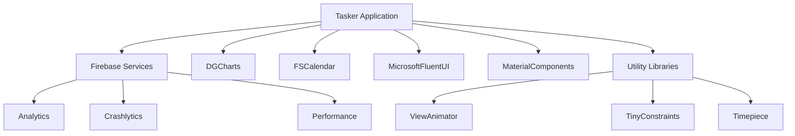
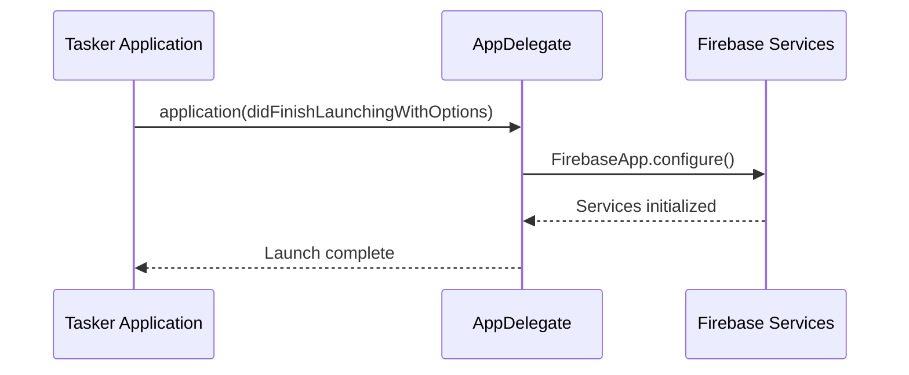
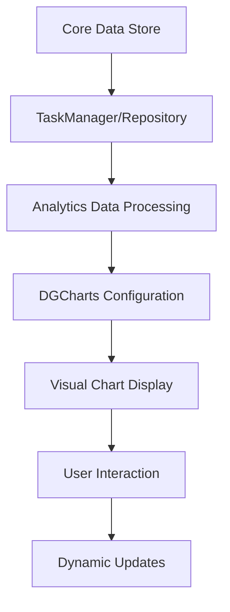
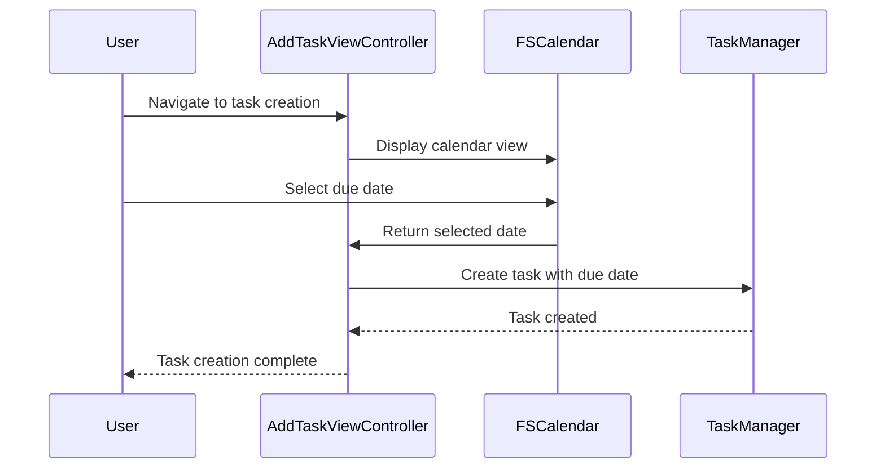
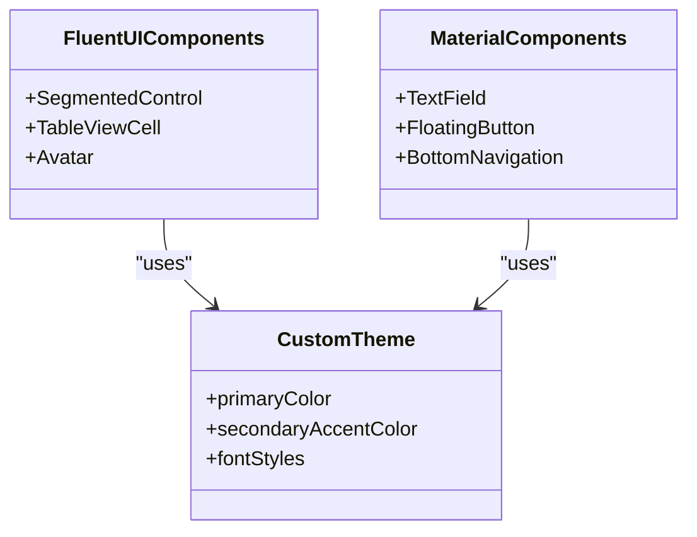
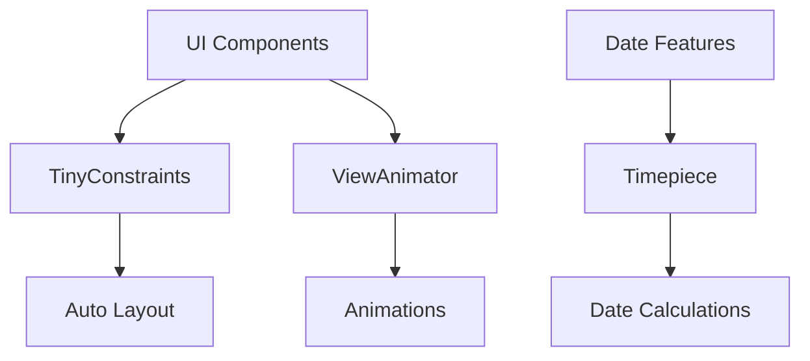
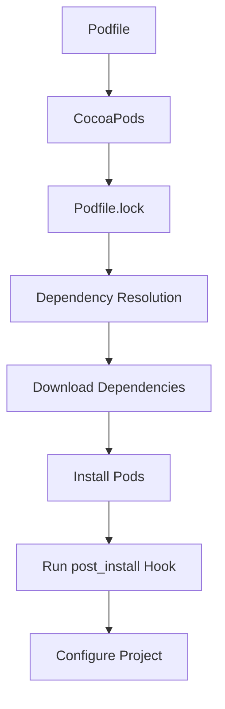

# Third-Party Integrations Architecture

<cite>
**Referenced Files in This Document**   
- [Podfile](file://Podfile)
- [AppDelegate.swift](file://To%20Do%20List/AppDelegate.swift)
- [README.md](file://README.md)
- [Podfile.lock](file://Podfile.lock)
</cite>

## Table of Contents
1. [Introduction](#introduction)
2. [Third-Party Dependency Overview](#third-party-dependency-overview)
3. [Firebase Integration](#firebase-integration)
4. [Data Visualization with DGCharts](#data-visualization-with-dgcharts)
5. [Date Selection with FSCalendar](#date-selection-with-fscalendar)
6. [UI Design Systems](#ui-design-systems)
7. [Utility Libraries](#utility-libraries)
8. [Dependency Management with CocoaPods](#dependency-management-with-cocoapods)
9. [Security Considerations](#security-considerations)
10. [Best Practices for Dependency Management](#best-practices-for-dependency-management)

## Introduction
Tasker is an iOS productivity application that leverages a comprehensive suite of third-party libraries to deliver advanced functionality, modern UI design, and robust analytics. This document provides a detailed architectural analysis of the third-party integrations within the Tasker application, focusing on how these external dependencies are configured, initialized, and utilized to enhance the application's capabilities. The analysis covers Firebase services for analytics and monitoring, DGCharts for data visualization, FSCalendar for date selection, MicrosoftFluentUI and MaterialComponents for UI design, and various utility libraries for layout, animation, and date manipulation.

## Third-Party Dependency Overview
The Tasker application utilizes CocoaPods as its dependency management system, with dependencies declared in the Podfile. The application targets iOS 16.0 and incorporates a diverse set of third-party libraries across several categories:

- **Firebase Suite**: Analytics, Crashlytics, and Performance monitoring
- **UI Frameworks**: MicrosoftFluentUI and MaterialComponents for consistent design
- **Data Visualization**: DGCharts for interactive charts and analytics
- **Calendar & Date**: FSCalendar for visual date selection and Timepiece for date manipulation
- **Animation & UI Utilities**: ViewAnimator for transitions, TinyConstraints for Auto Layout, and other supporting libraries



**Diagram sources**
- [Podfile](file://Podfile#L1-L39)

**Section sources**
- [Podfile](file://Podfile#L1-L39)
- [README.md](file://README.md#L1356-L1389)

## Firebase Integration
Firebase services are integrated into Tasker to provide comprehensive analytics, crash reporting, and performance monitoring. The integration is configured through the Podfile and initialized in the AppDelegate.

### Configuration via Podfile
The Podfile specifies the Firebase dependencies with version constraints using the tilde operator (~>), which allows for minor version updates while preventing breaking changes:

```ruby
# Firebase
pod 'Firebase/Analytics',   '~> 11.13'
pod 'Firebase/Crashlytics', '~> 11.13'
pod 'Firebase/Performance', '~> 11.13'
```

This versioning strategy ensures that the application receives bug fixes and minor improvements while maintaining API compatibility. The Podfile.lock file confirms that version 11.13.0 is currently installed for all Firebase components.

### Initialization in AppDelegate
Firebase is initialized in the `application(_:didFinishLaunchingWithOptions:)` method of the AppDelegate, which is the standard entry point for iOS applications:

```swift
func application(_ application: UIApplication, didFinishLaunchingWithOptions launchOptions: [UIApplication.LaunchOptionsKey: Any]?) -> Bool {
    FirebaseApp.configure()
    // ... other initialization code
    return true
}
```

The `FirebaseApp.configure()` method initializes all Firebase services specified in the Podfile. This single call is sufficient to set up Firebase Analytics, Crashlytics, and Performance Monitoring. The initialization occurs early in the application lifecycle to ensure that all user interactions and potential crashes are captured from the moment the app starts.

### Firebase Services Utilization
- **Firebase Analytics**: Tracks user interactions, feature usage, and application events to understand user behavior and inform product decisions
- **Crashlytics**: Provides detailed crash reports and stability metrics to help identify and fix issues
- **Performance Monitoring**: Tracks application performance metrics such as network requests, screen rendering times, and method execution durations



**Diagram sources**
- [AppDelegate.swift](file://To%20Do%20List/AppDelegate.swift#L25-L35)
- [Podfile](file://Podfile#L5-L7)

**Section sources**
- [AppDelegate.swift](file://To%20Do%20List/AppDelegate.swift#L25-L35)
- [Podfile](file://Podfile#L5-L7)
- [README.md](file://README.md#L1402-L1411)

## Data Visualization with DGCharts
DGCharts is used to implement the analytics and gamification dashboard in Tasker, providing interactive visualizations of task completion trends, priority distribution, and performance metrics.

### Integration and Configuration
DGCharts is included in the project via CocoaPods with the following declaration in the Podfile:

```ruby
pod 'DGCharts', '~> 5.1'
```

The Podfile.lock confirms that version 5.1.0 is installed. DGCharts is a powerful charting library that provides various chart types including line charts, pie charts, and bar charts, which are essential for the analytics dashboard.

### Implementation in Analytics Dashboard
The analytics dashboard uses DGCharts to visualize several key metrics:

- **Completion Trends**: Line charts showing daily, weekly, and monthly completion rates with cubic Bezier smoothing for an elegant visualization
- **Priority Distribution**: Pie charts displaying the distribution of tasks by priority level
- **Project Performance**: Bar charts showing completion statistics for different projects
- **Streak Visualization**: Line charts tracking consecutive days of task completion
- **Score Progression**: Historical tracking of the user's score based on completed tasks

The charts are interactive, supporting touch gestures for data point exploration, custom markers, balloon tooltips, and animations. They are synchronized with the FSCalendar component to provide weekly and monthly views.

### Data Flow for Charting
The data for the charts is sourced from the Core Data store through the TaskManager and TaskRepository components. When the analytics view is displayed, it queries the data layer for the relevant task data, processes it to calculate metrics, and then feeds this data to the DGCharts components for visualization.



**Diagram sources**
- [Podfile](file://Podfile#L15)
- [README.md](file://README.md#L1035-L1055)

**Section sources**
- [Podfile](file://Podfile#L15)
- [README.md](file://README.md#L1035-L1055)
- [Podfile.lock](file://Podfile.lock#L8-L9)

## Date Selection with FSCalendar
FSCalendar is integrated into Tasker to provide a feature-rich calendar component for visual task scheduling and date selection.

### Integration and Configuration
FSCalendar is included in the project via CocoaPods:

```ruby
pod 'FSCalendar', '~> 2.8.1'
```

The Podfile.lock shows that version 2.8.4 is installed, indicating that the version constraint allowed for a patch update from 2.8.1 to 2.8.4.

### Implementation in Task Scheduling
FSCalendar is used in two primary contexts within the application:

1. **Task Creation**: In the AddTaskViewController, FSCalendar provides a visual interface for selecting a due date for new tasks
2. **Date-Based Views**: The application uses FSCalendar to enable navigation between different dates in the task list views

The calendar is synchronized with the analytics charts, allowing users to view productivity metrics for specific weeks or months. This integration enhances the user experience by providing a cohesive interface for both task management and performance tracking.

### Customization and Theming
The FSCalendar component is customized to match the application's overall design language, which combines Microsoft FluentUI and Material Design elements. The calendar's appearance, including colors, fonts, and cell styling, is configured to maintain visual consistency with the rest of the application.



**Diagram sources**
- [Podfile](file://Podfile#L18)
- [README.md](file://README.md#L1035-L1055)

**Section sources**
- [Podfile](file://Podfile#L18)
- [README.md](file://README.md#L1035-L1055)
- [Podfile.lock](file://Podfile.lock#L45)

## UI Design Systems
Tasker employs a hybrid UI design approach, combining MicrosoftFluentUI and MaterialComponents to create a consistent and platform-aligned user interface.

### Microsoft FluentUI Integration
MicrosoftFluentUI is used to implement Microsoft's design system within the iOS application:

```ruby
pod 'MicrosoftFluentUI', '~> 0.33.2'
```

The library provides components such as:
- Segmented controls for task type selection (Morning, Evening, Upcoming, Inbox)
- Table view cells with priority indicators and due date displays
- Avatar components and other FluentUI-specific elements

The FluentUI components are used for their modern, clean aesthetic and their alignment with Microsoft's design principles, which emphasize clarity and efficiency.

### MaterialComponents Integration
MaterialComponents implements Google's Material Design system:

```ruby
pod 'MaterialComponents', '~> 124.2'
```

Key components used include:
- **Text Fields**: MDCFilledTextField and MDCOutlinedTextField for task title and description inputs
- **Floating Action Buttons**: MDCFloatingButton for primary actions like adding tasks
- **Buttons and Controls**: Various button styles with ripple effects and elevation
- **Navigation Components**: Bottom navigation, app bars, and other Material Design navigation elements

### Combined Design Approach
The application combines these two design systems to leverage the strengths of both:

- **FluentUI** provides the overall structure and certain interactive components
- **MaterialComponents** supplies form controls, buttons, and other input elements

This hybrid approach allows Tasker to maintain a distinctive visual identity while providing familiar, well-designed UI components. The design system is further customized through the application's color and typography systems defined in ToDoColors and ToDoFont.



**Diagram sources**
- [Podfile](file://Podfile#L16-L17)
- [README.md](file://README.md#L1092-L1122)

**Section sources**
- [Podfile](file://Podfile#L16-L17)
- [README.md](file://README.md#L1092-L1122)
- [Podfile.lock](file://Podfile.lock#L134-L135)

## Utility Libraries
Tasker incorporates several utility libraries to simplify common development tasks related to Auto Layout, animations, and date manipulation.

### TinyConstraints for Auto Layout
TinyConstraints is a lightweight Auto Layout helper library:

```ruby
pod 'TinyConstraints', '~> 4.0.1'
```

It provides a fluent API for creating Auto Layout constraints, making the code more readable and concise compared to using the native NSLayoutConstraint API. This library is used throughout the application to position views and create responsive layouts that adapt to different screen sizes and orientations.

### ViewAnimator for Transitions
ViewAnimator simplifies the creation of view animations and transitions:

```ruby
pod 'ViewAnimator', '~> 3.1'
```

The library is used to implement smooth transitions between views, animations for task completion, and other visual effects that enhance the user experience. By abstracting the complexity of Core Animation, ViewAnimator allows developers to create sophisticated animations with minimal code.

### Timepiece for Date Manipulation
Timepiece provides convenient methods for working with dates and times:

```ruby
pod 'Timepiece', '~> 1.3.1'
```

This library is used in conjunction with FSCalendar and the application's date-based features to perform date calculations, formatting, and manipulation. It simplifies tasks such as calculating the number of days between dates, adding time intervals, and formatting dates for display.



**Diagram sources**
- [Podfile](file://Podfile#L19-L21)
- [README.md](file://README.md#L1356-L1389)

**Section sources**
- [Podfile](file://Podfile#L19-L21)
- [README.md](file://README.md#L1356-L1389)

## Dependency Management with CocoaPods
Tasker uses CocoaPods as its dependency management system, with a well-structured approach to version control and dependency resolution.

### Version Pinning Strategy
The Podfile uses the tilde operator (~>) for version constraints, which follows semantic versioning principles:

- `~> 11.13` allows updates to any version 11.13.x but prevents updates to 11.14 or higher
- This strategy balances the need for bug fixes and minor improvements with the stability of not introducing breaking changes

### Update and Conflict Resolution
The post_install hook in the Podfile ensures that all pods are configured with the correct deployment target:

```ruby
post_install do |installer|
  installer.pods_project.targets.each do |t|
    t.build_configurations.each do |c|
      c.build_settings['IPHONEOS_DEPLOYMENT_TARGET'] = '16.0'
    end
  end
end
```

This hook runs after the pods project is generated and sets the deployment target for all pod targets, ensuring compatibility with the application's minimum iOS version.

### Dependency Resolution Process
When dependencies are installed or updated:
1. CocoaPods reads the Podfile to determine the required pods and version constraints
2. It consults the Podfile.lock to maintain consistency across installations
3. It resolves dependencies and their transitive dependencies
4. It downloads and installs the specified versions
5. The post_install hook configures the generated project

The Podfile.lock file provides a complete record of the exact versions installed, including transitive dependencies, ensuring reproducible builds.



**Diagram sources**
- [Podfile](file://Podfile#L35-L40)
- [Podfile.lock](file://Podfile.lock#L0-L799)

**Section sources**
- [Podfile](file://Podfile#L35-L40)
- [Podfile.lock](file://Podfile.lock#L0-L799)

## Security Considerations
The integration of third-party SDKs in Tasker raises several security and privacy considerations that are addressed through various practices.

### Data Collection Transparency
Firebase services collect user interaction data for analytics purposes. To maintain transparency:
- The application should provide clear information about data collection in its privacy policy
- Users should be informed about the types of data collected and how it is used
- The application should comply with relevant privacy regulations (e.g., GDPR, CCPA)

### Permission Handling
The application requests permissions for features that may access sensitive data:
- **Push Notifications**: Required for CloudKit silent pushes and task reminders
- **CloudKit**: Used for cross-device synchronization of task data

These permissions are requested at appropriate times in the user flow, with clear explanations of why they are needed.

### SDK Security Practices
To mitigate risks associated with third-party SDKs:
- Dependencies are kept up-to-date to include security patches
- The application uses version constraints that balance stability with security updates
- The codebase is regularly reviewed for potential security vulnerabilities
- Sensitive data is not shared with analytics services

## Best Practices for Dependency Management
Based on the implementation in Tasker, several best practices for managing third-party dependencies can be identified.

### Adding Dependencies
1. **Evaluate Necessity**: Ensure the library provides significant value before adding it
2. **Assess Quality**: Check the library's maintenance status, documentation, and community support
3. **Consider Size**: Evaluate the impact on application size and performance
4. **Verify Compatibility**: Ensure the library is compatible with the target iOS version

### Removing Dependencies
1. **Identify Usage**: Determine all places where the dependency is used
2. **Create Replacements**: Implement alternative solutions for the functionality provided
3. **Update Code**: Refactor code to remove references to the dependency
4. **Test Thoroughly**: Verify that all functionality works as expected after removal

### Upgrading Dependencies
1. **Review Changelog**: Understand the changes in the new version
2. **Check Compatibility**: Ensure the upgrade won't break existing functionality
3. **Update Gradually**: Upgrade one dependency at a time when possible
4. **Test Extensively**: Verify that the application works correctly with the new version

These practices help maintain a healthy dependency ecosystem, balancing the benefits of third-party libraries with the need for stability, security, and maintainability.