# ProjectManager

<cite>
**Referenced Files in This Document**   
- [ProjectManager.swift](file://To%20Do%20List/ViewControllers/ProjectManager.swift)
- [Projects+CoreDataClass.swift](file://Projects+CoreDataClass.swift)
- [Projects+CoreDataProperties.swift](file://Projects+CoreDataProperties.swift)
- [FluentUIToDoTableViewController.swift](file://To%20Do%20List/ViewControllers/FluentUIToDoTableViewController.swift)
- [TaskManager.swift](file://To%20Do%20List/ViewControllers/TaskManager.swift)
</cite>

## Table of Contents
1. [Introduction](#introduction)
2. [Core Data Entity Structure](#core-data-entity-structure)
3. [Singleton Architecture and Initialization](#singleton-architecture-and-initialization)
4. [Project Lifecycle Management](#project-lifecycle-management)
5. [Data Synchronization and Consistency](#data-synchronization-and-consistency)
6. [Integration with FluentUIToDoTableViewController](#integration-with-fluentuitodotableviewcontroller)
7. [Task-Project Relationship Management](#task-project-relationship-management)
8. [Workflow Examples](#workflow-examples)
9. [Architectural Limitations and Migration Guidance](#architectural-limitations-and-migration-guidance)
10. [Conclusion](#conclusion)

## Introduction

The **ProjectManager** component serves as a legacy singleton responsible for managing project-related business logic within the Tasker application. It acts as the central coordinator for project creation, deletion, and maintenance, ensuring data consistency between the Projects Core Data entity and associated tasks. This documentation provides a comprehensive analysis of its implementation, integration points, and operational workflows.

As a singleton, ProjectManager maintains a global state that is observed by various UI components through the `@Published` property wrapper, enabling reactive updates across the application. It works in conjunction with TaskManager to maintain referential integrity between tasks and their assigned projects, particularly during operations like project renaming or deletion.

The component plays a critical role in the application's organization system, providing the foundation for task categorization and filtering. Its integration with the FluentUIToDoTableViewController enables project-specific views and filtering capabilities, allowing users to organize their tasks effectively.

**Section sources**
- [ProjectManager.swift](file://To%20Do%20List/ViewControllers/ProjectManager.swift#L1-L339)

## Core Data Entity Structure

The ProjectManager interacts with the **Projects** Core Data entity, which represents project records in the persistent store. This entity contains essential attributes for project management and serves as the data model for all project-related operations.

The entity structure is defined across two partial classes that extend the Core Data generated class:

```mermaid
classDiagram
class Projects {
+String? projectName
+String? projecDescription
+NSFetchRequest<Projects> fetchRequest()
}
note right of Projects
Core Data entity for project management
Managed by ProjectManager singleton
Stored in SQLite persistent store
end note
```

**Diagram sources**
- [Projects+CoreDataClass.swift](file://Projects+CoreDataClass.swift#L1-L16)
- [Projects+CoreDataProperties.swift](file://Projects+CoreDataProperties.swift#L1-L23)

The entity contains the following key properties:

- **projectName**: Stores the display name of the project (e.g., "Work", "Personal", "Inbox")
- **projecDescription**: Contains the descriptive text for the project (note the typo in the property name)

The entity is accessed through standard Core Data mechanisms, with ProjectManager obtaining its managed object context from the AppDelegate's persistent container. This ensures that all project operations are performed within the correct persistence context and can be properly saved to the underlying store.

The entity has a one-to-many relationship with tasks (represented by the NTask entity), though this relationship is not directly defined in the Core Data model but rather maintained through string-based references in the task's project property.

**Section sources**
- [Projects+CoreDataClass.swift](file://Projects+CoreDataClass.swift#L1-L16)
- [Projects+CoreDataProperties.swift](file://Projects+CoreDataProperties.swift#L1-L23)

## Singleton Architecture and Initialization

ProjectManager implements the singleton pattern through a static shared instance, ensuring that only one instance exists throughout the application lifecycle. This architectural choice provides global access to project management functionality but introduces challenges related to testability and state management.

```swift
static let sharedInstance = ProjectManager()
```

The singleton is initialized with a private initializer that establishes its dependency on Core Data:

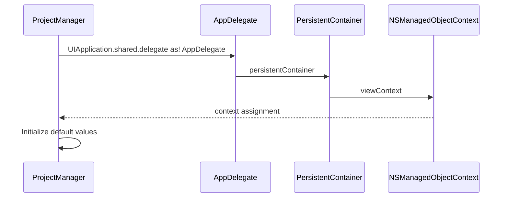

**Diagram sources**
- [ProjectManager.swift](file://To%20Do%20List/ViewControllers/ProjectManager.swift#L30-L35)

Key initialization steps include:

1. **Dependency Injection**: The managed object context is obtained from the AppDelegate's persistent container, establishing the connection to Core Data
2. **Default Configuration**: Default project values are set (name: "Inbox", description: "Catch all project...")
3. **Private Initialization**: The private init() prevents external instantiation, enforcing the singleton pattern

The singleton exposes its state through a `@Published` property:

```swift
@Published var projects: [Projects] = []
```

This property serves as the single source of truth for UI updates, leveraging Combine's publisher-subscriber pattern to notify observers of changes. When the projects array is modified, all subscribed views automatically refresh to reflect the current state.

The singleton pattern enables simple access throughout the codebase via `ProjectManager.sharedInstance`, but it creates tight coupling between components and makes unit testing more challenging due to the global state.

**Section sources**
- [ProjectManager.swift](file://To%20Do%20List/ViewControllers/ProjectManager.swift#L15-L35)

## Project Lifecycle Management

ProjectManager provides comprehensive functionality for managing the complete lifecycle of projects, from creation to deletion. These operations ensure data integrity and provide appropriate user feedback through console logging.

### Project Creation

The `addNewProject(with:and:)` method handles the creation of new projects with comprehensive validation:

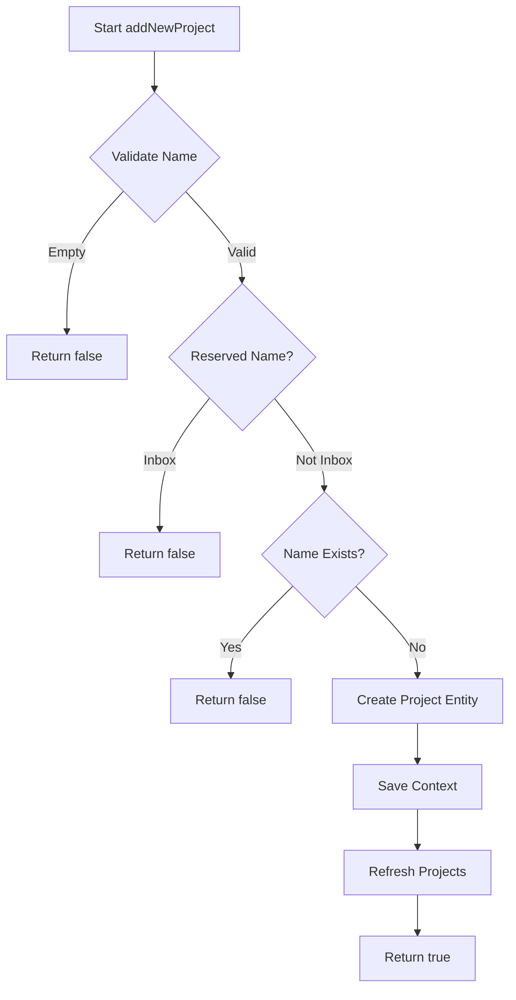

**Diagram sources**
- [ProjectManager.swift](file://To%20Do%20List/ViewControllers/ProjectManager.swift#L150-L175)

Validation rules include:
- Project names cannot be empty or whitespace-only
- The name "Inbox" is reserved and cannot be used for new projects
- Duplicate project names are not allowed (case-insensitive comparison)

### Project Update

The `updateProject(_:newName:newDescription:)` method manages project modifications with safeguards:

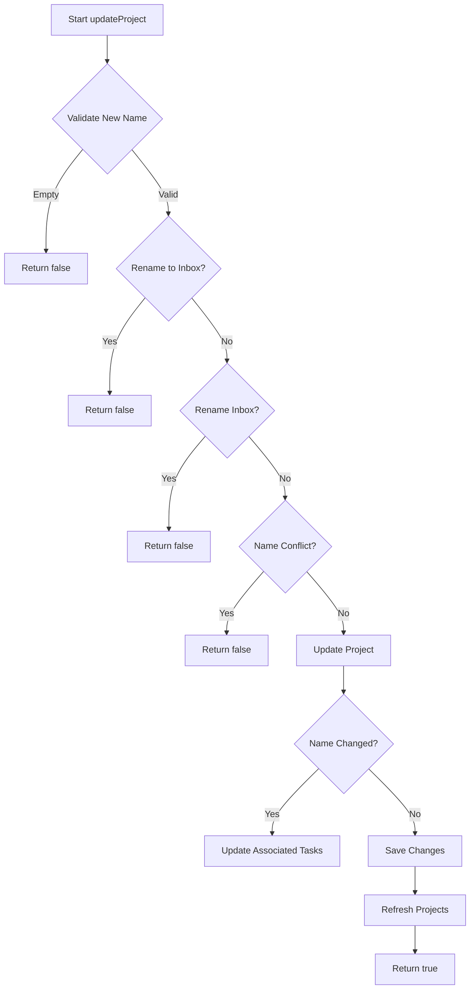

**Diagram sources**
- [ProjectManager.swift](file://To%20Do%20List/ViewControllers/ProjectManager.swift#L177-L215)

Key protections:
- Prevents renaming any project to "Inbox"
- Prevents renaming the "Inbox" project to any other name
- Checks for name conflicts when changing project names

### Project Deletion

The `deleteProject(_:)` method handles project removal with data integrity safeguards:

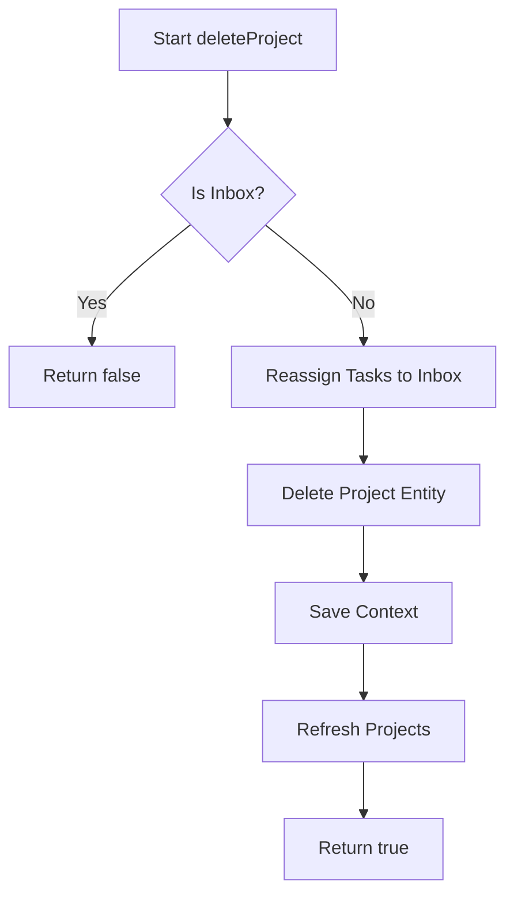

**Diagram sources**
- [ProjectManager.swift](file://To%20Do%20List/ViewControllers/ProjectManager.swift#L217-L228)

The method:
- Prevents deletion of the default "Inbox" project
- Reassigns all tasks from the deleted project to the Inbox
- Only processes incomplete tasks during reassignment

### Default Project Management

The `fixMissingProjecsDataWithDefaultsInternal()` method ensures the integrity of the default "Inbox" project:

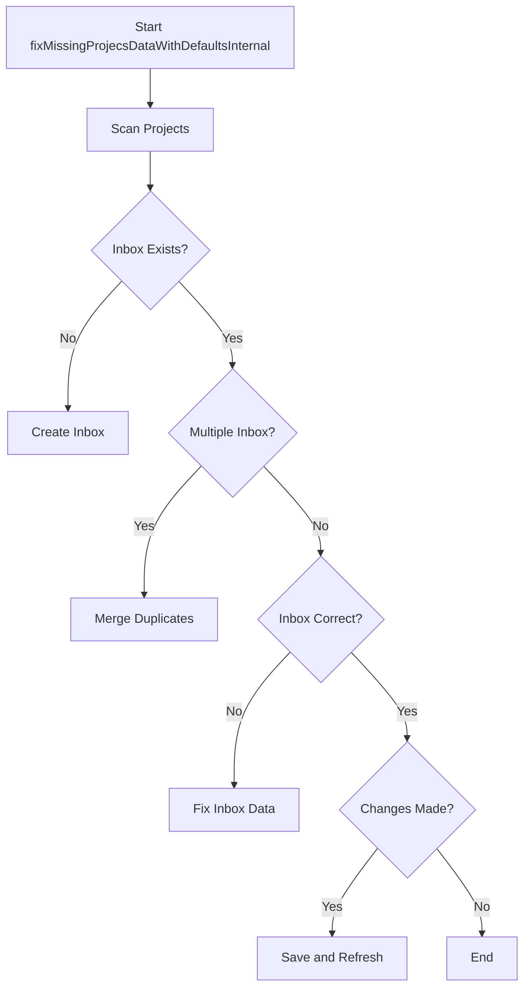

**Diagram sources**
- [ProjectManager.swift](file://To%20Do%20List/ViewControllers/ProjectManager.swift#L75-L148)

This method:
- Creates the Inbox if missing
- Merges duplicate Inbox projects
- Ensures correct name and description
- Reassigns tasks from duplicate Inboxes

**Section sources**
- [ProjectManager.swift](file://To%20Do%20List/ViewControllers/ProjectManager.swift#L150-L240)

## Data Synchronization and Consistency

ProjectManager implements a robust data synchronization strategy to maintain consistency between its internal state and the persistent store. This ensures that the UI always reflects the most current data while handling potential inconsistencies.

### Refresh and Preparation Workflow

The `refreshAndPrepareProjects()` method orchestrates the complete data synchronization process:

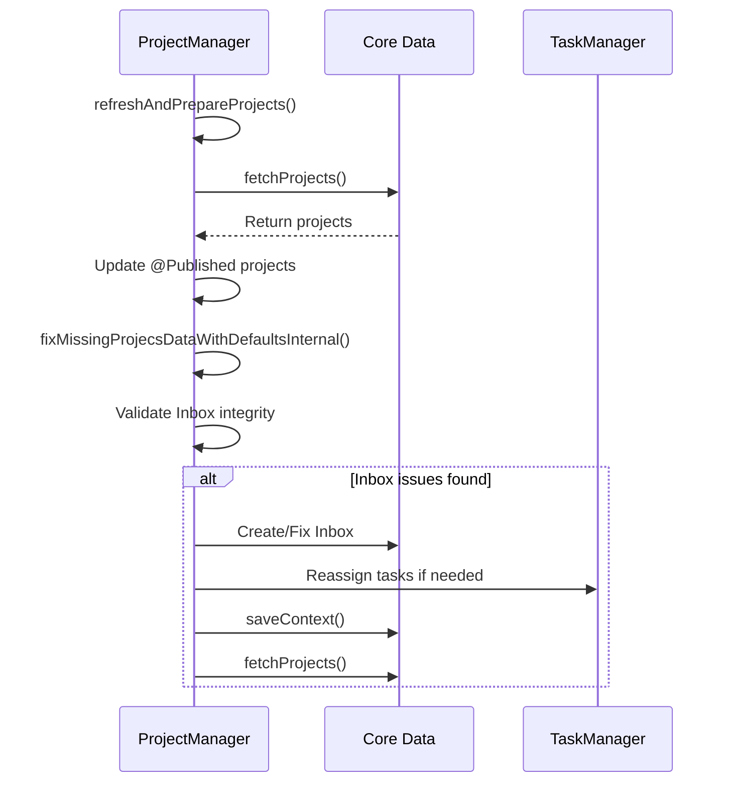

**Diagram sources**
- [ProjectManager.swift](file://To%20Do%20List/ViewControllers/ProjectManager.swift#L55-L65)

This two-phase approach:
1. **Fetch Phase**: Retrieves the latest data from Core Data
2. **Preparation Phase**: Validates and corrects data integrity issues

### Fetching Strategy

The `fetchProjects()` method implements safe data retrieval with main thread dispatch:

```swift
private func fetchProjects() {
    let fetchRequest = NSFetchRequest<NSManagedObject>(entityName: "Projects")
    do {
        let results = try context.fetch(fetchRequest)
        DispatchQueue.main.async {
            self.projects = results as? [Projects] ?? []
        }
    } catch {
        DispatchQueue.main.async {
            self.projects = []
        }
    }
}
```

Key aspects:
- Performs fetch on the current thread
- Updates the published property on the main thread
- Handles errors gracefully by clearing the projects array
- Uses direct casting to the Projects type

### Context Management

The `saveContext()` method ensures data persistence:

```swift
func saveContext() {
    if context.hasChanges {
        do {
            try context.save()
        } catch {
            print("ProjectManager failed saving context! \(error)")
        }
    }
}
```

This method:
- Only saves when changes are present
- Handles save errors with logging
- Is called after all modification operations

The synchronization strategy ensures that any modification to projects (add, update, delete) is followed by a save and refresh cycle, maintaining consistency between the in-memory state and persistent store.

**Section sources**
- [ProjectManager.swift](file://To%20Do%20List/ViewControllers/ProjectManager.swift#L55-L100)

## Integration with FluentUIToDoTableViewController

ProjectManager integrates closely with the FluentUIToDoTableViewController to enable project-based task organization and display. This integration allows users to view tasks grouped by project with proper filtering and sorting.

### Project Display Logic

The `displayedProjects` computed property provides sorted project data for UI presentation:

```swift
var displayedProjects: [Projects] {
    var localProjects = projects.uniqued()
    
    if let inboxIndex = localProjects.firstIndex(where: { 
        $0.projectName?.lowercased() == defaultProject.lowercased() 
    }) {
        let inboxProject = localProjects.remove(at: inboxIndex)
        localProjects.insert(inboxProject, at: 0)
    }
    return localProjects
}
```

This property:
- Removes duplicate projects using the `uniqued()` extension
- Ensures the "Inbox" project appears at the top of lists
- Provides a stable sorting order for consistent UI presentation

### Project Selection Interface

The FluentUIToDoTableViewController uses ProjectManager to populate the project selection pill bar:

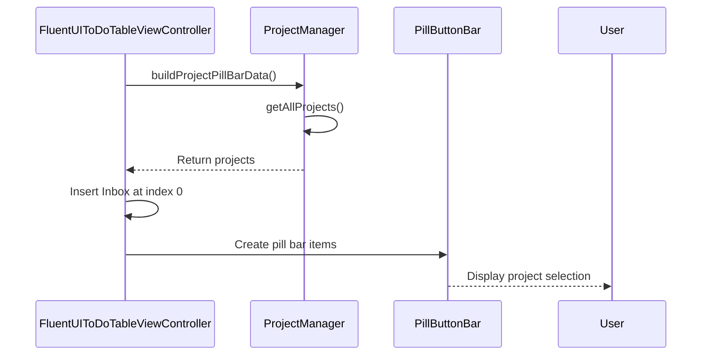

**Diagram sources**
- [FluentUIToDoTableViewController.swift](file://To%20Do%20List/ViewControllers/FluentUIToDoTableViewController.swift#L1050-L1080)

The `buildProjectPillBarData()` method:
- Retrieves all projects from ProjectManager
- Ensures "Inbox" is present and positioned first
- Removes duplicates to prevent UI issues

### Task Grouping and Filtering

The FluentUIToDoTableViewController groups tasks by project using ProjectManager's data:

```swift
// In setupToDoData(for:)
var tasksByProject: [String: [NTask]] = [:]
let inboxProjectName = "inbox"

for task in allTasksForDate {
    let projectName = (task.project?.lowercased() ?? inboxProjectName)
    if tasksByProject[projectName] == nil {
        tasksByProject[projectName] = []
    }
    tasksByProject[projectName]?.append(task)
}
```

This grouping:
- Uses case-insensitive project names
- Defaults to "inbox" for tasks without a project
- Creates sections for each unique project

The integration ensures that when users select a project in the pill bar, the task assignment is properly updated and persisted through the TaskManager.

**Section sources**
- [FluentUIToDoTableViewController.swift](file://To%20Do%20List/ViewControllers/FluentUIToDoTableViewController.swift#L1050-L1080)
- [ProjectManager.swift](file://To%20Do%20List/ViewControllers/ProjectManager.swift#L40-L50)

## Task-Project Relationship Management

ProjectManager works in conjunction with TaskManager to maintain consistency between projects and their associated tasks. This relationship management is critical for data integrity during project modifications.

### Task Reassignment on Project Deletion

When a project is deleted, its tasks are reassigned to the Inbox:

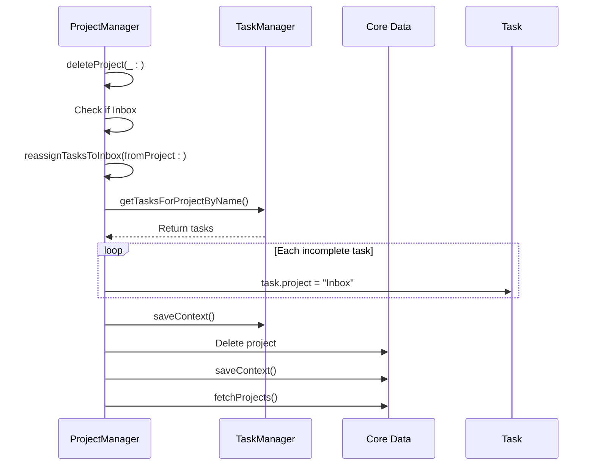

**Diagram sources**
- [ProjectManager.swift](file://To%20Do%20List/ViewControllers/ProjectManager.swift#L229-L238)

The `reassignTasksToInbox(fromProject:)` method:
- Retrieves all tasks for the deleted project
- Only updates incomplete tasks (completed tasks retain their project context)
- Assigns the "Inbox" project name to each task
- Saves changes through TaskManager

### Task Updates on Project Rename

When a project is renamed, associated tasks are updated:

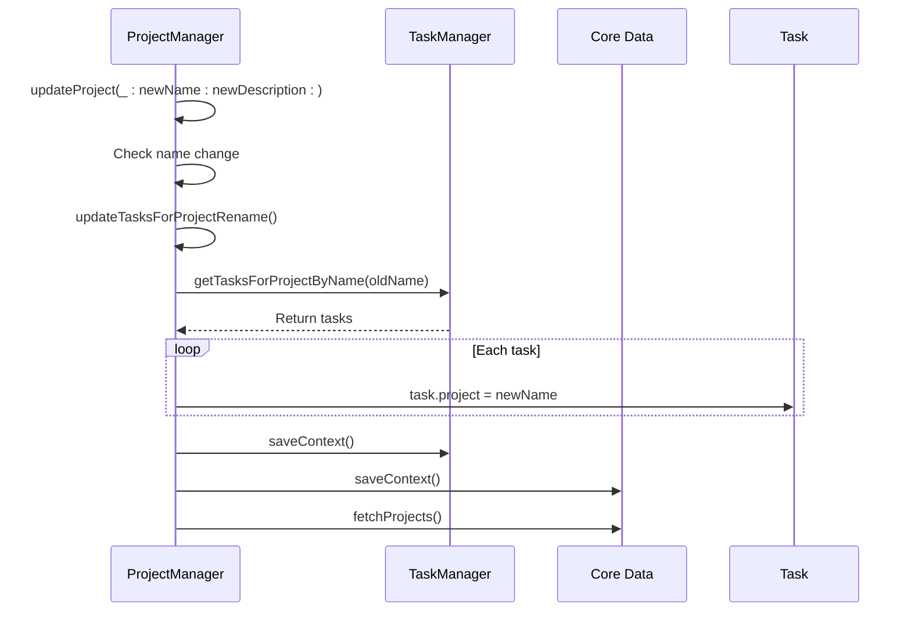

**Diagram sources**
- [ProjectManager.swift](file://To%20Do%20List/ViewControllers/ProjectManager.swift#L239-L248)

The `updateTasksForProjectRename(oldName:newName:)` method:
- Finds all tasks assigned to the old project name
- Updates the project property to the new name
- Persists changes through TaskManager's context

### Consistency Enforcement

The integration between ProjectManager and TaskManager ensures referential integrity:

- **Project Creation**: No direct task updates needed
- **Project Update**: Tasks are updated to reflect new project names
- **Project Deletion**: Tasks are reassigned to maintain data integrity
- **Project Renaming**: Tasks are updated to prevent orphaned references

This bidirectional consistency management prevents data corruption and ensures that tasks always reference valid projects.

**Section sources**
- [ProjectManager.swift](file://To%20Do%20List/ViewControllers/ProjectManager.swift#L229-L248)
- [TaskManager.swift](file://To%20Do%20List/ViewControllers/TaskManager.swift#L150-L170)

## Workflow Examples

This section illustrates common operations involving the ProjectManager component with detailed code examples and execution flows.

### Adding a Task to a Project

When a user assigns a task to a project through the UI:

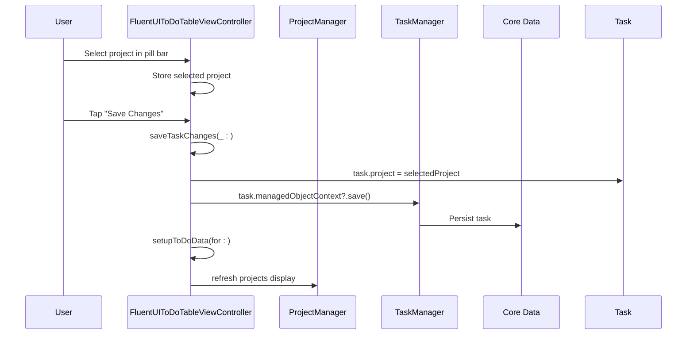

The task's project property is updated directly, and the change is saved through Core Data. The UI automatically refreshes to reflect the new project assignment.

### Retrieving Tasks for a Specific Project

To retrieve all tasks within a specific project:

```swift
// Example: Get all tasks in the "Work" project
let workTasks = TaskManager.sharedInstance.getTasksForProjectByName(projectName: "Work")

// Example: Get all tasks for current date in any project
func setupToDoData(for date: Date) {
    let allTasksForDate = TaskManager.sharedInstance.getAllTasksForDate(date: date)
    
    var tasksByProject: [String: [NTask]] = [:]
    let inboxProjectName = "inbox"
    
    for task in allTasksForDate {
        let projectName = (task.project?.lowercased() ?? inboxProjectName)
        tasksByProject[projectName, default: []].append(task)
    }
}
```

### Creating a New Project

The complete workflow for creating a new project:

```swift
let success = ProjectManager.sharedInstance.addNewProject(
    with: "Personal Goals", 
    and: "Tasks related to personal development"
)

if success {
    print("Project created successfully")
    // UI automatically updates due to @Published property
} else {
    print("Failed to create project")
}
```

### Switching Project Contexts

When a user navigates between different project views:

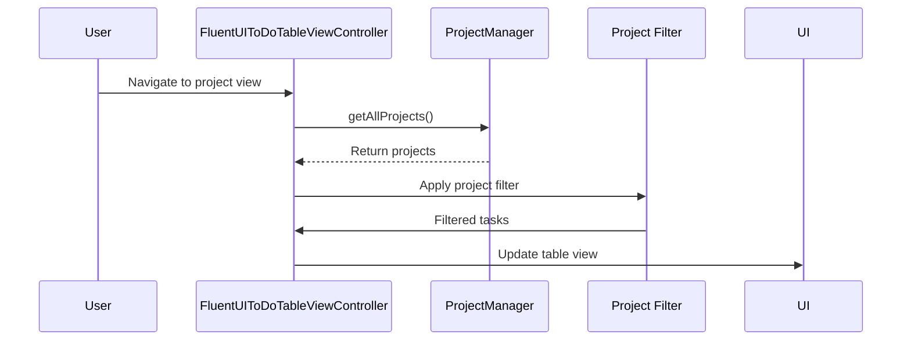

The FluentUIToDoTableViewController uses ProjectManager's data to determine available projects and applies appropriate filtering to display only tasks belonging to the selected project context.

**Section sources**
- [FluentUIToDoTableViewController.swift](file://To%20Do%20List/ViewControllers/FluentUIToDoTableViewController.swift#L300-L350)
- [ProjectManager.swift](file://To%20Do%20List/ViewControllers/ProjectManager.swift#L150-L175)

## Architectural Limitations and Migration Guidance

While ProjectManager provides essential functionality, it exhibits several architectural limitations that should be addressed in future development.

### Current Limitations

#### Global State and Singleton Pattern
The singleton pattern creates global state that is difficult to test and can lead to race conditions:

- **Testing Challenges**: Unit tests cannot easily isolate ProjectManager due to shared state
- **Memory Management**: The singleton persists for the entire app lifecycle
- **Tight Coupling**: Components directly depend on the singleton instance

#### Lack of Protocol Abstraction
The implementation lacks protocol-based abstraction:

```swift
// Current: Direct singleton access
ProjectManager.sharedInstance.addNewProject(...)

// Preferred: Protocol-based dependency
class TaskViewController: ProjectManaging {
    var projectManager: ProjectManaging
    
    init(projectManager: ProjectManaging) {
        self.projectManager = projectManager
    }
}
```

#### Direct Core Data Exposure
The Projects entity is exposed directly to consumers, creating tight coupling to the persistence layer.

### Migration Guidance

For new features, follow these guidelines to support the ongoing architectural transition:

#### Dependency Injection
Instead of accessing the singleton directly, use dependency injection:

```swift
class NewFeatureViewController {
    private let projectManager: ProjectManaging
    
    init(projectManager: ProjectManaging = ProjectManager.sharedInstance) {
        self.projectManager = projectManager
    }
}
```

#### Protocol Abstraction
Define a protocol for project management operations:

```swift
protocol ProjectManaging {
    func getAllProjects() -> [Projects]
    func addNewProject(with name: String, and description: String) -> Bool
    func updateProject(_ project: Projects, newName: String, newDescription: String) -> Bool
    func deleteProject(_ project: Projects) -> Bool
}
```

Then extend ProjectManager to conform to this protocol:

```swift
extension ProjectManager: ProjectManaging {}
```

#### Asynchronous Operations
Future implementations should adopt async/await patterns:

```swift
func addNewProject(with name: String, and description: String) async throws -> Projects {
    // Async implementation
}
```

#### Error Handling
Improve error handling by using proper error types:

```swift
enum ProjectError: Error {
    case emptyName
    case reservedName
    case duplicateName
    case persistenceFailed
}
```

New features should be designed with these principles in mind to facilitate a gradual migration away from the legacy singleton pattern while maintaining backward compatibility.

**Section sources**
- [ProjectManager.swift](file://To%20Do%20List/ViewControllers/ProjectManager.swift#L15-L35)

## Conclusion

The ProjectManager component serves as a critical legacy singleton that manages project-related business logic in the Tasker application. It provides essential functionality for project creation, deletion, and maintenance while ensuring data consistency between projects and their associated tasks.

Key strengths of the current implementation include:
- Comprehensive validation for project operations
- Robust data synchronization with Core Data
- Effective integration with the UI layer through Combine publishers
- Proper handling of edge cases like duplicate projects

However, the component exhibits architectural limitations due to its singleton pattern and lack of protocol abstraction, which create challenges for testing and future maintenance.

The integration with FluentUIToDoTableViewController enables effective project-based task organization, allowing users to filter and view tasks by project. The coordination with TaskManager ensures referential integrity when projects are modified.

For future development, the recommended approach is to gradually migrate toward a protocol-based architecture with dependency injection, while maintaining backward compatibility with the existing singleton interface. This will improve testability, flexibility, and maintainability of the codebase.

The ProjectManager remains a vital component of the application's organization system, providing the foundation for task categorization and project management.