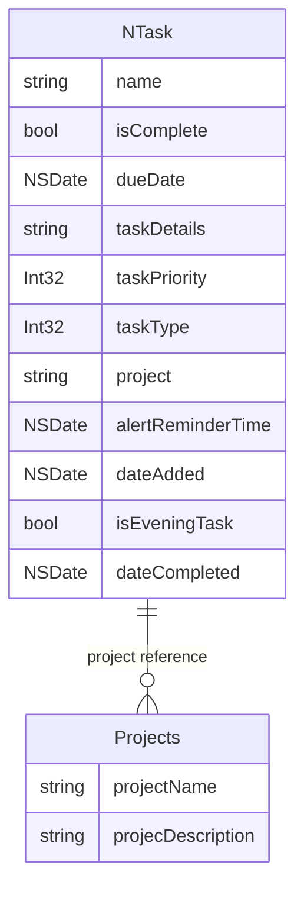
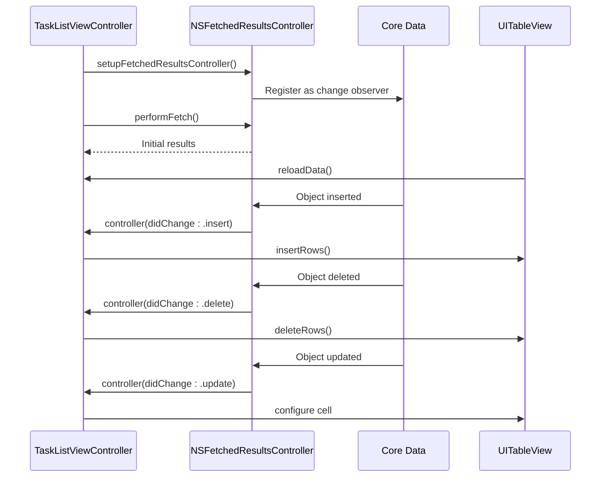

# Core Data Integration

<cite>
**Referenced Files in This Document**   
- [NTask+CoreDataClass.swift](file://To%20Do%20List/NTask+CoreDataClass.swift)
- [NTask+CoreDataProperties.swift](file://To%20Do%20List/NTask+CoreDataProperties.swift)
- [NTask+Extensions.swift](file://To%20Do%20List/NTask+Extensions.swift)
- [Projects+CoreDataClass.swift](file://Projects+CoreDataClass.swift)
- [Projects+CoreDataProperties.swift](file://Projects+CoreDataProperties.swift)
- [TaskData.swift](file://To%20Do%20List/Models/TaskData.swift)
- [TaskListViewController.swift](file://To%20Do%20List/ViewControllers/TaskListViewController.swift)
- [README.md](file://README.md)
</cite>

## Table of Contents
1. [Introduction](#introduction)
2. [Entity Schemas](#entity-schemas)
3. [Core Data Stack and CloudKit Integration](#core-data-stack-and-cloudkit-integration)
4. [Data Model Mapping](#data-model-mapping)
5. [Fetch Request Patterns](#fetch-request-patterns)
6. [Change Tracking with NSFetchedResultsController](#change-tracking-with-nsfetchedresultscontroller)
7. [Performance Considerations](#performance-considerations)
8. [Conclusion](#conclusion)

## Introduction
This document provides comprehensive documentation for Core Data integration in the Tasker application. It details the data model architecture, entity relationships, and persistence strategy with CloudKit synchronization. The system uses Core Data as the primary persistent store, enabling seamless cross-device data consistency through iCloud. The documentation covers the NTask and Projects entity schemas, their attributes and relationships, fetch request patterns for various use cases, and the mapping between managed object subclasses and the TaskData presentation model. It also explains advanced features such as faulting, batch updates, and change tracking using NSFetchedResultsController, along with performance optimization techniques and memory management best practices.

## Entity Schemas

### NTask Entity Schema
The NTask entity represents individual tasks in the Tasker application and contains comprehensive attributes for task management.

**Attributes:**
- **name**: String? - Task title
- **isComplete**: Bool - Completion status indicator
- **dueDate**: NSDate? - Scheduled due date and time
- **taskDetails**: String? - Additional task description or notes
- **taskPriority**: Int32 - Priority level (1-4, where 1 is highest priority)
- **taskType**: Int32 - Task category (1=morning, 2=evening, 3=upcoming, 4=inbox)
- **project**: String? - Associated project name
- **alertReminderTime**: NSDate? - Notification scheduling time
- **dateAdded**: NSDate? - Creation timestamp
- **isEveningTask**: Bool - Flag indicating evening task status
- **dateCompleted**: NSDate? - Timestamp when task was marked complete

**Relationships:**
- No direct relationships defined in the current schema
- Project association handled via string reference rather than Core Data relationship

**Business Logic Methods:**
The NTask entity includes a method for calculating task scores based on priority:
```swift
func getTaskScore(task: NTask) -> Int {
    if task.taskPriority == 1 {
        return 7
    } else if task.taskPriority == 2 {
        return 4
    } else if task.taskPriority == 3 {
        return 3
    } else if task.taskPriority == 4 {
        return 2
    }
    else {
        return 1
    }
}
```

**Section sources**
- [NTask+CoreDataProperties.swift](file://To%20Do%20List/NTask+CoreDataProperties.swift#L1-L54)

### Projects Entity Schema
The Projects entity provides organizational structure for tasks within the application.

**Attributes:**
- **projectName**: String? - Unique identifier for the project
- **projecDescription**: String? - Detailed description of the project purpose and scope

**Relationships:**
- No direct relationships defined in the current schema
- Task association handled via string reference in NTask entity

**Note:** The current implementation uses string-based project references in the NTask entity rather than formal Core Data relationships. This approach is planned for refactoring to implement proper one-to-many relationships between Projects and NTask entities.

**Section sources**
- [Projects+CoreDataProperties.swift](file://Projects+CoreDataProperties.swift#L1-L23)

### Entity Relationship Diagram


**Diagram sources**
- [NTask+CoreDataProperties.swift](file://To%20Do%20List/NTask+CoreDataProperties.swift#L1-L54)
- [Projects+CoreDataProperties.swift](file://Projects+CoreDataProperties.swift#L1-L23)

## Core Data Stack and CloudKit Integration

### Persistent Container Configuration
The Core Data stack is configured with NSPersistentCloudKitContainer to enable seamless iCloud synchronization across devices.

```swift
lazy var persistentContainer: NSPersistentCloudKitContainer = {
    let container = NSPersistentCloudKitContainer(name: "TaskModel")
    
    guard let description = container.persistentStoreDescriptions.first else {
        fatalError("Failed to retrieve a persistent store description.")
    }
    
    // CloudKit container setup
    description.cloudKitContainerOptions = NSPersistentCloudKitContainerOptions(
        containerIdentifier: "iCloud.TaskerCloudKit"
    )
    
    // Enable history tracking and remote notifications
    description.setOption(true as NSNumber, forKey: NSPersistentHistoryTrackingKey)
    description.setOption(true as NSNumber, forKey: NSPersistentStoreRemoteChangeNotificationPostOptionKey)
    
    return container
}()
```

**Section sources**
- [README.md](file://README.md#L1321-L1354)

### CloudKit Synchronization Features
The integration provides robust cross-device synchronization with the following features:

**Configuration:**
- **Container Identifier**: `iCloud.TaskerCloudKit` for dedicated CloudKit container
- **Remote Change Notifications**: Real-time sync with silent push notifications
- **History Tracking**: `NSPersistentHistoryTrackingKey` for robust sync conflict resolution
- **Merge Policy**: `NSMergeByPropertyStoreTrumpMergePolicy` for intelligent conflict handling
- **Background Sync**: Automatic merging of remote changes via `handlePersistentStoreRemoteChange`
- **Data Consolidation**: Post-sync validation and cleanup with ProjectManager and TaskManager
- **Offline Capability**: Local-first architecture with automatic sync on reconnection
- **Privacy-focused**: User data remains in their personal iCloud private database

This configuration ensures that task data remains consistent across all user devices while maintaining privacy and handling conflicts intelligently through Core Data's built-in merge policies.

## Data Model Mapping

### TaskData Presentation Model
The TaskData struct serves as a presentation layer model that decouples the UI from Core Data implementation details.

```swift
struct TaskData {
    let id: NSManagedObjectID?
    let name: String
    let details: String?
    let type: TaskType
    let priority: TaskPriority
    let dueDate: Date
    let project: String
    let isComplete: Bool
    let dateAdded: Date
    let dateCompleted: Date?
    
    /// Creates a TaskData from an NTask managed object
    /// - Parameter managedObject: The Core Data managed object to convert
    init(managedObject: NTask) {
        self.id = managedObject.objectID
        self.name = managedObject.name ?? "Untitled Task"
        self.details = managedObject.taskDetails
        self.type = TaskType(rawValue: managedObject.taskType) ?? .morning
        self.priority = TaskPriority(rawValue: managedObject.taskPriority) ?? .medium
        self.dueDate = managedObject.dueDate as Date? ?? Date()
        self.project = managedObject.project ?? "Inbox"
        self.isComplete = managedObject.isComplete
        self.dateAdded = managedObject.dateAdded as Date? ?? Date()
        self.dateCompleted = managedObject.dateCompleted as Date?
    }
    
    /// Creates a new TaskData instance with provided values
    /// - Parameters values for the task properties
    init(id: NSManagedObjectID? = nil, 
         name: String,
         details: String? = nil,
         type: TaskType,
         priority: TaskPriority,
         dueDate: Date,
         project: String = "Inbox",
         isComplete: Bool = false,
         dateAdded: Date = Date(),
         dateCompleted: Date? = nil) {
        self.id = id
        self.name = name
        self.details = details
        self.type = type
        self.priority = priority
        self.dueDate = dueDate
        self.project = project
        self.isComplete = isComplete
        self.dateAdded = dateAdded
        self.dateCompleted = dateCompleted
    }
}
```

**Section sources**
- [TaskData.swift](file://To%20Do%20List/Models/TaskData.swift#L1-L57)

### Type-Safe Enum Integration
The application uses Swift enums to provide type safety when working with Core Data attributes.

**TaskType Enum:**
```swift
enum TaskType: Int32, CaseIterable {
    case morning = 1    // Morning tasks
    case evening = 2    // Evening tasks
    case upcoming = 3   // Future-dated tasks
    case inbox = 4      // Uncategorized tasks
}
```

**TaskPriority Enum:**
```swift
enum TaskPriority: Int32, CaseIterable {
    case highest = 1    // P0: 7 points
    case high = 2       // P1: 4 points
    case medium = 3     // P2: 3 points (default)
    case low = 4        // P3: 2 points
}
```

**Conversion Pattern:**
The mapping between Core Data's Int32 attributes and Swift enums follows a consistent pattern:
- **Saving**: Convert enum to rawValue when storing in Core Data
- **Fetching**: Convert Int32 value to enum using rawValue initializer with fallback

```swift
// Converting from Enum to Int32 (when saving):
managed.taskType = data.type.rawValue
managed.taskPriority = data.priority.rawValue

// Converting from Int32 to Enum (when fetching):
self.type = TaskType(rawValue: managedObject.taskType) ?? .morning
self.priority = TaskPriority(rawValue: managedObject.taskPriority) ?? .medium
```

**Section sources**
- [README.md](file://README.md#L691-L729)
- [NTask+Extensions.swift](file://To%20Do%20List/NTask+Extensions.swift#L1-L76)

## Fetch Request Patterns

### View-Specific Fetch Requests
The application implements various fetch request patterns based on different view requirements.

**Today's Tasks:**
```swift
request.predicate = NSPredicate(format: "dueDate >= %@ AND dueDate < %@", 
                              Calendar.current.startOfDay(for: Date()) as NSDate,
                              Calendar.current.date(byAdding: .day, value: 1, 
                              to: Calendar.current.startOfDay(for: Date()))! as NSDate)
```

**Project-Specific Tasks:**
```swift
request.predicate = NSPredicate(format: "project == %@", project)
```

**Upcoming Tasks:**
```swift
request.predicate = NSPredicate(format: "dueDate > %@", Date() as NSDate)
```

**Completed Tasks:**
```swift
request.predicate = NSPredicate(format: "isComplete == YES")
```

### Sort Descriptors
All fetch requests use consistent sorting to ensure predictable presentation:
```swift
request.sortDescriptors = [
    NSSortDescriptor(key: "taskPriority", ascending: true),
    NSSortDescriptor(key: "dueDate", ascending: true)
]
```

### Repository Pattern Implementation
The CoreDataTaskRepository implements the fetch patterns with proper error handling:

```swift
func fetchTasks(for viewType: ToDoListViewType, date: Date? = nil, 
               project: String? = nil) -> [TaskData] {
    let request: NSFetchRequest<NTask> = NTask.fetchRequest()
    
    switch viewType {
    case .todayHomeView:
        request.predicate = NSPredicate(format: "dueDate >= %@ AND dueDate < %@", 
                                      Calendar.current.startOfDay(for: Date()) as NSDate,
                                      Calendar.current.date(byAdding: .day, value: 1, 
                                      to: Calendar.current.startOfDay(for: Date()))! as NSDate)
    case .projectView:
        if let project = project {
            request.predicate = NSPredicate(format: "project == %@", project)
        }
    case .upcomingView:
        request.predicate = NSPredicate(format: "dueDate > %@", Date() as NSDate)
    case .historyView:
        request.predicate = NSPredicate(format: "isComplete == YES")
    default:
        break
    }
    
    request.sortDescriptors = [
        NSSortDescriptor(key: "taskPriority", ascending: true),
        NSSortDescriptor(key: "dueDate", ascending: true)
    ]
    
    do {
        let managedTasks = try context.fetch(request)
        return managedTasks.map { TaskData(from: $0) }
    } catch {
        print("Error fetching tasks: \(error)")
        return []
    }
}
```

**Section sources**
- [README.md](file://README.md#L592-L651)

## Change Tracking with NSFetchedResultsController

### Implementation in TaskListViewController
The TaskListViewController implements NSFetchedResultsController for efficient UI updates and change tracking.



**Diagram sources**
- [TaskListViewController.swift](file://To%20Do%20List/ViewControllers/TaskListViewController.swift#L1-L480)

**Section sources**
- [TaskListViewController.swift](file://To%20Do%20List/ViewControllers/TaskListViewController.swift#L1-L480)

### Delegate Methods
The NSFetchedResultsControllerDelegate implementation handles different types of changes:

```swift
func controllerWillChangeContent(_ controller: NSFetchedResultsController<NSFetchRequestResult>) {
    tableView.beginUpdates()
}

func controller(_ controller: NSFetchedResultsController<NSFetchRequestResult>, 
               didChange anObject: Any, 
               at indexPath: IndexPath?, 
               for type: NSFetchedResultsChangeType, 
               newIndexPath: IndexPath?) {
    
    switch type {
    case .insert:
        guard let newIndexPath = newIndexPath else { return }
        tableView.insertRows(at: [newIndexPath], with: .automatic)
        
    case .delete:
        guard let indexPath = indexPath else { return }
        tableView.deleteRows(at: [indexPath], with: .automatic)
        
    case .update:
        guard let indexPath = indexPath else { return }
        if let cell = tableView.cellForRow(at: indexPath) as? TaskCell,
           let task = controller.object(at: indexPath) as? NTask {
            cell.configure(with: task)
        }
        
    case .move:
        guard let indexPath = indexPath, let newIndexPath = newIndexPath else { return }
        tableView.moveRow(at: indexPath, to: newIndexPath)
        
    @unknown default:
        break
    }
}

func controllerDidChangeContent(_ controller: NSFetchedResultsController<NSFetchRequestResult>) {
    tableView.endUpdates()
}
```

This implementation ensures that table view updates are batched efficiently, providing smooth animations and optimal performance when multiple changes occur.

## Performance Considerations

### Fetch Request Optimization
The application implements several performance optimizations for Core Data operations:

**Predicate Usage:**
- Use specific predicates to limit result sets
- Combine multiple conditions with NSCompoundPredicate
- Avoid fetching unnecessary data by filtering at the database level

**Sort Descriptors:**
- Use indexed attributes in sort descriptors when possible
- Limit the number of sort descriptors to essential ones
- Consider the performance impact of sorting large result sets

**Batch Processing:**
- Fetch only the data needed for current display
- Use fetch limits when appropriate
- Implement pagination for large datasets

### Memory Management Best Practices
The application follows Core Data memory management best practices:

**Context Management:**
- Use background contexts for data import and heavy operations
- Perform saves on background contexts to prevent UI blocking
- Use parent-child context relationships for complex operations

**Faulting:**
- Leverage faulting to minimize memory usage
- Access managed object properties only when needed
- Use relationships judiciously to avoid unnecessary object graph loading

**Caching:**
- Disable FRC cache (cacheName: nil) when data changes frequently
- Implement manual caching for frequently accessed data
- Clear caches when data integrity might be compromised

### Performance Monitoring
The application includes performance monitoring through Firebase:

```ruby
pod 'Firebase/Crashlytics', '~> 11.13' # Crash reporting
pod 'Firebase/Performance', '~> 11.13' # Performance monitoring
```

This allows monitoring of Core Data operation performance and identifying potential bottlenecks in data access patterns.

**Section sources**
- [README.md](file://README.md#L1391-L1404)

## Conclusion
The Core Data integration in Tasker provides a robust foundation for task management with seamless CloudKit synchronization. The data model is well-structured with the NTask and Projects entities serving as the core data structures. The implementation leverages NSFetchedResultsController for efficient UI updates and change tracking, ensuring a responsive user experience. The mapping between managed object subclasses and the TaskData presentation model provides a clean separation between the persistence layer and the presentation layer. The use of type-safe enums enhances code quality and reduces errors. Performance considerations such as fetch request optimization, predicate usage, and proper memory management have been implemented throughout the application. The ongoing refactoring toward a repository pattern and dependency injection will further improve testability and maintainability. Future improvements should focus on implementing proper relationships between Projects and NTask entities and completing the migration to the repository pattern across all view controllers.