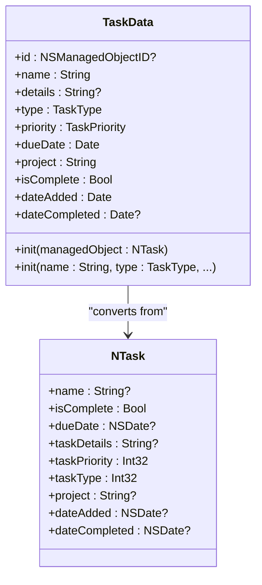
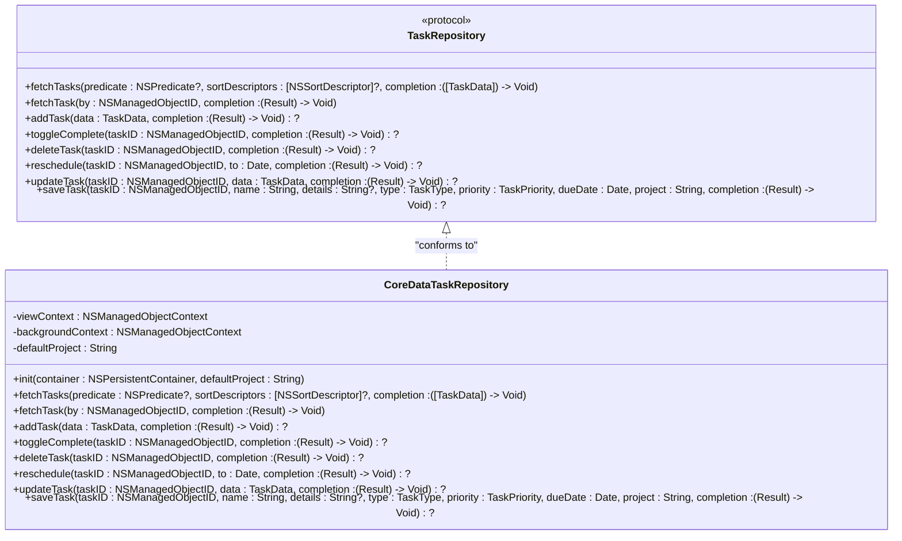
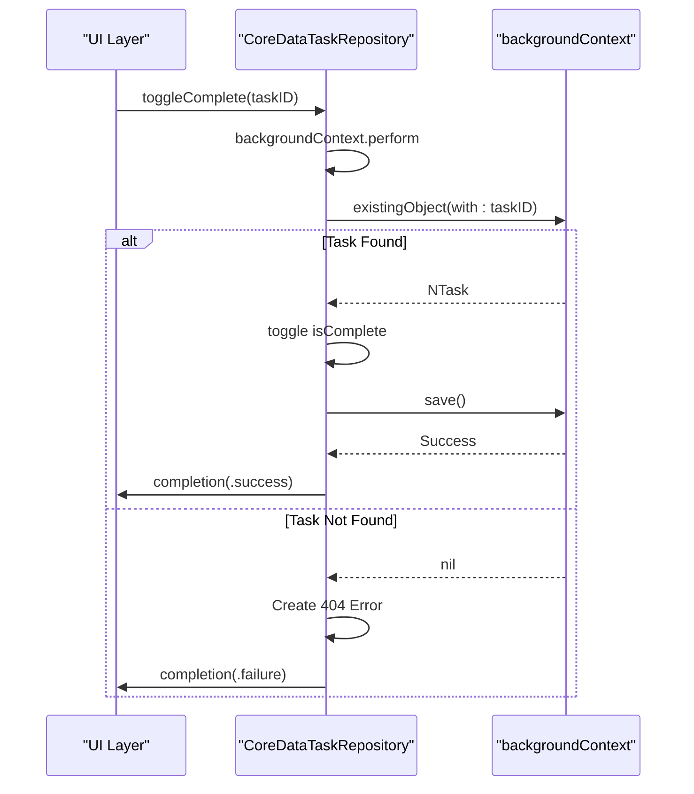

# Data Layer Architecture

<cite>
**Referenced Files in This Document**   
- [To Do List/Repositories/TaskRepository.swift](file://To Do List/Repositories/TaskRepository.swift)
- [To Do List/Repositories/CoreDataTaskRepository.swift](file://To Do List/Repositories/CoreDataTaskRepository.swift)
- [To Do List/Models/TaskData.swift](file://To Do List/Models/TaskData.swift)
- [To Do List/NTask+CoreDataClass.swift](file://To Do List/NTask+CoreDataClass.swift)
- [To Do List/NTask+CoreDataProperties.swift](file://To Do List/NTask+CoreDataProperties.swift)
- [To Do List/NTask+Extensions.swift](file://To Do List/NTask+Extensions.swift)
- [To Do List/ViewControllers/TaskManager.swift](file://To Do List/ViewControllers/TaskManager.swift)
</cite>

## Table of Contents
1. [Introduction](#introduction)
2. [Core Data Entities](#core-data-entities)
3. [Presentation Model: TaskData](#presentation-model-taskdata)
4. [Repository Pattern Implementation](#repository-pattern-implementation)
5. [CoreDataTaskRepository: Core Data Integration](#coredata-task-repository-core-data-integration)
6. [Data Access Patterns and Query Optimization](#data-access-patterns-and-query-optimization)
7. [Change Tracking and Synchronization](#change-tracking-and-synchronization)
8. [Error Handling and Validation](#error-handling-and-validation)
9. [Conflict Resolution in Distributed Scenarios](#conflict-resolution-in-distributed-scenarios)
10. [Data Flow from Repository to Presentation](#data-flow-from-repository-to-presentation)
11. [Architecture Diagram](#architecture-diagram)

## Introduction
The data layer in Tasker is designed to provide a clean, testable, and scalable abstraction over Core Data persistence. It implements the repository pattern to decouple business logic from data access concerns, enabling dependency injection and facilitating unit testing. The architecture centers around the `CoreDataTaskRepository` class, which conforms to the `TaskRepository` protocol and serves as the single source of truth for all task-related data operations. This document details the implementation of the data layer, including entity modeling, data transformation, persistence strategy, and interaction patterns between components.

## Core Data Entities
The primary data model in Tasker is represented by the `NTask` Core Data entity, which encapsulates all task-related attributes and behaviors.

### NTask Entity Properties
The `NTask` entity defines the following managed properties:
- **name**: Optional `String` representing the task title
- **isComplete**: `Bool` indicating completion status
- **dueDate**: Optional `NSDate` for task deadline
- **taskDetails**: Optional `String` for additional task information
- **taskPriority**: `Int32` representing priority level (1-4)
- **taskType**: `Int32` representing task category (1-4)
- **project**: Optional `String` for project assignment
- **alertReminderTime**: Optional `NSDate` for reminders
- **dateAdded**: Optional `NSDate` for creation timestamp
- **isEveningTask**: `Bool` flag for evening tasks
- **dateCompleted**: Optional `NSDate` for completion timestamp

The entity also includes a computed method `getTaskScore(task:)` that returns a numeric score based on task priority.

**Section sources**
- [To Do List/NTask+CoreDataProperties.swift](file://To Do List/NTask+CoreDataProperties.swift#L10-L53)

### TaskType and TaskPriority Enums
The application uses two enumerations to provide type-safe access to task categorization and prioritization:

```swift
enum TaskType: Int32, CaseIterable {
    case morning = 1
    case evening = 2
    case upcoming = 3
    case inbox = 4
}

enum TaskPriority: Int32, CaseIterable {
    case high = 1
    case medium = 3
    case low = 4
}
```

These enums map directly to the `Int32` fields in the Core Data model and provide semantic meaning to raw values.

**Section sources**
- [To Do List/ViewControllers/TaskManager.swift](file://To Do List/ViewControllers/TaskManager.swift#L15-L38)

## Presentation Model: TaskData
The `TaskData` struct serves as a presentation model that abstracts Core Data implementation details from the UI layer.

### Model Definition
```swift
struct TaskData {
    let id: NSManagedObjectID?
    let name: String
    let details: String?
    let type: TaskType
    let priority: TaskPriority
    let dueDate: Date
    let project: String
    let isComplete: Bool
    let dateAdded: Date
    let dateCompleted: Date?
}
```

### Data Transformation
The `TaskData` model provides two initializers:
1. **From Managed Object**: Converts an `NTask` instance to `TaskData`, handling optional value unwrapping with defaults
2. **Direct Initialization**: Creates a new `TaskData` instance with specified values

This transformation layer ensures that the presentation layer works with non-optional, Swift-native types while isolating Core Data dependencies.



**Diagram sources**
- [To Do List/Models/TaskData.swift](file://To Do List/Models/TaskData.swift#L5-L56)
- [To Do List/NTask+CoreDataProperties.swift](file://To Do List/NTask+CoreDataProperties.swift#L10-L53)

**Section sources**
- [To Do List/Models/TaskData.swift](file://To Do List/Models/TaskData.swift#L5-L56)

## Repository Pattern Implementation
The data layer implements the repository pattern through a protocol-conforming architecture that separates interface from implementation.

### TaskRepository Protocol
The `TaskRepository` protocol defines a comprehensive contract for task data operations:

```swift
protocol TaskRepository {
    func fetchTasks(predicate: NSPredicate?, 
                   sortDescriptors: [NSSortDescriptor]?, 
                   completion: @escaping ([TaskData]) -> Void)
    
    func fetchTask(by taskID: NSManagedObjectID, 
                  completion: @escaping (Result<NTask, Error>) -> Void)
    
    func addTask(data: TaskData, 
                completion: ((Result<NTask, Error>) -> Void)?)
    
    func toggleComplete(taskID: NSManagedObjectID, 
                       completion: ((Result<Void, Error>) -> Void)?)
    
    func deleteTask(taskID: NSManagedObjectID, 
                   completion: ((Result<Void, Error>) -> Void)?)
    
    // Additional methods for rescheduling, updating, and querying...
}
```

This protocol enables dependency injection, making the codebase more testable and maintainable.

### Design Benefits
- **Abstraction**: Hides Core Data specifics from consumers
- **Testability**: Allows mocking in unit tests
- **Flexibility**: Enables alternative implementations (e.g., in-memory, network-based)
- **Consistency**: Provides a uniform interface for data operations

**Section sources**
- [To Do List/Repositories/TaskRepository.swift](file://To Do List/Repositories/TaskRepository.swift#L6-L117)

## CoreDataTaskRepository: Core Data Integration
The `CoreDataTaskRepository` class provides the concrete implementation of the `TaskRepository` protocol using Core Data.

### Context Management
The repository employs a dual-context strategy:
- **viewContext**: Main queue context for UI-related fetches
- **backgroundContext**: Private queue context for write operations

```swift
init(container: NSPersistentContainer, defaultProject: String = "Inbox") {
    self.viewContext = container.viewContext
    self.backgroundContext = container.newBackgroundContext()
    self.defaultProject = defaultProject
    
    self.viewContext.automaticallyMergesChangesFromParent = true
    self.backgroundContext.mergePolicy = NSMergeByPropertyObjectTrumpMergePolicy
}
```

This approach ensures thread safety and optimal performance by isolating heavy write operations from the main thread.

### Thread-Safe Operations
All data operations are performed using context-specific queues:
- Read operations use `viewContext.perform {}`
- Write operations use `backgroundContext.perform {}`
- Completion callbacks are dispatched to the main queue

This pattern prevents concurrency issues and maintains UI responsiveness.



**Diagram sources**
- [To Do List/Repositories/TaskRepository.swift](file://To Do List/Repositories/TaskRepository.swift#L6-L117)
- [To Do List/Repositories/CoreDataTaskRepository.swift](file://To Do List/Repositories/CoreDataTaskRepository.swift#L10-L454)

**Section sources**
- [To Do List/Repositories/CoreDataTaskRepository.swift](file://To Do List/Repositories/CoreDataTaskRepository.swift#L10-L454)

## Data Access Patterns and Query Optimization
The repository implements several optimized query patterns for common use cases.

### Predicate-Based Filtering
The data layer uses `NSPredicate` for efficient filtering:
- **Time-based queries**: Filter tasks by date ranges using startOfDay/endOfDay
- **Project-based queries**: Filter by project name with case-insensitive matching
- **Status filtering**: Combine completion status with date conditions

### Specialized Query Methods
The repository provides dedicated methods for common access patterns:

```swift
func getMorningTasks(for date: Date, completion: @escaping ([TaskData]) -> Void)
func getEveningTasks(for date: Date, completion: @escaping ([TaskData]) -> Void)
func getUpcomingTasks(completion: @escaping ([TaskData]) -> Void)
func getTasksForInbox(date: Date, completion: @escaping ([TaskData]) -> Void)
func getTasksForProject(projectName: String, date: Date, completion: @escaping ([TaskData]) -> Void)
```

### Compound Predicates
For complex scenarios like inbox views, the repository combines multiple conditions using `NSCompoundPredicate`:
- Tasks due today (not complete)
- Tasks completed today
- Overdue tasks (only for current date)

This ensures comprehensive data retrieval while maintaining performance through indexed Core Data queries.

**Section sources**
- [To Do List/Repositories/CoreDataTaskRepository.swift](file://To Do List/Repositories/CoreDataTaskRepository.swift#L200-L400)

## Change Tracking and Synchronization
The data layer implements robust change tracking mechanisms to maintain data consistency across the application.

### Context Change Merging
The repository configures context merging policies:
- `viewContext.automaticallyMergesChangesFromParent = true`
- `backgroundContext.mergePolicy = NSMergeByPropertyObjectTrumpMergePolicy`

This ensures that changes made in the background context are automatically propagated to the view context.

### Notification System
The repository posts notifications for significant state changes:
```swift
NotificationCenter.default.post(name: NSNotification.Name("TaskCompletionChanged"), object: nil)
```

This allows other components (e.g., charts, analytics) to react to task completion events without tight coupling.

### CloudKit Synchronization
While not explicitly shown in the code, the dual-context architecture and merge policies are designed to support CloudKit synchronization:
- Background context can handle CloudKit fetches and saves
- Automatic merging ensures UI reflects cloud changes
- Conflict resolution is managed through the merge policy

**Section sources**
- [To Do List/Repositories/CoreDataTaskRepository.swift](file://To Do List/Repositories/CoreDataTaskRepository.swift#L100-L150)

## Error Handling and Validation
The repository implements comprehensive error handling for all data operations.

### Error Propagation
All operations use `Result` types to communicate success/failure:
- `Result<NTask, Error>` for fetch and add operations
- `Result<Void, Error>` for update, delete, and toggle operations

Errors are propagated through completion handlers, allowing callers to handle failures appropriately.

### Input Validation
The repository performs basic validation:
- Checks for task existence before updates/deletes
- Validates managed object retrieval
- Provides descriptive error messages with domain and code

### Failure Recovery
The implementation includes defensive programming patterns:
- Graceful degradation (return empty arrays on fetch errors)
- Nil coalescing for optional values with sensible defaults
- Thread-safe error reporting using main queue dispatch



**Diagram sources**
- [To Do List/Repositories/CoreDataTaskRepository.swift](file://To Do List/Repositories/CoreDataTaskRepository.swift#L150-L180)

**Section sources**
- [To Do List/Repositories/CoreDataTaskRepository.swift](file://To Do List/Repositories/CoreDataTaskRepository.swift#L150-L180)

## Conflict Resolution in Distributed Scenarios
The data layer is designed to handle conflicts that may arise in distributed environments.

### Merge Policy
The background context uses `NSMergeByPropertyObjectTrumpMergePolicy`, which:
- Gives priority to changes in the receiving context
- Resolves conflicts by favoring the most recent property values
- Minimizes data loss during concurrent modifications

### Atomic Operations
All write operations are performed within `perform` blocks, ensuring atomicity:
- Each operation runs on a dedicated private queue
- Changes are saved as complete transactions
- Partial updates are prevented

### Consistency Maintenance
The repository maintains data consistency through:
- Synchronized property updates (e.g., `dateCompleted` tied to `isComplete`)
- Extension methods that ensure related properties stay in sync
- Comprehensive error handling that prevents partial state changes

**Section sources**
- [To Do List/Repositories/CoreDataTaskRepository.swift](file://To Do List/Repositories/CoreDataTaskRepository.swift#L100-L120)
- [To Do List/NTask+Extensions.swift](file://To Do List/NTask+Extensions.swift#L10-L40)

## Data Flow from Repository to Presentation
The data flow follows a unidirectional pattern from repository to UI.

### Read Flow
1. UI requests data (e.g., "get morning tasks for today")
2. Repository executes Core Data fetch in background
3. Results are transformed to `TaskData` array
4. Completion handler is called on main queue
5. UI updates with new data

### Write Flow
1. UI initiates action (e.g., "toggle task completion")
2. Repository performs operation in background context
3. Changes are saved to persistent store
4. Notification is posted for side effects
5. Completion handler updates UI state

### Transformation Layer
The `TaskData` model acts as a boundary:
- Prevents Core Data objects from leaking to UI
- Provides Swift-native types for SwiftUI compatibility
- Enables easy mocking and testing of presentation logic

**Section sources**
- [To Do List/Repositories/CoreDataTaskRepository.swift](file://To Do List/Repositories/CoreDataTaskRepository.swift#L50-L200)
- [To Do List/Models/TaskData.swift](file://To Do List/Models/TaskData.swift#L5-L56)

## Architecture Diagram
```mermaid
graph TB
subgraph "Presentation Layer"
A[View Layer]
B[ViewModel]
end
subgraph "Data Layer"
C[TaskRepository<br/>Protocol]
D[CoreDataTaskRepository]
E[NTask<br/>Core Data Entity]
F[NSPersistentContainer]
end
A --> B
B --> C
C <|.. D
D --> E
D --> F
E --> F
style A fill:#f9f,stroke:#333
style B fill:#ff9,stroke:#333
style C fill:#9ff,stroke:#333
style D fill:#9f9,stroke:#333
style E fill:#f99,stroke:#333
style F fill:#99f,stroke:#333
click A "To Do List/View/TaskCard.swift"
click B "To Do List/ViewControllers/TaskManager.swift"
click C "To Do List/Repositories/TaskRepository.swift"
click D "To Do List/Repositories/CoreDataTaskRepository.swift"
click E "To Do List/NTask+CoreDataProperties.swift"
click F "AppDelegate.swift"
```

**Diagram sources**
- [To Do List/Repositories/TaskRepository.swift](file://To Do List/Repositories/TaskRepository.swift)
- [To Do List/Repositories/CoreDataTaskRepository.swift](file://To Do List/Repositories/CoreDataTaskRepository.swift)
- [To Do List/Models/TaskData.swift](file://To Do List/Models/TaskData.swift)
- [To Do List/NTask+CoreDataProperties.swift](file://To Do List/NTask+CoreDataProperties.swift)