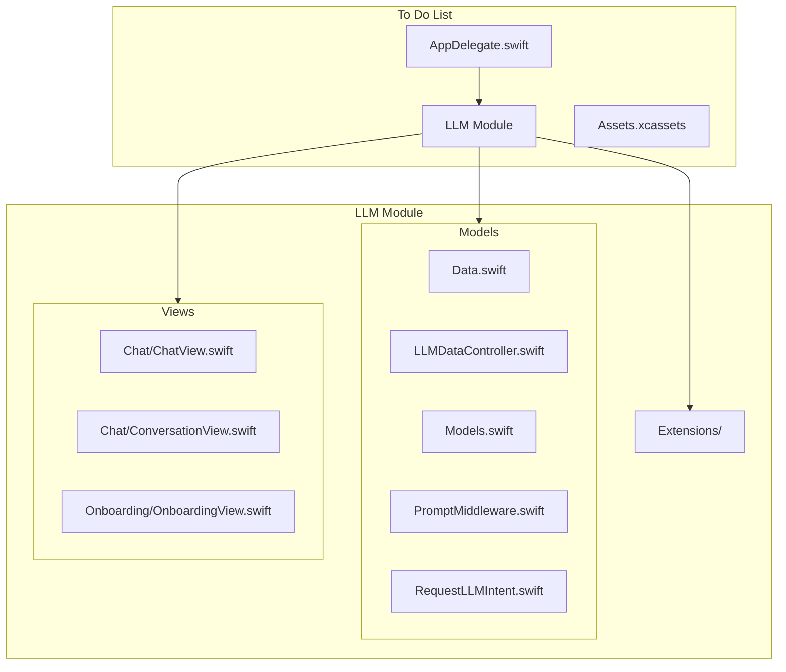
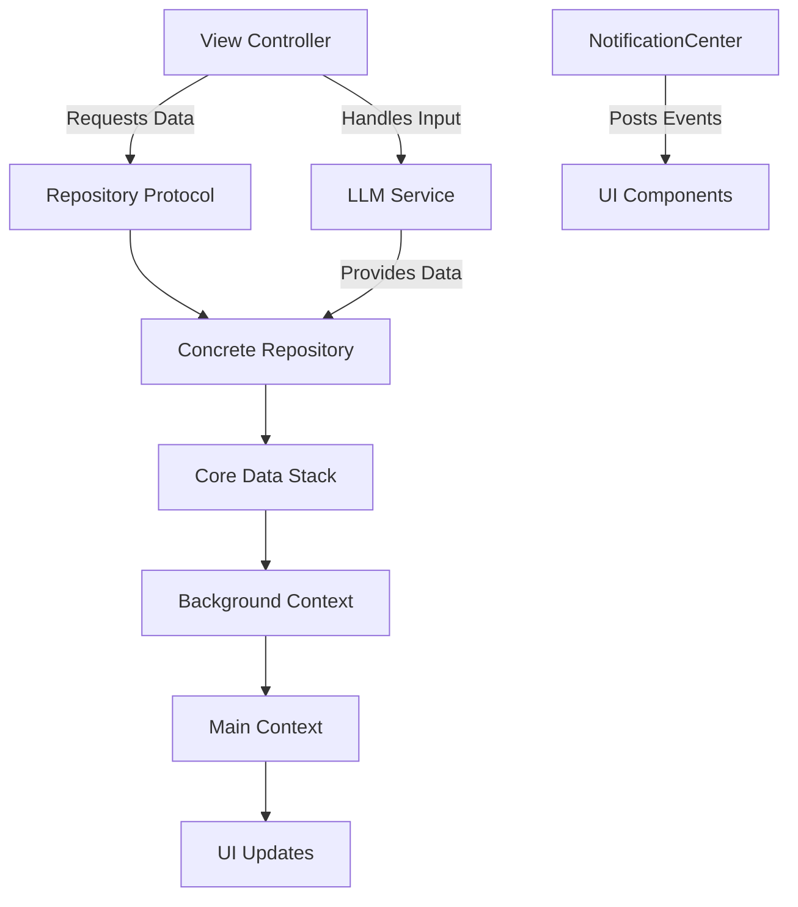
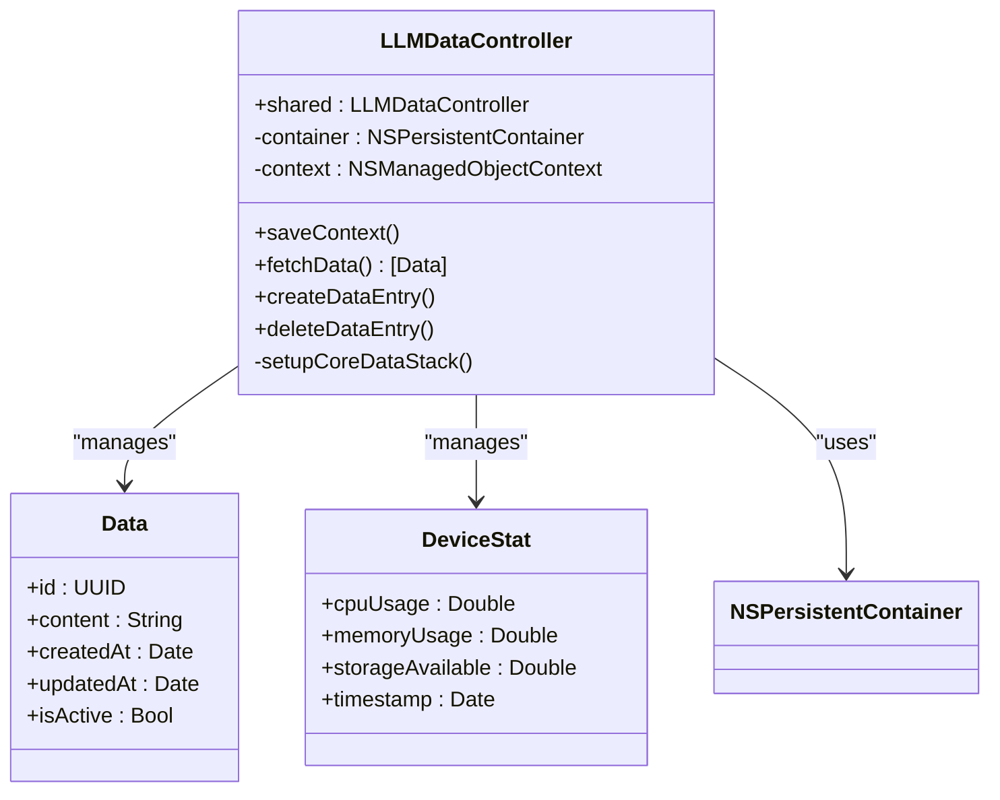
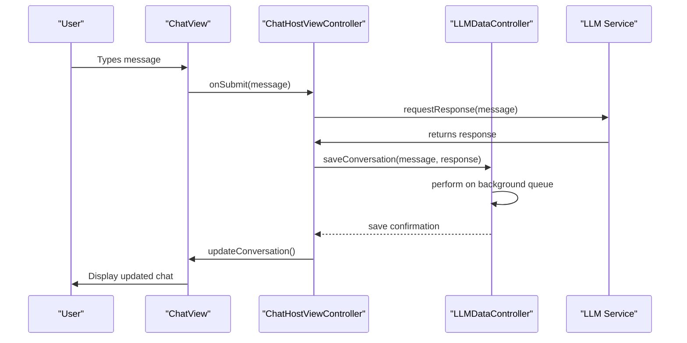
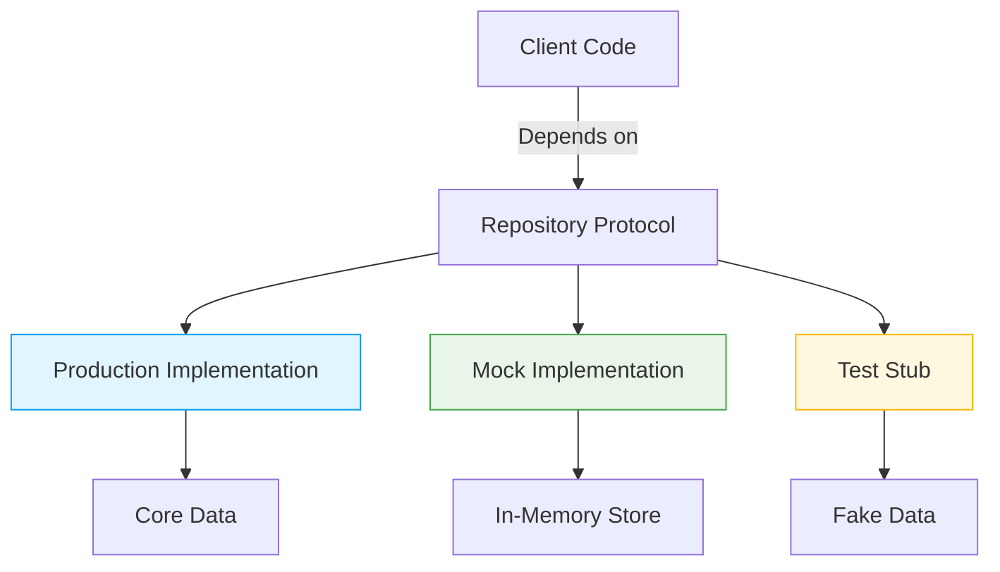
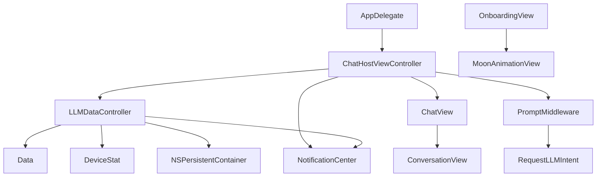

# Design Patterns and Architecture

<cite>
**Referenced Files in This Document**   
- [AppDelegate.swift](file://To%20Do%20List/AppDelegate.swift)
- [ChatHostViewController.swift](file://To%20Do%20List/LLM/ChatHostViewController.swift)
- [LLMDataController.swift](file://To%20Do%20List/LLM/Models/LLMDataController.swift)
- [Data.swift](file://To%20Do%20List/LLM/Models/Data.swift)
- [Models.swift](file://To%20Do%20List/LLM/Models/Models.swift)
- [PromptMiddleware.swift](file://To%20Do%20List/LLM/Models/PromptMiddleware.swift)
- [RequestLLMIntent.swift](file://To%20Do%20List/LLM/Models/RequestLLMIntent.swift)
- [ChatView.swift](file://To%20Do%20List/LLM/Views/Chat/ChatView.swift)
- [ConversationView.swift](file://To%20Do%20List/LLM/Views/Chat/ConversationView.swift)
- [OnboardingView.swift](file://To%20Do%20List/LLM/Views/Onboarding/OnboardingView.swift)
</cite>

## Table of Contents
1. [Introduction](#introduction)
2. [Project Structure](#project-structure)
3. [Core Components](#core-components)
4. [Architecture Overview](#architecture-overview)
5. [Detailed Component Analysis](#detailed-component-analysis)
6. [Dependency Analysis](#dependency-analysis)
7. [Performance Considerations](#performance-considerations)
8. [Troubleshooting Guide](#troubleshooting-guide)
9. [Conclusion](#conclusion)

## Introduction
The Tasker application implements a hybrid architectural approach combining elements of Model-View-Controller (MVC), Repository pattern, and event-driven design. This document analyzes the key architectural patterns used in the application, focusing on how concerns are separated between user interface, business logic, and data access layers. The architecture leverages protocol-oriented programming in Swift to enhance testability and flexibility, particularly through the use of the TaskRepository protocol for abstracting data operations. The system also incorporates modern Swift features such as property wrappers and extensions to extend traditional MVC patterns.

## Project Structure
The project follows a feature-based organization within the "To Do List" directory, with components grouped by functionality rather than architectural layer. The LLM module contains subdirectories for Models, Views, and Extensions, indicating a modular approach to organizing code. The Models directory houses data controllers and business logic, while Views contain UI components. The use of dedicated directories for specific features like onboarding and chat indicates a focus on user experience flows. Asset management is centralized in Assets.xcassets, following iOS best practices.

**Diagram sources**
- [AppDelegate.swift](file://To%20Do%20List/AppDelegate.swift)
- [LLMDataController.swift](file://To%20Do%20List/LLM/Models/LLMDataController.swift)

**Section sources**
- [AppDelegate.swift](file://To%20Do%20List/AppDelegate.swift)
- [ChatHostViewController.swift](file://To%20Do%20List/LLM/ChatHostViewController.swift)

## Core Components
The core components of the Tasker application revolve around the LLM (Large Language Model) integration, with key responsibilities distributed across data management, user interface, and business logic layers. The LLMDataController serves as the central data management component, coordinating between the UI and data persistence. The ChatHostViewController acts as the primary view controller, managing the chat interface and user interactions. The architecture employs a repository pattern through protocol abstraction, allowing for mock implementations during testing. Key models such as Data and DeviceStat define the application's data structures, while views like ChatView and ConversationView handle user interface presentation.

**Section sources**
- [LLMDataController.swift](file://To%20Do%20List/LLM/Models/LLMDataController.swift)
- [Data.swift](file://To%20Do%20List/LLM/Models/Data.swift)
- [ChatView.swift](file://To%20Do%20List/LLM/Views/Chat/ChatView.swift)

## Architecture Overview
The Tasker application implements a hybrid MVC architecture enhanced with the Repository pattern to achieve clear separation of concerns. The architecture follows a layered approach where view controllers handle user interface concerns, models manage data structures, and controllers coordinate between views and data. The Repository pattern is implemented through protocol-oriented programming, with the TaskRepository protocol abstracting data operations and enabling dependency injection. This allows for easy substitution of real data sources with mock implementations during testing, significantly improving testability.

Data persistence is managed through Core Data, with operations performed on background contexts to ensure UI responsiveness. The application uses NotificationCenter for event-driven communication between components, enabling loose coupling and facilitating UI updates when data changes occur. This event-driven approach ensures that multiple UI components can react to data changes without direct dependencies on each other.

**Diagram sources**
- [LLMDataController.swift](file://To%20Do%20List/LLM/Models/LLMDataController.swift)
- [Data.swift](file://To%20Do%20List/LLM/Models/Data.swift)
- [ChatHostViewController.swift](file://To%20Do%20List/LLM/ChatHostViewController.swift)

## Detailed Component Analysis

### LLMDataController Analysis
The LLMDataController component serves as the central data management hub in the Tasker application, implementing the repository pattern to abstract data operations. It encapsulates the complexity of data persistence and retrieval, providing a clean interface for other components to interact with data. The controller manages the Core Data stack and ensures that data operations are performed on appropriate dispatch queues to maintain UI responsiveness. It also handles data synchronization and coordinates between different data sources, including local storage and potential remote services.

**Diagram sources**
- [LLMDataController.swift](file://To%20Do%20List/LLM/Models/LLMDataController.swift)
- [Data.swift](file://To%20Do%20List/LLM/Models/Data.swift)
- [Models.swift](file://To%20Do%20List/LLM/Models/Models.swift)

### Chat Interface Analysis
The chat interface components demonstrate how MVC is extended with modern Swift practices to create a responsive and maintainable user experience. The ChatHostViewController orchestrates the chat flow, managing the lifecycle of chat sessions and coordinating between input, conversation display, and LLM interaction. The ChatView and ConversationView components implement the visual presentation of the chat interface, using SwiftUI-like declarative syntax to define the UI structure.

The architecture leverages property wrappers and extensions to enhance the base MVC pattern. For example, the View+IfModifier.swift extension provides conditional view rendering capabilities, allowing for more expressive UI code without cluttering view controllers with presentation logic. This approach maintains the separation of concerns while enabling more sophisticated UI behaviors.

**Diagram sources**
- [ChatHostViewController.swift](file://To%20Do%20List/LLM/ChatHostViewController.swift)
- [ChatView.swift](file://To%20Do%20List/LLM/Views/Chat/ChatView.swift)
- [LLMDataController.swift](file://To%20Do%20List/LLM/Models/LLMDataController.swift)

### Protocol-Oriented Design Analysis
The Tasker application extensively uses protocol-oriented programming to enhance flexibility and testability. The architecture defines clear protocols for key components, allowing for dependency injection and easy substitution of implementations. This approach enables mock objects to be used during testing, isolating components and making unit tests more reliable and faster to execute.

The repository pattern is implemented through protocol abstraction, with concrete implementations providing the actual data access logic. This separation allows the business logic to depend on abstractions rather than concrete implementations, following the Dependency Inversion Principle. The use of protocols also facilitates the creation of adapters for different data sources, making it easier to integrate new storage mechanisms or services in the future.

**Diagram sources**
- [LLMDataController.swift](file://To%20Do%20List/LLM/Models/LLMDataController.swift)
- [PromptMiddleware.swift](file://To%20Do%20List/LLM/Models/PromptMiddleware.swift)
- [RequestLLMIntent.swift](file://To%20Do%20List/LLM/Models/RequestLLMIntent.swift)

## Dependency Analysis
The Tasker application demonstrates a well-structured dependency graph with clear separation between components. The architecture follows a unidirectional flow of dependencies, with higher-level components depending on lower-level abstractions rather than concrete implementations. The use of protocols for key interfaces ensures that components are loosely coupled, making the system more maintainable and testable.

The Core Data stack is encapsulated within the LLMDataController, preventing direct access from other components and ensuring that all data operations go through a well-defined interface. This encapsulation also makes it easier to modify the underlying persistence mechanism without affecting the rest of the application. The event-driven communication through NotificationCenter further reduces coupling between components, allowing them to react to changes without direct dependencies.

**Diagram sources**
- [AppDelegate.swift](file://To%20Do%20List/AppDelegate.swift)
- [ChatHostViewController.swift](file://To%20Do%20List/LLM/ChatHostViewController.swift)
- [LLMDataController.swift](file://To%20Do%20List/LLM/Models/LLMDataController.swift)

**Section sources**
- [AppDelegate.swift](file://To%20Do%20List/AppDelegate.swift)
- [ChatHostViewController.swift](file://To%20Do%20List/LLM/ChatHostViewController.swift)
- [LLMDataController.swift](file://To%20Do%20List/LLM/Models/LLMDataController.swift)

## Performance Considerations
The architecture incorporates several performance optimizations to ensure a responsive user experience. Data operations are performed on background contexts to prevent UI blocking, with changes merged back to the main context for UI updates. The use of NSFetchedResultsController or similar mechanisms likely enables efficient handling of large datasets in table views and collection views.

The event-driven architecture with NotificationCenter helps minimize unnecessary work by allowing components to react only when relevant changes occur. However, care must be taken to properly manage observer lifetimes to prevent memory leaks. The protocol-oriented design may introduce small performance overhead due to dynamic dispatch, but this is typically negligible compared to the benefits of improved testability and maintainability.

## Troubleshooting Guide
When encountering issues with the Tasker application's architecture, consider the following common problems and solutions:

1. **UI Freezing During Data Operations**: Ensure that all Core Data operations are performed on background contexts and that context saving is properly dispatched. Check that the LLMDataController is using appropriate dispatch queues for data operations.

2. **Memory Leaks with NotificationCenter**: Verify that all observers are properly removed in deinit methods or viewWillDisappear. Use weak references when adding observers to prevent retain cycles.

3. **Test Failures with Mock Objects**: Ensure that mock implementations of protocols fully cover the expected behavior. Check that dependency injection is properly configured in test environments.

4. **Data Synchronization Issues**: Confirm that context merging is properly implemented between background and main contexts. Verify that NSFetchedResultsController delegates are correctly updated.

5. **Protocol Conformance Issues**: When extending functionality, ensure that new methods are properly added to protocols and that all conforming types implement the required methods.

**Section sources**
- [LLMDataController.swift](file://To%20Do%20List/LLM/Models/LLMDataController.swift)
- [ChatHostViewController.swift](file://To%20Do%20List/LLM/ChatHostViewController.swift)
- [View+IfModifier.swift](file://To%20Do%20List/LLM/Extensions/View+IfModifier.swift)

## Conclusion
The Tasker application employs a sophisticated hybrid architecture that combines traditional MVC patterns with modern software design principles. The integration of the Repository pattern through protocol-oriented programming provides excellent separation of concerns, making the codebase more maintainable and testable. The use of event-driven communication via NotificationCenter enables loose coupling between components while ensuring timely UI updates.

Compared to alternatives like MVVM or VIPER, this architecture strikes a balance between complexity and flexibility. While MVVM might provide better separation of UI and business logic, the current approach leverages Swift's strengths in protocol-oriented programming to achieve similar benefits with less boilerplate. VIPER would provide even stricter separation but at the cost of increased complexity that may not be justified for this application's scope.

The architecture should be extended when new features require similar data management patterns, following the established repository pattern. However, if the application grows significantly in complexity, particularly in the UI layer, consideration should be given to adopting MVVM or another pattern that provides clearer separation between view and business logic. The current foundation provides a solid base for either evolution path.