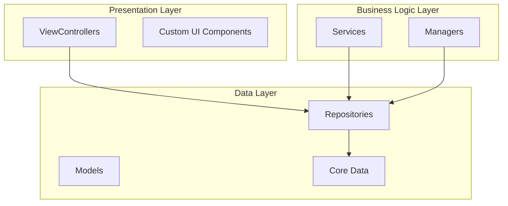
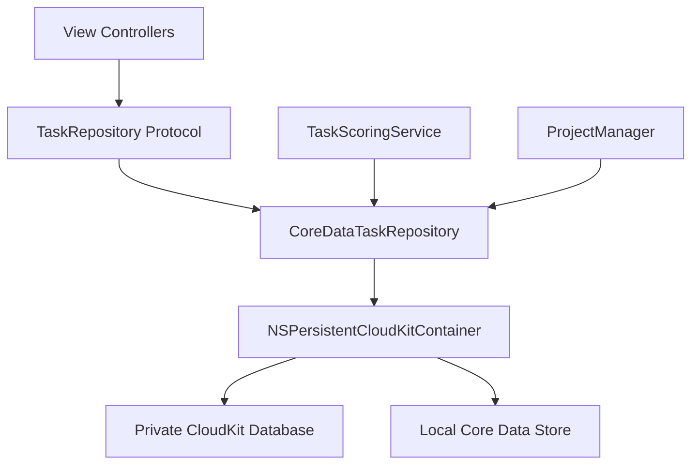
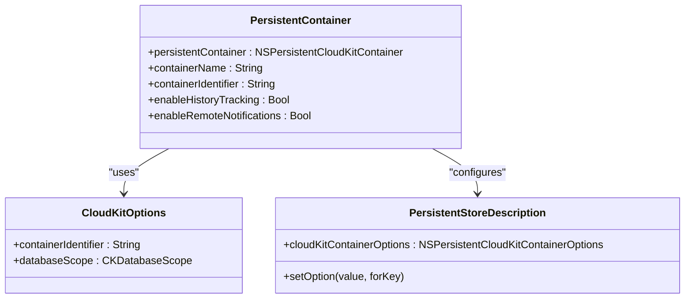
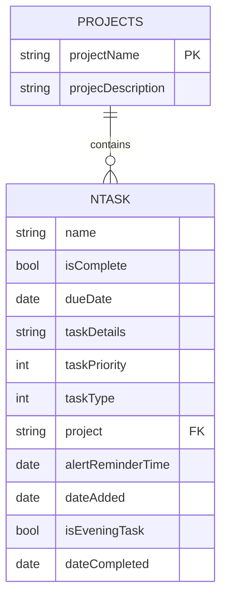
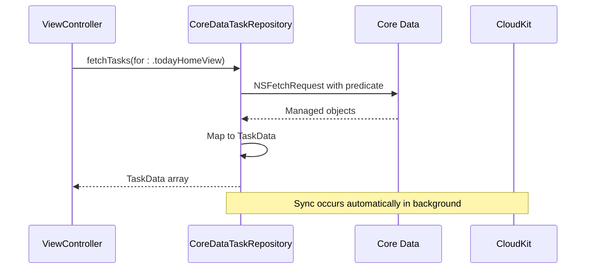
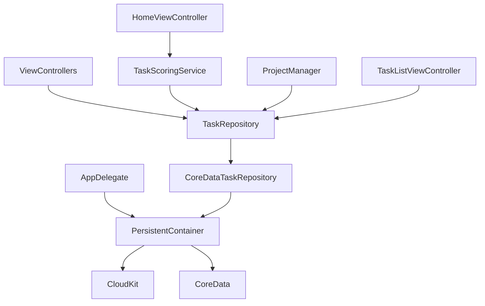

# CloudKit Data Synchronization

<cite>
**Referenced Files in This Document**   
- [README.md](file://README.md#L1321-L1354)
- [AppDelegate.swift](file://To%20Do%20List/AppDelegate.swift)
- [CoreDataTaskRepository.swift](file://To%20Do%20List/Repositories/CoreDataTaskRepository.swift)
- [TaskData.swift](file://To%20Do%20List/Models/TaskData.swift)
- [TaskModel.xcdatamodeld](file://To%20Do%20List/Model/TaskModel.xcdatamodeld)
</cite>

## Table of Contents
1. [Introduction](#introduction)
2. [Project Structure](#project-structure)
3. [Core Components](#core-components)
4. [Architecture Overview](#architecture-overview)
5. [Detailed Component Analysis](#detailed-component-analysis)
6. [Dependency Analysis](#dependency-analysis)
7. [Performance Considerations](#performance-considerations)
8. [Troubleshooting Guide](#troubleshooting-guide)
9. [Conclusion](#conclusion)

## Introduction
This document provides comprehensive documentation for CloudKit integration in Tasker, an iOS task management application. The system leverages Apple's NSPersistentCloudKitContainer to enable seamless data synchronization across devices using iCloud. Tasker implements a local-first architecture where all task and project data is stored in a Core Data persistent container that automatically syncs with CloudKit. The implementation uses private databases exclusively, ensuring user data privacy while enabling multi-device access. Key features include real-time synchronization via push notifications, robust conflict resolution through history tracking, and offline-first design that ensures uninterrupted user experience regardless of network connectivity.

## Project Structure
The Tasker project follows a hybrid architecture combining MVC patterns with Repository pattern and dependency injection. The application code is organized into logical modules that separate concerns and improve maintainability.

**Diagram sources**
- [README.md](file://README.md#L148-L184)

**Section sources**
- [README.md](file://README.md#L148-L184)

## Core Components
The core components of Tasker's CloudKit integration revolve around the NSPersistentCloudKitContainer configuration, data models, and repository pattern implementation. The persistent container is lazily initialized in the AppDelegate and configured with specific options for CloudKit synchronization. The data layer consists of two primary entities: NTask for individual tasks and Projects for task organization. The repository pattern abstracts data access through the CoreDataTaskRepository, which provides a clean interface between the presentation layer and Core Data persistence.

**Section sources**
- [AppDelegate.swift](file://To%20Do%20List/AppDelegate.swift)
- [CoreDataTaskRepository.swift](file://To%20Do%20List/Repositories/CoreDataTaskRepository.swift)
- [TaskModel.xcdatamodeld](file://To%20Do%20List/Model/TaskModel.xcdatamodeld)

## Architecture Overview
Tasker's architecture follows a progression from a legacy monolithic design to a more maintainable repository pattern. The current architecture implements a clean separation of concerns, with view controllers depending on repository protocols rather than directly on data management singletons.

**Diagram sources**
- [README.md](file://README.md#L148-L184)

## Detailed Component Analysis

### CloudKit Configuration Analysis
The CloudKit integration is configured through the NSPersistentCloudKitContainer, which automatically handles synchronization between the local Core Data store and iCloud.

**Diagram sources**
- [README.md](file://README.md#L1321-L1354)

**Section sources**
- [README.md](file://README.md#L1321-L1354)

### Data Model Analysis
The data model consists of two primary entities: NTask and Projects, with a logical relationship between them. The schema is designed to support efficient querying and synchronization.

**Diagram sources**
- [README.md](file://README.md#L887-L924)

**Section sources**
- [README.md](file://README.md#L870-L924)

### Repository Pattern Analysis
The repository pattern provides an abstraction layer between the application logic and data persistence, enabling better testability and separation of concerns.

**Diagram sources**
- [CoreDataTaskRepository.swift](file://To%20Do%20List/Repositories/CoreDataTaskRepository.swift)

**Section sources**
- [CoreDataTaskRepository.swift](file://To%20Do%20List/Repositories/CoreDataTaskRepository.swift)
- [TaskData.swift](file://To%20Do%20List/Models/TaskData.swift)

## Dependency Analysis
The dependency graph shows how components interact within the CloudKit synchronization system. The architecture minimizes coupling by using protocol-based dependencies and dependency injection.

**Diagram sources**
- [AppDelegate.swift](file://To%20Do%20List/AppDelegate.swift)
- [README.md](file://README.md#L148-L184)

**Section sources**
- [AppDelegate.swift](file://To%20Do%20List/AppDelegate.swift)
- [README.md](file://README.md#L148-L184)

## Performance Considerations
Tasker implements several performance optimizations to ensure efficient data access and synchronization:

- **Query Optimization**: Uses NSPredicate filtering instead of in-memory arrays, reducing memory footprint and improving fetch performance
- **Background Processing**: Repository operations occur on background contexts to prevent UI blocking
- **Efficient Fetching**: Implements NSFetchedResultsController for incremental UI updates
- **Batch Operations**: While not explicitly shown, NSPersistentCloudKitContainer handles batch synchronization automatically
- **Bandwidth Usage**: CloudKit's differential sync minimizes data transfer by only syncing changes
- **Caching Strategy**: Eliminated redundant in-memory caches in favor of Core Data's built-in caching mechanisms

The local-first architecture ensures optimal performance even with limited or no network connectivity, as all operations are performed against the local Core Data store with synchronization occurring in the background.

## Troubleshooting Guide
Common issues and their solutions for CloudKit synchronization in Tasker:

**Section sources**
- [README.md](file://README.md#L1321-L1354)
- [AppDelegate.swift](file://To%20Do%20List/AppDelegate.swift)

### Synchronization Issues
- **Problem**: Data not syncing across devices
- **Solution**: Verify iCloud account is signed in on all devices and that iCloud Drive is enabled. Check that the container identifier `iCloud.TaskerCloudKit` appears in the device's iCloud settings.

### Data Conflicts
- **Problem**: Conflicting changes on different devices
- **Solution**: The system uses NSMergeByPropertyStoreTrumpMergePolicy which favors the store's version during conflicts. History tracking helps resolve these automatically.

### Missing Data
- **Problem**: Tasks or projects not appearing after sync
- **Solution**: Ensure the "Inbox" project exists by calling `fixMissingProjectsDataWithDefaults()`. Verify that the Core Data model version is consistent across devices.

### Performance Problems
- **Problem**: Slow app startup or UI responsiveness
- **Solution**: The app uses background contexts for data operations. Monitor fetch requests and ensure predicates are optimized for the query patterns.

### Debugging Tips
- Use CloudKit Dashboard to inspect record data and synchronization status
- Enable CloudKit logging in the device settings for detailed sync information
- Check Firebase Crashlytics for any persistence-related crashes
- Verify that NSPersistentHistoryTrackingKey is enabled for proper change tracking

## Conclusion
Tasker implements a robust CloudKit synchronization system using NSPersistentCloudKitContainer to provide seamless multi-device task management. The architecture combines Core Data's local persistence with CloudKit's cloud synchronization, creating a local-first experience that works offline and automatically syncs when connectivity is restored. Key strengths include the use of history tracking for reliable conflict resolution, private databases for user privacy, and a repository pattern that improves code maintainability and testability. The system is configured with optimal settings including remote change notifications for real-time updates and appropriate merge policies for handling concurrent modifications. While the current implementation focuses on private databases, future enhancements could include shared databases for collaborative task management. The ongoing architectural refactoring toward clean architecture principles ensures the codebase remains maintainable as new features are added.