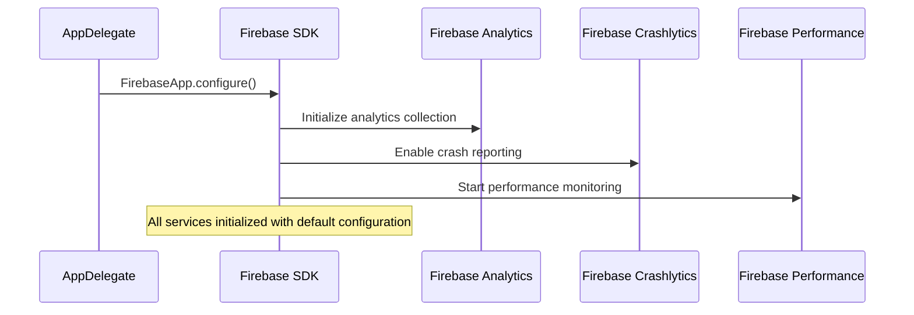
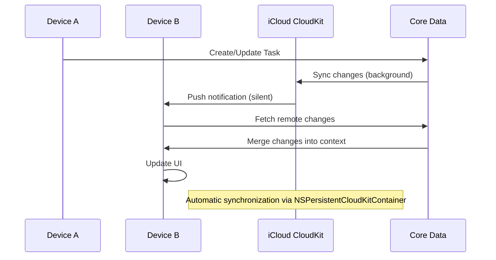
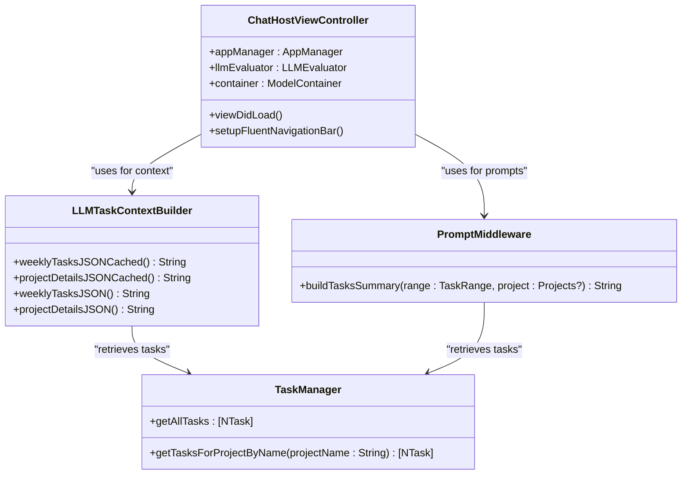

# External Integration Points

<cite>
**Referenced Files in This Document**   
- [AppDelegate.swift](file://To%20Do%20List/AppDelegate.swift)
- [ChatHostViewController.swift](file://To%20Do%20List/LLM/ChatHostViewController.swift)
- [LLMTaskContextBuilder.swift](file://To%20Do%20List/LLM/Models/LLMTaskContextBuilder.swift)
- [PromptMiddleware.swift](file://To%20Do%20List/LLM/Models/PromptMiddleware.swift)
- [Podfile](file://Podfile)
- [TaskManager.swift](file://To%20Do%20List/ViewControllers/TaskManager.swift)
</cite>

## Table of Contents
1. [Firebase Integration](#firebase-integration)
2. [CloudKit Synchronization](#cloudkit-synchronization)
3. [LLM Integration](#llm-integration)
4. [Third-Party Libraries](#third-party-libraries)

## Firebase Integration

The Tasker application integrates Firebase for analytics, crash reporting, and performance monitoring. Firebase is initialized in the `AppDelegate` during application launch, ensuring that all Firebase services are available throughout the app lifecycle.

Firebase services are configured via CocoaPods with the following dependencies specified in the Podfile:
- `Firebase/Analytics` for tracking user interactions and feature usage
- `Firebase/Crashlytics` for crash reporting and stability monitoring
- `Firebase/Performance` for performance monitoring and optimization

The initialization occurs in the `application(_:didFinishLaunchingWithOptions:)` method of `AppDelegate.swift`, where `FirebaseApp.configure()` is called to bootstrap the Firebase SDK. This enables automatic collection of analytics events, crash reports, and performance metrics without requiring additional instrumentation in most cases.



**Diagram sources**
- [AppDelegate.swift](file://To%20Do%20List/AppDelegate.swift#L25-L30)
- [Podfile](file://Podfile#L4-L6)

**Section sources**
- [AppDelegate.swift](file://To%20Do%20List/AppDelegate.swift#L25-L30)
- [Podfile](file://Podfile#L4-L6)

## CloudKit Synchronization

Tasker implements seamless data synchronization across Apple devices using CloudKit. The integration is built on `NSPersistentCloudKitContainer`, which bridges Core Data and CloudKit to provide automatic syncing of task data between devices.

The persistent container is configured with a dedicated CloudKit container identified by `iCloud.TaskerCloudKit`. This ensures that user data remains in their personal iCloud private database, maintaining privacy and security. The configuration includes:

- **History Tracking**: Enabled via `NSPersistentHistoryTrackingKey` to support robust sync conflict resolution
- **Remote Change Notifications**: Enabled to receive silent push notifications when changes occur on other devices
- **Merge Policy**: Configured with `NSMergeByPropertyStoreTrumpMergePolicy` for intelligent conflict handling
- **Background Sync**: Automatic merging of remote changes through the `handlePersistentStoreRemoteChange` method

The synchronization process is triggered automatically when the persistent container loads, and the app registers for remote notifications to receive CloudKit updates. When a remote change notification is received, the app merges changes into the main context and triggers data integrity checks.



**Diagram sources**
- [AppDelegate.swift](file://To%20Do%20List/AppDelegate.swift#L150-L180)
- [AppDelegate.swift](file://To%20Do%20List/AppDelegate.swift#L200-L230)

**Section sources**
- [AppDelegate.swift](file://To%20Do%20List/AppDelegate.swift#L150-L180)

## LLM Integration

The Tasker application features a local LLM integration accessible through the `ChatHostViewController`. This UIKit view controller hosts a SwiftUI interface that dynamically presents either onboarding content (when no model is installed) or the main chat interface.

The LLM integration is built around several key components:

- **ChatHostViewController**: The entry point that embeds the SwiftUI chat interface and configures the FluentUI navigation bar
- **LLMTaskContextBuilder**: Responsible for building contextual information from the user's tasks to inject into LLM prompts
- **PromptMiddleware**: Handles prompt engineering and task summarization for LLM interactions

### Context Building

The `LLMTaskContextBuilder` class generates contextual JSON data from the user's tasks, focusing on the current week's tasks. It provides two primary methods:

- `weeklyTasksJSONCached()`: Returns a JSON string containing tasks due within the next 7 days, with a 5-minute cache to avoid recomputation
- `projectDetailsJSONCached()`: Returns a JSON string containing all projects and their associated tasks

The context builder retrieves tasks through `TaskManager.sharedInstance.getAllTasks` and filters them based on due dates and completion status. The resulting JSON includes task metadata such as title, project, priority, due date, and notes.



**Diagram sources**
- [ChatHostViewController.swift](file://To%20Do%20List/LLM/ChatHostViewController.swift#L20-L50)
- [LLMTaskContextBuilder.swift](file://To%20Do%20List/LLM/Models/LLMTaskContextBuilder.swift#L10-L30)
- [PromptMiddleware.swift](file://To%20Do%20List/LLM/Models/PromptMiddleware.swift#L10-L20)
- [TaskManager.swift](file://To%20Do%20List/ViewControllers/TaskManager.swift#L50-L60)

### Prompt Engineering

The `PromptMiddleware` class handles prompt engineering by providing the `buildTasksSummary(range:project:)` method. This method filters tasks based on a time range (today, tomorrow, week, month, all) and an optional project filter, returning a bulleted summary of open tasks.

The prompt engineering process involves:
1. Filtering tasks from `TaskManager.sharedInstance.getAllTasks` based on completion status
2. Applying project filtering (if specified) using case-insensitive comparison
3. Applying date range filtering using Calendar operations
4. Formatting the results as a bulleted list or "(no tasks)" if none match

This engineered prompt provides contextual awareness to the LLM, allowing it to make relevant suggestions based on the user's current task load.

**Section sources**
- [ChatHostViewController.swift](file://To%20Do%20List/LLM/ChatHostViewController.swift#L20-L50)
- [LLMTaskContextBuilder.swift](file://To%20Do%20List/LLM/Models/LLMTaskContextBuilder.swift#L10-L200)
- [PromptMiddleware.swift](file://To%20Do%20List/LLM/Models/PromptMiddleware.swift#L10-L50)

## Third-Party Libraries

Tasker leverages several third-party libraries to enhance functionality and user experience. These dependencies are managed through CocoaPods as specified in the Podfile.

### Data Visualization with DGCharts

The application uses DGCharts (version 5.1) for data visualization in the analytics dashboard. DGCharts provides interactive charts that display:

- Completion trends (daily, weekly, monthly) with dynamic scaling
- Priority distribution via pie charts
- Project performance with bar charts
- Streak visualization with line charts using cubic Bezier smoothing
- Score progression with historical tracking

Charts are updated in real-time through integration with `NSFetchedResultsController`, which automatically refreshes the chart data when underlying task data changes.

### Date Selection with FSCalendar

FSCalendar (version 2.8.1) is used for visual due date selection in the task creation interface. The calendar component provides:

- Visual date selection with month/year navigation
- Customizable appearance to match the app's design system
- Integration with the task creation workflow
- Synchronization with chart views for weekly/monthly analytics

The calendar is integrated into the `AddTaskViewController` to provide an intuitive interface for setting task due dates.

### Interface Components with FluentUI

Microsoft's FluentUI design system (version 0.33.2) is used to implement a modern, accessible interface. Key components include:

- **FluentUI Table Cells**: Custom table cells with priority indicators, due date displays, and completion checkboxes
- **Segmented Controls**: For task type selection (Morning, Evening, Upcoming, Inbox)
- **Navigation Bar**: Custom styling with large leading titles and custom colors
- **Icons**: FluentUI icons such as dismiss icons for UI actions

The FluentUI integration ensures a consistent visual identity across the application while providing accessibility features like comprehensive VoiceOver support.

```mermaid
graph TB
subgraph "Third-Party Libraries"
DGCharts[DGCharts<br>Version 5.1]
FSCalendar[FSCalendar<br>Version 2.8.1]
FluentUI[MicrosoftFluentUI<br>Version 0.33.2]
end
subgraph "Tasker Application"
Analytics[Analytics Dashboard]
TaskCreation[AddTaskViewController]
MainInterface[Main UI Components]
end
DGCharts --> Analytics
FSCalendar --> TaskCreation
FluentUI --> MainInterface
Note over Analytics: Interactive charts with real-time updates
Note over TaskCreation: Visual due date selection
Note over MainInterface: Consistent design system with accessibility
```

**Diagram sources**
- [Podfile](file://Podfile#L10-L13)
- [Podfile](file://Podfile#L15-L16)
- [Podfile](file://Podfile#L20-L21)

**Section sources**
- [Podfile](file://Podfile#L10-L21)