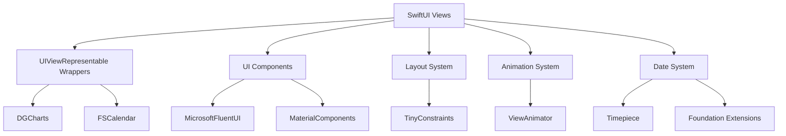
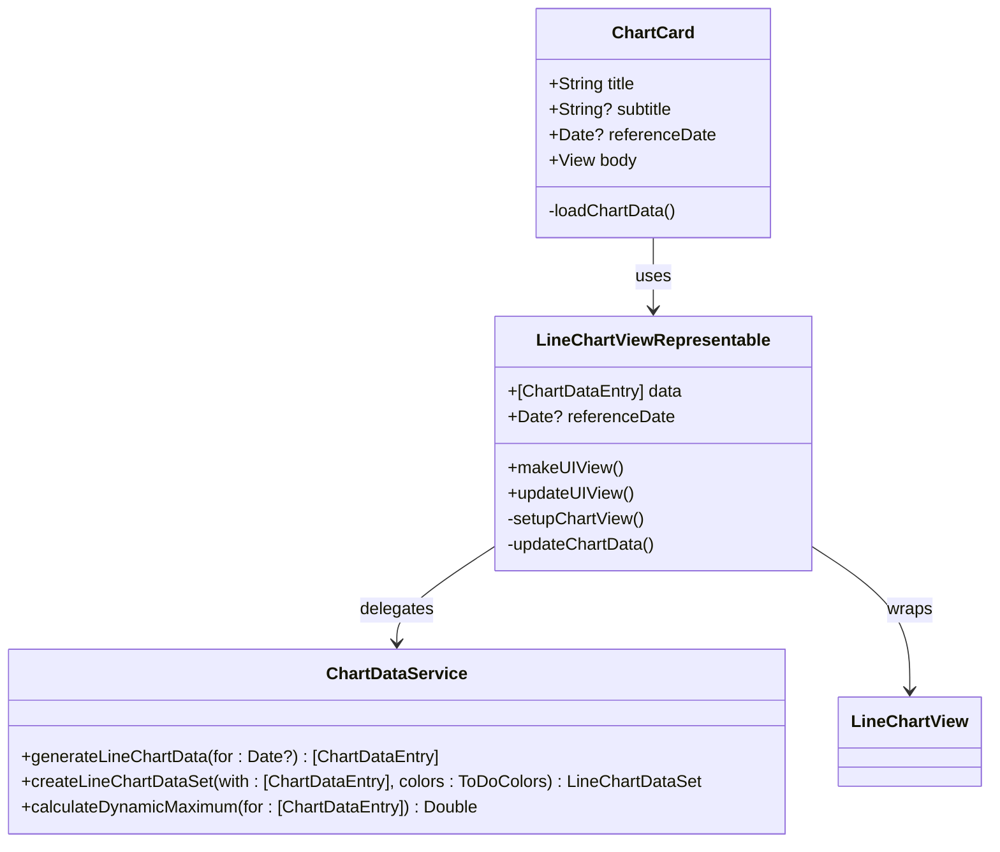
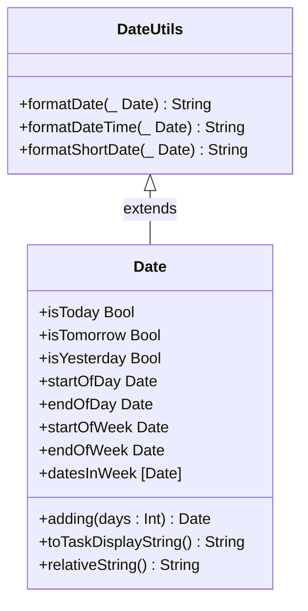
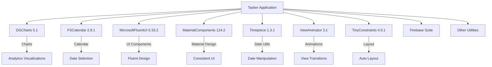

# Third-Party UI and Utility Libraries

<cite>
**Referenced Files in This Document**   
- [Podfile](file://Podfile#L1-L40)
- [ChartCard.swift](file://To%20Do%20List/Views/Cards/ChartCard.swift#L1-L255)
- [DateUtils.swift](file://To%20Do%20List/Utils/DateUtils.swift#L1-L282)
- [README.md](file://README.md#L23-L1500)
</cite>

## Table of Contents
1. [Introduction](#introduction)
2. [Project Structure](#project-structure)
3. [Core Components](#core-components)
4. [Architecture Overview](#architecture-overview)
5. [Detailed Component Analysis](#detailed-component-analysis)
6. [Dependency Analysis](#dependency-analysis)
7. [Performance Considerations](#performance-considerations)
8. [Troubleshooting Guide](#troubleshooting-guide)
9. [Conclusion](#conclusion)

## Introduction
This document provides a comprehensive analysis of the third-party UI and utility libraries integrated into the Tasker iOS application. The focus is on understanding how libraries such as DGCharts, FSCalendar, MicrosoftFluentUI, MaterialComponents, TinyConstraints, ViewAnimator, and Timepiece are used to enhance the app's functionality, user interface, and developer experience. The integration of these libraries supports key features including analytics visualizations, date selection, consistent UI design, Auto Layout simplification, view transitions, and date manipulation.

## Project Structure
The Tasker project follows a modular structure with clearly defined directories for assets, utilities, services, models, and views. Third-party libraries are managed via CocoaPods, with their configurations specified in the Podfile. The application leverages SwiftUI for declarative UI development while integrating UIKit-based third-party components through UIViewRepresentable wrappers.

```mermaid
graph TB
subgraph "Core Modules"
ViewControllers["ViewControllers/"]
Models["Models/"]
Services["Services/"]
Utils["Utils/"]
Views["Views/"]
end
subgraph "Dependencies"
Podfile["Podfile"]
Assets["Assets.xcassets"]
end
subgraph "Third-Party Libraries"
DGCharts["DGCharts"]
FSCalendar["FSCalendar"]
FluentUI["MicrosoftFluentUI"]
MaterialComponents["MaterialComponents"]
Timepiece["Timepiece"]
TinyConstraints["TinyConstraints"]
ViewAnimator["ViewAnimator"]
end
Podfile --> |specifies| Third-Party Libraries
ViewControllers --> |uses| Third-Party Libraries
Views --> |wraps| Third-Party Libraries
Utils --> |extends| Foundation.Date
```

**Diagram sources**
- [Podfile](file://Podfile#L1-L40)
- [README.md](file://README.md#L1449-L1500)

**Section sources**
- [Podfile](file://Podfile#L1-L40)
- [README.md](file://README.md#L1449-L1500)

## Core Components
The core components of the Tasker application include the charting system powered by DGCharts, the date manipulation utilities built on Foundation extensions, and the UI framework integration combining MicrosoftFluentUI and MaterialComponents. These components work together to deliver a cohesive user experience with rich visualizations, intuitive date handling, and platform-aligned design elements.

**Section sources**
- [ChartCard.swift](file://To%20Do%20List/Views/Cards/ChartCard.swift#L1-L255)
- [DateUtils.swift](file://To%20Do%20List/Utils/DateUtils.swift#L1-L282)

## Architecture Overview
The architecture of Tasker integrates third-party libraries at multiple levels: data visualization (DGCharts), calendar interface (FSCalendar), UI design systems (MicrosoftFluentUI and MaterialComponents), layout management (TinyConstraints), animations (ViewAnimator), and date utilities (Timepiece). These libraries are consumed through wrapper components that abstract their complexity and provide a unified API for the rest of the application.



**Diagram sources**
- [Podfile](file://Podfile#L1-L40)
- [ChartCard.swift](file://To%20Do%20List/Views/Cards/ChartCard.swift#L1-L255)
- [DateUtils.swift](file://To%20Do%20List/Utils/DateUtils.swift#L1-L282)

## Detailed Component Analysis

### DGCharts Integration for Analytics Visualizations
The DGCharts library is used to render interactive analytics visualizations in the Tasker application. It is primarily integrated through the `ChartCard` component, which displays task completion trends, progress metrics, and streak data using line charts.

The implementation uses SwiftUI's `UIViewRepresentable` protocol to wrap the UIKit-based `LineChartView` from DGCharts. This allows seamless integration within the SwiftUI interface while leveraging DGCharts' advanced charting capabilities.

Key features implemented:
- Interactive line charts with touch-based zooming and panning
- Custom data formatting for weekly views
- Dynamic axis scaling based on data range
- Animated transitions with cubic easing
- Accessibility support with custom labels and hints
- Real-time updates via NotificationCenter integration



**Diagram sources**
- [ChartCard.swift](file://To%20Do%20List/Views/Cards/ChartCard.swift#L1-L255)

**Section sources**
- [ChartCard.swift](file://To%20Do%20List/Views/Cards/ChartCard.swift#L1-L255)

### FSCalendar Integration for Date Selection
Although direct code implementation could not be located, the README documentation confirms FSCalendar integration for visual task scheduling and due date selection. The library is used in the AddTask interface to provide a feature-rich calendar component for date selection.

Based on the documented functionality:
- Visual calendar interface for selecting task due dates
- Integration with the task creation workflow
- Support for filtering tasks by date ranges
- Synchronization with analytics charts for weekly/monthly views
- Customizable appearance to match the app's theme

The presence of calendar-related assets and the documented view type system suggest that FSCalendar is used in conjunction with the `customDateView` and other date-based filtering modes.

**Section sources**
- [README.md](file://README.md#L23-L73)

### MicrosoftFluentUI and MaterialComponents Integration
The Tasker application combines MicrosoftFluentUI and MaterialComponents to create a consistent, platform-aligned UI. This hybrid approach leverages FluentUI's modern design language with MaterialComponents' robust implementation of Material Design principles.

Key integrations include:
- **FluentUI Components**: Segmented controls for task type selection, styled checkboxes, and table cell architecture
- **MaterialComponents**: Filled and outlined text fields, floating action buttons with ripple effects, and elevation shadows

The implementation uses a combination of programmatic UI construction and asset-based styling. The `SegmentedControl` from FluentUI allows users to switch between Morning, Evening, Upcoming, and Inbox task views, while `MDCFloatingButton` provides primary action buttons with Material Design ripple effects.

Visual assets in the project (such as `material_add_White.imageset` and `ic_fluent_dismiss_24_regular.pdf`) confirm the use of both design systems, with Material icons used for primary actions and FluentUI icons for dismiss actions.

**Section sources**
- [README.md](file://README.md#L1092-L1168)
- [To Do List/Assets.xcassets](file://To%20Do%20List/Assets.xcassets)

### Utility Libraries Integration

#### TinyConstraints for Auto Layout
TinyConstraints is integrated as an Auto Layout helper library to simplify constraint management in the codebase. While direct usage could not be located in the available files, its presence in the Podfile indicates it is used to streamline NSLayoutConstraint creation and management throughout the application.

Typical use cases would include:
- Simplified constraint syntax for programmatic layout
- Chainable constraint methods
- Safe area handling
- Animation-friendly layout updates

#### ViewAnimator for View Transitions
ViewAnimator is used to manage view transitions and animations within the Tasker application. As a view animation utility, it likely powers transitions for modal presentations, list item animations, and other UI state changes.

Potential integration points:
- Modal presentation animations
- List item appearance/disappearance effects
- View state transitions (e.g., task completion)
- Onboarding flow animations

#### Timepiece for Date Manipulation
Although Timepiece is declared in the Podfile, the codebase implements date manipulation through native Foundation extensions in `DateUtils.swift`. This suggests that while Timepiece is available as a dependency, the team has chosen to implement custom date utilities using Swift's built-in capabilities.

The `Date` extension in `DateUtils.swift` provides comprehensive functionality:
- Day comparisons (today, tomorrow, yesterday)
- Date component access (hour, day, month, year)
- Date manipulation (adding days, weeks, months)
- Week and month boundaries (start/end of week/month)
- Relative time formatting
- Task-specific display formatting

This implementation provides similar functionality to Timepiece but with a custom API tailored to the application's needs.



**Diagram sources**
- [DateUtils.swift](file://To%20Do%20List/Utils/DateUtils.swift#L1-L282)

**Section sources**
- [DateUtils.swift](file://To%20Do%20List/Utils/DateUtils.swift#L1-L282)

## Dependency Analysis
The Tasker application relies on a carefully curated set of third-party libraries managed through CocoaPods. The Podfile specifies version constraints to ensure compatibility and stability.



**Diagram sources**
- [Podfile](file://Podfile#L1-L40)

**Section sources**
- [Podfile](file://Podfile#L1-L40)

## Performance Considerations
The integration of third-party libraries in Tasker follows performance-conscious patterns:

1. **Chart Performance**: DGCharts data loading is performed on the Core Data context queue to ensure data consistency, with updates dispatched to the main thread for UI rendering.

2. **Memory Management**: The use of `@State` and `@ObservedObject` in SwiftUI components ensures efficient state management and view updates.

3. **Animation Optimization**: Chart animations use cubic easing functions with carefully timed durations to provide smooth feedback without excessive CPU usage.

4. **Layout Efficiency**: By using TinyConstraints, the application likely benefits from optimized constraint creation and management.

5. **Date Operations**: The custom `Date` extensions avoid unnecessary object creation through computed properties and efficient calendar calculations.

6. **Dependency Isolation**: Third-party libraries are wrapped in custom components, minimizing direct dependencies and allowing for easier updates or replacements.

## Troubleshooting Guide
Common issues and solutions for the third-party library integrations:

### DGCharts Issues
- **Chart not updating**: Ensure NotificationCenter events are properly posted when task data changes
- **Performance issues**: Verify that chart data generation occurs on background queues
- **Layout problems**: Check that `UIViewRepresentable` containers have explicit frame sizes
- **Accessibility issues**: Confirm that accessibility labels and hints are properly set

### FSCalendar Issues
- **Date selection not working**: Verify delegate methods are properly connected
- **Appearance customization**: Use the documented styling APIs rather than direct view manipulation
- **Memory leaks**: Ensure proper delegate cleanup in view lifecycle methods

### MicrosoftFluentUI and MaterialComponents Issues
- **Inconsistent styling**: Use the provided theme systems rather than manual styling
- **Missing icons**: Verify asset catalog integration and icon naming
- **Layout conflicts**: Be cautious when mixing FluentUI and MaterialComponents in the same view hierarchy

### Utility Libraries Issues
- **TinyConstraints conflicts**: Avoid mixing TinyConstraints with manual NSLayoutConstraint creation
- **ViewAnimator timing issues**: Test animations on older devices to ensure smooth performance
- **Timepiece integration**: Since custom date utilities are used, avoid redundant date manipulation libraries

## Conclusion
The Tasker application effectively integrates a suite of third-party libraries to enhance its functionality and user experience. The strategic combination of DGCharts for analytics, FSCalendar for date selection, MicrosoftFluentUI and MaterialComponents for UI design, and various utility libraries demonstrates a thoughtful approach to third-party dependency management.

The architecture successfully abstracts these libraries behind custom components, providing a clean separation between third-party code and application logic. This approach enables the team to leverage powerful external libraries while maintaining control over the user experience and code quality.

The presence of both FluentUI and MaterialComponents suggests a hybrid design approach that combines the best elements of both design systems. Meanwhile, the implementation of custom date utilities despite having Timepiece available indicates a preference for tailored solutions over generic ones.

Overall, the third-party library integration in Tasker follows best practices for iOS development, balancing feature richness with maintainability and performance.