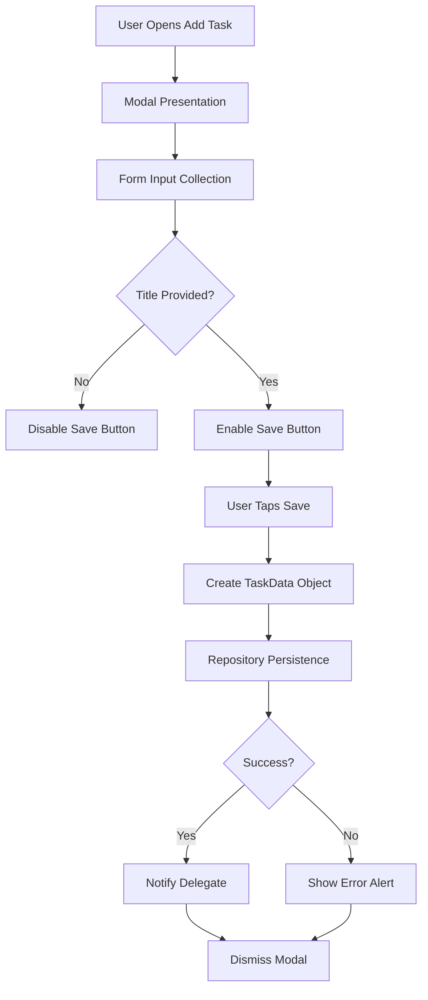
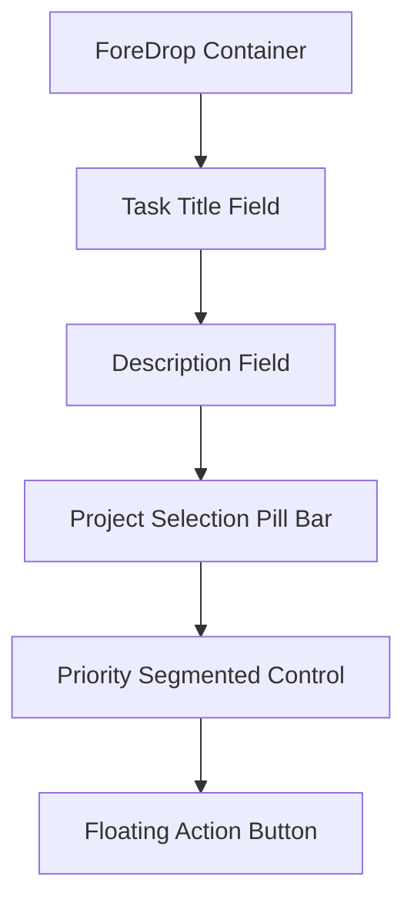
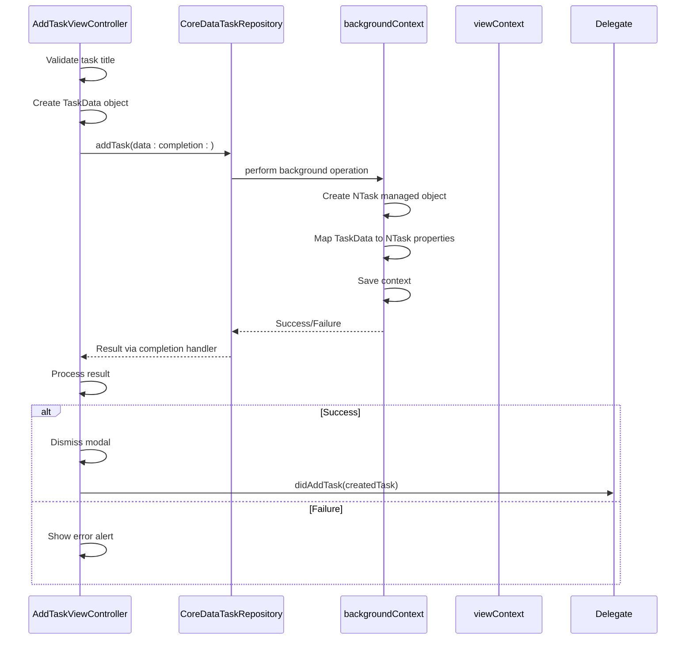
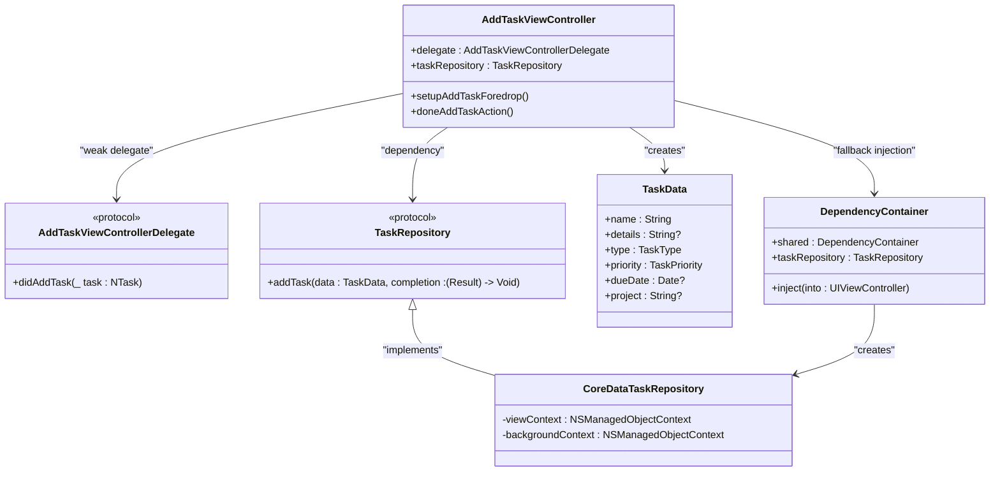

# AddTaskViewController

<cite>
**Referenced Files in This Document**   
- [AddTaskViewController.swift](file://To%20Do%20List/ViewControllers/AddTaskViewController.swift)
- [AddTaskViewController+Foredrop.swift](file://To%20Do%20List/ViewControllers/AddTaskViewController+Foredrop.swift)
- [AddTaskViewControllerDelegate.swift](file://To%20Do%20List/ViewControllers/AddTaskViewControllerDelegate.swift)
- [TaskRepository.swift](file://To%20Do%20List/Repositories/TaskRepository.swift)
- [CoreDataTaskRepository.swift](file://To%20Do%20List/Repositories/CoreDataTaskRepository.swift)
- [TaskData.swift](file://README.md#L524-L571)
- [DependencyContainer.swift](file://To%20Do%20List/Managers/DependencyContainer.swift)
</cite>

## Table of Contents
1. [Introduction](#introduction)
2. [Core Functionality Overview](#core-functionality-overview)
3. [Modal Presentation and Navigation Integration](#modal-presentation-and-navigation-integration)
4. [Form-Based UI Layout](#form-based-ui-layout)
5. [Data Binding and Model Integration](#data-binding-and-model-integration)
6. [Persistence with CoreDataTaskRepository](#persistence-with-coreddatatrepository)
7. [Due Date Scheduling with FSCalendar](#due-date-scheduling-with-fscalendar)
8. [Project Selection Mechanism](#project-selection-mechanism)
9. [Validation Logic and User Feedback](#validation-logic-and-user-feedback)
10. [Delegation Pattern Implementation](#delegation-pattern-implementation)
11. [New Task Creation vs. Existing Task Editing](#new-task-creation-vs-existing-task-editing)
12. [Common Implementation Challenges](#common-implementation-challenges)
13. [Architecture and Dependencies](#architecture-and-dependencies)

## Introduction

The AddTaskViewController is a critical component of the Tasker application, serving as the primary interface for creating and editing tasks. This document provides a comprehensive analysis of its implementation, architecture, and integration points within the application ecosystem. The view controller follows modern iOS development patterns including dependency injection, protocol-oriented programming, and layered architecture. It features a sophisticated UI design with backdrop and foredrop containers, Material Design components, and seamless integration with Core Data for persistent storage.

**Section sources**
- [AddTaskViewController.swift](file://To%20Do%20List/ViewControllers/AddTaskViewController.swift#L1-L518)

## Core Functionality Overview

The AddTaskViewController enables users to create new tasks or edit existing ones through a form-based interface. Its core responsibilities include:
- **Task Creation**: Collecting task metadata including title, description, due date, priority, and project assignment
- **UI Presentation**: Displaying a modal interface with layered backdrop and foredrop design elements
- **Data Validation**: Ensuring required fields are populated before task creation
- **Persistence**: Saving task data through the TaskRepository protocol to Core Data
- **User Feedback**: Providing visual and programmatic feedback for successful operations or errors

The controller manages its state through various properties that track user input:
- **currentTaskInMaterialTextBox**: Stores the task title as the user types
- **currentTaskDescription**: Captures the optional task description
- **isThisEveningTask**: Boolean flag for evening task classification
- **currenttProjectForAddTaskView**: Tracks the selected project (defaults to "Inbox")
- **currentPriorityForAddTaskView**: Maintains the selected priority level

These state variables are updated in real-time through UITextFieldDelegate methods and UI controls, ensuring the interface remains synchronized with user input.



**Diagram sources**
- [AddTaskViewController.swift](file://To%20Do%20List/ViewControllers/AddTaskViewController.swift#L1-L518)
- [AddTaskViewController+Foredrop.swift](file://To%20Do%20List/ViewControllers/AddTaskViewController+Foredrop.swift#L1-L171)

**Section sources**
- [AddTaskViewController.swift](file://To%20Do%20List/ViewControllers/AddTaskViewController.swift#L1-L518)

## Modal Presentation and Navigation Integration

The AddTaskViewController is presented modally from the main application interface, typically triggered by a floating action button in the bottom app bar. This modal presentation pattern provides a focused user experience for task creation while maintaining context of the underlying content.

The controller integrates with the application's navigation system through several key components:
- **Backdrop Container**: A background view that extends beneath the main content, displaying contextual information like the current date
- **Navigation Bar Elements**: Custom navigation elements including a Cancel button and date display
- **Bottom App Bar**: The originating navigation element that triggers the modal presentation

The modal presentation is managed through standard iOS presentation patterns:
```swift
@objc func cancelAddTaskAction() {
    dismiss(animated: true)
}
```

When the user taps the Cancel button, the view controller dismisses itself, returning control to the presenting view. The presentation style uses a custom backdrop design that matches the application's visual language, creating a seamless transition between the main interface and the task creation form.

The navigation integration is further enhanced by the controller's ability to:
- Display contextual date information in the navigation area
- Maintain visual consistency with the Material Design language used throughout the application
- Provide smooth animations for presentation and dismissal

**Section sources**
- [AddTaskViewController.swift](file://To%20Do%20List/ViewControllers/AddTaskViewController.swift#L1-L518)
- [AddTaskViewController+Foredrop.swift](file://To%20Do%20List/ViewControllers/AddTaskViewController+Foredrop.swift#L1-L171)

## Form-Based UI Layout

The AddTaskViewController implements a comprehensive form-based user interface using Material Design components from the MaterialComponents library. The layout is structured as a vertical stack of UI elements contained within a foredrop container that appears above the backdrop.

### UI Components

The form consists of the following primary components:

**Task Title Field**
- **Component**: MDCFilledTextField
- **Purpose**: Primary input for task title
- **Configuration**: 
  - Auto-correction enabled
  - Smart dashes, quotes, and insert/delete features active
  - Becomes first responder on view appearance

**Description Field**
- **Component**: MDCFilledTextField
- **Purpose**: Optional detailed task description
- **Configuration**:
  - Placeholder text: "Enter task description..."
  - Leading assistive label: "Add task details"
  - Clear button mode: while editing

**Project Selection**
- **Component**: SamplePillBar (custom implementation)
- **Purpose**: Project assignment with "Add Project" functionality
- **Behavior**: Dynamic selection from existing projects

**Priority Selection**
- **Component**: SegmentedControl
- **Options**: None, Low, High, Max (representing priority levels)
- **Visual Feedback**: Immediate preview of selected priority

**Evening Task Toggle**
- **Component**: UISwitch with custom container
- **Purpose**: Classify task as evening task
- **Label**: "Evening" displayed alongside switch

**Action Buttons**
- **Cancel**: UIButton in navigation area
- **Done**: MDCFloatingButton (FAB) at bottom of form

### Layout Structure

The UI layout follows a vertical stack arrangement using UIStackView:



The layout is responsive and adapts to different screen sizes through:
- Dynamic positioning based on calendar widget location
- Safe area insets consideration
- Flexible height calculations for the foredrop container
- Auto Layout constraints for internal components

The controller uses a combination of frame-based layout for the containers and Auto Layout for the arranged subviews within the stack view, ensuring proper positioning across device orientations.

**Section sources**
- [AddTaskViewController.swift](file://To%20Do%20List/ViewControllers/AddTaskViewController.swift#L1-L518)
- [AddTaskViewController+Foredrop.swift](file://To%20Do%20List/ViewControllers/AddTaskViewController+Foredrop.swift#L1-L171)

## Data Binding and Model Integration

The AddTaskViewController binds user interface elements to the TaskData model through a combination of direct property mapping and real-time state synchronization. This binding ensures that user input is accurately captured and transformed into a structured data object for persistence.

### TaskData Model Structure

The TaskData struct serves as the presentation layer model with the following properties:

```swift
struct TaskData {
    let id: UUID
    let name: String
    let details: String?
    let type: TaskType
    let priority: TaskPriority
    let dueDate: Date?
    let project: String?
    let isComplete: Bool
    let dateAdded: Date?
    let dateCompleted: Date?
}
```

### Binding Mechanism

The controller maintains internal state variables that mirror the TaskData properties:

| UI Element | State Variable | TaskData Property |
|-----------|---------------|------------------|
| Task Title Field | currentTaskInMaterialTextBox | name |
| Description Field | currentTaskDescription | details |
| Evening Switch | isThisEveningTask | type |
| Priority Control | currentTaskPriority | priority |
| Project Selector | currenttProjectForAddTaskView | project |
| Calendar Widget | dateForAddTaskView | dueDate |

State synchronization occurs through the UITextFieldDelegate protocol:

```swift
func textField(_ textField: UITextField, shouldChangeCharactersIn range: NSRange, replacementString string: String) -> Bool {
    if let oldText = textField.text, let stringRange = Range(range, in: oldText) {
        let newText = oldText.replacingCharacters(in: stringRange, with: string)
        
        if textField == addTaskTextBox_Material {
            currentTaskInMaterialTextBox = newText
        } else if textField == descriptionTextBox_Material {
            currentTaskDescription = newText
        }
        
        // Update UI state based on input
        let isEmpty = currentTaskInMaterialTextBox.isEmpty
        self.fab_doneTask.isHidden = isEmpty
        self.tabsSegmentedControl.isHidden = isEmpty
        self.fab_doneTask.isEnabled = !isEmpty
    }
    return true
}
```

This real-time binding approach provides immediate visual feedback to users, such as enabling/disabling the save button based on whether a task title has been entered.

The controller also handles the conversion between UI state and the final TaskData object during the save process:

```swift
let taskType: TaskType = isThisEveningTask ? .evening : .morning
let taskData = TaskData(
    name: currentTaskInMaterialTextBox,
    details: currentTaskDescription.isEmpty ? nil : currentTaskDescription,
    type: taskType,
    priority: currentTaskPriority,
    dueDate: dateForAddTaskView,
    project: currenttProjectForAddTaskView
)
```

This conversion ensures that all user input is properly transformed into a validated TaskData instance before being passed to the persistence layer.

**Section sources**
- [AddTaskViewController.swift](file://To%20Do%20List/ViewControllers/AddTaskViewController.swift#L1-L518)
- [TaskData.swift](file://README.md#L524-L571)

## Persistence with CoreDataTaskRepository

The AddTaskViewController integrates with the Core Data persistence system through the TaskRepository protocol and its CoreDataTaskRepository implementation. This dependency injection pattern enables testability and separation of concerns between the UI layer and data persistence.

### Dependency Injection

The controller receives its taskRepository dependency through property injection:

```swift
var taskRepository: TaskRepository!
```

The DependencyContainer manages this injection process:

```swift
func inject(into viewController: UIViewController) {
    if let dependentVC = viewController as? TaskRepositoryDependent {
        dependentVC.taskRepository = taskRepository
    }
}
```

This approach allows for runtime dependency resolution and supports testing with mock repositories.

### Persistence Workflow

When the user completes task creation, the controller follows this persistence workflow:

1. **Validation**: Ensure the task title is not empty
2. **Model Creation**: Construct a TaskData object from UI state
3. **Repository Call**: Invoke addTask method on the injected repository
4. **Result Handling**: Process success or failure through completion handler



**Diagram sources**
- [AddTaskViewController+Foredrop.swift](file://To%20Do%20List/ViewControllers/AddTaskViewController+Foredrop.swift#L1-L171)
- [CoreDataTaskRepository.swift](file://To%20Do%20List/Repositories/CoreDataTaskRepository.swift#L1-L455)

The CoreDataTaskRepository implementation uses a background context for write operations to prevent blocking the main thread:

```swift
backgroundContext.perform {
    let managed = NTask(context: self.backgroundContext)
    // Set properties from TaskData
    try self.backgroundContext.save()
    // Retrieve object in main context for delegate
    guard let mainContextTask = self.viewContext.object(with: managed.objectID) as? NTask else {
        // Handle error
    }
    DispatchQueue.main.async { completion?(.success(mainContextTask)) }
}
```

This background processing ensures smooth UI performance during data operations. The repository also configures context merging policies to automatically propagate changes from background to main contexts.

Error handling is comprehensive, with specific error cases identified and appropriate user feedback provided through UIAlertControllers when persistence fails.

**Section sources**
- [AddTaskViewController+Foredrop.swift](file://To%20Do%20List/ViewControllers/AddTaskViewController+Foredrop.swift#L1-L171)
- [CoreDataTaskRepository.swift](file://To%20Do%20List/Repositories/CoreDataTaskRepository.swift#L1-L455)
- [TaskRepository.swift](file://To%20Do%20List/Repositories/TaskRepository.swift#L1-L118)

## Due Date Scheduling with FSCalendar

The AddTaskViewController integrates FSCalendar for visual due date selection, providing users with an intuitive calendar interface for scheduling tasks. The calendar widget is displayed in the backdrop container, allowing users to select dates without leaving the task creation flow.

### Calendar Implementation

The calendar is implemented as a property of the view controller:

```swift
var calendar: FSCalendar!
```

It is configured and added to the view hierarchy through the setupCalendarWidget method:

```swift
func setupCalendarWidget() {
    setupCalAtAddTask()
    backdropContainer.addSubview(calendar)
}
```

The calendar appears in the backdrop area beneath the main form, creating a layered UI effect where users can see both the date selection interface and the task creation form simultaneously.

### Date Selection Workflow

The calendar integration follows this workflow:

1. **Initial State**: Calendar displays the current date by default
2. **User Interaction**: Users tap dates in the calendar to select due dates
3. **State Update**: The selected date updates the dateForAddTaskView property
4. **Visual Feedback**: The selected date is highlighted in the calendar UI

The controller maintains the selected date in the dateForAddTaskView property, which is then used when creating the TaskData object:

```swift
let taskData = TaskData(
    name: currentTaskInMaterialTextBox,
    details: currentTaskDescription.isEmpty ? nil : currentTaskDescription,
    type: taskType,
    priority: currentTaskPriority,
    dueDate: dateForAddTaskView, // Uses calendar-selected date
    project: currenttProjectForAddTaskView
)
```

### Integration Benefits

The FSCalendar integration provides several user experience benefits:

- **Visual Context**: Users can see the calendar context while creating tasks
- **Efficient Selection**: Quick date selection without additional navigation
- **Consistent Design**: Matches the application's overall visual language
- **Touch-Friendly**: Large tap targets for easy date selection

The calendar is positioned in the backdrop container, which extends beneath the main content area, creating a depth effect that emphasizes the primary task creation form in the foredrop container.

This implementation aligns with the application's design philosophy of providing contextual information without requiring navigation away from the current task, enhancing user productivity and focus.

**Section sources**
- [AddTaskViewController.swift](file://To%20Do%20List/ViewControllers/AddTaskViewController.swift#L1-L518)
- [AddTaskViewController+Foredrop.swift](file://To%20Do%20List/ViewControllers/AddTaskViewController+Foredrop.swift#L1-L171)

## Project Selection Mechanism

The AddTaskViewController implements project selection through a custom pill bar interface, allowing users to assign tasks to existing projects or create new ones. This mechanism provides a streamlined way to organize tasks within the application's project-based categorization system.

### Implementation Details

The project selection is handled through a samplePillBar component:

```swift
var samplePillBar: UIView?
var samplePillBarItems: [PillButtonBarItem] = []
```

The pill bar is configured through dedicated setup methods:

```swift
func setupSamplePillBar() {
    buildSamplePillBarData()
    let pillBar = createSamplePillBar(items: samplePillBarItems, centerAligned: false)
    // Configure pill bar appearance and behavior
}
```

### Default Project Assignment

The controller automatically assigns a default project when initialized:

```swift
override func viewWillAppear(_ animated: Bool) {
    super.viewWillAppear(animated)
    // Set default project to Inbox
    currenttProjectForAddTaskView = "Inbox"
}
```

This ensures that every task has a project assignment, with "Inbox" serving as the default catch-all category for tasks that haven't been explicitly assigned to a specific project.

### Selection Workflow

The project selection workflow follows these steps:

1. **Initialization**: Load available projects into the pill bar
2. **User Selection**: Allow users to tap project pills to select
3. **State Update**: Update currenttProjectForAddTaskView with selection
4. **New Project**: Provide "Add Project" option for creating new categories

The pill bar interface provides visual feedback for the selected project, making it clear which project will be assigned to the new task. This immediate feedback helps prevent user errors in project assignment.

The implementation leverages the application's project management system, where projects are stored as separate entities in Core Data and referenced by name in the task records. This string-based relationship allows for flexible project assignment without requiring complex Core Data relationships.

The project selection mechanism is integrated with the overall task creation flow, ensuring that project assignment is completed before the task is saved to persistent storage.

**Section sources**
- [AddTaskViewController.swift](file://To%20Do%20List/ViewControllers/AddTaskViewController.swift#L1-L518)

## Validation Logic and User Feedback

The AddTaskViewController implements comprehensive validation logic to ensure data integrity and provide immediate user feedback during task creation. The validation system operates at multiple levels, from real-time input validation to final submission checks.

### Real-Time Validation

The controller uses UITextFieldDelegate methods to provide immediate feedback as users type:

```swift
func textField(_ textField: UITextField, shouldChangeCharactersIn range: NSRange, replacementString string: String) -> Bool {
    // Update state variables with new text
    if textField == addTaskTextBox_Material {
        currentTaskInMaterialTextBox = newText
    } else if textField == descriptionTextBox_Material {
        currentTaskDescription = newText
    }
    
    // Update UI state based on input
    let isEmpty = currentTaskInMaterialTextBox.isEmpty
    self.fab_doneTask.isHidden = isEmpty
    self.tabsSegmentedControl.isHidden = isEmpty
    self.fab_doneTask.isEnabled = !isEmpty
}
```

This real-time validation provides immediate visual feedback by:
- Hiding the priority segmented control when no task title is entered
- Disabling the floating action button when the task title is empty
- Updating the interface as soon as text changes occur

### Final Submission Validation

Before attempting to save a task, the controller performs final validation:

```swift
@objc func doneAddTaskAction() {
    guard !currentTaskInMaterialTextBox.isEmpty else { 
        print("⚠️ AddTask: Task name is empty, returning early")
        return 
    }
    // Proceed with task creation
}
```

This guard statement prevents the creation of tasks without titles, which are required fields in the data model.

### Error Handling and User Feedback

When persistence operations fail, the controller provides clear user feedback through UIAlertControllers:

```swift
let alert = UIAlertController(
    title: "Error Creating Task",
    message: "Failed to create task: \(error.localizedDescription)",
    preferredStyle: .alert
)
alert.addAction(UIAlertAction(title: "OK", style: .default))
self?.present(alert, animated: true)
```

The error handling includes:
- **Comprehensive Error Logging**: Detailed console output for debugging
- **User-Friendly Messages**: Translated error descriptions for end users
- **Fallback Mechanisms**: Attempts to recover from dependency injection failures
- **Graceful Degradation**: Prevents crashes when repositories are unavailable

### Dependency Validation

The controller also validates its dependencies before use:

```swift
if taskRepository == nil {
    print("❌ AddTask: CRITICAL ERROR - taskRepository is nil!")
    // Attempt fallback injection
    if let fallbackRepository = DependencyContainer.shared.taskRepository {
        taskRepository = fallbackRepository
    } else {
        // Show error to user
        return
    }
}
```

This defensive programming approach ensures the controller can handle edge cases where dependency injection might fail, providing a more robust user experience.

The validation system is designed to be unobtrusive during normal use but provides clear guidance when issues occur, balancing usability with data integrity requirements.

**Section sources**
- [AddTaskViewController.swift](file://To%20Do%20List/ViewControllers/AddTaskViewController.swift#L1-L518)
- [AddTaskViewController+Foredrop.swift](file://To%20Do%20List/ViewControllers/AddTaskViewController+Foredrop.swift#L1-L171)

## Delegation Pattern Implementation

The AddTaskViewController uses the delegation pattern to communicate task creation events back to its presenting view controller. This design follows iOS best practices for modal view controller communication and enables loose coupling between components.

### Delegate Protocol

The communication is defined through the AddTaskViewControllerDelegate protocol:

```swift
protocol AddTaskViewControllerDelegate: AnyObject {
    func didAddTask(_ task: NTask)
}
```

This protocol defines a single method that is called when a new task has been successfully created and saved.

### Delegate Implementation

The controller maintains a weak reference to its delegate:

```swift
weak var delegate: AddTaskViewControllerDelegate?
```

Using a weak reference prevents retain cycles that could lead to memory leaks.

### Event Notification Workflow

When a task is successfully created, the controller follows this notification workflow:

```swift
self?.dismiss(animated: true) {
    if let delegate = self?.delegate {
        delegate.didAddTask(createdTask)
    }
}
```

This sequence ensures that:
1. The modal interface is dismissed first
2. The delegate notification occurs after dismissal
3. The presenting view controller can safely update its UI

### Integration Example

A typical integration would look like:

```swift
// In presenting view controller
func showAddTask() {
    let addTaskVC = AddTaskViewController()
    addTaskVC.delegate = self
    present(addTaskVC, animated: true)
}

// Implement delegate method
func didAddTask(_ task: NTask) {
    // Refresh task list
    // Update UI
    // Handle new task
}
```

The delegation pattern provides several advantages:
- **Loose Coupling**: The AddTaskViewController doesn't need to know the specific type of its presenter
- **Single Responsibility**: Each view controller focuses on its primary function
- **Reusability**: The same AddTaskViewController can be presented from multiple contexts
- **Memory Safety**: Weak references prevent retain cycles

This implementation aligns with Apple's recommended practices for modal view controller communication and supports the application's overall architecture of separable, testable components.

**Section sources**
- [AddTaskViewController.swift](file://To%20Do%20List/ViewControllers/AddTaskViewController.swift#L1-L518)
- [AddTaskViewControllerDelegate.swift](file://To%20Do%20List/ViewControllers/AddTaskViewControllerDelegate.swift#L1-L14)

## New Task Creation vs. Existing Task Editing

While the current implementation of AddTaskViewController focuses primarily on new task creation, the architecture supports potential extension to task editing through its dependency injection and delegation patterns.

### New Task Creation Flow

The primary use case is creating new tasks:

1. **Initialization**: Controller instantiated with default state
2. **Default Values**: Project set to "Inbox", priority to medium
3. **User Input**: Form fields populated with new task data
4. **Persistence**: New NTask object created in Core Data
5. **Notification**: Delegate informed of new task creation

The creation process uses the TaskData initializer for new tasks:

```swift
init(name: String, details: String?, type: TaskType, priority: TaskPriority, 
     dueDate: Date?, project: String?) {
    self.id = UUID()
    self.name = name
    // ... other properties
    self.isComplete = false
    self.dateAdded = Date()
}
```

### Potential Editing Capabilities

The current implementation does not appear to support editing existing tasks, but the architecture could be extended to support this functionality:

**Required Modifications:**
- Add taskID parameter to support loading existing tasks
- Implement viewDidLoad logic to populate form with existing task data
- Change persistence method from addTask to updateTask
- Modify delegate method to indicate editing rather than creation

**Current Limitations:**
- No mechanism to pass an existing task to the controller
- State variables are designed for new task creation
- Interface elements assume empty initial state
- No visual indication that editing is occurring

### Architectural Considerations

The separation between creation and editing follows a common iOS pattern where distinct view controllers handle these operations, even though they share similar interfaces. This approach provides benefits:

- **Simpler Logic**: Each controller has a single, focused responsibility
- **Better Performance**: No need to check whether editing or creating
- **Clearer User Experience**: Distinct interfaces can provide appropriate context

However, this also means that editing functionality would likely be handled by a separate view controller, such as a TaskDetailViewController, which is mentioned in the documentation but not analyzed here.

The current AddTaskViewController is optimized for the high-frequency task of creating new tasks, with features like automatic focus on the title field and smart defaults that streamline the creation process.

**Section sources**
- [AddTaskViewController.swift](file://To%20Do%20List/ViewControllers/AddTaskViewController.swift#L1-L518)
- [AddTaskViewController+Foredrop.swift](file://To%20Do%20List/ViewControllers/AddTaskViewController+Foredrop.swift#L1-L171)

## Common Implementation Challenges

The AddTaskViewController addresses several common iOS development challenges related to keyboard management, auto layout, and data consistency. These solutions ensure a smooth user experience across different device orientations and usage scenarios.

### Keyboard Management

The controller handles keyboard presentation through several mechanisms:

- **Automatic Focus**: The task title field becomes first responder on view appearance
- **Return Key Handling**: The textFieldShouldReturn delegate method processes the return key
- **Keyboard Dismissal**: The keyboard is dismissed when the user taps return or cancels

```swift
func textFieldShouldReturn(_ textField: UITextField) -> Bool {
    textField.resignFirstResponder()
    self.doneAddTaskAction()
    return true
}
```

This implementation allows users to quickly create tasks by typing the title and pressing return, supporting efficient keyboard-based workflows.

### Auto Layout and Rotation

The controller manages layout during device rotation through a combination of approaches:

- **Dynamic Positioning**: The foredrop container position is calculated based on calendar position
- **Safe Area Insets**: Layout accounts for safe area boundaries on different devices
- **Flexible Heights**: The foredrop container height adjusts based on available space

```swift
let foredropHeight = screenHeight - foredropTopY - safeAreaBottomInset - 20
foredropContainer.frame = CGRect(x: 0, y: foredropTopY, width: screenWidth, height: foredropHeight)
```

The layout uses a hybrid approach with frame-based positioning for containers and Auto Layout for arranged subviews, providing both precise control and flexibility.

### Data Consistency

The controller ensures data consistency through several mechanisms:

- **Dependency Injection Validation**: Checks for nil repositories with fallback mechanisms
- **State Synchronization**: Real-time updates between UI and state variables
- **Transaction Safety**: Background context operations for data persistence
- **Error Recovery**: Comprehensive error handling with user feedback

The most sophisticated consistency mechanism is the dependency injection fallback:

```swift
if taskRepository == nil {
    // Attempt to get repository from DependencyContainer
    if let fallbackRepository = DependencyContainer.shared.taskRepository {
        taskRepository = fallbackRepository
    } else {
        // Show error to user instead of crashing
        return
    }
}
```

This defensive programming approach prevents crashes when dependencies are not properly injected, providing a more robust user experience.

### Memory Management

The controller follows best practices for memory management:

- **Weak Delegate**: Prevents retain cycles with the delegate pattern
- **Proper Cleanup**: No explicit cleanup methods needed due to ARC
- **Background Contexts**: Prevents main thread blocking during data operations

These solutions collectively address the most common challenges in iOS form-based interfaces, resulting in a responsive, reliable user experience that works well across different device configurations and usage patterns.

**Section sources**
- [AddTaskViewController.swift](file://To%20Do%20List/ViewControllers/AddTaskViewController.swift#L1-L518)
- [AddTaskViewController+Foredrop.swift](file://To%20Do%20List/ViewControllers/AddTaskViewController+Foredrop.swift#L1-L171)
- [DependencyContainer.swift](file://To%20Do%20List/Managers/DependencyContainer.swift#L1-L81)

## Architecture and Dependencies

The AddTaskViewController exists within a well-structured architectural framework that follows modern iOS development patterns. Its dependencies and relationships with other components demonstrate a thoughtful approach to application design.

### Component Relationships



**Diagram sources**
- [AddTaskViewController.swift](file://To%20Do%20List/ViewControllers/AddTaskViewController.swift#L1-L518)
- [AddTaskViewControllerDelegate.swift](file://To%20Do%20List/ViewControllers/AddTaskViewControllerDelegate.swift#L1-L14)
- [TaskRepository.swift](file://To%20Do%20List/Repositories/TaskRepository.swift#L1-L118)
- [CoreDataTaskRepository.swift](file://To%20Do%20List/Repositories/CoreDataTaskRepository.swift#L1-L455)
- [DependencyContainer.swift](file://To%20Do%20List/Managers/DependencyContainer.swift#L1-L81)

### Key Architectural Patterns

**Dependency Injection**: The controller receives its dependencies rather than creating them, enabling testability and flexibility.

**Protocol-Oriented Programming**: The TaskRepository protocol allows for multiple implementations and easy mocking for testing.

**Separation of Concerns**: The controller focuses on UI presentation while delegating data persistence to specialized components.

**Layered Architecture**: Clear separation between presentation (AddTaskViewController), domain (TaskData), and data (CoreDataTaskRepository) layers.

### Dependency Flow

The dependency flow follows this sequence:

1. **App Initialization**: DependencyContainer configured with persistent container
2. **View Controller Creation**: AddTaskViewController instantiated
3. **Dependency Injection**: DependencyContainer.inject() called on the view controller
4. **Fallback Mechanism**: If injection fails, container is accessed directly

This architecture supports the application's migration from singleton patterns to dependency injection, as noted in the README:

> "Refactored core data flow toward a Repository & Dependency-Injection pattern for better testability (March 2025)"

The AddTaskViewController represents a modern component in this evolving architecture, demonstrating best practices for iOS development while maintaining compatibility with legacy systems through its fallback mechanisms.

**Section sources**
- [AddTaskViewController.swift](file://To%20Do%20List/ViewControllers/AddTaskViewController.swift#L1-L518)
- [AddTaskViewControllerDelegate.swift](file://To%20Do%20List/ViewControllers/AddTaskViewControllerDelegate.swift#L1-L14)
- [TaskRepository.swift](file://To%20Do%20List/Repositories/TaskRepository.swift#L1-L118)
- [CoreDataTaskRepository.swift](file://To%20Do%20List/Repositories/CoreDataTaskRepository.swift#L1-L455)
- [DependencyContainer.swift](file://To%20Do%20List/Managers/DependencyContainer.swift#L1-L81)