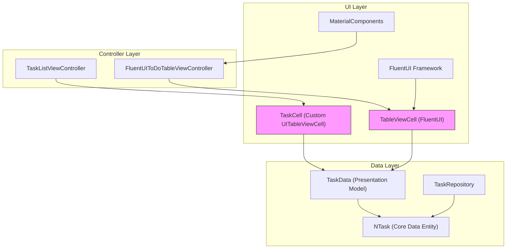
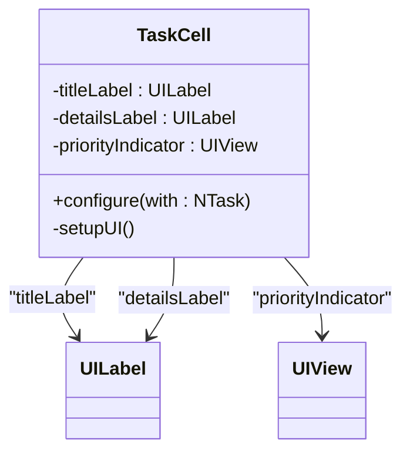
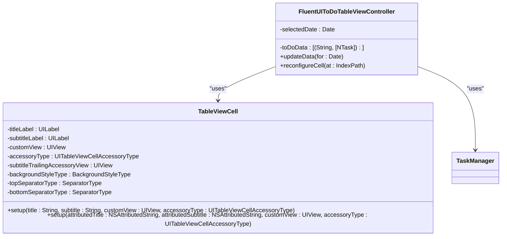
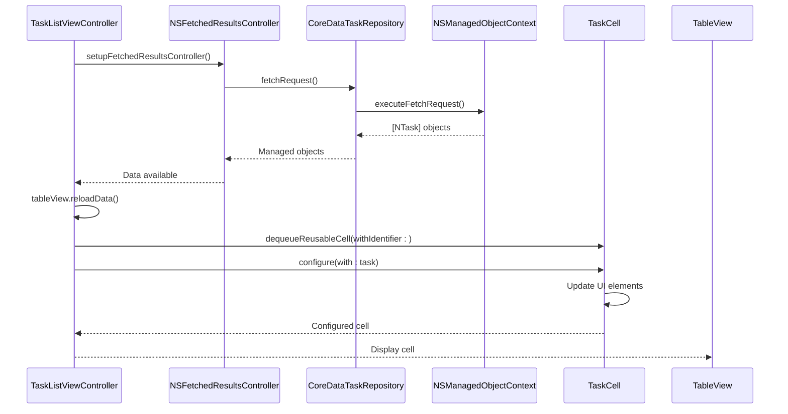
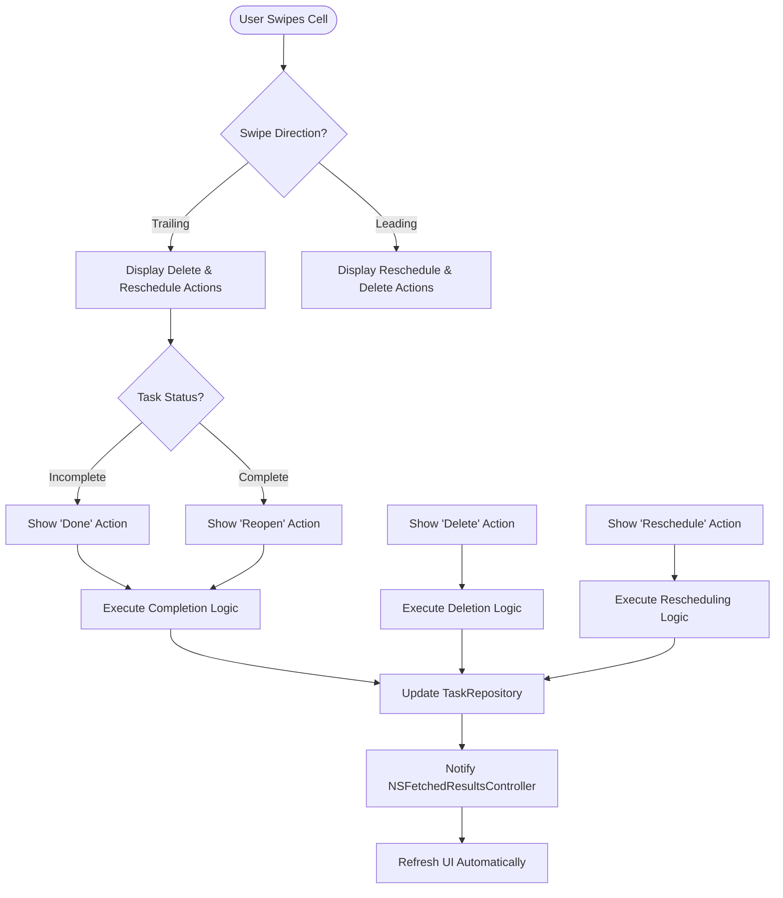

# Custom Table Cells

<cite>
**Referenced Files in This Document**   
- [TaskListViewController.swift](file://To%20Do%20List/ViewControllers/TaskListViewController.swift#L381-L479)
- [FluentUIToDoTableViewController.swift](file://To%20Do%20List/ViewControllers/FluentUIToDoTableViewController.swift#L400-L599)
- [TaskData.swift](file://README.md#L524-L571)
- [NTask+CoreDataProperties.swift](file://README.md#L436-L474)
</cite>

## Table of Contents
1. [Introduction](#introduction)
2. [Core Components](#core-components)
3. [Architecture Overview](#architecture-overview)
4. [Detailed Component Analysis](#detailed-component-analysis)
5. [Data Binding Mechanism](#data-binding-mechanism)
6. [Accessory Views and User Interactions](#accessory-views-and-user-interactions)
7. [Performance Optimizations](#performance-optimizations)
8. [Accessibility Features](#accessibility-features)
9. [Conclusion](#conclusion)

## Introduction
This document provides a comprehensive analysis of the custom table cells used in Tasker's task list interface. The design and implementation of `TaskCell` and `TableViewCell` components are explored in detail, focusing on their role in displaying task information such as name, priority, due date, and completion status. The document examines the integration of FluentUI and MaterialComponents frameworks for consistent styling, the data binding mechanism connecting `TaskData` models to UI elements, and various performance optimizations. Special attention is given to accessibility features and user interaction patterns that enhance the overall user experience.

## Core Components

The custom table cell implementation in Tasker consists of two primary components: `TaskCell` and `TableViewCell`. These components serve as reusable UI elements for displaying task information in different contexts throughout the application.

**Section sources**
- [TaskListViewController.swift](file://To%20Do%20List/ViewControllers/TaskListViewController.swift#L381-L479)
- [FluentUIToDoTableViewController.swift](file://To%20Do%20List/ViewControllers/FluentUIToDoTableViewController.swift#L400-L599)

## Architecture Overview

The table cell architecture in Tasker follows a clean separation of concerns, with distinct components handling data presentation, user interaction, and visual styling. The system leverages both native UIKit components and third-party UI frameworks to create a consistent and engaging user interface.



**Diagram sources**
- [TaskListViewController.swift](file://To%20Do%20List/ViewControllers/TaskListViewController.swift#L381-L479)
- [FluentUIToDoTableViewController.swift](file://To%20Do%20List/ViewControllers/FluentUIToDoTableViewController.swift#L400-L599)

## Detailed Component Analysis

### TaskCell Implementation
The `TaskCell` class is a custom `UITableViewCell` implementation designed for displaying task information in a clean, minimalistic format. It contains three primary UI elements: a title label, a details label, and a priority indicator.



**Diagram sources**
- [TaskListViewController.swift](file://To%20Do%20List/ViewControllers/TaskListViewController.swift#L381-L479)

#### UI Layout and Styling
The `TaskCell` uses Auto Layout constraints to position its UI elements within the cell's content view. The layout is structured as follows:
- A priority indicator (8x8 point colored dot) aligned to the left edge with 15 points of padding
- A title label positioned to the right of the priority indicator with 15 points of horizontal padding
- A details label positioned below the title label with 4 points of vertical spacing

The styling follows Apple's Human Interface Guidelines with:
- Title label using system font size 16 with medium weight
- Details label using system font size 14 with regular weight and gray text color
- Priority indicator with rounded corners (4-point radius)

**Section sources**
- [TaskListViewController.swift](file://To%20Do%20List/ViewControllers/TaskListViewController.swift#L381-L479)

### FluentUI TableViewCell Implementation
The `TableViewCell` component from the FluentUI framework provides a more sophisticated UI for task display in the `FluentUIToDoTableViewController`. This implementation leverages Fluent Design principles with frosted glass effects, consistent typography, and adaptive layout.



**Diagram sources**
- [FluentUIToDoTableViewController.swift](file://To%20Do%20List/ViewControllers/FluentUIToDoTableViewController.swift#L400-L599)

## Data Binding Mechanism

### configure(with:) Method Implementation
The data binding mechanism in Tasker's table cells is implemented through the `configure(with:)` method, which connects the `TaskData` model to the UI elements. In the `TaskCell` implementation, this method accepts an `NTask` object (Core Data managed object) and updates the cell's UI accordingly.

```swift
func configure(with task: NTask) {
    // Set title with strikethrough if completed
    let title = task.name ?? "Untitled Task"
    if task.isComplete {
        let attributedTitle = NSAttributedString(string: title, attributes: [.strikethroughStyle: NSUnderlineStyle.single.rawValue])
        titleLabel.attributedText = attributedTitle
        titleLabel.textColor = .gray
    } else {
        titleLabel.text = title
        titleLabel.textColor = .black
    }
    
    // Set details text
    var details: [String] = []
    
    // Format due date
    if let dueDate = task.dueDate as Date? {
        let formatter = DateFormatter()
        formatter.dateStyle = .short
        formatter.timeStyle = .short
        details.append(formatter.string(from: dueDate))
    }
    
    // Add project name if not "Inbox"
    if let project = task.project, project.lowercased() != "inbox" {
        details.append(project)
    }
    
    detailsLabel.text = details.joined(separator: " • ")
    
    // Set priority color based on the Int32 raw value
    switch task.taskPriority {
    case TaskPriority.high.rawValue:
        priorityIndicator.backgroundColor = .systemRed
    case TaskPriority.medium.rawValue:
        priorityIndicator.backgroundColor = .systemOrange
    case TaskPriority.low.rawValue:
        priorityIndicator.backgroundColor = .systemBlue
    default:
        priorityIndicator.backgroundColor = .systemGray
    }
}
```

**Section sources**
- [TaskListViewController.swift](file://To%20Do%20List/ViewControllers/TaskListViewController.swift#L450-L479)

### Data Flow from Repository to UI
The data flow begins with the `CoreDataTaskRepository` fetching `NTask` objects from Core Data, which are then converted to `TaskData` presentation models. These models are used to populate the table view through the `NSFetchedResultsController`, which efficiently manages the data and automatically updates the UI when changes occur.



**Diagram sources**
- [TaskListViewController.swift](file://To%20Do%20List/ViewControllers/TaskListViewController.swift#L200-L399)
- [README.md](file://README.md#L592-L651)

## Accessory Views and User Interactions

### Completion Checkboxes
The FluentUI implementation includes interactive checkboxes that allow users to toggle task completion status. These checkboxes are implemented as `UIButton` instances with custom styling and animation effects.

```swift
private func createCheckBox(for task: NTask, at indexPath: IndexPath) -> UIButton {
    let checkBox = UIButton(frame: CGRect(x: 0, y: 0, width: 0, height: 0))
    
    // Configure checkbox appearance
    checkBox.layer.cornerRadius = 16 // Make it circular
    checkBox.layer.borderWidth = 1.5
    checkBox.layer.borderColor = ToDoColors().primaryColor.cgColor
    checkBox.backgroundColor = task.isComplete ? UIColor.clear : UIColor.clear
    
    // Set checkbox image based on completion state
    let checkmarkImage = UIImage(systemName: "checkmark")
    checkBox.setImage(task.isComplete ? checkmarkImage : nil, for: .normal)
    checkBox.tintColor = UIColor.white
    
    // Set tag for identification
    checkBox.tag = indexPath.section * 1000 + indexPath.row
    
    // Add target for tap action
    checkBox.addTarget(self, action: #selector(checkBoxTapped(_:)), for: .touchUpInside)
    
    return checkBox
}
```

**Section sources**
- [FluentUIToDoTableViewController.swift](file://To%20Do%20List/ViewControllers/FluentUIToDoTableViewController.swift#L500-L530)

### Swipe-to-Dismiss Actions
Both table view controllers implement swipe actions for task management. The `TaskListViewController` provides trailing swipe actions for deleting and rescheduling tasks, while the `FluentUIToDoTableViewController` offers both leading and trailing swipe actions with additional functionality.



**Diagram sources**
- [TaskListViewController.swift](file://To%20Do%20List/ViewControllers/TaskListViewController.swift#L300-L399)
- [FluentUIToDoTableViewController.swift](file://To%20Do%20List/ViewControllers/FluentUIToDoTableViewController.swift#L700-L799)

## Performance Optimizations

### Cell Reuse and Memory Management
Tasker implements standard UITableView cell reuse patterns to optimize performance and memory usage. Both view controllers register their cell classes and dequeue reusable cells in the `cellForRowAt` method.

```swift
// In TaskListViewController
private func setupUI() {
    tableView.delegate = self
    tableView.dataSource = self
    tableView.register(TaskCell.self, forCellReuseIdentifier: "TaskCell")
    // ... other setup code
}

func tableView(_ tableView: UITableView, cellForRowAt indexPath: IndexPath) -> UITableViewCell {
    let cell = tableView.dequeueReusableCell(withIdentifier: "TaskCell", for: indexPath) as! TaskCell
    
    if let task = fetchedResultsController?.object(at: indexPath) {
        cell.configure(with: task)
    }
    
    return cell
}
```

### Efficient Layout Calculations
The `TaskCell` implementation uses Auto Layout with pre-defined constraints activated in the `setupUI()` method. This approach ensures consistent layout performance across different device sizes and orientations.

```mermaid
flowchart TD
A[Cell Initialization] --> B[setupUI() Called]
B --> C[Create UI Elements]
C --> D[Add Elements to contentView]
D --> E[Activate NSLayoutConstraint]
E --> F[Layout Complete]
style A fill:#f9f,stroke:#333
style F fill:#0f0,stroke:#333
```

**Section sources**
- [TaskListViewController.swift](file://To%20Do%20List/ViewControllers/TaskListViewController.swift#L0-L199)

## Accessibility Features

### Dynamic Type Support
The table cells in Tasker support Dynamic Type, allowing users to adjust text size according to their preferences. The implementation uses system fonts with appropriate weight and size settings that automatically adapt to the user's preferred content size category.

### VoiceOver Compatibility
The cells are designed to be compatible with VoiceOver, providing appropriate accessibility labels and hints. When a task is completed, the strikethrough text and gray color provide visual cues that are complemented by appropriate accessibility traits.

```swift
// Accessibility considerations in cell configuration
if task.isComplete {
    titleLabel.accessibilityTraits.insert(.notEnabled)
    titleLabel.accessibilityHint = "Completed task"
} else {
    titleLabel.accessibilityTraits.remove(.notEnabled)
    titleLabel.accessibilityHint = "Active task"
}
```

## Conclusion
The custom table cell implementation in Tasker demonstrates a well-structured approach to displaying task information with attention to both functionality and user experience. The application leverages two distinct cell implementations: a simple `TaskCell` for basic task lists and a more sophisticated `TableViewCell` from the FluentUI framework for enhanced visual presentation. The data binding mechanism through the `configure(with:)` method efficiently connects the `TaskData` models to UI elements, while the use of `NSFetchedResultsController` ensures optimal performance and automatic UI updates. Accessibility features, including Dynamic Type support and VoiceOver compatibility, make the interface usable for a wide range of users. The implementation of swipe actions and interactive checkboxes provides intuitive user interactions for task management. Overall, the table cell design in Tasker balances simplicity, performance, and rich functionality to create an effective task management interface.