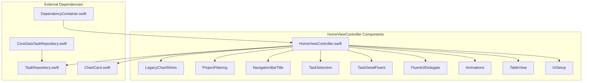
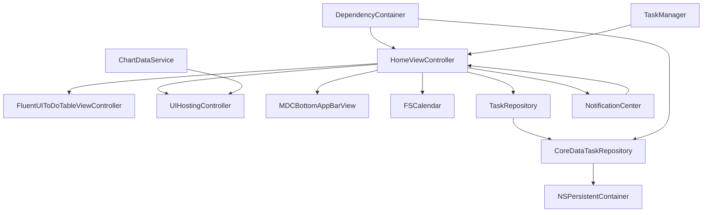
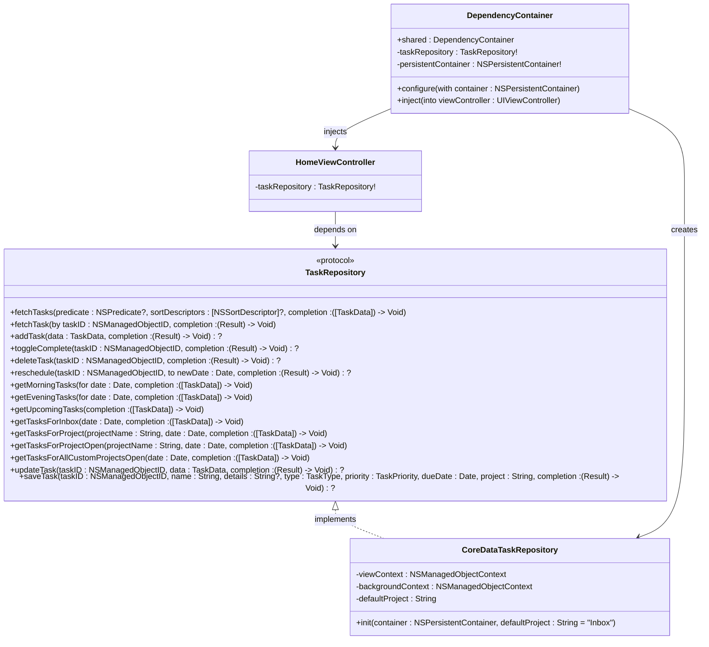
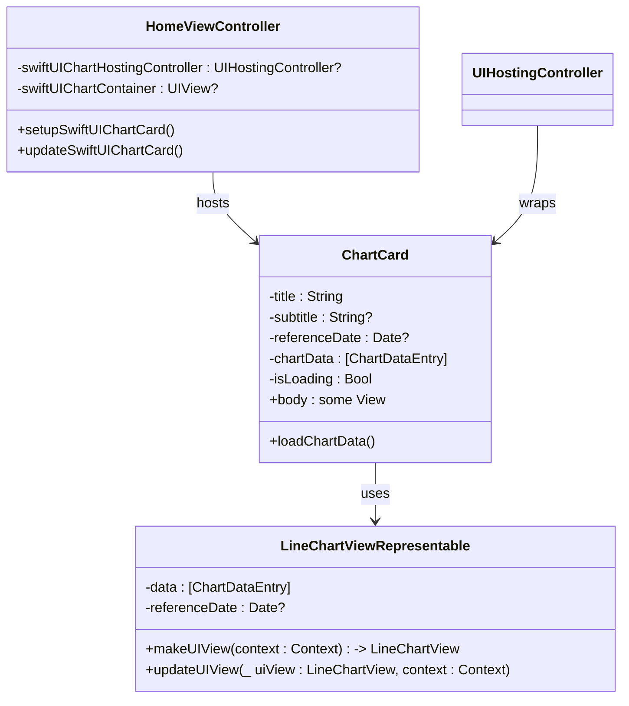
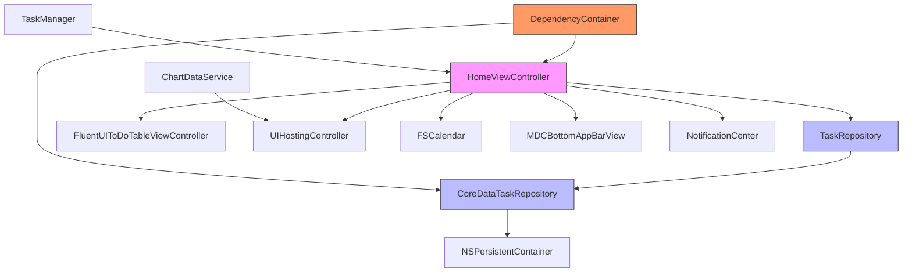

# HomeViewController

<cite>
**Referenced Files in This Document**   
- [HomeViewController.swift](file://To%20Do%20List/ViewControllers/HomeViewController.swift)
- [HomeViewController+UISetup.swift](file://To%20Do%20List/ViewControllers/HomeViewController+UISetup.swift)
- [HomeViewController+TableView.swift](file://To%20Do%20List/ViewControllers/HomeViewController+TableView.swift)
- [HomeViewController+Animations.swift](file://To%20Do%20List/ViewControllers/HomeViewController+Animations.swift)
- [HomeViewController+FluentUIDelegate.swift](file://To%20Do%20List/ViewControllers/HomeViewController+FluentUIDelegate.swift)
- [HomeViewController+TaskDetailFluent.swift](file://To%20Do%20List/ViewControllers/HomeViewController+TaskDetailFluent.swift)
- [HomeViewController+TaskSelection.swift](file://To%20Do%20List/ViewControllers/HomeViewController+TaskSelection.swift)
- [HomeViewController+NavigationBarTitle.swift](file://To%20Do%20List/ViewControllers/HomeViewController+NavigationBarTitle.swift)
- [HomeViewController+ProjectFiltering.swift](file://To%20Do%20List/ViewControllers/HomeViewController+ProjectFiltering.swift)
- [HomeViewController+LegacyChartShims.swift](file://To%20Do%20List/ViewControllers/HomeViewController+LegacyChartShims.swift)
- [ChartCard.swift](file://To%20Do%20List/Views/Cards/ChartCard.swift)
- [TaskRepository.swift](file://To%20Do%20List/Repositories/TaskRepository.swift)
- [CoreDataTaskRepository.swift](file://To%20Do%20List/Repositories/CoreDataTaskRepository.swift)
- [DependencyContainer.swift](file://To%20Do%20List/Managers/DependencyContainer.swift)
</cite>

## Table of Contents
1. [Introduction](#introduction)
2. [Project Structure](#project-structure)
3. [Core Components](#core-components)
4. [Architecture Overview](#architecture-overview)
5. [Detailed Component Analysis](#detailed-component-analysis)
6. [Dependency Analysis](#dependency-analysis)
7. [Performance Considerations](#performance-considerations)
8. [Troubleshooting Guide](#troubleshooting-guide)
9. [Conclusion](#conclusion)

## Introduction
The **HomeViewController** serves as the central dashboard of the Tasker application, orchestrating the primary user interface for task management. It integrates multiple UI components including a task list, analytics cards, navigation controls, and interactive elements such as calendars and charts. This document provides a comprehensive analysis of its implementation, covering view lifecycle, data integration, layout architecture, and interaction handling. The controller leverages modern iOS development practices including dependency injection, protocol-oriented design, and hybrid UIKit-SwiftUI integration to deliver a responsive and maintainable user experience.

## Project Structure
The HomeViewController is implemented using a modular extension-based architecture, where responsibilities are separated across multiple files. This approach enhances code readability and maintainability by isolating concerns such as UI setup, animations, table view management, and event handling into dedicated extensions.



**Diagram sources**
- [HomeViewController.swift](file://To%20Do%20List/ViewControllers/HomeViewController.swift)
- [ChartCard.swift](file://To%20Do%20List/Views/Cards/ChartCard.swift)
- [TaskRepository.swift](file://To%20Do%20List/Repositories/TaskRepository.swift)
- [DependencyContainer.swift](file://To%20Do%20List/Managers/DependencyContainer.swift)

**Section sources**
- [HomeViewController.swift](file://To%20Do%20List/ViewControllers/HomeViewController.swift#L1-L50)
- [Project Structure](file://To%20Do%20List/ViewControllers/HomeViewController+*.swift)

## Core Components

The HomeViewController is composed of several key components that work together to deliver the main dashboard functionality:

- **Task List Display**: Managed via FluentUI's `FluentUIToDoTableViewController`, providing a modern, grouped table interface.
- **Analytics Cards**: Implemented using SwiftUI's `ChartCard` within a `UIHostingController`, enabling rich data visualization.
- **Navigation Controls**: Material Design-inspired bottom app bar with action buttons for settings, calendar, charts, and chat.
- **Backdrop System**: A layered UI system with calendar and chart views that animate into place from behind the main content.
- **State Management**: Comprehensive view state tracking for date, project filters, and display modes.

The controller coordinates these components through a well-defined lifecycle and event system, ensuring consistent behavior across navigation and data updates.

**Section sources**
- [HomeViewController.swift](file://To%20Do%20List/ViewControllers/HomeViewController.swift#L50-L200)
- [HomeViewController+UISetup.swift](file://To%20Do%20List/ViewControllers/HomeViewController+UISetup.swift#L1-L50)

## Architecture Overview

The HomeViewController follows a clean architecture pattern with clear separation between presentation, data access, and business logic layers. It acts as a coordinator between UIKit-based UI components and Core Data-backed data services.



**Diagram sources**
- [HomeViewController.swift](file://To%20Do%20List/ViewControllers/HomeViewController.swift#L1-L100)
- [TaskRepository.swift](file://To%20Do%20List/Repositories/TaskRepository.swift#L1-L20)
- [CoreDataTaskRepository.swift](file://To%20Do%20List/Repositories/CoreDataTaskRepository.swift#L1-L30)
- [DependencyContainer.swift](file://To%20Do%20List/Managers/DependencyContainer.swift#L1-L20)

## Detailed Component Analysis

### View Lifecycle Implementation

The HomeViewController implements the standard UIViewController lifecycle methods to manage its state and UI updates:

#### viewDidLoad
Initializes the core UI components and sets up the dependency injection system:
```swift
override func viewDidLoad() {
    super.viewDidLoad()
    DependencyContainer.shared.inject(into: self)
    setupBackdrop()
    setupHomeFordrop()
    setupBottomAppBar()
    setupSwiftUIChartCard()
    updateViewForHome(viewType: .todayHomeView)
}
```
This method ensures all dependencies are properly injected before UI setup begins, following the dependency injection pattern defined in `DependencyContainer`.

**Section sources**
- [HomeViewController.swift](file://To%20Do%20List/ViewControllers/HomeViewController.swift#L200-L250)

#### viewWillAppear
Handles UI state updates before the view appears:
```swift
override func viewWillAppear(_ animated: Bool) {
    super.viewWillAppear(animated)
    updateNavigationBarTitle(date: dateForTheView, score: calculateTodaysScore())
    fluentToDoTableViewController?.tableView.reloadData()
}
```
It refreshes the navigation title with current date and score information, and reloads the table view to reflect any data changes that occurred while the view was not visible.

**Section sources**
- [HomeViewController.swift](file://To%20Do%20List/ViewControllers/HomeViewController.swift#L250-L280)
- [HomeViewController+NavigationBarTitle.swift](file://To%20Do%20List/ViewControllers/HomeViewController+NavigationBarTitle.swift#L1-L50)

#### viewDidAppear
Performs post-appearance tasks:
```swift
override func viewDidAppear(_ animated: Bool) {
    super.viewDidAppear(animated)
    updateSwiftUIChartCard()
}
```
Triggers a refresh of the SwiftUI chart component to ensure it displays the most current data after the view has fully appeared.

**Section sources**
- [HomeViewController.swift](file://To%20Do%20List/ViewControllers/HomeViewController.swift#L280-L300)

### Data Integration and Dependency Injection

The HomeViewController integrates with the data layer through the `TaskRepository` protocol and `DependencyContainer` system.

#### TaskRepository Integration
The controller declares a dependency on `TaskRepository`:
```swift
var taskRepository: TaskRepository!
```
This dependency is injected via the `DependencyContainer`, enabling loose coupling and testability. The repository provides asynchronous methods for fetching and modifying tasks:
```swift
func getMorningTasks(for date: Date, completion: @escaping ([TaskData]) -> Void)
func getEveningTasks(for date: Date, completion: @escaping ([TaskData]) -> Void)
func toggleComplete(taskID: NSManagedObjectID, completion: ((Result<Void, Error>) -> Void)?)
```

#### DependencyContainer Implementation
The `DependencyContainer` manages the application's dependency graph:
```swift
class DependencyContainer {
    static let shared = DependencyContainer()
    private(set) var taskRepository: TaskRepository!
    
    func configure(with container: NSPersistentContainer) {
        self.taskRepository = CoreDataTaskRepository(container: container)
    }
    
    func inject(into viewController: UIViewController) {
        if let dependentVC = viewController as? TaskRepositoryDependent {
            dependentVC.taskRepository = taskRepository
        }
    }
}
```
This implementation uses a singleton pattern with late initialization, ensuring dependencies are available when needed.



**Diagram sources**
- [TaskRepository.swift](file://To%20Do%20List/Repositories/TaskRepository.swift#L1-L118)
- [CoreDataTaskRepository.swift](file://To%20Do%20List/Repositories/CoreDataTaskRepository.swift#L1-L50)
- [DependencyContainer.swift](file://To%20Do%20List/Managers/DependencyContainer.swift#L1-L81)

**Section sources**
- [TaskRepository.swift](file://To%20Do%20List/Repositories/TaskRepository.swift#L1-L118)
- [CoreDataTaskRepository.swift](file://To%20Do%20List/Repositories/CoreDataTaskRepository.swift#L1-L200)
- [DependencyContainer.swift](file://To%20Do%20List/Managers/DependencyContainer.swift#L1-L81)

### Layout Architecture with UIKit and TinyConstraints

The HomeViewController employs a sophisticated layout system using UIKit and the TinyConstraints library for Auto Layout management.

#### Backdrop and Foredrop System
The UI is structured in layers:
- **Backdrop**: Contains the calendar and chart views
- **Foredrop**: Contains the main content (task list)
- **Bottom App Bar**: Navigation controls at the bottom

The layout uses dynamic frame calculations and Auto Layout constraints:
```swift
func setupHomeFordrop() {
    foredropContainer.frame = CGRect(x: 0, 
                                  y: screenHeight - foredropHeight - bottomBarHeight + 24, 
                                  width: screenWidth, 
                                  height: foredropHeight)
    // ... styling and shadow configuration
}
```

#### Auto Layout with TinyConstraints
The bottom app bar uses Auto Layout:
```swift
bottomAppBar.translatesAutoresizingMaskIntoConstraints = false
// Constraints added via TinyConstraints or NSLayoutConstraint
```

**Section sources**
- [HomeViewController+UISetup.swift](file://To%20Do%20List/ViewControllers/HomeViewController+UISetup.swift#L50-L150)

### SwiftUI Integration via UIHostingController

The HomeViewController integrates SwiftUI components through `UIHostingController`, specifically for the `TaskProgressCard`.

#### ChartCard Implementation
The `ChartCard` is a SwiftUI view that displays task completion analytics:
```swift
struct ChartCard: View {
    let title: String
    let subtitle: String?
    let referenceDate: Date?
    @State private var chartData: [ChartDataEntry] = []
    @State private var isLoading = true
    
    var body: some View {
        VStack(alignment: .leading, spacing: 16) {
            // Header with title and subtitle
            // Chart container with loading state
            // LineChartViewRepresentable for DGCharts integration
        }
        .padding(16)
        .background(RoundedRectangle(cornerRadius: 16).fill(Color(.secondarySystemBackground)))
        .onAppear { loadChartData() }
        .onChange(of: referenceDate) { _ in loadChartData() }
    }
}
```

#### UIHostingController Integration
The controller hosts the SwiftUI view:
```swift
var swiftUIChartHostingController: UIHostingController<AnyView>?
var swiftUIChartContainer: UIView?

func setupSwiftUIChartCard() {
    let chartView = AnyView(ChartCard(referenceDate: dateForTheView))
    swiftUIChartHostingController = UIHostingController(rootView: chartView)
    // Add to view hierarchy
}
```



**Diagram sources**
- [ChartCard.swift](file://To%20Do%20List/Views/Cards/ChartCard.swift#L1-L200)
- [HomeViewController.swift](file://To%20Do%20List/ViewControllers/HomeViewController.swift#L150-L200)

**Section sources**
- [ChartCard.swift](file://To%20Do%20List/Views/Cards/ChartCard.swift#L1-L255)
- [HomeViewController.swift](file://To%20Do%20List/ViewControllers/HomeViewController.swift#L150-L200)

### Event Handling and User Interactions

The HomeViewController handles various user interactions through button actions, gesture recognizers, and delegate methods.

#### Button Actions
- **Add Task**: Triggered by floating action button
- **Menu**: Opens settings menu
- **Calendar Toggle**: Reveals/hides calendar backdrop
- **Charts Toggle**: Reveals/hides chart backdrop

```swift
@objc func AddTaskAction() { /* Present task creation UI */ }
@objc func onMenuButtonTapped() { /* Present menu */ }
@objc func toggleCalendar() { /* Animate calendar in/out */ }
@objc func toggleCharts() { /* Animate charts in/out */ }
```

#### Gesture Recognizers
The controller uses tap gestures for:
- Dismissing the task detail view when tapping outside
- Clearing project filters by tapping the header

```swift
let tapGesture = UITapGestureRecognizer(target: self, action: #selector(dismissFluentDetailView))
overlayView.addGestureRecognizer(tapGesture)
```

#### Menu Interactions
Implemented through `UIAlertController` and custom UI components:
```swift
func didTapSelectedBadge(_ badge: BadgeView) {
    let alert = UIAlertController(title: "A selected badge was tapped", message: nil, preferredStyle: .alert)
    alert.addAction(UIAlertAction(title: "OK", style: .default))
    self.present(alert, animated: true)
}
```

**Section sources**
- [HomeViewController+UISetup.swift](file://To%20Do%20List/ViewControllers/HomeViewController+UISetup.swift#L150-L250)
- [HomeViewController+TaskSelection.swift](file://To%20Do%20List/ViewControllers/HomeViewController+TaskSelection.swift#L50-L100)

### Data Change Response and UI Updates

The HomeViewController responds to data changes through multiple mechanisms:

#### Table View Reloading
Uses animated transitions for smooth updates:
```swift
func animateTableViewReload() {
    UIView.transition(with: fluentTableView, duration: 0.2, options: .transitionFlipFromBottom, animations: {
        fluentTableView.reloadData()
    }, completion: nil)
}

func animateTableViewReloadSingleCell(at indexPath: IndexPath) {
    UIView.transition(with: fluentTableView, duration: 0.2, options: .transitionFlipFromRight, animations: {
        fluentTableView.reloadRows(at: [indexPath], with: .none)
    }, completion: nil)
}
```

#### Notification-Based Updates
Listens for task completion changes:
```swift
NotificationCenter.default.publisher(for: Notification.Name("TaskCompletionChanged"))
    .onReceive { _ in loadChartData() }
```

The `CoreDataTaskRepository` posts notifications when tasks are modified:
```swift
func toggleComplete(taskID: NSManagedObjectID, completion: ((Result<Void, Error>) -> Void)?) {
    // ... toggle logic
    DispatchQueue.main.async {
        NotificationCenter.default.post(name: NSNotification.Name("TaskCompletionChanged"), object: nil)
        completion?(.success(()))
    }
}
```

**Section sources**
- [HomeViewController+Animations.swift](file://To%20Do%20List/ViewControllers/HomeViewController+Animations.swift#L50-L100)
- [CoreDataTaskRepository.swift](file://To%20Do%20List/Repositories/CoreDataTaskRepository.swift#L150-L200)

## Dependency Analysis

The HomeViewController has a well-defined dependency graph that enables modularity and testability.



Key dependency relationships:
- **TaskRepository**: Injected dependency for data access
- **FluentUIToDoTableViewController**: UI component for task list
- **UIHostingController**: Bridge to SwiftUI components
- **DependencyContainer**: Central dependency injection system
- **NotificationCenter**: Event distribution system

The architecture follows dependency inversion principle, with the controller depending on abstractions (`TaskRepository`) rather than concrete implementations.

**Diagram sources**
- [HomeViewController.swift](file://To%20Do%20List/ViewControllers/HomeViewController.swift#L1-L100)
- [TaskRepository.swift](file://To%20Do%20List/Repositories/TaskRepository.swift#L1-L20)
- [DependencyContainer.swift](file://To%20Do%20List/Managers/DependencyContainer.swift#L1-L20)

**Section sources**
- [HomeViewController.swift](file://To%20Do%20List/ViewControllers/HomeViewController.swift#L1-L300)
- [TaskRepository.swift](file://To%20Do%20List/Repositories/TaskRepository.swift#L1-L118)
- [DependencyContainer.swift](file://To%20Do%20List/Managers/DependencyContainer.swift#L1-L81)

## Performance Considerations

The HomeViewController implements several performance optimizations:

### State Preservation During Navigation
- Maintains `dateForTheView`, `currentViewType`, and filter states
- Uses `viewWillAppear` to refresh UI without full reload
- Preserves animation state through stored reveal distances

### Rendering Optimization
- Uses `shouldAnimateCells` flag to control animation overhead
- Implements cell reuse with `dequeueReusableCell`
- Uses `perform` blocks for Core Data operations to avoid main thread blocking
- Employs `DispatchGroup` for coordinated asynchronous data loading

### Memory Management
- Weak references for delegates and callbacks
- Proper cleanup in dismissal animations
- Lazy loading of heavy components (charts, calendar)

### Animation Performance
- Stores reveal distances to ensure precise return animations
- Uses simple UIView transitions rather than complex animation chains
- Limits concurrent animations to maintain 60fps

**Section sources**
- [HomeViewController+Animations.swift](file://To%20Do%20List/ViewControllers/HomeViewController+Animations.swift#L1-L105)
- [HomeViewController+TableView.swift](file://To%20Do%20List/ViewControllers/HomeViewController+TableView.swift#L1-L50)
- [CoreDataTaskRepository.swift](file://To%20Do%20List/Repositories/CoreDataTaskRepository.swift#L1-L50)

## Troubleshooting Guide

### Common Issues and Solutions

#### Issue: Task List Not Updating After Edit
**Symptoms**: Changes to tasks don't appear in the list until app restart
**Root Cause**: Missing notification posting in data layer
**Solution**: Ensure `NotificationCenter.default.post(name: "TaskCompletionChanged")` is called after data modifications

#### Issue: Chart Not Refreshing
**Symptoms**: Chart data remains stale after task completion
**Root Cause**: SwiftUI chart not receiving update signals
**Solution**: Verify `updateSwiftUIChartCard()` is called in relevant delegate methods

#### Issue: Animation Jank or Frame Drops
**Symptoms**: Animations appear choppy or laggy
**Root Cause**: Heavy operations on main thread during animation
**Solution**: Move data processing to background queues and use `DispatchQueue.main.async` for UI updates

#### Issue: Dependency Injection Failure
**Symptoms**: `taskRepository` is nil at runtime
**Root Cause**: `DependencyContainer` not properly configured
**Solution**: Ensure `configure(with:)` is called in AppDelegate before view controller initialization

#### Issue: Memory Leaks in Task Detail View
**Symptoms**: High memory usage when opening/closing task details
**Root Cause**: Strong reference cycles in closures
**Solution**: Use `[weak self]` in closures and ensure proper cleanup in `dismissFluentDetailView()`

**Section sources**
- [HomeViewController.swift](file://To%20Do%20List/ViewControllers/HomeViewController.swift#L1-L1000)
- [CoreDataTaskRepository.swift](file://To%20Do%20List/Repositories/CoreDataTaskRepository.swift#L1-L455)
- [HomeViewController+TaskDetailFluent.swift](file://To%20Do%20List/ViewControllers/HomeViewController+TaskDetailFluent.swift#L1-L99)

## Conclusion

The HomeViewController serves as the central coordination point for the Tasker application's main interface, effectively integrating multiple UI frameworks, data access patterns, and interaction models. Its architecture demonstrates several best practices in iOS development:

1. **Modular Design**: Extension-based organization improves code maintainability
2. **Dependency Injection**: `DependencyContainer` enables loose coupling and testability
3. **Hybrid UI Approach**: Seamless integration of UIKit and SwiftUI components
4. **Responsive Animations**: Smooth transitions enhance user experience
5. **Efficient Data Flow**: Asynchronous repository pattern prevents UI blocking

The controller successfully balances complexity with usability, providing a rich feature set while maintaining a clean architectural foundation. Future improvements could include migrating remaining UIKit components to SwiftUI, enhancing accessibility features, and implementing more sophisticated performance monitoring.