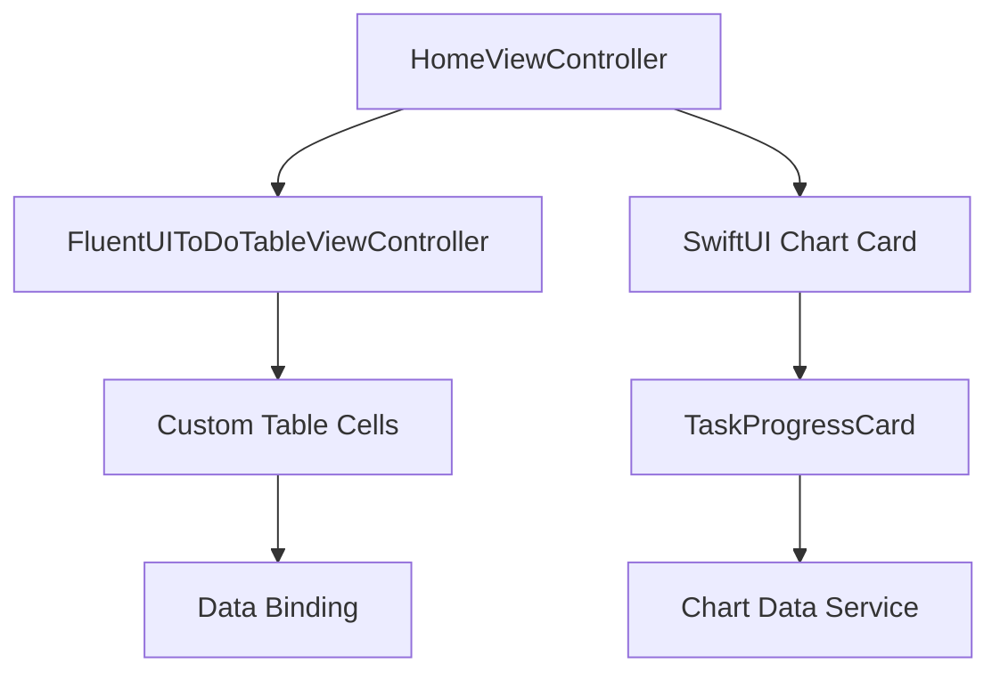
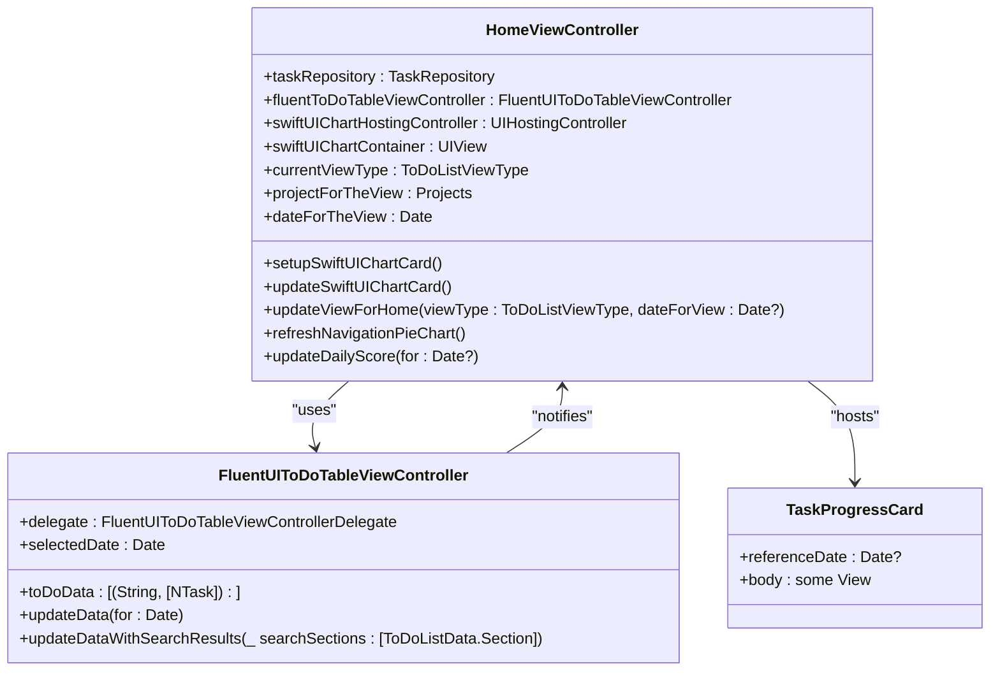
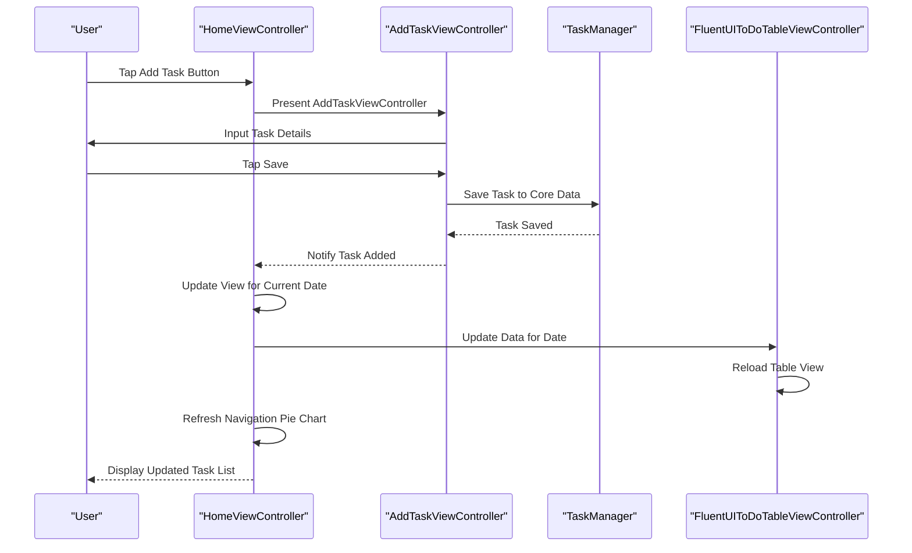
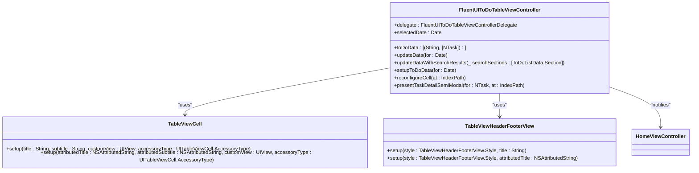
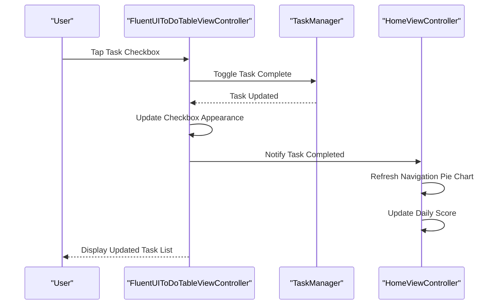
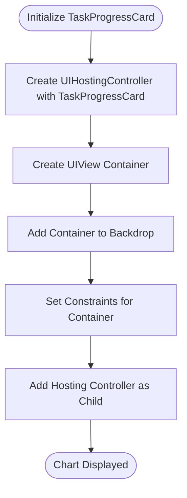
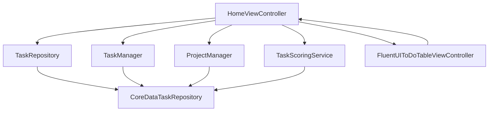

# Presentation Layer Architecture

<cite>
**Referenced Files in This Document**   
- [HomeViewController.swift](file://To%20Do%20List/ViewControllers/HomeViewController.swift)
- [ChartCard.swift](file://To%20Do%20List/Views/Cards/ChartCard.swift)
- [FluentUIToDoTableViewController.swift](file://To%20Do%20List/ViewControllers/FluentUIToDoTableViewController.swift)
- [README.md](file://README.md)
</cite>

## Table of Contents
1. [Introduction](#introduction)
2. [Project Structure](#project-structure)
3. [Core Components](#core-components)
4. [Architecture Overview](#architecture-overview)
5. [Detailed Component Analysis](#detailed-component-analysis)
6. [Dependency Analysis](#dependency-analysis)
7. [Performance Considerations](#performance-considerations)
8. [Troubleshooting Guide](#troubleshooting-guide)
9. [Conclusion](#conclusion)

## Introduction
This document provides a comprehensive analysis of the presentation layer architecture for the Tasker application, focusing on the UIKit-based view controllers that manage the user interface and interaction. The central dashboard, implemented by HomeViewController, serves as the primary interface for task management and user engagement. The application integrates SwiftUI components within its UIKit foundation, demonstrating a hybrid approach to iOS development. Custom table cells and their data binding mechanisms are implemented using FluentUI and MaterialComponents to ensure a consistent and modern UI design. The document details navigation patterns, view lifecycle management, state preservation, and performance considerations for smooth scrolling and dynamic content updates.

## Project Structure
The project structure is organized to separate concerns and facilitate maintainable development. The main components are divided into logical directories, each serving a specific purpose within the application.

```mermaid
graph TB
subgraph "Assets"
Assets[Assets.xcassets]
end
subgraph "Managers"
TaskManager[TaskManager.swift]
ProjectManager[ProjectManager.swift]
DependencyContainer[DependencyContainer.swift]
end
subgraph "Model"
TaskModel[TaskModel.xcdatamodeld]
end
subgraph "Models"
TaskData[TaskData.swift]
ToDoListViewType[ToDoListViewType.swift]
end
subgraph "Repositories"
TaskRepository[TaskRepository.swift]
CoreDataTaskRepository[CoreDataTaskRepository.swift]
end
subgraph "Services"
TaskScoringService[TaskScoringService.swift]
NotificationService[NotificationService.swift]
end
subgraph "Utils"
DateUtils[DateUtils.swift]
CoreDataModels[Core Data Models]
end
subgraph "View"
Charts[Charts]
Animation[Animation]
Theme[Theme]
end
subgraph "ViewControllers"
HomeViewController[HomeViewController.swift]
TaskListViewController[TaskListViewController.swift]
AddTask[AddTask]
end
subgraph "Storyboards"
MainStoryboard[Main.storyboard]
end
```

**Diagram sources**
- [README.md](file://README.md#L1449-L1500)

**Section sources**
- [README.md](file://README.md#L1449-L1500)

## Core Components
The core components of the presentation layer include the HomeViewController, which manages the central dashboard, and the FluentUIToDoTableViewController, which handles the display and interaction of task lists. The integration of SwiftUI components, such as the TaskProgressCard, within the UIKit-based application demonstrates a hybrid approach to UI development. The use of FluentUI and MaterialComponents ensures a consistent and modern design across the application.

**Section sources**
- [HomeViewController.swift](file://To%20Do%20List/ViewControllers/HomeViewController.swift#L0-L199)
- [FluentUIToDoTableViewController.swift](file://To%20Do%20List/ViewControllers/FluentUIToDoTableViewController.swift#L0-L199)

## Architecture Overview
The architecture of the presentation layer is centered around the HomeViewController, which serves as the main entry point for the application. It manages the display of tasks, the integration of SwiftUI components, and the navigation to other parts of the application. The FluentUIToDoTableViewController is responsible for displaying the list of tasks in a structured manner, using custom table cells and data binding mechanisms.



**Diagram sources**
- [HomeViewController.swift](file://To%20Do%20List/ViewControllers/HomeViewController.swift#L0-L199)
- [FluentUIToDoTableViewController.swift](file://To%20Do%20List/ViewControllers/FluentUIToDoTableViewController.swift#L0-L199)

## Detailed Component Analysis

### HomeViewController Analysis
The HomeViewController is the central dashboard of the Tasker application, managing the user interface and interaction. It integrates SwiftUI components within the UIKit-based application, demonstrating a hybrid approach to iOS development.

#### Class Diagram for HomeViewController


**Diagram sources**
- [HomeViewController.swift](file://To%20Do%20List/ViewControllers/HomeViewController.swift#L0-L199)
- [FluentUIToDoTableViewController.swift](file://To%20Do%20List/ViewControllers/FluentUIToDoTableViewController.swift#L0-L199)
- [ChartCard.swift](file://To%20Do%20List/Views/Cards/ChartCard.swift#L0-L199)

#### Sequence Diagram for Task Addition


**Diagram sources**
- [HomeViewController.swift](file://To%20Do%20List/ViewControllers/HomeViewController.swift#L800-L1000)
- [FluentUIToDoTableViewController.swift](file://To%20Do%20List/ViewControllers/FluentUIToDoTableViewController.swift#L0-L199)

**Section sources**
- [HomeViewController.swift](file://To%20Do%20List/ViewControllers/HomeViewController.swift#L0-L199)
- [FluentUIToDoTableViewController.swift](file://To%20Do%20List/ViewControllers/FluentUIToDoTableViewController.swift#L0-L199)

### FluentUIToDoTableViewController Analysis
The FluentUIToDoTableViewController is responsible for displaying the list of tasks in a structured manner, using custom table cells and data binding mechanisms. It integrates with the HomeViewController to provide a seamless user experience.

#### Class Diagram for FluentUIToDoTableViewController


**Diagram sources**
- [FluentUIToDoTableViewController.swift](file://To%20Do%20List/ViewControllers/FluentUIToDoTableViewController.swift#L0-L199)
- [HomeViewController.swift](file://To%20Do%20List/ViewControllers/HomeViewController.swift#L0-L199)

#### Sequence Diagram for Task Completion


**Diagram sources**
- [FluentUIToDoTableViewController.swift](file://To%20Do%20List/ViewControllers/FluentUIToDoTableViewController.swift#L400-L600)
- [HomeViewController.swift](file://To%20Do%20List/ViewControllers/HomeViewController.swift#L800-L1000)

**Section sources**
- [FluentUIToDoTableViewController.swift](file://To%20Do%20List/ViewControllers/FluentUIToDoTableViewController.swift#L0-L199)

### SwiftUI Integration Analysis
The integration of SwiftUI components within the UIKit-based application is achieved through the use of UIHostingController. The TaskProgressCard, a SwiftUI view, is embedded within the HomeViewController to display a line chart of task completion scores.

#### Flowchart for SwiftUI Chart Integration


**Diagram sources**
- [HomeViewController.swift](file://To%20Do%20List/ViewControllers/HomeViewController.swift#L1000-L1105)
- [ChartCard.swift](file://To%20Do%20List/Views/Cards/ChartCard.swift#L0-L199)

**Section sources**
- [HomeViewController.swift](file://To%20Do%20List/ViewControllers/HomeViewController.swift#L1000-L1105)
- [ChartCard.swift](file://To%20Do%20List/Views/Cards/ChartCard.swift#L0-L199)

## Dependency Analysis
The presentation layer components are tightly integrated with the business logic and data access layers. The HomeViewController depends on the TaskRepository for data access, and the FluentUIToDoTableViewController depends on the HomeViewController for navigation and state management.



**Diagram sources**
- [HomeViewController.swift](file://To%20Do%20List/ViewControllers/HomeViewController.swift#L0-L199)
- [FluentUIToDoTableViewController.swift](file://To%20Do%20List/ViewControllers/FluentUIToDoTableViewController.swift#L0-L199)

**Section sources**
- [HomeViewController.swift](file://To%20Do%20List/ViewControllers/HomeViewController.swift#L0-L199)
- [FluentUIToDoTableViewController.swift](file://To%20Do%20List/ViewControllers/FluentUIToDoTableViewController.swift#L0-L199)

## Performance Considerations
The application implements several performance optimizations to ensure smooth scrolling and dynamic content updates. These include efficient cell reuse, lazy loading of data, background processing for Core Data operations, and smooth animations for state transitions.

**Section sources**
- [README.md](file://README.md#L1170-L1207)

## Troubleshooting Guide
Common issues in the presentation layer include problems with data binding, UI updates, and navigation. Ensuring that the TaskRepository is properly injected into the HomeViewController and that the FluentUIToDoTableViewController is correctly configured can resolve most issues.

**Section sources**
- [HomeViewController.swift](file://To%20Do%20List/ViewControllers/HomeViewController.swift#L0-L199)
- [FluentUIToDoTableViewController.swift](file://To%20Do%20List/ViewControllers/FluentUIToDoTableViewController.swift#L0-L199)

## Conclusion
The presentation layer of the Tasker application is well-structured and leverages both UIKit and SwiftUI to provide a modern and responsive user interface. The HomeViewController serves as the central dashboard, managing the display of tasks and the integration of SwiftUI components. The FluentUIToDoTableViewController handles the display and interaction of task lists, using custom table cells and data binding mechanisms. The use of FluentUI and MaterialComponents ensures a consistent and modern design across the application. Performance optimizations and efficient data binding mechanisms contribute to a smooth user experience.