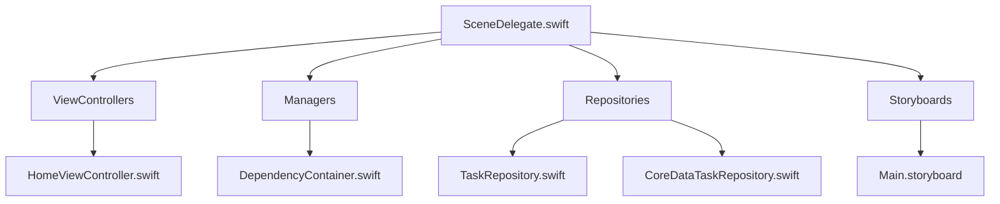
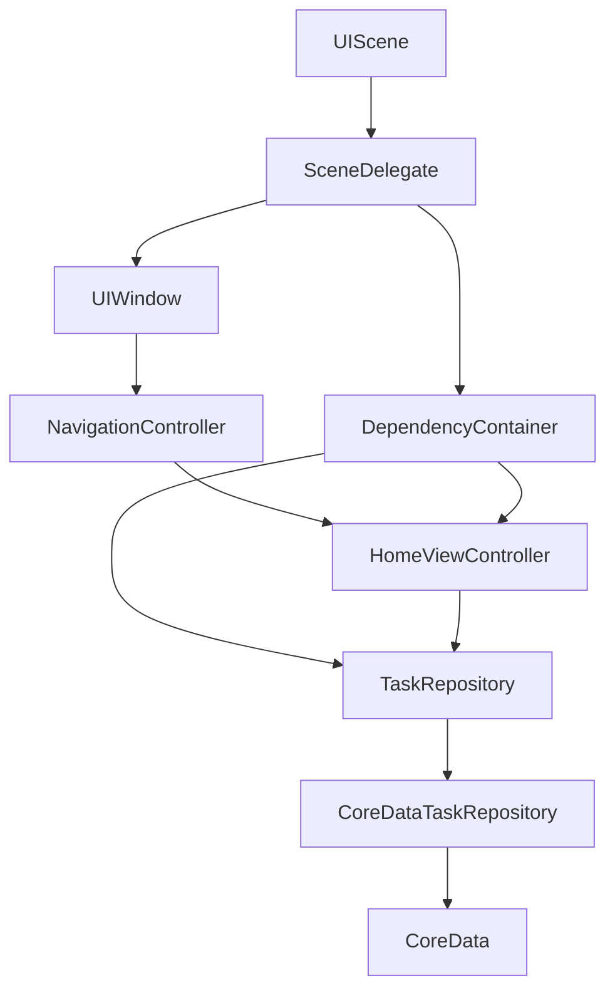
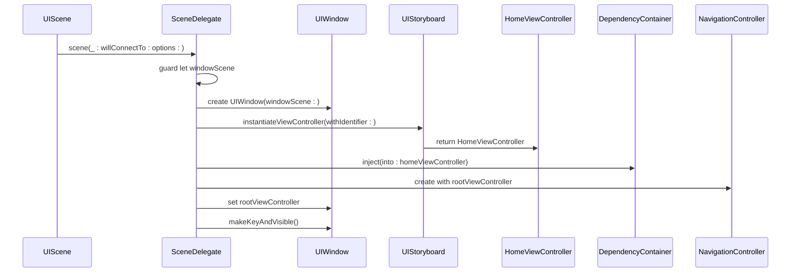
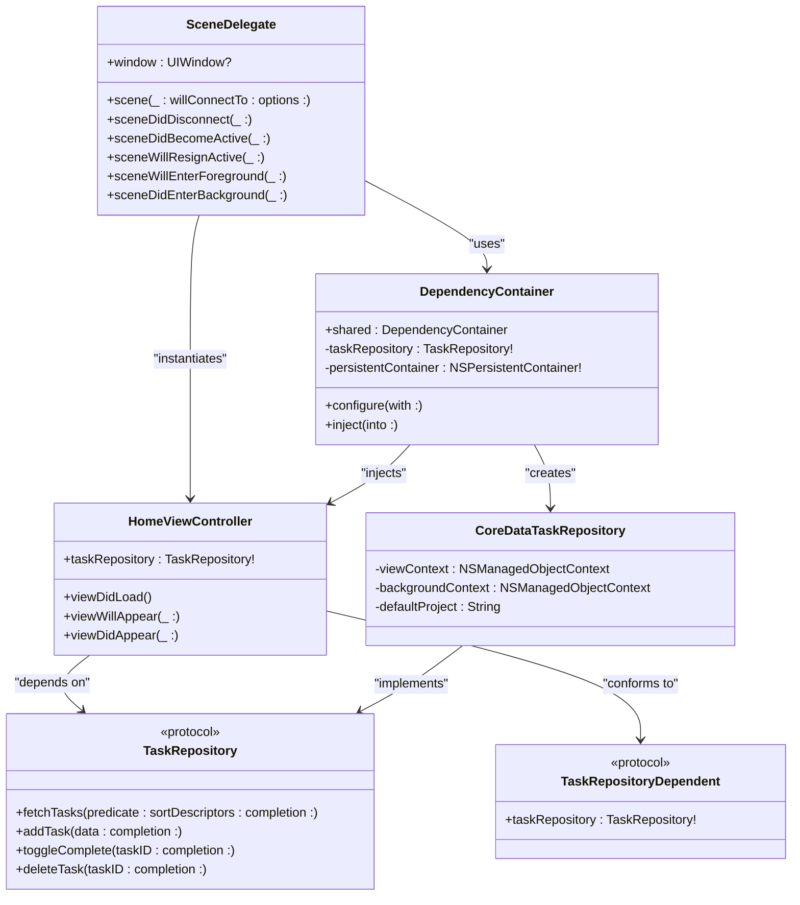
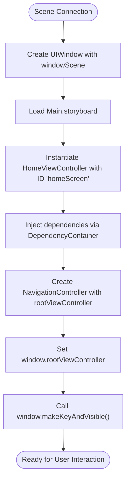
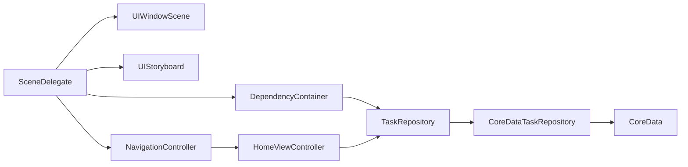

# SceneDelegate and Lifecycle Management

<cite>
**Referenced Files in This Document**   
- [SceneDelegate.swift](file://To%20Do%20List/SceneDelegate.swift)
- [HomeViewController.swift](file://To%20Do%20List/ViewControllers/HomeViewController.swift)
- [DependencyContainer.swift](file://To%20Do%20List/Managers/DependencyContainer.swift)
- [TaskRepository.swift](file://To%20Do%20List/Repositories/TaskRepository.swift)
- [CoreDataTaskRepository.swift](file://To%20Do%20List/Repositories/CoreDataTaskRepository.swift)
- [Main.storyboard](file://To%20Do%20List/Storyboards/Base.lproj/Main.storyboard)
</cite>

## Table of Contents
1. [Introduction](#introduction)
2. [Project Structure](#project-structure)
3. [Core Components](#core-components)
4. [Architecture Overview](#architecture-overview)
5. [Detailed Component Analysis](#detailed-component-analysis)
6. [Dependency Analysis](#dependency-analysis)
7. [Performance Considerations](#performance-considerations)
8. [Troubleshooting Guide](#troubleshooting-guide)
9. [Conclusion](#conclusion)

## Introduction
The SceneDelegate in the Tasker application serves as the central coordinator for managing the lifecycle of a UIScene, handling critical responsibilities from scene connection to destruction. This document provides a comprehensive analysis of how SceneDelegate orchestrates the application's initial view hierarchy, manages dependency injection through the DependencyContainer, and coordinates with UIWindowSceneDelegate protocols to ensure smooth application startup and state transitions. The analysis covers the complete flow from scene initialization to view controller instantiation, including edge cases like multiple window support and background-to-foreground transitions.

## Project Structure
The Tasker application follows a structured architecture with clear separation of concerns across different directories. The SceneDelegate is located in the root directory of the application, working in conjunction with view controllers in the ViewControllers directory, dependency management in the Managers directory, and data access components in the Repositories directory. This organization supports the application's hybrid architecture that combines traditional MVC patterns with modern repository and dependency injection patterns.

**Diagram sources**
- [SceneDelegate.swift](file://To%20Do%20List/SceneDelegate.swift)
- [HomeViewController.swift](file://To%20Do%20List/ViewControllers/HomeViewController.swift)
- [DependencyContainer.swift](file://To%20Do%20List/Managers/DependencyContainer.swift)

**Section sources**
- [SceneDelegate.swift](file://To%20Do%20List/SceneDelegate.swift)
- [HomeViewController.swift](file://To%20Do%20List/ViewControllers/HomeViewController.swift)

## Core Components
The SceneDelegate is the primary component responsible for managing the UIScene lifecycle, with its core functionality centered around the `scene(_:willConnectTo:options:)` method. This method handles the creation of the UIWindow, instantiation of the HomeViewController from Main.storyboard, injection of dependencies through DependencyContainer, and establishment of the navigation hierarchy using FluentUI's NavigationController. The component works in conjunction with the DependencyContainer to provide the HomeViewController with access to the TaskRepository, enabling data access without tight coupling to the implementation details.

**Section sources**
- [SceneDelegate.swift](file://To%20Do%20List/SceneDelegate.swift#L1-L71)
- [DependencyContainer.swift](file://To%20Do%20List/Managers/DependencyContainer.swift#L1-L81)

## Architecture Overview
The SceneDelegate operates as the entry point for scene-based lifecycle management in the Tasker application, implementing the UIWindowSceneDelegate protocol to respond to scene state changes. It coordinates with the DependencyContainer to establish a dependency injection system that provides view controllers with access to shared services like TaskRepository. The architecture follows a hybrid pattern where the SceneDelegate handles view hierarchy setup while delegating data access responsibilities to repository classes, promoting separation of concerns and testability.

**Diagram sources**
- [SceneDelegate.swift](file://To%20Do%20List/SceneDelegate.swift#L1-L71)
- [DependencyContainer.swift](file://To%20Do%20List/Managers/DependencyContainer.swift#L1-L81)
- [TaskRepository.swift](file://To%20Do%20List/Repositories/TaskRepository.swift#L1-L118)

## Detailed Component Analysis

### SceneDelegate Lifecycle Management
The SceneDelegate implements the UIWindowSceneDelegate protocol to manage the complete lifecycle of a UIScene, from connection to background transitions. The primary method `scene(_:willConnectTo:options:)` is responsible for setting up the initial user interface by creating a UIWindow programmatically and configuring the root view controller hierarchy. This approach allows for greater control over the navigation stack compared to storyboard-based initialization, particularly when using custom navigation controllers like FluentUI's NavigationController.

#### Scene Connection and Window Setup

**Diagram sources**
- [SceneDelegate.swift](file://To%20Do%20List/SceneDelegate.swift#L15-L40)

**Section sources**
- [SceneDelegate.swift](file://To%20Do%20List/SceneDelegate.swift#L15-L40)

### Dependency Injection Flow
The SceneDelegate leverages the DependencyContainer to implement property-based dependency injection, providing the HomeViewController with access to the TaskRepository without creating tight coupling. This pattern allows for better testability and flexibility in the application architecture. The injection process uses runtime introspection to identify properties that conform to the TaskRepositoryDependent protocol, enabling automatic injection of the taskRepository dependency.

#### Dependency Injection Mechanism

**Diagram sources**
- [SceneDelegate.swift](file://To%20Do%20List/SceneDelegate.swift#L1-L71)
- [DependencyContainer.swift](file://To%20Do%20List/Managers/DependencyContainer.swift#L1-L81)
- [HomeViewController.swift](file://To%20Do%20List/ViewControllers/HomeViewController.swift#L1-L1106)
- [TaskRepository.swift](file://To%20Do%20List/Repositories/TaskRepository.swift#L1-L118)
- [CoreDataTaskRepository.swift](file://To%20Do%20List/Repositories/CoreDataTaskRepository.swift#L1-L455)

**Section sources**
- [DependencyContainer.swift](file://To%20Do%20List/Managers/DependencyContainer.swift#L1-L81)
- [HomeViewController.swift](file://To%20Do%20List/ViewControllers/HomeViewController.swift#L1-L1106)

### View Hierarchy Configuration
The SceneDelegate is responsible for establishing the initial view hierarchy by programmatically creating the UIWindow and configuring the navigation stack. This process involves loading the HomeViewController from Main.storyboard using the identifier "homeScreen", embedding it within a FluentUI NavigationController, and setting this navigation controller as the root view controller of the window. This approach provides flexibility in navigation configuration while maintaining the benefits of storyboard-based view design.

#### View Hierarchy Setup Flow

**Diagram sources**
- [SceneDelegate.swift](file://To%20Do%20List/SceneDelegate.swift#L15-L40)
- [Main.storyboard](file://To%20Do%20List/Storyboards/Base.lproj/Main.storyboard)

**Section sources**
- [SceneDelegate.swift](file://To%20Do%20List/SceneDelegate.swift#L15-L40)

## Dependency Analysis
The SceneDelegate has direct dependencies on several key components in the application architecture. It depends on UIWindowScene for scene management, UIStoryboard for view controller instantiation, and the DependencyContainer for dependency injection. The HomeViewController, which is instantiated by the SceneDelegate, has a dependency on the TaskRepository protocol, which is fulfilled by the CoreDataTaskRepository implementation. This dependency chain creates a loosely coupled architecture where components depend on abstractions rather than concrete implementations, enhancing testability and maintainability.

**Diagram sources**
- [SceneDelegate.swift](file://To%20Do%20List/SceneDelegate.swift#L1-L71)
- [DependencyContainer.swift](file://To%20Do%20List/Managers/DependencyContainer.swift#L1-L81)
- [TaskRepository.swift](file://To%20Do%20List/Repositories/TaskRepository.swift#L1-L118)
- [CoreDataTaskRepository.swift](file://To%20Do%20List/Repositories/CoreDataTaskRepository.swift#L1-L455)

**Section sources**
- [SceneDelegate.swift](file://To%20Do%20List/SceneDelegate.swift#L1-L71)
- [DependencyContainer.swift](file://To%20Do%20List/Managers/DependencyContainer.swift#L1-L81)

## Performance Considerations
The SceneDelegate's implementation has several performance implications that affect application startup time and memory usage. The current approach of programmatically creating the UIWindow and loading the HomeViewController from storyboard represents a balance between flexibility and performance. The dependency injection process occurs synchronously during scene connection, which could potentially delay the display of the initial interface if the injection process becomes complex. However, the current implementation is optimized with minimal processing during the critical path of scene connection.

The use of a shared DependencyContainer instance ensures that dependencies are created only once, reducing memory overhead and initialization time. The TaskRepository implementation uses background contexts for data operations, preventing UI blocking during data access. However, the initial injection of dependencies into the HomeViewController occurs on the main thread, which could be optimized by moving dependency resolution to a background queue if the dependency graph becomes more complex in future versions.

## Troubleshooting Guide
Common issues with SceneDelegate implementation typically involve scene connection failures, dependency injection problems, or view hierarchy configuration errors. When debugging scene connection issues, verify that the correct scene delegate class is specified in the app's configuration and that the UIWindowScene is properly initialized. For dependency injection problems, check that the view controller conforms to the TaskRepositoryDependent protocol and that the DependencyContainer has been properly configured with the required dependencies.

When encountering view hierarchy issues, ensure that the storyboard identifier matches the one used in the code and that the NavigationController is properly configured. Performance issues during startup may indicate problems with the dependency injection process or excessive work being performed in the scene connection method. In such cases, consider lazy loading non-essential components or moving heavy initialization tasks to after the initial interface has been displayed.

**Section sources**
- [SceneDelegate.swift](file://To%20Do%20List/SceneDelegate.swift#L1-L71)
- [DependencyContainer.swift](file://To%20Do%20List/Managers/DependencyContainer.swift#L1-L81)

## Conclusion
The SceneDelegate in the Tasker application serves as a critical component for managing the UIScene lifecycle and establishing the initial application state. Its implementation demonstrates a thoughtful approach to view hierarchy configuration and dependency management, leveraging the DependencyContainer to provide a flexible dependency injection system. The component effectively coordinates with UIWindowSceneDelegate protocols to handle scene state transitions while maintaining a clean separation of concerns. This architecture supports the application's evolution toward a more testable and maintainable codebase, with clear pathways for further refactoring and enhancement.