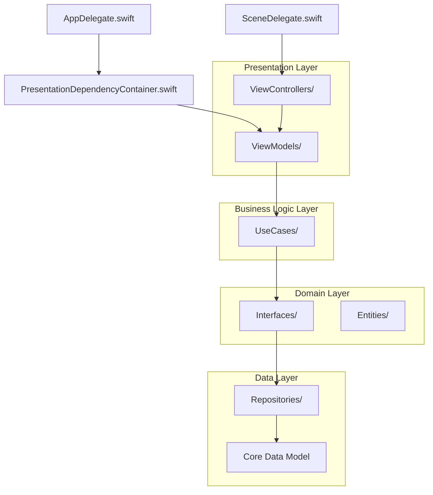
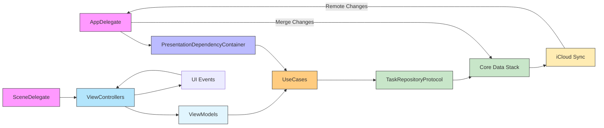
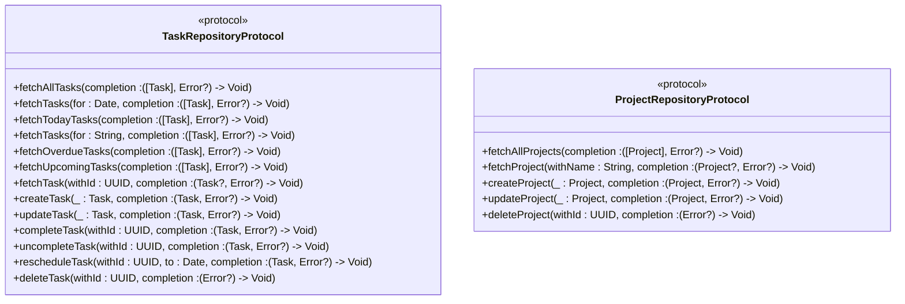
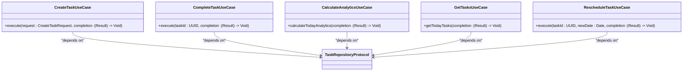

<docs>
# Technical Architecture

<cite>
**Referenced Files in This Document**   
- [AppDelegate.swift](file://To%20Do%20List/AppDelegate.swift) - *Updated in commit 1468588*
- [SceneDelegate.swift](file://To%20Do%20List/SceneDelegate.swift) - *Updated in commit 1468588*
- [TaskRepositoryProtocol.swift](file://To%20Do%20List/Domain/Interfaces/TaskRepositoryProtocol.swift) - *Added in commit ab127a3*
- [PresentationDependencyContainer.swift](file://To%20Do%20Do%20List/Presentation/DI/PresentationDependencyContainer.swift) - *Added in commit 1468588*
- [HomeViewModel.swift](file://To%20Do%20List/Presentation/ViewModels/HomeViewModel.swift) - *Added in commit 1468588*
- [AddTaskViewModel.swift](file://To%20Do%20List/Presentation/ViewModels/AddTaskViewModel.swift) - *Added in commit 1468588*
- [CreateTaskUseCase.swift](file://To%20Do%20List/UseCases/Task/CreateTaskUseCase.swift) - *Added in commit 0b17e78*
- [CompleteTaskUseCase.swift](file://To%20Do%20List/UseCases/Task/CompleteTaskUseCase.swift) - *Added in commit 0b17e78*
- [CalculateAnalyticsUseCase.swift](file://To%20Do%20List/UseCases/Analytics/CalculateAnalyticsUseCase.swift) - *Added in commit 0b17e78*
</cite>

## Update Summary
**Changes Made**   
- Updated architecture description from hybrid MVC to Clean Architecture with MVVM
- Added documentation for new architectural components: ViewModels, UseCases, and Domain interfaces
- Updated dependency injection system to use PresentationDependencyContainer
- Added new section on Clean Architecture implementation
- Updated component interaction diagram to reflect new architecture
- Removed outdated MVC references and updated to reflect ViewModel-based approach
- Added documentation for business logic layer with UseCases

## Table of Contents
1. [Introduction](#introduction)
2. [Project Structure](#project-structure)
3. [Core Components](#core-components)
4. [Architecture Overview](#architecture-overview)
5. [Clean Architecture Implementation](#clean-architecture-implementation)
6. [Detailed Component Analysis](#detailed-component-analysis)
7. [Dependency Analysis](#dependency-analysis)
8. [Performance Considerations](#performance-considerations)
9. [Troubleshooting Guide](#troubleshooting-guide)
10. [Conclusion](#conclusion)

## Introduction
This document provides a comprehensive overview of the Tasker application's technical architecture following a significant refactor to Clean Architecture with MVVM pattern. The architecture now features a clear separation between presentation, business logic, and data layers, with domain interfaces defining contracts between components. The system leverages protocol-oriented programming for enhanced testability and extensibility, while maintaining Core Data with NSPersistentCloudKitContainer for seamless iCloud synchronization. The flow from app launch to UI presentation is orchestrated through AppDelegate and SceneDelegate, with a modern dependency injection system that provides ViewModels to view controllers. This architectural evolution improves maintainability, testability, and scalability.

## Project Structure
The Tasker application follows a Clean Architecture structure with distinct layers for presentation, domain, and data concerns. The main application logic is organized into dedicated directories: Presentation for UI components and ViewModels, UseCases for business logic, Domain for interfaces and entities, and Data layer for persistence implementation. The core application lifecycle is managed by AppDelegate and SceneDelegate, while dependency injection is handled by the PresentationDependencyContainer. Third-party dependencies are managed via CocoaPods, including CircleMenu for interactive UI elements and DGCharts for data visualization.

**Diagram sources**
- [AppDelegate.swift](file://To%20Do%20List/AppDelegate.swift#L1-L192)
- [PresentationDependencyContainer.swift](file://To%20Do%20List/Presentation/DI/PresentationDependencyContainer.swift)
- [HomeViewModel.swift](file://To%20Do%20List/Presentation/ViewModels/HomeViewModel.swift)
- [CreateTaskUseCase.swift](file://To%20Do%20List/UseCases/Task/CreateTaskUseCase.swift)
- [TaskRepositoryProtocol.swift](file://To%20Do%20List/Domain/Interfaces/TaskRepositoryProtocol.swift)

**Section sources**
- [AppDelegate.swift](file://To%20Do%20List/AppDelegate.swift#L1-L192)

## Core Components
The Tasker application is built around five primary architectural components: AppDelegate, SceneDelegate, PresentationDependencyContainer, ViewModels, and UseCases. These components work in concert to manage application lifecycle, coordinate dependencies, separate business logic from presentation, and abstract data access. The architecture now follows Clean Architecture principles with clear boundaries between layers. The Domain layer defines interfaces through protocols like TaskRepositoryProtocol, enabling dependency inversion and testability. ViewModels expose observable state to ViewControllers, while UseCases encapsulate business logic and coordinate between the presentation and data layers. This layered approach ensures maintainability, testability, and scalability.

**Section sources**
- [AppDelegate.swift](file://To%20Do%20List/AppDelegate.swift#L1-L192)
- [SceneDelegate.swift](file://To%20Do%20List/SceneDelegate.swift)
- [PresentationDependencyContainer.swift](file://To%20Do%20List/Presentation/DI/PresentationDependencyContainer.swift)
- [HomeViewModel.swift](file://To%20Do%20List/Presentation/ViewModels/HomeViewModel.swift)
- [CreateTaskUseCase.swift](file://To%20Do%20List/UseCases/Task/CreateTaskUseCase.swift)
- [TaskRepositoryProtocol.swift](file://To%20Do%20List/Domain/Interfaces/TaskRepositoryProtocol.swift)

## Architecture Overview
Tasker now employs Clean Architecture with MVVM pattern, replacing the previous hybrid MVC approach. At launch, AppDelegate initializes the Core Data stack using NSPersistentCloudKitContainer, enabling seamless iCloud synchronization. It then configures the PresentationDependencyContainer, which serves as a central registry for shared services and coordinates dependency injection. SceneDelegate manages scene lifecycle events and injects ViewModels into view controllers through the dependency container. The architecture features a clear separation of concerns: ViewModels handle presentation logic and expose state to ViewControllers, UseCases encapsulate business logic and coordinate operations, and the Domain layer defines interfaces that abstract data access. This layered approach ensures maintainability, testability, and scalability.

**Diagram sources**
- [AppDelegate.swift](file://To%20Do%20List/AppDelegate.swift#L1-L192)
- [SceneDelegate.swift](file://To%20Do%20List/SceneDelegate.swift)
- [PresentationDependencyContainer.swift](file://To%20Do%20List/Presentation/DI/PresentationDependencyContainer.swift)
- [HomeViewModel.swift](file://To%20Do%20List/Presentation/ViewModels/HomeViewModel.swift)
- [CreateTaskUseCase.swift](file://To%20Do%20List/UseCases/Task/CreateTaskUseCase.swift)
- [TaskRepositoryProtocol.swift](file://To%20Do%20List/Domain/Interfaces/TaskRepositoryProtocol.swift)

## Clean Architecture Implementation
The Tasker application has been refactored to implement Clean Architecture principles with a clear separation between layers. The architecture is organized into four main layers: Presentation, Business Logic, Domain, and Data.

### Domain Layer
The Domain layer contains business entities and interfaces that define contracts between components. The TaskRepositoryProtocol defines all task-related data operations, serving as an abstraction boundary that decouples business logic from data persistence details. This protocol enables dependency injection and facilitates testing by allowing mock implementations.

**Diagram sources**
- [TaskRepositoryProtocol.swift](file://To%20Do%20List/Domain/Interfaces/TaskRepositoryProtocol.swift)
- [ProjectRepositoryProtocol.swift](file://To%20Do%20List/Domain/Interfaces/ProjectRepositoryProtocol.swift)

### Business Logic Layer
The Business Logic layer contains UseCases that encapsulate specific business operations. Each UseCase is responsible for a single business function and coordinates between the presentation layer and data layer. UseCases depend on domain interfaces rather than concrete implementations, maintaining dependency inversion.

**Diagram sources**
- [CreateTaskUseCase