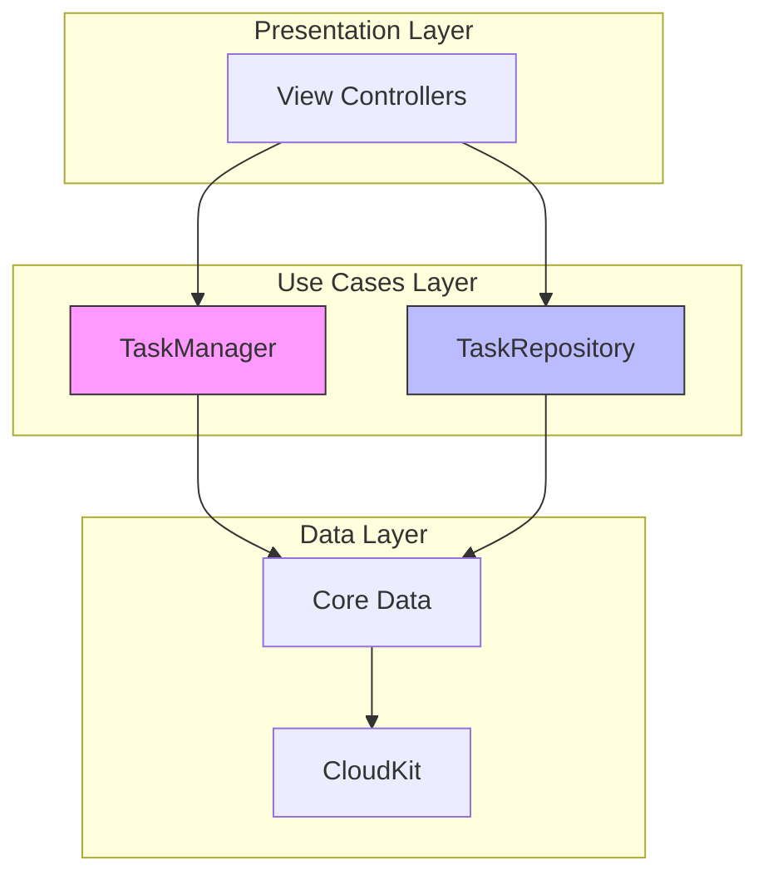
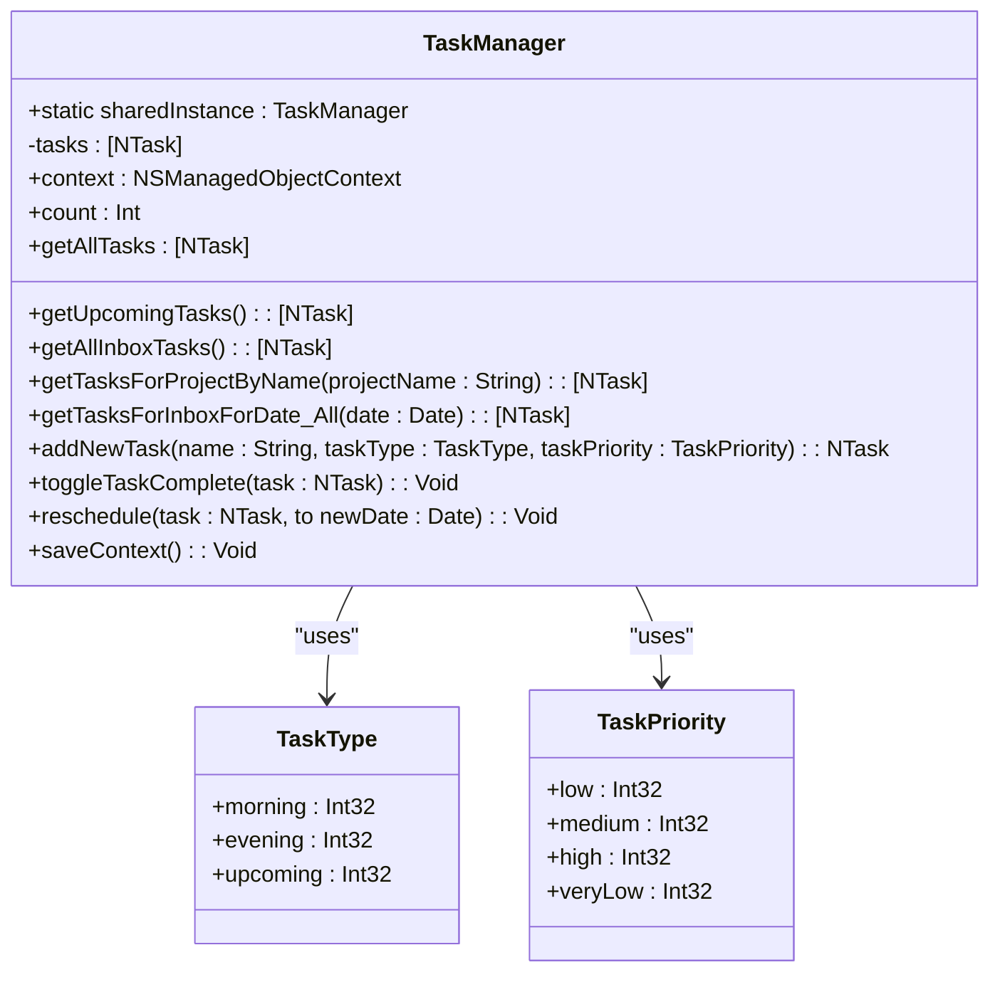
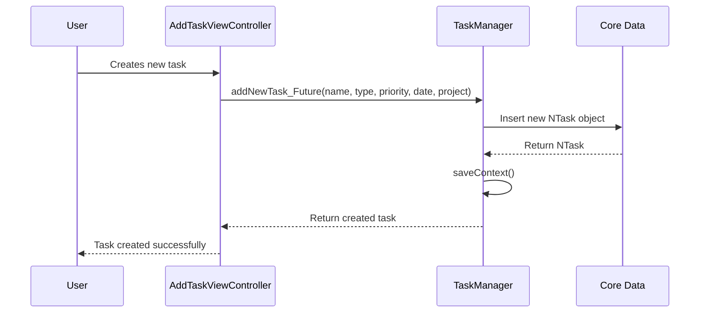
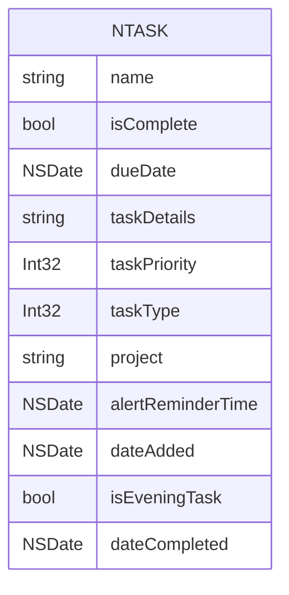
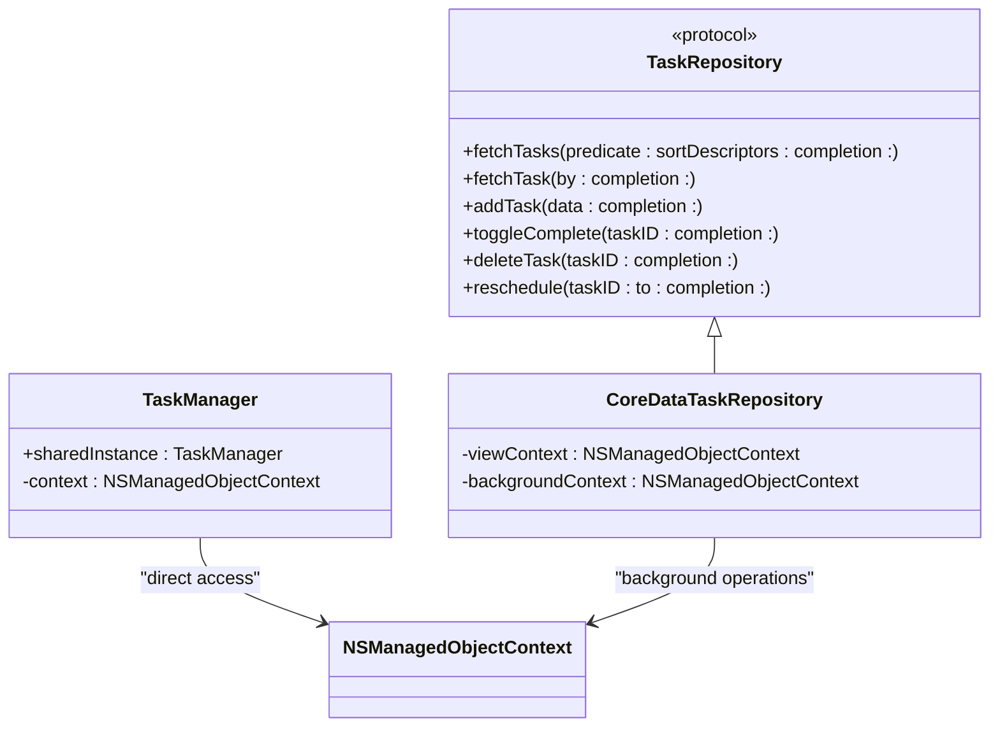
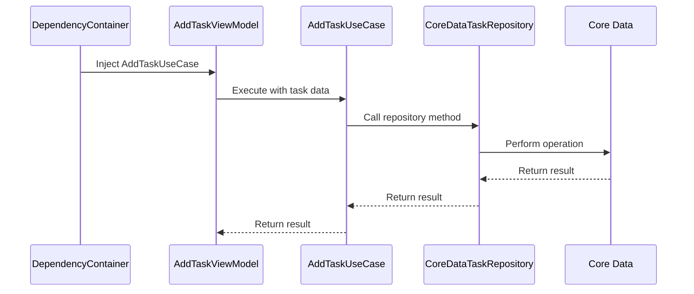

# Use Cases Layer

<cite>
**Referenced Files in This Document**   
- [TaskManager.swift](file://To%20Do%20List/ViewControllers/TaskManager.swift)
- [NTask+CoreDataProperties.swift](file://To%20Do%20List/NTask+CoreDataProperties.swift)
- [NTask+CoreDataClass.swift](file://To%20Do%20List/NTask+CoreDataClass.swift)
- [HomeViewController.swift](file://To%20Do%20List/ViewControllers/HomeViewController.swift)
- [AddTaskViewController.swift](file://To%20Do%20List/ViewControllers/AddTaskViewController.swift)
- [CoreDataTaskRepository.swift](file://To%20Do%20List/Repositories/CoreDataTaskRepository.swift)
- [TaskRepository.swift](file://To%20Do%20List/Repositories/TaskRepository.swift)
- [TaskData.swift](file://To%20Do%20List/Models/TaskData.swift)
- [README.md](file://README.md)
- [clean.md](file://clean.md)
</cite>

## Table of Contents
1. [Introduction](#introduction)
2. [Architecture Overview](#architecture-overview)
3. [Core Responsibilities](#core-responsibilities)
4. [Business Logic Workflows](#business-logic-workflows)
5. [Implementation Details](#implementation-details)
6. [Integration Patterns](#integration-patterns)
7. [Practical Examples](#practical-examples)
8. [Troubleshooting Guidance](#troubleshooting-guidance)
9. [Migration Roadmap](#migration-roadmap)

## Introduction

The Use Cases Layer in the Clean Architecture implementation serves as the central hub for business logic and workflows in the Tasker application. This layer orchestrates the flow of data between the Presentation Layer and the Data Layer, implementing application-specific business rules and validation. The primary component in this layer is the **TaskManager**, a legacy singleton class that manages all task-related operations including CRUD operations, task retrieval and filtering, state management, and business rule enforcement.

This documentation provides a comprehensive analysis of the Use Cases Layer, covering its purpose, business logic workflows, implementation details, and integration patterns with other layers. It also includes practical examples and troubleshooting guidance to assist developers in understanding and working with this critical component of the application architecture.

**Section sources**
- [TaskManager.swift](file://To%20Do%20List/ViewControllers/TaskManager.swift#L1-L50)

## Architecture Overview

The Use Cases Layer in Tasker follows a hybrid architecture that is transitioning from a legacy monolithic design to a modern Clean Architecture pattern. The current state represents a transitional phase where legacy components coexist with modern implementations, allowing for a gradual migration to a more maintainable and testable architecture.



**Diagram sources**
- [README.md](file://README.md#L104-L223)

**Section sources**
- [README.md](file://README.md#L104-L223)

## Core Responsibilities

The Use Cases Layer, primarily implemented through the **TaskManager** class, has several core responsibilities that define its role in the application architecture:

- **CRUD Operations**: Creating, reading, updating, and deleting tasks from the persistent store
- **Task Retrieval and Filtering**: Providing methods to fetch tasks based on various criteria such as project, date, completion status, and time of day (morning/evening)
- **State Management**: Maintaining a global state of tasks and ensuring data consistency across the application
- **Business Rule Enforcement**: Enforcing application-specific rules regarding task priorities, due dates, and project assignments

The **TaskManager** class is implemented as a singleton using the **sharedInstance** static property, ensuring that only one instance exists throughout the application lifecycle. This design allows any component to access task management functionality without needing to instantiate the class.



**Diagram sources**
- [TaskManager.swift](file://To%20Do%20List/ViewControllers/TaskManager.swift#L50-L100)

**Section sources**
- [TaskManager.swift](file://To%20Do%20List/ViewControllers/TaskManager.swift#L50-L150)

## Business Logic Workflows

The Use Cases Layer implements several key business logic workflows that define the core functionality of the Tasker application. These workflows are orchestrated through the **TaskManager** class and its methods, which handle the complete lifecycle of tasks from creation to completion.

### Task Creation Workflow
The task creation workflow begins when a user creates a new task through the UI. The **AddTaskViewController** calls the appropriate method on **TaskManager**, which then:
1. Creates a new managed object in Core Data
2. Sets the task properties (name, type, priority, etc.)
3. Saves the context to persist the changes
4. Returns the created task to the caller



**Diagram sources**
- [TaskManager.swift](file://To%20Do%20List/ViewControllers/TaskManager.swift#L800-L900)
- [AddTaskViewController.swift](file://To%20Do%20List/ViewControllers/AddTaskViewController.swift#L1-L50)
- [HomeViewController.swift](file://To%20Do%20List/ViewControllers/HomeViewController.swift#L1-L50)

**Section sources**
- [AddTaskViewController.swift](file://To%20Do%20List/ViewControllers/AddTaskViewController.swift#L1-L200)
- [HomeViewController.swift](file://To%20Do%20List/ViewControllers/HomeViewController.swift#L1-L200)

### Task Completion Workflow
The task completion workflow handles the logic for marking a task as complete or incomplete. When a task is completed, the **dateCompleted** property is set to the current date; when marked incomplete, this property is cleared.

```swift
func toggleTaskComplete(task: NTask) {
    let wasComplete = task.isComplete
    task.isComplete.toggle()
    if task.isComplete {
        task.dateCompleted = Date.today() as NSDate
    } else {
        task.dateCompleted = nil
    }
    saveContext()
    
    NotificationCenter.default.post(name: NSNotification.Name("TaskCompletionChanged"), object: nil)
}
```

After updating the task's state, the method calls **saveContext()** to persist the changes to Core Data. It also posts a **TaskCompletionChanged** notification via **NotificationCenter**, allowing other parts of the application (such as charts or UI components) to react to the change in task status.

**Section sources**
- [TaskManager.swift](file://To%20Do%20List/ViewControllers/TaskManager.swift#L750-L780)

## Implementation Details

The implementation of the Use Cases Layer in Tasker reflects a transitional state between legacy and modern architectural patterns. The **TaskManager** class represents the legacy implementation, while the **TaskRepository** pattern represents the modern approach being adopted.

### Legacy Implementation (TaskManager)
The **TaskManager** class is tightly coupled with Core Data through direct access to the **NTask** entity. It maintains a reference to the **NSManagedObjectContext** obtained from the **AppDelegate**, which is used for all Core Data operations. This tight coupling is evident in methods like **addNewTask**, which uses **NSEntityDescription.insertNewObject(forEntityName:into:)** to create new managed objects.



**Diagram sources**
- [NTask+CoreDataProperties.swift](file://To%20Do%20List/NTask+CoreDataProperties.swift#L10-L30)
- [NTask+CoreDataClass.swift](file://To%20Do%20List/NTask+CoreDataClass.swift#L1-L10)

**Section sources**
- [NTask+CoreDataProperties.swift](file://To%20Do%20List/NTask+CoreDataProperties.swift#L1-L50)
- [NTask+CoreDataClass.swift](file://To%20Do%20List/NTask+CoreDataClass.swift#L1-L17)

### Modern Implementation (TaskRepository)
The **TaskRepository** pattern represents a shift toward dependency injection and protocol-oriented programming. The **TaskRepository** protocol defines a contract for task data access, with **CoreDataTaskRepository** providing a concrete implementation.



**Diagram sources**
- [TaskRepository.swift](file://To%20Do%20List/Repositories/TaskRepository.swift#L1-L118)
- [CoreDataTaskRepository.swift](file://To%20Do%20List/Repositories/CoreDataTaskRepository.swift#L1-L50)

**Section sources**
- [TaskRepository.swift](file://To%20Do%20List/Repositories/TaskRepository.swift#L1-L118)
- [CoreDataTaskRepository.swift](file://To%20Do%20List/Repositories/CoreDataTaskRepository.swift#L1-L200)

## Integration Patterns

The Use Cases Layer integrates with other layers in the application through well-defined patterns that facilitate communication and data flow. These integration patterns have evolved over time as the application architecture has matured.

### Dependency Injection Pattern
The repository pattern enables dependency injection, allowing components to receive their dependencies rather than creating them directly. This promotes loose coupling and enhances testability.



**Diagram sources**
- [README.md](file://README.md#L1574-L1578)

**Section sources**
- [README.md](file://README.md#L1574-L1578)

### Decoupling Business Logic from Persistence
The repository pattern effectively decouples business logic from persistence concerns by:

1. **Abstraction**: Use cases interact with protocol interfaces rather than concrete implementations
2. **Testability**: Repositories can be easily mocked for unit testing
3. **Flexibility**: Different implementations (e.g., in-memory, REST API) can be substituted
4. **Maintainability**: Changes to the persistence layer don't affect business logic

This decoupling is evident in the migration roadmap, where the legacy `TaskManager` singleton is being replaced with injectable repository instances.

**Section sources**
- [README.md](file://README.md#L1574-L1578)

## Practical Examples

The following examples demonstrate common operations performed through the Use Cases Layer:

### Creating a New Task
```swift
let newTask = TaskManager.sharedInstance.addNewTask(
    name: "Complete documentation",
    taskType: .morning,
    taskPriority: .high
)
```

### Marking a Task as Completed
```swift
TaskManager.sharedInstance.toggleTaskComplete(task: myTask)
```

### Retrieving Morning Tasks for Today
```swift
let morningTasks = TaskManager.sharedInstance.getMorningTasks(for: Date.today())
```

### Rescheduling a Task
```swift
let newDueDate = Calendar.current.date(byAdding: .day, value: 1, to: Date())!
TaskManager.sharedInstance.reschedule(task: myTask, to: newDueDate)
```

**Section sources**
- [TaskManager.swift](file://To%20Do%20List/ViewControllers/TaskManager.swift#L300-L900)

## Troubleshooting Guidance

The **TaskManager** singleton presents several challenges that impact the application's testability, maintainability, and scalability:

- **Global State**: The singleton pattern creates global state, making it difficult to isolate components for testing and increasing the risk of unintended side effects.
- **Tight Coupling**: Direct dependency on Core Data and the **AppDelegate** makes the class difficult to unit test and tightly couples the business logic to the persistence layer.
- **Synchronous Operations**: Performing Core Data operations on the main thread can lead to UI freezes and degraded performance, especially with large datasets.
- **Limited Extensibility**: The monolithic design makes it difficult to extend or modify behavior without affecting the entire application.

To address these challenges, the following refactoring recommendations are proposed:

1. **Adopt Dependency Injection**: Gradually replace direct calls to **TaskManager.sharedInstance** with injected instances of **TaskRepository**. This will decouple the view controllers from the specific implementation and make the code more testable.

2. **Implement Protocol Abstraction**: Define a **TaskManagerProtocol** that mirrors the public interface of **TaskManager**, then refactor the class to conform to this protocol. This will allow for easier mocking in tests and facilitate the transition to the **TaskRepository** pattern.

3. **Migrate to Asynchronous Operations**: Update the **TaskManager** methods to use completion handlers or async/await patterns, performing Core Data operations on background contexts to avoid blocking the main thread.

4. **Deprecate and Remove**: Once all components have been migrated to use **TaskRepository**, mark **TaskManager** as deprecated and eventually remove it from the codebase.

5. **Improve Error Handling**: Enhance error handling in **saveContext()** and other Core Data operations to provide more meaningful feedback and prevent silent failures.

**Section sources**
- [TaskManager.swift](file://To%20Do%20List/ViewControllers/TaskManager.swift#L1-L1004)
- [CoreDataTaskRepository.swift](file://To%20Do%20List/Repositories/CoreDataTaskRepository.swift#L1-L455)
- [TaskRepository.swift](file://To%20Do%20List/Repositories/TaskRepository.swift#L1-L118)

## Migration Roadmap

Based on the Clean Architecture principles (State Management, Use Cases, Presentation layers), the following roadmap provides a structured approach to refactor Tasker into a maintainable, testable, and scalable architecture. Each phase ensures the app builds and runs successfully before proceeding to the next.

### Phase 1: Legacy Architecture (Pre-2025)
```
┌─────────────────┐
│  View Controllers│
│        ↓        │
│   TaskManager   │ ← Singleton, tightly coupled
│        ↓        │
│   Core Data     │
└─────────────────┘
```

**Challenges:**
- Tight coupling between UI and data layer
- Difficult to test due to singleton dependencies
- Mixed responsibilities (UI logic + data access)
- Hard to mock for unit testing

### Phase 2: Repository Pattern Introduction (2025)
```
┌─────────────────┐
│  View Controllers│
│        ↓        │
│ TaskRepository  │ ← Protocol-based abstraction
│        ↓        │
│CoreDataTaskRepo │ ← Concrete implementation
│        ↓        │
│   Core Data     │
└─────────────────┘
```

**Improvements:**
- Protocol-based abstraction (`TaskRepository`)
- Dependency injection via `DependencyContainer`
- Background context operations for better performance
- `TaskData` struct for UI decoupling

### Phase 3: Clean Architecture Target
```
┌─────────────────┐
│ Presentation    │ ← SwiftUI/UIKit Views
│        ↓        │
│ Domain          │ ← Business Logic & Use Cases
│        ↓        │
│ Data            │ ← Repository Pattern
│        ↓        │
│ Infrastructure  │ ← Core Data, Network, etc.
└─────────────────┘
```

By following this migration roadmap, the application can evolve toward a more modular, testable, and maintainable architecture, reducing technical debt and improving long-term sustainability.

**Section sources**
- [README.md](file://README.md#L104-L223)