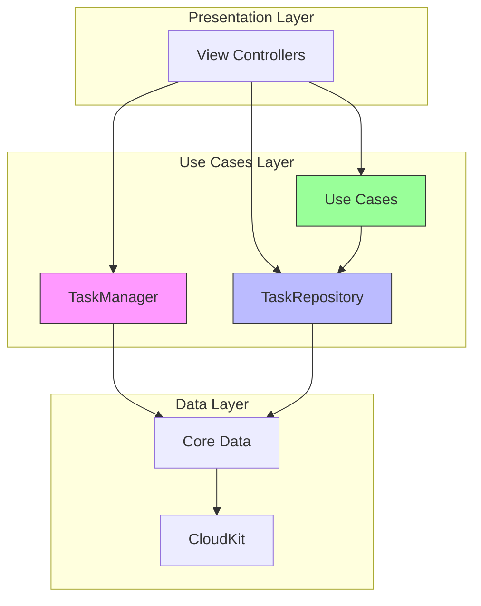
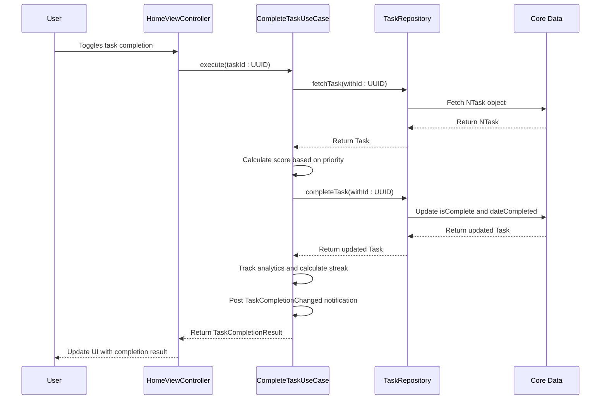
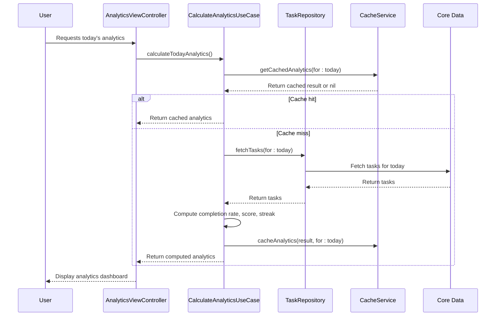
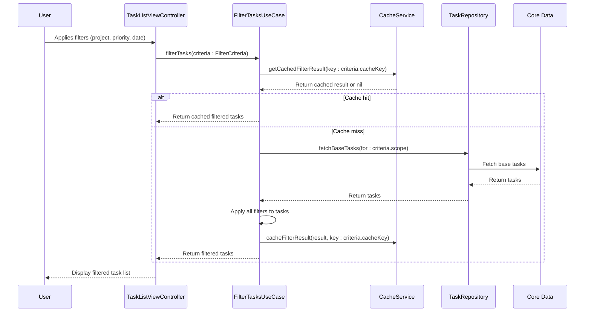

<docs>
# Use Cases Layer

<cite>
**Referenced Files in This Document**   
- [TaskManager.swift](file://To%20Do%20List/ViewControllers/TaskManager.swift) - *Legacy implementation*
- [NTask+CoreDataProperties.swift](file://To%20Do%20List/NTask+CoreDataProperties.swift) - *Data model*
- [NTask+CoreDataClass.swift](file://To%20Do%20List/NTask+CoreDataClass.swift) - *Data model*
- [HomeViewController.swift](file://To%20Do%20List/ViewControllers/HomeViewController.swift) - *Presentation layer*
- [AddTaskViewController.swift](file://To%20Do%20List/ViewControllers/AddTaskViewController.swift) - *Presentation layer*
- [CoreDataTaskRepository.swift](file://To%20Do%20List/Repositories/CoreDataTaskRepository.swift) - *Data layer*
- [TaskRepository.swift](file://To%20Do%20List/Repositories/TaskRepository.swift) - *Data layer*
- [TaskData.swift](file://To%20Do%20List/Models/TaskData.swift) - *Presentation model*
- [README.md](file://README.md) - *Architecture overview*
- [clean.md](file://clean.md) - *Refactoring notes*
- [CompleteTaskUseCase.swift](file://To%20Do%20List/UseCases/Task/CompleteTaskUseCase.swift) - *Added in commit 2f1b824*
- [CalculateAnalyticsUseCase.swift](file://To%20Do%20List/UseCases/Analytics/CalculateAnalyticsUseCase.swift) - *Added in commit 2f1b824*
- [FilterTasksUseCase.swift](file://To%20Do%20List/UseCases/Task/FilterTasksUseCase.swift) - *Added in commit 2f1b824*
- [SortTasksUseCase.swift](file://To%20Do%20List/UseCases/Task/SortTasksUseCase.swift) - *Added in commit 2f1b824*
- [SearchTasksUseCase.swift](file://To%20Do%20List/UseCases/Task/SearchTasksUseCase.swift) - *Added in commit 2f1b824*
</cite>

## Update Summary
**Changes Made**   
- Updated architecture overview to reflect new use cases layer
- Added new sections for business logic workflows including task completion and analytics
- Updated implementation details to include modern use case implementations
- Enhanced integration patterns with new dependency injection examples
- Added practical examples for new use cases
- Updated migration roadmap to reflect current architectural state
- Added new diagrams for use case interactions

## Table of Contents
1. [Introduction](#introduction)
2. [Architecture Overview](#architecture-overview)
3. [Core Responsibilities](#core-responsibilities)
4. [Business Logic Workflows](#business-logic-workflows)
5. [Implementation Details](#implementation-details)
6. [Integration Patterns](#integration-patterns)
7. [Practical Examples](#practical-examples)
8. [Troubleshooting Guidance](#troubleshooting-guidance)
9. [Migration Roadmap](#migration-roadmap)

## Introduction

The Use Cases Layer in the Clean Architecture implementation serves as the central hub for business logic and workflows in the Tasker application. This layer orchestrates the flow of data between the Presentation Layer and the Data Layer, implementing application-specific business rules and validation. The primary component in this layer is the **TaskManager**, a legacy singleton class that manages all task-related operations including CRUD operations, task retrieval and filtering, state management, and business rule enforcement.

This documentation provides a comprehensive analysis of the Use Cases Layer, covering its purpose, business logic workflows, implementation details, and integration patterns with other layers. It also includes practical examples and troubleshooting guidance to assist developers in understanding and working with this critical component of the application architecture.

**Section sources**
- [TaskManager.swift](file://To%20Do%20List/ViewControllers/TaskManager.swift#L1-L50)

## Architecture Overview

The Use Cases Layer in Tasker follows a hybrid architecture that is transitioning from a legacy monolithic design to a modern Clean Architecture pattern. The current state represents a transitional phase where legacy components coexist with modern implementations, allowing for a gradual migration to a more maintainable and testable architecture.



**Diagram sources**
- [README.md](file://README.md#L104-L223)

**Section sources**
- [README.md](file://README.md#L104-L223)

## Core Responsibilities

The Use Cases Layer, primarily implemented through the **TaskManager** class and new use case implementations, has several core responsibilities that define its role in the application architecture:

- **CRUD Operations**: Creating, reading, updating, and deleting tasks from the persistent store
- **Task Retrieval and Filtering**: Providing methods to fetch tasks based on various criteria such as project, date, completion status, and time of day (morning/evening)
- **State Management**: Maintaining a global state of tasks and ensuring data consistency across the application
- **Business Rule Enforcement**: Enforcing application-specific rules regarding task priorities, due dates, and project assignments
- **Analytics Calculation**: Computing productivity metrics, streaks, and scoring based on task completion
- **Advanced Search and Filter**: Providing sophisticated search capabilities with multiple criteria and filtering options
- **Sorting Logic**: Implementing consistent sorting across the application with multiple criteria

The **TaskManager** class is implemented as a singleton using the **sharedInstance** static property, ensuring that only one instance exists throughout the application lifecycle. This design allows any component to access task management functionality without needing to instantiate the class.

```mermaid
classDiagram
class TaskManager {
+static sharedInstance : TaskManager
-tasks : [NTask]
+context : NSManagedObjectContext
+count : Int
+getAllTasks : [NTask]
+getUpcomingTasks() : [NTask]
+getAllInboxTasks() : [NTask]
+getTasksForProjectByName(projectName : String) : [NTask]
+getTasksForInboxForDate_All(date : Date) : [NTask]
+addNewTask(name : String, taskType : TaskType, taskPriority : TaskPriority) : NTask
+toggleTaskComplete(task : NTask) : Void
+reschedule(task : NTask, to newDate : Date) : Void
+saveContext() : Void
}
class TaskType {
+morning : Int32
+evening : Int32
+upcoming : Int32
}
class TaskPriority {
+low : Int32
+medium : Int32
+high : Int32
+veryLow : Int32
}
class CompleteTaskUseCase {
+execute(taskId : UUID, completion : (Result<TaskCompletionResult, CompleteTaskError>) -> Void)
+completeTask(taskId : UUID, completion : (Result<TaskCompletionResult, CompleteTaskError>) -> Void)
+uncompleteTask(taskId : UUID, completion : (Result<TaskCompletionResult, CompleteTaskError>) -> Void)
}
class CalculateAnalyticsUseCase {
+calculateTodayAnalytics(completion : (Result<DailyAnalytics, AnalyticsError>) -> Void)
+calculateWeeklyAnalytics(completion : (Result<WeeklyAnalytics, AnalyticsError>) -> Void)
+calculateMonthlyAnalytics(completion : (Result<MonthlyAnalytics, AnalyticsError>) -> Void)
+calculateStreak(completion : (Result<StreakInfo, AnalyticsError>) -> Void)
}
class FilterTasksUseCase {
+filterTasks(criteria : FilterCriteria, completion : (Result<FilteredTasksResult, FilterError>) -> Void)
+filterByProject(projectName : String, includeCompleted : Bool, completion : (Result<[Task], FilterError>) -> Void)
+filterByPriority(priorities : [TaskPriority], scope : FilterScope, completion : (Result<[Task], FilterError>) -> Void)
}
class SortTasksUseCase {
+sortTasks(tasks : [Task], criteria : SortCriteria, completion : (Result<SortedTasksResult, SortError>) -> Void)
+sortByPriority(tasks : [Task], order : SortOrder, completion : (Result<[Task], SortError>) -> Void)
+smartSort(tasks : [Task], context : SortContext, completion : (Result<[Task], SortError>) -> Void)
}
class SearchTasksUseCase {
+searchTasks(query : SearchQuery, completion : (Result<SearchResult, SearchError>) -> Void)
+simpleSearch(text : String, scope : TaskSearchScope, completion : (Result<[Task], SearchError>) -> Void)
+getSearchSuggestions(partialText : String, maxSuggestions : Int, completion : (Result<[SearchSuggestion], SearchError>) -> Void)
}
TaskManager --> TaskType : "uses"
TaskManager --> TaskPriority : "uses"
TaskManager --> CompleteTaskUseCase : "delegates to"
TaskManager --> CalculateAnalyticsUseCase : "delegates to"
TaskManager --> FilterTasksUseCase : "delegates to"
TaskManager --> SortTasksUseCase : "delegates to"
TaskManager --> SearchTasksUseCase : "delegates to"
```



**Diagram sources**
- [TaskManager.swift](file://To%20Do%20List/ViewControllers/TaskManager.swift#L50-L100)
- [CompleteTaskUseCase.swift](file://To%20Do%20List/UseCases/Task/CompleteTaskUseCase.swift#L1-L50)
- [CalculateAnalyticsUseCase.swift](file://To%20Do%20List/UseCases/Analytics/CalculateAnalyticsUseCase.swift#L1-L50)
- [FilterTasksUseCase.swift](file://To%20Do%20List/UseCases/Task/FilterTasksUseCase.swift#L1-L50)
- [SortTasksUseCase.swift](file://To%20Do%20List/UseCases/Task/SortTasksUseCase.swift#L1-L50)
- [SearchTasksUseCase.swift](file://To%20Do%20List/UseCases/Task/SearchTasksUseCase.swift#L1-L50)

**Section sources**
- [TaskManager.swift](file://To%20Do%20List/ViewControllers/TaskManager.swift#L50-L150)
- [CompleteTaskUseCase.swift](file://To%20Do%20List/UseCases/Task/CompleteTaskUseCase.swift#L1-L50)
- [CalculateAnalyticsUseCase.swift](file://To%20Do%20List/UseCases/Analytics/CalculateAnalyticsUseCase.swift#L1-L50)
- [FilterTasksUseCase.swift](file://To%20Do%20List/UseCases/Task/FilterTasksUseCase.swift#L1-L50)
- [SortTasksUseCase.swift](file://To%20Do%20List/UseCases/Task/SortTasksUseCase.swift#L1-L50)
- [SearchTasksUseCase.swift](file://To%20Do%20List/UseCases/Task/SearchTasksUseCase.swift#L1-L50)

## Business Logic Workflows

The Use Cases Layer implements several key business logic workflows that define the core functionality of the Tasker application. These workflows are orchestrated through the **TaskManager** class and its methods, which handle the complete lifecycle of tasks from creation to completion.

### Task Completion Workflow
The task completion workflow handles the logic for marking a task as complete or incomplete. When a task is completed, the **dateCompleted** property is set to the current date; when marked incomplete, this property is cleared. The new **CompleteTaskUseCase** encapsulates this workflow with additional business logic.



**Diagram sources**
- [CompleteTaskUseCase.swift](file://To%20Do%20List/UseCases/Task/CompleteTaskUseCase.swift#L1-L221)
- [TaskRepository.swift](file://To%20Do%20List/Repositories/TaskRepository.swift#L1-L118)

**Section sources**
- [CompleteTaskUseCase.swift](file://To%20Do%20List/UseCases/Task/CompleteTaskUseCase.swift#L1-L221)
- [TaskRepository.swift](file://To%20Do%20List/Repositories/TaskRepository.swift#L1-L118)

### Analytics Calculation Workflow
The analytics calculation workflow computes productivity metrics, streaks, and scoring based on task completion patterns. The **CalculateAnalyticsUseCase** handles this workflow with caching and performance optimization.



**Diagram sources**
- [CalculateAnalyticsUseCase.swift](file://To%20Do%20List/UseCases/Analytics/CalculateAnalyticsUseCase.swift#L1-L585)
- [TaskRepository.swift](file://To%20Do%20List/Repositories/TaskRepository.swift#L1-L118)

**Section sources**
- [CalculateAnalyticsUseCase.swift](file://To%20Do%20List/UseCases/Analytics/CalculateAnalyticsUseCase.swift#L1-L585)
- [TaskRepository.swift](file://To%20Do%20List/Repositories/TaskRepository.swift#L1-L118)

### Task Filtering Workflow
The task filtering workflow enables users to filter tasks based on multiple criteria such as project, priority, category, and date range. The **FilterTasksUseCase** provides a comprehensive filtering interface with caching.



**Diagram sources**
- [FilterTasksUseCase.swift](file://To%20Do%20List/UseCases/Task/FilterTasksUseCase.swift#L1-L530)
- [TaskRepository.swift](file://To%20Do%20List/Repositories/TaskRepository.swift#L1-L118)

**Section sources**
- [FilterTasksUseCase.swift](file://To%20Do%20List/UseCases/Task/FilterTasksUseCase.swift#L1-L530)
- [TaskRepository.swift](file://To%20Do%20List/Repositories/TaskRepository.swift#L1-L118)

## Implementation Details

The implementation of the Use Cases Layer in Tasker reflects a transitional state between legacy and modern architectural patterns. The **TaskManager** class represents the legacy implementation, while the **TaskRepository** pattern and dedicated use cases represent the modern approach being adopted.

### Legacy Implementation (TaskManager)
The **TaskManager** class is tightly coupled with Core Data through direct access to the **NTask** entity. It maintains a reference to the **NSManagedObjectContext** obtained from the **AppDelegate**, which is used for all Core Data operations. This tight coupling is evident in methods like **addNewTask**, which uses **NSEntityDescription.insertNewObject(forEntityName:into:)** to create new managed objects.


**Diagram sources**
- [NTask+CoreDataProperties.swift](file://To%20Do%20List/NTask+CoreDataProperties.swift#L10-L30)
- [NTask+CoreDataClass.swift](file://To%20Do%20List/NTask+CoreDataClass.swift#L1-L10)

**Section sources**
- [NTask+CoreDataProperties.swift](file://To%20Do%20List/NTask+CoreDataProperties.swift#L1-L50)
- [NTask+CoreDataClass.swift](file://To%20Do%20List/NTask+CoreDataClass.swift#L1-L17)

### Modern Implementation (Use Cases)
The modern implementation introduces dedicated use case classes that encapsulate specific business workflows. These use cases follow the Single Responsibility Principle and are designed to be testable and reusable.

#### CompleteTaskUseCase
The **CompleteTaskUseCase** handles the complete workflow for task completion, including score calculation, analytics tracking, and notifications.

```swift
public final class CompleteTaskUseCase {
    private let taskRepository: TaskRepositoryProtocol
    private let scoringService: TaskScoringServiceProtocol
    private let analyticsService: AnalyticsServiceProtocol?
    
    public func execute(taskId: UUID, completion: @escaping (Result<TaskCompletionResult, CompleteTaskError>) -> Void) {
        // 1. Fetch the current task
        // 2. Toggle completion status
        // 3. Calculate score earned
        // 4. Save updated task
        // 5. Track analytics
        // 6. Calculate streak
        // 7. Post completion notification
        // 8. Return completion result
    }
}
```

**Section sources**
- [CompleteTaskUseCase.swift](file://To%20Do%20