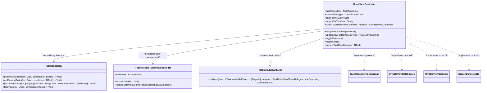
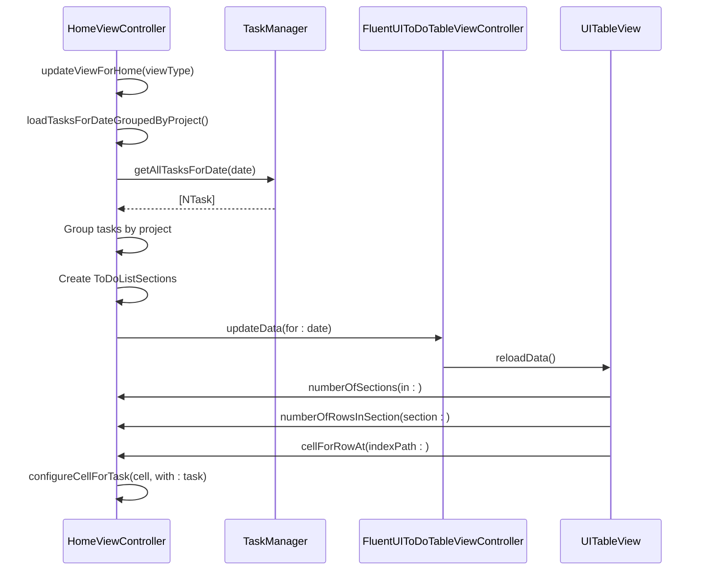
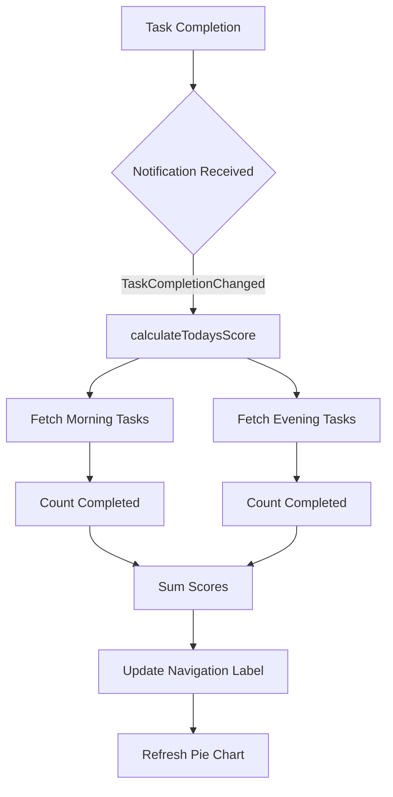
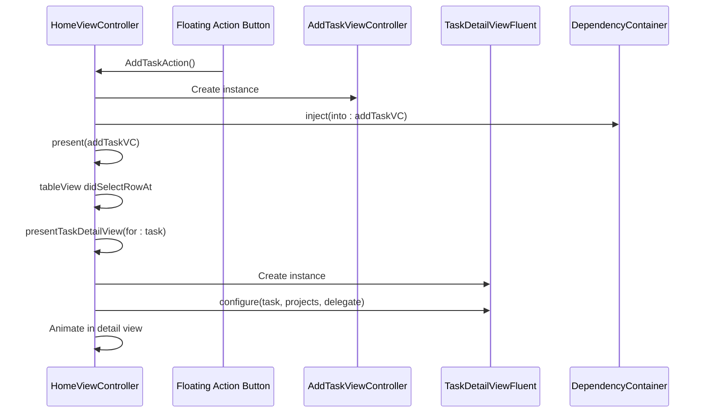
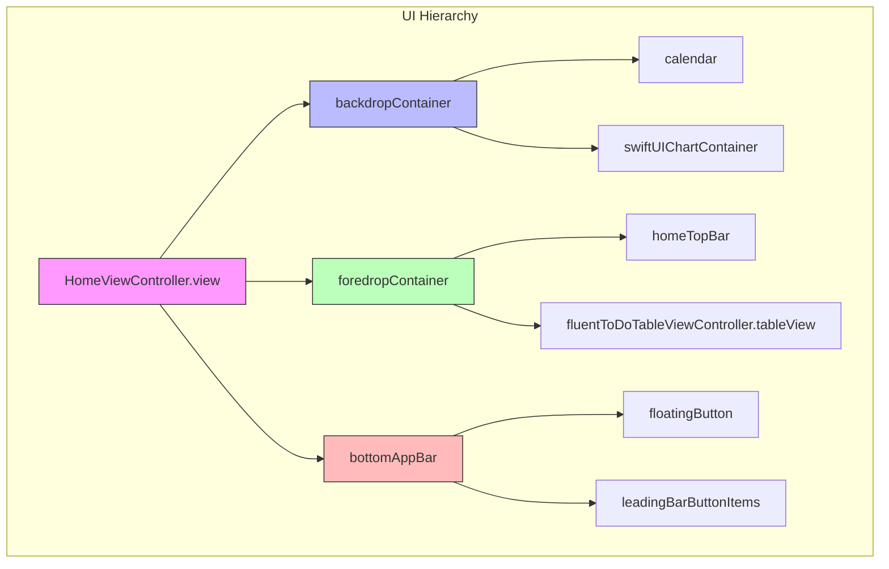
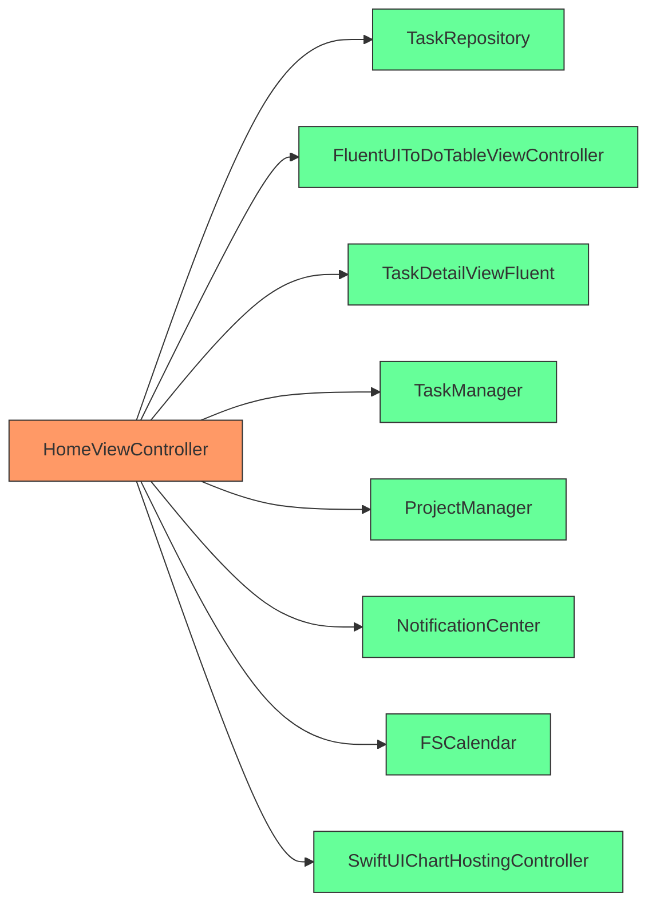

# Home View Controller

<cite>
**Referenced Files in This Document**   
- [HomeViewController.swift](file://To%20Do%20List/ViewControllers/HomeViewController.swift)
- [HomeViewController+TableView.swift](file://To%20Do%20List/ViewControllers/HomeViewController+TableView.swift)
- [HomeViewController+UISetup.swift](file://To%20Do%20List/ViewControllers/HomeViewController+UISetup.swift)
- [HomeViewController+ProjectFiltering.swift](file://To%20Do%20List/ViewControllers/HomeViewController+ProjectFiltering.swift)
- [HomeViewController+Animations.swift](file://To%20Do%20List/ViewControllers/HomeViewController+Animations.swift)
- [HomeViewController+TaskSelection.swift](file://To%20Do%20List/ViewControllers/HomeViewController+TaskSelection.swift)
- [HomeViewController+TaskDetailFluent.swift](file://To%20Do%20List/ViewControllers/HomeViewController+TaskDetailFluent.swift)
- [HomeViewController+DateTimePicker.swift](file://To%20Do%20List/ViewControllers/HomeViewController+DateTimePicker.swift)
</cite>

## Table of Contents
1. [Introduction](#introduction)
2. [Project Structure](#project-structure)
3. [Core Components](#core-components)
4. [Architecture Overview](#architecture-overview)
5. [Detailed Component Analysis](#detailed-component-analysis)
6. [Dependency Analysis](#dependency-analysis)
7. [Performance Considerations](#performance-considerations)
8. [Troubleshooting Guide](#troubleshooting-guide)
9. [Conclusion](#conclusion)

## Introduction
The HomeViewController serves as the central hub of the Tasker application, orchestrating the display of categorized tasks, daily completion metrics, and primary navigation. This document provides a comprehensive analysis of its architecture, functionality, and integration points within the application ecosystem. The controller manages task visualization through a FluentUI-based table view, presents dynamic performance metrics via SwiftUI-powered charts, and facilitates user interaction through material design components. It implements a sophisticated state management system that maintains consistency across app launches while supporting real-time updates through notification subscriptions. The component demonstrates modern iOS development practices including dependency injection, protocol-oriented programming, and responsive UI design.

## Project Structure
The HomeViewController is implemented as a primary view controller within the Tasker application's ViewControllers directory. Its functionality is distributed across multiple Swift files using extensions to maintain separation of concerns. The core logic resides in HomeViewController.swift, while specific responsibilities are delegated to specialized extensions: UI setup in HomeViewController+UISetup.swift, table view management in HomeViewController+TableView.swift, project filtering in HomeViewController+ProjectFiltering.swift, and animation handling in HomeViewController+Animations.swift. This modular approach enables maintainable code organization while keeping related functionality co-located. The controller integrates with various supporting components including TaskDetailViewFluent for task editing, FluentUIToDoTableViewController for data presentation, and TaskRepository for data access.

```mermaid
graph TB
subgraph "HomeViewController Components"
A[HomeViewController.swift] --> B[HomeViewController+UISetup.swift]
A --> C[HomeViewController+TableView.swift]
A --> D[HomeViewController+ProjectFiltering.swift]
A --> E[HomeViewController+Animations.swift]
A --> F[HomeViewController+TaskSelection.swift]
A --> G[HomeViewController+TaskDetailFluent.swift]
A --> H[HomeViewController+DateTimePicker.swift]
end
A --> I[TaskRepository]
A --> J[FluentUIToDoTableViewController]
A --> K[TaskDetailViewFluent]
A --> L[TaskManager]
A --> M[ProjectManager]
```

**Diagram sources**
- [HomeViewController.swift](file://To%20Do%20List/ViewControllers/HomeViewController.swift)
- [HomeViewController+UISetup.swift](file://To%20Do%20List/ViewControllers/HomeViewController+UISetup.swift)
- [HomeViewController+TableView.swift](file://To%20Do%20List/ViewControllers/HomeViewController+TableView.swift)

**Section sources**
- [HomeViewController.swift](file://To%20Do%20List/ViewControllers/HomeViewController.swift)
- [HomeViewController+UISetup.swift](file://To%20Do%20List/ViewControllers/HomeViewController+UISetup.swift)

## Core Components
The HomeViewController implements several core components that work together to deliver the application's primary functionality. The FluentUI-based table view serves as the main content area, displaying tasks grouped by project and categorized into morning, evening, and upcoming sections. A sophisticated backdrop system houses auxiliary components including a calendar and charts, which are revealed through animated transitions. The controller integrates with TaskRepository to fetch and manage task data, implementing NSFetchedResultsController-like behavior through manual data observation and refresh mechanisms. The daily completion score is calculated dynamically based on task completion status and displayed prominently in the navigation bar. Material design buttons provide primary navigation, with the bottom app bar containing action buttons for settings, calendar, charts, chat, and task creation.

**Section sources**
- [HomeViewController.swift](file://To%20Do%20List/ViewControllers/HomeViewController.swift#L1-L500)
- [HomeViewController+TableView.swift](file://To%20Do%20List/ViewControllers/HomeViewController+TableView.swift#L1-L100)
- [HomeViewController+UISetup.swift](file://To%20Do%20List/ViewControllers/HomeViewController+UISetup.swift#L1-L150)

## Architecture Overview
The HomeViewController follows a view controller-based architecture with responsibilities distributed across multiple extensions. It acts as a coordinator between the UI layer and data layer, implementing the TaskRepositoryDependent protocol to receive injected dependencies. The controller maintains state through various properties including currentViewType, dateForTheView, and selectedProjectNamesForFilter, which determine the displayed content. It subscribes to notifications for real-time updates, including theme changes, application lifecycle events, and task completion changes. The UI is structured with a layered approach: a backdrop container for secondary components, a foredrop container for primary content, and a bottom app bar for navigation. The controller delegates table view management to FluentUIToDoTableViewController while maintaining control over data flow and user interactions.

**Diagram sources**
- [HomeViewController.swift](file://To%20Do%20List/ViewControllers/HomeViewController.swift#L1-L100)
- [HomeViewController+ProjectFiltering.swift](file://To%20Do%20List/ViewControllers/HomeViewController+ProjectFiltering.swift#L1-L50)

## Detailed Component Analysis

### Task Display and Categorization
The HomeViewController manages the display of categorized tasks through a sophisticated data grouping system. Tasks are organized into sections based on project and completion status, with special handling for overdue tasks which are displayed at the top. The controller implements the UITableViewDataSource protocol to provide data to the FluentUI table view, with numberOfRowsInSection and cellForRowAt methods that adapt to the current view type. For project-grouped views, tasks are grouped by project with separate sections for active and completed tasks. The controller maintains a ToDoListSections array that serves as the data source for the table view, which is rebuilt whenever the view type or date changes. Task cells are configured with appropriate styling based on completion status, including strikethrough text and checkmark accessories for completed tasks.

**Diagram sources**
- [HomeViewController+ProjectFiltering.swift](file://To%20Do%20List/ViewControllers/HomeViewController+ProjectFiltering.swift#L1-L200)
- [HomeViewController+TableView.swift](file://To%20Do%20List/ViewControllers/HomeViewController+TableView.swift#L1-L200)

**Section sources**
- [HomeViewController+ProjectFiltering.swift](file://To%20Do%20List/ViewControllers/HomeViewController+ProjectFiltering.swift#L1-L365)
- [HomeViewController+TableView.swift](file://To%20Do%20List/ViewControllers/HomeViewController+TableView.swift#L1-L451)

### Daily Completion Score Management
The HomeViewController calculates and displays the daily completion score through a combination of synchronous and asynchronous methods. The calculateTodaysScore() method provides immediate feedback after task completion by calculating the score based on tasks completed on the current dateForTheView. An asynchronous version of this method uses the TaskRepository to fetch morning and evening tasks concurrently, combining the results to provide the total completion count. The score is displayed in the navigation bar through a custom navigationTitleLabel and is updated whenever tasks are completed or the view is refreshed. The controller subscribes to the TaskCompletionChanged notification to ensure the score is updated in real-time when tasks are completed from other parts of the application.

**Diagram sources**
- [HomeViewController.swift](file://To%20Do%20List/ViewControllers/HomeViewController.swift#L1-L200)
- [HomeViewController+ProjectFiltering.swift](file://To%20Do%20List/ViewControllers/HomeViewController+ProjectFiltering.swift#L1-L100)

**Section sources**
- [HomeViewController+ProjectFiltering.swift](file://To%20Do%20List/ViewControllers/HomeViewController+ProjectFiltering.swift#L1-L150)

### Navigation and User Interaction
The HomeViewController provides primary navigation through material design buttons in the bottom app bar and gesture-based interactions. The bottom app bar contains buttons for settings, calendar, charts, chat, and task creation, each triggering specific actions through selector methods. The controller implements a sophisticated animation system for revealing and hiding the calendar and charts views through vertical translations of the foredrop container. Task completion is handled through swipe actions on table view cells, with different actions available for completed and incomplete tasks. The controller presents the AddTaskViewController when the floating action button is tapped, using dependency injection to provide the necessary dependencies. It also handles task selection by presenting the TaskDetailViewFluent modal for detailed task editing.

**Diagram sources**
- [HomeViewController.swift](file://To%20Do%20List/ViewControllers/HomeViewController.swift#L1-L300)
- [HomeViewController+TaskSelection.swift](file://To%20Do%20List/ViewControllers/HomeViewController+TaskSelection.swift#L1-L50)

**Section sources**
- [HomeViewController.swift](file://To%20Do%20List/ViewControllers/HomeViewController.swift#L1-L500)
- [HomeViewController+TaskSelection.swift](file://To%20Do%20List/ViewControllers/HomeViewController+TaskSelection.swift#L1-L122)

### Layout Structure and UI Components
The HomeViewController implements a complex layout structure with multiple container views and UI components. The top bar contains a calendar icon and date display, implemented through custom UILabels for day, weekday, and month. Segmented controls for task categories are managed through the fluentToDoTableViewController, which organizes tasks into appropriate sections. The table view for task listing uses the FluentUI framework with custom cell configuration for task display. The controller sets up a backdrop container for secondary components and a foredrop container for primary content, with the foredrop having rounded corners and shadow effects for depth. The bottom app bar provides persistent navigation with material design buttons, including a floating action button for task creation. The UI adapts to dark mode through dynamic asset resolution and themed color properties.

**Diagram sources**
- [HomeViewController+UISetup.swift](file://To%20Do%20List/ViewControllers/HomeViewController+UISetup.swift#L1-L200)
- [HomeViewController.swift](file://To%20Do%20List/ViewControllers/HomeViewController.swift#L1-L200)

**Section sources**
- [HomeViewController+UISetup.swift](file://To%20Do%20List/ViewControllers/HomeViewController+UISetup.swift#L1-L454)

## Dependency Analysis
The HomeViewController has several key dependencies that enable its functionality. It depends on TaskRepository for data access, receiving it through dependency injection via the TaskRepositoryDependent protocol. The controller uses FluentUIToDoTableViewController for table view management, creating and configuring this component during setup. It interacts with TaskDetailViewFluent for task editing, presenting it as a modal view. The controller relies on TaskManager and ProjectManager for legacy data access and initialization. It uses NotificationCenter to subscribe to various notifications including theme changes, application lifecycle events, and task completion changes. The controller also depends on UIKit components such as FSCalendar for calendar functionality and DGCharts for chart display, though the primary chart implementation now uses SwiftUI.

**Diagram sources**
- [HomeViewController.swift](file://To%20Do%20List/ViewControllers/HomeViewController.swift#L1-L100)
- [HomeViewController+UISetup.swift](file://To%20Do%20List/ViewControllers/HomeViewController+UISetup.swift#L1-L100)

**Section sources**
- [HomeViewController.swift](file://To%20Do%20List/ViewControllers/HomeViewController.swift#L1-L500)

## Performance Considerations
The HomeViewController implements several performance optimizations to ensure smooth scrolling and responsive interactions. The table view uses cell reuse identifiers to minimize memory allocation during scrolling. Animations are applied selectively with the shouldAnimateCells flag to prevent excessive animations during initial load or bulk updates. The controller implements efficient data reloading through targeted table view updates rather than full reloads when possible. The FluentUI table view is configured with appropriate separator styles and background colors to optimize rendering performance. The controller uses dispatch groups to coordinate asynchronous data fetching, ensuring that UI updates occur only after all necessary data is available. For large task lists, the controller could benefit from additional optimizations such as pagination or incremental loading, though the current implementation appears to handle typical task volumes effectively.

**Section sources**
- [HomeViewController+TableView.swift](file://To%20Do%20List/ViewControllers/HomeViewController+TableView.swift#L1-L100)
- [HomeViewController+Animations.swift](file://To%20Do%20List/ViewControllers/HomeViewController+Animations.swift#L1-L50)

## Troubleshooting Guide
Common issues with the HomeViewController typically relate to data display inconsistencies, animation glitches, or notification handling problems. If tasks are not appearing correctly, verify that the TaskRepository is properly injected and that the loadTasksForDateGroupedByProject method is being called with the correct date. For animation issues with the calendar or charts, check that the revealDistance and chartRevealDistance properties are being calculated correctly based on the current view layout. If the daily completion score is not updating, ensure that the TaskCompletionChanged notification is being posted correctly from task completion actions. For dark mode issues, verify that the themeChanged notification is being observed and that all UI elements are using dynamic colors. When debugging table view issues, check that the FluentUIToDoTableViewController is properly initialized and that the data source methods are returning correct values for section and row counts.

**Section sources**
- [HomeViewController.swift](file://To%20Do%20List/ViewControllers/HomeViewController.swift#L1-L100)
- [HomeViewController+ProjectFiltering.swift](file://To%20Do%20List/ViewControllers/HomeViewController+ProjectFiltering.swift#L1-L50)
- [HomeViewController+Animations.swift](file://To%20Do%20List/ViewControllers/HomeViewController+Animations.swift#L1-L50)

## Conclusion
The HomeViewController serves as the central coordination point for the Tasker application, integrating multiple components to provide a cohesive user experience. Its modular design with functionality distributed across extensions promotes maintainability and separation of concerns. The controller effectively manages task display, user interaction, and navigation while maintaining performance and responsiveness. The integration with TaskRepository enables clean separation between UI and data layers, while the use of dependency injection facilitates testing and flexibility. The implementation demonstrates modern iOS development practices including protocol-oriented programming, responsive UI design, and efficient resource management. Future enhancements could include additional performance optimizations for very large task lists, improved accessibility features, and enhanced analytics integration to better understand user behavior patterns.