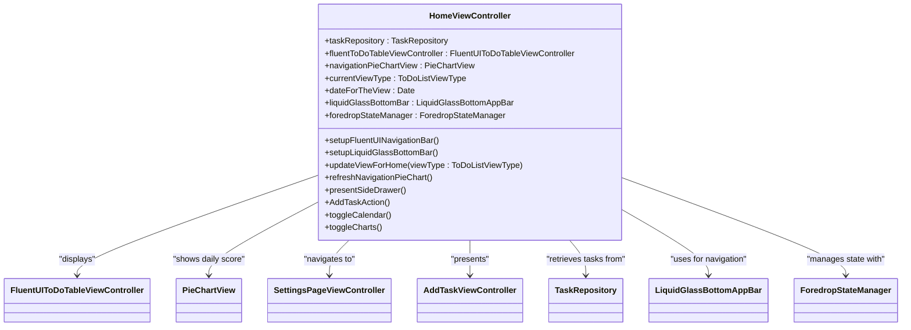
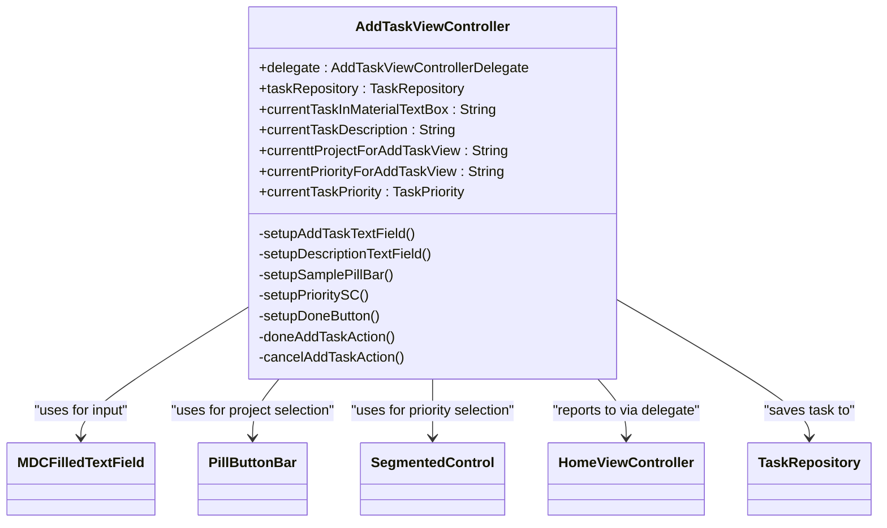
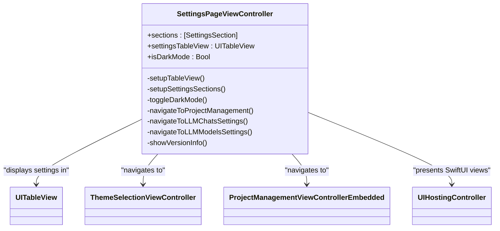
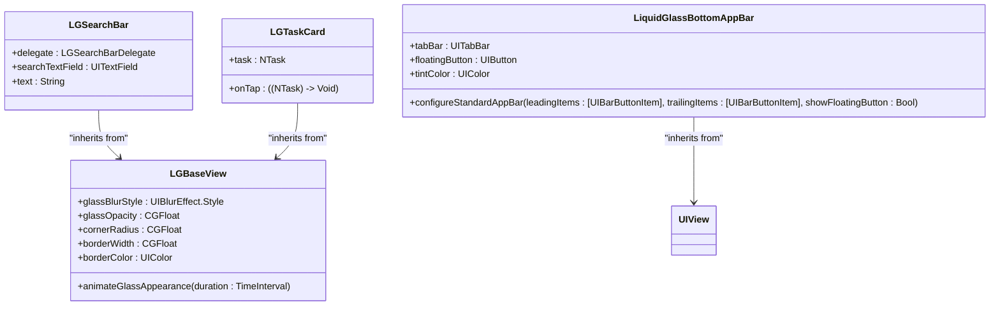

<docs>
# User Interface Architecture

<cite>
**Referenced Files in This Document**   
- [HomeViewController.swift](file://To%20Do%20List/ViewControllers/HomeViewController.swift) - *Updated with Liquid Glass components in commit 80ba1a21*
- [HomeViewController+UISetup.swift](file://To%20Do%20List/ViewControllers/HomeViewController+UISetup.swift) - *Updated with foredrop setup in commit 80ba1a21*
- [AddTaskViewController.swift](file://To%20Do%20List/ViewControllers/AddTaskViewController.swift)
- [SettingsPageViewController.swift](file://To%20Do%20List/ViewControllers/SettingsPageViewController.swift)
- [DependencyContainer.swift](file://To%20Do%20List/Managers/DependencyContainer.swift)
- [TaskRepository.swift](file://To%20Do%20List/Repositories/TaskRepository.swift)
- [LGBaseView.swift](file://To%20Do%20List/View/LiquidGlass/LGBaseView.swift) - *Added in commit 1fb735d7*
- [LGSearchBar.swift](file://To%20Do%20List/View/LiquidGlass/LGSearchBar.swift) - *Added in commit 1fb735d7*
- [LGTaskCard.swift](file://To%20Do%20List/View/LiquidGlass/LGTaskCard.swift) - *Added in commit 1fb735d7*
- [HomeForedropView.swift](file://To%20Do%20List/View/HomeForedropView.swift) - *Updated with Liquid Glass integration in commit 80ba1a21*
- [Assets.xcassets/3D_icons](file://To%20Do%20List/Assets.xcassets/3D_icons) - *Added in commit 500d083b*
</cite>

## Update Summary
**Changes Made**   
- Updated HomeViewController documentation to reflect new Liquid Glass UI components and state management
- Added documentation for new 3D icons in the app bar
- Added new section for Liquid Glass UI components and their implementation
- Updated dependency injection and data flow section to include new component relationships
- Removed outdated references to legacy table view implementation
- Added new architectural diagram for Liquid Glass components

## Table of Contents
1. [Introduction](#introduction)
2. [Core View Controllers](#core-view-controllers)
3. [HomeViewController: Central Hub](#homeviewcontroller-central-hub)
4. [AddTaskViewController: Task Creation](#addtaskviewcontroller-task-creation)
5. [SettingsPageViewController: Preferences Management](#settingspageviewcontroller-preferences-management)
6. [UI Components and Assets](#ui-components-and-assets)
7. [Liquid Glass UI System](#liquid-glass-ui-system)
8. [Dependency Injection and Data Flow](#dependency-injection-and-data-flow)
9. [Accessibility and Responsive Design](#accessibility-and-responsive-design)
10. [State Preservation and Lifecycle](#state-preservation-and-lifecycle)
11. [Conclusion](#conclusion)

## Introduction
The Tasker app features a modern, intuitive user interface built around three primary view controllers: HomeViewController, AddTaskViewController, and SettingsPageViewController. These components work together to provide a seamless task management experience with a focus on visual clarity, user engagement, and efficient workflow. The interface leverages Material Design principles through the FluentUI framework and incorporates custom UI elements from the asset catalog. Recent updates have introduced a new Liquid Glass UI system with state management for enhanced visual effects and user experience. This documentation details the structure, behavior, and integration of these core components, highlighting their roles in the overall application architecture.

## Core View Controllers
The Tasker app's user interface is organized around three main view controllers that handle distinct aspects of the application's functionality. These controllers follow a clear separation of concerns while maintaining consistent design language and behavior patterns across the app.

**Section sources**
- [HomeViewController.swift](file://To%20Do%20List/ViewControllers/HomeViewController.swift#L1-L50) - *Updated in commit 80ba1a21*
- [AddTaskViewController.swift](file://To%20Do%20List/ViewControllers/AddTaskViewController.swift#L1-L50)
- [SettingsPageViewController.swift](file://To%20Do%20List/ViewControllers/SettingsPageViewController.swift#L1-L50)

## HomeViewController: Central Hub

HomeViewController serves as the central hub of the Tasker application, providing users with an overview of their tasks, daily progress, and navigation to other app features. The interface is designed to be both informative and actionable, presenting categorized tasks in a clean, organized manner.

The view controller displays tasks grouped by project or time category, with visual indicators for task priority and completion status. A prominent daily score is shown in the navigation bar, providing immediate feedback on productivity. The interface includes a top bar with date display and navigation controls, categorized task lists with project headers, visual indicators for task priority (high, medium, low), and a floating action button for adding new tasks.

Recent updates have introduced a Liquid Glass bottom app bar with iOS 26-style transparent material design, replacing the previous Material Design components. This new app bar features 3D icons for navigation and integrates with the Liquid Glass UI system for enhanced visual effects. The controller now uses a state machine to manage the foredrop container, enabling smooth transitions between calendar, charts, and task list views.

**Diagram sources**
- [HomeViewController.swift](file://To%20Do%20List/ViewControllers/HomeViewController.swift#L50-L200) - *Updated in commit 80ba1a21*

**Section sources**
- [HomeViewController.swift](file://To%20Do%20List/ViewControllers/HomeViewController.swift#L1-L300) - *Updated in commit 80ba1a21*
- [HomeViewController+UISetup.swift](file://To%20Do%20List/ViewControllers/HomeViewController+UISetup.swift#L1-L417) - *Updated in commit 80ba1a21*
- [HomeForedropView.swift](file://To%20Do%20List/View/HomeForedropView.swift#L1-L59) - *Updated in commit 80ba1a21*

## AddTaskViewController: Task Creation

AddTaskViewController provides a form-based interface for creating new tasks, allowing users to specify all relevant task details before saving. The interface is designed to be simple yet comprehensive, guiding users through the task creation process with clear visual hierarchy and intuitive controls.

The form includes the following fields:
- Task name (required, primary input field)
- Task details/description (optional, multi-line text area)
- Project assignment (selected via pill buttons)
- Priority level (selected via segmented control)
- Time category (morning, evening, or upcoming)

The controller uses Material Design text fields from the MDC framework, providing a consistent look and feel with other Material Design elements in the app. Pill buttons are used for project selection, allowing users to quickly choose from existing projects or create new ones. A segmented control enables selection of task priority, with visual feedback for the selected option.

The interface is responsive to user input, enabling the "Done" button only when a task name has been entered. The controller handles form submission by creating a new task object and communicating it back to the presenting view controller through a delegate pattern.

**Diagram sources**
- [AddTaskViewController.swift](file://To%20Do%20List/ViewControllers/AddTaskViewController.swift#L50-L200)

**Section sources**
- [AddTaskViewController.swift](file://To%20Do%20List/ViewControllers/AddTaskViewController.swift#L1-L300)

## SettingsPageViewController: Preferences Management

SettingsPageViewController manages the app's preferences and configuration options, providing users with control over key application settings. The interface is organized into logical sections, making it easy for users to find and modify settings.

The controller presents settings in a table view with the following main sections:
- Projects: Access to project management features
- Appearance: Controls for dark mode and theme selection
- LLM Settings: Configuration for AI/LLM features
- About: App version and information

A key feature is the dark mode toggle, which allows users to switch between light and dark themes. The controller also provides access to iCloud sync settings, though this functionality is not fully implemented in the current codebase. The interface uses standard iOS table view cells with appropriate icons and disclosure indicators to guide user interaction.

When users modify settings, the controller applies the changes immediately and provides visual feedback through alerts or interface updates. For example, toggling dark mode immediately changes the app's appearance and shows a confirmation message.

**Diagram sources**
- [SettingsPageViewController.swift](file://To%20Do%20List/ViewControllers/SettingsPageViewController.swift#L50-L200)

**Section sources**
- [SettingsPageViewController.swift](file://To%20Do%20List/ViewControllers/SettingsPageViewController.swift#L1-L300)

## UI Components and Assets

The Tasker app utilizes a rich set of custom UI elements and assets to create a distinctive visual identity. These components are organized within the asset catalog and integrated throughout the application's interface.

### Top Bar with Calendar Icon
The top bar is a custom UI element that appears across multiple screens, providing consistent navigation and date display. It includes:
- A calendar icon (cal_Icon.imageset) for date navigation
- Date display showing day, weekday, and month
- Separators and background elements for visual hierarchy

The top bar uses assets from the HomeTopBar directory, including the calendar icon and separator lines that create visual distinction between interface sections.

### 3D Icons
Recent updates have introduced 3D icons for the bottom app bar navigation, enhancing the visual design and providing a more modern appearance. These icons are used for:
- Settings (gear2.imageset)
- Calendar (cal.imageset)
- Charts/Analytics (charts.imageset)
- Search (search.imageset)
- Chat/LLM (chat.imageset)

These 3D icons are integrated into the Liquid Glass bottom app bar, providing a cohesive visual experience across the application.

### Material Design Buttons
The app incorporates Material Design principles through the use of MDC (Material Design Components) buttons and controls. Key elements include:
- Floating action buttons (material_add.imageset, material_add_White.imageset)
- Navigation buttons (material_home.imageset, material_menu.imageset, material_search.imageset)
- Status indicators (material_done_White.imageset, material_close.imageset)
- Time category indicators (material_day_White.imageset, material_evening_White.imageset)

These assets are organized in the Material_Icons directory and are used consistently across the application to maintain visual coherence.

### Custom UI Elements
Additional custom UI elements include:
- Pill buttons for project selection and filtering
- Backdrop and foredrop containers for visual layering
- Custom table view cells with dismissal controls
- Progress indicators and score displays

The interface leverages the FluentUI framework for many of these components, ensuring a modern, responsive design that adheres to iOS human interface guidelines.

**Section sources**
- [HomeViewController.swift](file://To%20Do%20List/ViewControllers/HomeViewController.swift#L200-L400) - *Updated in commit 80ba1a21*
- [AddTaskViewController.swift](file://To%20Do%20List/ViewControllers/AddTaskViewController.swift#L200-L400)
- [SettingsPageViewController.swift](file://To%20Do%20List/ViewControllers/SettingsPageViewController.swift#L200-L400)
- [Assets.xcassets/3D_icons](file://To%20Do%20List/Assets.xcassets/3D_icons) - *Added in commit 500d083b*

## Liquid Glass UI System

The Tasker app has been updated with a new Liquid Glass UI system that provides modern glass morphism effects with backdrop blur, gradients, and smooth animations. This system enhances the visual appeal of the application and provides a more engaging user experience.

### LGBaseView
The LGBaseView class serves as the foundation for all Liquid Glass components, providing glass morphism effects with backdrop blur and gradients. It includes configurable properties for:
- `glassBlurStyle`: Blur effect style (default: `.systemUltraThinMaterial`)
- `glassOpacity`: Overall opacity (default: `0.8`)
- `cornerRadius`: Corner radius (default: `16`)
- `borderWidth`: Border width (default: `0.5`)
- `borderColor`: Border color (default: white @ 20% opacity)

The base view supports spring-based animations for a natural feel when appearing or disappearing.

### LGSearchBar
The LGSearchBar component provides a glass morphism search bar with animations. Key features include:
- Auto-showing cancel button on focus
- Clear button when text is entered
- Animated border on focus/unfocus
- Magnifying glass icon
- White text with semi-transparent placeholder

The search bar implements the LGSearchBarDelegate protocol to handle text changes, editing events, and search button taps.

### LGTaskCard
The LGTaskCard component displays tasks with glass effects and interactive elements. Features include:
- Interactive checkbox for completion toggle
- Priority indicator with color coding
- Project label display
- Due date formatting
- Strike-through for completed tasks
- Tap animation feedback
- Automatic Core Data saving

Priority colors are coded as: Red (Highest), Orange (High), Yellow (Medium), Green (Low).

### Liquid Glass Bottom App Bar
The Liquid Glass bottom app bar replaces the previous Material Design components with a modern iOS 26-style transparent material design. It features:
- 3D icons for navigation (Settings, Calendar, Charts, Search, Chat)
- Floating action button for adding new tasks
- Glass morphism effects with backdrop blur
- Spring-based animations for interactions
- Full compatibility with Auto Layout

The bottom app bar is implemented as a custom UIView that wraps a UITabBar with transparent appearance settings, ensuring a clean, modern look without unnecessary background elements.

**Diagram sources**
- [LGBaseView.swift](file://To%20Do%20List/View/LiquidGlass/LGBaseView.swift#L1-L122) - *Added in commit 1fb735d7*
- [LGSearchBar.swift](file://To%20Do%20List/View/LiquidGlass/LGSearchBar.swift#L1-L211) - *Added in commit 1fb735d7*
- [LGTaskCard.swift](file://To%20Do%20List/View/LiquidGlass/LGTaskCard.swift#L1-L207) - *Added in commit 1fb735d7*
- [HomeViewController.swift](file://To%20Do%20List/ViewControllers/HomeViewController.swift#L1-L1507) - *Updated in commit 80ba1a21*

**Section sources**
- [LGBaseView.swift](file://To%20Do%20List/View/LiquidGlass/LGBaseView.swift#L1-L122) - *Added in commit 1fb735d7*
- [LGSearchBar.swift](file://To%20Do%20List/View/LiquidGlass/LGSearchBar.swift#L1-L211) - *Added in commit 1fb735d7*
- [LGTaskCard.swift](file://To%20Do%20List/View/LiquidGlass/LGTaskCard.swift#L1-L207) - *Added in commit 1fb735d7*
- [HomeViewController.swift](file://To%20Do%20List/ViewControllers/HomeViewController.swift#L1-L1507) - *Updated in commit 80ba1a21*
- [HomeViewController+UISetup.swift](file://To%20Do%20List/ViewControllers/HomeViewController+UISetup.swift#L1-L417) - *Updated in commit 80ba1a21*

## Dependency Injection and Data Flow

The Tasker app implements a clean dependency injection pattern to manage component relationships and data flow. This architecture promotes loose coupling, testability, and maintainability across the application.

### DependencyContainer
The DependencyContainer class serves as the central dependency management system, responsible for:
- Creating and managing shared service instances
- Inject