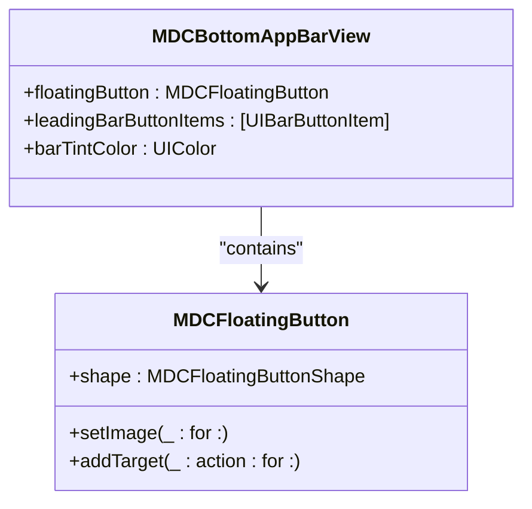
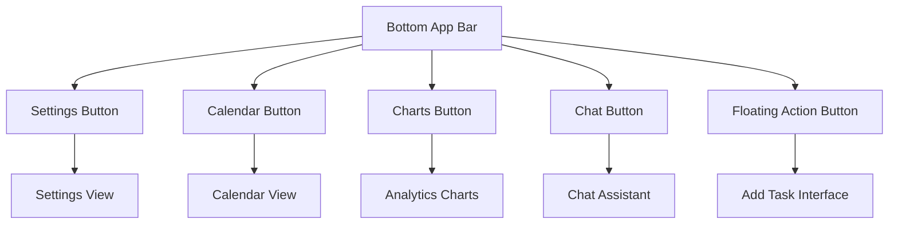
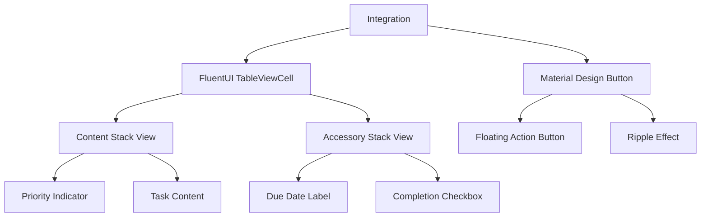

# Material Design Components

<cite>
**Referenced Files in This Document**   
- [README.md](file://README.md)
- [To Do List/Assets.xcassets/Material_Icons/material_add.imageset/Contents.json](file://To Do List/Assets.xcassets/Material_Icons/material_add.imageset/Contents.json)
- [To Do List/Assets.xcassets/Material_Icons/material_add_White.imageset/Contents.json](file://To Do List/Assets.xcassets/Material_Icons/material_add_White.imageset/Contents.json)
- [To Do List/Assets.xcassets/Material_Icons/material_done_White.imageset/Contents.json](file://To Do List/Assets.xcassets/Material_Icons/material_done_White.imageset/Contents.json)
- [To Do List/Assets.xcassets/Material_Icons/materialBackDrop/backdropFrontImage.imageset/Contents.json](file://To Do List/Assets.xcassets/Material_Icons/materialBackDrop/backdropFrontImage.imageset/Contents.json)
- [To Do List/Assets.xcassets/Material_Icons/materialBackDrop/topbarSeperator.imageset/Contents.json](file://To Do List/Assets.xcassets/Material_Icons/materialBackDrop/topbarSeperator.imageset/Contents.json)
- [To Do List/ViewControllers/HomeViewController+UISetup.swift](file://To Do List/ViewControllers/HomeViewController+UISetup.swift)
- [To Do List/ViewControllers/AddTaskViewController.swift](file://To Do List/ViewControllers/AddTaskViewController.swift)
- [To Do List/View/AddTaskForedropView.swift](file://To Do List/View/AddTaskForedropView.swift)
</cite>

## Table of Contents
1. [Introduction](#introduction)
2. [Material Design Button Styles](#material-design-button-styles)
3. [Icon Usage and Visual Feedback](#icon-usage-and-visual-feedback)
4. [Navigation and Task Actions](#navigation-and-task-actions)
5. [Modal Transitions and Backdrop Elements](#modal-transitions-and-backdrop-elements)
6. [Integration with FluentUI Layouts](#integration-with-fluentui-layouts)
7. [Accessibility and Internationalization](#accessibility-and-internationalization)

## Introduction
Tasker is an iOS productivity application that implements Material Design components from the MaterialComponents library to create a modern, engaging user interface. The application combines Material Design elements with Microsoft FluentUI components to deliver a cohesive and visually appealing experience. This document details the implementation and usage of Material Design components throughout the application, focusing on button styles, icons, visual feedback mechanisms, and integration patterns.

**Section sources**
- [README.md](file://README.md)

## Material Design Button Styles

### Floating Action Buttons
The application uses `MDCFloatingButton` for primary actions such as adding tasks and saving changes. These buttons are prominently displayed in the bottom app bar and in task creation interfaces.



**Diagram sources**
- [To Do List/ViewControllers/HomeViewController+UISetup.swift](file://To Do List/ViewControllers/HomeViewController+UISetup.swift#L153-L183)

**Section sources**
- [README.md](file://README.md#L1124-L1168)
- [To Do List/ViewControllers/HomeViewController+UISetup.swift](file://To Do List/ViewControllers/HomeViewController+UISetup.swift#L153-L183)

### Text Field Components
Material Design text fields are used throughout the application for task input and editing. The implementation includes both filled and outlined variants:

- `MDCFilledTextField`: Used for primary inputs like task titles and descriptions
- `MDCOutlinedTextField`: Used for secondary inputs and form fields

These components provide auto-validation with real-time error messaging and consistent styling across the application.

**Section sources**
- [README.md](file://README.md#L1092-L1122)

## Icon Usage and Visual Feedback

### Material Icons Implementation
The application uses a comprehensive set of Material Design icons stored in the Assets.xcassets/Material_Icons directory. Key icons include:

- **Add Icon**: `material_add` (black) and `material_add_White` (white) for add actions
- **Completion Icon**: `material_done_White` for marking tasks as complete
- **Close Icon**: `material_close` for dismissing views
- **Menu Icon**: `material_menu_White` for navigation
- **Search Icon**: `material_search_White` for search functionality

```json
{
  "images": [
    {
      "idiom": "universal",
      "filename": "twotone_add_black_36pt_1x.png",
      "scale": "1x"
    },
    {
      "idiom": "universal",
      "filename": "twotone_add_black_36pt_2x.png",
      "scale": "2x"
    },
    {
      "idiom": "universal",
      "filename": "twotone_add_black_36pt_3x.png",
      "scale": "3x"
    }
  ],
  "info": {
    "version": 1,
    "author": "xcode"
  }
}
```

**Diagram sources**
- [To Do List/Assets.xcassets/Material_Icons/material_add.imageset/Contents.json](file://To Do List/Assets.xcassets/Material_Icons/material_add.imageset/Contents.json)

### Visual Feedback Mechanisms
The application implements several visual feedback mechanisms to enhance user interaction:

#### Ripple Effects
Ripple effects are implemented using `MDCRippleTouchController` for interactive elements such as buttons and navigation controls. This provides tactile feedback when users interact with UI elements.

```swift
let calButtonRippleController = MDCRippleTouchController(view: revealCalAtHomeButton)
```

#### Elevation and Shadows
Material Design elevation and shadows are consistently applied to create a sense of depth and hierarchy in the interface. The bottom app bar and floating action button use shadows to distinguish themselves from the background content.

**Section sources**
- [README.md](file://README.md#L1124-L1168)
- [To Do List/ViewControllers/HomeViewController+UISetup.swift](file://To Do List/ViewControllers/HomeViewController+UISetup.swift#L220-L234)

## Navigation and Task Actions

### Bottom App Bar Implementation
The application uses `MDCBottomAppBarView` for primary navigation, providing access to key features:

- **Settings**: Access to application settings
- **Calendar**: Toggle calendar view
- **Charts**: Toggle analytics charts
- **Chat**: Access to chat assistant
- **Floating Action Button**: Add new tasks

The bottom app bar is implemented with proper Auto Layout constraints to ensure compatibility across different device sizes.



**Diagram sources**
- [To Do List/ViewControllers/HomeViewController+UISetup.swift](file://To Do List/ViewControllers/HomeViewController+UISetup.swift#L153-L183)

**Section sources**
- [To Do List/ViewControllers/HomeViewController+UISetup.swift](file://To Do List/ViewControllers/HomeViewController+UISetup.swift#L153-L183)

### Task Creation Interface
The task creation interface uses Material Design components to create a cohesive experience:

- `MDCFilledTextField` for task title and description input
- Priority selection with Material Design styling
- Project assignment with dynamic selection
- Date scheduling with calendar picker integration

**Section sources**
- [README.md](file://README.md#L1221-L1268)

## Modal Transitions and Backdrop Elements

### Backdrop Implementation
The application uses backdrop images from the Material_Icons set to enhance visual hierarchy and create depth in the interface. The backdrop system includes:

- **Backdrop Background**: `backdropFrontImage` for the main backdrop layer
- **Curved Backdrop**: `curvedBackdropFrontImage` for curved edge effects
- **Top Bar Separator**: `topbarSeperator` for visual separation between header and content

```json
{
  "images": [
    {
      "idiom": "universal",
      "filename": "Backdrop BG.png",
      "scale": "1x"
    },
    {
      "idiom": "universal",
      "filename": "Backdrop BG-1.png",
      "scale": "2x"
    },
    {
      "idiom": "universal",
      "filename": "Backdrop BG-2.png",
      "scale": "3x"
    }
  ],
  "info": {
    "version": 1,
    "author": "xcode"
  }
}
```

**Diagram sources**
- [To Do List/Assets.xcassets/Material_Icons/materialBackDrop/backdropFrontImage.imageset/Contents.json](file://To Do List/Assets.xcassets/Material_Icons/materialBackDrop/backdropFrontImage.imageset/Contents.json)

### Modal Presentation
Modal transitions are implemented using Material Design principles, with smooth animations and proper visual hierarchy. The application uses semi-modal presentation styles for certain interfaces, allowing users to maintain context while interacting with modal content.

**Section sources**
- [README.md](file://README.md#L1356-L1389)
- [To Do List/Assets.xcassets/Material_Icons/materialBackDrop/backdropFrontImage.imageset/Contents.json](file://To Do List/Assets.xcassets/Material_Icons/materialBackDrop/backdropFrontImage.imageset/Contents.json)

## Integration with FluentUI Layouts

### Hybrid Design System
Tasker implements a hybrid design system that combines Material Design components with Microsoft FluentUI elements to create visual harmony:

- **Material Design**: Used for buttons, text fields, and visual feedback
- **FluentUI**: Used for table cells, segmented controls, and badges

This combination creates a unique visual identity while maintaining consistency in interaction patterns.

### Component Pairing Examples
#### Table View with Material Controls
The application pairs FluentUI table cells with Material Design action buttons:



**Diagram sources**
- [README.md](file://README.md#L1124-L1168)

### Visual Harmony Guidelines
To ensure visual harmony between Material Design and FluentUI components:

1. **Color System**: Use consistent color palette across both component sets
2. **Typography**: Apply consistent font hierarchy and sizing
3. **Spacing**: Maintain consistent padding and margins
4. **Elevation**: Apply shadows consistently across component types

**Section sources**
- [README.md](file://README.md#L1356-L1389)

## Accessibility and Internationalization

### Accessibility Features
The application implements comprehensive accessibility features for Material Design components:

- **VoiceOver Support**: Comprehensive accessibility labels for all UI elements
- **Custom Accessibility Actions**: For swipe gestures and interactive elements
- **Proper Reading Order**: Ensures logical navigation through content
- **Dynamic Type Support**: Text scales appropriately with user preferences

### Internationalization Considerations
When using Material Design icons and components, the application considers internationalization requirements:

- **Icon Semantics**: Ensure icons have clear meaning across cultures
- **Text Labels**: Provide localized text alternatives for icon-only buttons
- **Layout Flexibility**: Design interfaces to accommodate text expansion in different languages
- **Right-to-Left Support**: Ensure proper layout for RTL languages

**Section sources**
- [README.md](file://README.md#L1124-L1168)