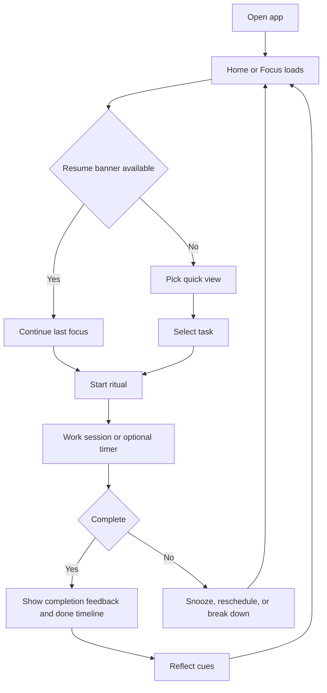
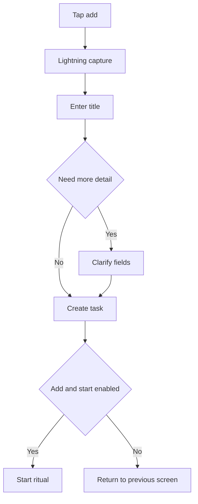
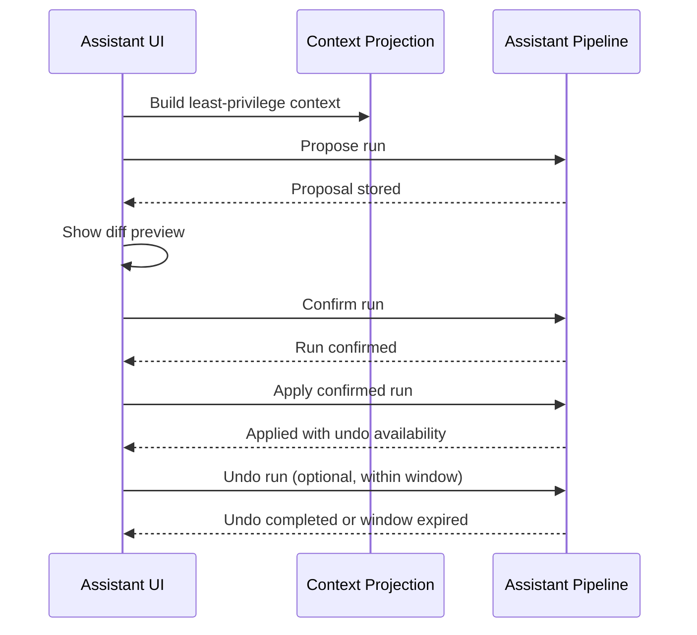

# Tasker iOS - Product Requirements Document

**Version:** 4.4  
**Last Updated:** March 22, 2026  
**Platform:** iOS 16.0+  
**Status:** Active Product Direction

## Vision And Positioning

Tasker is a todo and life-management product for people who struggle with consistency, attention switching, and execution friction. The product promise is practical and specific: help users choose what matters now, start quickly, recover after interruption, and sustain momentum without shame loops.

Tasker is not positioned as a clinical treatment product. It is a productivity system that supports ADHD-relevant day-to-day execution needs with respectful, non-judgmental UX.

## Product Promise And Mental Loop

Tasker is designed around a repeating loop:
1. Capture
2. Decide
3. Start
4. Resume
5. Reflect

Product intent by phase:
- Capture: make input fast and low-friction.
- Decide: limit the active choice set and clarify what to do now.
- Start: reduce activation cost from plan to action.
- Resume: preserve context after interruptions.
- Reflect: reinforce progress and recovery, not perfection.

## Target Users And Jobs-To-Be-Done

### Primary Segment: Adults Managing High Context Load
- Users balancing work, life admin, habits, and personal projects.
- Users who repeatedly lose momentum when contexts change.

Primary jobs-to-be-done:
- "Help me decide what to do first without overthinking."
- "Help me restart quickly after I drop off."
- "Help me keep my commitments visible without feeling overwhelmed."

### Secondary Segment: Students And Early-Career Builders
- Users with variable schedules and frequent deadline clustering.

Primary jobs-to-be-done:
- "Help me break down and sequence school/work tasks."
- "Help me avoid deadline panic from invisible backlog growth."

### Tertiary Segment: Habit-Oriented Self-Improvers
- Users focused on repeat behaviors and consistency loops.

Primary jobs-to-be-done:
- "Help me maintain streak continuity without perfection pressure."
- "Help me recover quickly from missed days."

### Fourth Segment: Low-Energy Or Burnout-Prone Users
- Users with fluctuating energy and elevated decision fatigue.
- Users who avoid planning tools when backlog pressure feels high.

Primary jobs-to-be-done:
- "Show me one doable next step."
- "Help me reset after a miss without guilt."

## ADHD Design Framework

### 1. Reduce Cognitive Load
Product intent:
- Limit simultaneous decisions.
- Favor clear defaults over setup burden.
- Keep prioritization visible and lightweight.

Success indicators:
- Lower abandonment during planning.
- Higher ratio of started tasks vs created tasks.

### 2. Minimize Activation Friction
Product intent:
- Make task capture and task-start near-immediate.
- Reduce taps/time between intent and execution.

Success indicators:
- Faster time-to-first-task per session.
- Higher same-session completion rate.

### 3. Preserve Momentum After Interruption
Product intent:
- Support return-to-context after distraction or delay.
- Keep state legible so users can resume without rebuilding context.

Success indicators:
- Increased re-engagement after inactivity.
- Reduced carry-over of stale overdue tasks.

### 4. Reward Meaningful Progress
Product intent:
- Reinforce value-driven completion, not only quantity.
- Encourage consistency while avoiding shame loops.

Success indicators:
- Increased completion of high-priority tasks.
- Higher streak resilience after misses.

### 5. Prevent Overwhelm Through Scoped Focus
Product intent:
- Narrow visible work to actionable slices.
- Support quick filtering by context, energy, and time.

Success indicators:
- Lower backlog anxiety feedback.
- Higher daily focus-list completion.

## Why This Design Direction

Tasker intentionally adopts patterns that reduce day-level overwhelm and increase execution probability:
- Daily focus scoping and gentle reset behavior.
- Date- and attention-based task surfacing.
- Lightning capture with optional deeper clarification.
- Strong filtering and smart views as backlog scales.
- Assistant behavior that proposes first and mutates only with explicit confirmation plus bounded undo.

## Core Experience Pillars

### Pillar A: Capture And Clarify
- Fast task capture with minimal required fields.
- Optional structure when users have bandwidth (project, section, tag, notes, steps).

### Pillar B: Focus And Sequence
- Home views that scope attention to now and near-term windows.
- Practical filtering for context, energy, priority, and due windows.

### Pillar C: Plan Across Life Areas
- Organize work by life areas and projects to reduce undifferentiated backlog stress.
- Preserve clear inbox/default flow when categorization is deferred.

### Pillar D: Execute Reliably
- Ensure reminders and scheduling support execution instead of noise.
- Provide recoverable behavior when tasks shift, recur, or get deferred.

### Pillar E: Reflect And Reinforce
- Show progress trends and completion quality over time.
- Use reinforcement patterns that support recovery rather than perfection pressure.

### Pillar F: Assist Intentionally
- Support optional assistant-mediated planning actions.
- Keep confirmation and reversibility as core trust mechanics.

## Non-Goals For This PRD Cycle

- No clinical or diagnostic positioning.
- No engagement-at-all-costs notification strategy.
- No automation path that bypasses explicit user control for impactful changes.
- No roadmap commitments to platforms outside iOS in this document.

## Current Product Constraints (Release 4.x)

- The shipped app runtime is V3-only.
- Upgrade behavior for in-flight internal builds follows a destructive reset cutover policy.
- Cloud sync cutover is container-isolation based (no user-visible record-by-record migration promises in this release).
- Assistant apply and undo remain explicitly gated and must preserve confirmation plus undo trust boundaries.

## Success Metrics

### Activation Metrics
- First-task capture rate: percentage of new users who create at least one task within 10 minutes of first app open.
- Time-to-first-capture: median seconds from first launch to first created task.
- Time-to-first-completion: median hours from first task creation to first completion.

### Decide/Start Metrics
- Daily focus selection rate: percentage of active days with at least one started task from Home/Focus.
- Start-to-complete conversion: percentage of started tasks completed within 24 hours.
- Same-session create-to-complete conversion: percentage of sessions where a task is both created and completed.

### Recovery Metrics
- Return-to-context utilization: percentage of sessions where resume actions are used after interruption.
- Post-interruption completion rate: completion probability for tasks in progress before an inactivity gap greater than 30 minutes.

### Backlog Health Metrics
- Overdue carry-over ratio: overdue tasks at day end divided by overdue tasks at day start.
- Stale backlog size: count of open tasks untouched for 14+ days per active user.

### Reminder Response Quality
- Reminder acknowledgment rate: reminders that receive complete/snooze/reschedule/open responses.
- Reminder action conversion rate: reminders that lead to complete or reschedule within 15 minutes.
- Dismiss-without-action rate: reminders dismissed without any state change.

### Assistant Trust Metrics
- Proposal acceptance rate: confirmed runs divided by proposed runs.
- Undo frequency: undos divided by applied runs.
- Apply failure rate: failed applies divided by confirmed applies.

### Accessibility Quality Metrics
- Dynamic Type compliance rate: percentage of audited screens with no meaning-losing truncation at largest accessibility sizes.
- VoiceOver critical-flow success rate: percentage of critical flows completable using VoiceOver only.

## Metric Interpretation Guardrails

- Favor sustained movement over short spikes.
- Review metric movement alongside user-reported overwhelm and friction.
- Treat reminder and assistant metrics as quality metrics first and volume metrics second.
- Do not ship growth tactics that improve short-term activity while degrading trust.

## Detailed Product Requirements

### Home And Focus
Purpose:
- Resolve "what should I do now" with minimal decision overhead.

Requirements:
- Focus screen contains a bounded "Now" area with at most 3 tasks.
- Quick View chips include at least Today, Next, Overdue, Quick Wins, Deep Work, Waiting, and Someday.
- List rows show only the most decision-relevant metadata (due, priority, steps, project indicator).
- Complete action supports immediate undo feedback.
- Resume banner is shown when last active context is present after interruption.
- Done timeline is collapsed by default and expandable for progress reflection.

### Add Task (Lightning + Clarify)
Purpose:
- Keep capture friction low while preserving optional depth.

Requirements:
- Lightning capture requires only title.
- Date presets include Today, Tomorrow, This Week, and Someday.
- Add flow supports fast creation without forcing categorization.
- Clarify mode supports notes, steps, schedule, tags, dependencies, recurrence, and hierarchy fields when available.
- Empty optional fields must never block save.

### Habits
Purpose:
- Support recurring behavior loops that help users build consistency, notice risk early, and recover quickly after misses.

Requirements:
- Habits are first-class recurring behaviors and are distinct from finite tasks.
- Every habit requires a `LifeArea`; `Project` is optional supporting context.
- Habits support two kinds:
  - positive habits to build
  - negative habits to reduce or quit
- Negative habits support two tracking modes:
  - `dailyCheckIn`
  - `lapseOnly`
- Positive habits always behave as `dailyCheckIn` habits even if older/invalid stored data exists.
- Home includes a mixed Due Today section that can contain both tasks and habits without removing existing task sections.
- Positive habits support `Done` and `Skip`.
- Negative `dailyCheckIn` habits support `Stayed Clean` and `Lapsed`.
- Negative `lapseOnly` habits do not create standard due rows by default and instead support manual lapse logging from detail or quick actions.
- Habit detail and library flows support create, edit, pause, unpause, archive, icon selection, notes, and history visibility.
- Edit surfaces must allow schedule and reminder-window management, not only descriptive metadata changes.
- Streaks, 14-day history, and risk indicators must help recovery framing rather than punish misses.
- Paused habits must be excluded from active Home, analytics, daily brief, Eva, and LLM signal projections.
- Habit analytics remain separate from task productivity metrics and are merged only in presentation where needed.
- Habit AI/assistant surfaces consume habit signals and metadata directly; they must not route habits through fake tasks.
- Empty, loading, and error states must remain explicit on habit surfaces.
- Habit controls must meet accessibility expectations for labels, touch targets, readable status narration, and non-gesture alternatives.

### Tasks Browse And Search
Purpose:
- Make large backlogs navigable and retrievable.

Requirements:
- Browse surface includes system lists and project-oriented views.
- Smart Views includes non-editable defaults and an advanced creation path for saved filters.
- Search is as-you-type, grouped for relevance, and resilient to empty or emoji-only queries.
- Task detail supports fast mutation actions (complete, schedule, add step, more actions).
- Any drag-like interaction has a non-drag alternative.

### Assistant (Ask, Plan, Apply, Undo)
Purpose:
- Increase planning and execution quality while preserving user trust.

Requirements:
- Ask mode is read-only and clearly labeled as non-mutating.
- Plan mode outputs proposal cards with rationale.
- Apply mode requires propose -> confirm -> apply sequence.
- Diff preview is mandatory before apply.
- Undo is visible and bounded by pipeline constraints.
- Destructive operations require stronger confirmation copy and styling.

### Insights And Analytics
Purpose:
- Support reflection that leads to action without guilt.

Requirements:
- Insights is split into three tabs with distinct intent:
  - `Today` for operational momentum and immediate decision support.
  - `Week` for reflective pattern analysis.
  - `Systems` for long-term system health and progression.
- `Today` includes:
  - A hero or momentum board showing completed vs scheduled work, daily XP, streak-safe framing, and top XP source.
  - Goal + pace analysis showing progress to daily cap, morning/evening split, and high-priority clears.
  - Due pressure analysis showing due-today open work, overdue pressure, stale overdue pressure, blocked tasks, and long tasks.
  - Focus pulse analysis showing focus minutes, session count, average session length, and target-hit rate.
  - Completion mix analysis showing priority, task-type, energy, and context distribution from completed work.
  - Recovery loop analysis showing recover/reschedule, decomposition, and reflection signals with a plain-language takeaway.
- `Week` includes:
  - A weekly momentum hero with XP total, goal-hit framing, and summary metrics.
  - A completions-vs-XP weekly bar surface.
  - A weekday pattern strip showing intensity and consistency by day.
  - A project leaderboard based on weekly completion score totals.
  - Priority and task-type mix summaries for completed work.
  - Summary cards covering best day, average day, goal-hit days, and carry-over pressure.
- `Systems` includes:
  - Level and milestone progression framing.
  - Streak resilience metrics emphasizing return behavior, not all-or-nothing streak loss.
  - Achievement velocity metrics.
  - Reminder response quality based on delivery status, acknowledgements, and snoozes.
  - Focus ritual health metrics.
  - Recovery loop health metrics across recover/reschedule, decomposition, and reflection behavior.
- Insights reuses the existing task, gamification, reminder, focus-session, and analytics models; no schema change is required for richer analysis.
- Copy is action-first and shame-free, with explicit no-data states instead of blank or thin dashboards.
- Reduced-motion fallback is required for transitions and animated module reveals.
- Weekly reflection prompts remain optional and non-blocking.

### Settings
Purpose:
- Keep controls explicit for execution behavior, assistant behavior, and accessibility.

Requirements:
- Notifications and reminder controls are user-configurable.
- Focus options expose start ritual and timer preferences.
- Assistant controls include model/privacy posture and history clearing.
- Accessibility controls support larger spacing, reduced motion, and visibility accommodations where supported.
- Privacy controls clearly disclose data sharing posture.

## Core Interaction Flows

### Home Loop Flow

### Add Task Two-Speed Flow

### Assistant Propose -> Confirm -> Apply -> Undo

## Implementation Alignment (Non-Contractual)

This table maps product surfaces to existing runtime usecases for implementation orientation. It is not an API contract.

| Product surface | Primary read usecases | Primary mutation usecases |
| --- | --- | --- |
| Home and Focus | `GetHomeFilteredTasksUseCase`, `GetTasksUseCase` | `CompleteTaskDefinitionUseCase`, `RescheduleTaskDefinitionUseCase`, `UpdateTaskDefinitionUseCase` |
| Add Task | `GetTasksUseCase` (supporting reads as needed) | `CreateTaskDefinitionUseCase` |
| Habits | `BuildHabitHomeProjectionUseCase`, `GetHabitLibraryUseCase`, `GetHabitHistoryUseCase`, `CalculateAnalyticsUseCase` | `CreateHabitUseCase`, `UpdateHabitUseCase`, `PauseHabitUseCase`, `ArchiveHabitUseCase`, `ResolveHabitOccurrenceUseCase`, `SyncHabitScheduleUseCase`, `RecomputeHabitStreaksUseCase` |
| Tasks Browse and Search | `GetTasksUseCase` | `UpdateTaskDefinitionUseCase`, `DeleteTaskDefinitionUseCase`, `CompleteTaskDefinitionUseCase`, `RescheduleTaskDefinitionUseCase` |
| Assistant Ask and Plan | `GetTasksUseCase` (context projection inputs) | none |
| Assistant Apply and Undo | `GetTasksUseCase` (diff context) | `AssistantActionPipelineUseCase` |
| Insights and Analytics | `CalculateAnalyticsUseCase`, `GenerateProductivityReportUseCase` | none |

## Accessibility, Performance, Privacy And Security Requirements

### Accessibility
- Every interactive element has clear accessible labeling and traits.
- Completion, undo, and apply state changes are announced appropriately.
- Touch targets follow mobile guidance and are not undersized for core controls.
- Drag-only interactions must have non-drag alternatives.
- Dynamic Type must preserve meaning and actionability at accessibility sizes.
- Text and status indicators maintain readable contrast.

### Performance Targets
- Cold start to Home visible: under 1.5 seconds on a representative mid-tier device.
- Home first paint from local store: under 300 milliseconds after load trigger.
- Search keystroke to first results: under 150 milliseconds for first 20 results with debounce.
- Assistant apply shows immediate progress feedback; extended operations expose explicit in-progress and failure states.

### Privacy And Security
- Privacy policy is reachable in app settings and describes collection, retention, deletion, and sharing.
- Data collection follows minimization principles.
- Assistant modes clearly distinguish on-device and external provider behavior when applicable.
- External inference paths require explicit opt-in and clear disclosure.
- Users can clear assistant history.

## Risks And Ethics

### Non-Clinical Framing
- Product language must avoid medical claims.
- Product must not imply diagnosis or treatment.

### Anti-Manipulation Guardrails
- Reward mechanics should support recovery from misses.
- Product loops must avoid punishment framing for temporary disengagement.

### Privacy And Trust Expectations
- Users should clearly understand where data is stored and synced.
- Assistant interactions preserve user control with explicit confirmation for impactful actions.

### Notification Responsibility
- Reminder volume and cadence should avoid overload.
- Reminder UX should optimize for helpfulness rather than interruption maximization.

## QA Acceptance Criteria

### Home And Focus
- Home renders a bounded Now area (maximum 3 tasks) without extra user action.
- Complete moves the task to done timeline and exposes immediate undo behavior.
- Quick View changes produce consistent counts and task slices across refresh paths.

### Add Task
- Lightning capture requires title only.
- Date preset selection is applied correctly.
- Clarify fields are optional and non-blocking.
- Added steps are reflected in subsequent task surfaces.

### Habits
- Habit creation requires a title and `LifeArea`, while `Project` remains optional.
- Positive, negative `dailyCheckIn`, and negative `lapseOnly` habits all save and render with the correct action semantics.
- Editing a habit supports title, kind, tracking mode, cadence, reminder window, ownership, icon, and notes without data loss.
- Paused habits disappear from active agenda and signal-driven surfaces until unpaused.
- `lapseOnly` habits correctly repair abstinent history after extended inactivity and preserve streak correctness.
- Reminder windows reject invalid same-day ranges and never produce inverted due times in runtime projections.
- Home habit rows expose readable state, streak, and history cues with accessible controls and labels.
- Habit analytics remain separate from task completion analytics and refresh after same-day habit mutations.

### Tasks Browse And Search
- Search returns results within target latency for typical datasets.
- Clearing query restores default browse state.
- Empty and emoji-only queries do not crash.
- Core row actions remain available without drag gestures.

### Assistant
- Ask mode produces no task mutations.
- Plan mode returns either proposals or explicit no-suggestion states.
- Apply mode enforces diff preview and explicit confirmation before mutation.
- Undo behavior is shown only while available; expired states are explicit.

### Insights
- New users see explicit no-data states on all three tabs:
  - `Today` explains that mix and momentum unlock after the first meaningful completion.
  - `Week` explains that leaderboard and mix modules unlock once the week has enough completed work.
  - `Systems` explains that reminder and focus health appear once reminders or sessions exist.
- Insights never regresses to a thin XP-only dashboard; all three tabs render multi-widget analysis surfaces.
- `Today` stays decision-oriented, `Week` stays reflective, and `Systems` stays long-term/systemic.
- Existing tab accessibility identifiers remain stable for `Today`, `Week`, and `Systems`.
- Weekly reflection inputs are optional and never block navigation.
- Motion honors reduced-motion accessibility settings without removing information density.

### Accessibility And Privacy
- Critical flows are completable with VoiceOver.
- Essential controls remain operable at accessibility sizes.
- Privacy policy is reachable from settings.
- External assistant disclosure and consent behavior are enforced when external inference is enabled.

## Product Roadmap Themes

### Near-Term
- Expand smart view creation and saved filter ergonomics.
- Add transparent and user-controlled Focus suggestions.
- Improve task breakdown templates and decomposition assists.

### Mid-Term
- Offer optional calendar-first planning modes without forcing calendar workflows.
- Deepen habit-task linkage where useful while keeping habits analytically distinct from tasks.
- Improve on-device assistant planning quality.

### Long-Term
- Personalized focus scoping based on explainable behavior patterns.
- Broader platform strategy beyond iOS.

## Technical References

Technical implementation details are intentionally kept out of this PRD. Use the architecture docs:
- `docs/README.md`
- `docs/habits/README.md`
- `docs/habits/product-feature.md`
- `docs/habits/data-model-and-runtime.md`
- `docs/habits/risk-register.md`
- `docs/habits/roadmap.md`
- `docs/architecture/README.md`
- `docs/architecture/data-model-v2.md`
- `docs/architecture/clean-architecture-v2.md`
- `docs/architecture/usecases-v2.md`
- `docs/architecture/risk-register-v2.md`
- `docs/architecture/state-repositories-and-services-v2.md`
- `docs/architecture/domain-events-and-observability-v2.md`
- `docs/architecture/llm-assistant-stack-v2.md`
- `docs/architecture/v3-runtime-cutover-todo.md`
- `docs/operations/ci-release-and-guardrails.md`
- `docs/operations/developer-tooling-and-flowctl.md`

## Document History

- **v4.4 (March 22, 2026):** Added dedicated habits requirements summary and linked the new habits product, runtime, risk, and roadmap documentation package.
- **v4.3 (March 11, 2026):** Updated Insights requirements to match the redesigned Today, Week, and Systems analytics surfaces, including richer widgets, empty-state behavior, and system-health framing.
- **v4.2 (February 19, 2026):** Consolidated deep-research inputs into a detailed product-only PRD, added mental loop model, detailed screen requirements, implementation alignment table, interaction flows, explicit non-functional requirements, QA acceptance criteria, and horizon-based roadmap framing.
- **v4.1 (February 19, 2026):** Added product constraints for V3 runtime cutover, non-goals, metric interpretation guardrails, and updated technical reference index.
- **v4.0 (February 18, 2026):** Product-only PRD with explicit ADHD framework, metrics model, ethics section, and architecture-doc handoff.
- **v3.0 (January 13, 2026):** Prior mixed product/technical PRD.
