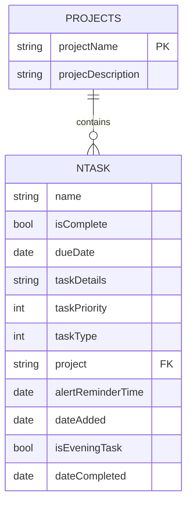
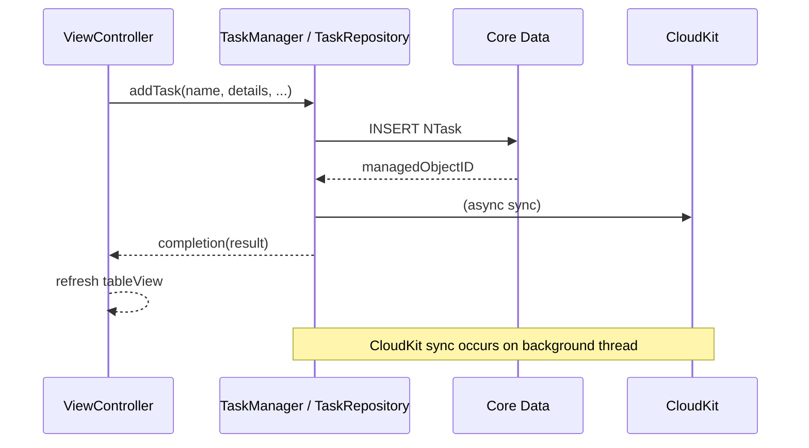
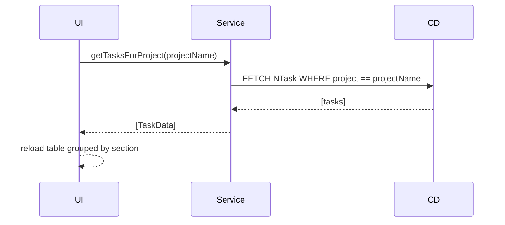
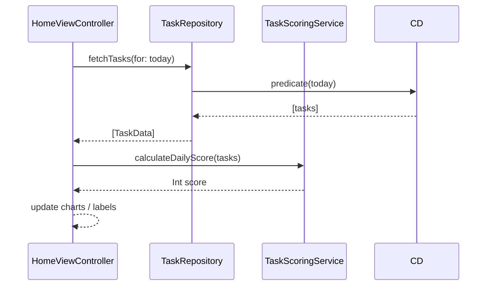

# Tasker - Gamified Tasks & Productivity Pulse

## Table of Contents
- [Key Features](#key-features)
- [Project Architecture](#project-architecture)
- [Entity Attribute Reference & ER Diagram](#entity-attribute-reference--er-diagram)
- [Use-Case Sequence Flows](#use-case-sequence-flows)
- [Legacy vs. Repository Architecture (2025 Snapshot)](#legacy-vs-repository-architecture-2025-snapshot)
- [Testing Strategy Roadmap](#testing-strategy-roadmap)
- [Feature Implementation Details](#feature-implementation-details)

Tasker is a sophisticated iOS productivity application that transforms task management into an engaging, gamified experience. Built with Swift and UIKit, it combines modern iOS design patterns with powerful productivity features including CloudKit synchronization, advanced analytics, and a comprehensive scoring system.

## Key Features

### 🎯 **Comprehensive Task Management System**
- **Task Creation & Editing**: Rich task creation with title, description, priority levels (P0-P4), and due dates
- **Task Types**: Morning, Evening, Upcoming, and Inbox categorization with automatic scheduling
- **Priority System**: 4-level priority system (P0-Highest, P1-High, P2-Medium, P3-Low) with visual indicators
- **Task Completion**: Mark tasks as complete with automatic scoring and streak tracking
- **Task Rescheduling**: Built-in reschedule functionality for overdue or postponed tasks
- **Task Details View**: Comprehensive FluentUI-based detail view with full editing capabilities

### 📁 **Advanced Project Management**
- **Custom Projects**: Create, edit, and delete custom project categories
- **Default Inbox System**: Automatic "Inbox" project for uncategorized tasks
- **Project-Based Filtering**: View tasks filtered by specific projects
- **Project Analytics**: Track completion rates and progress per project
- **Project Grouping**: Tasks automatically grouped by project in list views

### 📊 **Analytics & Gamification Dashboard**
- **Visual Charts**: Interactive charts showing task completion trends and patterns
- **Scoring System**: Dynamic scoring based on task priority (P0: 7pts, P1: 4pts, P2: 3pts, P3: 2pts)
- **Streak Tracking**: Consecutive day completion streaks with up to 30-day history
- **Daily Score Calculation**: Real-time score updates based on completed tasks
- **Performance Insights**: Historical data visualization for productivity tracking

### 🎨 **Modern FluentUI Interface**
- **FluentUI Components**: Microsoft FluentUI design system integration
- **Table Cell Views**: Custom FluentUI table cells with priority indicators and due date displays
- **Segmented Controls**: FluentUI segmented controls for task type selection
- **Material Design Elements**: MDC text fields, floating action buttons, and ripple effects
- **Responsive Design**: Adaptive layouts for different screen sizes

### 📅 **Smart Scheduling & Calendar**
- **Calendar Integration**: FSCalendar integration for visual task scheduling
- **Date-Based Views**: Today, custom date, upcoming, and history views
- **Overdue Detection**: Automatic identification and highlighting of overdue tasks
- **Time-Based Organization**: Morning/evening task separation with automatic categorization

### ☁️ **Cloud Sync & Data Management**
- **CloudKit Integration**: Seamless cross-device synchronization
- **Core Data Repository**: Robust local data storage with background context operations
- **Type-Safe Enums**: TaskType and TaskPriority enums with Core Data integration
- **Data Validation**: Comprehensive validation rules for task creation and editing

### 🔍 **Advanced Search & Filtering**
- **Multi-Criteria Filtering**: Filter by project, priority, completion status, and date ranges
- **Search Functionality**: Real-time search across task titles and descriptions
- **View Type System**: 7 different view modes (Today, Custom Date, Project, Upcoming, History, All Projects, Selected Projects)
- **Smart Grouping**: Automatic grouping by project with customizable sorting

---
|   | [App Store Link](https://apps.apple.com/app/id1574046107) |  |
| ------------- | ------------- | --------|
---

## Recent Improvements (2025)

- Added BEMCheckBox integration for inline checkboxes and automatic strike-through of completed tasks (June 2025)
- Fixed project filter logic ensuring the main filter button stays visible when project filters are active (June 2025)
- Introduced Chat assistant interface (`ChatHostViewController`) accessible from the bottom app bar (May 2025)
- Implemented automatic merging of duplicate "Inbox" projects during data integrity checks (April 2025)
- Refactored core data flow toward a Repository & Dependency-Injection pattern for better testability (March 2025)

## Installation
- Run `pod install` on project directory ([CocoaPods Installation](https://guides.cocoapods.org/using/getting-started.html))
- Open `Tasker.xcworkspace`
- Build & run, enjoy

## Project Architecture

### Overview
Tasker follows a **Model-View-Controller (MVC)** architecture pattern with additional manager classes for business logic separation. The app is built using:

- **Core Data** with **CloudKit** integration for data persistence and synchronization
- **Material Design Components** and **FluentUI** for modern UI components
- **DGCharts framework** for advanced data visualization
- **Firebase** for analytics, crashlytics, and performance monitoring
- **Singleton pattern** for data managers to ensure consistent state management

### In-Depth Architecture Analysis

**Manager Class Interactions:**
`TaskManager` and `ProjectManager` serve as central hubs for managing `NTask` and `Projects` data, respectively. ViewControllers interact with these managers to fetch, create, or update data. For instance, `HomeViewController` calls methods like `TaskManager.sharedInstance.getMorningTasksForToday()` to populate its table view. Similarly, when a user creates a task, ViewControllers invoke manager methods such as `TaskManager.sharedInstance.createTask(...)` to persist the new data.

**ViewController Responsibilities:**
ViewControllers, exemplified by `HomeViewController`, currently handle a broad spectrum of responsibilities. These include setting up the user interface (often involving complex custom views like calendars and charts), managing user interactions, initiating data fetching operations by calling manager classes, and directly updating the UI in response to new data. Additionally, some business logic, such as calculating scores for display, is triggered from within `HomeViewController`.

**Custom UI Components:**
The `To Do List/View/` directory houses a variety of custom UI components, including `HomeBackdropView`, `HomeForedropView`, and `HomeBottomBarView`. These components are crucial for creating the app's distinctive layered user interface and contribute significantly to the overall user experience. They are designed to work seamlessly with UIKit, Material Components, and FluentUI to deliver a polished and engaging visual presentation.

### Architecture Layers

## Deep Analysis: TaskManager Architecture & Evolution

### TaskManager: The Legacy Foundation

`TaskManager` serves as the central hub for all task-related operations in the Tasker application. As a singleton class (`TaskManager.sharedInstance`), it provides a unified interface for task management across the entire application.

#### Core Responsibilities

**1. Core Data Management**
- Manages the Core Data `NSManagedObjectContext` for database operations
- Handles CRUD operations for `NTask` entities
- Provides context saving and error handling

**2. Task Type Management**
- Defines `TaskType` enum: `.morning`, `.evening`, `.upcoming`
- Defines `TaskPriority` enum: `.low`, `.medium`, `.high`
- Manages task categorization and filtering

**3. Task Lifecycle Operations**
```swift
// Core CRUD Operations
func addNewMorningTaskWithName(name: String, project: String)
func addNewEveningTaskWithName(name: String, project: String)
func toggleTaskComplete(task: NTask)
func removeTaskAtIndex(index: Int)
func reschedule(task: NTask, to date: Date)
```

**4. Advanced Query Interface**
- Date-based filtering (today, overdue, specific dates)
- Project-based filtering
- Completion status filtering
- Complex predicate-based queries using `NSPredicate`

#### Key Methods Analysis

**Task Retrieval Methods:**
- `getTasksForInboxForDate_All(date:)` - Inbox tasks for specific date
- `getTasksForProjectByName(projectName:)` - All tasks for a project
- `getTasksForAllCustomProjectsByNameForDate_Open(date:)` - Open custom project tasks
- `getTasksDueToday()` - Tasks due today
- `getTasksCompletedToday()` - Completed tasks for today
- `getOverdueTasks()` - Overdue incomplete tasks

**Data Integrity Methods:**
- `fixMissingTasksDataWithDefaults()` - Ensures data consistency
- `saveContext()` - Persists changes to Core Data
- `fetchTasks(predicate:sortDescriptors:)` - Generic fetch with filtering

### Architectural Evolution: From Monolith to Clean Architecture

#### Phase 1: Legacy Architecture (Pre-2025)
```
┌─────────────────┐
│  View Controllers│
│        ↓        │
│   TaskManager   │ ← Singleton, tightly coupled
│        ↓        │
│   Core Data     │
└─────────────────┘
```

**Challenges:**
- Tight coupling between UI and data layer
- Difficult to test due to singleton dependencies
- Mixed responsibilities (UI logic + data access)
- Hard to mock for unit testing

#### Phase 2: Repository Pattern Introduction (2025)
```
┌─────────────────┐
│  View Controllers│
│        ↓        │
│ TaskRepository  │ ← Protocol-based abstraction
│        ↓        │
│CoreDataTaskRepo │ ← Concrete implementation
│        ↓        │
│   Core Data     │
└─────────────────┘
```

**Improvements:**
- Protocol-based abstraction (`TaskRepository`)
- Dependency injection via `DependencyContainer`
- Background context operations for better performance
- `TaskData` struct for UI decoupling

#### Phase 3: Clean Architecture Target
```
┌─────────────────┐
│ Presentation    │ ← SwiftUI/UIKit Views
│        ↓        │
│ Domain          │ ← Business Logic & Use Cases
│        ↓        │
│ Data            │ ← Repository Pattern
│        ↓        │
│ Infrastructure  │ ← Core Data, Network, etc.
└─────────────────┘
```

### Current State: Hybrid Architecture

The application currently operates in a **hybrid state** where:

**Legacy Components (TaskManager):**
- Still used extensively throughout the codebase
- Provides backward compatibility
- Handles complex business logic and data validation
- Used in: `HomeViewController`, `AddTaskViewController`, `ProjectManager`

**Modern Components (TaskRepository):**
- Used in newer view controllers like `TaskListViewController`
- Provides cleaner, testable architecture
- Better separation of concerns
- Async operations with completion handlers

### Migration Roadmap Toward Full Clean Architecture

| Phase | Goal | Status | Completed Actions | Next Action Items |
|-------|------|--------|-------------------|-------------------|
| 1. Predicate-Driven Fetching | Replace stored arrays with Core-Data predicates for memory efficiency | ✅ Done (2025-Q1) | • Rewrote fetch helpers using `NSPredicate`<br>• Removed in-memory caches | • Monitor fetch performance w/ Instruments |
| 2. Type-Safe Enums & Model Cleanup | Use Swift enums for priority/type; remove magic numbers | ✅ Done (2025-Q1) | • Added `TaskPriority`, `TaskType` enums<br>• Aligned Core Data raw values | • Audit UI for any residual int literals |
| 3. Repository Layer & DI | Introduce `TaskRepository` protocol, `CoreDataTaskRepository`, and `DependencyContainer` | ✅ 60% shipped (2025-Q2) | • Repository written<br>• New VCs injected via DI | • Migrate `HomeViewController`, `AddTaskViewController`<br>• Deprecate `TaskManager.sharedInstance` |
| 4. Concurrency & NSFetchedResultsController | Switch to background contexts & diffable feeds | ✅ Done (2025-Q2) | • Background saving<br>• FRC in `TaskListVC` | • Apply FRC to Home & Project screens |
| 5. Utility & Service Layer Extraction | Move business logic (scoring, logging, date utils) out of managers | ✅ Done | • `TaskScoringService`, `LoggingService`, `DateUtils` | • Extract validation rules into `TaskValidationService` |
| 6. SwiftUI Presentation | Gradually swap UIKit screens with SwiftUI equivalents | ⏳ In-progress (20% complete) | • `ProjectManagementView.swift`, `SettingsView.swift` | • Prototype SwiftUI Home dashboard<br>• Create shared ViewModel layer |
| 7. Core Data → Domain Mapping | Introduce domain models & mappers (e.g., `TaskEntity` ⇄ `Task`) | ⏳ Not started | — | • Define pure Swift `Task` struct<br>• Implement mapper inside repository |
| 8. Project Repository & Relations | Convert `project` string FK into Core-Data relationship | 🚧 Planned | — | • Update `.xcdatamodeld` with relationship<br>• Write migration script<br>• Implement `ProjectRepository` |
| 9. Test Coverage Expansion | Achieve 70% unit coverage on domain & data layers | 🚧 Planned | • Templates present | • Implement tests listed in testing roadmap |

 > The table doubles as a kanban board: each "Next Action Item" should translate into GitHub issues.

### Clean Architecture Migration — Status Review (Aug 2025)

**Phase 1 – Inventory & Shims**

*Done*
- All `TaskManager` / `ProjectManager` call-sites have been catalogued (see list below).

*Pending*
- Add thin adapter methods in both managers that forward to repositories/use-cases.
- Annotate singletons with `@available(*, deprecated)` to warn during compilation.
- Enforce contributor rule: no new direct Core Data or manager logic in new code.

**Phase 2 – Project Data Layer**

*Done*
- — *(implementation not started)*

*Pending*
- Create `ProjectRepository` protocol + `CoreDataProjectRepository` implementation.
- Register repository in `DependencyContainer`.
- Migrate `ProjectManager` methods to adapters; controllers fetch projects via DI.

**Supporting Evidence**
- *Predicate-driven fetching* — `CoreDataTaskRepository.swift` uses `NSPredicate` in all query helpers.
- *Type-safe enums & mapping* — `NTask+Extensions.swift` and `TaskData.swift` convert Core Data `Int32` to `TaskType` / `TaskPriority` enums and back.

#### Detailed Phase Progress & Next Steps (Aug 2025)

| Phase | Done | Pending | Acceptance Criteria / Improvements |
|-------|------|---------|------------------------------------|
| **1. Inventory & Shims** | • Call-sites catalogued | • Adapter methods inside managers forward to repos / use cases<br>• Deprecation annotations on singletons<br>• Enforce “no new manager logic” rule | Build passes with deprecation warnings; all new code uses repos / use cases |
| **2. Project Data Layer** | — | • `ProjectRepository` protocol + `CoreDataProjectRepository`<br>• Register in `DependencyContainer`<br>• Adapter delegation in `ProjectManager` | All project CRUD flows execute through `ProjectRepository` via DI |
| **3. Task Use Case Coverage** | • Read use cases (`GetTasks`) | • Write use cases: Add / Toggle / Delete / Reschedule / Update<br>• Controllers and delegates call use cases only | `HomeViewController`, `ToDoList.swift`, `AddTaskViewController` interact only with use cases |
| **4. Presentation Refactor (MVVM)** | • DI-ready controllers; SwiftUI views for Settings & Projects | • Introduce `HomeViewModel`, `AddTaskViewModel`, `ProjectListViewModel`<br>• Move formatting / filtering / scoring into VMs | Home & Add Task run through ViewModels with unit-testable logic |
| **5. Concurrency & Core Data Hygiene** | • Background writes in `CoreDataTaskRepository`<br>• FRC in `TaskListViewController` | • Verify background writes in new repositories<br>• Adopt diffable data source on Home & Project lists | No main-thread Core Data writes; smooth UI during bulk edits |
| **6. Tests** | Templates scaffolded | • Unit tests for use cases (mock repos)<br>• Integration tests for repos (in-memory store)<br>• Smoke UI tests for Home list | CI runs green; ≥40 % overall coverage |
| **7. Remove Legacy** | — | • Remove `TaskManager` & `ProjectManager` after adapters phased out<br>• Delete direct Core Data access from UI | Search in app sources shows 0 results for singletons |
| **8. SwiftUI Expansion (Parallel)** | • `ProjectManagementView`, `SettingsView` | • SwiftUI Home and Add Task screens wrapping ViewModels | SwiftUI Home & AddTask achieve feature parity with UIKit versions |

---

### 📋 Deep-Dive Action Plan & Acceptance Criteria

<details>
<summary><strong>Phase 1 — Inventory & Shims</strong></summary>

**Tasks**
- [ ] Generate adapter methods in `TaskManager` / `ProjectManager` that delegate to repositories / use-cases.
- [ ] Annotate both singletons with `@available(*, deprecated, message:"Use TaskRepository / ProjectRepository")`.
- [ ] Add SwiftLint custom rule forbidding new references to the singletons (outside adapters).
- [ ] Update contributor guidelines + PR template to highlight the rule.

**Acceptance**
- Build succeeds with *only* deprecation warnings for remaining legacy calls.
- SwiftLint passes with **0** violations for the custom rule.
</details>

<details>
<summary><strong>Phase 2 — Project Data Layer</strong></summary>

**Tasks**
- [ ] Define `ProjectRepository` protocol (CRUD + filtered fetch helpers).
- [ ] Implement `CoreDataProjectRepository` using background contexts & CloudKit sync.
- [ ] Register repository in `DependencyContainer`; add property-wrapper injection helper `@Inject var projectRepository`.
- [ ] Add adapter delegation in `ProjectManager` *without* changing public API (keeps UI compiling).
- [ ] Unit-test repository functions with in-memory store.
- [ ] Migrate `ProjectManagementViewController` & SwiftUI `ProjectManagementView` to `ProjectRepository`.

**Acceptance**
- All project CRUD flows (add / rename / delete / list) run through `ProjectRepository` via DI.
- Legacy `ProjectManager` methods reach **adapter path only** (confirmed by breakpoints / logs).
- Unit tests for repository cover ≥90 % of lines.
</details>

<details>
<summary><strong>Phase 3 — Task Use-Case Coverage</strong></summary>

**Tasks**
- [ ] Create use-case structs: `AddTask`, `ToggleTaskCompletion`, `DeleteTask`, `RescheduleTask`, `UpdateTask` (async completion-handler API).
- [ ] Refactor `GetTasks` variants into one generic `GetTasksUseCase` with filters.
- [ ] Inject use-cases into `HomeViewController`, `ToDoList.swift`, `AddTaskViewController`, calendar delegates.
- [ ] Remove any direct repository or `TaskManager` calls from UI after migration.
- [ ] Unit-test all use-cases with mock repositories.

**Acceptance**
- Above controllers / delegates compile *only* against use-cases (search check).
- Unit tests cover success + failure cases for each use-case.
</details>

<details>
<summary><strong>Phase 4 — Presentation Refactor (MVVM)</strong></summary>

**Tasks**
- [ ] Introduce `HomeViewModel`, `AddTaskViewModel`, `ProjectListViewModel` (Combine publishers for state updates).
- [ ] Move formatting / filtering / scoring logic from controllers to VMs.
- [ ] Bridge UIKit controllers via property observers or diffable snapshots.
- [ ] Prepare SwiftUI equivalents to bind VMs directly.
- [ ] Add snapshot unit tests validating VM → view-state mapping.

**Acceptance**
- Home & Add-Task screens render via ViewModel state only.
- Corresponding controllers shrink to ≤100 LOC (logic-less).
</details>

<details>
<summary><strong>Phase 5 — Concurrency & Core Data Hygiene</strong></summary>

**Tasks**
- [ ] Audit all repository write paths; wrap in `context.perform{}` blocks.
- [ ] Ensure main-thread UI updates use diffable data sources.
- [ ] Run Instruments `Main Thread Checker` + `Time Profiler` during bulk imports (≥1 k tasks).
- [ ] Adopt `NSPersistentCloudKitContainer` quality-of-service tuning for background sync.

**Acceptance**
- Zero “CoreData main-thread write” warnings at runtime.
- Scrolling FPS ≥55 on iPhone 11 simulator with 1 k tasks.
</details>

<details>
<summary><strong>Phase 6 — Tests</strong></summary>

**Tasks**
- [ ] Implement mock repository factory (`MockTaskRepository`, `MockProjectRepository`).
- [ ] Build in-memory Core Data stack helper for integration tests.
- [ ] Add unit tests for all use-cases and ViewModels.
- [ ] Add integration tests for repositories (CRUD + predicate filtering).
- [ ] Add UI test: create → toggle → delete task in Home list.
- [ ] Configure CI (GitHub Actions) with code-coverage threshold 40 % (raise to 70 % in Phase 9).

**Acceptance**
- CI pipeline green; coverage ≥40 % overall and trending upward.
</details>

<details>
<summary><strong>Phase 7 — Remove Legacy Managers</strong></summary>

**Tasks**
- [ ] Gradually delete adapter methods once call-sites migrated.
- [ ] Remove `TaskManager.swift` & `ProjectManager.swift` files.
- [ ] Delete associated unit tests / docs.
- [ ] Re-run SwiftLint custom rule to ensure zero violations.

**Acceptance**
- `rg "TaskManager|ProjectManager" To\ Do\ List/` returns **0** results.
- Build / tests pass without singletons present.
</details>

<details>
<summary><strong>Phase 8 — SwiftUI Expansion (parallel)</strong></summary>

**Tasks**
- [ ] Implement SwiftUI `HomeView` & `AddTaskView` bound to shared ViewModels.
- [ ] Refactor navigation flow to use `UIHostingController` wrappers where UIKit persists.
- [ ] Support Dynamic-Type & Dark-Mode in new SwiftUI screens.
- [ ] Regression test on iOS 14–17 devices.

**Acceptance**
- SwiftUI Home & Add-Task achieve feature parity with UIKit versions and pass snapshot tests.
</details>

 - **Known legacy usages to migrate off TaskManager**
   - `To Do List/ViewControllers/HomeViewController.swift`
   - `To Do List/ViewControllers/HomeViewController+ProjectFiltering.swift`
   - `To Do List/ViewControllers/HomeViewController+TableView.swift`
   - `To Do List/ViewControllers/Delegates/ToDoList.swift`
   - `To Do List/ViewControllers/Delegates/HomeCalendarExtention.swift`
   - `To Do List/ViewControllers/Delegates/AddTaskCalendarExtention.swift`
   - `To Do List/ViewControllers/SettingsPageViewController.swift`
   - `To Do List/ViewControllers/ProjectManagementViewController.swift`
   - `To Do List/ViewControllers/ProjectManager.swift` (contains calls into `TaskManager`)
   - `AddTaskViewController.swift` has no direct `TaskManager` references; its calendar delegate extension still does.
   - `TaskListViewController.swift` is fully on the repository pattern; use it as a migration reference.

#### Phase-Wise Detailed Checklists

<details>
<summary><strong>Phase 3 — Repository Layer & DI (60% done)</strong></summary>

- [x] Define `TaskRepository` protocol and default CRUD signatures
- [x] Implement `CoreDataTaskRepository` with background context operations
- [x] Register `TaskRepository` inside `DependencyContainer`
- [x] Inject into `TaskListViewController`
- [ ] Refactor `HomeViewController` to repository pattern *(ETA 2025-Q3)*
- [ ] Refactor `AddTaskViewController`
- [ ] Annotate `TaskManager` APIs with `@available(*, deprecated, message:"Use TaskRepository")`
</details>

<details>
<summary><strong>Phase 4 — Concurrency & FRC (Done)</strong></summary>

- Background context saving implemented
- `NSFetchedResultsController` integrated in `TaskListViewController`
- **Next (optional):** Adopt diffable data source on Home & Project screens for smoother UI updates
</details>

<details>
<summary><strong>Phase 6 — SwiftUI Presentation (20% done)</strong></summary>

- [x] Delivered `ProjectManagementView.swift` & `SettingsView.swift`
- [ ] Prototype SwiftUI Home dashboard in branch `swiftui/home`
- [ ] Establish `HomeViewModel` shared between SwiftUI and UIKit
</details>

<details>
<summary><strong>Phase 8 — Project Repository & Relations (Planned)</strong></summary>

- [ ] Add one-to-many relationship `Projects.tasks` in `.xcdatamodeld`
- [ ] Create lightweight migration (Xcode automatic)
- [ ] Generate `ProjectRepository` with CRUD & fetch joined tasks
- [ ] Replace string-based project lookups in managers
</details>


---

#### Completed Migrations ✅
1. **TaskListViewController** - Fully migrated to repository pattern with NSFetchedResultsController
2. **DependencyContainer** - Centralized dependency management with injection system
3. **TaskData struct** - UI/Core Data decoupling layer
4. **Background contexts** - Improved performance for data operations
5. **CoreDataTaskRepository** - Complete repository implementation with async operations
6. **TaskScoringService** - Dedicated service for scoring logic
7. **DateUtils & LoggingService** - Utility layer implementations

#### Pending Migrations 🔄
1. **HomeViewController** - Still heavily dependent on TaskManager singleton
2. **AddTaskViewController** - Mixed usage of both patterns
3. **Project Management** - ProjectManager still calls TaskManager directly
4. **Analytics & Charts** - Direct TaskManager dependencies remain

### Technical Debt & Refactoring Opportunities

#### 1. Singleton Dependencies
```swift
// Current (Legacy)
TaskManager.sharedInstance.toggleTaskComplete(task: task)

// Target (Dependency Injection)
class HomeViewController: TaskRepositoryDependent {
    var taskRepository: TaskRepository!
    // Use injected dependency
}
```

#### 2. Mixed Responsibilities
- TaskManager handles both data access AND business logic
- Should be split into separate concerns
- Business logic should move to Use Cases/Services

#### 3. Error Handling
```swift
// Legacy: Silent failures
TaskManager.sharedInstance.saveContext()

// Modern: Explicit error handling
taskRepository.addTask(data: taskData) { result in
    switch result {
    case .success: // Handle success
    case .failure(let error): // Handle error
    }
}
```

### Performance Considerations

#### TaskManager Optimizations
- Uses `NSFetchedResultsController` for efficient UI updates
- Implements lazy loading with computed properties
- Caches frequently accessed data

#### Repository Pattern Benefits
- Background context operations prevent UI blocking
- Better memory management with proper context handling
- Async operations with completion handlers

### Testing Strategy

#### Current Challenges
- Singleton pattern makes unit testing difficult
- Tight coupling to Core Data
- Hard to mock dependencies

#### Repository Pattern Advantages
```swift
// Mockable for testing
protocol TaskRepository {
    func fetchTasks(completion: @escaping ([TaskData]) -> Void)
}

class MockTaskRepository: TaskRepository {
    func fetchTasks(completion: @escaping ([TaskData]) -> Void) {
        completion([/* mock data */])
    }
}
```

### Refactored Architecture (2025 Update)

Tasker has undergone a comprehensive refactoring to improve maintainability, testability, and performance. This refactoring has been implemented in six phases:

#### Phase 1: Predicate-Driven Fetching & Removal of Stored Arrays ✅
- Core Data queries now use `NSPredicate` filtering for efficient data access
- Eliminated redundant memory storage of task arrays
- Improved memory usage and reduced data synchronization issues

#### Phase 2: Type-Safe Enums & Data Model Cleanup ✅
- Replaced raw integer constants with Swift enums (`TaskType`, `TaskPriority`)
- Core Data attributes aligned with enum raw values for type safety
- Added proper conversion between Int32 Core Data attributes and Swift enums

#### Phase 3: Protocol-Oriented Repository & Dependency Injection ✅
- Created `TaskRepository` protocol for data access abstraction
- Implemented `CoreDataTaskRepository` with background context operations
- Introduced `TaskData` struct to decouple UI from Core Data dependencies
- Added `DependencyContainer` for proper dependency injection

#### Phase 4: Concurrency & NSFetchedResultsController ✅
- Enhanced `CoreDataTaskRepository` with background context operations
- Implemented `NSFetchedResultsController` for efficient UI updates
- Added table view integration with swipe actions
- Improved UI responsiveness and memory efficiency

#### Phase 5: Utility Layers ✅
- Created comprehensive date extension utilities (`DateUtils.swift`)
- Implemented dedicated task scoring service (`TaskScoringService.swift`)
- Added structured logging system (`LoggingService.swift`)
- Improved code organization and reusability

#### Phase 6: SwiftUI Integration (Partial Implementation)
- `ProjectManagementView.swift` - SwiftUI implementation for project management
- `SettingsView.swift` - SwiftUI-based settings interface
- Hybrid UIKit/SwiftUI architecture for modern UI components
- SwiftUI integration in HomeViewController for hosting SwiftUI views

#### Phase 7: Testing & Quality Assurance (Minimal Implementation)
- Basic test file structure exists (`To_Do_ListTests.swift`, `To_Do_ListUITests.swift`)
- Test files contain placeholder templates without actual test implementations
- **Needs Implementation**: Unit tests for repositories and services
- **Needs Implementation**: Integration tests for Core Data implementation
- **Needs Implementation**: UI tests for critical user flows

#### 1. Data Layer
**Core Data Stack with CloudKit Integration**
- `NSPersistentCloudKitContainer` for automatic CloudKit synchronization
- Two main entities: `NTask` and `Projects`
- Automatic conflict resolution and data merging across devices

#### 2. Business Logic Layer
**Repositories & Services (Protocol-Oriented Design)**
- `TaskRepository` - Protocol defining task data operations
- `CoreDataTaskRepository` - Core Data implementation of TaskRepository
- `TaskScoringService` - Business logic for task scoring and analytics
- `DependencyContainer` - Service locator for dependency injection

**Legacy Manager Classes (Being Phased Out)**
- `TaskManager` - Original centralized task operations (being replaced by TaskRepository)
- `ProjectManager` - Project lifecycle management (future refactoring target)

#### 3. Presentation Layer
**View Controllers and Custom Views**
- Modular view controller design with specialized responsibilities
- Custom backdrop/foredrop view system for layered UI
- Reusable UI components with consistent theming

#### 4. Utility Layer
**Helper Classes and Extensions**
- `ToDoColors` - Centralized color theming system
- `ToDoFont` - Typography management
- `DateUtils` - Comprehensive date and time utilities
- `LoggingService` - Structured logging system with multiple levels
- `TaskScoringService` - Dedicated service for task scoring and analytics
- `ToDoTimeUtils` - Legacy time utilities (being migrated to DateUtils)

## Core Entities & Data Model

### NTask Entity
The primary task entity (`NTask`) stores all information related to a task. Its properties, defined in `NTask+CoreDataProperties.swift`, include:

```swift
@NSManaged public var name: String                    // Task title
@NSManaged public var isComplete: Bool                // Completion status
@NSManaged public var dueDate: NSDate?               // Due date for scheduling
@NSManaged public var taskDetails: String?           // Additional task description
@NSManaged public var taskPriority: Int32            // Priority level (stored as enum raw value)
@NSManaged public var taskType: Int32                // Category (stored as enum raw value)
@NSManaged public var project: String?               // Associated project name
@NSManaged public var alertReminderTime: NSDate?     // Notification scheduling
@NSManaged public var dateAdded: NSDate?             // Creation timestamp
@NSManaged public var isEveningTask: Bool            // Evening task flag
@NSManaged public var dateCompleted: NSDate?         // Completion timestamp
```

**Task Priority System (Type-Safe Enum):**
```swift
enum TaskPriority: Int32, CaseIterable {
    case highest = 1    // P0: 7 points
    case high = 2       // P1: 4 points
    case medium = 3     // P2: 3 points (default)
    case low = 4        // P3: 2 points
}
```

**Task Type Categories (Type-Safe Enum):**
```swift
enum TaskType: Int32, CaseIterable {
    case morning = 1    // Morning tasks
    case evening = 2    // Evening tasks
    case upcoming = 3   // Future-dated tasks
    case inbox = 4      // Uncategorized tasks
}
```

### NTask Extensions & Type-Safe Accessors

The `NTask+Extensions.swift` file provides type-safe computed properties and business logic:

```swift
// Type-safe enum accessors
extension NTask {
    var taskType: TaskType {
        get { TaskType(rawValue: self.taskType) ?? .morning }
        set { self.taskType = newValue.rawValue }
    }
    
    var taskPriority: TaskPriority {
        get { TaskPriority(rawValue: self.taskPriority) ?? .medium }
        set { self.taskPriority = newValue.rawValue }
    }
    
    // Computed properties for task categorization
    var isMorningTask: Bool {
        return taskType == .morning
    }
    
    var isUpcomingTask: Bool {
        return taskType == .upcoming
    }
    
    var isHighPriority: Bool {
        return taskPriority == .highest || taskPriority == .high
    }
    
    var isMediumPriority: Bool {
        return taskPriority == .medium
    }
    
    var isLowPriority: Bool {
        return taskPriority == .low
    }
    
    // Business logic for evening task management
    func updateEveningTaskStatus() {
        if taskType == .evening {
            isEveningTask = true
        } else {
            isEveningTask = false
        }
    }
}
```

### TaskData Presentation Model

The `TaskData.swift` struct serves as a clean presentation layer model:
```swift
struct TaskData {
    let id: NSManagedObjectID?
    let name: String
    let details: String?
    let type: TaskType
    let priority: TaskPriority
    let dueDate: Date
    let project: String
    let isComplete: Bool
    let dateAdded: Date
    let dateCompleted: Date?
    
    // Initializer from Core Data managed object
    init(managedObject: NTask) {
        self.id = managedObject.objectID
        self.name = managedObject.name ?? "Untitled Task"
        self.details = managedObject.taskDetails
        self.type = TaskType(rawValue: managedObject.taskType) ?? .morning
        self.priority = TaskPriority(rawValue: managedObject.taskPriority) ?? .medium
        self.dueDate = (managedObject.dueDate as Date?) ?? Date()
        self.project = managedObject.project ?? "Inbox"
        self.isComplete = managedObject.isComplete
        self.dateAdded = (managedObject.dateAdded as Date?) ?? Date()
        self.dateCompleted = managedObject.dateCompleted as Date?
    }
    
    // Initializer for new tasks
    init(id: NSManagedObjectID? = nil,
         name: String,
         details: String? = nil,
         type: TaskType,
         priority: TaskPriority,
         dueDate: Date,
         project: String = "Inbox",
         isComplete: Bool = false,
         dateAdded: Date = Date(),
         dateCompleted: Date? = nil) {
        self.id = id
        self.name = name
        self.details = details
        self.type = type
        self.priority = priority
        self.dueDate = dueDate
        self.project = project
        self.isComplete = isComplete
        self.dateAdded = dateAdded
        self.dateCompleted = dateCompleted
    }
}
```

### ToDoListViewType Enum

The view type system provides flexible list filtering:

```swift
enum ToDoListViewType {
    case todayHomeView      // Today's tasks
    case customDateView     // Tasks for specific date
    case projectView        // Tasks filtered by project
    case upcomingView       // Future tasks
    case historyView        // Completed tasks
    case allProjectsGrouped // All tasks grouped by project
    case selectedProjectsGrouped // Selected projects only
}
```

### Core Data Repository Pattern

The repository pattern abstracts data access:
```swift
final class CoreDataTaskRepository: TaskRepository {
    private let viewContext: NSManagedObjectContext
    private let backgroundContext: NSManagedObjectContext

    init(container: NSPersistentContainer, defaultProject: String = "Inbox") {
        self.viewContext = container.viewContext
        self.backgroundContext = container.newBackgroundContext()
        self.viewContext.automaticallyMergesChangesFromParent = true
        self.backgroundContext.mergePolicy = NSMergeByPropertyObjectTrumpMergePolicy
    }

    func fetchTasks(predicate: NSPredicate?,
                    sortDescriptors: [NSSortDescriptor]?,
                    completion: @escaping ([TaskData]) -> Void) { /* ... */ }

    func addTask(data: TaskData,
                 completion: ((Result<NTask, Error>) -> Void)?) { /* ... */ }

    func toggleComplete(taskID: NSManagedObjectID,
                        completion: ((Result<Void, Error>) -> Void)?) { /* ... */ }

    func deleteTask(taskID: NSManagedObjectID,
                    completion: ((Result<Void, Error>) -> Void)?) { /* ... */ }

    func reschedule(taskID: NSManagedObjectID, to newDate: Date,
                    completion: ((Result<Void, Error>) -> Void)?) { /* ... */ }
}
```

### Task Scoring Service

The scoring system calculates points based on priority and completion:

```swift
class TaskScoringService {
    static func calculateScore(for task: TaskData) -> Int {
        guard task.isComplete else { return 0 }
        
        switch task.priority {
        case .highest: return 7  // P0 tasks
        case .high: return 4     // P1 tasks
        case .medium: return 3   // P2 tasks (default)
        case .low: return 2      // P3 tasks
        }
    }
    
    static func calculateDailyScore(tasks: [TaskData]) -> Int {
        return tasks.reduce(0) { total, task in
            total + calculateScore(for: task)
        }
    }
    
    static func calculateWeeklyScore(tasks: [TaskData]) -> Int {
        let calendar = Calendar.current
        let now = Date()
        let weekStart = calendar.dateInterval(of: .weekOfYear, for: now)?.start ?? now
        
        let weeklyTasks = tasks.filter { task in
            guard let completedDate = task.dateCompleted else { return false }
            return completedDate >= weekStart && completedDate <= now
        }
        
        return calculateDailyScore(tasks: weeklyTasks)
    }
}
```

### Core Data & Enum Integration

The refactored architecture properly handles the conversion between Core Data's `Int32` attributes and Swift enums:

**Converting from Enum to Int32 (when saving):**
```swift
// In CoreDataTaskRepository.swift
managed.taskType = data.type.rawValue     // Store enum's raw value
managed.taskPriority = data.priority.rawValue
```

**Converting from Int32 to Enum (when fetching):**
```swift
// In TaskData.swift initializer
self.type = TaskType(rawValue: managedObject.taskType) ?? .morning
self.priority = TaskPriority(rawValue: managedObject.taskPriority) ?? .medium
```

**Using Enum Values in Switch Statements:**
```swift
// In TaskCell.configure(with:) method
switch task.taskPriority {
case TaskPriority.high.rawValue:
    priorityIndicator.backgroundColor = .systemRed
// ...
}
```
- **Evening Tasks (2)**: Tasks scheduled for evening completion
- **Upcoming Tasks (3)**: Future-scheduled tasks
- **Inbox Tasks (4)**: Unscheduled/default category

### Projects Entity
Simple project organization structure:

```swift
@NSManaged public var projectName: String?           // Project identifier
@NSManaged public var projectDescription: String?     // Project description
```

**Default Project System:**
- "Inbox" serves as the default catch-all project
- Custom projects can be created for task organization
- Project-based task filtering and management

## Domain Logic & Business Rules

### Scoring System
The gamification core revolves around a sophisticated scoring algorithm:

```swift
func getTaskScore(task: NTask) -> Int {
    switch task.taskPriority {
    case 1: return 7  // P0 - Highest priority
    case 2: return 4  // P1 - High priority  
    case 3: return 3  // P2 - Medium priority
    case 4: return 2  // P3 - Low priority
    default: return 1 // Fallback
    }
}
```

### Task Management Rules
1. **Default Assignment**: New tasks default to P2 priority and morning type
2. **Project Association**: Tasks without explicit project assignment go to "Inbox"
3. **Completion Tracking**: `dateCompleted` timestamp enables historical analysis
4. **Evening Task Logic**: Special handling for evening-scheduled tasks

### Data Validation
- Project existence validation with automatic "Inbox" creation
- Task priority bounds checking (1-4 range)
- Date validation for scheduling and completion tracking

## Data Flow Architecture

### 1. Task Creation Flow
```
AddTaskViewController → TaskManager → Core Data → CloudKit
                    ↓
            UI Updates → HomeViewController
```

**Detailed Flow:**
1. User inputs task details in `AddTaskViewController`.
2. Task metadata (priority, project, type, dates) is collected.
3. `TaskManager.sharedInstance` is called to create a new `NTask` entity with the provided details.
4. The `TaskManager` saves the new task to the local Core Data store.
5. CloudKit automatically synchronizes the changes to other devices if connected.
6. The UI, typically in `HomeViewController` or the originating view, refreshes to display the newly added task.

### 2. Task Retrieval & Display Flow
```
HomeViewController → TaskManager → Core Data Fetch → UI Rendering
                 ↓
         Analytics Update → DGCharts Framework
```
**Detailed Flow:**
When `HomeViewController` needs to display tasks, it calls methods on `TaskManager` (e.g., `getMorningTasksForDate(date:)`). The `TaskManager` then constructs and executes an `NSFetchRequest` against the Core Data stack. The results (`[NTask]`) are returned to `HomeViewController`, which then processes this data to populate its UITableView. Similar flows occur for project filtering, where `ProjectManager` might be consulted first to get relevant projects before tasks are fetched.

**Filtering Logic:**
- **Date-based filtering**: Tasks for specific dates
- **Project-based filtering**: Tasks within specific projects
  - **All Projects View**: Group and display tasks by all available projects
  - **Multi-Project Selection**: Select multiple specific projects to filter tasks
  - **Single Project View**: Focus on tasks from one selected project
  - **Project Drawer Interface**: Access project filtering through the top drawer menu
- **Type-based filtering**: Morning, evening, upcoming, inbox categorization
- **Completion status filtering**: Active vs completed tasks

### 3. Analytics & Scoring Flow
```
Task Completion → Score Calculation → Chart Data Update → UI Refresh
              ↓
      Historical Data → Trend Analysis → Productivity Insights
```

### 4. Project Management Flow
```
ProjectManager → Projects Entity → Task Association → UI Organization
            ↓
    Default Project Validation → "Inbox" Creation if Missing
```

## Implemented Use Cases & User Workflows

### 🎯 **Core Task Management Use Cases**

#### **Daily Task Planning Workflow**
1. **Morning Planning**: Users start their day by reviewing tasks in the Home screen
2. **Task Prioritization**: Assign P0-P4 priorities based on urgency and importance
3. **Time-Based Scheduling**: Categorize tasks as Morning, Evening, or Upcoming
4. **Project Assignment**: Organize tasks into custom projects or default Inbox
5. **Progress Tracking**: Monitor completion through real-time scoring system

#### **Task Creation & Management Workflow**
1. **Quick Task Addition**: Use AddTaskViewController with Material Design text fields
2. **Rich Task Details**: Add descriptions, due dates, and priority levels
3. **Project Selection**: Choose from existing projects or create new ones
4. **Task Type Assignment**: Automatic categorization based on time preferences
5. **Validation & Saving**: Core Data repository ensures data integrity

#### **Task Completion & Scoring Workflow**
1. **Task Completion**: Mark tasks complete through FluentUI table cells
2. **Automatic Scoring**: Calculate points based on priority (P0: 7pts, P1: 4pts, P2: 3pts, P3: 2pts)
3. **Streak Tracking**: Maintain consecutive completion streaks up to 30 days
4. **Analytics Update**: Real-time dashboard updates with completion trends
5. **Gamification Feedback**: Visual feedback through charts and score displays

### 📁 **Project Management Use Cases**

#### **Project Organization Workflow**
1. **Project Creation**: Use ProjectManagementView to create custom project categories
2. **Task Assignment**: Assign tasks to projects during creation or editing
3. **Project Filtering**: View tasks filtered by specific projects
4. **Project Analytics**: Track completion rates and progress per project
5. **Project Management**: Edit, delete, or reorganize projects as needed

#### **Multi-Project Task Management**
1. **Cross-Project View**: See all tasks across projects in unified views
2. **Project Grouping**: Automatic grouping by project in FluentUIToDoTableViewController
3. **Project Switching**: Quick navigation between different project views
4. **Bulk Operations**: Manage multiple tasks within project contexts

### 📊 **Analytics & Insights Use Cases**

#### **Productivity Analysis Workflow**
1. **Daily Metrics**: View daily completion scores and task counts
2. **Trend Analysis**: Analyze productivity patterns through interactive charts
3. **Streak Monitoring**: Track consecutive completion days for motivation
4. **Performance Insights**: Identify peak productivity periods and patterns
5. **Goal Setting**: Use historical data to set realistic productivity goals

## Entity Attribute Reference & ER Diagram

### Entity Overview
| Entity | Description |
| ------ | ----------- |
| `NTask` | Primary task record – one row per user task |
| `Projects` | Simple categorisation master list. Each `NTask` references a project via the `project` string column. |

### `NTask` – Attribute Table
| Attribute | Type | Optional | Default | Notes |
|-----------|------|----------|---------|-------|
| `name` | `String` | ❌ | — | Task title shown in lists & detail pages |
| `isComplete` | `Bool` | ❌ | `false` | Flag when a task has been marked done |
| `dueDate` | `Date` | ✅ | — | When the task is scheduled to be completed (nil → unscheduled) |
| `taskDetails` | `String` | ✅ | — | Rich description / notes |
| `taskPriority` | `Int32` (`TaskPriority`) | ❌ | `3` (`.medium`) | Enum-backed 1→4 => P0…P3 |
| `taskType` | `Int32` (`TaskType`) | ❌ | `1` (`.morning`) | Enum-backed 1→4 => Morning/Evening/Upcoming/Inbox |
| `project` | `String` | ✅ | “Inbox” | Foreign-key (string) to `Projects.projectName` |
| `alertReminderTime` | `Date` | ✅ | — | Local notification trigger time |
| `dateAdded` | `Date` | ✅ | *now()* | Creation timestamp (set automatically) |
| `isEveningTask` | `Bool` | ❌ | `false` | Redundant convenience flag – kept for legacy UI logic |
| `dateCompleted` | `Date` | ✅ | — | Set when `isComplete` toggles to true |

> **Delete Rule:** `NTask` objects persist even if their `project` string no longer matches an existing `Projects` row. A future migration intends to convert this string into a formal Core-Data relationship with *Nullify* delete rule.

### `Projects` – Attribute Table
| Attribute | Type | Optional | Default | Notes |
|-----------|------|----------|---------|-------|
| `projectName` | `String` | ✅ | — | Primary identifier (acts as natural key) |
| `projecDescription` | `String` | ✅ | — | User-facing description *(attribute typo preserved for Core Data compatibility)* |

> **Relationship:** `Projects 1 — * NTask` (logical). Currently enforced in UI/business-logic level, not Core Data. Deleting a project uses a manual merge routine (`mergeInboxDuplicates`) to re-assign tasks to *Inbox*.

### Mermaid ER Diagram


### Computed Properties & Helpers (`NTask+Extensions`)
* `type` & `priority` – enum-safe wrappers around `taskType` / `taskPriority`.
* Convenience booleans: `isMorningTask`, `isUpcomingTask`, `isHighPriority` …
* `updateEveningTaskStatus(_:)` synchronises `isEveningTask` with `taskType`.

---

## Use-Case Sequence Flows

### 1. Task CRUD Flow (`Add / Edit / Complete / Delete`)


### 2. Project Filtering Flow


### 3. Daily Scoring & Analytics Flow


---

## Legacy vs. Repository Architecture (2025 Snapshot)
| Layer | Legacy Component | Modern Replacement | Status |
|-------|-----------------|--------------------|--------|
| Data Access | `TaskManager` (singleton) | `TaskRepository` protocol + `CoreDataTaskRepository` | 60% migrated |
| Project Ops | `ProjectManager` | *Planned:* `ProjectRepository` | Not started |
| Presentation | UIKit VCs | Mixed UIKit/SwiftUI | Ongoing |
| DI | Direct singleton access | `DependencyContainer` injection | Implemented in new VCs |

Pending migration tasks:
1. Refactor `HomeViewController` to use repository.
2. Move project CRUD to dedicated repository.
3. Remove remaining singleton usage; mark as deprecated.

---

## Testing Strategy Roadmap
| Area | Test Type | Tools / Frameworks | Priority |
|------|-----------|--------------------|----------|
| TaskData mapping | Unit | XCTest | High |
| CoreDataTaskRepository fetch/save | Unit (in-memory store) | XCTest + NSPersistentStoreDescription | High |
| TaskScoringService logic | Unit | XCTest | Medium |
| HomeViewController table rendering | UI | XCUITest | Medium |
| CloudKit sync (happy path) | Integration | XCTest + CKRecord mocks | Low |

> See `To Do ListTests/` for templates – implement these suites during refactor.

---

## Feature Implementation Details

### 🏠 **Home Screen (HomeViewController)**
The main dashboard provides comprehensive task management:
- **Daily Task Overview**: Today's tasks grouped by project with FluentUI styling
- **Interactive Analytics Charts**: DGCharts framework integration for visual productivity trends
- **Real-time Score Display**: Dynamic scoring with streak counter and daily totals
- **Quick Actions**: Fast access to task creation via floating action buttons
- **Calendar Integration**: FSCalendar for date-based task navigation
- **Search Functionality**: Real-time search across task titles and descriptions
- **PillButtonBar**: Custom segmented control for task type filtering

### 📋 **FluentUI Task List (FluentUIToDoTableViewController)**
Advanced table view implementation with Microsoft FluentUI components:
- **Custom Table Cells**: FluentUI-styled cells with priority indicators and due date displays
- **Project Grouping**: Automatic grouping by project including "Inbox" section
- **Priority Visual Indicators**: Color-coded priority badges (P0-P4) with appropriate icons
- **Overdue Detection**: Automatic highlighting of overdue tasks with visual cues
- **Swipe Actions**: Context menus for edit, delete, and reschedule operations
- **Accessibility Support**: VoiceOver and accessibility label integration
- **Pull-to-Refresh**: Real-time data synchronization with Core Data
- **Empty State Handling**: Elegant empty state views for projects without tasks

### 📝 **Task Details View (TaskDetailViewFluent)**
Comprehensive task editing interface:
- **FluentUI Components**: Native Microsoft FluentUI text fields, buttons, and controls
- **Rich Text Editing**: Multi-line description support with Material Design text areas
- **Priority Selection**: Visual priority picker with immediate feedback
- **Date Selection**: Integrated date picker for due date assignment
- **Project Assignment**: Dropdown selection for project categorization
- **Task Type Controls**: Segmented control for Morning/Evening/Upcoming classification
- **Validation Logic**: Real-time validation with error messaging
- **Auto-save Functionality**: Background saving with conflict resolution

### ➕ **Task Creation (AddTaskViewController)**
Streamlined task creation with advanced UI components:
- **Material Design Integration**: MDC text fields and floating action buttons
- **Smart Defaults**: Automatic project and priority assignment based on context
- **Calendar Integration**: FSCalendar for visual due date selection
- **Project Selection**: Dynamic project picker with "Add Project" functionality
- **Priority Assignment**: Visual priority selection with immediate preview
- **Task Type Toggle**: Evening task switch with automatic type assignment
- **Backdrop Design**: Layered UI design with backdrop and foredrop containers
- **Validation & Error Handling**: Comprehensive input validation with user feedback

### 📊 **Analytics & Visualization**
Comprehensive productivity insights powered by **DGCharts** (version 5.1):
- **Completion Trends**: Daily, weekly, and monthly completion rate charts with dynamic scaling
- **Priority Distribution**: Pie charts showing task priority patterns with TinyPieChart implementation
- **Project Performance**: Bar charts with per-project completion statistics
- **Streak Visualization**: Line charts tracking consecutive completion days with cubic Bezier smoothing
- **Score Progression**: Historical score tracking via TaskScoringService with trend analysis
- **Interactive Charts**: Touch-enabled charts with custom markers, balloon tooltips, and animations
- **Calendar Integration**: Charts synchronized with FSCalendar for weekly/monthly views
- **Real-time Updates**: Charts update automatically with NSFetchedResultsController integration

### 🗂️ **Project Management System (ProjectManagementView)**
Robust project organization with SwiftUI integration:
- **SwiftUI Interface**: Modern declarative UI for project management
- **CRUD Operations**: Create, read, update, delete operations for projects
- **Default Inbox System**: Automatic "Inbox" project for uncategorized tasks
- **Project Analytics**: Real-time completion statistics per project
- **Bulk Operations**: Multi-task project assignment and management
- **Project Validation**: Duplicate name prevention and validation rules
- **Context Menus**: Long-press menus for project editing and deletion
- **Search & Filter**: Project search functionality with real-time filtering

## FluentUI Components & Table Cell Architecture

### 🎨 **FluentUI Integration Details**

#### **FluentUI Table Cells (FluentUIToDoTableViewController)**
The app leverages Microsoft's FluentUI design system for a modern, accessible interface:

```swift
// Custom FluentUI table cell configuration
class FluentUIToDoTableViewController: UITableViewController {
    // FluentUI cell registration
    tableView.register(TableViewCell.self, forCellReuseIdentifier: "FluentUITaskCell")
    tableView.register(TableViewHeaderFooterView.self, forHeaderFooterViewReuseIdentifier: "FluentUIHeader")
}
```

#### **Table Cell Components & Features**

**Priority Indicators:**
- **P0 (Highest)**: Red circle with "!!" icon, 7-point scoring
- **P1 (High)**: Orange circle with "!" icon, 4-point scoring  
- **P2 (Medium)**: Yellow circle with "-" icon, 3-point scoring
- **P3 (Low)**: Green circle with "↓" icon, 2-point scoring

**Due Date Display:**
- **Today**: Highlighted with "Today" label
- **Overdue**: Red text with warning indicators
- **Future**: Standard date formatting (MM/dd/yyyy)
- **No Due Date**: Graceful handling with placeholder text

**Task Status Indicators:**
- **Completion Checkboxes**: FluentUI-styled checkboxes with animation
- **Project Labels**: Color-coded project tags with rounded corners
- **Task Type Badges**: Morning/Evening/Upcoming visual indicators

#### **FluentUI Segmented Controls**
Task type selection using FluentUI SegmentedControl:

```swift
// FluentUI Segmented Control for task types
let segmentedControl = SegmentedControl(items: [
    SegmentItem(title: "Morning"),
    SegmentItem(title: "Evening"), 
    SegmentItem(title: "Upcoming"),
    SegmentItem(title: "Inbox")
])
```

#### **Material Design Integration**
Combination of FluentUI and Material Design Components:

**Text Fields:**
- `MDCFilledTextField` for task titles and descriptions
- `MDCOutlinedTextField` for secondary inputs
- Auto-validation with real-time error messaging

**Floating Action Buttons:**
- `MDCFloatingButton` for primary actions (Add Task, Save)
- Ripple effects with `MDCRippleTouchController`
- Consistent Material Design elevation and shadows

### 📱 **Table Cell View Architecture**

#### **Cell Hierarchy & Layout**

```
FluentUI TableViewCell
├── Content Stack View
│   ├── Priority Indicator View
│   │   ├── Priority Circle (Color-coded)
│   │   └── Priority Icon (Symbol)
│   ├── Task Content View
│   │   ├── Task Title Label
│   │   ├── Task Description Label (Optional)
│   │   └── Project Tag View
│   └── Accessory Stack View
│       ├── Due Date Label
│       ├── Overdue Warning Icon
│       └── Completion Checkbox
└── Separator View
```

#### **Cell State Management**

**Completion States:**
- **Pending**: Standard appearance with interactive elements
- **Completed**: Strikethrough text, muted colors, checkmark animation
- **Overdue**: Red accent colors, warning icons, urgent styling

**Interactive Elements:**
- **Swipe Actions**: Edit, Delete, Reschedule, Mark Complete
- **Long Press**: Context menu with additional options
- **Tap Gestures**: Navigate to task detail view
- **Checkbox Interaction**: Immediate completion toggle with animation

#### **Accessibility Features**

**VoiceOver Support:**
- Comprehensive accessibility labels for all UI elements
- Custom accessibility actions for swipe gestures
- Proper reading order and navigation

**Dynamic Type:**
- Automatic font scaling based on user preferences
- Responsive layout adjustments for larger text sizes
- Maintained visual hierarchy across all text sizes

### 🔄 **Data Binding & Updates**

#### **Real-time Data Synchronization**

```swift
// Core Data integration with table view updates
func setupTaskData(for date: Date) {
    let tasks = taskRepository.fetchTasks(for: date)
    let groupedTasks = Dictionary(grouping: tasks) { task in
        task.project ?? "Inbox"
    }
    
    DispatchQueue.main.async {
        self.tasksByProject = groupedTasks
        self.tableView.reloadData()
    }
}
```

#### **Performance Optimizations**
- **Cell Reuse**: Efficient cell dequeuing and configuration
- **Lazy Loading**: On-demand data fetching for large datasets
- **Background Processing**: Core Data operations on background contexts
- **Smooth Animations**: 60fps animations for state transitions

### 🎯 **Advanced Filtering & Search**

#### **Multi-Criteria Filtering System**
- **Project-based Views**: Filter tasks by specific projects with real-time updates
- **Date Range Filtering**: Custom date ranges with calendar picker integration
- **Priority Filtering**: Focus on high-priority items with visual emphasis
- **Completion Status**: Toggle between pending, completed, and all tasks
- **Search Integration**: Real-time search across task titles and descriptions

#### **View Type System**
Supports 7 different view modes through `ToDoListViewType` enum:
- `todayHomeView`: Today's tasks with priority grouping
- `customDateView`: Tasks for user-selected dates
- `projectView`: Single project task filtering
- `upcomingView`: Future tasks with due date sorting
- `historyView`: Completed tasks with completion date grouping
- `allProjectsGrouped`: All tasks grouped by project
- `selectedProjectsGrouped`: Multiple selected projects view

### Project Filtering System
**Multi-level Project Organization**
- **Filter Drawer Interface**: Accessible via the top drawer menu in `HomeViewController`
- **Project Selection Mechanisms**:
  - **All Projects View**: Groups tasks by project, displaying each project as a separate section
  - **Multi-Project Selection**: Uses a collection view of project pills that allows selecting multiple projects simultaneously
  - **Single Project View**: Focuses the view on tasks from one specific project
- **User Interaction Flow**:
  1. **Accessing Filters**: Tap the filter icon in the top navigation bar to open the drawer
  2. **All Projects View**: Select "Show All Projects" to see tasks grouped by project
  3. **Multi-Project Selection**: 
     - Tap on project pills in the selection view to select multiple projects
     - Selected projects are highlighted visually
     - Tap "Apply Filters" to view tasks from only the selected projects
  4. **Single Project View**: Tap on a project pill in the main interface to focus on that project
  5. **Clearing Filters**: Tap the X button to clear project filters and return to the default view
- **Implementation Details**:
  - `HomeDrawerFilterView.swift`: Contains the drawer UI with project filtering options
  - `ProjectPillCell.swift`: Custom collection view cell for project selection
  - `selectedProjectNamesForFilter`: Array in `HomeViewController` that tracks selected projects
  - `prepareAndFetchTasksForProjectGroupedView()`: Method that fetches and organizes tasks by project
  - View type management through `ToDoListViewType` enum (.allProjectsGrouped, .selectedProjectsGrouped, .projectView)
- **Project Data Flow**:
  - `ProjectManager` maintains the source of truth for projects with the `@Published projects` property
  - `displayedProjects` computed property ensures "Inbox" is always first in the list
  - Project selection state is maintained in `HomeViewController`
  - Task filtering by project is handled by `TaskManager` methods

**Key Components:**
- Score counter with dynamic font sizing
- Tiny pie chart for completion ratio visualization
- Line chart for historical productivity trends
- Project filter bar with dynamic project loading
- Task list with priority-based visual indicators

### Task Creation (`AddTaskViewController`)
**Comprehensive Task Input Interface**
- **Material Design Text Fields**: `MDCFilledTextField` for modern input experience
- **Priority Selection**: Segmented control for P0-P3 priority assignment
- **Project Assignment**: Dynamic project selection with "Add Project" capability
- **Date Scheduling**: Calendar picker for due date assignment
- **Evening Task Toggle**: Special categorization for evening tasks

**Validation & UX:**
- Real-time input validation
- Keyboard optimization for task entry
- Return key handling for quick task creation
- Cancel/save action handling

### Analytics & Visualization
**Multi-Chart Dashboard**

**Line Chart Implementation (DGCharts Framework):**
- Historical productivity trends
- Cubic Bezier curve smoothing for elegant visualization
- Custom color theming integration
- Interactive data point exploration

**Pie Chart Implementation:**
- Task completion ratio visualization
- Dynamic center text with score display
- Shadow effects for visual depth
- Responsive font sizing based on score magnitude

**Chart Data Flow:**
```swift
// Line Chart Data Generation
func updateLineChartData() {
    let dataSet = LineChartDataSet(entries: generateLineChartData(), label: "Score")
    // Styling and animation configuration
    lineChartView.data = LineChartData(dataSet: dataSet)
}

// Pie Chart Score Integration
func setTinyPieChartScoreText() -> NSAttributedString {
    let score = calculateTodaysScore()
    // Dynamic font sizing based on score
    // Color and styling application
}
```

### Project Management System
**Hierarchical Task Organization**

**Project Lifecycle:**
1. **Creation**: Dynamic project creation through UI
2. **Assignment**: Task-to-project association
3. **Filtering**: Project-based task views
4. **Management**: Project editing and deletion

**Default Project Handling:**
```swift
func fixMissingProjectsDataWithDefaults() {
    // Ensures "Inbox" project always exists
    // Handles missing project scenarios
    // Maintains data integrity
}
```

### CloudKit Integration
**Fully Implemented Multi-Device Synchronization**

**Configuration:**
```swift
lazy var persistentContainer: NSPersistentCloudKitContainer = {
    let container = NSPersistentCloudKitContainer(name: "TaskModel")
    
    guard let description = container.persistentStoreDescriptions.first else {
        fatalError("Failed to retrieve a persistent store description.")
    }
    
    // CloudKit container setup
    description.cloudKitContainerOptions = NSPersistentCloudKitContainerOptions(
        containerIdentifier: "iCloud.TaskerCloudKit"
    )
    
    // Enable history tracking and remote notifications
    description.setOption(true as NSNumber, forKey: NSPersistentHistoryTrackingKey)
    description.setOption(true as NSNumber, forKey: NSPersistentStoreRemoteChangeNotificationPostOptionKey)
    
    return container
}()
```

**Sync Features:**
- **Container Identifier**: `iCloud.TaskerCloudKit` for dedicated CloudKit container
- **Remote Change Notifications**: Real-time sync with silent push notifications
- **History Tracking**: `NSPersistentHistoryTrackingKey` for robust sync conflict resolution
- **Merge Policy**: `NSMergeByPropertyStoreTrumpMergePolicy` for intelligent conflict handling
- **Background Sync**: Automatic merging of remote changes via `handlePersistentStoreRemoteChange`
- **Data Consolidation**: Post-sync validation and cleanup with ProjectManager and TaskManager
- **Offline Capability**: Local-first architecture with automatic sync on reconnection
- **Privacy-focused**: User data remains in their personal iCloud private database

### Theming & Design System
**Consistent Visual Identity**

**Color System (`ToDoColors`):**
```swift
var primaryColor = #colorLiteral(red: 0.5490196078, green: 0.5450980392, blue: 0.8196078431, alpha: 1)
var secondaryAccentColor = #colorLiteral(red: 0.9824339747, green: 0.5298179388, blue: 0.176022768, alpha: 1)
var completeTaskSwipeColor = UIColor(red: 46/255.0, green: 204/255.0, blue: 113/255.0, alpha: 1.0)
```

**Typography System (`ToDoFont`):**
- System font with design variants (rounded, monospaced)
- Consistent weight and sizing hierarchy
- Accessibility-compliant font scaling

## Dependencies & External Libraries

### Core Dependencies

```ruby
# Data Visualization
pod 'DGCharts', '~> 5.1' # Advanced charting capabilities (updated from Charts)

# UI Frameworks
pod 'MaterialComponents', '~> 124.2' # Material Design components
pod 'MicrosoftFluentUI', '~> 0.33.2' # Microsoft's design system

# Calendar & Date
pod 'FSCalendar', '~> 2.8.1' # Feature-rich calendar component
pod 'Timepiece', '~> 1.3.1' # Date manipulation utilities

# Animation & UI
pod 'ViewAnimator', '~> 3.1' # View animation utilities
pod 'TinyConstraints', '~> 4.0.1' # Auto Layout helper
pod 'SemiModalViewController', '~> 1.0.1' # Modal presentation styles

# Firebase Suite
pod 'Firebase/Analytics', '~> 11.13' # User analytics
pod 'Firebase/Crashlytics', '~> 11.13' # Crash reporting
pod 'Firebase/Performance', '~> 11.13' # Performance monitoring
```

### Current Architecture Benefits
1.  **Scalability**: Modular design allows easy feature additions.
2.  **Maintainability**: Clear separation of concerns.
3.  **Testability**: Manager classes enable unit testing (though this can be improved).
4.  **Performance**: Efficient Core Data queries with CloudKit optimization.
5.  **User Experience**: Smooth animations and responsive UI.

## Development Workflow

### Build Configuration
- **Minimum iOS Version**: 13.0
- **Development Environment**: Xcode with Swift 5+
- **Dependency Management**: CocoaPods
- **Cloud Services**: CloudKit for data sync, Firebase for analytics

**Firebase Usage:**
Firebase is initialized in `AppDelegate` and is primarily used for backend services like analytics (tracking user interactions and feature usage), crash reporting (Crashlytics), and performance monitoring, helping to improve app stability and understand user behavior.

### Code Organization
```
Tasker/
├── To Do List/              # Main application code
│   ├── Models/              # Core Data entities (NTask, Projects)
│   ├── Repositories/        # Repository pattern implementation
│   │   ├── TaskRepository.swift
│   │   └── CoreDataTaskRepository.swift
│   ├── Services/            # Business logic services
│   │   └── TaskScoringService.swift
│   ├── Managers/            # Legacy manager classes
│   │   ├── TaskManager.swift
│   │   ├── ProjectManager.swift
│   │   └── DependencyContainer.swift
│   ├── ViewControllers/     # Screen controllers
│   │   ├── HomeViewController.swift
│   │   ├── AddTaskViewController.swift
│   │   ├── TaskListViewController.swift
│   │   └── ProjectManagementViewController.swift
│   ├── View/                # Custom UI components
│   │   ├── ProjectManagementView.swift (SwiftUI)
│   │   └── Theme components
│   ├── Utils/               # Helper utilities
│   │   ├── DateUtils.swift
│   │   ├── LoggingService.swift
│   │   └── ToDoTimeUtils.swift
│   └── Storyboards/         # Interface Builder files
└── Resources/              # Assets and configurations
```

This architecture ensures Tasker delivers a robust, scalable, and delightful task management experience while maintaining code quality and development efficiency.

## Project Structure

The Tasker project follows a hybrid architecture combining MVC patterns with Repository pattern and dependency injection:

```
To Do List/
├── Assets/                     # App icons, images, and visual assets
├── Managers/                   # Core business logic managers
│   ├── TaskManager.swift       # Task operations and business logic
│   ├── ProjectManager.swift    # Project management functionality
│   └── DependencyContainer.swift # Dependency injection container
├── Model/                      # Core Data model files
│   └── TaskModel.xcdatamodeld  # Core Data schema
├── Models/                     # Data models and entities
│   ├── TaskData.swift          # Task presentation model
│   ├── ToDoListViewType.swift  # View type enumeration
│   └── TaskType/Priority enums # Task categorization
├── Repositories/               # Data access layer
│   ├── TaskRepository.swift    # Task repository protocol
│   └── CoreDataTaskRepository.swift # Core Data implementation
├── Services/                   # Business services
│   ├── TaskScoringService.swift # Task scoring algorithms
│   └── NotificationService.swift # Push notification handling
├── Utils/                      # Utility classes and extensions
│   ├── DateUtils.swift         # Date manipulation utilities
│   └── Core Data Models/       # NTask entity and extensions
├── View/                       # Custom UI components
│   ├── Charts/                 # Chart components and formatters
│   ├── Animation/              # Chart and UI animations
│   └── Theme/                  # Color schemes and typography
├── ViewControllers/            # MVC view controllers
│   ├── HomeViewController.swift # Main dashboard
│   ├── TaskListViewController.swift # Task list management
│   └── AddTask/                # Task creation interfaces
└── Storyboards/                # Interface Builder files
    └── Main.storyboard         # Primary UI layout

Demo Projects:
├── FSCalendarSwiftExample/     # Calendar component demo
└── FluentUI.Demo/              # Microsoft FluentUI showcase

Configuration:
├── Podfile                     # CocoaPods dependencies
├── Podfile.lock               # Locked dependency versions
└── *.xcworkspace              # Xcode workspace files
```

## Screenshots


## Clean Architecture Migration
This section tracks the live migration of Tasker from legacy MVC + singletons to a Clean Architecture with repositories, use cases, and centralized dependency injection.

### Migration Status (TL;DR)
- **Dependency Injection:** Centralized via `DependencyContainer` in `To Do List/Managers/DependencyContainer.swift`.
  - Injects `TaskRepository` and Core Data `viewContext` into view controllers that conform to `TaskRepositoryDependent` and `ViewContextDependent`.
  - Recursively injects across child, navigation stacks, and presented controllers.
- **Repositories:**
  - `TaskRepository` protocol and `CoreDataTaskRepository` implementation in `To Do List/Repositories/` are in use.
  - `ProjectRepository` is planned and not yet implemented.
- **Use Cases:**
  - Read-side use cases in `To Do List/Domain/UseCases/` (e.g., `GetTasksUseCase`, `GetTaskByIdUseCase`) are implemented and delegate to `TaskRepository`.
  - Write-side use cases (toggle, delete, reschedule, add/update) are partially present and will be unified and adopted across controllers.
- **Presentation:**
  - Controllers such as `TaskListViewController` now receive dependencies via DI and use `NSFetchedResultsController` with the injected `viewContext`.
  - MVVM adoption is planned; initial screens will be migrated to ViewModels.
- **Legacy:**
  - `TaskManager` and `ProjectManager` singletons still exist and have call sites. They will be replaced by use cases and repositories, then removed.

### Scope and Principles
- **Domain first:** UI never talks directly to Core Data. Business rules live in use cases that depend on repository protocols.
- **DI everywhere:** All dependencies are provided via `DependencyContainer` or initializer injection for testability.
- **Incremental, safe refactors:** Migrate feature-by-feature with shims/adapters to avoid regressions.

### Code Map (current)
- Repositories: `To Do List/Repositories/TaskRepository.swift`, `To Do List/Repositories/CoreDataTaskRepository.swift`
- Use Cases: `To Do List/Domain/UseCases/GetTasksUseCase(.swift|Impl.swift)`, `To Do List/Domain/UseCases/GetTaskByIdUseCase(.swift|Impl.swift)`
- DI: `To Do List/Managers/DependencyContainer.swift`
- Example VC using DI: `To Do List/ViewControllers/TaskListViewController.swift`

### Phase-wise Roadmap
- [x] Centralize DI and inject `TaskRepository` + Core Data `viewContext` into view controllers.
- [x] Implement task read use cases and delegate to `TaskRepository`.
- [ ] Implement/standardize task write use cases: toggle, delete, reschedule, add/update; adopt across controllers.
- [ ] Introduce `ProjectRepository` protocol + `CoreDataProjectRepository`; wire via `DependencyContainer`.
- [ ] Migrate UI flows to use cases only (no repository/UI coupling) and begin MVVM for key screens (Home, Add Task, Project List).
- [ ] Concurrency hygiene: background writes, main-thread UI updates in repositories.
- [ ] Tests: unit tests for use cases (mock repos) and integration tests for repos using in-memory Core Data.
- [ ] Remove `TaskManager` and `ProjectManager` and any direct Core Data access from UI.

### Implementation Details
- **Dependency Injection** (`DependencyContainer`):
  - Provides a configured `NSPersistentCloudKitContainer` and exposes `viewContext`.
  - Injects into any `UIViewController` conforming to:
    - `TaskRepositoryDependent` → `taskRepository: TaskRepository!`
    - `ViewContextDependent` → `viewContext: NSManagedObjectContext!`
- **Repositories:**
  - `CoreDataTaskRepository` encapsulates fetches/updates, predicate-based filters, and persistence; controllers call use cases instead of Core Data APIs.
- **Use Cases:**
  - `GetTasksUseCaseImpl` and `GetTaskByIdUseCaseImpl` wrap repository calls for clearer intent and easier testing.
  - Upcoming: Add/Update/Delete/Toggle/Reschedule use cases to eliminate remaining manager calls.

### Contributor Guidelines (during migration)
- Do not add new references to `TaskManager`/`ProjectManager`. Use use cases.
- Prefer constructor injection for structs/classes; for view controllers, conform to the DI protocols for property injection.
- No direct Core Data access from UI or services outside repositories.
- When adding a feature, introduce/extend a use case and test it in isolation.

### How to Continue the Migration
1. Implement `ProjectRepository` and register it in `DependencyContainer`.
2. Create missing task write use cases and update controllers (`HomeViewController`, `ToDoList.swift`, `AddTaskViewController`) to call them.
3. Introduce initial ViewModels for Home/Add Task and move formatting/filtering logic out of controllers.
4. Add unit tests for use cases and an integration test target for repositories.
5. Remove legacy managers and delete dead code once all call sites are migrated.

This plan keeps the app stable while steadily moving toward a maintainable, testable Clean Architecture.
