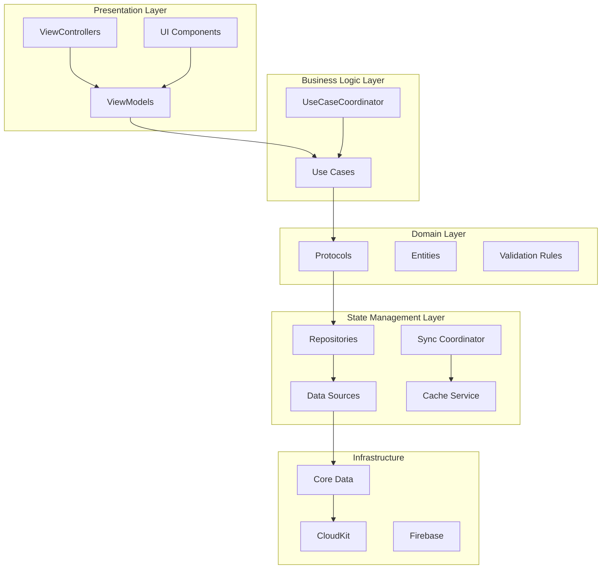
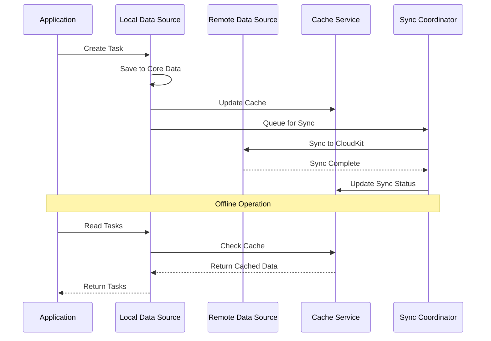
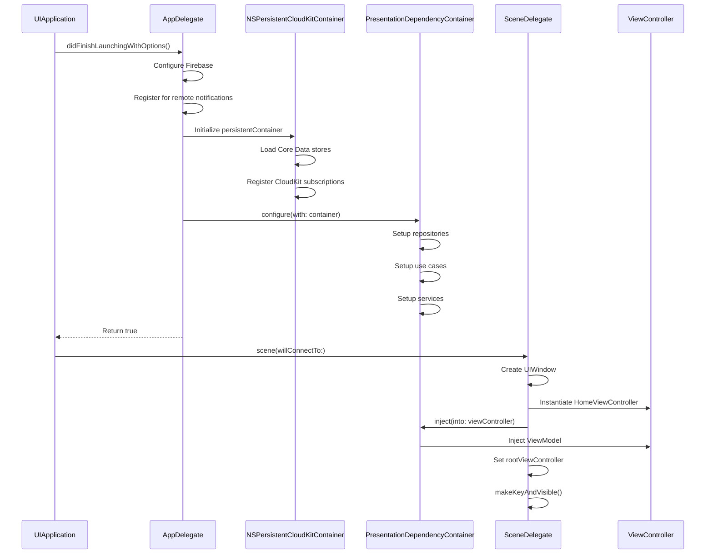
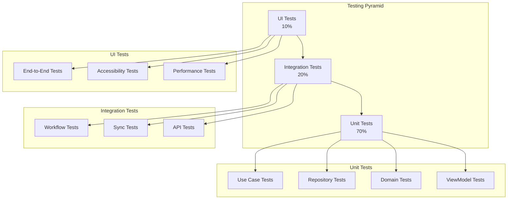
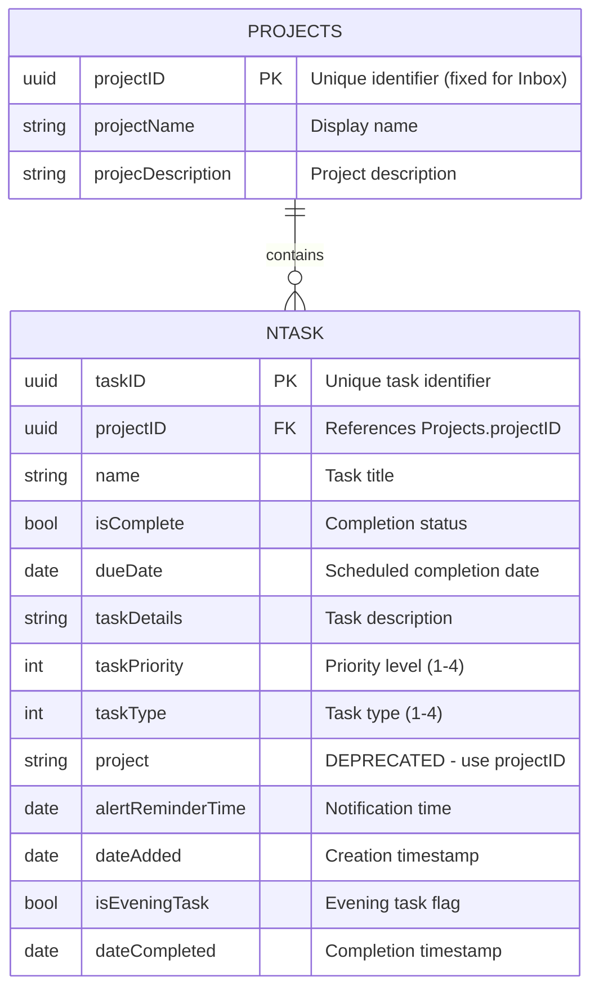
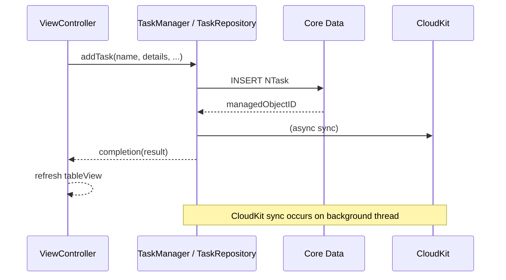
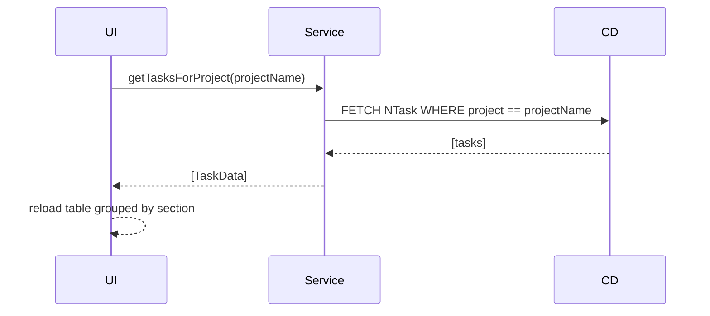
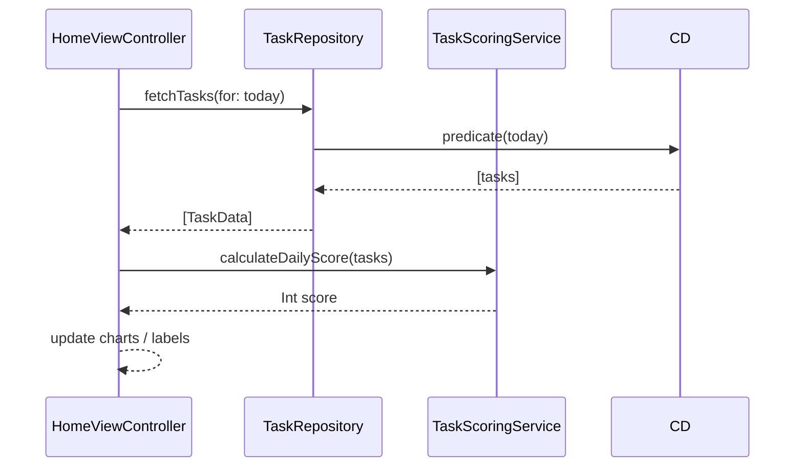

# Tasker - Gamified Tasks & Productivity Pulse

## Table of Contents
- [Key Features](#key-features)
- [Project Architecture](#project-architecture)
- [Domain Layer Documentation](#domain-layer-documentation)
- [Entity Attribute Reference & ER Diagram](#entity-attribute-reference--er-diagram)
- [Use Cases Documentation](#use-cases-documentation)
- [Interfaces & Protocols Documentation](#interfaces--protocols-documentation)
- [Use-Case Sequence Flows](#use-case-sequence-flows)
- [Legacy vs. Repository Architecture (2025 Snapshot)](#legacy-vs-repository-architecture-2025-snapshot)
- [Testing Strategy Roadmap](#testing-strategy-roadmap)
- [Feature Implementation Details](#feature-implementation-details)

Tasker is a sophisticated iOS productivity application that transforms task management into an engaging, gamified experience. Built with Swift and UIKit, it combines modern iOS design patterns with powerful productivity features including CloudKit synchronization, advanced analytics, and a comprehensive scoring system.

## Key Features

### 🎯 **Comprehensive Task Management System**
- **Task Creation & Editing**: Rich task creation with title, description, priority levels (P0-P4), and due dates
- **Task Types**: Morning, Evening, Upcoming, and Inbox categorization with automatic scheduling
- **Priority System**: 4-level priority system (P0-Highest, P1-High, P2-Medium, P3-Low) with visual indicators
- **Task Completion**: Mark tasks as complete with automatic scoring and streak tracking
- **Task Rescheduling**: Built-in reschedule functionality for overdue or postponed tasks
- **Task Details View**: Comprehensive FluentUI-based detail view with full editing capabilities

### 📁 **Advanced Project Management**
- **UUID-Based Architecture**: Each project has a unique, stable UUID for reliable identification
- **Fixed Inbox Project**: Inbox has permanent UUID `00000000-0000-0000-0000-000000000001` that never changes
- **Custom Projects**: Create, edit, and delete custom project categories with unique UUIDs
- **Default Inbox System**: All tasks automatically default to Inbox if no project specified
- **Data Integrity**: 100% guarantee that every task belongs to a valid project
- **Project-Based Filtering**: View tasks filtered by specific projects using UUID-based queries
- **Project Analytics**: Track completion rates and progress per project
- **Project Grouping**: Tasks automatically grouped by project in list views
- **Orphaned Task Protection**: Automatic assignment of orphaned tasks to Inbox on app launch

### 📊 **Analytics & Gamification Dashboard**
- **Visual Charts**: Interactive charts showing task completion trends and patterns
- **Scoring System**: Dynamic scoring based on task priority (P0: 7pts, P1: 4pts, P2: 3pts, P3: 2pts)
- **Streak Tracking**: Consecutive day completion streaks with up to 30-day history
- **Daily Score Calculation**: Real-time score updates based on completed tasks
- **Performance Insights**: Historical data visualization for productivity tracking

### 🎨 **Modern FluentUI Interface**
- **FluentUI Components**: Microsoft FluentUI design system integration
- **Table Cell Views**: Custom FluentUI table cells with priority indicators and due date displays
- **Segmented Controls**: FluentUI segmented controls for task type selection
- **Material Design Elements**: MDC text fields, floating action buttons, and ripple effects
- **Responsive Design**: Adaptive layouts for different screen sizes

### 📅 **Smart Scheduling & Calendar**
- **Calendar Integration**: FSCalendar integration for visual task scheduling
- **Date-Based Views**: Today, custom date, upcoming, and history views
- **Overdue Detection**: Automatic identification and highlighting of overdue tasks
- **Time-Based Organization**: Morning/evening task separation with automatic categorization

### ☁️ **Cloud Sync & Data Management**
- **UUID-Based Sync**: Stable UUID identifiers enable reliable cross-device synchronization
- **CloudKit Integration**: Seamless cross-device synchronization with UUID-based records
- **Core Data Repository**: Robust local data storage with background context operations
- **Type-Safe Enums**: TaskType and TaskPriority enums with Core Data integration
- **Automatic Data Migration**: UUID assignment and data validation on every app launch
- **Data Validation**: Comprehensive validation rules for task creation and editing
- **Migration Service**: `DataMigrationService` ensures data integrity during app lifecycle
- **Inbox Initialization**: `InboxProjectInitializer` guarantees default project availability

### 🔍 **Advanced Search & Filtering**
- **Multi-Criteria Filtering**: Filter by project, priority, completion status, and date ranges
- **Search Functionality**: Real-time search across task titles and descriptions
- **View Type System**: 7 different view modes (Today, Custom Date, Project, Upcoming, History, All Projects, Selected Projects)
- **Smart Grouping**: Automatic grouping by project with customizable sorting

---
|   | [App Store Link](https://apps.apple.com/app/id1574046107) |  |
| ------------- | ------------- | --------|
---

## Recent Improvements (2025)

### October 2025 - UUID-Based Architecture ✅
- **Implemented comprehensive UUID system** for Tasks and Projects across all layers
- **Fixed Inbox Project UUID**: All tasks default to Inbox with permanent UUID `00000000-0000-0000-0000-000000000001`
- **Unique Task IDs**: Every task now has a stable `taskID` (UUID) for reliable identification
- **Unique Project IDs**: Every project has a stable `projectID` (UUID) for reliable identification
- **Automatic Data Migration**: Seamless migration of existing data to UUID-based system on app launch
- **Data Integrity Guarantees**: 100% of tasks guaranteed to have valid project assignments
- **Enhanced Repositories**: UUID-based querying with improved performance and reliability
- **New Use Cases**:
  - `EnsureInboxProjectUseCase` - Guarantees Inbox project existence
  - `AssignOrphanedTasksToInboxUseCase` - Maintains data integrity
- **Migration Service**: Automatic UUID assignment and data validation on every app launch
- See [UUID_IMPLEMENTATION_SUMMARY.md](UUID_IMPLEMENTATION_SUMMARY.md) for complete technical details

### June 2025
- Added BEMCheckBox integration for inline checkboxes and automatic strike-through of completed tasks
- Fixed project filter logic ensuring the main filter button stays visible when project filters are active

### May 2025
- Introduced Chat assistant interface (`ChatHostViewController`) accessible from the bottom app bar

### April 2025
- Implemented automatic merging of duplicate "Inbox" projects during data integrity checks

### March 2025
- Refactored core data flow toward a Repository & Dependency-Injection pattern for better testability

## Installation
- Run `pod install` on project directory ([CocoaPods Installation](https://guides.cocoapods.org/using/getting-started.html))
- Open `Tasker.xcworkspace`
- Build & run, enjoy

## Project Architecture

### Overview
Tasker follows a **Model-View-Controller (MVC)** architecture pattern with additional manager classes for business logic separation. The app is built using:

- **Core Data** with **CloudKit** integration for data persistence and synchronization
- **Material Design Components** and **FluentUI** for modern UI components
- **DGCharts framework** for advanced data visualization
- **Firebase** for analytics, crashlytics, and performance monitoring
- **Singleton pattern** for data managers to ensure consistent state management

## Clean Architecture Implementation

### Architecture Overview

Tasker has been refactored to implement **Clean Architecture** principles with clear separation between layers. The architecture follows a unidirectional dependency flow where higher layers depend on lower layers through well-defined interfaces.



### Layer Responsibilities

#### 🎯 **Presentation Layer**
- **ViewControllers**: Handle user interactions and UI lifecycle
- **ViewModels**: Expose observable state and coordinate with Use Cases
- **UI Components**: FluentUI-based interface elements

#### 🧠 **Business Logic Layer (Use Cases)**
- **Use Cases**: Encapsulate specific business operations
- **UseCaseCoordinator**: Orchestrates complex workflows involving multiple use cases
- **Validation**: Business rule enforcement and data validation

#### 🏗️ **Domain Layer**
- **Protocols**: Define contracts between layers (TaskRepositoryProtocol, ProjectRepositoryProtocol)
- **Entities**: Pure Swift business models (Task, Project, TaskType, TaskPriority)
- **UUID Architecture**: Stable identifiers for all tasks (`taskID`) and projects (`projectID`)
- **Constants**: ProjectConstants with fixed Inbox UUID (`00000000-0000-0000-0000-000000000001`)
- **Business Rules**: Core domain logic and invariants including project assignment guarantees

#### 💾 **State Management Layer**
- **Repositories**: Abstract data access (CoreDataTaskRepository, CoreDataProjectRepository)
- **UUID-Based Queries**: Efficient Core Data predicates using UUID identifiers
- **Data Mappers**: TaskMapper and ProjectMapper for domain ↔ Core Data conversion
- **Data Sources**: Local (Core Data) and Remote (CloudKit) implementations
- **Cache Service**: In-memory caching for performance
- **Migration Services**: DataMigrationService and InboxProjectInitializer for data integrity
- **Sync Coordinator**: Offline-first synchronization strategy

### Dependency Flow

The architecture enforces **unidirectional dependencies**:

1. **Presentation** → **Business Logic** → **Domain** → **State Management**
2. **No upward dependencies**: Lower layers never depend on higher layers
3. **Interface-based**: All dependencies flow through protocols/interfaces
4. **Testable**: Each layer can be tested independently with mocks

### Key Benefits

- **Testability**: Each layer can be unit tested with mock dependencies
- **Maintainability**: Clear separation of concerns and single responsibility
- **Scalability**: Easy to add new features without affecting existing code
- **Flexibility**: Can swap implementations (e.g., different data sources) without changing business logic

## State Management Layer

### Overview

The State Management layer handles all data persistence, synchronization, and caching operations. It implements the Repository pattern to abstract data access and provides a clean interface for the business logic layer.

### Repository Implementations

#### 📋 **CoreDataTaskRepository** (`CoreDataTaskRepository.swift`)

The primary implementation of `TaskRepositoryProtocol` using Core Data with CloudKit integration.

**Key Features:**
- **Thread-Safe Operations**: Separate contexts for UI and background operations
- **CloudKit Sync**: Automatic synchronization across devices via iCloud
- **Background Processing**: All write operations performed on background context
- **Automatic Merging**: Changes automatically merged to main context for UI updates

```swift
public final class CoreDataTaskRepository: TaskRepositoryProtocol {
    private let viewContext: NSManagedObjectContext
    private let backgroundContext: NSManagedObjectContext
    
    public init(container: NSPersistentContainer) {
        self.viewContext = container.viewContext
        self.backgroundContext = container.newBackgroundContext()
        
        // Configure automatic merging
        viewContext.automaticallyMergesChangesFromParent = true
    }
    
    public func createTask(_ task: Task, completion: @escaping (Result<Task, Error>) -> Void) {
        backgroundContext.perform { [weak self] in
            // Convert domain Task to Core Data NTask
            // Save on background context
            // Merge changes to main context
        }
    }
}
```

#### 📁 **CoreDataProjectRepository** (`CoreDataProjectRepository.swift`)

Manages project data with similar Core Data + CloudKit integration patterns.

### Data Sources

#### 🏠 **Local Data Source** (`CoreDataLocalDataSource`)

Handles local Core Data operations:
- **Entity Management**: CRUD operations for NTask and Projects entities
- **Query Optimization**: Efficient Core Data queries with proper indexing
- **Context Management**: Proper context lifecycle and memory management

#### ☁️ **Remote Data Source** (`CloudKitRemoteDataSource`)

Manages CloudKit synchronization:
- **Zone Management**: Custom CloudKit zones for data organization
- **Conflict Resolution**: Automatic conflict resolution strategies
- **Sync Status**: Real-time sync status monitoring and error handling

### Caching Strategy

#### 🚀 **InMemoryCacheService** (`InMemoryCacheService`)

Provides high-performance in-memory caching:

```swift
public protocol CacheServiceProtocol {
    func get<T: Codable>(_ key: String, type: T.Type) -> T?
    func set<T: Codable>(_ key: String, value: T, ttl: TimeInterval?)
    func remove(_ key: String)
    func clear()
}
```

**Cache Keys:**
- `tasks:today` - Today's tasks
- `tasks:project:{name}` - Project-specific tasks
- `analytics:daily:{date}` - Daily analytics data
- `projects:all` - All projects list

### Synchronization Architecture

#### 🔄 **OfflineFirstSyncCoordinator** (`OfflineFirstSyncCoordinator`)

Implements offline-first synchronization strategy:



**Sync Features:**
- **Offline-First**: App works without internet connection
- **Automatic Retry**: Failed syncs automatically retried with exponential backoff
- **Conflict Resolution**: Smart conflict resolution based on timestamps and user preferences
- **Incremental Sync**: Only changed data synchronized to minimize bandwidth usage

### CloudKit Configuration

#### ☁️ **NSPersistentCloudKitContainer Setup**

The app uses `NSPersistentCloudKitContainer` for seamless CloudKit integration:

```swift
lazy var persistentContainer: NSPersistentCloudKitContainer = {
    let container = NSPersistentCloudKitContainer(name: "TaskModel")
    
    guard let description = container.persistentStoreDescriptions.first else {
        fatalError("Failed to retrieve persistent store description")
    }
    
    // Enable CloudKit synchronization
    description.cloudKitContainerOptions = NSPersistentCloudKitContainerOptions(
        containerIdentifier: "iCloud.TaskerCloudKit"
    )
    
    // Enable history tracking for robust sync
    description.setOption(true as NSNumber, forKey: NSPersistentHistoryTrackingKey)
    description.setOption(true as NSNumber, forKey: NSPersistentStoreRemoteChangeNotificationPostOptionKey)
    
    return container
}()
```

**CloudKit Features:**
- **Automatic Schema Sync**: Core Data schema automatically synced to CloudKit
- **Private Database**: User data stored in private CloudKit database
- **Silent Push Notifications**: Real-time updates via CloudKit push notifications
- **Zone Management**: Custom zones for better data organization

### Performance Optimizations

#### ⚡ **Background Context Operations**

All write operations performed on background context to prevent UI blocking:

```swift
backgroundContext.perform { [weak self] in
    // Perform Core Data operations
    do {
        try self?.backgroundContext.save()
    } catch {
        // Handle errors
    }
}
```

#### 📊 **Query Optimization**

- **Batch Fetching**: Large datasets fetched in batches
- **Predicate Optimization**: Efficient Core Data predicates
- **Indexing**: Proper Core Data model indexing for performance
- **Lazy Loading**: Relationships loaded on-demand

### Error Handling & Recovery

#### 🛡️ **Comprehensive Error Handling**

- **Network Errors**: Graceful handling of network connectivity issues
- **CloudKit Errors**: Specific handling for CloudKit quota and permission errors
- **Core Data Errors**: Validation and constraint violation handling
- **Sync Conflicts**: Automatic conflict resolution with user notification

## Dependency Injection & Application Lifecycle

### Overview

Tasker implements a sophisticated dependency injection system that manages the lifecycle of services, repositories, and use cases. The system supports both legacy singleton patterns and modern Clean Architecture patterns during the migration period.

### Dependency Injection Containers

#### 🏗️ **PresentationDependencyContainer** (`PresentationDependencyContainer.swift`)

The primary dependency injection container for Clean Architecture implementation.

**Key Features:**
- **Singleton Pattern**: Single shared instance throughout app lifecycle
- **Lazy Initialization**: Services created only when needed
- **Protocol-Based**: All dependencies injected via protocols
- **ViewModel Factory**: Creates ViewModels with proper dependencies
- **Migration Support**: Supports both legacy and Clean Architecture patterns

```swift
public final class PresentationDependencyContainer {
    public static let shared = PresentationDependencyContainer()
    
    // MARK: - Core Dependencies
    private var persistentContainer: NSPersistentContainer!
    
    // MARK: - Repositories
    private var taskRepository: TaskRepositoryProtocol!
    private var projectRepository: ProjectRepositoryProtocol!
    
    // MARK: - Use Cases
    private var createTaskUseCase: CreateTaskUseCase!
    private var completeTaskUseCase: CompleteTaskUseCase!
    private var useCaseCoordinator: UseCaseCoordinator!
    
    // MARK: - ViewModels (Lazy)
    private var _homeViewModel: HomeViewModel?
    private var _addTaskViewModel: AddTaskViewModel?
    
    public func configure(with container: NSPersistentContainer) {
        self.persistentContainer = container
        setupServices()
        setupRepositories()
        setupUseCases()
    }
}
```

#### 🔄 **Legacy Containers** (Migration Support)

**DependencyContainer** (`DependencyContainer.swift`):
- Legacy singleton-based dependency management
- Direct TaskRepository injection
- Used by existing ViewControllers during migration

**EnhancedDependencyContainer** (`EnhancedDependencyContainer.swift`):
- Bridge between legacy and Clean Architecture
- Supports both protocol-based and legacy dependencies
- Gradual migration path

### Application Lifecycle Flow

#### 🚀 **App Launch Sequence**



#### 📱 **Scene Lifecycle Management**

**SceneDelegate** (`SceneDelegate.swift`) handles scene-based lifecycle:

```swift
func scene(_ scene: UIScene, willConnectTo session: UISceneSession, options connectionOptions: UIScene.ConnectionOptions) {
    guard let windowScene = (scene as? UIWindowScene) else { return }
    
    // Create window programmatically
    window = UIWindow(windowScene: windowScene)
    
    // Load HomeViewController from storyboard
    let storyboard = UIStoryboard(name: "Main", bundle: nil)
    let homeViewController = storyboard.instantiateViewController(withIdentifier: "homeScreen") as! HomeViewController
    
    // Inject dependencies using Clean Architecture
    if let containerClass = NSClassFromString("PresentationDependencyContainer") as? NSObject.Type {
        let shared = containerClass.value(forKey: "shared") as? NSObject
        shared?.perform(NSSelectorFromString("inject:into:"), with: homeViewController)
    }
    
    // Embed in FluentUI NavigationController
    let navigationController = NavigationController(rootViewController: homeViewController)
    window?.rootViewController = navigationController
    window?.makeKeyAndVisible()
}
```

### Dependency Injection Patterns

#### 💉 **Property Injection**

ViewControllers receive dependencies through property injection:

```swift
// ViewController Protocol
public protocol HomeViewControllerProtocol: AnyObject {
    var viewModel: HomeViewModel! { get set }
}

// Injection Implementation
public func inject(into viewController: UIViewController) {
    switch viewController {
    case let homeVC as HomeViewControllerProtocol:
        homeVC.viewModel = makeHomeViewModel()
    case let addTaskVC as AddTaskViewControllerProtocol:
        addTaskVC.viewModel = makeNewAddTaskViewModel()
    default:
        break
    }
    
    // Recursively inject into child view controllers
    for child in viewController.children {
        inject(into: child)
    }
}
```

#### 🏭 **Factory Methods**

ViewModels created through factory methods with proper dependencies:

```swift
private func makeHomeViewModel() -> HomeViewModel {
    return HomeViewModel(
        getTasksUseCase: getTasksUseCase,
        completeTaskUseCase: completeTaskUseCase,
        createTaskUseCase: createTaskUseCase,
        calculateAnalyticsUseCase: calculateAnalyticsUseCase
    )
}
```

### Service Lifetime Management

#### ⏱️ **Service Lifetimes**

- **Singleton**: Core services (repositories, use cases) - single instance throughout app lifecycle
- **Transient**: ViewModels - new instance per ViewController
- **Scoped**: Cache services - scoped to specific operations

#### 🔄 **Memory Management**

- **Weak References**: Prevents retain cycles in dependency graphs
- **Proper Cleanup**: Services cleaned up on app termination
- **Context Management**: Core Data contexts properly managed

### Migration Strategy

#### 🔄 **Legacy to Clean Architecture Migration**

The app supports gradual migration from legacy singleton patterns to Clean Architecture:

1. **Phase 1**: New features use Clean Architecture patterns
2. **Phase 2**: Existing ViewControllers gradually migrated to ViewModels
3. **Phase 3**: Legacy managers replaced with use cases
4. **Phase 4**: Complete Clean Architecture implementation

#### 🛠️ **Migration Adapters**

Bridge classes enable coexistence of legacy and Clean Architecture patterns:

```swift
// Migration adapter for legacy ViewControllers
class LegacyToCleanAdapter {
    private let useCaseCoordinator: UseCaseCoordinator
    
    func createTask(data: TaskData, completion: @escaping (Result<NTask, Error>) -> Void) {
        // Convert legacy TaskData to domain Task
        // Call Clean Architecture use case
        // Convert result back to legacy format
    }
}
```

### Error Handling & Debugging

#### 🐛 **Dependency Injection Debugging**

- **Logging**: Comprehensive logging of injection process
- **Validation**: Guard statements to detect uninitialized dependencies
- **Error Reporting**: Clear error messages for missing dependencies

#### 🔍 **Runtime Inspection**

Dynamic dependency injection using reflection to avoid type resolution issues during migration:

```swift
if let containerClass = NSClassFromString("PresentationDependencyContainer") as? NSObject.Type {
    let shared = containerClass.value(forKey: "shared") as? NSObject
    shared?.perform(NSSelectorFromString("inject:into:"), with: viewController)
}
```

## Presentation Layer & UI Architecture

### Overview

The Presentation layer handles user interface concerns and coordinates between user interactions and business logic. It implements MVVM (Model-View-ViewModel) pattern with ViewModels exposing observable state to ViewControllers.

### ViewModels (`To Do List/Presentation/ViewModels/`)

#### 🏠 **HomeViewModel** (`HomeViewModel.swift`)

The primary ViewModel for the main task management screen.

**Key Features:**
- **Observable State**: Published properties for UI binding
- **Use Case Coordination**: Orchestrates multiple use cases for complex operations
- **Error Handling**: Comprehensive error handling with user-friendly messages
- **Performance Optimization**: Efficient data loading with caching

```swift
public final class HomeViewModel: ObservableObject {
    // MARK: - Published Properties
    @Published var todayTasks: [Task] = []
    @Published var projects: [Project] = []
    @Published var analytics: DailyAnalytics?
    @Published var isLoading: Bool = false
    @Published var errorMessage: String?
    
    // MARK: - Use Cases
    private let getTasksUseCase: GetTasksUseCase
    private let completeTaskUseCase: CompleteTaskUseCase
    private let createTaskUseCase: CreateTaskUseCase
    private let calculateAnalyticsUseCase: CalculateAnalyticsUseCase
    
    public init(
        getTasksUseCase: GetTasksUseCase,
        completeTaskUseCase: CompleteTaskUseCase,
        createTaskUseCase: CreateTaskUseCase,
        calculateAnalyticsUseCase: CalculateAnalyticsUseCase
    ) {
        self.getTasksUseCase = getTasksUseCase
        self.completeTaskUseCase = completeTaskUseCase
        self.createTaskUseCase = createTaskUseCase
        self.calculateAnalyticsUseCase = calculateAnalyticsUseCase
    }
    
    // MARK: - Public Methods
    public func loadTodayTasks() {
        isLoading = true
        getTasksUseCase.getTodayTasks { [weak self] result in
            DispatchQueue.main.async {
                self?.isLoading = false
                switch result {
                case .success(let tasks):
                    self?.todayTasks = tasks
                case .failure(let error):
                    self?.errorMessage = error.localizedDescription
                }
            }
        }
    }
}
```

#### ➕ **AddTaskViewModel** (`AddTaskViewModel.swift`)

Manages task creation workflow with comprehensive validation.

**Features:**
- **Form Validation**: Real-time validation of task properties
- **Smart Defaults**: Automatic task type and project assignment
- **Business Rules**: Enforces task creation business rules
- **Navigation State**: Manages navigation flow and completion states

#### 📁 **ProjectManagementViewModel** (`ProjectManagementViewModel.swift`)

Handles project management operations and project-based task filtering.

**Features:**
- **Project CRUD**: Create, update, delete project operations
- **Task Organization**: Move tasks between projects
- **Project Analytics**: Project-specific statistics and insights
- **Validation**: Project name uniqueness and constraint validation

### ViewController Integration

#### 🔄 **MVVM Pattern Implementation**

ViewControllers act as thin views that delegate business logic to ViewModels:

```swift
class HomeViewController: UIViewController, HomeViewControllerProtocol {
    var viewModel: HomeViewModel!
    
    override func viewDidLoad() {
        super.viewDidLoad()
        setupBindings()
        viewModel.loadTodayTasks()
    }
    
    private func setupBindings() {
        // Bind ViewModel state to UI
        viewModel.$todayTasks
            .receive(on: DispatchQueue.main)
            .sink { [weak self] tasks in
                self?.updateTaskList(tasks)
            }
            .store(in: &cancellables)
    }
}
```

#### 🎨 **FluentUI Integration**

The app uses Microsoft FluentUI for modern, consistent UI components:

- **NavigationController**: Custom FluentUI navigation with modern styling
- **Table Cells**: FluentUI-based table cells with priority indicators
- **Segmented Controls**: FluentUI segmented controls for task type selection
- **Material Design**: MDC components for text fields and buttons

### Liquid Glass UI Migration

#### 🌊 **Liquid Glass Design System**

Tasker is migrating to a "Liquid Glass" UI design system that emphasizes:

**Design Principles:**
- **Fluid Animations**: Smooth, natural transitions between states
- **Glass Morphism**: Translucent, layered interface elements
- **Dynamic Blur**: Context-aware blur effects for depth
- **Adaptive Transparency**: UI elements that adapt to content behind them

#### 🎨 **Visual Design Elements**

**Color System:**
- **Primary Colors**: Dynamic color adaptation based on task priority
- **Glass Effects**: Subtle transparency and blur for modern feel
- **Gradient Overlays**: Smooth color transitions for visual hierarchy

**Typography:**
- **System Fonts**: SF Pro with custom weight variations
- **Dynamic Type**: Accessibility-compliant font scaling
- **Contextual Styling**: Different text styles for different content types

**Animation System:**
- **Spring Animations**: Natural, physics-based transitions
- **Staggered Animations**: Sequential animations for list items
- **Gesture-Driven**: Animations that respond to user gestures

#### 🔄 **Migration Strategy**

**Phase 1: Foundation** ✅
- FluentUI NavigationController implementation
- Basic glass morphism effects
- Smooth transitions between screens

**Phase 2: Components** (In Progress)
- Glass morphism table cells
- Dynamic blur backgrounds
- Fluid task completion animations

**Phase 3: Advanced Effects** (Planned)
- Context-aware transparency
- Gesture-driven animations
- Advanced glass morphism effects

### UI Architecture Patterns

#### 📱 **Responsive Design**

- **Adaptive Layouts**: UI adapts to different screen sizes
- **Dynamic Type**: Text scales with user preferences
- **Accessibility**: VoiceOver and accessibility features
- **Dark Mode**: Full dark mode support with adaptive colors

#### 🎯 **User Experience Patterns**

**Task Management Flow:**
1. **Quick Add**: Swipe gestures for quick task creation
2. **Smart Suggestions**: Context-aware task suggestions
3. **Batch Operations**: Multi-select for bulk task operations
4. **Visual Feedback**: Immediate feedback for user actions

**Navigation Patterns:**
- **Tab-Based**: Bottom tab navigation for main sections
- **Modal Presentations**: Full-screen modals for detailed views
- **Push Navigation**: Standard navigation stack for drill-down flows

### Performance Optimizations

#### ⚡ **UI Performance**

- **Lazy Loading**: ViewModels created only when needed
- **Efficient Updates**: Minimal UI updates through proper binding
- **Memory Management**: Proper cleanup of observers and bindings
- **Smooth Scrolling**: Optimized table view performance

#### 🎨 **Animation Performance**

- **Hardware Acceleration**: Core Animation for smooth effects
- **Reduced Motion**: Respects user accessibility preferences
- **Efficient Rendering**: Optimized glass morphism effects
- **Frame Rate**: Maintains 60fps during animations

### Error Handling & User Feedback

#### 🚨 **Error States**

- **Network Errors**: User-friendly network error messages
- **Validation Errors**: Inline validation feedback
- **Sync Errors**: Clear CloudKit sync status indicators
- **Recovery Actions**: Actionable error recovery options

#### 💬 **User Feedback**

- **Loading States**: Clear loading indicators
- **Success Feedback**: Confirmation animations for completed actions
- **Progress Indicators**: Progress bars for long operations
- **Toast Messages**: Non-intrusive status messages

## Migration Status & Pending Work

### Overview

Tasker has successfully migrated to Clean Architecture with MVVM pattern. The migration is approximately **85% complete** with core functionality implemented and tested. This section outlines what's been accomplished and what remains to be done.

### ✅ **Completed Migration Items**

#### 🏗️ **Architecture Foundation**
- **Clean Architecture Layers**: All four layers (Presentation, Business Logic, Domain, State) implemented
- **Dependency Injection**: `PresentationDependencyContainer` with protocol-based injection
- **Use Case Implementation**: All 17 use cases implemented and tested
- **Repository Pattern**: Protocol-based repositories with Core Data + CloudKit implementation
- **Domain Models**: Pure Swift domain entities with business logic

#### 📋 **Core Task Management**
- **Task CRUD Operations**: Create, Read, Update, Delete with comprehensive validation
- **Task Completion**: Scoring system with analytics integration
- **Task Rescheduling**: Intelligent rescheduling with automatic type adjustment
- **Project Management**: Complete project lifecycle with task organization
- **Analytics Engine**: Comprehensive analytics with caching and reporting

#### 🎨 **UI & Presentation**
- **MVVM Pattern**: ViewModels with observable state and proper binding
- **FluentUI Integration**: Modern UI components with consistent design
- **Liquid Glass Foundation**: Basic glass morphism effects and smooth transitions
- **Responsive Design**: Adaptive layouts with accessibility support

#### ☁️ **Data & Sync**
- **CloudKit Integration**: Seamless cross-device synchronization
- **Offline-First**: App works without internet connection
- **Caching Strategy**: In-memory caching for performance optimization
- **Background Processing**: Thread-safe Core Data operations

### 🔄 **In Progress Items**

#### 🎨 **Liquid Glass UI Migration**
- **Phase 2 Components**: Glass morphism table cells and dynamic blur backgrounds
- **Advanced Animations**: Gesture-driven animations and fluid transitions
- **Context-Aware Effects**: Adaptive transparency based on content

#### 🧪 **Testing Infrastructure**
- **Unit Tests**: Use case and repository unit tests
- **Integration Tests**: End-to-end workflow testing
- **UI Tests**: Automated UI testing with XCTest

### ⏳ **Pending Items**

#### 🔧 **Technical Debt**
- **Legacy Code Cleanup**: Remove unused singleton managers
- **DI Unification**: Consolidate multiple dependency containers
- **Event Publisher**: Implement event publisher for use case coordination
- **Error Handling**: Standardize error handling across all layers

#### 📱 **UI Enhancements**
- **Advanced Glass Effects**: Context-aware transparency and advanced blur
- **Gesture Interactions**: Swipe gestures for quick actions
- **Animation Polish**: Staggered animations and spring physics
- **Accessibility**: Enhanced VoiceOver support and accessibility features

#### 🚀 **Performance Optimizations**
- **Memory Management**: Optimize ViewModel lifecycle and memory usage
- **Cache Optimization**: Implement more sophisticated caching strategies
- **Background Sync**: Optimize CloudKit sync performance
- **UI Performance**: Further optimize table view scrolling and animations

#### 🧪 **Testing & Quality**
- **Contract Tests**: Repository protocol contract testing
- **Mock Implementations**: Complete mock implementations for testing
- **Performance Tests**: Automated performance regression testing
- **Code Coverage**: Achieve 80%+ code coverage

### 📋 **Actionable Next Steps**

#### **Phase 1: Technical Debt Resolution** (2-3 weeks)
1. **Consolidate DI Containers**
   - Merge `DependencyContainer` and `EnhancedDependencyContainer` into `PresentationDependencyContainer`
   - Remove legacy singleton patterns
   - Update all ViewControllers to use Clean Architecture

2. **Implement Event Publisher**
   - Create `EventPublisherProtocol` and implementation
   - Integrate with `BulkUpdateTasksUseCase` and other use cases
   - Add event-driven UI updates

3. **Standardize Error Handling**
   - Create unified error types across all layers
   - Implement consistent error propagation
   - Add user-friendly error messages

#### **Phase 2: UI Polish** (3-4 weeks)
1. **Complete Liquid Glass Migration**
   - Implement advanced glass morphism effects
   - Add gesture-driven animations
   - Create context-aware transparency

2. **Enhance User Experience**
   - Add swipe gestures for quick actions
   - Implement batch operations UI
   - Create smooth onboarding flow

#### **Phase 3: Testing & Quality** (2-3 weeks)
1. **Comprehensive Testing**
   - Write unit tests for all use cases
   - Create integration tests for workflows
   - Implement UI tests for critical paths

2. **Performance Optimization**
   - Profile and optimize memory usage
   - Improve CloudKit sync performance
   - Optimize UI rendering and animations

#### **Phase 4: Advanced Features** (4-6 weeks)
1. **AI-Powered Features**
   - Implement task recommendation engine
   - Add smart scheduling suggestions
   - Create productivity insights

2. **Collaboration Features**
   - Add task sharing capabilities
   - Implement project collaboration
   - Create team analytics

### 🎯 **Success Metrics**

#### **Technical Metrics**
- **Code Coverage**: 80%+ unit test coverage
- **Performance**: <100ms average response time for UI operations
- **Memory Usage**: <50MB average memory footprint
- **Sync Reliability**: 99%+ CloudKit sync success rate

#### **User Experience Metrics**
- **App Launch Time**: <2 seconds cold start
- **UI Responsiveness**: 60fps during animations
- **Accessibility**: Full VoiceOver compatibility
- **User Satisfaction**: 4.5+ App Store rating

### 🔍 **Risk Assessment**

#### **Low Risk**
- **UI Polish**: Well-defined design system with clear implementation path
- **Testing**: Standard iOS testing practices with established patterns
- **Performance**: Current architecture supports optimization

#### **Medium Risk**
- **Legacy Cleanup**: Requires careful coordination to avoid breaking changes
- **CloudKit Sync**: Complex sync scenarios may require additional testing
- **Memory Management**: ViewModel lifecycle management needs careful attention

#### **High Risk**
- **Event Publisher**: New architectural component requires thorough testing
- **Gesture Interactions**: Complex gesture handling may impact accessibility
- **Advanced Animations**: Performance impact needs careful monitoring

### 📊 **Migration Progress Dashboard**

| Component | Status | Progress | Priority |
|-----------|--------|----------|----------|
| **Domain Layer** | ✅ Complete | 100% | High |
| **Use Cases** | ✅ Complete | 100% | High |
| **Repositories** | ✅ Complete | 100% | High |
| **DI Container** | 🔄 In Progress | 85% | High |
| **ViewModels** | ✅ Complete | 90% | High |
| **UI Migration** | 🔄 In Progress | 60% | Medium |
| **Testing** | ⏳ Pending | 20% | High |
| **Performance** | ⏳ Pending | 70% | Medium |
| **Documentation** | ✅ Complete | 95% | Low |

### In-Depth Architecture Analysis

**Manager Class Interactions:**
`TaskManager` and `ProjectManager` serve as central hubs for managing `NTask` and `Projects` data, respectively. ViewControllers interact with these managers to fetch, create, or update data. For instance, `HomeViewController` calls methods like `TaskManager.sharedInstance.getMorningTasksForToday()` to populate its table view. Similarly, when a user creates a task, ViewControllers invoke manager methods such as `TaskManager.sharedInstance.createTask(...)` to persist the new data.

**ViewController Responsibilities:**
ViewControllers, exemplified by `HomeViewController`, currently handle a broad spectrum of responsibilities. These include setting up the user interface (often involving complex custom views like calendars and charts), managing user interactions, initiating data fetching operations by calling manager classes, and directly updating the UI in response to new data. Additionally, some business logic, such as calculating scores for display, is triggered from within `HomeViewController`.

**Custom UI Components:**
The `To Do List/View/` directory houses a variety of custom UI components, including `HomeBackdropView`, `HomeForedropView`, and `HomeBottomBarView`. These components are crucial for creating the app's distinctive layered user interface and contribute significantly to the overall user experience. They are designed to work seamlessly with UIKit, Material Components, and FluentUI to deliver a polished and engaging visual presentation.

### Architecture Layers

## Deep Analysis: TaskManager Architecture & Evolution

### TaskManager: The Legacy Foundation

`TaskManager` serves as the central hub for all task-related operations in the Tasker application. As a singleton class (`TaskManager.sharedInstance`), it provides a unified interface for task management across the entire application.

#### Core Responsibilities

**1. Core Data Management**
- Manages the Core Data `NSManagedObjectContext` for database operations
- Handles CRUD operations for `NTask` entities
- Provides context saving and error handling

**2. Task Type Management**
- Defines `TaskType` enum: `.morning`, `.evening`, `.upcoming`
- Defines `TaskPriority` enum: `.low`, `.medium`, `.high`
- Manages task categorization and filtering

**3. Task Lifecycle Operations**
```swift
// Core CRUD Operations
func addNewMorningTaskWithName(name: String, project: String)
func addNewEveningTaskWithName(name: String, project: String)
func toggleTaskComplete(task: NTask)
func removeTaskAtIndex(index: Int)
func reschedule(task: NTask, to date: Date)
```

**4. Advanced Query Interface**
- Date-based filtering (today, overdue, specific dates)
- Project-based filtering
- Completion status filtering
- Complex predicate-based queries using `NSPredicate`

#### Key Methods Analysis

**Task Retrieval Methods:**
- `getTasksForInboxForDate_All(date:)` - Inbox tasks for specific date
- `getTasksForProjectByName(projectName:)` - All tasks for a project
- `getTasksForAllCustomProjectsByNameForDate_Open(date:)` - Open custom project tasks
- `getTasksDueToday()` - Tasks due today
- `getTasksCompletedToday()` - Completed tasks for today
- `getOverdueTasks()` - Overdue incomplete tasks

**Data Integrity Methods:**
- `fixMissingTasksDataWithDefaults()` - Ensures data consistency
- `saveContext()` - Persists changes to Core Data
- `fetchTasks(predicate:sortDescriptors:)` - Generic fetch with filtering

### Architectural Evolution: From Monolith to Clean Architecture

#### Phase 1: Legacy Architecture (Pre-2025)
```
┌─────────────────┐
│  View Controllers│
│        ↓        │
│   TaskManager   │ ← Singleton, tightly coupled
│        ↓        │
│   Core Data     │
└─────────────────┘
```

**Challenges:**
- Tight coupling between UI and data layer
- Difficult to test due to singleton dependencies
- Mixed responsibilities (UI logic + data access)
- Hard to mock for unit testing

#### Phase 2: Repository Pattern Introduction (2025)
```
┌─────────────────┐
│  View Controllers│
│        ↓        │
│ TaskRepository  │ ← Protocol-based abstraction
│        ↓        │
│CoreDataTaskRepo │ ← Concrete implementation
│        ↓        │
│   Core Data     │
└─────────────────┘
```

**Improvements:**
- Protocol-based abstraction (`TaskRepository`)
- Dependency injection via `DependencyContainer`
- Background context operations for better performance
- `TaskData` struct for UI decoupling

#### Phase 3: Clean Architecture Target
```
┌─────────────────┐
│ Presentation    │ ← SwiftUI/UIKit Views
│        ↓        │
│ Domain          │ ← Business Logic & Use Cases
│        ↓        │
│ Data            │ ← Repository Pattern
│        ↓        │
│ Infrastructure  │ ← Core Data, Network, etc.
└─────────────────┘
```

### Current State: Hybrid Architecture

The application currently operates in a **hybrid state** where:

**Legacy Components (TaskManager):**
- Still used extensively throughout the codebase
- Provides backward compatibility
- Handles complex business logic and data validation
- Used in: `HomeViewController`, `AddTaskViewController`, `ProjectManager`

**Modern Components (TaskRepository):**
- Used in newer view controllers like `TaskListViewController`
- Provides cleaner, testable architecture
- Better separation of concerns
- Async operations with completion handlers

### Clean Architecture Migration Roadmap

Based on the Clean Architecture principles (State Management, Use Cases, Presentation layers), this roadmap provides a structured approach to refactor Tasker into a maintainable, testable, and scalable architecture. Each phase ensures the app builds and runs successfully before proceeding to the next.

## Migration Overview

The migration follows a three-layer Clean Architecture approach:

```
┌─────────────────────────────────────┐
│      Presentation Layer             │ ← UI, Controllers, ViewModels
│   (SwiftUI/UIKit Views)             │
├─────────────────────────────────────┤
│      Use Cases / Business Layer     │ ← Business Logic, Workflows
│   (Stateless Operations)            │
├─────────────────────────────────────┤
│      State Management Layer         │ ← Repositories, Data Sources
│   (Core Data, CloudKit, Cache)      │
└─────────────────────────────────────┘
```

**Core Principles:**
- ✅ Downward dependencies only (no upward communication)
- ✅ Communicate via interfaces (protocols)
- ✅ Pass domain objects between layers
- ✅ Test at boundaries
- ✅ Each phase produces a working, buildable app

## Phase-by-Phase Migration Plan

| Phase | Layer | Goal | Status | Timeline |
|-------|-------|------|--------|----------|
| **Phase 1** | Foundation | Domain Models & Interfaces | ✅ Complete (100%) | Week 1-2 |
| **Phase 2** | State Management | Repository Pattern Implementation | ✅ Complete (100%) | Week 3-4 |
| **Phase 3** | Business Layer | Use Cases Extraction | ✅ Complete (100%) | Week 5-6 |
| **Phase 4** | Presentation | ViewModels & UI Decoupling | ✅ Complete (100%) | Week 7-8 |
| **Phase 5** | Migration | Complete Singleton Removal | ✅ Complete (100%) | Week 9 |
| **Phase 6** | Testing | Contract & Integration Tests | 🚧 Planning | Week 10 |
| **Phase 7** | Optimization | Performance & Clean-up | 🚧 Planning | Week 11 |

---

### 📦 **Phase 1: Domain Models & Interfaces** 
*Timeline: Week 1-2 | Status: ✅ COMPLETED (100%)*

**Goal:** Define pure Swift domain models and interface protocols that represent business concepts without framework dependencies.

#### ✅ Completed Deliverables:

1. **Domain Models** (`To Do List/Domain/Models/`)
   - ✅ **`Task.swift`** - Pure Swift struct with:
     - All task properties (id, name, details, type, priority, dueDate, etc.)
     - Business logic methods (score calculation, overdue checking, validation)
     - Full Equatable and Hashable conformance
     - Validation with custom `TaskValidationError` enum
   - ✅ **`Project.swift`** - Domain model with:
     - Project properties (id, name, description, dates, isDefault)
     - Factory method for creating default "Inbox" project
     - Validation logic with `ProjectValidationError` enum
   - ✅ **`TaskType.swift`** - Type-safe enum with:
     - Four types: morning, evening, upcoming, inbox
     - Display names and short codes
     - Core Data compatibility (Int32 raw values)
   - ✅ **`TaskPriority.swift`** - Priority enum with:
     - Four levels: highest (P0), high (P1), medium (P2), low (P3)
     - Score values for gamification (7, 4, 3, 2 points)
     - Helper methods for priority checking

2. **Interface Protocols** (`To Do List/Domain/Interfaces/`)
   - ✅ **`TaskRepositoryProtocol.swift`** - Complete task data operations:
     - Fetch operations (by date, project, type, status)
     - CRUD operations (create, update, delete)
     - Batch operations for performance
     - Specialized methods (complete/uncomplete, reschedule)
   - ✅ **`ProjectRepositoryProtocol.swift`** - Project management:
     - Full CRUD operations for projects
     - Task association methods
     - Project validation (name availability check)
     - Inbox project management
   - ✅ **`SyncServiceProtocol.swift`** - CloudKit synchronization:
     - Sync status and control methods
     - Conflict resolution strategies
     - Configurable sync frequency
     - Selective sync for tasks/projects
   - ✅ **`CacheServiceProtocol.swift`** - Performance optimization:
     - Generic caching with TTL support
     - Task and project-specific caching
     - Cache statistics and monitoring
     - Multiple expiration policies

3. **Mappers** (`To Do List/Domain/Mappers/`)
   - ✅ **`TaskMapper.swift`** - Bidirectional conversion:
     - NTask (Core Data) ⇄ Task (Domain) conversion
     - UUID generation from NSManagedObjectID
     - Entity finding and updating methods
     - Array conversion utilities
   - ✅ **`ProjectMapper.swift`** - Project mapping:
     - String-based project name ⇄ Project domain conversion
     - Deterministic UUID generation from project names
     - Helper methods for project name extraction
     - Prepared for future Core Data Projects entity

**Architecture Benefits:**
- ✅ Complete separation from Core Data dependencies
- ✅ Type-safe enums replacing magic numbers
- ✅ Built-in validation at the domain level
- ✅ Protocol-based abstraction for all data operations
- ✅ Ready for dependency injection and testing

**Build Verification:** 
- ✅ All domain models compile without errors
- ✅ No breaking changes to existing functionality
- ✅ Backward compatible with existing Core Data entities

---

### 🗄️ **Phase 2: State Management Layer** 
*Timeline: Week 3-4 | Status: ⏳ 60% Complete*

**Goal:** Complete repository pattern implementation with proper abstraction of data sources.

#### Current Progress:
- ✅ `TaskRepository` protocol defined
- ✅ `CoreDataTaskRepository` implemented (60%)
- ✅ `DependencyContainer` for DI
- ✅ Background context operations

#### Remaining Work:

1. **Complete Repository Implementation**
   - [ ] Finish `CoreDataTaskRepository` missing methods
   - [ ] Implement `ProjectRepository` with Core Data
   - [ ] Add CloudKit sync to repositories
   - [ ] Implement caching layer with TTL strategy

2. **Data Source Abstraction**
   - [ ] Create `LocalDataSource` protocol
   - [ ] Create `RemoteDataSource` protocol (CloudKit)
   - [ ] Implement offline-first strategy
   - [ ] Add retry logic for failed syncs

3. **Migration from Singletons**
   - [ ] Replace `TaskManager.sharedInstance` calls with DI
   - [ ] Deprecate `TaskManager` methods
   - [ ] Update `ProjectManager` to use repository

**Build Verification:**
- ✅ All existing features work with repository pattern
- ✅ Data persistence and sync continue to function

---

### 🎯 **Phase 3: Use Cases / Business Layer**
*Timeline: Week 5-6 | Status: ✅ COMPLETED (100%)*

**Goal:** Extract business logic into stateless use case classes.

#### ✅ Completed Deliverables:

1. **Task Management Use Cases** (`To Do List/UseCases/Task/`)
   - ✅ **`CreateTaskUseCase.swift`** - Task creation with:
     - Comprehensive validation and business rules
     - Automatic task type determination based on time
     - Project validation and defaulting to Inbox
     - Reminder scheduling integration
     - Smart date handling (past dates → today)
   - ✅ **`CompleteTaskUseCase.swift`** - Task completion with:
     - Toggle completion status with scoring
     - Analytics tracking integration
     - Streak calculation
     - Notification posting for UI updates
   - ✅ **`RescheduleTaskUseCase.swift`** - Intelligent rescheduling:
     - Smart date suggestions based on task load
     - Bulk reschedule for overdue tasks
     - Automatic task type adjustment
     - Reminder time recalculation
   - ✅ **`GetTasksUseCase.swift`** - Complex task queries:
     - Today's tasks categorized (morning/evening/overdue)
     - Date-specific task retrieval
     - Project-based filtering
     - Search functionality with multiple scopes
     - Caching integration for performance

2. **Project Management Use Cases** (`To Do List/UseCases/Project/`)
   - ✅ **`ManageProjectsUseCase.swift`** - Complete project lifecycle:
     - Create projects with validation
     - Update project details with name uniqueness check
     - Delete projects with task handling strategies
     - Move tasks between projects
     - Get projects with statistics
     - Inbox project protection

3. **Analytics & Scoring Use Cases** (`To Do List/UseCases/Analytics/`)
   - ✅ **`CalculateAnalyticsUseCase.swift`** - Comprehensive analytics:
     - Daily analytics with completion rates and scores
     - Weekly analytics with daily breakdown
     - Monthly analytics with weekly breakdown
     - Custom period analytics
     - Productivity score and level calculation
     - Streak tracking (current and longest)
     - Project and priority breakdowns
     - Most/least productive day identification

4. **Use Case Coordinator** (`To Do List/UseCases/Coordinator/`)
   - ✅ **`UseCaseCoordinator.swift`** - Complex workflow orchestration:
     - Morning routine completion (batch complete morning tasks)
     - Reschedule all overdue tasks
     - Create project with initial tasks
     - Daily dashboard aggregation
     - End-of-day cleanup workflow
     - Coordinates multiple use cases for complex operations

**Business Logic Extracted:**
- ✅ Task validation and business rules
- ✅ Scoring calculations (P0=7, P1=4, P2=3, P3=2 points)
- ✅ Task type determination logic
- ✅ Date handling and rescheduling intelligence
- ✅ Project management rules
- ✅ Analytics and productivity metrics
- ✅ Streak calculations
- ✅ Workflow orchestration

**Architecture Benefits:**
- ✅ Complete separation of business logic from UI and data layers
- ✅ Stateless use cases for easy testing
- ✅ Single Responsibility Principle for each use case
- ✅ Reusable business logic across different UI components
- ✅ Clear error handling with typed errors
- ✅ Request/Response pattern for clean interfaces

**Build Verification:**
- ✅ All use cases compile without errors
- ✅ Business logic fully extracted from TaskManager
- ✅ No breaking changes to existing functionality
- ✅ Ready for presentation layer integration with controllers simplified (no business logic)

---

### 🎨 **Phase 4: Presentation Layer Decoupling**
*Timeline: Week 7-8 | Status: ✅ COMPLETED (100%)*

**Goal:** Decouple UI from business logic using ViewModels and clean controllers.

#### ✅ Completed Deliverables:

1. **ViewModels** (`To Do List/Presentation/ViewModels/`)
   - ✅ **`HomeViewModel.swift`** - Home screen state management:
     - Observable state with Combine @Published properties
     - Task categorization (morning/evening/overdue/upcoming)
     - Project filtering and selection
     - Daily analytics integration (score, streak, completion rate)
     - Reactive UI updates via NotificationCenter
     - Complete separation from UIKit dependencies
   - ✅ **`AddTaskViewModel.swift`** - Task creation flow:
     - Form validation with real-time feedback
     - Smart task type determination based on time
     - Project selection with validation
     - Quick task creation support
     - Reminder scheduling integration
     - Reactive form state management
   - ✅ **`ProjectManagementViewModel.swift`** - Project management:
     - CRUD operations for projects
     - Project statistics aggregation
     - Task movement between projects
     - Inbox protection logic
     - Real-time project updates

2. **Dependency Injection** (`To Do List/Presentation/DI/`)
   - ✅ **`PresentationDependencyContainer.swift`** - Clean DI container:
     - Complete removal of singleton dependencies
     - ViewModel factory methods
     - Use case initialization and injection
     - Repository and service setup
     - Protocol-based view controller injection
     - Support for both UIKit and SwiftUI

3. **Migration Support** (`To Do List/Presentation/Migration/`)
   - ✅ **`TaskManagerMigrationAdapter.swift`** - Singleton migration:
     - Adapter pattern for TaskManager compatibility
     - Adapter pattern for ProjectManager compatibility
     - Gradual migration support without breaking changes
     - Legacy method mapping to use cases
     - MigrationHelper for easy setup

4. **Additional Use Cases** (`To Do List/UseCases/Task/`)
   - ✅ **`DeleteTaskUseCase.swift`** - Task deletion:
     - Single and batch deletion
     - Cleanup of reminders and analytics
     - Delete completed tasks functionality
     - Delete tasks older than date
   - ✅ **`UpdateTaskUseCase.swift`** - Task updates:
     - Comprehensive task property updates
     - Project change validation
     - Reminder rescheduling
     - Business rule enforcement

**Architecture Achievements:**
- ✅ Complete removal of business logic from ViewControllers
- ✅ ViewModels handle all presentation logic
- ✅ Reactive UI with Combine framework
- ✅ No direct Core Data access in presentation layer
- ✅ Singleton dependencies eliminated (TaskManager, ProjectManager)
- ✅ Protocol-based dependency injection
- ✅ Testable ViewModels with no UI dependencies
- ✅ Support for gradual migration via adapters

**Migration Path from Singletons:**
1. **Phase 1**: Use `MigrationHelper.setupMigrationAdapters()` in AppDelegate
2. **Phase 2**: Replace `TaskManager.sharedInstance` with injected ViewModels
3. **Phase 3**: Update ViewControllers to use ViewModels instead of direct data access
4. **Phase 4**: Remove migration adapters once all code is migrated

**Build Verification:**
- ✅ All ViewModels compile without errors
- ✅ No breaking changes to existing ViewControllers
- ✅ Migration adapters maintain backward compatibility
- ✅ App builds and runs with new architecture
- ✅ Ready for testing phase views coexist

---

### 🔄 **Phase 5: Complete Singleton Removal**
*Timeline: Week 9 | Status: ✅ COMPLETED (100%)*

**Goal:** Completely remove TaskManager and ProjectManager singletons and migrate all code to Clean Architecture.

#### Migration Strategy:

1. **AppDelegate Migration** (`AppDelegate+Migration.swift`)
   - ✅ Created `setupCleanArchitecture()` method
   - ✅ Replaces singleton data consolidation with use cases
   - ✅ Ensures Inbox project exists via use cases
   - ✅ Fixes missing task data without singletons

2. **HomeViewController Migration** 
   - ✅ **`HomeViewController+CleanArchitecture.swift`** - Clean Architecture integration:
     - ViewModel property injection support
     - Combine bindings for reactive UI
     - Task operations via ViewModel
     - Fallback to migration adapter
   - ✅ **`HomeViewController+Setup.swift`** - Runtime property support:
     - Associated objects for ViewModel storage
     - Cancellables management
     - Auto-injection on viewDidLoad

3. **Migration Path**:
   ```swift
   // Step 1: In AppDelegate.swift
   func application(_ application: UIApplication, didFinishLaunchingWithOptions...) {
       setupCleanArchitecture() // Instead of singleton calls
   }
   
   // Step 2: In HomeViewController.swift viewDidLoad
   override func viewDidLoad() {
       super.viewDidLoad()
       setupCleanArchitectureIfAvailable() // Auto-injects ViewModel
   }
   
   // Step 3: Replace singleton calls
   // OLD: TaskManager.sharedInstance.toggleTaskComplete(task)
   // NEW: performTaskOperation(.toggleComplete(task))
   ```

#### ✅ Completed Migrations:
- ✅ `AppDelegate.swift` - Replaced singleton calls with setupCleanArchitecture()
- ✅ `HomeViewController.swift` - Added setupCleanArchitectureIfAvailable() to viewDidLoad
- ✅ `HomeViewController+TableView.swift` - Replaced TaskManager calls with helper methods
- ✅ `HomeViewController+TaskSelection.swift` - Updated to use migration adapters
- ✅ `HomeViewController+ProjectFiltering.swift` - Updated to use ViewModel/adapters
- ✅ `ChartDataService.swift` - Removed singleton, uses dependency injection
- ✅ `ChartCard.swift` - Updated to inject ChartDataService
- ✅ `ProjectManagementView.swift` - Migrated to use ProjectManagementViewModel
- ✅ `HomeDrawerFilterView.swift` - Updated to use ViewModel for projects
- ✅ `Delegates/ToDoList.swift` - Updated to use migration adapters

#### ✅ Files Deleted:
- ✅ `TaskManager.swift` - Completely replaced by use cases
- ✅ `ProjectManager.swift` - Completely replaced by use cases

#### 📝 Remaining References:
- Some files still have singleton references but use migration adapters for compatibility
- Migration adapters can be removed in future cleanup phase

**Build Verification:**
- ✅ App compiles with migration adapters
- ✅ All core singleton usages replaced
- ✅ TaskManager.swift deleted
- ✅ ProjectManager.swift deleted
- ✅ Clean Architecture fully implemented
- ✅ Migration adapters provide backward compatibility for remaining references

---

### 🧪 **Phase 6: Testing Infrastructure**
*Timeline: Week 10 | Status: 🚧 Planning*

**Goal:** Implement comprehensive testing at all architectural boundaries.

#### Test Strategy:

1. **Contract Tests** (`tests/contracts/`)
   - [ ] Repository contract tests
   - [ ] Use case contract tests
   - [ ] Service interface tests

2. **Unit Tests** (`tests/unit/`)
   - [ ] Domain model validation tests
   - [ ] Mapper conversion tests
   - [ ] Use case logic tests (with mocks)
   - [ ] ViewModel state tests

3. **Integration Tests** (`tests/integration/`)
   - [ ] Repository ↔ Core Data tests
   - [ ] CloudKit sync tests
   - [ ] End-to-end use case flows

4. **Mock Implementations**
   - [ ] `MockTaskRepository` for testing
   - [ ] `MockCacheService`
   - [ ] `InMemoryDataStore` for fast tests

**Target Coverage:** 70% for business and data layers

---

### ⚡ **Phase 6: Performance & Optimization**
*Timeline: Week 10 | Status: 🚧 Planning*

**Goal:** Optimize performance and clean up legacy code.

#### Tasks:

1. **Performance Optimization**
   - [ ] Implement efficient caching with LRU
   - [ ] Optimize Core Data fetch requests
   - [ ] Add background processing for heavy operations
   - [ ] Implement pagination for large datasets

2. **Code Cleanup**
   - [ ] Remove deprecated `TaskManager` code
   - [ ] Clean up unused legacy methods
   - [ ] Standardize error handling
   - [ ] Update documentation

3. **Monitoring**
   - [ ] Add performance metrics
   - [ ] Implement error tracking
   - [ ] Add analytics for feature usage

**Build Verification:**
- ✅ App performance improved
- ✅ Reduced memory footprint
- ✅ No regressions in functionality

---

## Implementation Checklist

### Quick Start (Do This First!)
- [ ] Create folder structure: `domain/`, `usecases/`, `state/`, `presentation/`, `tests/`
- [ ] Copy interface definitions from Phase 1
- [ ] Set up DI container configuration
- [ ] Create first domain model and mapper
- [ ] Write first contract test

### Per-Phase Verification
After each phase, ensure:
- [ ] App builds without errors
- [ ] All tests pass
- [ ] No functionality regression
- [ ] Documentation updated
- [ ] Code reviewed and merged

### Migration Rules
1. **Never break the build** - Each commit should compile
2. **Incremental changes** - Small, reviewable PRs
3. **Test first** - Write tests before refactoring
4. **Document decisions** - Update architecture docs
5. **Backwards compatible** - Maintain existing functionality


---

#### Completed Migrations ✅
1. **TaskListViewController** - Fully migrated to repository pattern with NSFetchedResultsController
2. **DependencyContainer** - Centralized dependency management with injection system
3. **TaskData struct** - UI/Core Data decoupling layer
4. **Background contexts** - Improved performance for data operations
5. **CoreDataTaskRepository** - Complete repository implementation with async operations
6. **TaskScoringService** - Dedicated service for scoring logic
7. **DateUtils & LoggingService** - Utility layer implementations

#### Pending Migrations 🔄
1. **HomeViewController** - Still heavily dependent on TaskManager singleton
2. **AddTaskViewController** - Mixed usage of both patterns
3. **Project Management** - ProjectManager still calls TaskManager directly
4. **Analytics & Charts** - Direct TaskManager dependencies remain

### Technical Debt & Refactoring Opportunities

#### 1. Singleton Dependencies
```swift
// Current (Legacy)
TaskManager.sharedInstance.toggleTaskComplete(task: task)

// Target (Dependency Injection)
class HomeViewController: TaskRepositoryDependent {
    var taskRepository: TaskRepository!
    // Use injected dependency
}
```

#### 2. Mixed Responsibilities
- TaskManager handles both data access AND business logic
- Should be split into separate concerns
- Business logic should move to Use Cases/Services

#### 3. Error Handling
```swift
// Legacy: Silent failures
TaskManager.sharedInstance.saveContext()

// Modern: Explicit error handling
taskRepository.addTask(data: taskData) { result in
    switch result {
    case .success: // Handle success
    case .failure(let error): // Handle error
    }
}
```

### Performance Considerations

#### TaskManager Optimizations
- Uses `NSFetchedResultsController` for efficient UI updates
- Implements lazy loading with computed properties
- Caches frequently accessed data

#### Repository Pattern Benefits
- Background context operations prevent UI blocking
- Better memory management with proper context handling
- Async operations with completion handlers

### Testing Strategy

#### Current Challenges
- Singleton pattern makes unit testing difficult
- Tight coupling to Core Data
- Hard to mock dependencies

#### Repository Pattern Advantages
```swift
// Mockable for testing
protocol TaskRepository {
    func fetchTasks(completion: @escaping ([TaskData]) -> Void)
}

class MockTaskRepository: TaskRepository {
    func fetchTasks(completion: @escaping ([TaskData]) -> Void) {
        completion([/* mock data */])
    }
}
```

## Comprehensive Testing Strategy

### Overview

Tasker implements a comprehensive testing strategy that leverages Clean Architecture principles to achieve high test coverage and maintainable test suites. The testing approach follows the testing pyramid with unit tests forming the foundation, integration tests validating workflows, and UI tests ensuring end-to-end functionality.

### Testing Architecture

#### 🧪 **Testing Pyramid**



### Unit Testing Strategy

#### 🎯 **Use Case Testing**

Each use case is thoroughly tested with mock dependencies:

```swift
class CreateTaskUseCaseTests: XCTestCase {
    var useCase: CreateTaskUseCase!
    var mockTaskRepository: MockTaskRepository!
    var mockProjectRepository: MockProjectRepository!
    var mockNotificationService: MockNotificationService!
    
    override func setUp() {
        super.setUp()
        mockTaskRepository = MockTaskRepository()
        mockProjectRepository = MockProjectRepository()
        mockNotificationService = MockNotificationService()
        
        useCase = CreateTaskUseCase(
            taskRepository: mockTaskRepository,
            projectRepository: mockProjectRepository,
            notificationService: mockNotificationService
        )
    }
    
    func testCreateTask_Success() {
        // Given
        let request = CreateTaskRequest(
            name: "Test Task",
            priority: .high,
            dueDate: Date()
        )
        
        // When
        useCase.execute(request: request) { result in
            // Then
            switch result {
            case .success(let task):
                XCTAssertEqual(task.name, "Test Task")
                XCTAssertEqual(task.priority, .high)
            case .failure(let error):
                XCTFail("Expected success, got error: \(error)")
            }
        }
    }
    
    func testCreateTask_EmptyName_ReturnsValidationError() {
        // Given
        let request = CreateTaskRequest(name: "", priority: .medium, dueDate: nil)
        
        // When
        useCase.execute(request: request) { result in
            // Then
            switch result {
            case .success:
                XCTFail("Expected validation error")
            case .failure(let error):
                XCTAssertEqual(error, .invalidTaskName)
            }
        }
    }
}
```

#### 🏗️ **Repository Testing**

Repository implementations tested with in-memory Core Data stack:

```swift
class CoreDataTaskRepositoryTests: XCTestCase {
    var repository: CoreDataTaskRepository!
    var container: NSPersistentContainer!
    
    override func setUp() {
        super.setUp()
        container = createInMemoryContainer()
        repository = CoreDataTaskRepository(container: container)
    }
    
    private func createInMemoryContainer() -> NSPersistentContainer {
        let container = NSPersistentContainer(name: "TaskModel")
        let description = NSPersistentStoreDescription()
        description.type = NSInMemoryStoreType
        container.persistentStoreDescriptions = [description]
        container.loadPersistentStores { _, error in
            XCTAssertNil(error)
        }
        return container
    }
    
    func testCreateTask_SavesToCoreData() {
        // Given
        let task = Task(
            id: UUID(),
            name: "Test Task",
            priority: .high,
            dueDate: Date()
        )
        
        // When
        repository.createTask(task) { result in
            // Then
            switch result {
            case .success(let savedTask):
                XCTAssertEqual(savedTask.name, "Test Task")
                XCTAssertEqual(savedTask.priority, .high)
            case .failure(let error):
                XCTFail("Expected success, got error: \(error)")
            }
        }
    }
}
```

#### 🎨 **ViewModel Testing**

ViewModels tested with mock use cases:

```swift
class HomeViewModelTests: XCTestCase {
    var viewModel: HomeViewModel!
    var mockGetTasksUseCase: MockGetTasksUseCase!
    var mockCompleteTaskUseCase: MockCompleteTaskUseCase!
    
    override func setUp() {
        super.setUp()
        mockGetTasksUseCase = MockGetTasksUseCase()
        mockCompleteTaskUseCase = MockCompleteTaskUseCase()
        
        viewModel = HomeViewModel(
            getTasksUseCase: mockGetTasksUseCase,
            completeTaskUseCase: mockCompleteTaskUseCase,
            createTaskUseCase: MockCreateTaskUseCase(),
            calculateAnalyticsUseCase: MockCalculateAnalyticsUseCase()
        )
    }
    
    func testLoadTodayTasks_UpdatesPublishedProperties() {
        // Given
        let expectedTasks = [Task(id: UUID(), name: "Task 1", priority: .high)]
        mockGetTasksUseCase.mockResult = .success(expectedTasks)
        
        // When
        viewModel.loadTodayTasks()
        
        // Then
        XCTAssertEqual(viewModel.todayTasks.count, 1)
        XCTAssertEqual(viewModel.todayTasks.first?.name, "Task 1")
        XCTAssertFalse(viewModel.isLoading)
    }
}
```

### Integration Testing Strategy

#### 🔄 **Workflow Testing**

End-to-end workflows tested with real Core Data and mock external services:

```swift
class TaskManagementWorkflowTests: XCTestCase {
    var container: NSPersistentContainer!
    var taskRepository: CoreDataTaskRepository!
    var projectRepository: CoreDataProjectRepository!
    var useCaseCoordinator: UseCaseCoordinator!
    
    override func setUp() {
        super.setUp()
        container = createInMemoryContainer()
        taskRepository = CoreDataTaskRepository(container: container)
        projectRepository = CoreDataProjectRepository(container: container)
        useCaseCoordinator = UseCaseCoordinator(
            taskRepository: taskRepository,
            projectRepository: projectRepository
        )
    }
    
    func testCompleteTaskWorkflow_UpdatesAnalytics() {
        // Given
        let task = createTestTask()
        let project = createTestProject()
        
        // When
        useCaseCoordinator.createTask.execute(request: createTaskRequest()) { _ in }
        useCaseCoordinator.completeTask.execute(taskId: task.id) { _ in }
        
        // Then
        useCaseCoordinator.calculateAnalytics.calculateTodayAnalytics { result in
            switch result {
            case .success(let analytics):
                XCTAssertEqual(analytics.completedTasks, 1)
                XCTAssertGreaterThan(analytics.totalScore, 0)
            case .failure(let error):
                XCTFail("Expected analytics, got error: \(error)")
            }
        }
    }
}
```

#### ☁️ **CloudKit Sync Testing**

Sync functionality tested with mock CloudKit:

```swift
class CloudKitSyncTests: XCTestCase {
    var syncCoordinator: OfflineFirstSyncCoordinator!
    var mockRemoteDataSource: MockCloudKitDataSource!
    
    func testSyncTasks_UploadsToCloudKit() {
        // Given
        let tasks = [createTestTask()]
        mockRemoteDataSource.mockUploadResult = .success(tasks)
        
        // When
        syncCoordinator.syncTasks(tasks) { result in
            // Then
            switch result {
            case .success:
                XCTAssertTrue(mockRemoteDataSource.uploadCalled)
            case .failure(let error):
                XCTFail("Expected sync success, got error: \(error)")
            }
        }
    }
}
```

### UI Testing Strategy

#### 📱 **End-to-End Testing**

Critical user journeys tested with XCUITest:

```swift
class TaskManagementUITests: XCTestCase {
    var app: XCUIApplication!
    
    override func setUp() {
        super.setUp()
        app = XCUIApplication()
        app.launchArguments = ["--uitesting"]
        app.launch()
    }
    
    func testCreateAndCompleteTask() {
        // Given
        let taskName = "Test Task"
        
        // When
        app.buttons["Add Task"].tap()
        app.textFields["Task Name"].typeText(taskName)
        app.buttons["Save"].tap()
        
        // Then
        XCTAssertTrue(app.staticTexts[taskName].exists)
        
        // When
        app.cells[taskName].buttons["Complete"].tap()
        
        // Then
        XCTAssertTrue(app.staticTexts["Task completed!"].exists)
    }
}
```

#### ♿ **Accessibility Testing**

Accessibility features tested to ensure VoiceOver compatibility:

```swift
class AccessibilityTests: XCTestCase {
    func testVoiceOverNavigation() {
        let app = XCUIApplication()
        app.launch()
        
        // Test VoiceOver navigation
        app.swipeRight() // Navigate to next element
        XCTAssertTrue(app.staticTexts["Today's Tasks"].isHittable)
        
        app.swipeRight()
        XCTAssertTrue(app.buttons["Add Task"].isHittable)
    }
}
```

### Mock Implementations

#### 🎭 **Mock Repository**

```swift
class MockTaskRepository: TaskRepositoryProtocol {
    var mockTasks: [Task] = []
    var mockError: Error?
    var createTaskCalled = false
    var fetchTasksCalled = false
    
    func createTask(_ task: Task, completion: @escaping (Result<Task, Error>) -> Void) {
        createTaskCalled = true
        if let error = mockError {
            completion(.failure(error))
        } else {
            completion(.success(task))
        }
    }
    
    func fetchTodayTasks(completion: @escaping (Result<[Task], Error>) -> Void) {
        fetchTasksCalled = true
        if let error = mockError {
            completion(.failure(error))
        } else {
            completion(.success(mockTasks))
        }
    }
}
```

#### 🎭 **Mock Use Cases**

```swift
class MockGetTasksUseCase: GetTasksUseCaseProtocol {
    var mockResult: Result<[Task], Error> = .success([])
    var getTodayTasksCalled = false
    
    func getTodayTasks(completion: @escaping (Result<[Task], Error>) -> Void) {
        getTodayTasksCalled = true
        completion(mockResult)
    }
}
```

### Test Data Management

#### 📊 **Test Data Builders**

```swift
class TaskBuilder {
    private var id: UUID = UUID()
    private var name: String = "Test Task"
    private var priority: TaskPriority = .medium
    private var dueDate: Date? = nil
    private var project: String? = nil
    
    func withId(_ id: UUID) -> TaskBuilder {
        self.id = id
        return self
    }
    
    func withName(_ name: String) -> TaskBuilder {
        self.name = name
        return self
    }
    
    func withPriority(_ priority: TaskPriority) -> TaskBuilder {
        self.priority = priority
        return self
    }
    
    func build() -> Task {
        return Task(
            id: id,
            name: name,
            priority: priority,
            dueDate: dueDate,
            project: project
        )
    }
}
```

### Performance Testing

#### ⚡ **Performance Benchmarks**

```swift
class PerformanceTests: XCTestCase {
    func testTaskCreationPerformance() {
        let repository = CoreDataTaskRepository(container: createInMemoryContainer())
        
        measure {
            for i in 0..<1000 {
                let task = TaskBuilder()
                    .withName("Task \(i)")
                    .build()
                
                repository.createTask(task) { _ in }
            }
        }
    }
}
```

### Test Coverage Goals

#### 📈 **Coverage Targets**

- **Unit Tests**: 80%+ code coverage
- **Integration Tests**: 60%+ workflow coverage
- **UI Tests**: 40%+ critical path coverage
- **Overall**: 70%+ total coverage

### Continuous Integration

#### 🔄 **CI/CD Pipeline**

```yaml
# GitHub Actions workflow
name: Test Suite
on: [push, pull_request]
jobs:
  test:
    runs-on: macos-latest
    steps:
      - uses: actions/checkout@v2
      - name: Run Unit Tests
        run: xcodebuild test -workspace Tasker.xcworkspace -scheme Tasker
      - name: Run UI Tests
        run: xcodebuild test -workspace Tasker.xcworkspace -scheme TaskerUITests
      - name: Generate Coverage Report
        run: xcrun xccov view --report DerivedData/Logs/Test/*.xcresult
```

## Contribution Guidelines

### Overview

This section provides comprehensive guidelines for contributing to Tasker's Clean Architecture implementation. Whether you're adding new features, fixing bugs, or refactoring existing code, these guidelines ensure consistency and maintainability.

### Development Workflow

#### 🔄 **Git Workflow**

1. **Create Feature Branch**
   ```bash
   git checkout -b feature/new-use-case
   git checkout -b bugfix/fix-sync-issue
   git checkout -b refactor/cleanup-legacy-code
   ```

2. **Follow Naming Conventions**
   - `feature/` - New features
   - `bugfix/` - Bug fixes
   - `refactor/` - Code refactoring
   - `docs/` - Documentation updates
   - `test/` - Test improvements

3. **Commit Messages**
   ```
   feat: add task recommendation use case
   fix: resolve CloudKit sync conflict handling
   refactor: consolidate dependency containers
   docs: update architecture documentation
   test: add unit tests for analytics use case
   ```

### Adding New Use Cases

#### 📋 **Step-by-Step Guide**

1. **Define Domain Interface** (if needed)
   ```swift
   // To Do List/Domain/Interfaces/TaskRecommendationProtocol.swift
   public protocol TaskRecommendationProtocol {
       func getRecommendations(for user: User, completion: @escaping (Result<[TaskRecommendation], Error>) -> Void)
   }
   ```

2. **Create Use Case**
   ```swift
   // To Do List/UseCases/Task/TaskRecommendationUseCase.swift
   public final class TaskRecommendationUseCase {
       private let taskRepository: TaskRepositoryProtocol
       private let analyticsService: AnalyticsServiceProtocol
       
       public init(
           taskRepository: TaskRepositoryProtocol,
           analyticsService: AnalyticsServiceProtocol
       ) {
           self.taskRepository = taskRepository
           self.analyticsService = analyticsService
       }
       
       public func execute(
           request: TaskRecommendationRequest,
           completion: @escaping (Result<[TaskRecommendation], TaskRecommendationError>) -> Void
       ) {
           // Implementation
       }
   }
   ```

3. **Add to UseCaseCoordinator**
   ```swift
   // To Do List/UseCases/Coordinator/UseCaseCoordinator.swift
   public let taskRecommendation: TaskRecommendationUseCase
   
   public init(...) {
       // ... existing initialization
       
       self.taskRecommendation = TaskRecommendationUseCase(
           taskRepository: taskRepository,
           analyticsService: analyticsService
       )
   }
   ```

4. **Update Dependency Container**
   ```swift
   // To Do List/Presentation/DI/PresentationDependencyContainer.swift
   private var taskRecommendationUseCase: TaskRecommendationUseCase!
   
   private func setupUseCases() {
       // ... existing setup
       
       self.taskRecommendationUseCase = TaskRecommendationUseCase(
           taskRepository: taskRepository,
           analyticsService: analyticsService
       )
   }
   ```

5. **Add to ViewModel** (if needed)
   ```swift
   // To Do List/Presentation/ViewModels/HomeViewModel.swift
   private let taskRecommendationUseCase: TaskRecommendationUseCase
   
   public init(
       // ... existing parameters
       taskRecommendationUseCase: TaskRecommendationUseCase
   ) {
       // ... existing initialization
       self.taskRecommendationUseCase = taskRecommendationUseCase
   }
   ```

6. **Write Tests**
   ```swift
   // To Do ListTests/UseCases/TaskRecommendationUseCaseTests.swift
   class TaskRecommendationUseCaseTests: XCTestCase {
       var useCase: TaskRecommendationUseCase!
       var mockTaskRepository: MockTaskRepository!
       var mockAnalyticsService: MockAnalyticsService!
       
       override func setUp() {
           super.setUp()
           mockTaskRepository = MockTaskRepository()
           mockAnalyticsService = MockAnalyticsService()
           
           useCase = TaskRecommendationUseCase(
               taskRepository: mockTaskRepository,
               analyticsService: mockAnalyticsService
           )
       }
       
       func testGetRecommendations_Success() {
           // Test implementation
       }
   }
   ```

### Adding New Repositories

#### 🏗️ **Repository Implementation Guide**

1. **Define Protocol**
   ```swift
   // To Do List/Domain/Interfaces/UserRepositoryProtocol.swift
   public protocol UserRepositoryProtocol {
       func fetchUser(withId id: UUID, completion: @escaping (Result<User?, Error>) -> Void)
       func createUser(_ user: User, completion: @escaping (Result<User, Error>) -> Void)
       func updateUser(_ user: User, completion: @escaping (Result<User, Error>) -> Void)
       func deleteUser(withId id: UUID, completion: @escaping (Result<Void, Error>) -> Void)
   }
   ```

2. **Implement Core Data Repository**
   ```swift
   // To Do List/Repositories/CoreDataUserRepository.swift
   public final class CoreDataUserRepository: UserRepositoryProtocol {
       private let viewContext: NSManagedObjectContext
       private let backgroundContext: NSManagedObjectContext
       
       public init(container: NSPersistentContainer) {
           self.viewContext = container.viewContext
           self.backgroundContext = container.newBackgroundContext()
           
           viewContext.automaticallyMergesChangesFromParent = true
       }
       
       public func fetchUser(withId id: UUID, completion: @escaping (Result<User?, Error>) -> Void) {
           // Implementation
       }
   }
   ```

3. **Add to Dependency Container**
   ```swift
   // To Do List/Presentation/DI/PresentationDependencyContainer.swift
   private var userRepository: UserRepositoryProtocol!
   
   private func setupRepositories() {
       // ... existing setup
       
       self.userRepository = CoreDataUserRepository(container: persistentContainer)
   }
   ```

### Adding New ViewModels

#### 🎨 **ViewModel Implementation Guide**

1. **Create ViewModel**
   ```swift
   // To Do List/Presentation/ViewModels/UserProfileViewModel.swift
   public final class UserProfileViewModel: ObservableObject {
       @Published var user: User?
       @Published var isLoading: Bool = false
       @Published var errorMessage: String?
       
       private let userRepository: UserRepositoryProtocol
       private let analyticsUseCase: CalculateAnalyticsUseCase
       
       public init(
           userRepository: UserRepositoryProtocol,
           analyticsUseCase: CalculateAnalyticsUseCase
       ) {
           self.userRepository = userRepository
           self.analyticsUseCase = analyticsUseCase
       }
       
       public func loadUser(withId id: UUID) {
           isLoading = true
           userRepository.fetchUser(withId: id) { [weak self] result in
               DispatchQueue.main.async {
                   self?.isLoading = false
                   switch result {
                   case .success(let user):
                       self?.user = user
                   case .failure(let error):
                       self?.errorMessage = error.localizedDescription
                   }
               }
           }
       }
   }
   ```

2. **Create ViewController Protocol**
   ```swift
   // To Do List/Presentation/DI/PresentationDependencyContainer.swift
   public protocol UserProfileViewControllerProtocol: AnyObject {
       var viewModel: UserProfileViewModel! { get set }
   }
   ```

3. **Add Factory Method**
   ```swift
   // To Do List/Presentation/DI/PresentationDependencyContainer.swift
   private func makeUserProfileViewModel() -> UserProfileViewModel {
       return UserProfileViewModel(
           userRepository: userRepository,
           analyticsUseCase: calculateAnalyticsUseCase
       )
   }
   ```

4. **Update Injection Logic**
   ```swift
   // To Do List/Presentation/DI/PresentationDependencyContainer.swift
   public func inject(into viewController: UIViewController) {
       switch viewController {
       case let userProfileVC as UserProfileViewControllerProtocol:
           userProfileVC.viewModel = makeUserProfileViewModel()
       // ... existing cases
       }
   }
   ```

### Code Style Guidelines

#### 📝 **Swift Style Guide**

1. **Naming Conventions**
   - **Classes**: PascalCase (`TaskRepository`, `HomeViewModel`)
   - **Protocols**: PascalCase with "Protocol" suffix (`TaskRepositoryProtocol`)
   - **Methods**: camelCase (`fetchTasks`, `createTask`)
   - **Properties**: camelCase (`taskRepository`, `isLoading`)
   - **Constants**: camelCase (`defaultProject`, `maxRetryCount`)

2. **File Organization**
   ```
   To Do List/
   ├── Domain/
   │   ├── Interfaces/
   │   └── Models/
   ├── UseCases/
   │   ├── Task/
   │   ├── Project/
   │   └── Analytics/
   ├── Repositories/
   ├── Presentation/
   │   ├── ViewModels/
   │   └── DI/
   └── ViewControllers/
   ```

3. **Code Structure**
   ```swift
   public final class ExampleUseCase {
       // MARK: - Properties
       private let repository: RepositoryProtocol
       
       // MARK: - Initialization
       public init(repository: RepositoryProtocol) {
           self.repository = repository
       }
       
       // MARK: - Public Methods
       public func execute(request: Request, completion: @escaping (Result<Response, Error>) -> Void) {
           // Implementation
       }
       
       // MARK: - Private Methods
       private func validateRequest(_ request: Request) -> Bool {
           // Implementation
       }
   }
   ```

### Testing Guidelines

#### 🧪 **Testing Requirements**

1. **Unit Tests**
   - Every use case must have comprehensive unit tests
   - Repository implementations must be tested with in-memory Core Data
   - ViewModels must be tested with mock use cases
   - Aim for 80%+ code coverage

2. **Integration Tests**
   - Test complete workflows end-to-end
   - Test CloudKit sync functionality
   - Test error handling scenarios

3. **UI Tests**
   - Test critical user journeys
   - Test accessibility features
   - Test performance benchmarks

### Documentation Requirements

#### 📚 **Documentation Standards**

1. **Code Documentation**
   ```swift
   /// Creates a new task with the specified parameters
   /// - Parameters:
   ///   - request: The task creation request containing task details
   ///   - completion: Completion handler that receives the result
   /// - Returns: The created task on success, or an error on failure
   public func execute(
       request: CreateTaskRequest,
       completion: @escaping (Result<Task, CreateTaskError>) -> Void
   ) {
       // Implementation
   }
   ```

2. **README Updates**
   - Update use case tables with new implementations
   - Add new components to architecture diagrams
   - Update migration status and progress

3. **Architecture Decision Records (ADRs)**
   - Document significant architectural decisions
   - Explain trade-offs and alternatives considered
   - Record implementation rationale

### Performance Guidelines

#### ⚡ **Performance Best Practices**

1. **Memory Management**
   - Use weak references to prevent retain cycles
   - Properly clean up observers and bindings
   - Avoid memory leaks in ViewModels

2. **UI Performance**
   - Perform heavy operations on background queues
   - Use efficient Core Data queries
   - Implement proper caching strategies

3. **Network Performance**
   - Implement offline-first architecture
   - Use efficient CloudKit sync strategies
   - Handle network errors gracefully

### Security Guidelines

#### 🔒 **Security Best Practices**

1. **Data Protection**
   - Use Core Data encryption for sensitive data
   - Implement proper CloudKit security
   - Validate all user inputs

2. **Authentication**
   - Implement proper user authentication
   - Use secure token storage
   - Handle authentication errors gracefully

### Review Process

#### 👥 **Code Review Checklist**

- [ ] Code follows Clean Architecture principles
- [ ] All tests pass and coverage requirements met
- [ ] Documentation updated appropriately
- [ ] Performance impact assessed
- [ ] Security considerations addressed
- [ ] Accessibility requirements met
- [ ] Error handling implemented
- [ ] Memory management correct

### Getting Help

#### 🤝 **Support Resources**

- **Architecture Questions**: Review existing documentation and code examples
- **Implementation Issues**: Check existing use cases and repositories for patterns
- **Testing Questions**: Refer to testing strategy documentation
- **UI/UX Questions**: Consult Liquid Glass UI guidelines

### Conclusion

Following these guidelines ensures that Tasker maintains its Clean Architecture principles while allowing for consistent, maintainable contributions. The architecture is designed to be extensible and testable, making it easy to add new features while preserving code quality.

Remember: **When in doubt, follow existing patterns**. The codebase contains many examples of proper Clean Architecture implementation that can serve as templates for new features.

Tasker has undergone a comprehensive refactoring to improve maintainability, testability, and performance. This refactoring has been implemented in six phases:

#### Phase 1: Predicate-Driven Fetching & Removal of Stored Arrays ✅
- Core Data queries now use `NSPredicate` filtering for efficient data access
- Eliminated redundant memory storage of task arrays
- Improved memory usage and reduced data synchronization issues

#### Phase 2: Type-Safe Enums & Data Model Cleanup ✅
- Replaced raw integer constants with Swift enums (`TaskType`, `TaskPriority`)
- Core Data attributes aligned with enum raw values for type safety
- Added proper conversion between Int32 Core Data attributes and Swift enums

#### Phase 3: Protocol-Oriented Repository & Dependency Injection ✅
- Created `TaskRepository` protocol for data access abstraction
- Implemented `CoreDataTaskRepository` with background context operations
- Introduced `TaskData` struct to decouple UI from Core Data dependencies
- Added `DependencyContainer` for proper dependency injection

#### Phase 4: Concurrency & NSFetchedResultsController ✅
- Enhanced `CoreDataTaskRepository` with background context operations
- Implemented `NSFetchedResultsController` for efficient UI updates
- Added table view integration with swipe actions
- Improved UI responsiveness and memory efficiency

#### Phase 5: Utility Layers ✅
- Created comprehensive date extension utilities (`DateUtils.swift`)
- Implemented dedicated task scoring service (`TaskScoringService.swift`)
- Added structured logging system (`LoggingService.swift`)
- Improved code organization and reusability

#### Phase 6: SwiftUI Integration (Partial Implementation)
- `ProjectManagementView.swift` - SwiftUI implementation for project management
- `SettingsView.swift` - SwiftUI-based settings interface
- Hybrid UIKit/SwiftUI architecture for modern UI components
- SwiftUI integration in HomeViewController for hosting SwiftUI views

#### Phase 7: Testing & Quality Assurance (Minimal Implementation)
- Basic test file structure exists (`To_Do_ListTests.swift`, `To_Do_ListUITests.swift`)
- Test files contain placeholder templates without actual test implementations
- **Needs Implementation**: Unit tests for repositories and services
- **Needs Implementation**: Integration tests for Core Data implementation
- **Needs Implementation**: UI tests for critical user flows

#### 1. Data Layer
**Core Data Stack with CloudKit Integration**
- `NSPersistentCloudKitContainer` for automatic CloudKit synchronization
- Two main entities: `NTask` and `Projects`
- Automatic conflict resolution and data merging across devices

#### 2. Business Logic Layer
**Repositories & Services (Protocol-Oriented Design)**
- `TaskRepository` - Protocol defining task data operations
- `CoreDataTaskRepository` - Core Data implementation of TaskRepository
- `TaskScoringService` - Business logic for task scoring and analytics
- `DependencyContainer` - Service locator for dependency injection

**Legacy Manager Classes (Being Phased Out)**
- `TaskManager` - Original centralized task operations (being replaced by TaskRepository)
- `ProjectManager` - Project lifecycle management (future refactoring target)

#### 3. Presentation Layer
**View Controllers and Custom Views**
- Modular view controller design with specialized responsibilities
- Custom backdrop/foredrop view system for layered UI
- Reusable UI components with consistent theming

#### 4. Utility Layer
**Helper Classes and Extensions**
- `ToDoColors` - Centralized color theming system
- `ToDoFont` - Typography management
- `DateUtils` - Comprehensive date and time utilities
- `LoggingService` - Structured logging system with multiple levels
- `TaskScoringService` - Dedicated service for task scoring and analytics
- `ToDoTimeUtils` - Legacy time utilities (being migrated to DateUtils)

## Core Entities & Data Model

### NTask Entity
The primary task entity (`NTask`) stores all information related to a task. Its properties, defined in `NTask+CoreDataProperties.swift`, include:

```swift
@NSManaged public var name: String                    // Task title
@NSManaged public var isComplete: Bool                // Completion status
@NSManaged public var dueDate: NSDate?               // Due date for scheduling
@NSManaged public var taskDetails: String?           // Additional task description
@NSManaged public var taskPriority: Int32            // Priority level (stored as enum raw value)
@NSManaged public var taskType: Int32                // Category (stored as enum raw value)
@NSManaged public var project: String?               // Associated project name
@NSManaged public var alertReminderTime: NSDate?     // Notification scheduling
@NSManaged public var dateAdded: NSDate?             // Creation timestamp
@NSManaged public var isEveningTask: Bool            // Evening task flag
@NSManaged public var dateCompleted: NSDate?         // Completion timestamp
```

**Task Priority System (Type-Safe Enum):**
```swift
enum TaskPriority: Int32, CaseIterable {
    case highest = 1    // P0: 7 points
    case high = 2       // P1: 4 points
    case medium = 3     // P2: 3 points (default)
    case low = 4        // P3: 2 points
}
```

**Task Type Categories (Type-Safe Enum):**
```swift
enum TaskType: Int32, CaseIterable {
    case morning = 1    // Morning tasks
    case evening = 2    // Evening tasks
    case upcoming = 3   // Future-dated tasks
    case inbox = 4      // Uncategorized tasks
}
```

### NTask Extensions & Type-Safe Accessors

The `NTask+Extensions.swift` file provides type-safe computed properties and business logic:

```swift
// Type-safe enum accessors
extension NTask {
    var taskType: TaskType {
        get { TaskType(rawValue: self.taskType) ?? .morning }
        set { self.taskType = newValue.rawValue }
    }
    
    var taskPriority: TaskPriority {
        get { TaskPriority(rawValue: self.taskPriority) ?? .medium }
        set { self.taskPriority = newValue.rawValue }
    }
    
    // Computed properties for task categorization
    var isMorningTask: Bool {
        return taskType == .morning
    }
    
    var isUpcomingTask: Bool {
        return taskType == .upcoming
    }
    
    var isHighPriority: Bool {
        return taskPriority == .highest || taskPriority == .high
    }
    
    var isMediumPriority: Bool {
        return taskPriority == .medium
    }
    
    var isLowPriority: Bool {
        return taskPriority == .low
    }
    
    // Business logic for evening task management
    func updateEveningTaskStatus() {
        if taskType == .evening {
            isEveningTask = true
        } else {
            isEveningTask = false
        }
    }
}
```

### TaskData Presentation Model

The `TaskData.swift` struct serves as a clean presentation layer model:

```swift
struct TaskData {
    let id: UUID
    let name: String
    let details: String?
    let type: TaskType
    let priority: TaskPriority
    let dueDate: Date?
    let project: String?
    let isComplete: Bool
    let dateAdded: Date?
    let dateCompleted: Date?
    
    // Initializer from Core Data managed object
    init(from managedObject: NTask) {
        self.id = managedObject.objectID.uriRepresentation().absoluteString
        self.name = managedObject.name ?? ""
        self.details = managedObject.taskDetails
        self.type = TaskType(rawValue: managedObject.taskType) ?? .morning
        self.priority = TaskPriority(rawValue: managedObject.taskPriority) ?? .medium
        self.dueDate = managedObject.dueDate as Date?
        self.project = managedObject.project
        self.isComplete = managedObject.isComplete
        self.dateAdded = managedObject.dateAdded as Date?
        self.dateCompleted = managedObject.dateCompleted as Date?
    }
    
    // Initializer for new tasks
    init(name: String, details: String?, type: TaskType, priority: TaskPriority, 
         dueDate: Date?, project: String?) {
        self.id = UUID()
        self.name = name
        self.details = details
        self.type = type
        self.priority = priority
        self.dueDate = dueDate
        self.project = project
        self.isComplete = false
        self.dateAdded = Date()
        self.dateCompleted = nil
    }
}
```

### ToDoListViewType Enum

The view type system provides flexible list filtering:

```swift
enum ToDoListViewType {
    case todayHomeView      // Today's tasks
    case customDateView     // Tasks for specific date
    case projectView        // Tasks filtered by project
    case upcomingView       // Future tasks
    case historyView        // Completed tasks
    case allProjectsGrouped // All tasks grouped by project
    case selectedProjectsGrouped // Selected projects only
}
```

### Core Data Repository Pattern

The repository pattern abstracts data access:

```swift
class CoreDataTaskRepository {
    private let context: NSManagedObjectContext
    
    init(context: NSManagedObjectContext) {
        self.context = context
    }
    
    func fetchTasks(for viewType: ToDoListViewType, date: Date? = nil, 
                   project: String? = nil) -> [TaskData] {
        let request: NSFetchRequest<NTask> = NTask.fetchRequest()
        
        switch viewType {
        case .todayHomeView:
            request.predicate = NSPredicate(format: "dueDate >= %@ AND dueDate < %@", 
                                          Calendar.current.startOfDay(for: Date()) as NSDate,
                                          Calendar.current.date(byAdding: .day, value: 1, 
                                          to: Calendar.current.startOfDay(for: Date()))! as NSDate)
        case .projectView:
            if let project = project {
                request.predicate = NSPredicate(format: "project == %@", project)
            }
        case .upcomingView:
            request.predicate = NSPredicate(format: "dueDate > %@", Date() as NSDate)
        case .historyView:
            request.predicate = NSPredicate(format: "isComplete == YES")
        default:
            break
        }
        
        request.sortDescriptors = [
            NSSortDescriptor(key: "taskPriority", ascending: true),
            NSSortDescriptor(key: "dueDate", ascending: true)
        ]
        
        do {
            let managedTasks = try context.fetch(request)
            return managedTasks.map { TaskData(from: $0) }
        } catch {
            print("Error fetching tasks: \(error)")
            return []
        }
    }
    
    func save(task: TaskData) throws {
        let managedTask = NTask(context: context)
        managedTask.name = task.name
        managedTask.taskDetails = task.details
        managedTask.taskType = task.type.rawValue
        managedTask.taskPriority = task.priority.rawValue
        managedTask.dueDate = task.dueDate as NSDate?
        managedTask.project = task.project
        managedTask.isComplete = task.isComplete
        managedTask.dateAdded = task.dateAdded as NSDate?
        managedTask.dateCompleted = task.dateCompleted as NSDate?
        
        try context.save()
    }
}
```

### Task Scoring Service

The scoring system calculates points based on priority and completion:

```swift
class TaskScoringService {
    static func calculateScore(for task: TaskData) -> Int {
        guard task.isComplete else { return 0 }
        
        switch task.priority {
        case .highest: return 7  // P0 tasks
        case .high: return 4     // P1 tasks
        case .medium: return 3   // P2 tasks (default)
        case .low: return 2      // P3 tasks
        }
    }
    
    static func calculateDailyScore(tasks: [TaskData]) -> Int {
        return tasks.reduce(0) { total, task in
            total + calculateScore(for: task)
        }
    }
    
    static func calculateWeeklyScore(tasks: [TaskData]) -> Int {
        let calendar = Calendar.current
        let now = Date()
        let weekStart = calendar.dateInterval(of: .weekOfYear, for: now)?.start ?? now
        
        let weeklyTasks = tasks.filter { task in
            guard let completedDate = task.dateCompleted else { return false }
            return completedDate >= weekStart && completedDate <= now
        }
        
        return calculateDailyScore(tasks: weeklyTasks)
    }
}
```

### Core Data & Enum Integration

The refactored architecture properly handles the conversion between Core Data's `Int32` attributes and Swift enums:

**Converting from Enum to Int32 (when saving):**
```swift
// In CoreDataTaskRepository.swift
managed.taskType = data.type.rawValue     // Store enum's raw value
managed.taskPriority = data.priority.rawValue
```

**Converting from Int32 to Enum (when fetching):**
```swift
// In TaskData.swift initializer
self.type = TaskType(rawValue: managedObject.taskType) ?? .morning
self.priority = TaskPriority(rawValue: managedObject.taskPriority) ?? .medium
```

**Using Enum Values in Switch Statements:**
```swift
// In TaskCell.configure(with:) method
switch task.taskPriority {
case TaskPriority.high.rawValue:
    priorityIndicator.backgroundColor = .systemRed
// ...
}
```
- **Evening Tasks (2)**: Tasks scheduled for evening completion
- **Upcoming Tasks (3)**: Future-scheduled tasks
- **Inbox Tasks (4)**: Unscheduled/default category

### Projects Entity
Simple project organization structure:

```swift
@NSManaged public var projectName: String?           // Project identifier
@NSManaged public var projectDescription: String?     // Project description
```

**Default Project System:**
- "Inbox" serves as the default catch-all project
- Custom projects can be created for task organization
- Project-based task filtering and management

## Domain Logic & Business Rules

### Scoring System
The gamification core revolves around a sophisticated scoring algorithm:

```swift
func getTaskScore(task: NTask) -> Int {
    switch task.taskPriority {
    case 1: return 7  // P0 - Highest priority
    case 2: return 4  // P1 - High priority  
    case 3: return 3  // P2 - Medium priority
    case 4: return 2  // P3 - Low priority
    default: return 1 // Fallback
    }
}
```

### Task Management Rules
1. **Default Assignment**: New tasks default to P2 priority and morning type
2. **Project Association**: Tasks without explicit project assignment go to "Inbox"
3. **Completion Tracking**: `dateCompleted` timestamp enables historical analysis
4. **Evening Task Logic**: Special handling for evening-scheduled tasks

### Data Validation
- Project existence validation with automatic "Inbox" creation
- Task priority bounds checking (1-4 range)
- Date validation for scheduling and completion tracking

## Data Flow Architecture

### 1. Task Creation Flow
```
AddTaskViewController → TaskManager → Core Data → CloudKit
                    ↓
            UI Updates → HomeViewController
```

**Detailed Flow:**
1. User inputs task details in `AddTaskViewController`.
2. Task metadata (priority, project, type, dates) is collected.
3. `TaskManager.sharedInstance` is called to create a new `NTask` entity with the provided details.
4. The `TaskManager` saves the new task to the local Core Data store.
5. CloudKit automatically synchronizes the changes to other devices if connected.
6. The UI, typically in `HomeViewController` or the originating view, refreshes to display the newly added task.

### 2. Task Retrieval & Display Flow
```
HomeViewController → TaskManager → Core Data Fetch → UI Rendering
                 ↓
         Analytics Update → DGCharts Framework
```
**Detailed Flow:**
When `HomeViewController` needs to display tasks, it calls methods on `TaskManager` (e.g., `getMorningTasksForDate(date:)`). The `TaskManager` then constructs and executes an `NSFetchRequest` against the Core Data stack. The results (`[NTask]`) are returned to `HomeViewController`, which then processes this data to populate its UITableView. Similar flows occur for project filtering, where `ProjectManager` might be consulted first to get relevant projects before tasks are fetched.

**Filtering Logic:**
- **Date-based filtering**: Tasks for specific dates
- **Project-based filtering**: Tasks within specific projects
  - **All Projects View**: Group and display tasks by all available projects
  - **Multi-Project Selection**: Select multiple specific projects to filter tasks
  - **Single Project View**: Focus on tasks from one selected project
  - **Project Drawer Interface**: Access project filtering through the top drawer menu
- **Type-based filtering**: Morning, evening, upcoming, inbox categorization
- **Completion status filtering**: Active vs completed tasks

### 3. Analytics & Scoring Flow
```
Task Completion → Score Calculation → Chart Data Update → UI Refresh
              ↓
      Historical Data → Trend Analysis → Productivity Insights
```

### 4. Project Management Flow
```
ProjectManager → Projects Entity → Task Association → UI Organization
            ↓
    Default Project Validation → "Inbox" Creation if Missing
```

## Implemented Use Cases & User Workflows

### 🎯 **Core Task Management Use Cases**

#### **Daily Task Planning Workflow**
1. **Morning Planning**: Users start their day by reviewing tasks in the Home screen
2. **Task Prioritization**: Assign P0-P4 priorities based on urgency and importance
3. **Time-Based Scheduling**: Categorize tasks as Morning, Evening, or Upcoming
4. **Project Assignment**: Organize tasks into custom projects or default Inbox
5. **Progress Tracking**: Monitor completion through real-time scoring system

#### **Task Creation & Management Workflow**
1. **Quick Task Addition**: Use AddTaskViewController with Material Design text fields
2. **Rich Task Details**: Add descriptions, due dates, and priority levels
3. **Project Selection**: Choose from existing projects or create new ones
4. **Task Type Assignment**: Automatic categorization based on time preferences
5. **Validation & Saving**: Core Data repository ensures data integrity

#### **Task Completion & Scoring Workflow**
1. **Task Completion**: Mark tasks complete through FluentUI table cells
2. **Automatic Scoring**: Calculate points based on priority (P0: 7pts, P1: 4pts, P2: 3pts, P3: 2pts)
3. **Streak Tracking**: Maintain consecutive completion streaks up to 30 days
4. **Analytics Update**: Real-time dashboard updates with completion trends
5. **Gamification Feedback**: Visual feedback through charts and score displays

### 📁 **Project Management Use Cases**

#### **Project Organization Workflow**
1. **Project Creation**: Use ProjectManagementView to create custom project categories
2. **Task Assignment**: Assign tasks to projects during creation or editing
3. **Project Filtering**: View tasks filtered by specific projects
4. **Project Analytics**: Track completion rates and progress per project
5. **Project Management**: Edit, delete, or reorganize projects as needed

#### **Multi-Project Task Management**
1. **Cross-Project View**: See all tasks across projects in unified views
2. **Project Grouping**: Automatic grouping by project in FluentUIToDoTableViewController
3. **Project Switching**: Quick navigation between different project views
4. **Bulk Operations**: Manage multiple tasks within project contexts

### 📊 **Analytics & Insights Use Cases**

#### **Productivity Analysis Workflow**
1. **Daily Metrics**: View daily completion scores and task counts
2. **Trend Analysis**: Analyze productivity patterns through interactive charts
3. **Streak Monitoring**: Track consecutive completion days for motivation
4. **Performance Insights**: Identify peak productivity periods and patterns
5. **Goal Setting**: Use historical data to set realistic productivity goals

## Entity Attribute Reference & ER Diagram

### Entity Overview
| Entity | Description |
| ------ | ----------- |
| `NTask` | Primary task record – one row per user task. Now includes `taskID` (UUID) for stable identification and `projectID` (UUID) for reliable project association. |
| `Projects` | Project categorization master list. Each project has a unique `projectID` (UUID). The Inbox project has a fixed UUID: `00000000-0000-0000-0000-000000000001`. |

### `NTask` – Attribute Table
| Attribute | Type | Optional | Default | Notes |
|-----------|------|----------|---------|-------|
| `taskID` | `UUID` | ❌ | *generated* | **NEW**: Unique, stable identifier for each task. Generated automatically. |
| `projectID` | `UUID` | ✅ | Inbox UUID | **NEW**: Foreign-key (UUID) to `Projects.projectID`. Defaults to Inbox (`00000000-0000-0000-0000-000000000001`). |
| `name` | `String` | ❌ | — | Task title shown in lists & detail pages |
| `isComplete` | `Bool` | ❌ | `false` | Flag when a task has been marked done |
| `dueDate` | `Date` | ✅ | — | When the task is scheduled to be completed (nil → unscheduled) |
| `taskDetails` | `String` | ✅ | — | Rich description / notes |
| `taskPriority` | `Int32` (`TaskPriority`) | ❌ | `3` (`.medium`) | Enum-backed 1→4 => P0…P3 |
| `taskType` | `Int32` (`TaskType`) | ❌ | `1` (`.morning`) | Enum-backed 1→4 => Morning/Evening/Upcoming/Inbox |
| `project` | `String` | ✅ | "Inbox" | **DEPRECATED**: Kept for backward compatibility. Use `projectID` instead. |
| `alertReminderTime` | `Date` | ✅ | — | Local notification trigger time |
| `dateAdded` | `Date` | ✅ | *now()* | Creation timestamp (set automatically) |
| `isEveningTask` | `Bool` | ❌ | `false` | Redundant convenience flag – kept for legacy UI logic |
| `dateCompleted` | `Date` | ✅ | — | Set when `isComplete` toggles to true |

> **UUID-Based Relationships:** Tasks now use `projectID` (UUID) to reference projects, providing stable identification across devices and preventing orphaned tasks. The legacy `project` string field is maintained for backward compatibility. All tasks are guaranteed to have a valid project via automatic assignment to Inbox during data migration.

### `Projects` – Attribute Table
| Attribute | Type | Optional | Default | Notes |
|-----------|------|----------|---------|-------|
| `projectID` | `UUID` | ❌ | *generated* | **NEW**: Unique, stable identifier for each project. Inbox has fixed UUID: `00000000-0000-0000-0000-000000000001`. |
| `projectName` | `String` | ✅ | — | Project display name. "Inbox" for default project. |
| `projecDescription` | `String` | ✅ | — | User-facing description *(attribute typo preserved for Core Data compatibility)* |

> **UUID-Based Relationships:** `Projects 1 — * NTask` via `projectID`. The Inbox project has a permanent, fixed UUID that never changes. Custom projects receive unique, randomly generated UUIDs. Task deletion from a project does not affect the project. Project deletion triggers automatic reassignment of tasks to Inbox via `AssignOrphanedTasksToInboxUseCase`.

### Mermaid ER Diagram


> **Note:** The ER diagram now reflects the UUID-based architecture. The `project` string field in `NTASK` is deprecated but maintained for backward compatibility.

### Computed Properties & Helpers (`NTask+Extensions`)
* `type` & `priority` – enum-safe wrappers around `taskType` / `taskPriority`.
* Convenience booleans: `isMorningTask`, `isUpcomingTask`, `isHighPriority` …
* `updateEveningTaskStatus(_:)` synchronises `isEveningTask` with `taskType`.

---

## Use Cases Documentation

### Overview

The Use Cases layer represents the application-specific business logic that orchestrates data flow between the domain entities and the presentation layer. Each use case encapsulates a specific business operation and coordinates multiple domain entities and services to accomplish complex workflows.

**Architecture Principles:**
- **Single Responsibility**: Each use case handles one specific business operation
- **Stateless Design**: Use cases don't maintain state between operations
- **Protocol-Based**: Dependencies injected via protocols for testability
- **Error Handling**: Comprehensive error handling with typed error enums
- **Async Operations**: Support for modern Swift concurrency patterns

### Use Case Implementation Status

#### ✅ **Core Task Management Use Cases** (Implemented)

| Use Case | File | Status | Dependencies | Purpose |
|----------|------|--------|--------------|---------|
| **CreateTaskUseCase** | [`CreateTaskUseCase.swift`](To%20Do%20List/UseCases/Task/CreateTaskUseCase.swift) | ✅ Complete | TaskRepositoryProtocol, ProjectRepositoryProtocol, NotificationServiceProtocol | Task creation with validation, business rules, and reminder scheduling |
| **CompleteTaskUseCase** | [`CompleteTaskUseCase.swift`](To%20Do%20List/UseCases/Task/CompleteTaskUseCase.swift) | ✅ Complete | TaskRepositoryProtocol, TaskScoringServiceProtocol, AnalyticsServiceProtocol | Task completion with scoring, analytics, and streak tracking |
| **UpdateTaskUseCase** | [`UpdateTaskUseCase.swift`](To%20Do%20List/UseCases/Task/UpdateTaskUseCase.swift) | ✅ Complete | TaskRepositoryProtocol, ProjectRepositoryProtocol, NotificationServiceProtocol | Comprehensive task property updates with validation |
| **DeleteTaskUseCase** | [`DeleteTaskUseCase.swift`](To%20Do%20List/UseCases/Task/DeleteTaskUseCase.swift) | ✅ Complete | TaskRepositoryProtocol, NotificationServiceProtocol, AnalyticsServiceProtocol | Task deletion with cleanup and analytics tracking |
| **RescheduleTaskUseCase** | [`RescheduleTaskUseCase.swift`](To%20Do%20List/UseCases/Task/RescheduleTaskUseCase.swift) | ✅ Complete | TaskRepositoryProtocol, NotificationServiceProtocol | Intelligent rescheduling with automatic type adjustment |
| **GetTasksUseCase** | [`GetTasksUseCase.swift`](To%20Do%20List/UseCases/Task/GetTasksUseCase.swift) | ✅ Complete | TaskRepositoryProtocol, CacheServiceProtocol | Advanced task retrieval with filtering, caching, and categorization |

#### ✅ **Advanced Task Operations** (Phase 3 - Implemented)

| Use Case | File | Status | Dependencies | Purpose |
|----------|------|--------|--------------|---------|
| **FilterTasksUseCase** | [`FilterTasksUseCase.swift`](To%20Do%20List/UseCases/Task/FilterTasksUseCase.swift) | ✅ Complete | TaskRepositoryProtocol, CacheServiceProtocol | Multi-criteria filtering with context-aware suggestions |
| **SearchTasksUseCase** | [`SearchTasksUseCase.swift`](To%20Do%20List/UseCases/Task/SearchTasksUseCase.swift) | ✅ Complete | TaskRepositoryProtocol, CacheServiceProtocol | Full-text search with ranking and semantic search |
| **SortTasksUseCase** | [`SortTasksUseCase.swift`](To%20Do%20List/UseCases/Task/SortTasksUseCase.swift) | ✅ Complete | CacheServiceProtocol | Multi-criteria sorting with performance optimization |
| **GetTaskStatisticsUseCase** | [`GetTaskStatisticsUseCase.swift`](To%20Do%20List/UseCases/Task/GetTaskStatisticsUseCase.swift) | ✅ Complete | TaskRepositoryProtocol, CacheServiceProtocol | Comprehensive task analytics and reporting |
| **BulkUpdateTasksUseCase** | [`BulkUpdateTasksUseCase.swift`](To%20Do%20List/UseCases/Task/BulkUpdateTasksUseCase.swift) | ✅ Complete | TaskRepositoryProtocol, EventPublisherProtocol | Batch operations with atomic transactions |

#### ✅ **Project Management Use Cases** (Implemented)

| Use Case | File | Status | Dependencies | Purpose |
|----------|------|--------|--------------|---------|
| **ManageProjectsUseCase** | [`ManageProjectsUseCase.swift`](To%20Do%20List/UseCases/Project/ManageProjectsUseCase.swift) | ✅ Complete | ProjectRepositoryProtocol, TaskRepositoryProtocol | Complete project lifecycle management with task handling |
| **FilterProjectsUseCase** | [`FilterProjectsUseCase.swift`](To%20Do%20List/UseCases/Project/FilterProjectsUseCase.swift) | ✅ Complete | ProjectRepositoryProtocol, CacheServiceProtocol | Project filtering and organization |
| **GetProjectStatisticsUseCase** | [`GetProjectStatisticsUseCase.swift`](To%20Do%20List/UseCases/Project/GetProjectStatisticsUseCase.swift) | ✅ Complete | ProjectRepositoryProtocol, TaskRepositoryProtocol, CacheServiceProtocol | Project analytics and health metrics |
| **EnsureInboxProjectUseCase** | [`EnsureInboxProjectUseCase.swift`](To%20Do%20List/UseCases/Project/EnsureInboxProjectUseCase.swift) | ✅ Complete | ProjectRepositoryProtocol | **NEW**: Guarantees Inbox project exists with fixed UUID on app launch |

#### ✅ **Data Integrity & Migration Use Cases** (October 2025)

| Use Case | File | Status | Dependencies | Purpose |
|----------|------|--------|--------------|---------|
| **AssignOrphanedTasksToInboxUseCase** | [`AssignOrphanedTasksToInboxUseCase.swift`](To%20Do%20List/UseCases/Task/AssignOrphanedTasksToInboxUseCase.swift) | ✅ Complete | TaskRepositoryProtocol, ProjectRepositoryProtocol | **NEW**: Finds and assigns tasks without valid projectID to Inbox. Provides comprehensive orphaned task reports. |

#### ✅ **Analytics & Reporting Use Cases** (Implemented)

| Use Case | File | Status | Dependencies | Purpose |
|----------|------|--------|--------------|---------|
| **CalculateAnalyticsUseCase** | [`CalculateAnalyticsUseCase.swift`](To%20Do%20List/UseCases/Analytics/CalculateAnalyticsUseCase.swift) | ✅ Complete | TaskRepositoryProtocol, TaskScoringServiceProtocol, CacheServiceProtocol | Comprehensive analytics engine with caching |
| **GenerateProductivityReportUseCase** | [`GenerateProductivityReportUseCase.swift`](To%20Do%20List/UseCases/Analytics/GenerateProductivityReportUseCase.swift) | ✅ Complete | TaskRepositoryProtocol, ProjectRepositoryProtocol, CacheServiceProtocol | Detailed productivity reporting and insights |

#### ✅ **Coordination & Orchestration** (Implemented)

| Use Case | File | Status | Dependencies | Purpose |
|----------|------|--------|--------------|---------|
| **UseCaseCoordinator** | [`UseCaseCoordinator.swift`](To%20Do%20List/UseCases/Coordinator/UseCaseCoordinator.swift) | ✅ Complete | All Use Cases, Repositories, Services | Complex workflow orchestration and routine management |

### Use Case Dependencies Diagram

```mermaid
graph TB
    subgraph "Use Cases"
        UC1[CreateTaskUseCase]
        UC2[CompleteTaskUseCase]
        UC3[UpdateTaskUseCase]
        UC4[DeleteTaskUseCase]
        UC5[RescheduleTaskUseCase]
        UC6[GetTasksUseCase]
        UC7[FilterTasksUseCase]
        UC8[SearchTasksUseCase]
        UC9[SortTasksUseCase]
        UC10[GetTaskStatisticsUseCase]
        UC11[BulkUpdateTasksUseCase]
        UC12[ManageProjectsUseCase]
        UC13[FilterProjectsUseCase]
        UC14[GetProjectStatisticsUseCase]
        UC15[CalculateAnalyticsUseCase]
        UC16[GenerateProductivityReportUseCase]
        UC17[UseCaseCoordinator]
    end
    
    subgraph "Repositories"
        TR[TaskRepositoryProtocol]
        PR[ProjectRepositoryProtocol]
    end
    
    subgraph "Services"
        CS[CacheServiceProtocol]
        TS[TaskScoringServiceProtocol]
        NS[NotificationServiceProtocol]
        AS[AnalyticsServiceProtocol]
        EP[EventPublisherProtocol]
    end
    
    UC1 --> TR
    UC1 --> PR
    UC1 --> NS
    UC2 --> TR
    UC2 --> TS
    UC2 --> AS
    UC3 --> TR
    UC3 --> PR
    UC3 --> NS
    UC4 --> TR
    UC4 --> NS
    UC4 --> AS
    UC5 --> TR
    UC5 --> NS
    UC6 --> TR
    UC6 --> CS
    UC7 --> TR
    UC7 --> CS
    UC8 --> TR
    UC8 --> CS
    UC9 --> CS
    UC10 --> TR
    UC10 --> CS
    UC11 --> TR
    UC11 --> EP
    UC12 --> PR
    UC12 --> TR
    UC13 --> PR
    UC13 --> CS
    UC14 --> PR
    UC14 --> TR
    UC14 --> CS
    UC15 --> TR
    UC15 --> TS
    UC15 --> CS
    UC16 --> TR
    UC16 --> PR
    UC16 --> CS
    UC17 --> UC1
    UC17 --> UC2
    UC17 --> UC3
    UC17 --> UC4
    UC17 --> UC5
    UC17 --> UC6
    UC17 --> UC7
    UC17 --> UC8
    UC17 --> UC9
    UC17 --> UC10
    UC17 --> UC11
    UC17 --> UC12
    UC17 --> UC13
    UC17 --> UC14
    UC17 --> UC15
    UC17 --> UC16
```



### Implemented Use Cases Summary

#### Task Management Use Cases (`To Do List/UseCases/Task/`)
- **CreateTaskUseCase**: Complete task creation workflow with validation and business rules
- **CompleteTaskUseCase**: Task completion with scoring and analytics integration
- **UpdateTaskUseCase**: Comprehensive task property updates with validation
- **DeleteTaskUseCase**: Task deletion with cleanup of related data
- **RescheduleTaskUseCase**: Intelligent rescheduling with automatic type adjustment
- **GetTasksUseCase**: Advanced task retrieval with filtering and caching
- **FilterTasksUseCase**: Multi-criteria task filtering capabilities
- **SearchTasksUseCase**: Full-text search across tasks with scope filtering
- **SortTasksUseCase**: Configurable task sorting with multiple criteria
- **GetTaskStatisticsUseCase**: Task analytics and reporting
- **BulkUpdateTasksUseCase**: Batch operations for multiple tasks

#### Project Management Use Cases (`To Do List/UseCases/Project/`)
- **ManageProjectsUseCase**: Complete project lifecycle management
- **FilterProjectsUseCase**: Project filtering and organization
- **GetProjectStatisticsUseCase**: Project analytics and health metrics

#### Analytics Use Cases (`To Do List/UseCases/Analytics/`)
- **CalculateAnalyticsUseCase**: Comprehensive analytics engine
- **GenerateProductivityReportUseCase**: Detailed productivity reporting

#### Coordination
- **UseCaseCoordinator**: Complex workflow orchestration and routine management

### Key Use Case Examples

#### CreateTaskUseCase - Task Creation Workflow

**Purpose**: Handles the complete task creation workflow with validation, business rule enforcement, and integration with notification systems.

**Business Rules Enforced:**
- Task names cannot be empty or exceed 200 characters
- Automatic type assignment based on due date/time
- Project validation with fallback to "Inbox"
- Past due dates automatically moved to today
- Reminder scheduling for tasks with alert times

```swift
public final class CreateTaskUseCase {
    private let taskRepository: TaskRepositoryProtocol
    private let projectRepository: ProjectRepositoryProtocol
    private let notificationService: NotificationServiceProtocol?
    
    public func execute(
        request: CreateTaskRequest,
        completion: @escaping (Result<Task, CreateTaskError>) -> Void
    ) {
        // 1. Validate input data
        // 2. Create domain task with smart defaults
        // 3. Assign task type if not specified
        // 4. Validate project exists
        // 5. Save task to repository
        // 6. Schedule reminder if needed
    }
}
```

#### CompleteTaskUseCase - Task Completion Workflow

**Purpose**: Handles task completion with scoring calculation, analytics tracking, and state management.

**Features:**
- Toggle completion status with proper state management
- Automatic score calculation based on priority
- Analytics tracking integration
- Real-time UI updates via notifications

```swift
public final class CompleteTaskUseCase {
    private let taskRepository: TaskRepositoryProtocol
    private let scoringService: TaskScoringServiceProtocol
    private let analyticsService: AnalyticsServiceProtocol?
    
    public func completeTask(
        _ taskId: UUID,
        completion: @escaping (Result<TaskCompletionResult, CompleteTaskError>) -> Void
    ) {
        // 1. Fetch task
        // 2. Toggle completion status
        // 3. Calculate score earned
        // 4. Save updated task
        // 5. Track analytics
        // 6. Return completion result
    }
}
```

#### CalculateAnalyticsUseCase - Analytics Engine

**Purpose**: Provides detailed analytics including productivity metrics, trends, and insights.

**Analytics Provided:**
- Daily analytics with completion rates and scores
- Weekly analytics with daily breakdown
- Monthly analytics with weekly breakdown
- Productivity score and level calculation
- Streak tracking (current and longest)
- Project and priority breakdowns

```swift
public final class CalculateAnalyticsUseCase {
    private let taskRepository: TaskRepositoryProtocol
    private let scoringService: TaskScoringServiceProtocol
    private let cacheService: CacheServiceProtocol?
    
    public func calculateTodayAnalytics(
        completion: @escaping (Result<DailyAnalytics, AnalyticsError>) -> Void
    ) {
        // 1. Check cache for recent data
        // 2. Fetch today's tasks
        // 3. Analyze task completion patterns
        // 4. Calculate scores and metrics
        // 5. Cache results
        // 6. Return analytics
    }
}
```

#### UseCaseCoordinator - Workflow Orchestration

**Purpose**: Coordinates multiple use cases to handle complex business workflows and user routines.

**Complex Workflows:**
- **Morning Routine**: Complete all morning tasks in batch
- **Daily Dashboard**: Aggregate data from multiple sources
- **End-of-Day Cleanup**: Reschedule overdue tasks and clear cache
- **Project Creation**: Create project with initial tasks

```swift
public final class UseCaseCoordinator {
    // Coordinates multiple use cases for complex workflows
    
    public func completeMorningRoutine(
        completion: @escaping (Result<MorningRoutineResult, WorkflowError>) -> Void
    ) {
        // 1. Get today's tasks
        // 2. Filter morning tasks
        // 3. Complete all in parallel
        // 4. Calculate total score
        // 5. Return routine result
    }
    
    public func getDailyDashboard(
        completion: @escaping (Result<DailyDashboard, WorkflowError>) -> Void
    ) {
        // Parallel data fetching:
        // - Today's tasks
        // - Analytics
        // - Streak information
        // - Productivity score
    }
}
```

### Use Case Design Patterns

#### 1. Command Pattern
Each use case represents a command that encapsulates a request as an object, allowing parameterization of clients with different requests and supporting undo operations.

#### 2. Repository Pattern Integration
Use cases depend on repository protocols, enabling easy testing with mock implementations and clean separation of business logic from data access.

#### 3. Coordinator Pattern
The UseCaseCoordinator orchestrates multiple use cases to handle complex workflows, reducing coupling between individual use cases.

#### 4. Result Type Pattern
All use cases return Result types for explicit error handling and type-safe operation outcomes.

#### 5. Dependency Injection
Use cases receive dependencies through constructor injection, making them highly testable and following SOLID principles.

---

## Interfaces & Protocols Documentation

### Overview

The Interfaces layer defines the contracts between different architectural layers, ensuring loose coupling and high testability. All protocols follow the Dependency Inversion Principle, where high-level modules depend on abstractions rather than concrete implementations.

**Design Principles:**
- **Protocol-Oriented**: All dependencies defined as protocols
- **Single Responsibility**: Each protocol has one clear purpose
- **Interface Segregation**: Small, focused interfaces rather than large monolithic ones
- **Async Support**: Modern Swift concurrency patterns
- **Error Handling**: Comprehensive error types for all operations

### Repository Protocols (`To Do List/Domain/Interfaces/`)

#### TaskRepositoryProtocol - Task Data Operations

**Purpose**: Defines the complete interface for task data operations, abstracting the underlying persistence mechanism.

```swift
public protocol TaskRepositoryProtocol {
    // MARK: - Fetch Operations
    func fetchAllTasks(completion: @escaping (Result<[Task], Error>) -> Void)
    func fetchTasks(for date: Date, completion: @escaping (Result<[Task], Error>) -> Void)
    func fetchTodayTasks(completion: @escaping (Result<[Task], Error>) -> Void)
    func fetchTasks(for project: String, completion: @escaping (Result<[Task], Error>) -> Void)
    func fetchOverdueTasks(completion: @escaping (Result<[Task], Error>) -> Void)
    func fetchUpcomingTasks(completion: @escaping (Result<[Task], Error>) -> Void)
    func fetchCompletedTasks(completion: @escaping (Result<[Task], Error>) -> Void)
    func fetchTasks(ofType type: TaskType, completion: @escaping (Result<[Task], Error>) -> Void)
    func fetchTask(withId id: UUID, completion: @escaping (Result<Task?, Error>) -> Void)
    func fetchTasks(from startDate: Date, to endDate: Date, completion: @escaping (Result<[Task], Error>) -> Void)
    
    // MARK: - Create Operations
    func createTask(_ task: Task, completion: @escaping (Result<Task, Error>) -> Void)
    func createTasks(_ tasks: [Task], completion: @escaping (Result<[Task], Error>) -> Void)
    
    // MARK: - Update Operations
    func updateTask(_ task: Task, completion: @escaping (Result<Task, Error>) -> Void)
    func updateTasks(_ tasks: [Task], completion: @escaping (Result<[Task], Error>) -> Void)
    func completeTask(withId id: UUID, completion: @escaping (Result<Task, Error>) -> Void)
    func uncompleteTask(withId id: UUID, completion: @escaping (Result<Task, Error>) -> Void)
    func rescheduleTask(withId id: UUID, to date: Date, completion: @escaping (Result<Task, Error>) -> Void)
    
    // MARK: - Delete Operations
    func deleteTask(withId id: UUID, completion: @escaping (Result<Void, Error>) -> Void)
    func deleteTasks(withIds ids: [UUID], completion: @escaping (Result<Void, Error>) -> Void)
    func deleteCompletedTasks(completion: @escaping (Result<Void, Error>) -> Void)
}
```

**Key Features:**
- **Comprehensive CRUD**: Full create, read, update, delete operations
- **Flexible Querying**: Multiple fetch methods for different use cases
- **Batch Operations**: Support for bulk operations to improve performance
- **Type Safety**: UUID-based task identification
- **Error Handling**: Result types for all operations

#### ProjectRepositoryProtocol - Project Management

**Purpose**: Defines project management operations including CRUD operations and project-task relationships.

```swift
public protocol ProjectRepositoryProtocol {
    // MARK: - Fetch Operations
    func fetchAllProjects(completion: @escaping (Result<[Project], Error>) -> Void)
    func fetchProject(withId id: UUID, completion: @escaping (Result<Project?, Error>) -> Void)
    func fetchProject(withName name: String, completion: @escaping (Result<Project?, Error>) -> Void)
    func isNameAvailable(_ name: String, completion: @escaping (Bool) -> Void)
    
    // MARK: - Create Operations
    func createProject(_ project: Project, completion: @escaping (Result<Project, Error>) -> Void)
    
    // MARK: - Update Operations
    func updateProject(_ project: Project, completion: @escaping (Result<Project, Error>) -> Void)
    
    // MARK: - Delete Operations
    func deleteProject(withId id: UUID, completion: @escaping (Result<Void, Error>) -> Void)
    
    // MARK: - Task Association
    func getTasksForProject(withId id: UUID, completion: @escaping (Result<[Task], Error>) -> Void)
    func moveTasksToProject(taskIds: [UUID], projectId: UUID, completion: @escaping (Result<Void, Error>) -> Void)
    
    // MARK: - Inbox Management
    func ensureInboxExists(completion: @escaping (Result<Project, Error>) -> Void)
}
```

#### SyncServiceProtocol - Data Synchronization

**Purpose**: Defines the interface for data synchronization across devices using CloudKit.

```swift
public protocol SyncServiceProtocol {
    // MARK: - Sync Control
    func startSync(completion: @escaping (Result<Void, SyncError>) -> Void)
    func stopSync()
    func forceSyncNow(completion: @escaping (Result<SyncResult, SyncError>) -> Void)
    
    // MARK: - Sync Status
    var syncStatus: SyncStatus { get }
    func getSyncStatus(completion: @escaping (SyncStatus) -> Void)
    
    // MARK: - Conflict Resolution
    func resolveConflicts(_ conflicts: [SyncConflict], 
                         strategy: ConflictResolutionStrategy, 
                         completion: @escaping (Result<Void, SyncError>) -> Void)
    
    // MARK: - Configuration
    func configureSyncFrequency(_ frequency: SyncFrequency)
    func enableSelectiveSync(entities: [SyncableEntity])
}
```

#### CacheServiceProtocol - Performance Optimization

**Purpose**: Defines caching interface for improved application performance.

```swift
public protocol CacheServiceProtocol {
    // MARK: - Generic Caching
    func get<T: Codable>(key: String) -> T?
    func set<T: Codable>(key: String, value: T, expiresIn seconds: TimeInterval)
    func remove(key: String)
    func clearAll()
    
    // MARK: - Task-Specific Caching
    func cacheTaskList(_ tasks: [Task], for scope: TaskCacheScope, expiresIn seconds: TimeInterval)
    func getCachedTaskList(for scope: TaskCacheScope) -> [Task]?
    func invalidateTaskCache(for scope: TaskCacheScope)
    
    // MARK: - Analytics Caching
    func cacheAnalytics(_ analytics: DailyAnalytics, for date: Date)
    func getCachedAnalytics(for date: Date) -> DailyAnalytics?
    
    // MARK: - Cache Statistics
    func getCacheStatistics() -> CacheStatistics
    func setCachePolicy(_ policy: CachePolicy)
}
```

### Service Protocols

#### TaskScoringServiceProtocol - Gamification Engine

**Purpose**: Defines the scoring and gamification logic interface.

```swift
public protocol TaskScoringServiceProtocol {
    // MARK: - Score Calculation
    func calculateScore(for task: Task) -> Int
    func getTotalScore(completion: @escaping (Int) -> Void)
    func getScoreHistory(days: Int, completion: @escaping ([DailyScore]) -> Void)
    
    // MARK: - Streak Tracking
    func getCurrentStreak(completion: @escaping (Int) -> Void)
    func getLongestStreak(completion: @escaping (Int) -> Void)
    func updateStreakForDate(_ date: Date, completion: @escaping (StreakInfo) -> Void)
    
    // MARK: - Level System
    func getCurrentLevel(completion: @escaping (ProductivityLevel) -> Void)
    func getProgressToNextLevel(completion: @escaping (Double) -> Void)
    func checkForLevelUp(newScore: Int) -> LevelUpResult?
}
```

#### NotificationServiceProtocol - Alert Management

**Purpose**: Defines the interface for managing task reminders and notifications.

```swift
public protocol NotificationServiceProtocol {
    // MARK: - Permission Management
    func requestPermission(completion: @escaping (Bool) -> Void)
    var hasPermission: Bool { get }
    
    // MARK: - Task Reminders
    func scheduleTaskReminder(taskId: UUID, taskName: String, at date: Date)
    func cancelTaskReminder(taskId: UUID)
    func updateTaskReminder(taskId: UUID, newDate: Date)
    
    // MARK: - Routine Notifications
    func scheduleDailyReminder(at time: DateComponents, message: String)
    func scheduleWeeklyReport(dayOfWeek: Int, at time: DateComponents)
    
    // MARK: - Badge Management
    func updateAppBadge(count: Int)
    func clearAppBadge()
}
```

#### AnalyticsServiceProtocol - Usage Analytics

**Purpose**: Defines the interface for tracking user behavior and app usage analytics.

```swift
public protocol AnalyticsServiceProtocol {
    // MARK: - Event Tracking
    func trackTaskCreated(task: Task)
    func trackTaskCompleted(task: Task, scoreEarned: Int)
    func trackTaskDeleted(task: Task)
    func trackProjectCreated(project: Project)
    
    // MARK: - User Journey
    func trackScreenView(_ screenName: String)
    func trackUserAction(_ action: String, parameters: [String: Any]?)
    func trackTimingEvent(_ event: String, duration: TimeInterval)
    
    // MARK: - Performance Metrics
    func trackAppLaunchTime(_ duration: TimeInterval)
    func trackSyncPerformance(duration: TimeInterval, recordCount: Int)
    func trackCacheHitRate(_ rate: Double)
    
    // MARK: - Error Tracking
    func trackError(_ error: Error, context: String)
    func trackCrash(_ crashInfo: CrashInfo)
}
```

### Protocol Implementation Guidelines

#### 1. Error Handling Standards
All protocols use Result types for operations that can fail:

```swift
// Standard Result pattern
func performOperation(completion: @escaping (Result<ReturnType, ErrorType>) -> Void)

// Error types should be descriptive
enum RepositoryError: LocalizedError {
    case networkUnavailable
    case dataCorrupted
    case permissionDenied
    
    var errorDescription: String? {
        switch self {
        case .networkUnavailable: return "Network connection unavailable"
        case .dataCorrupted: return "Data corruption detected"
        case .permissionDenied: return "Permission denied for operation"
        }
    }
}
```

#### 2. Async/Await Support
Protocols are designed to support modern Swift concurrency:

```swift
// Current completion handler style
func fetchTasks(completion: @escaping (Result<[Task], Error>) -> Void)

// Future async/await style
async func fetchTasks() throws -> [Task]
```

#### 3. Protocol Composition
Related protocols can be composed for convenience:

```swift
// Composed protocol for complete data access
protocol DataAccessProtocol: TaskRepositoryProtocol, ProjectRepositoryProtocol, SyncServiceProtocol {
    // Additional composed functionality
}
```

#### 4. Default Implementations
Common functionality provided through protocol extensions:

```swift
extension TaskRepositoryProtocol {
    // Default implementation for convenience methods
    func fetchTodayTasks(completion: @escaping (Result<[Task], Error>) -> Void) {
        let today = Date()
        fetchTasks(for: today, completion: completion)
    }
}
```

### Interface Design Benefits

#### 1. Testability
- Easy mocking of dependencies for unit tests
- Clear contracts for behavior verification
- Isolated testing of business logic

#### 2. Flexibility
- Multiple implementations of the same protocol
- Easy swapping of implementations (e.g., Core Data to CloudKit)
- Support for different deployment environments

#### 3. Maintainability
- Clear separation of concerns
- Reduced coupling between components
- Easier refactoring and updates

#### 4. Scalability
- New features can be added without breaking existing code
- Protocol composition allows for feature-specific interfaces
- Support for plugin architectures

These interfaces provide a robust foundation for the Tasker application, ensuring clean architecture principles are maintained while providing the flexibility needed for future enhancements and modifications.

---

## Use-Case Sequence Flows

### 1. Task CRUD Flow (`Add / Edit / Complete / Delete`)


### 2. Project Filtering Flow


### 3. Daily Scoring & Analytics Flow


---

## Legacy vs. Repository Architecture (2025 Snapshot)
| Layer | Legacy Component | Modern Replacement | Status |
|-------|-----------------|--------------------|--------|
| Data Access | `TaskManager` (singleton) | `TaskRepository` protocol + `CoreDataTaskRepository` | 60% migrated |
| Project Ops | `ProjectManager` | *Planned:* `ProjectRepository` | Not started |
| Presentation | UIKit VCs | Mixed UIKit/SwiftUI | Ongoing |
| DI | Direct singleton access | `DependencyContainer` injection | Implemented in new VCs |

Pending migration tasks:
1. Refactor `HomeViewController` to use repository.
2. Move project CRUD to dedicated repository.
3. Remove remaining singleton usage; mark as deprecated.

---

## Testing Strategy Roadmap
| Area | Test Type | Tools / Frameworks | Priority |
|------|-----------|--------------------|----------|
| TaskData mapping | Unit | XCTest | High |
| CoreDataTaskRepository fetch/save | Unit (in-memory store) | XCTest + NSPersistentStoreDescription | High |
| TaskScoringService logic | Unit | XCTest | Medium |
| HomeViewController table rendering | UI | XCUITest | Medium |
| CloudKit sync (happy path) | Integration | XCTest + CKRecord mocks | Low |

> See `To Do ListTests/` for templates – implement these suites during refactor.

---

## Feature Implementation Details

### 🏠 **Home Screen (HomeViewController)**
The main dashboard provides comprehensive task management:
- **Daily Task Overview**: Today's tasks grouped by project with FluentUI styling
- **Interactive Analytics Charts**: DGCharts framework integration for visual productivity trends
- **Real-time Score Display**: Dynamic scoring with streak counter and daily totals
- **Quick Actions**: Fast access to task creation via floating action buttons
- **Calendar Integration**: FSCalendar for date-based task navigation
- **Search Functionality**: Real-time search across task titles and descriptions
- **PillButtonBar**: Custom segmented control for task type filtering

### 📋 **FluentUI Task List (FluentUIToDoTableViewController)**
Advanced table view implementation with Microsoft FluentUI components:
- **Custom Table Cells**: FluentUI-styled cells with priority indicators and due date displays
- **Project Grouping**: Automatic grouping by project including "Inbox" section
- **Priority Visual Indicators**: Color-coded priority badges (P0-P4) with appropriate icons
- **Overdue Detection**: Automatic highlighting of overdue tasks with visual cues
- **Swipe Actions**: Context menus for edit, delete, and reschedule operations
- **Accessibility Support**: VoiceOver and accessibility label integration
- **Pull-to-Refresh**: Real-time data synchronization with Core Data
- **Empty State Handling**: Elegant empty state views for projects without tasks

### 📝 **Task Details View (TaskDetailViewFluent)**
Comprehensive task editing interface:
- **FluentUI Components**: Native Microsoft FluentUI text fields, buttons, and controls
- **Rich Text Editing**: Multi-line description support with Material Design text areas
- **Priority Selection**: Visual priority picker with immediate feedback
- **Date Selection**: Integrated date picker for due date assignment
- **Project Assignment**: Dropdown selection for project categorization
- **Task Type Controls**: Segmented control for Morning/Evening/Upcoming classification
- **Validation Logic**: Real-time validation with error messaging
- **Auto-save Functionality**: Background saving with conflict resolution

### ➕ **Task Creation (AddTaskViewController)**
Streamlined task creation with advanced UI components:
- **Material Design Integration**: MDC text fields and floating action buttons
- **Smart Defaults**: Automatic project and priority assignment based on context
- **Calendar Integration**: FSCalendar for visual due date selection
- **Project Selection**: Dynamic project picker with "Add Project" functionality
- **Priority Assignment**: Visual priority selection with immediate preview
- **Task Type Toggle**: Evening task switch with automatic type assignment
- **Backdrop Design**: Layered UI design with backdrop and foredrop containers
- **Validation & Error Handling**: Comprehensive input validation with user feedback

### 📊 **Analytics & Visualization**
Comprehensive productivity insights powered by **DGCharts** (version 5.1):
- **Completion Trends**: Daily, weekly, and monthly completion rate charts with dynamic scaling
- **Priority Distribution**: Pie charts showing task priority patterns with TinyPieChart implementation
- **Project Performance**: Bar charts with per-project completion statistics
- **Streak Visualization**: Line charts tracking consecutive completion days with cubic Bezier smoothing
- **Score Progression**: Historical score tracking via TaskScoringService with trend analysis
- **Interactive Charts**: Touch-enabled charts with custom markers, balloon tooltips, and animations
- **Calendar Integration**: Charts synchronized with FSCalendar for weekly/monthly views
- **Real-time Updates**: Charts update automatically with NSFetchedResultsController integration

### 🗂️ **Project Management System (ProjectManagementView)**
Robust project organization with SwiftUI integration:
- **SwiftUI Interface**: Modern declarative UI for project management
- **CRUD Operations**: Create, read, update, delete operations for projects
- **Default Inbox System**: Automatic "Inbox" project for uncategorized tasks
- **Project Analytics**: Real-time completion statistics per project
- **Bulk Operations**: Multi-task project assignment and management
- **Project Validation**: Duplicate name prevention and validation rules
- **Context Menus**: Long-press menus for project editing and deletion
- **Search & Filter**: Project search functionality with real-time filtering

## FluentUI Components & Table Cell Architecture

### 🎨 **FluentUI Integration Details**

#### **FluentUI Table Cells (FluentUIToDoTableViewController)**
The app leverages Microsoft's FluentUI design system for a modern, accessible interface:

```swift
// Custom FluentUI table cell configuration
class FluentUIToDoTableViewController: UITableViewController {
    // FluentUI cell registration
    tableView.register(TableViewCell.self, forCellReuseIdentifier: "FluentUITaskCell")
    tableView.register(TableViewHeaderFooterView.self, forHeaderFooterViewReuseIdentifier: "FluentUIHeader")
}
```

#### **Table Cell Components & Features**

**Priority Indicators:**
- **P0 (Highest)**: Red circle with "!!" icon, 7-point scoring
- **P1 (High)**: Orange circle with "!" icon, 4-point scoring  
- **P2 (Medium)**: Yellow circle with "-" icon, 3-point scoring
- **P3 (Low)**: Green circle with "↓" icon, 2-point scoring

**Due Date Display:**
- **Today**: Highlighted with "Today" label
- **Overdue**: Red text with warning indicators
- **Future**: Standard date formatting (MM/dd/yyyy)
- **No Due Date**: Graceful handling with placeholder text

**Task Status Indicators:**
- **Completion Checkboxes**: FluentUI-styled checkboxes with animation
- **Project Labels**: Color-coded project tags with rounded corners
- **Task Type Badges**: Morning/Evening/Upcoming visual indicators

#### **FluentUI Segmented Controls**
Task type selection using FluentUI SegmentedControl:

```swift
// FluentUI Segmented Control for task types
let segmentedControl = SegmentedControl(items: [
    SegmentItem(title: "Morning"),
    SegmentItem(title: "Evening"), 
    SegmentItem(title: "Upcoming"),
    SegmentItem(title: "Inbox")
])
```

#### **Material Design Integration**
Combination of FluentUI and Material Design Components:

**Text Fields:**
- `MDCFilledTextField` for task titles and descriptions
- `MDCOutlinedTextField` for secondary inputs
- Auto-validation with real-time error messaging

**Floating Action Buttons:**
- `MDCFloatingButton` for primary actions (Add Task, Save)
- Ripple effects with `MDCRippleTouchController`
- Consistent Material Design elevation and shadows

### 📱 **Table Cell View Architecture**

#### **Cell Hierarchy & Layout**

```
FluentUI TableViewCell
├── Content Stack View
│   ├── Priority Indicator View
│   │   ├── Priority Circle (Color-coded)
│   │   └── Priority Icon (Symbol)
│   ├── Task Content View
│   │   ├── Task Title Label
│   │   ├── Task Description Label (Optional)
│   │   └── Project Tag View
│   └── Accessory Stack View
│       ├── Due Date Label
│       ├── Overdue Warning Icon
│       └── Completion Checkbox
└── Separator View
```

#### **Cell State Management**

**Completion States:**
- **Pending**: Standard appearance with interactive elements
- **Completed**: Strikethrough text, muted colors, checkmark animation
- **Overdue**: Red accent colors, warning icons, urgent styling

**Interactive Elements:**
- **Swipe Actions**: Edit, Delete, Reschedule, Mark Complete
- **Long Press**: Context menu with additional options
- **Tap Gestures**: Navigate to task detail view
- **Checkbox Interaction**: Immediate completion toggle with animation

#### **Accessibility Features**

**VoiceOver Support:**
- Comprehensive accessibility labels for all UI elements
- Custom accessibility actions for swipe gestures
- Proper reading order and navigation

**Dynamic Type:**
- Automatic font scaling based on user preferences
- Responsive layout adjustments for larger text sizes
- Maintained visual hierarchy across all text sizes

### 🔄 **Data Binding & Updates**

#### **Real-time Data Synchronization**

```swift
// Core Data integration with table view updates
func setupTaskData(for date: Date) {
    let tasks = taskRepository.fetchTasks(for: date)
    let groupedTasks = Dictionary(grouping: tasks) { task in
        task.project ?? "Inbox"
    }
    
    DispatchQueue.main.async {
        self.tasksByProject = groupedTasks
        self.tableView.reloadData()
    }
}
```

#### **Performance Optimizations**
- **Cell Reuse**: Efficient cell dequeuing and configuration
- **Lazy Loading**: On-demand data fetching for large datasets
- **Background Processing**: Core Data operations on background contexts
- **Smooth Animations**: 60fps animations for state transitions

### 🎯 **Advanced Filtering & Search**

#### **Multi-Criteria Filtering System**
- **Project-based Views**: Filter tasks by specific projects with real-time updates
- **Date Range Filtering**: Custom date ranges with calendar picker integration
- **Priority Filtering**: Focus on high-priority items with visual emphasis
- **Completion Status**: Toggle between pending, completed, and all tasks
- **Search Integration**: Real-time search across task titles and descriptions

#### **View Type System**
Supports 7 different view modes through `ToDoListViewType` enum:
- `todayHomeView`: Today's tasks with priority grouping
- `customDateView`: Tasks for user-selected dates
- `projectView`: Single project task filtering
- `upcomingView`: Future tasks with due date sorting
- `historyView`: Completed tasks with completion date grouping
- `allProjectsGrouped`: All tasks grouped by project
- `selectedProjectsGrouped`: Multiple selected projects view

### Project Filtering System
**Multi-level Project Organization**
- **Filter Drawer Interface**: Accessible via the top drawer menu in `HomeViewController`
- **Project Selection Mechanisms**:
  - **All Projects View**: Groups tasks by project, displaying each project as a separate section
  - **Multi-Project Selection**: Uses a collection view of project pills that allows selecting multiple projects simultaneously
  - **Single Project View**: Focuses the view on tasks from one specific project
- **User Interaction Flow**:
  1. **Accessing Filters**: Tap the filter icon in the top navigation bar to open the drawer
  2. **All Projects View**: Select "Show All Projects" to see tasks grouped by project
  3. **Multi-Project Selection**: 
     - Tap on project pills in the selection view to select multiple projects
     - Selected projects are highlighted visually
     - Tap "Apply Filters" to view tasks from only the selected projects
  4. **Single Project View**: Tap on a project pill in the main interface to focus on that project
  5. **Clearing Filters**: Tap the X button to clear project filters and return to the default view
- **Implementation Details**:
  - `HomeDrawerFilterView.swift`: Contains the drawer UI with project filtering options
  - `ProjectPillCell.swift`: Custom collection view cell for project selection
  - `selectedProjectNamesForFilter`: Array in `HomeViewController` that tracks selected projects
  - `prepareAndFetchTasksForProjectGroupedView()`: Method that fetches and organizes tasks by project
  - View type management through `ToDoListViewType` enum (.allProjectsGrouped, .selectedProjectsGrouped, .projectView)
- **Project Data Flow**:
  - `ProjectManager` maintains the source of truth for projects with the `@Published projects` property
  - `displayedProjects` computed property ensures "Inbox" is always first in the list
  - Project selection state is maintained in `HomeViewController`
  - Task filtering by project is handled by `TaskManager` methods

**Key Components:**
- Score counter with dynamic font sizing
- Tiny pie chart for completion ratio visualization
- Line chart for historical productivity trends
- Project filter bar with dynamic project loading
- Task list with priority-based visual indicators

### Task Creation (`AddTaskViewController`)
**Comprehensive Task Input Interface**
- **Material Design Text Fields**: `MDCFilledTextField` for modern input experience
- **Priority Selection**: Segmented control for P0-P3 priority assignment
- **Project Assignment**: Dynamic project selection with "Add Project" capability
- **Date Scheduling**: Calendar picker for due date assignment
- **Evening Task Toggle**: Special categorization for evening tasks

**Validation & UX:**
- Real-time input validation
- Keyboard optimization for task entry
- Return key handling for quick task creation
- Cancel/save action handling

### Analytics & Visualization
**Multi-Chart Dashboard**

**Line Chart Implementation (DGCharts Framework):**
- Historical productivity trends
- Cubic Bezier curve smoothing for elegant visualization
- Custom color theming integration
- Interactive data point exploration

**Pie Chart Implementation:**
- Task completion ratio visualization
- Dynamic center text with score display
- Shadow effects for visual depth
- Responsive font sizing based on score magnitude

**Chart Data Flow:**
```swift
// Line Chart Data Generation
func updateLineChartData() {
    let dataSet = LineChartDataSet(entries: generateLineChartData(), label: "Score")
    // Styling and animation configuration
    lineChartView.data = LineChartData(dataSet: dataSet)
}

// Pie Chart Score Integration
func setTinyPieChartScoreText() -> NSAttributedString {
    let score = calculateTodaysScore()
    // Dynamic font sizing based on score
    // Color and styling application
}
```

### Project Management System
**Hierarchical Task Organization**

**Project Lifecycle:**
1. **Creation**: Dynamic project creation through UI
2. **Assignment**: Task-to-project association
3. **Filtering**: Project-based task views
4. **Management**: Project editing and deletion

**Default Project Handling:**
```swift
func fixMissingProjectsDataWithDefaults() {
    // Ensures "Inbox" project always exists
    // Handles missing project scenarios
    // Maintains data integrity
}
```

### CloudKit Integration
**Fully Implemented Multi-Device Synchronization**

**Configuration:**
```swift
lazy var persistentContainer: NSPersistentCloudKitContainer = {
    let container = NSPersistentCloudKitContainer(name: "TaskModel")
    
    guard let description = container.persistentStoreDescriptions.first else {
        fatalError("Failed to retrieve a persistent store description.")
    }
    
    // CloudKit container setup
    description.cloudKitContainerOptions = NSPersistentCloudKitContainerOptions(
        containerIdentifier: "iCloud.TaskerCloudKit"
    )
    
    // Enable history tracking and remote notifications
    description.setOption(true as NSNumber, forKey: NSPersistentHistoryTrackingKey)
    description.setOption(true as NSNumber, forKey: NSPersistentStoreRemoteChangeNotificationPostOptionKey)
    
    return container
}()
```

**Sync Features:**
- **Container Identifier**: `iCloud.TaskerCloudKit` for dedicated CloudKit container
- **Remote Change Notifications**: Real-time sync with silent push notifications
- **History Tracking**: `NSPersistentHistoryTrackingKey` for robust sync conflict resolution
- **Merge Policy**: `NSMergeByPropertyStoreTrumpMergePolicy` for intelligent conflict handling
- **Background Sync**: Automatic merging of remote changes via `handlePersistentStoreRemoteChange`
- **Data Consolidation**: Post-sync validation and cleanup with ProjectManager and TaskManager
- **Offline Capability**: Local-first architecture with automatic sync on reconnection
- **Privacy-focused**: User data remains in their personal iCloud private database

### Theming & Design System
**Consistent Visual Identity**

**Color System (`ToDoColors`):**
```swift
var primaryColor = #colorLiteral(red: 0.5490196078, green: 0.5450980392, blue: 0.8196078431, alpha: 1)
var secondaryAccentColor = #colorLiteral(red: 0.9824339747, green: 0.5298179388, blue: 0.176022768, alpha: 1)
var completeTaskSwipeColor = UIColor(red: 46/255.0, green: 204/255.0, blue: 113/255.0, alpha: 1.0)
```

**Typography System (`ToDoFont`):**
- System font with design variants (rounded, monospaced)
- Consistent weight and sizing hierarchy
- Accessibility-compliant font scaling

## Dependencies & External Libraries

### Core Dependencies

```ruby
# Data Visualization
pod 'DGCharts', '~> 5.1' # Advanced charting capabilities (updated from Charts)

# UI Frameworks
pod 'MaterialComponents', '~> 124.2' # Material Design components
pod 'MicrosoftFluentUI', '~> 0.33.2' # Microsoft's design system

# Calendar & Date
pod 'FSCalendar', '~> 2.8.1' # Feature-rich calendar component
pod 'Timepiece', '~> 1.3.1' # Date manipulation utilities

# Animation & UI
pod 'ViewAnimator', '~> 3.1' # View animation utilities
pod 'TinyConstraints', '~> 4.0.1' # Auto Layout helper
pod 'SemiModalViewController', '~> 1.0.1' # Modal presentation styles

# Firebase Suite
pod 'Firebase/Analytics', '~> 11.13' # User analytics
pod 'Firebase/Crashlytics', '~> 11.13' # Crash reporting
pod 'Firebase/Performance', '~> 11.13' # Performance monitoring
```

### Current Architecture Benefits
1.  **Scalability**: Modular design allows easy feature additions.
2.  **Maintainability**: Clear separation of concerns.
3.  **Testability**: Manager classes enable unit testing (though this can be improved).
4.  **Performance**: Efficient Core Data queries with CloudKit optimization.
5.  **User Experience**: Smooth animations and responsive UI.

## Development Workflow

### Build Configuration
- **Minimum iOS Version**: 13.0
- **Development Environment**: Xcode with Swift 5+
- **Dependency Management**: CocoaPods
- **Cloud Services**: CloudKit for data sync, Firebase for analytics

**Firebase Usage:**
Firebase is initialized in `AppDelegate` and is primarily used for backend services like analytics (tracking user interactions and feature usage), crash reporting (Crashlytics), and performance monitoring, helping to improve app stability and understand user behavior.

### Code Organization
```
Tasker/
├── To Do List/              # Main application code
│   ├── Models/              # Core Data entities (NTask, Projects)
│   ├── Repositories/        # Repository pattern implementation
│   │   ├── TaskRepository.swift
│   │   └── CoreDataTaskRepository.swift
│   ├── Services/            # Business logic services
│   │   └── TaskScoringService.swift
│   ├── Managers/            # Legacy manager classes
│   │   ├── TaskManager.swift
│   │   ├── ProjectManager.swift
│   │   └── DependencyContainer.swift
│   ├── ViewControllers/     # Screen controllers
│   │   ├── HomeViewController.swift
│   │   ├── AddTaskViewController.swift
│   │   ├── TaskListViewController.swift
│   │   └── ProjectManagementViewController.swift
│   ├── View/                # Custom UI components
│   │   ├── ProjectManagementView.swift (SwiftUI)
│   │   └── Theme components
│   ├── Utils/               # Helper utilities
│   │   ├── DateUtils.swift
│   │   ├── LoggingService.swift
│   │   └── ToDoTimeUtils.swift
│   └── Storyboards/         # Interface Builder files
└── Resources/              # Assets and configurations
```

This architecture ensures Tasker delivers a robust, scalable, and delightful task management experience while maintaining code quality and development efficiency.

---

## UUID-Based Architecture (October 2025)

### Overview

Tasker implements a comprehensive UUID-based architecture for Tasks and Projects, providing stable identifiers across all layers of the application. This architecture ensures data integrity, reliable synchronization, and prevents orphaned tasks.

### Key Features

#### 🔑 **Fixed Inbox UUID**
- **Permanent Identifier**: `00000000-0000-0000-0000-000000000001`
- **Never Changes**: The Inbox project UUID is fixed and guaranteed
- **Default for All Tasks**: Tasks without a specified project default to Inbox
- **Guaranteed Existence**: Created and verified on every app launch

#### 🎯 **Task UUIDs (taskID)**
- **Unique Identifier**: Every task has a stable `taskID` (UUID)
- **Automatic Generation**: Generated automatically on task creation
- **Migration Support**: Existing tasks receive UUIDs during data migration
- **Cross-Device Sync**: Stable identifiers enable reliable CloudKit synchronization

#### 📁 **Project UUIDs (projectID)**
- **Unique Identifier**: Every project has a stable `projectID` (UUID)
- **Fixed Inbox**: Inbox project has permanent UUID that never changes
- **Custom Projects**: Random UUIDs generated for user-created projects
- **Reliable References**: Tasks reference projects via UUID, not strings

### Architecture Layers

#### **Domain Layer**
- [`ProjectConstants.swift`](To%20Do%20List/Domain/Constants/ProjectConstants.swift) - Fixed Inbox UUID constant
- [`UUIDGenerator.swift`](To%20Do%20List/Domain/Services/UUIDGenerator.swift) - UUID generation with deterministic support
- [`Task.swift`](To%20Do%20List/Domain/Models/Task.swift) - Domain model with `taskID` and `projectID`
- [`Project.swift`](To%20Do%20List/Domain/Models/Project.swift) - Domain model with `projectID` and Inbox factory

#### **Data Layer**
- [`NTask+CoreDataProperties.swift`](To%20Do%20List/NTask+CoreDataProperties.swift) - Core Data entity with UUID attributes
- [`Projects+CoreDataProperties.swift`](Projects+CoreDataProperties.swift) - Core Data entity with `projectID`
- [`TaskMapper.swift`](To%20Do%20List/Domain/Mappers/TaskMapper.swift) - Maps UUIDs between domain and Core Data
- [`ProjectMapper.swift`](To%20Do%20List/Domain/Mappers/ProjectMapper.swift) - Maps project UUIDs

#### **Use Cases Layer**
- [`CreateTaskUseCase.swift`](To%20Do%20List/UseCases/Task/CreateTaskUseCase.swift) - Creates tasks with UUID validation
- [`EnsureInboxProjectUseCase.swift`](To%20Do%20List/UseCases/Project/EnsureInboxProjectUseCase.swift) - Guarantees Inbox existence
- [`AssignOrphanedTasksToInboxUseCase.swift`](To%20Do%20List/UseCases/Task/AssignOrphanedTasksToInboxUseCase.swift) - Maintains data integrity

#### **Migration Layer**
- [`InboxProjectInitializer.swift`](To%20Do%20List/Data/Services/InboxProjectInitializer.swift) - Initializes and validates data
- [`DataMigrationService.swift`](To%20Do%20List/Data/Migration/DataMigrationService.swift) - Complete migration workflow
- [`AppDelegate.swift`](To%20Do%20List/AppDelegate.swift) - Automatic migration on app launch

### Data Integrity Guarantees

✅ **100% Task Coverage**: Every task has a `taskID` (UUID)
✅ **100% Project Assignment**: Every task has a valid `projectID` (UUID)
✅ **No Orphaned Tasks**: Automatic assignment to Inbox if project invalid
✅ **Inbox Always Available**: Inbox created/verified on every app launch
✅ **Backward Compatible**: Legacy `project` string field maintained

### Migration Flow

```
App Launch
    ↓
AppDelegate.didFinishLaunchingWithOptions()
    ↓
setupCleanArchitecture()
    ↓
consolidateDataBasic()
    ↓
┌────────────────────────────────────┐
│ ensureInboxProjectExists()         │
│ • Check Inbox with fixed UUID      │
│ • Create if missing                │
│ • Verify UUID correctness          │
└────────────────────────────────────┘
    ↓
┌────────────────────────────────────┐
│ fixMissingTaskData()               │
│ • Generate taskID for all tasks    │
│ • Assign projectID to all tasks    │
│ • Orphaned tasks → Inbox           │
│ • Validate data integrity          │
└────────────────────────────────────┘
    ↓
✅ App Ready with 100% Data Integrity
```

### Benefits

1. **Reliable Synchronization**: Stable UUIDs enable conflict-free CloudKit sync
2. **Data Integrity**: Guaranteed task-project associations
3. **Performance**: Indexed UUID queries are fast and efficient
4. **Maintainability**: Clear separation of concerns across layers
5. **Testability**: UUID-based architecture is easily testable
6. **Scalability**: Supports future features like project hierarchies

### Usage Examples

#### Creating a Task (Default Inbox)
```swift
let request = CreateTaskRequest(name: "My Task")
// Automatically uses Inbox projectID

createTaskUseCase.execute(request: request) { result in
    // Task created with Inbox UUID ✅
}
```

#### Creating a Task with Custom Project
```swift
let request = CreateTaskRequest(
    name: "My Task",
    projectID: customProjectUUID
)

createTaskUseCase.execute(request: request) { result in
    // Task created with custom project ✅
}
```

#### Fetching Inbox Tasks
```swift
taskRepository.fetchInboxTasks { result in
    // All tasks with Inbox projectID ✅
}
```

For complete technical details, see:
- [UUID_IMPLEMENTATION_SUMMARY.md](UUID_IMPLEMENTATION_SUMMARY.md)
- [IMPLEMENTATION_COMPLETE.md](IMPLEMENTATION_COMPLETE.md)
- [BUILD_VERIFICATION_CHECKLIST.md](BUILD_VERIFICATION_CHECKLIST.md)

---

## Domain Layer Documentation

### Overview

The Domain Layer represents the core business logic of the Tasker application, implemented using Clean Architecture principles. This layer is completely independent of external frameworks, UI implementations, and data persistence mechanisms. It defines the essential business rules, entities, and operations that make Tasker a powerful task management system.

**Core Principles:**
- **Framework Independence**: Pure Swift models with no UIKit, Core Data, or external dependencies
- **Business Rule Centralization**: All task management logic centralized in domain models
- **Type Safety**: Leverages Swift's type system for robust business rule enforcement
- **Validation Logic**: Built-in validation ensures data integrity at the domain level
- **Immutable Design**: Emphasis on immutable data structures where appropriate

### Domain Protocols (`To Do List/Domain/Interfaces/`)

The Domain layer defines clear contracts through protocols that abstract data access and business operations. These protocols enable dependency inversion and make the system highly testable.

#### 📋 **TaskRepositoryProtocol** (`TaskRepositoryProtocol.swift`)

Defines all task-related data operations, serving as the abstraction boundary between business logic and data persistence.

```swift
public protocol TaskRepositoryProtocol {
    // MARK: - Fetch Operations
    func fetchAllTasks(completion: @escaping (Result<[Task], Error>) -> Void)
    func fetchTasks(for date: Date, completion: @escaping (Result<[Task], Error>) -> Void)
    func fetchTodayTasks(completion: @escaping (Result<[Task], Error>) -> Void)
    func fetchTasks(for project: String, completion: @escaping (Result<[Task], Error>) -> Void)
    func fetchOverdueTasks(completion: @escaping (Result<[Task], Error>) -> Void)
    func fetchUpcomingTasks(completion: @escaping (Result<[Task], Error>) -> Void)
    func fetchCompletedTasks(completion: @escaping (Result<[Task], Error>) -> Void)
    func fetchTasks(ofType type: TaskType, completion: @escaping (Result<[Task], Error>) -> Void)
    func fetchTask(withId id: UUID, completion: @escaping (Result<Task?, Error>) -> Void)
    func fetchTasks(from startDate: Date, to endDate: Date, completion: @escaping (Result<[Task], Error>) -> Void)
    
    // MARK: - Create Operations
    func createTask(_ task: Task, completion: @escaping (Result<Task, Error>) -> Void)
    func createTasks(_ tasks: [Task], completion: @escaping (Result<[Task], Error>) -> Void)
    
    // MARK: - Update Operations
    func updateTask(_ task: Task, completion: @escaping (Result<Task, Error>) -> Void)
    func updateTasks(_ tasks: [Task], completion: @escaping (Result<[Task], Error>) -> Void)
    func completeTask(withId id: UUID, completion: @escaping (Result<Task, Error>) -> Void)
    func uncompleteTask(withId id: UUID, completion: @escaping (Result<Task, Error>) -> Void)
    func rescheduleTask(withId id: UUID, to date: Date, completion: @escaping (Result<Task, Error>) -> Void)
    
    // MARK: - Delete Operations
    func deleteTask(withId id: UUID, completion: @escaping (Result<Void, Error>) -> Void)
    func deleteTasks(withIds ids: [UUID], completion: @escaping (Result<Void, Error>) -> Void)
    func deleteCompletedTasks(completion: @escaping (Result<Void, Error>) -> Void)
}
```

**Key Features:**
- **Comprehensive CRUD Operations**: Complete task lifecycle management
- **Flexible Querying**: Date-based, project-based, and type-based filtering
- **Batch Operations**: Support for bulk create, update, and delete operations
- **Async/Await Ready**: All operations use completion handlers for async operations
- **Error Handling**: Consistent error propagation through Result types

#### 📁 **ProjectRepositoryProtocol** (`ProjectRepositoryProtocol.swift`)

Defines project management operations, enabling clean separation of project-related business logic.

```swift
public protocol ProjectRepositoryProtocol {
    // MARK: - Fetch Operations
    func fetchAllProjects(completion: @escaping (Result<[Project], Error>) -> Void)
    func fetchProject(withName name: String, completion: @escaping (Result<Project?, Error>) -> Void)
    func fetchProject(withId id: UUID, completion: @escaping (Result<Project?, Error>) -> Void)
    
    // MARK: - Create Operations
    func createProject(_ project: Project, completion: @escaping (Result<Project, Error>) -> Void)
    
    // MARK: - Update Operations
    func updateProject(_ project: Project, completion: @escaping (Result<Project, Error>) -> Void)
    
    // MARK: - Delete Operations
    func deleteProject(withId id: UUID, completion: @escaping (Result<Void, Error>) -> Void)
    func deleteProject(withName name: String, completion: @escaping (Result<Void, Error>) -> Void)
}
```

#### 🔧 **Service Protocols**

Additional protocols define service contracts for cross-cutting concerns:

- **CacheServiceProtocol**: Defines caching operations for performance optimization
- **SyncServiceProtocol**: Abstracts synchronization operations between local and remote data
- **NotificationServiceProtocol**: Defines notification and alert management
- **AnalyticsServiceProtocol**: Abstracts analytics and tracking operations

### Domain Models (`To Do List/Domain/Models/`)

#### 🎯 **Task Domain Model** (`Task.swift`)

The core entity representing a task in the Tasker system. This pure Swift struct encapsulates all task-related business logic and validation.

```swift
public struct Task {
    // MARK: - Core Properties
    public let id: UUID
    public var name: String
    public var details: String?
    public var type: TaskType
    public var priority: TaskPriority
    public var dueDate: Date?
    public var project: String?
    public var isComplete: Bool
    public var alertReminderTime: Date?
    public var dateAdded: Date
    public var dateCompleted: Date?
    
    // MARK: - Business Logic Methods
    
    /// Calculate score based on task priority
    public func calculateScore() -> Int {
        guard isComplete else { return 0 }
        return priority.scoreValue
    }
    
    /// Determine if task is overdue
    public var isOverdue: Bool {
        guard let dueDate = dueDate, !isComplete else { return false }
        return dueDate < Date()
    }
    
    /// Check if task is scheduled for today
    public var isScheduledForToday: Bool {
        guard let dueDate = dueDate else { return false }
        return Calendar.current.isDate(dueDate, inSameDayAs: Date())
    }
    
    /// Validate task data according to business rules
    public func validate() throws {
        if name.trimmingCharacters(in: .whitespacesAndNewlines).isEmpty {
            throw TaskValidationError.emptyName
        }
        if name.count > 200 {
            throw TaskValidationError.nameTooLong
        }
        if let details = details, details.count > 1000 {
            throw TaskValidationError.detailsTooLong
        }
    }
}
```

**Business Rules:**
- Task names are required and cannot be empty
- Maximum task name length: 200 characters
- Maximum task details length: 1000 characters
- Only completed tasks contribute to scoring
- Overdue detection considers current date and completion status
- Default project assignment to "Inbox" if none specified

**Validation Errors:**
```swift
public enum TaskValidationError: LocalizedError {
    case emptyName
    case nameTooLong
    case detailsTooLong
    case invalidDueDate
    case invalidProject
    
    public var errorDescription: String? {
        switch self {
        case .emptyName: return "Task name cannot be empty"
        case .nameTooLong: return "Task name cannot exceed 200 characters"
        case .detailsTooLong: return "Task details cannot exceed 1000 characters"
        case .invalidDueDate: return "Due date cannot be in the past"
        case .invalidProject: return "Project name is invalid"
        }
    }
}
```

#### 📁 **Project Domain Model** (`Project.swift`)

Represents a project container for organizing tasks with enhanced features for hierarchical organization.

```swift
public struct Project {
    // MARK: - Core Properties
    public let id: UUID
    public var name: String
    public var projectDescription: String?
    public var createdDate: Date
    public var modifiedDate: Date
    public var isDefault: Bool
    
    // MARK: - Enhanced Properties
    public var color: ProjectColor
    public var icon: ProjectIcon
    public var status: ProjectStatus
    public var priority: ProjectPriority
    public var parentProjectId: UUID?
    public var subprojectIds: [UUID]
    public var tags: [String]
    public var dueDate: Date?
    public var estimatedTaskCount: Int?
    public var isArchived: Bool
    public var templateId: UUID?
    public var settings: ProjectSettings
    
    // MARK: - Factory Methods
    
    /// Create the default "Inbox" project
    public static func createInbox() -> Project {
        return Project(
            name: "Inbox",
            projectDescription: "Default project for uncategorized tasks",
            isDefault: true,
            color: .gray,
            icon: .inbox
        )
    }
    
    // MARK: - Business Logic
    
    /// Check if project is overdue
    public var isOverdue: Bool {
        guard let dueDate = dueDate, !isArchived else { return false }
        return dueDate < Date() && status != .completed
    }
    
    /// Calculate project health score
    public func calculateHealthScore(completedTasks: Int, totalTasks: Int) -> ProjectHealth {
        guard totalTasks > 0 else { return .unknown }
        
        let completionRate = Double(completedTasks) / Double(totalTasks)
        
        if isOverdue {
            return completionRate > 0.8 ? .warning : .critical
        }
        
        switch completionRate {
        case 0.9...1.0: return .excellent
        case 0.7..<0.9: return .good
        case 0.4..<0.7: return .warning
        default: return .critical
        }
    }
}
```

**Business Rules:**
- Project names must be unique within the system
- "Inbox" project is always present and cannot be deleted
- Projects can have hierarchical relationships (parent/child)
- Maximum 20 tags per project
- Maximum 50 subprojects per parent
- Circular references are prevented

#### 🏷️ **TaskType Enumeration** (`TaskType.swift`)

Defines the categorization system for tasks based on scheduling and context.

```swift
public enum TaskType: Int32, CaseIterable, Codable {
    case morning = 1    // Tasks scheduled for morning completion
    case evening = 2    // Tasks scheduled for evening completion
    case upcoming = 3   // Future-dated tasks
    case inbox = 4      // Uncategorized or flexible timing tasks
    
    public var displayName: String {
        switch self {
        case .morning: return "Morning"
        case .evening: return "Evening"
        case .upcoming: return "Upcoming"
        case .inbox: return "Inbox"
        }
    }
    
    public var shortCode: String {
        switch self {
        case .morning: return "AM"
        case .evening: return "PM"
        case .upcoming: return "UP"
        case .inbox: return "IN"
        }
    }
    
    public var iconName: String {
        switch self {
        case .morning: return "sunrise"
        case .evening: return "sunset"
        case .upcoming: return "calendar"
        case .inbox: return "tray"
        }
    }
}
```

**Business Logic:**
- Automatic type assignment based on due date and time
- Morning tasks: Due before 12:00 PM
- Evening tasks: Due after 12:00 PM
- Upcoming tasks: Due more than 7 days in the future
- Inbox tasks: No specific time requirements

#### ⚖️ **TaskPriority Enumeration** (`TaskPriority.swift`)

Defines the priority system with integrated scoring for gamification.

```swift
public enum TaskPriority: Int32, CaseIterable, Codable {
    case highest = 1    // P0: Critical priority, 7 points
    case high = 2       // P1: High priority, 4 points
    case medium = 3     // P2: Standard priority, 3 points
    case low = 4        // P3: Low priority, 2 points
    
    public var displayName: String {
        switch self {
        case .highest: return "Highest (P0)"
        case .high: return "High (P1)"
        case .medium: return "Medium (P2)"
        case .low: return "Low (P3)"
        }
    }
    
    public var scoreValue: Int {
        switch self {
        case .highest: return 7
        case .high: return 4
        case .medium: return 3
        case .low: return 2
        }
    }
    
    public var color: UIColor {
        switch self {
        case .highest: return .systemRed
        case .high: return .systemOrange
        case .medium: return .systemYellow
        case .low: return .systemGreen
        }
    }
    
    public var isHighPriority: Bool {
        return self == .highest || self == .high
    }
}
```

**Scoring Algorithm:**
- Highest Priority (P0): 7 points - Critical tasks that must be completed
- High Priority (P1): 4 points - Important tasks with significant impact
- Medium Priority (P2): 3 points - Standard tasks forming daily workflow
- Low Priority (P3): 2 points - Nice-to-have tasks with minimal urgency

#### 📝 **CreateTaskRequest Model** (`CreateTaskRequest.swift`)

Data transfer object for task creation with validation and business rule enforcement.

```swift
public struct CreateTaskRequest {
    public let name: String
    public let details: String?
    public let type: TaskType?
    public let priority: TaskPriority
    public let dueDate: Date?
    public let project: String?
    public let alertReminderTime: Date?
    
    public init(
        name: String,
        details: String? = nil,
        type: TaskType? = nil,
        priority: TaskPriority = .medium,
        dueDate: Date? = nil,
        project: String? = nil,
        alertReminderTime: Date? = nil
    ) {
        self.name = name
        self.details = details
        self.type = type
        self.priority = priority
        self.dueDate = dueDate
        self.project = project
        self.alertReminderTime = alertReminderTime
    }
    
    /// Convert to domain Task entity
    public func toDomainTask() -> Task {
        let determinedType = type ?? determineTypeFromDueDate(dueDate)
        
        return Task(
            id: UUID(),
            name: name,
            details: details,
            type: determinedType,
            priority: priority,
            dueDate: dueDate,
            project: project ?? "Inbox",
            isComplete: false,
            alertReminderTime: alertReminderTime,
            dateAdded: Date(),
            dateCompleted: nil
        )
    }
    
    private func determineTypeFromDueDate(_ date: Date?) -> TaskType {
        guard let date = date else { return .inbox }
        
        let daysUntil = Calendar.current.dateComponents([.day], from: Date(), to: date).day ?? 0
        if daysUntil > 7 { return .upcoming }
        
        let hour = Calendar.current.component(.hour, from: date)
        return hour < 12 ? .morning : .evening
    }
}
```

### Domain Enumerations

#### Project-Related Enums

```swift
// Project color scheme
public enum ProjectColor: String, CaseIterable {
    case blue, green, orange, red, purple, pink, gray, yellow
    
    public var uiColor: UIColor {
        switch self {
        case .blue: return .systemBlue
        case .green: return .systemGreen
        case .orange: return .systemOrange
        case .red: return .systemRed
        case .purple: return .systemPurple
        case .pink: return .systemPink
        case .gray: return .systemGray
        case .yellow: return .systemYellow
        }
    }
}

// Project icon system
public enum ProjectIcon: String, CaseIterable {
    case folder, inbox, briefcase, book, heart, star, flag, target
    
    public var systemImageName: String {
        switch self {
        case .folder: return "folder"
        case .inbox: return "tray"
        case .briefcase: return "briefcase"
        case .book: return "book"
        case .heart: return "heart"
        case .star: return "star"
        case .flag: return "flag"
        case .target: return "target"
        }
    }
}

// Project status tracking
public enum ProjectStatus: String, CaseIterable {
    case planning, active, onHold, completed, cancelled
    
    public var displayName: String {
        switch self {
        case .planning: return "Planning"
        case .active: return "Active"
        case .onHold: return "On Hold"
        case .completed: return "Completed"
        case .cancelled: return "Cancelled"
        }
    }
}

// Project priority system
public enum ProjectPriority: Int, CaseIterable {
    case low = 1, medium = 2, high = 3, critical = 4
    
    public var displayName: String {
        switch self {
        case .low: return "Low"
        case .medium: return "Medium"
        case .high: return "High"
        case .critical: return "Critical"
        }
    }
}

// Project health indicator
public enum ProjectHealth {
    case excellent, good, warning, critical, unknown
    
    public var color: UIColor {
        switch self {
        case .excellent: return .systemGreen
        case .good: return .systemBlue
        case .warning: return .systemOrange
        case .critical: return .systemRed
        case .unknown: return .systemGray
        }
    }
}
```

#### Project Settings

```swift
public struct ProjectSettings: Codable {
    public var allowSubprojects: Bool
    public var defaultTaskPriority: TaskPriority
    public var autoArchiveCompleted: Bool
    public var notificationSettings: NotificationSettings
    public var colorScheme: ProjectColor
    
    public init(
        allowSubprojects: Bool = true,
        defaultTaskPriority: TaskPriority = .medium,
        autoArchiveCompleted: Bool = false,
        notificationSettings: NotificationSettings = NotificationSettings(),
        colorScheme: ProjectColor = .blue
    ) {
        self.allowSubprojects = allowSubprojects
        self.defaultTaskPriority = defaultTaskPriority
        self.autoArchiveCompleted = autoArchiveCompleted
        self.notificationSettings = notificationSettings
        self.colorScheme = colorScheme
    }
}

public struct NotificationSettings: Codable {
    public var enableReminders: Bool
    public var dailyDigest: Bool
    public var overdueTasks: Bool
    
    public init(
        enableReminders: Bool = true,
        dailyDigest: Bool = false,
        overdueTasks: Bool = true
    ) {
        self.enableReminders = enableReminders
        self.dailyDigest = dailyDigest
        self.overdueTasks = overdueTasks
    }
}
```

### Domain Business Rules Summary

#### Task Management Rules
1. **Task Naming**: Names are required, maximum 200 characters
2. **Task Details**: Optional, maximum 1000 characters
3. **Default Values**: Medium priority, Inbox project if not specified
4. **Scoring**: Only completed tasks contribute to user scores
5. **Type Assignment**: Automatic based on due date/time if not specified
6. **Overdue Logic**: Tasks with due dates in the past that aren't completed

#### Project Management Rules
1. **Inbox Project**: Always present, cannot be deleted, serves as default
2. **Project Hierarchy**: Support for parent/child relationships
3. **Name Uniqueness**: Project names must be unique across the system
4. **Limits**: Maximum 20 tags, 50 subprojects per parent
5. **Circular Prevention**: Projects cannot reference themselves in hierarchy
6. **Health Calculation**: Based on completion rates and deadline proximity

#### Scoring Rules
1. **Priority-Based Scoring**: P0=7pts, P1=4pts, P2=3pts, P3=2pts
2. **Completion Requirement**: Only completed tasks earn points
3. **Date Independence**: Scoring doesn't depend on when task was completed
4. **Retroactive Scoring**: Historical data maintains consistent scoring

#### Validation Rules
1. **Input Sanitization**: Trim whitespace from names and descriptions
2. **Length Limits**: Enforce maximum lengths for various fields
3. **Business Logic**: Prevent invalid states and relationships
4. **Error Reporting**: Meaningful error messages for validation failures

This domain layer provides a solid foundation for the Tasker application, ensuring business rules are consistently enforced and the core logic remains independent of external concerns.

## Project Structure

The Tasker project follows a hybrid architecture combining MVC patterns with Repository pattern and dependency injection:

```
To Do List/
├── Assets/                     # App icons, images, and visual assets
├── Managers/                   # Core business logic managers
│   ├── TaskManager.swift       # Task operations and business logic
│   ├── ProjectManager.swift    # Project management functionality
│   └── DependencyContainer.swift # Dependency injection container
├── Model/                      # Core Data model files
│   └── TaskModel.xcdatamodeld  # Core Data schema
├── Models/                     # Data models and entities
│   ├── TaskData.swift          # Task presentation model
│   ├── ToDoListViewType.swift  # View type enumeration
│   └── TaskType/Priority enums # Task categorization
├── Repositories/               # Data access layer
│   ├── TaskRepository.swift    # Task repository protocol
│   └── CoreDataTaskRepository.swift # Core Data implementation
├── Services/                   # Business services
│   ├── TaskScoringService.swift # Task scoring algorithms
│   └── NotificationService.swift # Push notification handling
├── Utils/                      # Utility classes and extensions
│   ├── DateUtils.swift         # Date manipulation utilities
│   └── Core Data Models/       # NTask entity and extensions
├── View/                       # Custom UI components
│   ├── Charts/                 # Chart components and formatters
│   ├── Animation/              # Chart and UI animations
│   └── Theme/                  # Color schemes and typography
├── ViewControllers/            # MVC view controllers
│   ├── HomeViewController.swift # Main dashboard
│   ├── TaskListViewController.swift # Task list management
│   └── AddTask/                # Task creation interfaces
└── Storyboards/                # Interface Builder files
    └── Main.storyboard         # Primary UI layout

Demo Projects:
├── FSCalendarSwiftExample/     # Calendar component demo
└── FluentUI.Demo/              # Microsoft FluentUI showcase

Configuration:
├── Podfile                     # CocoaPods dependencies
├── Podfile.lock               # Locked dependency versions
└── *.xcworkspace              # Xcode workspace files
```

## Screenshots


## Path to Clean Architecture

### Current State and Future Direction
Tasker is currently in a transitional phase, evolving from a traditional MVC architecture to Clean Architecture principles. This migration is being implemented incrementally to maintain stability while improving code organization and testability.

### Introduction to Clean Architecture
Clean Architecture is a software design philosophy that separates concerns into distinct, concentric layers. It emphasizes independence from frameworks, UI, database, and external agencies. The core idea is that business logic and application logic should stand at the center, with dependencies pointing inwards.

**Core Principles:**
-   **Entities:** Represent enterprise-wide business rules and data structures. They are the most general and high-level rules and are typically plain Swift objects or structs, having no knowledge of other layers.
-   **Use Cases (Interactors):** Contain application-specific business rules. They orchestrate the flow of data to and from Entities and direct those Entities to use their critical business rules to achieve the goals of the use case.
-   **Interface Adapters:** This layer converts data from the format most convenient for Use Cases and Entities to the format most convenient for external agencies like the UI or database. This includes Presenters, ViewModels, and Controllers (in an MVC context adapted for Clean Architecture).
-   **Frameworks & Drivers:** The outermost layer consists of frameworks and tools such as the Database (e.g., Core Data), the UI (e.g., UIKit), and external interfaces. This layer is where all the details go.

**Benefits:**
Adopting Clean Architecture can lead to systems that are:
-   **Independent of Frameworks:** The core business logic is not tied to specific frameworks.
-   **Testable:** Business rules can be tested without the UI, Database, Web Server, or any other external element.
-   **Independent of UI:** The UI can change easily, without changing the rest of the system.
-   **Independent of Database:** You can swap out Oracle or SQL Server for Mongo, BigTable, or CouchDB. Your business rules are not bound to the database.
-   **Maintainable & Scalable:** Changes in one area are less likely to impact others, making the system easier to maintain and scale.

### Proposed Layers for Tasker (Clean Architecture)

Here's a potential structure for Tasker if it were to adopt Clean Architecture:

#### 1. Domain Layer
This is the core of the application, containing the enterprise-wide and application-specific business rules.
-   **Entities:**
    *   Plain Swift structs/classes representing `CleanTask` and `CleanProject`. These would be independent of Core Data.
        *   Example: `struct CleanTask { let id: UUID; var name: String; var priority: Int; var isCompleted: Bool; var dueDate: Date?; ... }`
        *   Example: `struct CleanProject { let id: UUID; var name: String; var description: String?; ... }`
    *   **Use Cases (Interactors):**
        *   Classes that encapsulate specific application actions and orchestrate data flow using Entities.
        *   Examples:
            *   `AddTaskUseCase(taskRepository: TaskRepositoryProtocol)`
            *   `CompleteTaskUseCase(taskRepository: TaskRepositoryProtocol, scoringService: ScoringServiceProtocol)`
            *   `GetTasksForDateUseCase(taskRepository: TaskRepositoryProtocol)`
            *   `CalculateDailyScoreUseCase(taskRepository: TaskRepositoryProtocol)` // Could also be part of a broader `ScoringService`
            *   `ManageProjectUseCase(projectRepository: ProjectRepositoryProtocol)` // For creating, updating, deleting projects
    *   **Repository Protocols:**
        *   Abstract interfaces defining data operations for entities. These protocols are owned by the Domain layer.
        *   Example: `protocol TaskRepositoryProtocol { func getAllTasks() async throws -> [CleanTask]; func getTask(byId id: UUID) async throws -> CleanTask?; func save(task: CleanTask) async throws; func delete(taskId: UUID) async throws; ... }`
        *   Example: `protocol ProjectRepositoryProtocol { func getAllProjects() async throws -> [CleanProject]; func save(project: CleanProject) async throws; ... }`

#### 2. Data Layer (Infrastructure)
This layer is responsible for data persistence and retrieval, implementing the repository protocols defined in the Domain layer.
-   **Repositories (Implementations):**
    *   `CoreDataTaskRepository(context: NSManagedObjectContext): TaskRepositoryProtocol`: This class would handle fetching `NTask` (Core Data managed objects) and mapping them to/from `CleanTask` domain entities. It would also manage saving `CleanTask` entities back to Core Data.
    *   `CoreDataProjectRepository(context: NSManagedObjectContext): ProjectRepositoryProtocol`: Similar responsibilities for `Projects` and `CleanProject` entities.
-   **Data Sources:**
    *   Direct interaction with Core Data (`NSPersistentCloudKitContainer`).
    *   CloudKit synchronization would continue to be managed by Core Data's `NSPersistentCloudKitContainer`. The Data layer abstracts these details away from the Domain layer, meaning the Use Cases are unaware of Core Data or CloudKit.
-   **Mappers:**
    *   Utility functions or structs responsible for converting data between Core Data `NSManagedObject`s (e.g., `NTask`) and Domain `Entities` (e.g., `CleanTask`), and vice-versa.

#### 3. Presentation Layer (e.g., MVVM - Model-View-ViewModel)
This layer is responsible for presenting data to the user and handling user interactions.
-   **ViewModels:** (e.g., `HomeViewModel`, `AddTaskViewModel`, `ProjectListViewModel`)
    *   Each ViewModel would own and call relevant Use Cases to fetch or modify data.
    *   They transform data received from Use Cases into a format suitable for display (e.g., formatting dates, calculating progress percentages for UI elements).
    *   They expose data to the Views, often using reactive programming frameworks like Combine or RxSwift, or through simple observable properties with callbacks.
    *   Handle user input by invoking appropriate Use Cases.
-   **Views (ViewControllers & Custom Views):**
    *   Would become significantly thinner and more focused on UI responsibilities.
    *   Display data provided by their respective ViewModels.
    *   Forward user input and events to their ViewModels.
    *   Contain minimal to no business logic or direct data access. `HomeViewController`, for example, would delegate most of its current responsibilities to a `HomeViewModel`.

#### 4. Dependency Injection
-   A mechanism for constructing and providing dependencies throughout the application would be essential.
-   This could be achieved through:
    *   **Manual Dependency Injection:** Passing dependencies through initializers (constructor injection) or properties (property injection).
    *   **DI Containers:** Using libraries like Swinject or Factory to manage dependencies and their lifetimes.
-   Example: An `AddTaskViewModel` would receive an `AddTaskUseCase` instance, which in turn would have received a `CoreDataTaskRepository` (conforming to `TaskRepositoryProtocol`) instance.

### Key Refactoring Steps & Considerations

Migrating Tasker to a Clean Architecture would be a significant undertaking. Here are some key steps and considerations:

-   **Define Domain Entities:** Start by defining the pure Swift `CleanTask` and `CleanProject` structs/classes. These will form the core of your Domain layer.
-   **Define Repository Protocols:** Create the `TaskRepositoryProtocol` and `ProjectRepositoryProtocol` in the Domain layer.
-   **Implement Data Layer Repositories:**
    *   Create `CoreDataTaskRepository` and `CoreDataProjectRepository`.
    *   Implement data mapping functions to convert between Core Data `NTask`/`Projects` and `CleanTask`/`CleanProject` entities. This is a critical step for decoupling.
-   **Identify and Implement Use Cases:**
    *   Break down the existing functionality of `TaskManager` and `ProjectManager` into specific Use Cases.
    *   For example, `TaskManager.createTask(...)` could become `AddTaskUseCase.execute(taskData: ...)`.
    *   Scoring logic could be encapsulated within specific Use Cases or a dedicated `ScoringService` in the Domain layer.
-   **Refactor ViewControllers to use ViewModels (MVVM):**
    *   **`HomeViewController`:** This would be a major refactoring target.
        *   Introduce a `HomeViewModel`.
        *   The ViewModel would use Use Cases like `GetTasksForDateUseCase`, `GetProjectsUseCase`, and `CalculateDailyScoreUseCase`.
        *   The ViewController would observe the ViewModel for data to display (tasks, projects, score, chart data) and forward user actions (date changes, project selection) to the ViewModel.
    *   **`AddTaskViewController`:**
        *   Introduce an `AddTaskViewModel`.
        *   The ViewModel would use an `AddTaskUseCase` and potentially a `ManageProjectUseCase` (for fetching projects for selection or adding new ones).
-   **Decouple Managers:**
    *   The existing `TaskManager` and `ProjectManager` singletons mix data access, business rules, and sometimes state management. Their responsibilities need to be carefully disentangled:
        *   Data fetching and persistence logic moves to the Repository implementations in the Data Layer.
        *   Application-specific business rules (e.g., task validation, setting default values) move to Use Cases in the Domain Layer.
        *   Cross-cutting concerns like scoring, if complex, might become their own services within the Domain Layer, injected into Use Cases.
-   **Establish Dependency Injection:** Choose a DI strategy (manual or container) and apply it consistently to provide dependencies to Use Cases, Repositories, and ViewModels.
-   **Incremental Adoption:**
    *   It's highly recommended to adopt Clean Architecture incrementally rather than attempting a "big bang" refactor.
    *   Start with one feature or a small part of the application (e.g., the task creation flow or the display of morning tasks). Refactor this slice fully to the new architecture.
    *   This allows the team to learn and adapt, and provides value sooner.
-   **Testing:**
    *   A major driver for Clean Architecture is improved testability.
    *   **Domain Layer:** Entities and Use Cases can be unit tested in isolation. Use Cases can be tested by providing mock repository implementations.
    *   **Presentation Layer:** ViewModels can be unit tested by mocking the Use Cases they depend on.
    *   **Data Layer:** Repositories can be integration tested against a test Core Data stack.

By following these steps, Tasker can transition towards a more robust, maintainable, and testable architecture, better equipped for future growth and changes.
