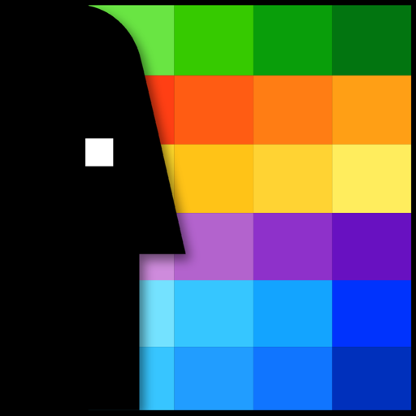
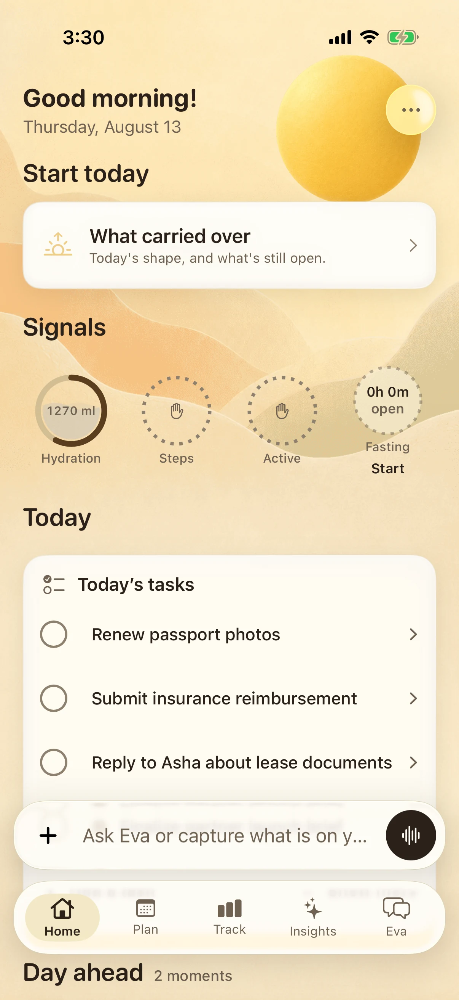
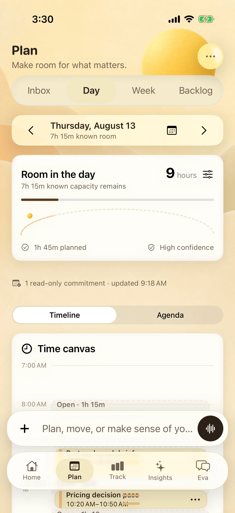
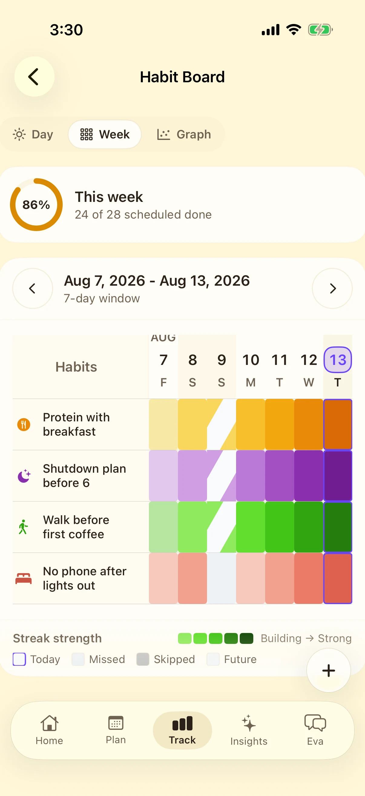
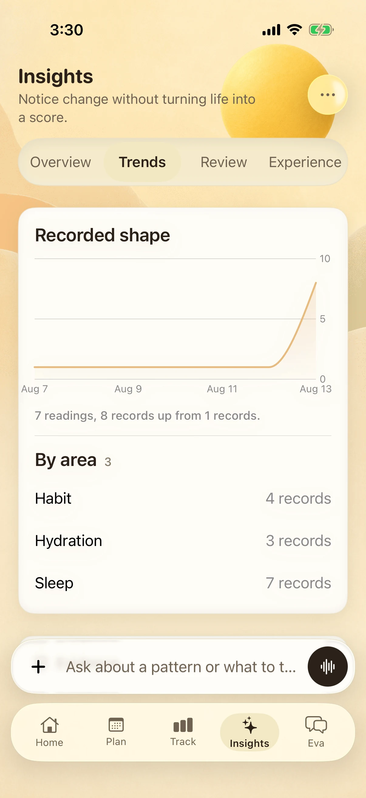
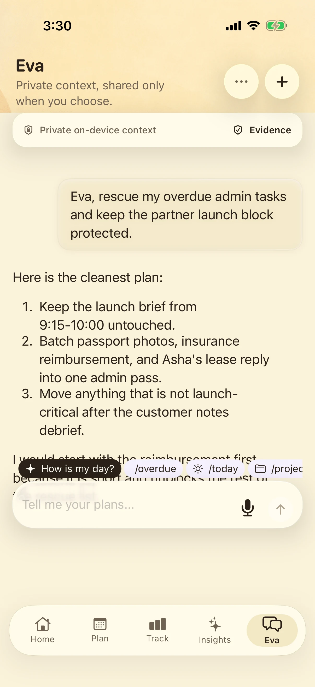
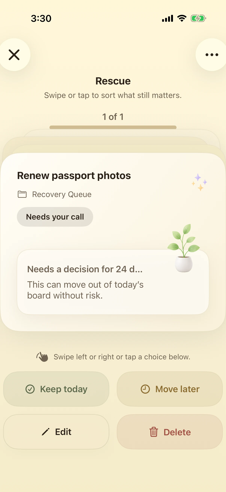

<p align="center">
  
</p>

<h1 align="center">LifeBoard</h1>

<p align="center"><strong>Life is not a list. Run it like a system.</strong></p>

<p align="center">
  The local-first Life OS for orienting, planning, focusing, tracking, recovering,<br />
  and improving—across every part of the life you are actually living.
</p>

<p align="center">
  
  
  
  
</p>

<p align="center">
  <a href="#the-life-os-loop">The loop</a> ·
  <a href="#the-system-surface-by-surface">Product tour</a> ·
  <a href="#private-by-default-helpful-by-design">Privacy</a> ·
  <a href="#build-lifeboard">Build</a>
</p>

<p align="center">
  <a href="./screenshots/readme/01-home-command-center.webp">
    
  </a>
</p>

<p align="center">
  <strong>01 · HOME — Command your day</strong><br />
  <sub>One calm answer to the question: what matters now?</sub>
</p>

<p align="center"><sub>Every screen in this tour uses deterministic synthetic demo data—never personal user data. Select any screen to view it full size.</sub></p>

## Your tools hold the pieces. LifeBoard holds the picture.

Your calendar knows **when**. Your task manager knows **what**. Your habit tracker knows **how often**. Your journal remembers **what happened**. But life rarely arrives one category at a time.

The important work competes with the appointment. The routine collides with low energy. The overdue errand follows you into tomorrow. A dozen well-made apps can still leave you alone with the hardest decision: **what deserves me now?**

**LifeBoard is the operating layer between what you care about and what you do next.** It gives work, health, relationships, routines, personal administration, reflection, and calendar reality one shared context—then helps the whole system learn without turning your life into a scorecard.

## The Life OS loop

<p align="center"><strong>Orient → Capture → Plan → Focus or Track → Recover → Reflect → Adapt</strong></p>

LifeBoard is designed around the way a real day changes:

- **Orient and capture.** See the shape of now, then catch new tasks, notes, habits, reflections, and signals before they disappear.
- **Plan, focus, and track.** Turn priorities into a sequence that respects time, capacity, commitments, and the recurring systems beneath your goals.
- **Recover, reflect, and adapt.** Repair imperfect days without shame, preserve what was true, and use your own evidence to make the next plan wiser.

Every surface reinforces the same loop. There is no second task system hiding inside EVA, no dashboard competing with Home, and no silent automation rewriting the day behind your back.

> **The goal is not a perfect day. It is a life that can keep moving when the day is not perfect.**

## The system, surface by surface

LifeBoard does not divide your life into disconnected feature silos. Each surface has one job in the operating loop—and hands useful context to the next.

<table>
  <tr>
    <td width="50%" valign="top" align="center">
      <a href="./screenshots/readme/02-plan-intention-into-time.webp">
        
      </a>
      <br /><strong>02 · PLAN</strong>
      <br /><strong>Turn intention into time</strong>
      <br /><sub>Shape the day, week, and backlog around capacity and calendar reality—not wishful thinking.</sub>
    </td>
    <td width="50%" valign="top" align="center">
      <a href="./screenshots/readme/03-track-life-systems.webp">
        
      </a>
      <br /><strong>03 · TRACK</strong>
      <br /><strong>Improve the systems beneath the goals</strong>
      <br /><sub>See recurring behavior as a living system—resilient to missed days, changing energy, and real life.</sub>
    </td>
  </tr>
  <tr>
    <td width="50%" valign="top" align="center">
      <a href="./screenshots/readme/04-insights-patterns.webp">
        
      </a>
      <br /><strong>04 · INSIGHTS</strong>
      <br /><strong>Learn from your own evidence</strong>
      <br /><sub>Find patterns in pace, follow-through, energy, and recovery without judgment or opaque scores.</sub>
    </td>
    <td width="50%" valign="top" align="center">
      <a href="./screenshots/readme/05-eva-chief-of-staff.webp">
        
      </a>
      <br /><strong>05 · EVA</strong>
      <br /><strong>A Chief of Staff, not an autopilot</strong>
      <br /><sub>Ask for perspective, inspect the reasoning, and review meaningful changes before choosing to apply them.</sub>
    </td>
  </tr>
</table>

### 06 · Recover — Keep imperfect days moving

<p align="center">
  <a href="./screenshots/readme/06-recover-imperfect-days.webp">
    
  </a>
</p>

Plans break. Energy changes. Meetings expand. **Recovery is not an exception to the system; recovery is part of the system.** Overdue Rescue helps you keep, move, edit, or deliberately release unfinished work—with clear consequences and guarded destructive actions.

## A plan that survives contact with Tuesday

LifeBoard becomes most useful in the transitions between tools—the moments where context usually disappears.

| Moment | What the Life OS does |
|---|---|
| **Morning · Orient** | Home composes priorities, fixed commitments, habits, open time, and the current focus into one readable day. |
| **Something arrives · Capture** | One entry point classifies a task, note, habit, reflection, tracker, or spoken thought without breaking your flow. |
| **The day fills up · Plan** | Capacity and calendar reality make trade-offs visible before an optimistic list becomes an impossible promise. |
| **The plan breaks · Recover** | Unfinished work becomes a decision—keep, move, edit, or release—not a growing red badge of guilt. |
| **The day ends · Reflect** | What happened, how it felt, and what changed become private evidence instead of lost context. |
| **The pattern emerges · Adapt** | Insights and EVA turn evidence into an explanation, then a reviewable next move. |

## Different by design

**Context before commands.** LifeBoard starts with the whole day, not an isolated task.

**Capacity before ambition.** A plan should fit the time and energy available to live it.

**Recovery before punishment.** Missed work is information. Brittle streaks and shame dashboards are not a strategy.

**Proposals before actions.** EVA can interpret, explain, and suggest. Consequential changes remain previewable, confirmable, receipted, and undoable.

**Evidence before judgment.** Insights show what the system observed and why a pattern matters; they do not reduce a life to a mysterious score.

## One place for every kind of progress

| LifeBoard brings together | What becomes possible |
|---|---|
| **Tasks, projects, and life areas** | Finite work stays connected to the part of life it serves. |
| **Day, week, backlog, focus, and calendar context** | Priorities become a plan that respects time and capacity. |
| **Habits, routines, care, and wellbeing** | Recurring behavior can improve without brittle streak pressure. |
| **Journal, notes, knowledge, mood, and reflection** | Private context survives the day and becomes useful evidence later. |
| **Insights and review** | History becomes an explanation and a next decision—not a vanity dashboard. |
| **Universal Capture and EVA** | New input enters through one arbitration layer; assistance stays grounded in the same source of truth. |

## Private by default. Helpful by design.

Your plans, routines, journal, health context, embeddings, and assistant context are intimate infrastructure. LifeBoard treats them that way.

- **Local first.** Core personal data and workflows live on the device rather than depending on a remote account to function.
- **On-device intelligence.** EVA's local path uses MLX inference, deterministic planner guards, and schema-validated proposals.
- **Human-controlled change.** Meaningful actions expose Apply, Edit, Not Now, receipts, and Undo instead of silently mutating your life.
- **Protected context.** Journal routes reveal no content before authentication, while extensions receive typed, redacted projections rather than direct persistence access.

## One system across the Apple experience

LifeBoard adapts from compact iPhone to regular-width iPad, while widgets, Live Activities, notifications, App Intents, Spotlight, the share extension, and the Watch companion carry the current decision into the right moment. These surfaces extend the system; they do not become competing sources of truth.

Accessibility is part of the operating contract. Dynamic Type, VoiceOver order, Reduce Motion, Reduce Transparency, Increase Contrast, keyboard navigation, low-power policy, and thermal pressure are treated as functional modes—not optional polish.

## Build LifeBoard

LifeBoard is an active product and a living codebase—not a concept mockup. This repository contains the iOS app, companion surfaces, on-device assistant, deterministic product journeys, automated test suites, and the React marketing site.

### Prerequisites

- macOS with Xcode 26.5 and an iOS 26 simulator runtime.
- Swift 6, provided by the selected Xcode toolchain.
- The shared local Swift package at `../OffRecord/Packages/JournalKit` relative to this repository. The Xcode project references that exact sibling path.
- Node.js `20.19+` or `22.12+` for the marketing site.
- `cwebp` from the WebP tools when regenerating README screenshots (`brew install webp`).

Dependencies are resolved with Swift Package Manager. CocoaPods is not used.

### Run the iOS app

Open `LifeBoard.xcworkspace` in Xcode, select the `LifeBoard` scheme, and run it on an iOS 26 simulator. For a command-line build:

```sh
xcodebuild -workspace LifeBoard.xcworkspace \
  -scheme LifeBoard \
  -configuration Debug \
  -destination 'generic/platform=iOS Simulator' \
  CODE_SIGNING_ALLOWED=NO build
```

### Verify the product

Run the baseline-aware suite serially so simultaneous Xcode operations do not lock the shared build database:

```sh
LIFEBOARD_TEST_DESTINATION='platform=iOS Simulator,name=LifeBoard Test iPhone,OS=26.5' \
  bash scripts/run-baseline-aware-tests.sh
bash scripts/token-law-guardrails.sh
bash scripts/premium-ui-guardrails.sh
```

### Run the marketing site

```sh
npm install
npm run dev
npm run build
```

The site is built with React 19, TypeScript, Tailwind CSS, and Vite.

### Regenerate the product tour

```sh
./scripts/generate_readme_screenshots.sh
```

The generator launches a deterministic iPhone workspace at a fixed time, verifies all six product states, converts the native captures to optimized WebP assets, and only then replaces `screenshots/readme/`. Override the simulator with `LIFEBOARD_README_SCREENSHOT_DEVICE` and `LIFEBOARD_README_SCREENSHOT_OS` when needed.

## Repository map

| Path | Responsibility |
|---|---|
| `LifeBoard/` | iOS app, domains, use cases, persistence, presentation, design systems, and on-device assistant. |
| `LifeBoardWidgets/`, `LifeBoardWatch/`, `LifeBoardShareExtension/` | Redacted companion and system surfaces. |
| `LifeBoardTests/`, `LifeBoardUITests/` | Unit, integration, accessibility, seeded journey, and visual regression coverage. |
| `Shared/` | Versioned cross-target contracts and projections. |
| `src/` | React and TypeScript marketing site. |
| `docs/` | Product, design, architecture, evidence, audit, and implementation handbooks. |

## Go deeper

- [LifeBoard 5.0 Product Handbook](docs/product/README.md) — canonical product and interaction behavior.
- [Product UI/UX Guide](docs/design/LIFEBOARD_PRODUCT_UI_UX_GUIDE.md) — hierarchy, state, motion, responsiveness, and accessibility.
- [Clay composer kit](docs/design/CLAY_COMPOSER_KIT.md) — the data-entry layer: why `Form` is removed rather than restyled, the control vocabulary, and the section discipline that keeps composers off the stack guard page.
- [Signature effect deployment](docs/design/SIGNATURE_EFFECT_DEPLOYMENT.md) — where each Metal effect fires, and the rule that keeps it from becoming decoration.
- [Unified Implementation Guide](docs/life-os/LIFEBOARD_UNIFIED_IMPLEMENTATION_GUIDE.md) — architecture, persistence, failure modes, privacy, and safe extension rules.
- [Local EVA / LLM Architecture](docs/architecture/LOCAL_LLM_EVA_ARCHITECTURE.md) — on-device inference, proposal pipelines, and trust boundaries.
- [DESIGN.md](DESIGN.md) — canonical visual contract.
- [Documentation map](docs/README.md) — authority and navigation across the repository.

---

<p align="center"><strong>Manage the day. Run the system. Improve the life.</strong></p>
