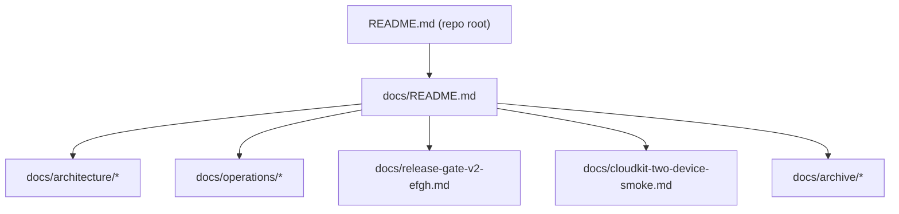

# Tasker Documentation Hub

Last updated: 2026-02-18

This directory is the canonical home for technical architecture, operations, release runbooks, and archived legacy docs.

## Doc Topology

## Primary Sections

| Section | Purpose | Canonical Docs |
| --- | --- | --- |
| Architecture | Data model, clean architecture, usecase and runtime contracts | `docs/architecture/README.md` |
| Operations | CI guardrails, release checks, developer tooling | `docs/operations/ci-release-and-guardrails.md`, `docs/operations/developer-tooling-and-flowctl.md` |
| Release Smoke | CloudKit two-device validation and evidence | `docs/cloudkit-two-device-smoke.md`, `docs/cloudkit-smoke-evidence/latest.md`, `docs/release-gate-v2-efgh.md` |
| Archive | Deprecated, non-canonical historical docs | `docs/archive/qoder-repowiki/README.md` |

## Architecture Docs

| Doc | Coverage |
| --- | --- |
| `docs/architecture/data-model-v2.md` | CoreData V2 entity model, invariants, lifecycle flows |
| `docs/architecture/clean-architecture-v2.md` | Layering, runtime DI, fail-closed behavior, feature gates |
| `docs/architecture/usecases-v2.md` | Usecase taxonomy, contracts, side effects, critical sequences |
| `docs/architecture/risk-register-v2.md` | Migration risk register, guardrails, review checklist |
| `docs/architecture/state-repositories-and-services-v2.md` | State layer repository/service internals and ownership |
| `docs/architecture/domain-events-and-observability-v2.md` | Domain events, handlers, notification bridge, observability |
| `docs/architecture/llm-assistant-stack-v2.md` | LLM context pipeline and assistant transaction stack |

## Operations Docs

| Doc | Coverage |
| --- | --- |
| `docs/operations/ci-release-and-guardrails.md` | GitHub workflows, guardrail scripts, release evidence path |
| `docs/operations/developer-tooling-and-flowctl.md` | `taskerctl`, flowctl install/verify, local-vs-CI constraints |

## Product Context

Product-facing intent remains in:
- `PRODUCT_REQUIREMENTS_DOCUMENT.md`

Root hub:
- `README.md`
