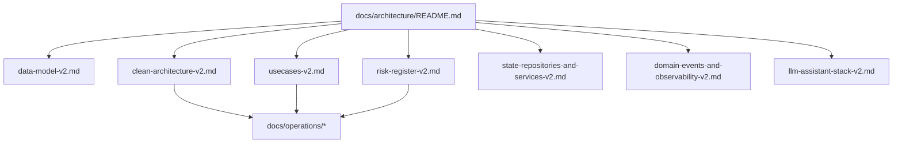

# Tasker V2 Architecture Docs Index

**Last validated against code on 2026-02-19**

This folder contains implementation-facing architecture truth for Tasker V2.
Task runtime is V2-only; legacy task bridge contracts are removed from production code.

Primary source paths used:
- `To Do List/TaskModelV2.xcdatamodeld/TaskModelV2.xcdatamodel/contents`
- `To Do List/Domain/Models`
- `To Do List/Domain/Interfaces`
- `To Do List/Domain/Events`
- `To Do List/UseCases`
- `To Do List/State/Repositories`
- `To Do List/State/Services`
- `To Do List/LLM`
- `To Do List/AppDelegate.swift`
- `To Do List/State/DI/EnhancedDependencyContainer.swift`
- `To Do List/Presentation/DI/PresentationDependencyContainer.swift`

## Source-Of-Truth Boundaries

- Product intent and user outcomes: `PRODUCT_REQUIREMENTS_DOCUMENT.md`
- Technical architecture and contracts: this folder
- Operational release mechanics: `docs/operations/*`
- Historical, non-canonical docs: `docs/archive/*`

## Document Map

| Document | Purpose | Source Anchors |
| --- | --- | --- |
| `docs/architecture/data-model-v2.md` | CoreData V2 + domain model invariants, lifecycle flows | Domain models + `TaskModelV2` |
| `docs/architecture/clean-architecture-v2.md` | Layer boundaries, DI/runtime composition, fail-closed behavior | AppDelegate + DI containers |
| `docs/architecture/usecases-v2.md` | Usecase taxonomy, contract tables, side effects, critical sequences | UseCases + repository protocols |
| `docs/architecture/risk-register-v2.md` | Risks, migration traps, guardrails, review checklist | Domain/UseCases/DI + feature flags |
| `docs/architecture/state-repositories-and-services-v2.md` | Repository/service internals and data ownership | State repositories/services |
| `docs/architecture/domain-events-and-observability-v2.md` | Event contracts, handlers, observability stream | Domain events + publisher |
| `docs/architecture/llm-assistant-stack-v2.md` | LLM context projection and assistant transaction boundaries | `/LLM` + `/UseCases/LLM` |

## Navigation Graph

## Maintenance Policy By Code Area

| Code Area Changed | Required Docs Update |
| --- | --- |
| `To Do List/Domain/Models/*` or `TaskModelV2` schema | `data-model-v2.md`, `risk-register-v2.md` |
| `To Do List/UseCases/*` | `usecases-v2.md`, `risk-register-v2.md` |
| `To Do List/State/Repositories/*`, `To Do List/State/Services/*` | `state-repositories-and-services-v2.md`, `clean-architecture-v2.md` |
| `To Do List/Domain/Events/*` | `domain-events-and-observability-v2.md`, `usecases-v2.md` |
| `To Do List/LLM/*` or `To Do List/UseCases/LLM/*` | `llm-assistant-stack-v2.md`, `usecases-v2.md`, `risk-register-v2.md` |
| `AppDelegate`/DI/flags/runtime wiring | `clean-architecture-v2.md`, `risk-register-v2.md`, `docs/operations/ci-release-and-guardrails.md` |

## If You Are Building UI

Read in this order:
1. `docs/architecture/data-model-v2.md`
2. `docs/architecture/usecases-v2.md`
3. `docs/architecture/clean-architecture-v2.md`
4. `docs/architecture/risk-register-v2.md`
5. `docs/architecture/llm-assistant-stack-v2.md` (if chat/assistant integrations are touched)

See operations constraints in `docs/operations/ci-release-and-guardrails.md` before release changes.
