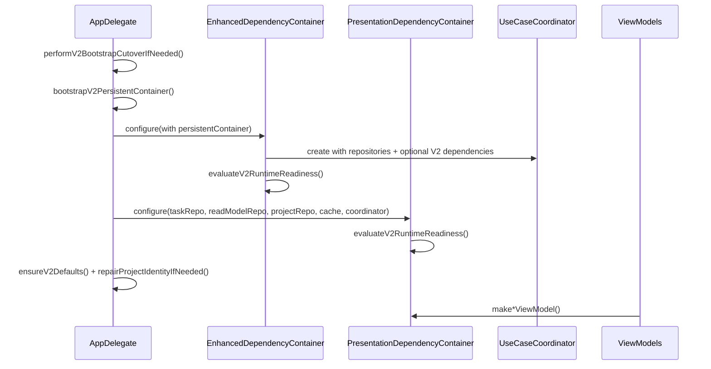
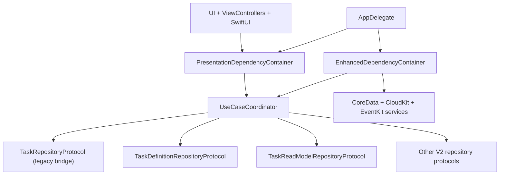

# Tasker V2 Clean Architecture Runtime

**Last validated against code on 2026-02-18**

## Scope

This document defines the current implementation shape of Tasker V2 runtime architecture:
- Layer responsibilities and dependency boundaries
- Command-side and read-model split
- Runtime composition across app bootstrap + DI containers
- Fail-closed readiness checks
- Background maintenance loops
- Feature-flag gates

Primary sources:
- `To Do List/AppDelegate.swift`
- `To Do List/State/DI/EnhancedDependencyContainer.swift`
- `To Do List/Presentation/DI/PresentationDependencyContainer.swift`
- `To Do List/UseCases/Coordinator/UseCaseCoordinator.swift`
- `To Do List/Services/V2FeatureFlags.swift`
- `To Do List/State/Repositories/CoreDataTaskReadModelRepository.swift`
- `To Do List/State/Repositories/CoreDataTaskDefinitionRepository.swift`

## Layer Responsibilities

| Layer | Responsibilities | Must Not Depend On | Primary Paths |
| --- | --- | --- | --- |
| Presentation | ViewModels/UI orchestration, state display, user intent dispatch | Direct CoreData writes, infrastructure-specific query logic | `To Do List/Presentation`, `To Do List/View`, `To Do List/ViewControllers` |
| UseCases | Business workflows, coordination, validation, transactional operations | UI types, direct view concerns | `To Do List/UseCases` |
| Domain | Core models and repository contracts | UIKit/CoreData implementation details (except tolerated legacy bridge zones) | `To Do List/Domain/Models`, `To Do List/Domain/Interfaces` |
| State | Repository implementations, persistence mapping, service wiring | Presentation classes | `To Do List/State` |
| Infrastructure | CoreData/CloudKit/EventKit/notifications | Presentation concerns | `To Do List/AppDelegate.swift`, service implementations |

## Forbidden Dependencies (Current Guardrails)

1. Presentation must not bypass usecase/repository contracts for direct store mutations.
2. Usecases must not import UI layer types.
3. Runtime composition must remain centralized through AppDelegate -> state DI -> presentation DI.
4. V2 feature gates must be checked in critical mutation/sync pipelines.

Source anchors:
- `To Do List/AppDelegate.swift`
- `To Do List/State/DI/EnhancedDependencyContainer.swift`
- `To Do List/Presentation/DI/PresentationDependencyContainer.swift`
- `To Do List/UseCases/LLM/AssistantActionPipelineUseCase.swift`
- `To Do List/UseCases/Sync/ReconcileExternalRemindersUseCase.swift`

## Command Side vs Read-Model Side

## Command Side
- Canonical writes target V2 repositories (`TaskDefinitionRepositoryProtocol` and related V2 protocols).
- Legacy task usecases are bridged to V2 via `V2TaskRepositoryAdapter`.

Source anchors:
- `To Do List/Domain/Interfaces/V2RepositoryProtocols.swift`
- `To Do List/State/Repositories/CoreDataTaskDefinitionRepository.swift`
- `To Do List/Domain/Interfaces/TaskRepositoryProtocol.swift`

## Read-Model Side
- Query optimized contracts are isolated in `TaskReadModelRepositoryProtocol`.
- Read-model fetches support paging/search/sorting/count aggregates and return legacy-shaped `Task` slices for UI compatibility.

Source anchors:
- `To Do List/Domain/Interfaces/TaskReadModelRepositoryProtocol.swift`
- `To Do List/Domain/Models/TaskReadQueries.swift`
- `To Do List/State/Repositories/CoreDataTaskReadModelRepository.swift`
- `To Do List/UseCases/Task/GetHomeFilteredTasksUseCase.swift`

## Why Both Exist
- Command side ensures correctness and lifecycle invariants on writes.
- Read side provides scalable filtering/analytics without forcing write-model shape into every UI path.
- Dual-path supports migration continuity while UI moves to V2-first surfaces.

## Runtime Composition (DI and Bootstrap)

## Composition Sequence

Sources:
- `To Do List/AppDelegate.swift`
- `To Do List/State/DI/EnhancedDependencyContainer.swift`
- `To Do List/Presentation/DI/PresentationDependencyContainer.swift`
- `To Do List/UseCases/Coordinator/UseCaseCoordinator.swift`

## Dependency Graph

## Runtime Readiness and Fail-Closed Behavior

## State Container Checks
`EnhancedDependencyContainer` marks runtime not-ready when required V2 dependencies are missing (for example task definition repository, external sync repository, assistant action repository, or critical V2 usecases).

## Presentation Container Checks
`PresentationDependencyContainer` also validates required V2 usecases before allowing full runtime.

## App-Level Fail-Closed
`AppDelegate.setupCleanArchitecture()` calls `assertV2RuntimeReady()` for both containers and fails closed if checks fail.

Source anchors:
- `To Do List/State/DI/EnhancedDependencyContainer.swift`
- `To Do List/Presentation/DI/PresentationDependencyContainer.swift`
- `To Do List/AppDelegate.swift`

## Bootstrap, Cutover, and Seeding

| Concern | Current Behavior | Source |
| --- | --- | --- |
| Legacy store cleanup | Performs epoch-based cutover cleanup and wipes old/invalid stores when needed | `To Do List/AppDelegate.swift` |
| Persistent store retry | Retries with wipe on incompatible/missing configuration load failures | `To Do List/AppDelegate.swift` |
| Store configs | Uses CloudSync + LocalOnly store descriptions for `TaskModelV2` | `To Do List/AppDelegate.swift` |
| Default data seed | Ensures `LifeArea("General")` and canonical Inbox project, with fallback field writes | `To Do List/AppDelegate.swift` |
| Data repair | Backfills task life-area IDs and repairs project identity collisions | `To Do List/AppDelegate.swift`, `To Do List/UseCases/Project/ManageProjectsUseCase.swift` |

## Background Maintenance Loops

## Occurrence and Tombstone Maintenance
- App registers and schedules background refresh for occurrence maintenance.
- Maintenance path runs occurrence generation/cleanup and tombstone purge usecases.

Source anchors:
- `To Do List/AppDelegate.swift`
- `To Do List/UseCases/Schedule/GenerateOccurrencesUseCase.swift`
- `To Do List/UseCases/Schedule/MaintainOccurrencesUseCase.swift`

## Reminder Reconciliation Refresh
- Background reminder refresh is gated by reminder-sync feature flags.
- Flow loads synced project mappings, then reconciles each project with timeout/failure handling.

Source anchors:
- `To Do List/AppDelegate.swift`
- `To Do List/UseCases/Sync/ReconcileExternalRemindersUseCase.swift`
- `To Do List/Domain/Interfaces/V2RepositoryProtocols.swift`

## Feature Flag Gates and Runtime Impact

| Flag | Gate Point | Behavior When Off | Source |
| --- | --- | --- | --- |
| `v2Enabled` | bootstrap/usecases/readiness checks | bypasses V2-required readiness gates and disallows V2-only flows | `To Do List/Services/V2FeatureFlags.swift`, `To Do List/State/DI/EnhancedDependencyContainer.swift`, `To Do List/UseCases/LLM/AssistantActionPipelineUseCase.swift` |
| `remindersSyncEnabled` | reminder sync usecases + BG reconcile | returns disabled error and skips reconciliation | `To Do List/Services/V2FeatureFlags.swift`, `To Do List/UseCases/Sync/ReconcileExternalRemindersUseCase.swift`, `To Do List/AppDelegate.swift` |
| `assistantApplyEnabled` | assistant apply path | blocks apply with explicit error | `To Do List/Services/V2FeatureFlags.swift`, `To Do List/UseCases/LLM/AssistantActionPipelineUseCase.swift` |
| `assistantUndoEnabled` | assistant undo path | blocks undo with explicit error | `To Do List/Services/V2FeatureFlags.swift`, `To Do List/UseCases/LLM/AssistantActionPipelineUseCase.swift` |
| `remindersBackgroundRefreshEnabled` | BG reminder scheduling/execution | no reminder refresh scheduling | `To Do List/Services/V2FeatureFlags.swift`, `To Do List/AppDelegate.swift` |

## Repository and Service Wiring Map (State Internals)

| Runtime Dependency | Concrete Wiring (Current) | Injected Into |
| --- | --- | --- |
| Task write model | `CoreDataTaskDefinitionRepository` + `V2TaskRepositoryAdapter` | `UseCaseCoordinator.taskRepository` |
| Task read model | `CoreDataTaskReadModelRepository` | task/home/search/chart usecases and viewmodels |
| Project model | `CoreDataProjectRepository` | project and task orchestration usecases |
| Planning repositories | `CoreDataLifeAreaRepository`, `CoreDataSectionRepository`, `CoreDataTagRepository`, `CoreDataHabitRepository` | optional V2 dependencies bundle |
| Schedule/occurrence | `CoreDataScheduleRepository`, `CoreDataOccurrenceRepository`, `CoreSchedulingEngine` | schedule/maintenance usecases |
| Reminder stack | `CoreDataReminderRepository`, `EventKitAppleRemindersProvider` | reminder/sync usecases and background refresh |
| External sync | `CoreDataExternalSyncRepository` | link/reconcile usecases |
| Assistant persistence | `CoreDataAssistantActionRepository` | assistant pipeline usecase |
| Tombstones and gamification | `CoreDataTombstoneRepository`, `CoreDataGamificationRepository` | maintenance and XP usecases |

Source anchors:
- `To Do List/State/DI/EnhancedDependencyContainer.swift`
- `To Do List/State/Repositories/*.swift`
- `To Do List/State/Services/*.swift`

## Failure-Mode Matrix (Bootstrap + Readiness + Background)

| Failure Point | Detection | Runtime Behavior | Operator Signal |
| --- | --- | --- | --- |
| Persistent store bootstrap fails initial load | bootstrap report has load errors/missing config | retry path may wipe V2 stores then retry | `persistent_store_bootstrap_*` log events |
| Persistent store fails after retry | recovery report still unhealthy | app bootstrap state marked failed | `persistent_store_bootstrap_failed_after_retry` |
| Required V2 dependencies missing in state DI | `assertV2RuntimeReady()` in state container | fail-closed from setup path | `v2_runtime_not_ready` |
| Required V2 dependencies missing in presentation DI | `assertV2RuntimeReady()` in presentation container | fail-closed from setup path | `v2_runtime_not_ready` |
| Reminder background refresh dependencies missing | guard checks in AppDelegate refresh | reminders refresh skipped safely | `bg_reminders_missing_dependencies` |
| Per-project reconcile timeout in BG | per-project timeout branch in refresh loop | partial run continues, failure counted | `bg_reminders_project_timeout` |
| Occurrence maintenance failure in BG | maintenance completion error branch | error logged, task marked complete with failure | `Occurrence maintenance failed in background refresh` log message |

Source anchors:
- `To Do List/AppDelegate.swift`
- `To Do List/State/DI/EnhancedDependencyContainer.swift`
- `To Do List/Presentation/DI/PresentationDependencyContainer.swift`

## Dependency Boundary Anti-Patterns and Guardrails

| Anti-Pattern | Why It Violates Architecture | Guardrail |
| --- | --- | --- |
| ViewModel/ViewController directly mutates CoreData entities | bypasses usecase and repository contract boundaries | route writes through usecases/repository protocols only |
| Usecase depending on concrete repository class | couples business logic to storage implementation | inject protocol surfaces (`*RepositoryProtocol`) |
| New runtime path bypassing AppDelegate -> state DI -> presentation DI composition | breaks fail-closed readiness and consistent wiring | centralize setup in `setupCleanArchitecture()` |
| Side-effectful V2 flow without feature-flag guard | unsafe rollout behavior and inconsistent disable paths | enforce explicit `V2FeatureFlags` gate in each critical flow |
| Legacy singleton runtime dependency (`DependencyContainer.shared`) reintroduced | reopens non-canonical runtime path | keep CI guardrail script checks (`validate_legacy_runtime_guardrails.sh`) |

## UI Integration Contracts (Architecture-Level)

1. UI should request ViewModels from `PresentationDependencyContainer` and avoid custom manual wiring.
2. UI list/read paths should prefer read-model-backed usecases (`GetHomeFilteredTasksUseCase`, `GetTasksUseCase` with read model).
3. UI mutations should go through usecases/coordinator, not direct repository edits from views.
4. UI behavior relying on reminder sync or assistant apply/undo should account for flag-gated disabled errors.

Source anchors:
- `To Do List/Presentation/DI/PresentationDependencyContainer.swift`
- `To Do List/UseCases/Task/GetHomeFilteredTasksUseCase.swift`
- `To Do List/UseCases/Task/GetTasksUseCase.swift`
- `To Do List/UseCases/LLM/AssistantActionPipelineUseCase.swift`
- `To Do List/UseCases/Sync/ReconcileExternalRemindersUseCase.swift`
