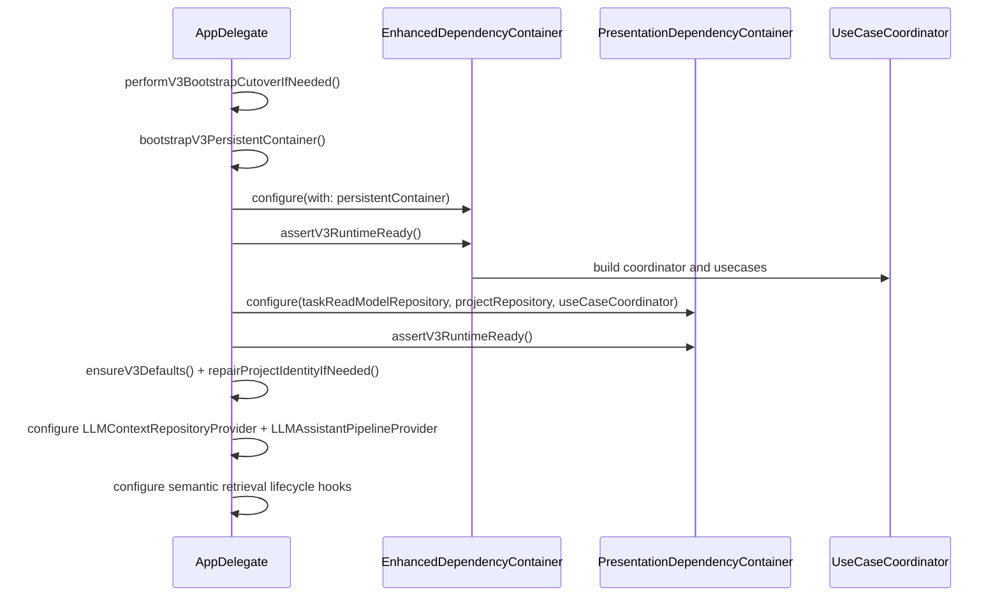

# Tasker V3 Clean Architecture Runtime

**Last validated against code on 2026-02-21**

## Scope

This document describes the shipped runtime composition and dependency boundaries for Tasker.
It focuses on:
- app bootstrap and persistent store cutover behavior,
- DI container wiring and fail-closed readiness checks,
- layer boundaries and forbidden dependencies,
- command-side vs read-model responsibilities,
- runtime feature flags and failure surfaces,
- LLM provider wiring and semantic index lifecycle integration.

Primary source anchors:
- `To Do List/AppDelegate.swift`
- `To Do List/State/DI/EnhancedDependencyContainer.swift`
- `To Do List/Presentation/DI/PresentationDependencyContainer.swift`
- `To Do List/UseCases/Coordinator/UseCaseCoordinator.swift`
- `To Do List/Services/V2FeatureFlags.swift`
- `To Do List/LLM/Models/LLMContextProjectionService.swift`
- `To Do List/LLM/Models/LLMAssistantPipelineProvider.swift`
- `To Do List/LLM/Models/LLMDataController.swift`
- `To Do List/LLM/Models/TaskSemanticRetrievalService.swift`

## Runtime Snapshot

| Concern | Current state |
| --- | --- |
| Persistent model | `TaskModelV3` |
| Store files | `TaskModelV3-cloud.sqlite`, `TaskModelV3-local.sqlite` (+ wal/shm) |
| Cloud container | `iCloud.TaskerCloudKitV3` |
| Cutover epoch key | `tasker.v3.store.epoch` |
| Runtime readiness assertions | `assertV3RuntimeReady()` in both DI containers |
| Runtime mode | V3-only (legacy task bridge contracts removed from production paths) |

## Layer Responsibilities

| Layer | Owns | Must not own |
| --- | --- | --- |
| Presentation | ViewModels/UI orchestration and intent forwarding | direct CoreData mutation and persistence rules |
| UseCases | business workflows and transactional orchestration | UIKit/UI state handling |
| Domain | models, contracts, business semantics | infrastructure implementation details |
| State | repository/service implementations and wiring | presentation concerns |
| Infrastructure | CoreData/CloudKit/EventKit/background task integrations | UI behavior decisions |
| LLM Runtime | prompt/context assembly, local model routing, card state transport | direct task mutation bypassing assistant pipeline |

## Composition Sequence

## DI Wiring Details

### State container (`EnhancedDependencyContainer`)
- Constructs all repository implementations and state services.
- Builds `UseCaseCoordinator` with required `V2Dependencies` bundle.
- Marks runtime ready only after required dependencies are present.
- Exposes `assertV3RuntimeReady()` for fail-closed bootstrap.

### Presentation container (`PresentationDependencyContainer`)
- Requires:
  - `taskReadModelRepository`
  - `projectRepository`
  - `useCaseCoordinator`
- Computes explicit failure reason string when dependencies are missing.
- Exposes `assertV3RuntimeReady()` for fail-closed bootstrap.

### LLM provider wiring (`AppDelegate.setupCleanArchitecture`)
- `LLMContextRepositoryProvider.configure(taskReadModelRepository:projectRepository:tagRepository:)`
- `LLMAssistantPipelineProvider.configure(pipeline: stateContainer.useCaseCoordinator.assistantActionPipeline)`
- This keeps LLM context and assistant mutation entrypoints repository- and usecase-driven.

### Semantic index lifecycle wiring (`AppDelegate`)
- startup: `TaskSemanticRetrievalService.shared.loadPersistedIndex()` then snapshot rebuild.
- mutation observer: `.homeTaskMutation` routes to incremental semantic index update/remove.
- background: `TaskSemanticRetrievalService.shared.persistIndex()`.

## Command Side vs Read Model Side

| Side | Primary contracts | Purpose |
| --- | --- | --- |
| Command side | `TaskDefinitionRepositoryProtocol` + companion repositories (`TaskTagLinkRepositoryProtocol`, `TaskDependencyRepositoryProtocol`) | canonical mutation path for `TaskDefinition` graph |
| Read model side | `TaskReadModelRepositoryProtocol` returning `TaskDefinitionSliceResult` | optimized query/search/pagination/aggregate reads |

## Store Bootstrap and Cutover Behavior

| Behavior | Implementation summary | Source |
| --- | --- | --- |
| Epoch-based cutover | if stored epoch != `v3StoreEpoch`, wipe store files and clear legacy preference keys | `To Do List/AppDelegate.swift` |
| Store wipe set | removes both legacy `TaskModelV2-*` and current `TaskModelV3-*` sqlite/wal/shm files during cutover | `To Do List/AppDelegate.swift` |
| Two-config load | loads `CloudSync` and `LocalOnly` store descriptions | `To Do List/AppDelegate.swift` |
| Retry strategy | incompatible/missing-config load failures trigger wipe + recovery bootstrap pass | `To Do List/AppDelegate.swift` |
| Fail-closed mode | unresolved bootstrap/dependency errors produce bootstrap failure state and skip runtime wiring | `To Do List/AppDelegate.swift` |

## LLM Chat Store Safety

`LLMDataController` uses a defensive store initialization strategy:
1. attempt persistent SwiftData container creation,
2. on failure, recreate persistent store files and retry,
3. if retry fails, fallback to in-memory SwiftData container,
4. only then fail hard.

This prevents app-wide startup crash on local chat-store incompatibility.

## Background Runtime Loops

| Loop | Trigger | Core dependencies |
| --- | --- | --- |
| Occurrence maintenance refresh | app background + scheduled refresh task | `MaintainOccurrencesUseCase`, occurrence + tombstone repositories |
| Reminders refresh/reconcile | gated background refresh task | `ReconcileExternalRemindersUseCase`, external sync repo, reminders provider |
| Daily brief generation | gated background refresh task and foreground morning fallback | `DailyBriefService`, dashboard usecase surface |
| Semantic index persistence | app background | `TaskSemanticRetrievalService` |

## Feature Flag Gates (Current)

| Flag | Used in | Behavior when disabled |
| --- | --- | --- |
| `remindersSyncEnabled` | reminders link/reconcile flows and reminder-notification scheduling side effects | sync paths return disabled error/skip work; notification scheduling side effects are suppressed |
| `assistantApplyEnabled` | assistant apply flow | blocks apply with explicit error |
| `assistantUndoEnabled` | assistant undo flow | blocks undo with explicit error |
| `assistantPlanModeEnabled` | chat plan mode and proposal actions | ask mode remains active; plan-mode entry blocked |
| `assistantCopilotEnabled` | add-task/home/task-detail AI surfaces | AI suggestion surfaces hidden or no-op |
| `assistantSemanticRetrievalEnabled` | semantic context/rerank/index lifecycle | lexical search/context fallback only |
| `assistantBriefEnabled` | daily brief generation + scheduling | no brief generation/notification |
| `assistantBreakdownEnabled` | task detail AI breakdown action | breakdown action hidden |
| `remindersBackgroundRefreshEnabled` | background reminders scheduling/execution | no reminders BG refresh scheduling |

## Failure Surface Matrix

| Failure point | Detection | Runtime behavior | Signal |
| --- | --- | --- | --- |
| persistent store load incompatibility | load report has compatibility errors or missing configs | wipe + retry bootstrap path | `persistent_store_bootstrap_retry` |
| persistent store unrecoverable | recovery load still unhealthy | app enters bootstrap failure mode | `persistent_store_bootstrap_failed_after_retry` |
| state DI missing required dependencies | `assertV3RuntimeReady()` throws | setup fails closed | `v3_runtime_not_ready` |
| presentation DI missing required dependencies | `assertV3RuntimeReady()` throws | setup fails closed | `v3_runtime_not_ready` |
| reminders BG dependencies missing | guard checks in background handler | skip reconcile and mark task failed | `bg_reminders_missing_dependencies` |
| reconcile timeout/partial failure | per-project timeout/failure handling | continues with partial accounting | `bg_reminders_project_timeout` |
| semantic embeddings unavailable | semantic engine returns no vector | lexical-only retrieval | `assistant_semantic_fallback_lexical` |

## Forbidden Dependency Patterns

1. Presentation calling CoreData APIs directly.
2. UseCases depending on concrete repository classes instead of protocols.
3. Alternate runtime wiring paths that bypass `AppDelegate -> EnhancedDependencyContainer -> PresentationDependencyContainer`.
4. Side-effectful reminders/assistant flows without explicit feature-flag checks.
5. Reintroduction of legacy singleton runtime paths (`DependencyContainer.shared`).
6. Chat-layer task mutation paths that bypass `AssistantActionPipelineUseCase`.

## Integration Rules For UI

1. Create ViewModels through `PresentationDependencyContainer`.
2. Read list/search surfaces via read-model-backed usecases.
3. Route mutations through usecases/coordinator (never direct entity edits in UI).
4. Handle disabled-feature error paths for reminders sync and assistant apply/undo flows.
5. Keep Ask mode read-only and mutate only through proposal-confirmation workflow.

## Cross-Links

- `docs/architecture/data-model-v2.md`
- `docs/architecture/usecases-v2.md`
- `docs/architecture/state-repositories-and-services-v2.md`
- `docs/architecture/llm-assistant-stack-v2.md`
- `docs/architecture/llm-feature-integration-handbook.md`
- `docs/architecture/risk-register-v2.md`
