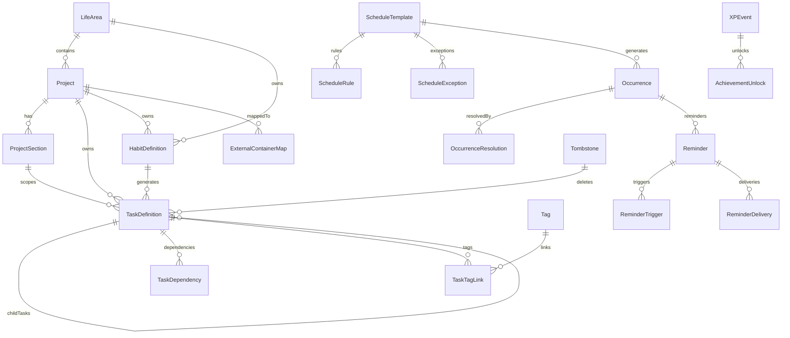
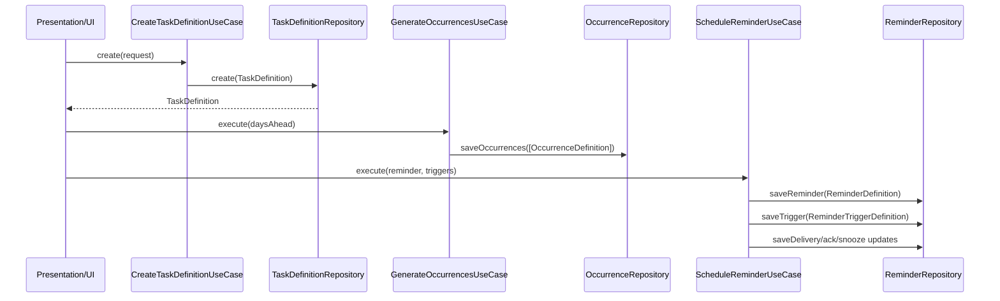
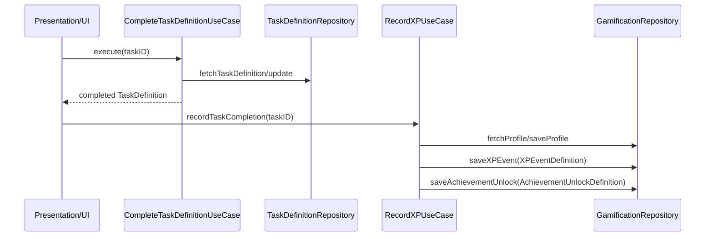

# Tasker V2 Data Model Reference

**Last validated against code on 2026-02-18**

## Scope

This document is the canonical technical map of Tasker V2 data model behavior across:
- CoreData schema (`TaskModelV2`)
- Domain `*Definition` types
- Legacy compatibility aliases and bridge models
- Ownership of writes (usecases/services/repositories)

Primary sources:
- `To Do List/TaskModelV2.xcdatamodeld/TaskModelV2.xcdatamodel/contents`
- `To Do List/Domain/Models/Task.swift`
- `To Do List/Domain/Models/ScheduleTemplate.swift`
- `To Do List/Domain/Models/Occurrence.swift`
- `To Do List/Domain/Models/ReminderDefinition.swift`
- `To Do List/Domain/Models/ExternalSyncModels.swift`
- `To Do List/Domain/Models/SyncMergeState.swift`
- `To Do List/Domain/Models/AssistantAction.swift`
- `To Do List/Domain/Models/XPEvent.swift`
- `To Do List/Domain/Models/Achievement.swift`
- `To Do List/Domain/Models/Tombstone.swift`
- `To Do List/Domain/Interfaces/V2RepositoryProtocols.swift`

## Model Principles

## 1. Canonical IDs
- V2 entities use UUID identity as canonical linkage.
- Cross-entity references are UUID-based (for example `projectID`, `taskID`, `lifeAreaID`).
- Legacy aliases remain in some entities for compatibility (`id` and legacy key columns may coexist).

Source files:
- `To Do List/TaskModelV2.xcdatamodeld/TaskModelV2.xcdatamodel/contents`
- `To Do List/State/Repositories/CoreDataTaskDefinitionRepository.swift`

## 2. Sync Metadata Is First-Class
- Most syncable entities include `createdAt`, `updatedAt`, and version fields.
- External reminders mappings carry provider payload snapshots and sync state blobs.
- Reminder merge uses field clocks and tombstone clocks.

Source files:
- `To Do List/Domain/Models/ExternalSyncModels.swift`
- `To Do List/Domain/Models/SyncMergeState.swift`
- `To Do List/UseCases/Sync/ReminderMergeEngine.swift`

## 3. Legacy Compatibility Is Explicit
- `TaskDefinition` coexists with legacy `Task` model via conversion helpers.
- Schema contains intentional alias overlap (`title` and `name`, `projectName` and `name`, etc.).
- Compatibility is bridge-only and should not be expanded without migration notes.

Source files:
- `To Do List/Domain/Models/Task.swift`
- `To Do List/State/Repositories/CoreDataTaskDefinitionRepository.swift`

## Bounded Contexts

## Planning Hierarchy
- `LifeArea` -> `Project` -> `ProjectSection` organizes long-lived intent.
- Projects maintain inbox/default semantics and container mappings.

Sources:
- `To Do List/Domain/Models/LifeArea.swift`
- `To Do List/Domain/Models/Project.swift`
- `To Do List/Domain/Models/Section.swift`

## Task System
- Canonical task unit is `TaskDefinition`.
- Task graph extensions: child tasks, dependency links, and tag links.

Sources:
- `To Do List/Domain/Models/Task.swift`
- `To Do List/Domain/Interfaces/V2RepositoryProtocols.swift`

## Habit System
- Habit definitions connect to planning hierarchy and can generate tasks.

Sources:
- `To Do List/Domain/Models/HabitDefinition.swift`
- `To Do List/UseCases/Habit/ManageHabitsUseCase.swift`

## Scheduling and Occurrence System
- Templates + rules + exceptions generate occurrences.
- Occurrences capture planned execution instances; resolutions capture outcomes.

Sources:
- `To Do List/Domain/Models/ScheduleTemplate.swift`
- `To Do List/Domain/Models/Occurrence.swift`
- `To Do List/UseCases/Schedule/GenerateOccurrencesUseCase.swift`
- `To Do List/UseCases/Schedule/ResolveOccurrenceUseCase.swift`

## Reminder System
- Reminder definitions include trigger definitions and delivery records.
- Reminder deliveries are operational state (not CloudKit syncable in schema).

Sources:
- `To Do List/Domain/Models/ReminderDefinition.swift`
- `To Do List/TaskModelV2.xcdatamodeld/TaskModelV2.xcdatamodel/contents`

## Gamification Ledger
- `GamificationProfile` tracks aggregate state.
- `XPEvent` and `AchievementUnlock` represent append-style progression records.

Sources:
- `To Do List/Domain/Models/GamificationProfile.swift`
- `To Do List/Domain/Models/XPEvent.swift`
- `To Do List/Domain/Models/Achievement.swift`
- `To Do List/UseCases/Gamification/RecordXPUseCase.swift`

## External Sync Mapping
- Container mappings connect local projects to provider containers.
- Item mappings connect local entities to provider item IDs with merge envelopes/state.

Sources:
- `To Do List/Domain/Models/ExternalSyncModels.swift`
- `To Do List/UseCases/Sync/LinkExternalRemindersUseCase.swift`
- `To Do List/UseCases/Sync/ReconcileExternalRemindersUseCase.swift`

## Assistant Action Runs
- Assistant workflows persist proposals and execution state in `AssistantActionRun`.

Sources:
- `To Do List/Domain/Models/AssistantAction.swift`
- `To Do List/UseCases/LLM/AssistantActionPipelineUseCase.swift`

## Tombstones
- Tombstones represent deleted entities with expiration/purge behavior.

Sources:
- `To Do List/Domain/Models/Tombstone.swift`
- `To Do List/UseCases/Schedule/MaintainOccurrencesUseCase.swift`

## Entity Relationship Map (High Level)

Sources:
- `To Do List/TaskModelV2.xcdatamodeld/TaskModelV2.xcdatamodel/contents`

## Entity Dictionary (All V2 CoreData Entities)

| Entity | Core Attributes (non-exhaustive) | Key Relationships | Required Invariants | Mutation Owners | Source Anchors |
| --- | --- | --- | --- | --- | --- |
| `LifeArea` | `id`, `name`, `color`, `icon`, `sortOrder`, `isArchived`, timestamps | to-many `projects`, `habits` | `id` stable UUID; default "General" is seed candidate | `ManageLifeAreasUseCase`, default seeding in app bootstrap | `TaskModelV2.../contents`, `UseCases/LifeArea/ManageLifeAreasUseCase.swift`, `AppDelegate.swift` |
| `Project` | `id`, `projectID`, `name`, `projectName`, `isInbox`, `isDefault`, `lifeAreaID`, status, timestamps | to-one `lifeAreaRef`; to-many `sections`, `tasks`, `externalContainerMaps` | inbox identity must remain canonical; project identity collisions repaired | `ManageProjectsUseCase`, seed/repair routines | `TaskModelV2.../contents`, `UseCases/Project/ManageProjectsUseCase.swift`, `AppDelegate.swift` |
| `ProjectSection` | `id`, `projectID`, `name`, `sortOrder`, `isCollapsed` | to-one `projectRef`; to-many `tasks` | section belongs to one project | `ManageSectionsUseCase` | `TaskModelV2.../contents`, `UseCases/Section/ManageSectionsUseCase.swift` |
| `Tag` | `id`, `name`, `color`, `icon`, `sortOrder` | to-many `taskLinks` | tag IDs stable across link replacement | `ManageTagsUseCase` | `TaskModelV2.../contents`, `UseCases/Tag/ManageTagsUseCase.swift` |
| `TaskDefinition` | `id`, `taskID`, `projectID`, `lifeAreaID`, `sectionID`, `title`, `name`, priority fields, status, due/completion dates, flags | to-one `projectRef`, `sectionRef`, `parentTaskRef`, `habitDefinitionRef`; to-many `childTasks`, `dependencies`, `tagLinks` | immutable task identity; canonical projection from domain `TaskDefinition`; life area backfill from project when missing | `CreateTaskDefinitionUseCase`, `CompleteTaskDefinitionUseCase`, legacy bridge usecases via adapter | `TaskModelV2.../contents`, `Domain/Models/Task.swift`, `UseCases/Task/*.swift`, `State/Repositories/CoreDataTaskDefinitionRepository.swift`, `AppDelegate.swift` |
| `TaskDependency` | `id`, `taskID`, `dependsOnTaskID`, `kind`, `createdAt` | to-one `taskRef`, `dependsOnTaskRef` | unique dependency tuples should dedupe by composite key in repository | dependency replace operations from task-definition writes | `TaskModelV2.../contents`, `State/Repositories/CoreDataTaskDefinitionRepository.swift` |
| `TaskTagLink` | `id`, `taskID`, `tagID`, `createdAt` | to-one `taskRef`, `tagRef` | replace semantics should produce deduped link set | tag-link replace operations | `TaskModelV2.../contents`, `Domain/Interfaces/V2RepositoryProtocols.swift` |
| `HabitDefinition` | `id`, `lifeAreaID`, `projectID`, `title`, type/config blobs, streak fields, timestamps | to-one `lifeAreaRef`, `projectRef`; to-many `generatedTasks` | habit remains referentially attached to life area/project when configured | `ManageHabitsUseCase`, habit task builders | `TaskModelV2.../contents`, `UseCases/Habit/ManageHabitsUseCase.swift`, `UseCases/Task/TaskHabitBuilderUseCase.swift` |
| `ScheduleTemplate` | `id`, `sourceType`, `sourceID`, timezone, temporal window flags, timestamps | to-many `rules`, `exceptions`, `occurrences` | template drives occurrence generation bounds | schedule generation/maintenance usecases | `TaskModelV2.../contents`, `Domain/Models/ScheduleTemplate.swift`, `UseCases/Schedule/GenerateOccurrencesUseCase.swift` |
| `ScheduleRule` | `id`, `scheduleTemplateID`, `ruleType`, interval/by* fields, `rawRuleData` | to-one `templateRef` | rule belongs to exactly one template | schedule repository operations | `TaskModelV2.../contents`, `Domain/Models/ScheduleTemplate.swift` |
| `ScheduleException` | `id`, `scheduleTemplateID`, `occurrenceKey`, `action`, `movedToAt`, payload | to-one `templateRef` | exception keys align to deterministic occurrence keys | schedule exception writes and resolution flows | `TaskModelV2.../contents`, `Domain/Models/ScheduleTemplate.swift`, `UseCases/Schedule/ResolveOccurrenceUseCase.swift` |
| `Occurrence` | `id`, `occurrenceKey`, `scheduleTemplateID`, source refs, `scheduledAt`, `dueAt`, `state`, generation fields | to-one `templateRef`; to-many `resolutions`, `reminders` | `occurrenceKey` immutable once saved | `GenerateOccurrencesUseCase`, `MaintainOccurrencesUseCase` | `TaskModelV2.../contents`, `Domain/Models/Occurrence.swift`, `State/Repositories/CoreDataOccurrenceRepository.swift` |
| `OccurrenceResolution` | `id`, `occurrenceID`, `resolutionType`, `resolvedAt`, `actor`, `reason` | to-one `occurrenceRef` | resolution must reference existing occurrence | `ResolveOccurrenceUseCase` | `TaskModelV2.../contents`, `Domain/Models/Occurrence.swift`, `UseCases/Schedule/ResolveOccurrenceUseCase.swift` |
| `Reminder` | `id`, `sourceType`, `sourceID`, `occurrenceID`, policy/channel, `isEnabled`, timestamps | to-one `occurrenceRef`; to-many `triggers` | reminder policy/channel mask must match trigger strategy | `ScheduleReminderUseCase`, sync reconciliation writes | `TaskModelV2.../contents`, `Domain/Models/ReminderDefinition.swift`, `UseCases/Reminder/ScheduleReminderUseCase.swift`, `UseCases/Sync/ReconcileExternalRemindersUseCase.swift` |
| `ReminderTrigger` | `id`, `reminderID`, type, `fireAt`, offsets, location payload | to-one `reminderRef` | trigger belongs to one reminder | `ScheduleReminderUseCase` | `TaskModelV2.../contents`, `Domain/Models/ReminderDefinition.swift` |
| `ReminderDelivery` | `id`, `reminderID`, `triggerID`, status, sent/ack/snooze timestamps, errors | none declared in schema (operational record) | delivery status transitions should be monotonic in app logic | `ScheduleReminderUseCase` delivery update methods | `TaskModelV2.../contents`, `Domain/Models/ReminderDefinition.swift`, `UseCases/Reminder/ScheduleReminderUseCase.swift` |
| `GamificationProfile` | `id`, `xpTotal`, `level`, streak fields, `lastActiveDate` | none | aggregate profile should reconcile with XP ledger | `RecordXPUseCase` reconcile/profile writes | `TaskModelV2.../contents`, `UseCases/Gamification/RecordXPUseCase.swift` |
| `XPEvent` | `id`, `occurrenceID`, `taskID`, `delta`, `reason`, `idempotencyKey`, `createdAt` | to-many `achievementUnlocks` | idempotency key prevents duplicate awards | `RecordXPUseCase` | `TaskModelV2.../contents`, `Domain/Models/XPEvent.swift`, `UseCases/Gamification/RecordXPUseCase.swift` |
| `AchievementUnlock` | `id`, `achievementKey`, `unlockedAt`, `sourceEventID` | to-one `sourceEventRef` | unlock should trace to source XP event | `RecordXPUseCase` | `TaskModelV2.../contents`, `Domain/Models/Achievement.swift` |
| `ExternalContainerMap` | `id`, `provider`, `projectID`, `externalContainerID`, sync flags/metadata | to-one `projectRef` | one active mapping per provider+project expected | `LinkExternalRemindersUseCase` | `TaskModelV2.../contents`, `Domain/Models/ExternalSyncModels.swift`, `UseCases/Sync/LinkExternalRemindersUseCase.swift` |
| `ExternalItemMap` | `id`, provider/local entity identity, external IDs, `lastSeenExternalModAt`, payload, `syncStateData` | none | mapping uniqueness by local key and by external key; merge state blob persists clocks | `LinkExternalRemindersUseCase`, `ReconcileExternalRemindersUseCase` | `TaskModelV2.../contents`, `Domain/Models/ExternalSyncModels.swift`, `UseCases/Sync/ReconcileExternalRemindersUseCase.swift` |
| `Tombstone` | `id`, entity refs, deleted metadata, `expiresAt` | none | expired tombstones should be purged | `PurgeExpiredTombstonesUseCase`, sync merge deletes/resurrection decisions | `TaskModelV2.../contents`, `Domain/Models/Tombstone.swift`, `UseCases/Schedule/MaintainOccurrencesUseCase.swift`, `UseCases/Sync/ReminderMergeEngine.swift` |
| `AssistantActionRun` | `id`, `threadID`, `status`, proposal/result blobs, confirmation/apply/reject timestamps, rollback fields | none | lifecycle transitions: pending -> confirmed -> applied/failed/rejected, with undo rules | `AssistantActionPipelineUseCase` | `TaskModelV2.../contents`, `Domain/Models/AssistantAction.swift`, `UseCases/LLM/AssistantActionPipelineUseCase.swift` |

## Lifecycle Flow: TaskDefinition -> Occurrence -> Reminder -> Delivery

Sources:
- `To Do List/UseCases/Task/CreateTaskDefinitionUseCase.swift`
- `To Do List/UseCases/Schedule/GenerateOccurrencesUseCase.swift`
- `To Do List/UseCases/Reminder/ScheduleReminderUseCase.swift`
- `To Do List/Domain/Interfaces/V2RepositoryProtocols.swift`

## Lifecycle Flow: Completion -> XP Event -> Achievement Unlock

Sources:
- `To Do List/UseCases/Task/CompleteTaskDefinitionUseCase.swift`
- `To Do List/UseCases/Gamification/RecordXPUseCase.swift`

## Legacy Compatibility Matrix

| Domain Intent | V2/Canonical Field | Legacy/Alias Field | Notes | Source |
| --- | --- | --- | --- | --- |
| Task title | `TaskDefinition.title` / CoreData `title` | `Task.name` / CoreData `name` | Both are present for compatibility and searchability | `Domain/Models/Task.swift`, `TaskModelV2.../contents` |
| Task project display | `TaskDefinition.projectName` | `Task.project` | Legacy string project remains optional bridge field | `Domain/Models/Task.swift` |
| Task priority | CoreData `priority` | CoreData `taskPriority` | Dual fields exist; read-model scoring still references priority variant in places | `TaskModelV2.../contents`, `State/Repositories/CoreDataTaskReadModelRepository.swift` |
| Project name | CoreData `name` | CoreData `projectName` | Both written in default seed flow for resilience | `TaskModelV2.../contents`, `AppDelegate.swift` |
| Project description | `projectDescription` | `projecDescription` | Legacy typo column preserved for backward compatibility | `TaskModelV2.../contents`, `AppDelegate.swift` |
| Project ID | `id` | `projectID` | Both used defensively during repair and lookup | `TaskModelV2.../contents`, `UseCases/Project/ManageProjectsUseCase.swift` |

## Sync And Merge Metadata

## SyncClock and Field Clocks
- `SyncClock` tracks logical ordering per node.
- `ReminderMergeState.fieldClocks` stores per-field winner clocks.
- `lastWriteClock` and `tombstoneClock` control conflict/tombstone decisions.

Sources:
- `To Do List/Domain/Models/SyncMergeState.swift`
- `To Do List/UseCases/Sync/ReminderMergeEngine.swift`

## Merge Envelope and Unknown Payload Preservation
- `ReminderMergeEnvelope` carries known fields plus passthrough payload bytes.
- Engine decode/encode preserves unknown legacy payload to avoid destructive rewrites.

Sources:
- `To Do List/Domain/Models/SyncMergeState.swift`
- `To Do List/UseCases/Sync/ReminderMergeEngine.swift`

## Tombstone Decisions
- Merge can choose `keep`, `applyDelete`, or `resurrect`.
- Decision uses remote presence, clocks, provider metadata, and prior state.

Sources:
- `To Do List/UseCases/Sync/ReminderMergeEngine.swift`
- `To Do List/UseCases/Sync/ReconcileExternalRemindersUseCase.swift`

## Notes For UI Builders

- Read from query surfaces (`TaskReadModelRepositoryProtocol`) when list performance and aggregate counts matter.
- Use write usecases/repositories for mutation and preserve canonical IDs.
- Treat compatibility aliases as migration bridges, not new product-facing schema.

Sources:
- `To Do List/Domain/Interfaces/TaskReadModelRepositoryProtocol.swift`
- `To Do List/State/Repositories/CoreDataTaskReadModelRepository.swift`
- `To Do List/Domain/Interfaces/V2RepositoryProtocols.swift`

## Field-Level Invariants (High-Risk Entities)

| Entity | Field-Level Invariant | Enforcement Path |
| --- | --- | --- |
| `TaskDefinition` | `id`/`taskID` must represent one logical task identity; write paths must not generate second identity for same logical row | `CoreDataTaskDefinitionRepository`, `V2CoreDataRepositorySupport`, `V2TaskRepositoryAdapter` |
| `TaskDefinition` | completion fields must be consistent: `isComplete=true` implies meaningful completion timestamp for completed flows | task completion usecases + repository update paths |
| `Project` | canonical inbox identity must remain stable across `id`, `projectID`, `isInbox`, `isDefault` | `CoreDataProjectRepository`, startup seed/repair in `AppDelegate` |
| `Project` | name aliases (`name`, `projectName`) should remain in-sync for compatibility | seed/repair + repository update paths |
| `Occurrence` | `occurrenceKey` is immutable after creation for deterministic recurrence identity | `CoreDataOccurrenceRepository`, schedule engine generation |
| `ExternalItemMap` | uniqueness by local key and external key must hold through upsert flows | `CoreDataExternalSyncRepository` |
| `ExternalItemMap` | merge `syncStateData` must persist clock/tombstone evolution over reconcile cycles | `ReconcileExternalRemindersUseCase`, `ReminderMergeEngine` |
| `AssistantActionRun` | lifecycle transitions are constrained (`pending -> confirmed -> applied/failed/rejected`, with bounded undo) | `AssistantActionPipelineUseCase` |

## Write Ownership Matrix (Entity -> Usecase/Repository)

| Entity Group | Primary Usecase Writers | Primary Repository Writers |
| --- | --- | --- |
| Planning (`LifeArea`, `Project`, `ProjectSection`, `Tag`) | `ManageLifeAreasUseCase`, `ManageProjectsUseCase`, `ManageSectionsUseCase`, `ManageTagsUseCase` | corresponding `CoreData*Repository` implementations |
| Task graph (`TaskDefinition`, `TaskDependency`, `TaskTagLink`) | `CreateTaskDefinitionUseCase`, `CompleteTaskDefinitionUseCase`, legacy task mutation usecases via adapter | `CoreDataTaskDefinitionRepository`, `CoreDataTaskDependencyRepository`, `CoreDataTaskTagLinkRepository`, `V2TaskRepositoryAdapter` |
| Habit (`HabitDefinition`) | `ManageHabitsUseCase`, habit builder flows | `CoreDataHabitRepository` |
| Schedule/occurrence (`ScheduleTemplate`, `ScheduleRule`, `ScheduleException`, `Occurrence`, `OccurrenceResolution`) | `GenerateOccurrencesUseCase`, `MaintainOccurrencesUseCase`, `ResolveOccurrenceUseCase` | `CoreDataScheduleRepository`, `CoreDataOccurrenceRepository`, `CoreSchedulingEngine` |
| Reminders (`Reminder`, `ReminderTrigger`, `ReminderDelivery`) | `ScheduleReminderUseCase`, sync reconcile flows | `CoreDataReminderRepository` |
| Gamification (`GamificationProfile`, `XPEvent`, `AchievementUnlock`) | `RecordXPUseCase` | `CoreDataGamificationRepository` |
| External sync (`ExternalContainerMap`, `ExternalItemMap`) | `LinkExternalRemindersUseCase`, `ReconcileExternalRemindersUseCase` | `CoreDataExternalSyncRepository` |
| Assist + deletion lifecycle (`AssistantActionRun`, `Tombstone`) | `AssistantActionPipelineUseCase`, `PurgeExpiredTombstonesUseCase` | `CoreDataAssistantActionRepository`, `CoreDataTombstoneRepository` |

## Migration and Compatibility Hazards

| Hazard | Why Risky | Guardrail |
| --- | --- | --- |
| Alias field drift (`title` vs `name`, `name` vs `projectName`) | one path can update only one alias, causing stale or missing reads in other paths | enforce canonical write helpers and include alias sync checks in migration/testing |
| Identity column overlap (`id` vs `taskID`/`projectID`) | duplicate logical entities or broken linkage when one identity field diverges | canonical identity normalization/repair paths must run and stay tested |
| Legacy bridge write paths | legacy usecases can bypass some V2-first assumptions if mapping diverges | keep `V2TaskRepositoryAdapter` mapping behavior documented and covered in contract checks |
| Reconcile payload evolution | unknown/legacy payload bytes can be lost if merge envelope handling changes | preserve passthrough payload in merge encode/decode and regression-test merge round-trips |

Sources:
- `To Do List/State/Repositories/CoreDataTaskDefinitionRepository.swift`
- `To Do List/State/Repositories/CoreDataProjectRepository.swift`
- `To Do List/State/Repositories/CoreDataExternalSyncRepository.swift`
- `To Do List/UseCases/Sync/ReconcileExternalRemindersUseCase.swift`
- `To Do List/UseCases/LLM/AssistantActionPipelineUseCase.swift`

## Cross-Links
- Runtime and DI composition: `docs/architecture/clean-architecture-v2.md`
- Repository/service implementation internals: `docs/architecture/state-repositories-and-services-v2.md`
- Usecase contracts and side effects: `docs/architecture/usecases-v2.md`
- Migration risk and review controls: `docs/architecture/risk-register-v2.md`
