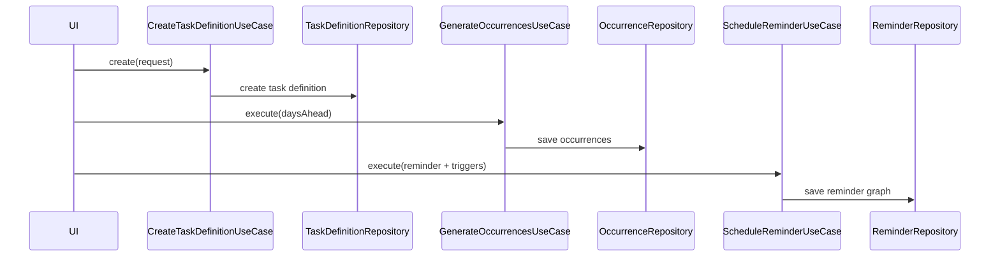
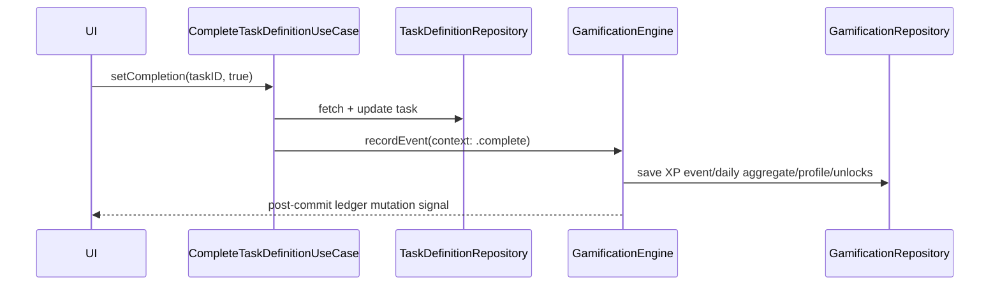

# Tasker Data Model Reference (V3 Runtime)

**Last validated against code on 2026-03-22**

This document is the canonical data-model map for the shipped runtime.
It covers:
- CoreData schema (`TaskModelV3`)
- Domain definition models and ID rules
- Compatibility columns retained in storage
- Ownership of writes and high-risk invariants

Habit-specific data-model and runtime depth is intentionally documented in `docs/habits/data-model-and-runtime.md`.

Primary source anchors:
- `To Do List/TaskModelV3.xcdatamodeld/.xccurrentversion`
- `To Do List/TaskModelV3.xcdatamodeld/TaskModelV3_Gamification.xcdatamodel/contents`
- `To Do List/Domain/Models/Task.swift`
- `To Do List/Domain/Models/ScheduleTemplate.swift`
- `To Do List/Domain/Models/Occurrence.swift`
- `To Do List/Domain/Models/ReminderDefinition.swift`
- `To Do List/Domain/Models/ExternalSyncModels.swift`
- `To Do List/Domain/Models/SyncMergeState.swift`
- `To Do List/Domain/Models/AssistantAction.swift`
- `To Do List/Domain/Models/Tombstone.swift`
- `To Do List/State/Repositories/*.swift`

## Core Principles

### 1) Canonical IDs
- UUID identity is canonical across the model.
- Cross-entity links are UUID-based (`projectID`, `taskID`, `lifeAreaID`, `occurrenceID`, etc.).
- Repository writes must preserve one logical identity per entity row.

### 2) Definition-first Domain Contracts
- Runtime mutation contracts are centered on `TaskDefinition` and companion definition models.
- Read-model queries return `TaskDefinitionSliceResult` and repository aggregates.
- UI contracts should not rely on removed legacy task aliases.

### 3) Compatibility Columns Are Storage-Level, Not Domain-Level
- Some alias columns remain in CoreData for migration continuity.
- Domain/public runtime fields are canonical (`title`, `projectName`, `tagIDs`, etc.).
- New logic should write canonical fields first; compatibility fields are defensive persistence concerns.

### 4) Sync Metadata Is First-Class
- External sync mappings persist merge envelopes and clocks.
- Tombstone lifecycle and merge-state clocks are required for safe reconcile behavior.

## Bounded Contexts

| Context | Canonical model roots | Primary writers |
| --- | --- | --- |
| Planning | `LifeArea`, `Project`, `ProjectSection`, `Tag` | manage-* planning usecases + project repair/seed paths |
| Task graph | `TaskDefinition`, `TaskDependency`, `TaskTagLink` | create/update/delete/complete/reschedule task-definition usecases |
| Habit | `HabitDefinition`, `ScheduleTemplate`, `Occurrence`, `OccurrenceResolution` | `CreateHabitUseCase`, `UpdateHabitUseCase`, `PauseHabitUseCase`, `ArchiveHabitUseCase`, `SyncHabitScheduleUseCase`, `ResolveHabitOccurrenceUseCase`, `RecomputeHabitStreaksUseCase` |
| Scheduling | `ScheduleTemplate`, `ScheduleRule`, `ScheduleException`, `Occurrence`, `OccurrenceResolution` | scheduling usecases + `CoreSchedulingEngine` |
| Reminder | `Reminder`, `ReminderTrigger`, `ReminderDelivery` | `ScheduleReminderUseCase`, sync reconcile flows |
| Sync mapping | `ExternalContainerMap`, `ExternalItemMap` | link/reconcile external reminders usecases |
| Gamification | `GamificationProfile`, `XPEvent`, `AchievementUnlock`, `DailyXPAggregate`, `FocusSession` | `GamificationEngine`, `FocusSessionUseCase`, `MarkDailyReflectionCompleteUseCase` (`RecordXPUseCase` legacy path retained) |
| Assistant runs | `AssistantActionRun` | `AssistantActionPipelineUseCase` |
| Deletion lifecycle | `Tombstone` | delete + maintenance/purge usecases |

## Entity Dictionary

| Entity | Core attributes (non-exhaustive) | Key relationships | Required invariants | Primary mutation owners |
| --- | --- | --- | --- | --- |
| `LifeArea` | `id`, `name`, `color`, `icon`, `sortOrder`, archive/timestamps | to-many projects/habits | stable UUID identity; seedable default `General` | `ManageLifeAreasUseCase`, bootstrap defaults |
| `Project` | `id`, `projectID`, `name`, `projectName`, `lifeAreaID`, inbox/default flags, status, timestamps | to-one life area; to-many sections/tasks/container maps | canonical inbox identity; collision repair must keep referential integrity | `ManageProjectsUseCase`, startup repair |
| `ProjectSection` | `id`, `projectID`, `name`, `sortOrder`, `isCollapsed` | to-one project; to-many tasks | section belongs to one project | `ManageSectionsUseCase` |
| `Tag` | `id`, `name`, `color`, `icon`, `sortOrder` | to-many task links | tag identity stable across link replacement | `ManageTagsUseCase` |
| `TaskDefinition` | `id`, `taskID`, `projectID`, `lifeAreaID`, `sectionID`, `title`, `priority`, status, due/completion timestamps | to-one project/section/parent/habit; to-many child/dependency/tag links | identity uniqueness; completion-state consistency; link integrity | task-definition usecases + repository |
| `TaskDependency` | `id`, `taskID`, `dependsOnTaskID`, `kind`, `createdAt` | to-one task and depended-on task | dedupe by `(taskID, dependsOnTaskID, kind)` | dependency repository |
| `TaskTagLink` | `id`, `taskID`, `tagID`, `createdAt` | to-one task and tag | replace-set semantics, no duplicate links | tag-link repository |
| `HabitDefinition` | `id`, `title`, `lifeAreaID`, `projectID`, `kindRaw`, `trackingModeRaw`, icon/notes fields, pause/archive flags, streak/risk caches, mask caches, reminder window, timestamps | to-one life area/project; to-one schedule template by `sourceType/sourceID`; to-many occurrences/resolutions via schedule runtime | positive habits normalize to `dailyCheckIn`; paused habits are excluded from active projections; history truth comes from occurrences + resolutions | focused habit runtime usecases + habit repository |
| `ScheduleTemplate` | `id`, source refs, timezone/window fields, timestamps | to-many rules/exceptions/occurrences | template identity stable for recurrence | schedule repository |
| `ScheduleRule` | recurrence/by* fields + payload | to-one template | belongs to one template | schedule repository |
| `ScheduleException` | `occurrenceKey`, action/move payload | to-one template | exception keys match occurrence identity | schedule repository + resolve usecase |
| `Occurrence` | `id`, `occurrenceKey`, template/source refs, scheduled/due/state | to-one template; to-many reminders/resolutions | `occurrenceKey` immutable after persistence | scheduling engine + occurrence repository |
| `OccurrenceResolution` | resolution type/timestamps/actor/reason | to-one occurrence | must reference existing occurrence | resolve usecase |
| `Reminder` | source refs/policy/channel/enabled/timestamps | to-one occurrence; to-many triggers | channel/policy constraints preserved | schedule reminder + sync reconcile |
| `ReminderTrigger` | type/fireAt/offset/location payload | to-one reminder | trigger belongs to one reminder | schedule reminder usecase |
| `ReminderDelivery` | trigger/reminder refs + delivery status timestamps/errors | operational edge state | monotonic delivery status transitions | schedule reminder usecase |
| `GamificationProfile` | XP total, level, streak fields | none | reconcile with XP ledger | `GamificationEngine` (`RecordXPUseCase` legacy path retained) |
| `XPEvent` | task/occurrence refs, delta, reason, idempotency key, timestamp | to-many unlocks | idempotency key prevents duplicate award writes | `GamificationEngine` |
| `AchievementUnlock` | achievement key, unlock timestamp, source event ID | to-one source XP event | unlock traceability to XP event | `GamificationEngine` |
| `DailyXPAggregate` | `dateKey`, total XP, event count, updated timestamp | none | canonical one-row-per-day semantics by `dateKey` | `GamificationEngine` reconciliation and record path |
| `FocusSession` | task ref, start/end, duration, completion flag, XP awarded | none | session ID uniqueness and duration integrity | `FocusSessionUseCase` |
| `ExternalContainerMap` | provider/project/container IDs, sync flags/metadata | to-one project | one active map per provider+project expectation | `LinkExternalRemindersUseCase` |
| `ExternalItemMap` | provider + local/external keys + merge payload/state | none | uniqueness by local and external key; sync-state preservation | link/reconcile usecases |
| `Tombstone` | entity type/id, deleted metadata, `expiresAt` | none | purge lifecycle respected | delete/purge/maintenance flows |
| `AssistantActionRun` | thread, status, proposal/result payloads, apply/undo trace fields | none | lifecycle transitions constrained and auditable | assistant pipeline usecase |

## Compatibility Columns (Intentional Schema Overlap)

These columns remain in storage for migration continuity and defensive reads.
They are not a license to reintroduce deprecated domain aliases.

| Domain concern | Canonical runtime field | Compatibility column(s) retained in schema |
| --- | --- | --- |
| Task title | `TaskDefinition.title` | `TaskDefinition.name` |
| Task priority | `TaskDefinition.priority` | `TaskDefinition.taskPriority` |
| Project naming | `Project.name` (domain display source) | `Project.projectName` |
| Project description | `Project.projectDescription` | `Project.projecDescription` (legacy typo) |
| Project/task identity | `id` | `projectID` / `taskID` companion identity columns |

## Identity and Dedupe Guardrails

| Rule | Enforcement path |
| --- | --- |
| Require valid UUID identity before writes | `V2CoreDataRepositorySupport` helper methods |
| Canonical object resolution before upsert/update | task/project/sync repositories + support helper |
| Task dependency dedupe by composite key | `CoreDataTaskDependencyRepository.replaceDependencies` |
| Task tag links replaced as full set | `CoreDataTaskTagLinkRepository.replaceTagLinks` |
| Occurrence identity immutable by key | `CoreDataOccurrenceRepository` + scheduling engine |
| External mapping canonicalization by local/external key | `CoreDataExternalSyncRepository` |

## Lifecycle Flow: Task -> Occurrence -> Reminder

## Lifecycle Flow: Completion -> XP -> Unlock

## Write Ownership Matrix

| Entity group | Primary usecase writers | Repository writers |
| --- | --- | --- |
| Planning | `ManageLifeAreasUseCase`, `ManageProjectsUseCase`, `ManageSectionsUseCase`, `ManageTagsUseCase` | corresponding CoreData planning repositories |
| Task graph | create/update/delete/complete/reschedule task-definition usecases | task-definition, dependency, tag-link repositories |
| Habit | `CreateHabitUseCase`, `UpdateHabitUseCase`, `PauseHabitUseCase`, `ArchiveHabitUseCase`, `SyncHabitScheduleUseCase`, `ResolveHabitOccurrenceUseCase`, `RecomputeHabitStreaksUseCase` | habit repository + schedule/occurrence repositories + scheduling engine |
| Schedule/occurrence | generate/resolve/maintain occurrence usecases | schedule/occurrence repositories + scheduling engine |
| Reminder | `ScheduleReminderUseCase`, reconcile flows | reminder repository |
| External sync | link/reconcile reminders usecases | external sync repository |
| Gamification | `GamificationEngine`, `FocusSessionUseCase`, `MarkDailyReflectionCompleteUseCase` (`RecordXPUseCase` compatibility) | gamification repository |
| Assistant actions | `AssistantActionPipelineUseCase` | assistant action repository |
| Tombstones | delete + purge/maintenance usecases | tombstone repository |

## Migration and Regression Hazards

| Hazard | Why risky | Guardrail |
| --- | --- | --- |
| Alias-column drift | one code path updates only compatibility columns | keep canonical-write rules and repository-level sync behavior |
| Identity column divergence (`id` vs companion IDs) | duplicate logical entities and broken links | run identity repair and preserve canonicalization helpers |
| Merge payload loss in sync | unknown fields dropped during reconcile encode/decode | preserve passthrough payload and clock state |
| Tombstone lifecycle regressions | deleted entities can resurrect or leak forever | enforce purge windows and merge tombstone clocks |

## Cross-Links

- `docs/habits/data-model-and-runtime.md`
- `docs/architecture/clean-architecture-v2.md`
- `docs/architecture/state-repositories-and-services-v2.md`
- `docs/architecture/usecases-v2.md`
- `docs/architecture/risk-register-v2.md`
