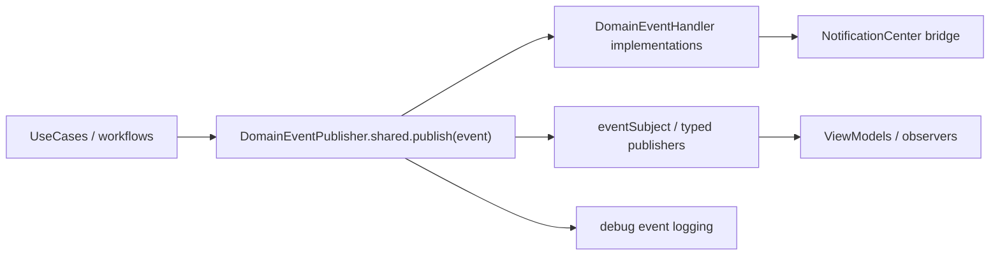

# Domain Events and Observability (V2)

**Last validated against code on 2026-02-18**

This doc describes Tasker's in-process domain-event system and observability hooks used by usecases and presentation consumers.

Primary sources:
- `To Do List/Domain/Events/DomainEvent.swift`
- `To Do List/Domain/Events/DomainEventPublisher.swift`
- `To Do List/Domain/Events/TaskEvents.swift`
- `To Do List/Domain/Events/ProjectEvents.swift`
- `To Do List/Domain/Events/TaskNotificationDispatcher.swift`
- `To Do List/UseCases/Task/*.swift`

## Event System Topology

## Core Protocols and Types

| Type | Role | Key Fields/Functions |
| --- | --- | --- |
| `DomainEvent` | base protocol for events | `eventId`, `occurredAt`, `eventType`, `aggregateId`, `metadata` |
| `SerializableDomainEvent` | persistence/transmission-capable event | `toDictionary()`, `fromDictionary(_:)` |
| `BaseDomainEvent` | convenience concrete baseline | constructor with `eventType`, `aggregateId`, optional metadata |
| `DomainEventHandler` | handler contract | `handle(_:)`, `canHandle(_:)` |
| `DomainEventPublisher` | in-process bus + replay storage | `publish`, `register`, typed publishers (`taskEvents`, `projectEvents`, etc.) |

## Event Families

| Family | Primary Files | Examples |
| --- | --- | --- |
| Task events | `TaskEvents.swift` | `TaskCreatedEvent`, `TaskCompletedEvent`, `TaskUpdatedEvent`, etc. |
| Project events | `ProjectEvents.swift` | `ProjectCreatedEvent`, `ProjectUpdatedEvent`, `ProjectArchivedEvent`, etc. |
| Custom usecase events | task usecase files | archive/bulk/habit/gameification events defined near usecases |

## Consumer Expectations and Handler Discipline

| Consumer Type | Expectation | Why |
| --- | --- | --- |
| Usecase publishers | publish domain events only after successful state transitions | avoid observers reacting to failed mutations |
| Event handlers | keep `handle(_:)` lightweight and non-blocking | handlers execute inline in publisher path |
| UI/observers | subscribe via typed publishers (`taskEvents`, `projectEvents`, etc.) and tolerate out-of-band events | stream is process-local and not a durable log |
| Notification bridges | post through `TaskNotificationDispatcher.postOnMain` when UI listeners are expected | NotificationCenter consumers can assume main-thread delivery |
| Replay/debug tooling | treat `eventStorage` as diagnostic only | storage is in-memory and cleared per process lifecycle |

Source anchors:
- `To Do List/Domain/Events/DomainEventPublisher.swift`
- `To Do List/Domain/Events/TaskNotificationDispatcher.swift`
- `To Do List/UseCases/Task/*.swift`

## Publisher Behavior

| Behavior | Current Implementation |
| --- | --- |
| Event storage | Keeps events in memory (`eventStorage`) for replay/debug |
| Handler dispatch | Iterates registered handlers and dispatches by `canHandle(eventType)` |
| Reactive stream | Emits events through `PassthroughSubject<DomainEvent, Never>` |
| Typed publishers | filters by family (`taskEvents`, `projectEvents`, `gamificationEvents`, `occurrenceEvents`) |
| Logging | emits debug logs with event type + aggregate IDs |

## Built-In Handlers

| Handler | Handles | Side Effects |
| --- | --- | --- |
| `AnalyticsEventHandler` | task/project creation/completion event types | analytics-oriented debug instrumentation |
| `NotificationEventHandler` | selected task/project events | posts `NotificationCenter` messages |
| `TaskNotificationDispatcher` | helper utility | ensures notification posting on main thread |

## Naming and Versioning Expectations

| Rule | Why |
| --- | --- |
| Event `eventType` should be stable and explicit (e.g. `TaskCompleted`) | consumers and filters depend on exact string match |
| `eventVersion` on serializable events should increment for schema changes | safe deserialization evolution |
| `metadata` should remain additive where possible | backward compatibility for observers |

## Event Evolution Policy

| Change Type | Allowed? | Required Follow-Up |
| --- | --- | --- |
| Add new event type | Yes | update handler allowlists and doc event family table |
| Add optional metadata field | Yes | keep existing keys stable and additive |
| Rename event type string | Avoid | if unavoidable, dual-publish transition window and update all filters |
| Change serializable payload shape | Controlled | bump `eventVersion`, keep backward decode path where feasible |

Source anchors:
- `To Do List/Domain/Events/DomainEvent.swift`
- `To Do List/Domain/Events/DomainEventPublisher.swift`

## Replay and Storage Caveats

| Caveat | Impact | Mitigation |
| --- | --- | --- |
| In-memory event storage is process-local | no durable audit trail across launches | treat as observability aid, not source of truth |
| Handler execution occurs inline during publish | expensive handlers can affect caller latency | keep handlers lightweight and side-effect bounded |
| Notification bridge depends on main-thread posting | background callers need marshaling | use `TaskNotificationDispatcher.postOnMain` |

## Observability Integration Points

- Event stream-level observability: `DomainEventPublisher` debug logs.
- Runtime logs/guardrails: CI and runtime safety docs in `docs/operations/ci-release-and-guardrails.md`.
- Risk-aware documentation: `docs/architecture/risk-register-v2.md`.

## Cross-Links
- Usecase contracts and side effects: `docs/architecture/usecases-v2.md`
- Runtime layering and boundaries: `docs/architecture/clean-architecture-v2.md`
