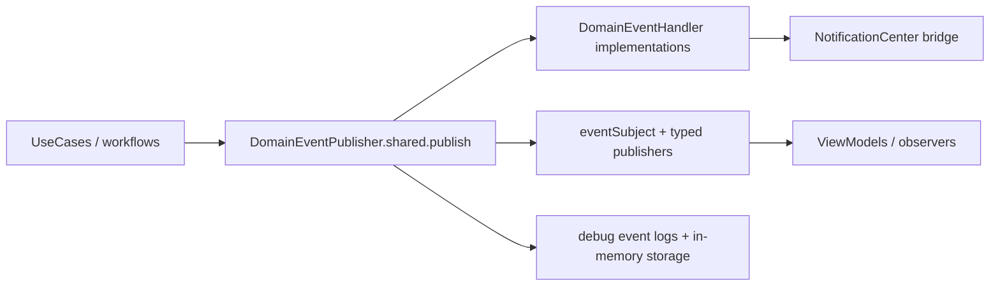

# Domain Events and Observability (V3 Runtime)

**Last validated against code on 2026-02-20**

This document describes Tasker's in-process domain event system and observability expectations.

Primary source anchors:
- `To Do List/Domain/Events/DomainEvent.swift`
- `To Do List/Domain/Events/DomainEventPublisher.swift`
- `To Do List/Domain/Events/TaskEvents.swift`
- `To Do List/Domain/Events/ProjectEvents.swift`
- `To Do List/Domain/Events/TaskNotificationDispatcher.swift`

## Event System Topology

## Core Contracts

| Type | Role | Key members |
| --- | --- | --- |
| `DomainEvent` | base protocol | `eventId`, `occurredAt`, `eventType`, `aggregateId`, `metadata` |
| `SerializableDomainEvent` | dictionary-serializable event contract | `eventVersion`, `toDictionary()`, `fromDictionary(_:)` |
| `DomainEventHandler` | handler interface | `handle(_:)`, `canHandle(_:)` |
| `DomainEventPublisher` | event bus + replay/debug storage | `publish`, `register`, typed publishers |

## Event Families (Current)

| Family | Examples | Source file |
| --- | --- | --- |
| Task events | `TaskCreatedEvent`, `TaskCompletedEvent`, `TaskUpdatedEvent` | `TaskEvents.swift` |
| Project events | `ProjectCreatedEvent`, `ProjectUpdatedEvent`, `ProjectArchivedEvent` | `ProjectEvents.swift` |
| Publisher typed streams | task/project/gamification/occurrence filtered streams | `DomainEventPublisher.swift` |

## Publisher Behavior

| Behavior | Current implementation |
| --- | --- |
| Event storage | in-memory `eventStorage` for replay/debug only |
| Handler dispatch | synchronous iteration of registered handlers by `canHandle(eventType)` |
| Reactive stream | `PassthroughSubject<DomainEvent, Never>` |
| Typed publishers | filtered streams for task/project/gamification/occurrence event types |
| Logging | debug log entries on publish and stream sink |

## Built-in Handler Roles

| Handler | Event scope | Side effects |
| --- | --- | --- |
| `AnalyticsEventHandler` | selected task/project creation/completion events | analytics-oriented logging hooks |
| `NotificationEventHandler` | selected task/project events | NotificationCenter posting |
| `TaskNotificationDispatcher` | helper utility | enforces main-thread posting for notifications |

## Operational Expectations

1. Publish events only after successful state transitions.
2. Keep handlers lightweight; they run inline in the publish path.
3. Treat `eventStorage` as diagnostics, not durable audit history.
4. Use stable `eventType` values and additive metadata evolution.
5. When payload shape changes, bump `eventVersion` and preserve decode compatibility when practical.

## Replay and Caveats

| Caveat | Impact | Mitigation |
| --- | --- | --- |
| Process-local storage | no cross-launch durability | use for debugging, not historical truth |
| Inline handler execution | slow handlers can add request latency | keep handlers bounded and fast |
| NotificationCenter bridging | UI listeners need main-thread safety | post via `TaskNotificationDispatcher.postOnMain` |

## Cross-Links

- `docs/architecture/usecases-v2.md`
- `docs/architecture/clean-architecture-v2.md`
- `docs/architecture/risk-register-v2.md`
