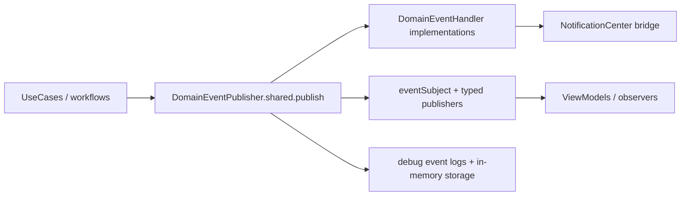

# Domain Events and Observability (V3 Runtime)

**Last validated against code on 2026-02-27**

This document describes Tasker's in-process domain event system and observability expectations.

Primary source anchors:
- `To Do List/Domain/Events/DomainEvent.swift`
- `To Do List/Domain/Events/DomainEventPublisher.swift`
- `To Do List/Domain/Events/TaskEvents.swift`
- `To Do List/Domain/Events/ProjectEvents.swift`
- `To Do List/Domain/Events/TaskNotificationDispatcher.swift`
- `To Do List/UseCases/Gamification/GamificationEngine.swift`
- `To Do List/Presentation/ViewModels/InsightsViewModel.swift`
- `To Do List/LLM/Views/Chat/ChatView.swift`
- `To Do List/Presentation/ViewModels/AddTaskViewModel.swift`
- `To Do List/Presentation/ViewModels/HomeViewModel.swift`
- `To Do List/AppDelegate.swift`

## Event System Topology

## Core Contracts

| Type | Role | Key members |
| --- | --- | --- |
| `DomainEvent` | base protocol | `eventId`, `occurredAt`, `eventType`, `aggregateId`, `metadata` |
| `SerializableDomainEvent` | dictionary-serializable event contract | `eventVersion`, `toDictionary()`, `fromDictionary(_:)` |
| `DomainEventHandler` | handler interface | `handle(_:)`, `canHandle(_:)` |
| `DomainEventPublisher` | event bus + replay/debug storage | `publish`, `register`, typed publishers |

## Event Families (Current)

| Family | Examples | Source file |
| --- | --- | --- |
| Task events | `TaskCreatedEvent`, `TaskCompletedEvent`, `TaskUpdatedEvent` | `TaskEvents.swift` |
| Project events | `ProjectCreatedEvent`, `ProjectUpdatedEvent`, `ProjectArchivedEvent` | `ProjectEvents.swift` |
| Gamification mutation notification path | `Notification.Name.gamificationLedgerDidMutate` + `GamificationLedgerMutation` payload | `GamificationEngine.swift`, `HomeViewModel.swift`, `InsightsViewModel.swift` |
| Publisher typed streams | task/project/gamification/occurrence filtered streams | `DomainEventPublisher.swift` |

## Publisher Behavior

| Behavior | Current implementation |
| --- | --- |
| Event storage | in-memory `eventStorage` for replay/debug only |
| Handler dispatch | synchronous iteration of registered handlers by `canHandle(eventType)` |
| Reactive stream | `PassthroughSubject<DomainEvent, Never>` |
| Typed publishers | filtered streams for task/project/gamification/occurrence event types |
| Logging | debug log entries on publish and stream sink |

## Built-in Handler Roles

| Handler | Event scope | Side effects |
| --- | --- | --- |
| `AnalyticsEventHandler` | selected task/project creation/completion events | analytics-oriented logging hooks |
| `NotificationEventHandler` | selected task/project events | NotificationCenter posting |
| `TaskNotificationDispatcher` | helper utility | enforces main-thread posting for notifications |

## Operational Expectations

1. Publish events only after successful state transitions.
2. Keep handlers lightweight; they run inline in the publish path.
3. Treat `eventStorage` as diagnostics, not durable audit history.
4. Use stable `eventType` values and additive metadata evolution.
5. When payload shape changes, bump `eventVersion` and preserve decode compatibility when practical.

## Canonical Gamification Signal Path

Current canonical freshness signal for XP-facing UI is NotificationCenter-based:
- Name: `Notification.Name.gamificationLedgerDidMutate`
- Emission point: `GamificationEngine` after successful commit chain.
- Primary consumers: `HomeViewModel` and `InsightsViewModel`.

Payload (`GamificationLedgerMutation`) fields:
- `source`, `category`
- `awardedXP`, `dailyXPSoFar`
- `totalXP`, `level`, `previousLevel`, `streakDays`
- `didChange`, `dateKey`, `occurredAt`

Operational contract:
1. Mutation emitted post-commit to avoid pre-write stale reads.
2. Consumers apply immediate UI deltas; targeted recompute only when needed.
3. No TTL-based gamification refresh path is required for normal operation.

Relation to legacy `DomainEventPublisher.gamificationEvents`:
- The typed publisher remains available for process-local event streams.
- Live Home/Insights XP correctness is now notification-driven through `gamificationLedgerDidMutate`.
- Treat `DomainEventPublisher` gamification stream as auxiliary observability, not the primary UI freshness contract.

## Replay and Caveats

| Caveat | Impact | Mitigation |
| --- | --- | --- |
| Process-local storage | no cross-launch durability | use for debugging, not historical truth |
| Inline handler execution | slow handlers can add request latency | keep handlers bounded and fast |
| NotificationCenter bridging | UI listeners need main-thread safety | post via `TaskNotificationDispatcher.postOnMain` |

## AI Observability Appendix

### Domain events vs assistant telemetry

| Signal type | Mechanism | Purpose | Durability |
| --- | --- | --- | --- |
| Domain events | `DomainEventPublisher` + handlers | business state transition signaling | process-local |
| Gamification UI freshness | `gamificationLedgerDidMutate` notification + payload projection | deterministic live XP updates across Home/Insights/widgets | process-local signal backed by persistent Core Data truth |
| Assistant telemetry | `logWarning/logError` event fields | AI runtime health, UX quality, rollback and fallback behavior | log-stream/monitoring dependent |

### Required assistant telemetry event catalog

| Event | Minimum fields |
| --- | --- |
| `assistant_context_built` | `task_count`, `has_tags`, `build_ms`, `timezone` |
| `assistant_plan_mode_activated` | `thread_id`, `model`, `used_fallback`, `prompt_download` |
| `assistant_proposal_generated` | `run_id`, `model`, `command_count`, `destructive_count` |
| `assistant_proposal_rejected` | `run_id` |
| `assistant_apply_success` | `run_id` |
| `assistant_apply_failed` | `run_id`, `error` |
| `assistant_undo_invoked` | `run_id` |
| `assistant_undo_expired` | `run_id` |
| `assistant_suggestion_shown` | `model`, `confidence`, `route_banner` |
| `assistant_suggestion_accepted` | `priority`, `energy`, `type`, `context` |
| `assistant_suggestion_dismissed` | `reason` |
| `assistant_overdue_triage_shown` | `overdue_count` |
| `assistant_overdue_triage_applied` | `run_id` |
| `assistant_overdue_triage_dismissed` | optional reason |
| `assistant_daily_brief_generated` | `model`, `has_route_banner` |
| `assistant_daily_brief_opened` | notification open confirmation |
| `assistant_semantic_fallback_lexical` | `reason` |

### AI regression triage order (what to inspect first)

1. Check current AI flags (`assistantApplyEnabled`, `assistantUndoEnabled`, `assistantCopilotEnabled`, `assistantSemanticRetrievalEnabled`, `assistantBreakdownEnabled`, `llmChatPrewarmMode`, `llmChatContextStrategy`).
2. Verify startup wiring logs for `LLMContextRepositoryProvider` and `LLMAssistantPipelineProvider` configuration.
3. Inspect chat runtime logs for `chat_generation_parameters`, `quality_text_source`, visible-thinking extraction, and repetition diagnostics before assuming model-quality regression.
4. Inspect context generation signal (`assistant_context_built`) for payload completeness.
5. Inspect proposal path events (`assistant_proposal_generated`, `assistant_apply_failed`, rollback statuses).
6. Inspect deep-link/open-chat path for brief/triage pending keys and `assistant_daily_brief_opened`.
7. Inspect semantic fallback signal (`assistant_semantic_fallback_lexical`) before suspecting search regression.

## Cross-Links

- `docs/architecture/usecases-v2.md`
- `docs/architecture/clean-architecture-v2.md`
- `docs/architecture/llm-assistant-stack-v2.md`
- `docs/architecture/llm-feature-integration-handbook.md`
- `docs/architecture/risk-register-v2.md`
