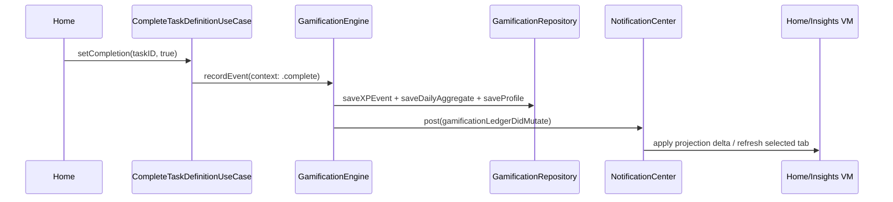
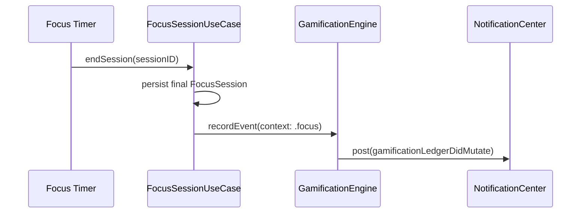
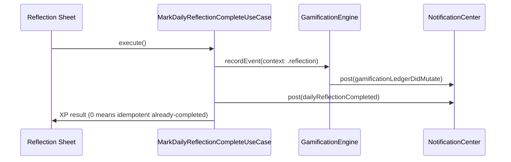
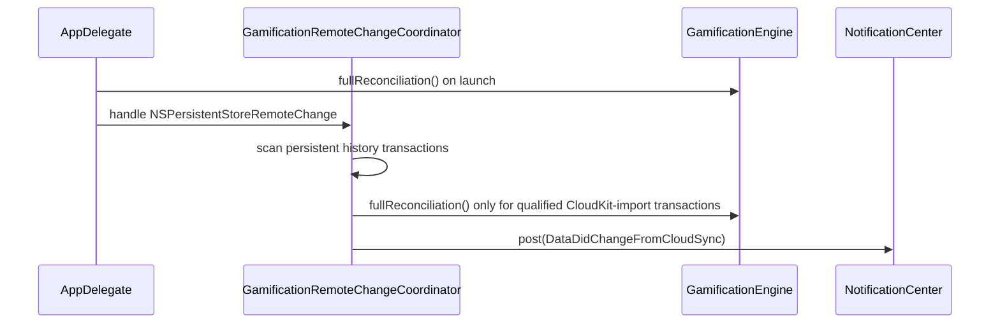

# Gamification V2 Engine Architecture

**Last validated against code on 2026-02-27**

This document is the canonical implementation reference for Tasker gamification runtime behavior.
It is engine-centric and reflects the current event-driven model used by Home, Insights, and widgets.

## Purpose and Boundaries

Gamification owns:
- XP ledger writes and reconciliation.
- Level/streak progression and achievement unlock evaluation.
- Event-driven UI freshness signals for XP-facing surfaces.
- Widget snapshot projection and timeline refresh triggers.

Gamification does not own:
- Task definition truth (`TaskDefinition` graph and scheduling state).
- General analytics scoring outside XP ledger semantics.
- Notification UX copy/catalog ownership (except reflection completion side effects).

## Primary Source Anchors

- `To Do List/UseCases/Gamification/GamificationEngine.swift`
- `To Do List/UseCases/Gamification/FocusSessionUseCase.swift`
- `To Do List/UseCases/Gamification/MarkDailyReflectionCompleteUseCase.swift`
- `To Do List/UseCases/Task/CompleteTaskDefinitionUseCase.swift`
- `To Do List/State/Repositories/CoreDataGamificationRepository.swift`
- `To Do List/Domain/Interfaces/V2RepositoryProtocols.swift`
- `To Do List/Domain/Models/XPEnums.swift`
- `To Do List/Domain/Models/XPCalculationEngine.swift`
- `To Do List/Presentation/ViewModels/HomeViewModel.swift`
- `To Do List/Presentation/ViewModels/InsightsViewModel.swift`
- `To Do List/AppDelegate.swift`
- `To Do List/Services/V2FeatureFlags.swift`
- `To Do List/Services/GamificationRemoteKillSwitchService.swift`
- `Shared/WidgetSnapshot.swift`
- `Shared/AppGroupConstants.swift`
- `TaskerWidgets/TaskerWidgetBundle.swift`
- `TaskerWidgets/TodayXPWidget.swift`
- `TaskerWidgets/WeeklyScoreboardWidget.swift`
- `TaskerWidgets/NextMilestoneWidget.swift`
- `TaskerWidgets/StreakResilienceWidget.swift`
- `TaskerWidgets/FocusSeedWidget.swift`

## Core Types and Contracts

| Type/Contract | Role | Notes |
| --- | --- | --- |
| `XPActionCategory`, `XPSource` | XP mutation classification | Categories include `complete`, `start`, `decompose`, `recoverReschedule`, `reflection`, `focus`. |
| `XPEventContext` | Input context for `GamificationEngine.recordEvent` | Carries mutation metadata, task/session IDs, and scoring inputs. |
| `XPEventResult` | Record-event output | Includes XP delta, totals, level transitions, streak, cap status, unlocks, celebration metadata. |
| `XPCelebrationPayload` | UI celebration contract | Includes award amount, level-up and milestone crossing metadata, plus cooldown seconds. |
| `GamificationLedgerMutation` | Canonical live-update signal payload | Posted via `Notification.Name.gamificationLedgerDidMutate` after commit. |
| `GamificationRepositoryProtocol` | Persistence boundary | Profile, events, unlocks, daily aggregates, and focus session APIs. |

## Data Model and Persistent Truth

Persistent truth is Core Data via `CoreDataGamificationRepository`:

| Entity | Responsibility | Key fields |
| --- | --- | --- |
| `GamificationProfile` | Long-lived user progression | `xpTotal`, `level`, streak fields, activation and thresholds. |
| `XPEvent` | Immutable XP ledger entries | `delta`, `idempotencyKey`, `category`, `source`, `createdAt`. |
| `AchievementUnlock` | Achievement unlock history | `achievementKey`, `unlockedAt`, `sourceEventID`. |
| `DailyXPAggregate` | O(1) daily totals | `dateKey`, `totalXP`, `eventCount`. |
| `FocusSession` | Focus lifecycle records | start/end, duration, completion, awarded XP mirror. |

Truth boundaries:
- Core Data ledger/profile rows are authoritative.
- Session view models keep projections and apply incremental diffs for low-latency UI.
- Reconciliation is the correctness fallback for uncertain/remote mutation conditions.

## Event Lifecycle Flows

### Task completion XP flow

### Focus session end XP flow

### Reflection completion flow

### Reconciliation flow (launch and qualified cloud import)

## Engine Behavior Details

### Idempotency key composition

`XPCalculationEngine.idempotencyKey` composes per-category keys:
- `complete`: `complete:<taskID>`
- `start`: `start:<taskID>`
- `decompose`: parent-child pair key
- `recoverReschedule`: task and day-transition key
- `reflection`: period key (`yyyy-MM-dd`)
- `focus`: session key

`recordEvent` checks `hasXPEvent(idempotencyKey:)` before writing.

### XP formula

For non-focus categories:
- `baseXP(category)` + optional `onTimeBonusXP()`.
- Multiplied by quality weight: priority + effort + focus/pin bonuses.
- Clamped by global daily cap via `calculateFinalXP(..., dailyEarnedSoFar, cap)`.

For focus:
- `focusSessionXP(durationSeconds)` uses per-minute accrual above minimum duration threshold.

### Level curve and milestone behavior

- Early levels use fixed thresholds (`earlyLevelThresholds`).
- Tail curve uses polynomial growth (`xpForLevel`).
- `levelForXP` returns current and next thresholds.
- Milestones are static named XP thresholds; crossing is detected from previous/new totals.

### Achievement evaluation

- Engine fetches unlock state and evaluates `AchievementCatalog`.
- Newly unlocked achievements are persisted as `AchievementUnlock` rows.
- Unlock payloads are returned in `XPEventResult.unlockedAchievements`.

### Streak semantics

`updateStreak` evaluates day-to-day continuity using start-of-day comparisons:
- Same day: no streak change.
- Next day: increment current streak.
- Gap >1 day: reset current streak and optionally track return streak.

## Correctness and Failure Handling

### Post-commit mutation emission

`GamificationLedgerDidMutate` is emitted after persistence completes, and includes:
- source/category
- `awardedXP`, `dailyXPSoFar`
- `totalXP`, `level`, `previousLevel`
- streak, `didChange`, `dateKey`, `occurredAt`

### Read-after-write freshness

`CoreDataGamificationRepository` uses:
- background write context for writes.
- dedicated read context for queries.
- `readContext.reset()` after successful writes to avoid stale registered-object snapshots.

### Schema guardrails

Repository validates required entities/attributes at init.
If schema is missing, it fails safely and returns explicit schema errors rather than mutating partial state.

### Partial-write recovery

If event persistence succeeds but aggregate/profile write fails, engine triggers `fullReconciliation()` and retries returning coherent state from ledger truth.

## Performance Model

### Event-driven freshness

- No TTL-based refresh path.
- UI freshness is mutation-driven from `gamificationLedgerDidMutate`.
- `HomeViewModel` applies immediate scalar updates and uses one-shot watchdog fallback.
- `InsightsViewModel` applies projection deltas for loaded tabs and marks others dirty.

### Incremental Insights projections

`InsightsViewModel` keeps per-tab refresh state (`isLoaded`, `inFlight`, version counters, replay flags):
- Known local XP mutations: O(1) tab state deltas.
- Unknown mutations (`cloudReconciled`, day boundary): targeted recompute for affected tabs.
- Normal tab switching does not force all-tab recompute.

## Cloud Sync Loop Prevention

Remote-change handling is persistent-history driven:
- `GamificationRemoteChangeCoordinator` scans transactions since stored token.
- `GamificationRemoteChangeClassifier` qualifies only CloudKit-import-like authors/contexts.
- Only qualified external imports trigger reconciliation and cloud-sync notifications.
- Burst remote-change signals are coalesced on a serial queue.

This avoids local-write -> remote-change -> full-reconcile feedback loops.

## Widget Snapshot Architecture

Snapshot contract:
- Writer: `GamificationEngine.writeWidgetSnapshot()`.
- Storage: App Group JSON (`group.com.saransh1337.tasker.shared`, `GamificationWidgetSnapshot.json`).
- Reader: widgets under `TaskerWidgets/*`.

Snapshot fields include:
- Daily XP and cap, level and total XP, level thresholds.
- Streak and best streak.
- Tasks completed and focus minutes today.
- Weekly bars and weekly total.
- Next milestone and progress.
- `updatedAt`.

Timeline triggers:
- Snapshot write after XP-affecting events and reconciliation changes.
- `WidgetCenter.reloadAllTimelines()` only when widget flag is enabled.

Project metadata note:
- Widget source files are present in repository.
- Validate `TaskerWidgets` extension target wiring in Xcode project metadata before release builds.

## Observability and Debug Runbook

Key log events:
- `gamification_schema_guard_failed`
- `gamification_partial_write_recovery_started`
- `gamification_partial_write_recovery_*`
- `gamification_remote_history_scan`
- `gamification_remote_history_fetch_failed`
- `gamification_remote_reconciliation_failed`
- `gamification_remote_config_applied`
- `gamification_ledger_watchdog_refresh`

Debug triage checklist:
1. Confirm `V2FeatureFlags` and remote kill-switch status.
2. Verify `recordEvent` succeeded and `gamificationLedgerDidMutate` was emitted.
3. Check Home/Insights observers are active and receiving mutation payload.
4. Inspect repository logs for schema guard/read-context resets.
5. Inspect remote-change transaction classification if CloudKit churn is suspected.
6. Validate widget snapshot file is written in App Group container.

## Testing Matrix and Manual Checks

### Unit and integration focus

- Idempotency: repeated same action awards once.
- Daily cap enforcement under burst events.
- Read-after-write freshness in same app session.
- Daily aggregate canonicalization by `dateKey`.
- Reconciliation correctness vs ledger replay.
- Reflection idempotency (`isCompletedToday`) and zero-XP behavior.
- Insights event-driven updates and in-flight replay handling.

### Manual smoke checks

1. Complete task -> Home XP + Insights Today/Week/Systems update without restart.
2. End focus session -> XP mutation reflected live.
3. Reflection first claim awards XP; second claim shows already completed.
4. Cloud import simulation triggers one qualified reconciliation path.
5. Widgets reflect fresh snapshot values and focus deep link route works (`tasker://focus`).

## Cross-Links

- `docs/architecture/usecases-v2.md`
- `docs/architecture/data-model-v2.md`
- `docs/architecture/state-repositories-and-services-v2.md`
- `docs/architecture/domain-events-and-observability-v2.md`
- `docs/architecture/clean-architecture-v2.md`
- `docs/architecture/risk-register-v2.md`
