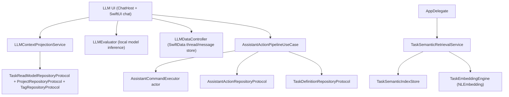

# LLM and Assistant Stack (V3 Runtime)

**Last validated against code on 2026-02-21**

This document defines the runtime boundaries and integration contracts for Tasker's on-device AI features.
It covers:
- local LLM chat and context projection,
- AI-assisted UX surfaces,
- transactional assistant mutation flow (`propose -> confirm -> apply -> undo`), and
- semantic retrieval and reranking.

Primary source anchors:
- `To Do List/LLM/ChatHostViewController.swift`
- `To Do List/LLM/Views/Chat/ChatView.swift`
- `To Do List/LLM/Views/Chat/ConversationView.swift`
- `To Do List/LLM/Models/Data.swift`
- `To Do List/LLM/Models/LLMContextProjectionService.swift`
- `To Do List/LLM/Models/LLMAssistantPipelineProvider.swift`
- `To Do List/LLM/Models/AssistantPlannerService.swift`
- `To Do List/LLM/Models/AssistantEnvelopeValidator.swift`
- `To Do List/LLM/Models/AssistantDiffPreviewBuilder.swift`
- `To Do List/LLM/Models/AssistantCardPayload.swift`
- `To Do List/LLM/Models/AISuggestionService.swift`
- `To Do List/LLM/Models/TaskBreakdownService.swift`
- `To Do List/LLM/Models/OverdueTriageService.swift`
- `To Do List/LLM/Models/DailyBriefService.swift`
- `To Do List/LLM/Models/AIChatModeRouter.swift`
- `To Do List/LLM/Models/TaskEmbeddingEngine.swift`
- `To Do List/LLM/Models/TaskSemanticIndexStore.swift`
- `To Do List/LLM/Models/TaskSemanticRetrievalService.swift`
- `To Do List/LLM/Models/LLMDataController.swift`
- `To Do List/UseCases/LLM/AssistantActionPipelineUseCase.swift`
- `To Do List/UseCases/LLM/AssistantCommandExecutor.swift`
- `To Do List/UseCases/Task/GetTasksUseCase.swift`
- `To Do List/AppDelegate.swift`
- `To Do List/Services/V2FeatureFlags.swift`

## Boundary Model

## Responsibilities

| Surface | Owns | Must not own |
| --- | --- | --- |
| `/To Do List/LLM/*` | UI behavior, prompt/context assembly, local inference, local chat persistence, card rendering, model routing | direct task mutation bypassing assistant pipeline |
| `/To Do List/UseCases/LLM/*` | run lifecycle and transactional command execution | UI state management and display logic |
| `/To Do List/AppDelegate.swift` | DI wiring, semantic indexing lifecycle wiring, daily brief scheduling and deep-link seeding | chat rendering or proposal diff generation |

## Feature Surface Inventory

| Surface | Entry point | Mutating | Model route | Core contracts |
| --- | --- | --- | --- | --- |
| Chat Ask mode | `ChatView` | No | route via installed/current model (`AIChatModeRouter` where applicable) | read-only, no pipeline calls |
| Chat Plan mode | `ChatView` Ask/Plan toggle | Yes (user-confirmed only) | `AIChatModeRouter.route(.planMode, ...)` | strict envelope parse/validate; proposal card before apply |
| Add Task suggestion | `AddTaskViewModel` + `AddTaskForedropView` | No | `AIChatModeRouter.route(.addTaskSuggestion, ...)` | `TaskFieldSuggestion` with confidence + repair decode pass |
| Home top-3 | `HomeViewModel.helpMeChooseTop3()` | No | `AIChatModeRouter.route(.topThree, ...)` | ranked rationale + confidence rendering |
| Overdue triage | `HomeViewModel` + sheet actions | Yes (Apply All only) | rule-based plan + pipeline apply | `propose -> confirm -> apply` enforced |
| Task breakdown | `TaskDetailViewModel.generateAIBreakdown` | Yes (user-selected step creation) | `AIChatModeRouter.route(.breakdown, ...)` | 3-6 step suggestion + user subset apply |
| Daily brief | background + notification open | No | `AIChatModeRouter.route(.dailyBrief, ...)` | cached daily brief + chat deep-link seed |
| Semantic retrieval | chat context + search rerank | No direct mutations | `TaskEmbeddingEngine` local embeddings | local-only top-K + lexical fallback logging |

## Traceability Matrix (Code -> Docs)

| Implementation anchor | Documented in section |
| --- | --- |
| `ChatView` ask/plan/apply/undo and card actions | Chat Plan/Apply Bridge, Safety Contracts |
| `ConversationView` proposal/undo card statuses | Card Transport Contract |
| `LLMContextProjectionService` enriched schema + tags | Context Projection Schema |
| `LLMAssistantPipelineProvider` DI setup in `AppDelegate` | DI and Wiring |
| `AISuggestionService`, `TaskBreakdownService`, `OverdueTriageService`, `DailyBriefService` | Feature Surface Inventory |
| `AIChatModeRouter` fallback/banner behavior | Model Routing Contract |
| `TaskEmbeddingEngine`, `TaskSemanticIndexStore`, `TaskSemanticRetrievalService` | Semantic Retrieval Layer |
| `V2FeatureFlags` AI controls | Feature Flag Dependencies |

## DI and Wiring

1. `AppDelegate.setupCleanArchitecture()` configures:
- `LLMContextRepositoryProvider.configure(taskReadModelRepository:projectRepository:tagRepository:)`
- `LLMAssistantPipelineProvider.configure(pipeline:)`
2. `AppDelegate.configureSemanticRetrievalIndexingIfNeeded()` loads persisted index, rebuilds snapshot, and subscribes to `.homeTaskMutation`.
3. `AppDelegate.applicationDidEnterBackground` persists semantic index when enabled.

## Context Projection Schema

### Query behavior
- `buildTodayJSON`: day-scoped query with completed tasks included.
- `buildUpcomingJSON`: upcoming open tasks query.
- `buildProjectJSON`: project-scoped query with project metadata.
- Context is rebuilt per generation request (no one-time thread cache).

### Payload-level fields
- `timezone`
- `generated_at_iso`
- `context_version`

### Task-level fields
- `id`
- `title`
- `is_completed`
- `project`
- `project_id`
- `priority`
- `energy`
- `context`
- `type`
- `estimated_duration_minutes`
- `has_dependencies`
- `dependency_count`
- `tag_ids`
- `tag_names`
- `due_date`

### Observability
- `assistant_context_built` emitted with `task_count`, `has_tags`, `build_ms`, `timezone`.

## Chat Plan/Apply Bridge

### Envelope generation and validation
1. Plan mode uses `AssistantPlannerService` and local model output.
2. `AssistantEnvelopeValidator` executes parse + one repair pass + schema/task-reference validation.
3. Validated envelope is sent to pipeline `propose`.

### Card Transport Contract

`AssistantCardPayload` is serialized into `Message.content` with sentinel prefix:
- Prefix: `__TASKER_CARD_V1__\n`
- `card_type`: `proposal | undo | status | error`
- `status`: `pending | confirmed | applied | rejected | failed | rollbackComplete | rollbackFailed | undoAvailable | undoExpired | undone`

Required proposal fields:
- `run_id`
- `thread_id`
- `affected_task_count`
- `destructive_count`
- `diff_lines`

### Safety contracts
1. Ask mode is read-only and default mode.
2. Proposal must render before any apply.
3. `deleteTask` and `moveTask` require destructive confirmation before apply.
4. Card actions validate run/thread ownership before reject/apply/undo.
5. Apply uses iOS background task guard with guaranteed `endBackgroundTask` via `defer`.
6. Session circuit breaker disables plan/apply after 3 consecutive apply failures.

### Transaction invariant
`propose -> confirm -> applyConfirmedRun -> undoAppliedRun` is the only mutation contract for assistant-driven task changes.

## Model Routing Contract

`AIChatModeRouter` defines ideal models, fallback candidates, device-budget constraints, and user-visible fallback banner behavior.

Route expectations:
- `.addTaskSuggestion`, `.dynamicChips`, `.dailyBrief`: lightweight model preference.
- `.planMode`, `.topThree`, `.breakdown`: higher-capacity model preference.
- Fallback is explicit (never silent) and may prompt model download when ideal is absent and device budget allows.

## Semantic Retrieval Layer (Local Only)

### Components
- `TaskEmbeddingEngine`: local embedding vectors (`NLEmbedding`).
- `TaskSemanticIndexStore`: local vector/text store persisted as `Application Support/tasker-semantic-index-v1.bin`.
- `TaskSemanticRetrievalService`: search and rerank APIs.

### Lifecycle
1. App startup: load persisted index, then rebuild snapshot.
2. Mutation updates: `.homeTaskMutation` drives incremental `index` or `remove` updates.
3. Background: persist index on app backgrounding.
4. Recovery: full rebuild path remains available when context is missing or observer payload is incomplete.

### Consumption points
- Chat context appends semantic top-K snippets.
- `GetTasksUseCase` reranks lexical results when semantic feature flag is enabled.

### Fallback
If embeddings unavailable:
- semantic returns empty hits,
- lexical path remains canonical fallback,
- log event: `assistant_semantic_fallback_lexical`.

## Assistant Transaction Pipeline

| Stage | Behavior | Key guards |
| --- | --- | --- |
| `propose` | validates envelope shape/range and persists pending run | schema range checks |
| `confirm` | transitions run to confirmed | run existence and status checks |
| `applyConfirmedRun` | allowlist validation, serialized execution, undo plan generation, persistence | `assistantApplyEnabled`, status/allowlist/schema checks |
| `reject` | marks run rejected | run existence and status checks |
| `undoAppliedRun` | executes compensating commands inside undo window | `assistantUndoEnabled`, applied state, undo payload, window bound |

## Timeouts and Budgets

| Budget | Value | Source |
| --- | --- | --- |
| undo window | 30 minutes | `AssistantActionPipelineUseCase` |
| per-command timeout | 10 seconds | `AssistantActionPipelineUseCase` |
| per-run timeout | 90 seconds | `AssistantActionPipelineUseCase` |
| sync context/project lookup timeout | 3 seconds | `LLMContextProjectionService` |

## Failure Modes and Operator Actions

| Failure mode | Detection | User-facing result | Operator action |
| --- | --- | --- | --- |
| invalid envelope parse/schema | validator failure | proposal generation error message | inspect model output and schema bounds |
| run/thread ownership mismatch | pre-action run fetch mismatch | card action blocked | verify thread/run IDs in payload |
| stale context apply failure | apply error contains stale/not-found signals | card shows refresh-context guidance | refresh context and re-plan |
| rollback verified after apply failure | pipeline rollback status `verified` | rollback-complete card status | inspect failing command in run trace |
| rollback failed | rollback status `failed` | rollback-failed warning status | disable plan/apply temporarily, investigate repository invariants |
| session circuit breaker triggered | 3 consecutive apply failures | plan/apply disabled for session | root-cause failing envelopes before re-enable |
| embeddings unavailable | semantic fallback event | lexical-only relevance | verify `NaturalLanguage` runtime availability |

## Feature Flag Dependencies

| Flow | Flags |
| --- | --- |
| assistant apply | `assistantApplyEnabled` |
| assistant undo | `assistantUndoEnabled` |
| assistant chat plan mode | `assistantPlanModeEnabled` |
| assistant copilot surfaces | `assistantCopilotEnabled` |
| assistant semantic retrieval | `assistantSemanticRetrievalEnabled` |
| assistant daily brief | `assistantBriefEnabled` |
| assistant breakdown surface | `assistantBreakdownEnabled` |

## Integration Contract: Chat Context vs Assistant Actions

1. Context projection remains read-only and repository-backed.
2. Assistant apply/undo remains transactional and repository-mediated.
3. Chat history persistence (SwiftData) and assistant run persistence (core store) remain separate systems.
4. No chat-layer direct task mutation bypass path is allowed.

## Cross-Links

- `docs/architecture/llm-feature-integration-handbook.md`
- `docs/architecture/usecases-v2.md`
- `docs/architecture/clean-architecture-v2.md`
- `docs/architecture/state-repositories-and-services-v2.md`
- `docs/architecture/risk-register-v2.md`
- `docs/architecture/domain-events-and-observability-v2.md`
- `docs/release-gate-v2-efgh.md`
