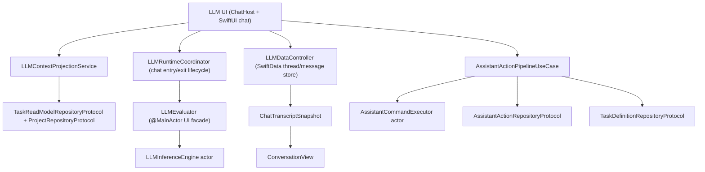

# LLM and Assistant Stack (V3 Runtime)

**Last validated against code on 2026-03-16**

This document defines boundaries between:
- local LLM chat UX and context projection, and
- transactional assistant command execution over core task data.

Primary source anchors:
- `To Do List/LLM/ChatHostViewController.swift`
- `To Do List/LLM/Models/LLMContextProjectionService.swift`
- `To Do List/LLM/Models/PromptMiddleware.swift`
- `To Do List/LLM/Models/LLMInferenceEngine.swift`
- `To Do List/LLM/Models/LLMEvaluator.swift`
- `To Do List/LLM/Models/LLMRuntimeCoordinator.swift`
- `To Do List/LLM/Models/LLMProjectionTimeout.swift`
- `To Do List/LLM/Models/LLMDataController.swift`
- `To Do List/LLM/Views/Chat/ChatTranscriptSnapshot.swift`
- `To Do List/LLM/Views/Chat/ConversationView.swift`
- `To Do List/UseCases/LLM/AssistantActionPipelineUseCase.swift`
- `To Do List/UseCases/LLM/AssistantCommandExecutor.swift`
- `To Do List/Domain/Models/AssistantAction.swift`
- `To Do List/Services/V2FeatureFlags.swift`

## Boundary Model

## Responsibilities

| Surface | Owns | Must not own |
| --- | --- | --- |
| `/To Do List/LLM/*` | chat UX, prompt assembly, local inference, chat persistence | direct transactional mutation of core task graph |
| `/To Do List/UseCases/LLM/*` | propose/confirm/apply/reject/undo state machine and transactional command execution | UI rendering and local chat presentation state |

## Context Projection Pipeline

| Component | Input | Output |
| --- | --- | --- |
| `LLMContextRepositoryProvider` | injected `taskReadModelRepository` + `projectRepository` | configured context service factory |
| `LLMContextProjectionService` | read-model task slices + project/life-area metadata | compact planning summaries for freeform chat, plus structured context for slash-command surfaces |
| `PromptMiddleware` | task range + optional project signal | prompt-ready summaries/bullets |
| `LLMProjectionTimeout` | async projection operation + timeout budget | bounded-latency payload or `{}` fallback |

### Freeform chat prompt assembly

Freeform chat uses a single shared prompt path for all local models. The runtime system prompt is assembled from:
1. the persisted `appManager.systemPrompt`,
2. a compact planning context block,
3. slash-command augmentation when present.

Freeform chat does not append extra response/context contract blocks in the bounded path.

### Compact planning context shape

The bounded freeform path is tuned for the weakest shipped chat model (`gemma-3-270m-it-4bit`). Chat context is flattened into a small plaintext block:
- `Summary: X overdue, Y today, Z tomorrow, W this week`
- `Focus:` up to 6 compact task lines
- `Projects:` up to 4 relevant names
- `Life areas:` up to 4 relevant names
- `History:` retrospective count-only lines when the user asks about prior periods

Task lines use:
- `[title] | [due label] | [project]`

The bounded freeform path intentionally omits IDs, JSON wrappers, tags, timestamps, and exhaustive lists.

## Chat Runtime Lifecycle

| Component | Responsibility |
| --- | --- |
| `LLMRuntimeCoordinator` | owns chat-screen-only lifecycle, prewarm orchestration, session counting, and unload policy |
| `ChatHostViewController.viewDidAppear` | entry trigger for chat-screen prewarm |
| `ChatHostViewController.viewWillDisappear` | definitive exit trigger for immediate unload |
| `LLMEvaluator` | main-thread observable state for progress, output, runtime phase, and cancellation |
| `LLMInferenceEngine` | actor that owns prepare/load/generate/cancel/unload for the MLX model |
| `V2FeatureFlags.llmChatPrewarmMode` | mode switch for chat prewarm policy (`disabled`, `adaptiveOnDemand`, `eager`) |

Model catalog and install surfaces are driven by `ModelConfiguration.availableModels`; optional chat models may point at any MLX-compatible Hugging Face repo ID, including non-`mlx-community` publishers such as `NexVeridian/Qwen3.5-0.8B-4bit`.

### Prewarm policy
- At most one model is prewarmed at a time.
- Chat entry prewarm starts when the chat host becomes visible, after one `Task.yield()` so navigation/presentation can settle first.
- Entry prewarm targets the currently selected chat model, not a generic background candidate.
- Entry prewarm only runs when the selected model passes the runtime gate: `modelSize <= 60% of physical RAM` and thermal state is below `serious`.
- Prompt focus can still request prewarm, but only as a deduped fallback for chat entry misses.
- Prewarm is skipped when the selected model is already warm or already active in the runtime coordinator.

### Unload policy
- unload immediately on memory warning.
- unload on thermal state `serious` or `critical`.
- unload immediately on definitive chat-screen dismissal/pop.
- unload after app has stayed in background for `5m` (cancelled if foregrounded sooner).
- unload after chat idle timeout when no active chat sessions remain.

### Chat-only lifecycle boundary
- Scene activation no longer drives chat prewarm.
- Chat model memory should only be retained while the user is in the LLM chat surface or while an active chat session reason remains held.
- Temporary overlays inside chat do not count as chat exit and must not force unload.

## Chat Rendering Model

| Component | Responsibility |
| --- | --- |
| `ChatView` | owns chat mode, prompt, send flow, and explicit snapshot refresh triggers |
| `ChatTranscriptSnapshot` | immutable transcript render payload derived from the current `Thread` |
| `ChatMessageRenderModel` | precomputes card decode, sanitized text, think/answer split, and markdown hash |
| `ConversationView` | renders snapshot data plus live output state, owns the single undo refresh timer |
| `ChatLiveOutputState` | lightweight streaming state for the in-flight assistant bubble |

### Render invalidation rules
- Prompt edits and slash-command state should not rebuild the transcript tree.
- Transcript snapshots are refreshed explicitly on thread switch, message insert/delete, and generation completion.
- `ConversationView` no longer sorts or fingerprints the full live `Thread` on every render.
- Undo countdown refresh is shared at the conversation level instead of one timer per message.
- Haptics fire on runtime phase transitions (`thinking`, `answering`), not on every streamed token update.

### Context query behavior
- `buildTodayJSON`: day-bounded read-model query, includes completed tasks.
- `buildUpcomingJSON`: future open tasks query.
- `buildProjectJSON`: project-scoped query + project-name metadata.
- `buildChatPlanningContext`: compact bounded summary for freeform chat, including optional retrospective counts.
- `findProjectNameSync`: short semaphore-bounded lookup (`3s` timeout).

### Prompt history normalization
- bounded freeform chat clips thread history aggressively (`6` messages, bounded char budget).
- bounded freeform chat does not synthesize recap/system recap messages.
- assistant turns are sanitized before re-entry into prompt history.
- low-utility assistant turns that look like template bleed, self-introduction, or repetition loops are dropped from prompt history.

## Assistant Transaction Pipeline

| Stage | Behavior | Key guards |
| --- | --- | --- |
| `propose` | validates schema bounds and persists pending run | schema range checks |
| `confirm` | transitions run to confirmed | valid run existence |
| `applyConfirmedRun` | allowlist validation, serialized execution, undo-plan generation, persistence of trace/status | `assistantApplyEnabled`, status/allowlist/schema checks |
| `reject` | marks run rejected | valid run existence |
| `undoAppliedRun` | executes stored compensating commands within undo window | `assistantUndoEnabled`, applied status, undo payload, window bound |

## Timeouts and Budgets

| Budget | Value | Source |
| --- | --- | --- |
| undo window | 30 minutes | `AssistantActionPipelineUseCase` |
| per-command timeout | 10 seconds | `AssistantActionPipelineUseCase` |
| per-run timeout | 90 seconds | `AssistantActionPipelineUseCase` |
| sync project-name lookup timeout | 3 seconds | `LLMContextProjectionService` |
| bounded chat projection timeout | 450 ms | `ChatView` + `LLMProjectionTimeout` |
| bounded chat prompt-history budget | 6 messages / 2400 chars | `ModelConfiguration.getPromptHistory` + `LLMChatBudgets.bounded` |
| bounded chat context budget | 900 chars | `LLMChatBudgets.bounded` |
| bounded retry context budget | 450 chars | `ChatView` retry path |
| freeform chat generation cap | 256 raw tokens regular / 512 reasoning | `LLMGenerationProfile.chat` |
| streamed output publish cadence | 100 ms or 32 tokens | `LLMChatBudgets` |

## Chat Generation and Recovery

### Decoding policy
- bounded freeform chat uses lower-temperature decoding (`temperature 0.2`, `topP 0.9`).
- repetition suppression is enabled (`repetitionPenalty 1.1`, `repetitionContextSize 64`).
- MLX `GenerateParameters.maxTokens` is sourced from the chat generation profile, not just a post-hoc limiter.

### Output sanitation
- `<think>...</think>` reasoning blocks are hidden from visible output.
- template/control-token artifacts such as `<end_of_turn>` and related markers are stripped before display and persistence.
- the same sanitizer is used for:
  - streamed visible output,
  - final saved assistant output,
  - prompt-history normalization.

### Quality gate and retry
- freeform chat evaluates final visible output for:
  - generic self-introduction,
  - repetition loops,
  - low-utility `raw_cap` completions.
- when the first pass fails that gate, chat retries once with:
  - current user message only,
  - no prior assistant history,
  - compact retry context,
  - terse instruction to answer directly.
- if the retry also fails, chat stores a short fallback message instead of persisting garbage output.

### Model stop tokens
- shipped Llama models use `<|eot_id|>`.
- shipped Qwen/DeepSeek-style models use `<｜end▁of▁sentence｜>` and `<|im_end|>`.
- shipped Gemma models use `<end_of_turn>`.

## Concurrency Model

| Area | Model |
| --- | --- |
| Local model lifecycle | serialized by `LLMInferenceEngine` actor |
| UI-facing runtime state | `LLMEvaluator` on `@MainActor` |
| Assistant command execution | serialized through `AssistantCommandExecutor` actor queue |
| Assistant API surface | callback API wrapping async transaction internals |
| Context projection | callback + async wrapper composition, bounded by timeout helper |
| Chat data store | SwiftData-backed local persistence for threads/messages |

## Failure Modes

| Failure mode | Detection | Result |
| --- | --- | --- |
| unsupported schema version | envelope bounds validation | `422` failure |
| apply disabled | feature-flag check | `403` failure |
| undo disabled | feature-flag check | `403` failure |
| invalid run status transition | status checks (`confirmed`/`applied`) | `409` conflict-style failure |
| undo window expired | `appliedAt` age check | `410` failure |
| invalid proposal payload | decode or allowlist validation failure | `422` failure |
| transaction execution failure | command pipeline catch path | run persisted as failed, rollback status captured |
| chat context projection timeout | timeout helper in first-turn context assembly | generation continues with compact fallback payload |
| low-quality freeform output | quality gate on visible text | one retry, then explicit fallback reply |
| template/control-token bleed | sanitizer detects control markers | stripped before display/persistence/history reuse |

## Feature Flag Dependencies

| Flow | Flags |
| --- | --- |
| assistant pipeline does not depend on reminders flags directly | n/a |
| assistant apply | `assistantApplyEnabled` |
| assistant undo | `assistantUndoEnabled` |
| chat prewarm | `llmChatPrewarmMode` |

## Integration Contract: Chat Context vs Assistant Actions

1. Context projection is read-only and uses read-model/project repositories.
2. Assistant apply/undo is transactional and mutates `TaskDefinition` entities.
3. Chat history (SwiftData) and assistant action runs (core persistence) are separate state systems and must remain decoupled.

## Observability

Bounded freeform chat logs:
- prompt component sizes (`stored_system_prompt_chars`, `runtime_context_chars`, `slash_context_chars`, `final_prompt_chars`)
- prompt-history sizing (`system_prompt_chars`, `prompt_history_chars`, `final_prompt_chars`)
- first-token and first-response latency
- prewarm lifecycle and readiness (`chat_prewarm_completed`, `chat_prewarm_cancelled`, `chat_model_prepare_ms`)
- completion termination reason (`eos`, `raw_cap`, `user_cancel`, `timeout`, etc.)
- whether template artifacts were stripped from the visible output
- unload behavior (`chat_model_unloaded`, session acquire/release, idle unload scheduling)

## Cross-Links

- `docs/architecture/usecases-v2.md`
- `docs/architecture/clean-architecture-v2.md`
- `docs/architecture/state-repositories-and-services-v2.md`
- `docs/architecture/risk-register-v2.md`
