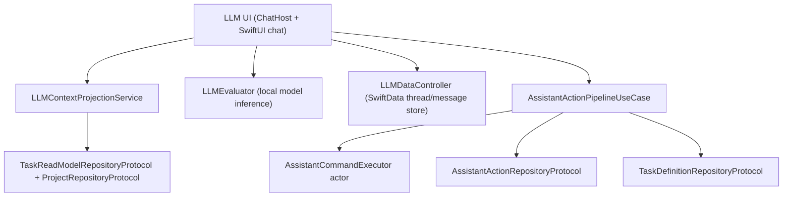

# LLM and Assistant Stack (V3 Runtime)

**Last validated against code on 2026-02-20**

This document defines boundaries between:
- local LLM chat UX and context projection, and
- transactional assistant command execution over core task data.

Primary source anchors:
- `To Do List/LLM/ChatHostViewController.swift`
- `To Do List/LLM/Models/LLMContextProjectionService.swift`
- `To Do List/LLM/Models/PromptMiddleware.swift`
- `To Do List/LLM/Models/LLMEvaluator.swift`
- `To Do List/LLM/Models/LLMDataController.swift`
- `To Do List/UseCases/LLM/AssistantActionPipelineUseCase.swift`
- `To Do List/UseCases/LLM/AssistantCommandExecutor.swift`
- `To Do List/Domain/Models/AssistantAction.swift`
- `To Do List/Services/V2FeatureFlags.swift`

## Boundary Model

## Responsibilities

| Surface | Owns | Must not own |
| --- | --- | --- |
| `/To Do List/LLM/*` | chat UX, prompt assembly, local inference, chat persistence | direct transactional mutation of core task graph |
| `/To Do List/UseCases/LLM/*` | propose/confirm/apply/reject/undo state machine and transactional command execution | UI rendering and local chat presentation state |

## Context Projection Pipeline

| Component | Input | Output |
| --- | --- | --- |
| `LLMContextRepositoryProvider` | injected `taskReadModelRepository` + `projectRepository` | configured context service factory |
| `LLMContextProjectionService` | read-model task slices + project metadata | structured JSON payloads for today/upcoming/project contexts |
| `PromptMiddleware` | task range + optional project signal | prompt-ready summaries/bullets |

### Context query behavior
- `buildTodayJSON`: day-bounded read-model query, includes completed tasks.
- `buildUpcomingJSON`: future open tasks query.
- `buildProjectJSON`: project-scoped query + project-name metadata.
- `findProjectNameSync`: short semaphore-bounded lookup (`3s` timeout).

## Assistant Transaction Pipeline

| Stage | Behavior | Key guards |
| --- | --- | --- |
| `propose` | validates schema bounds and persists pending run | schema range checks |
| `confirm` | transitions run to confirmed | valid run existence |
| `applyConfirmedRun` | allowlist validation, serialized execution, undo-plan generation, persistence of trace/status | `assistantApplyEnabled`, status/allowlist/schema checks |
| `reject` | marks run rejected | valid run existence |
| `undoAppliedRun` | executes stored compensating commands within undo window | `assistantUndoEnabled`, applied status, undo payload, window bound |

## Timeouts and Budgets

| Budget | Value | Source |
| --- | --- | --- |
| undo window | 30 minutes | `AssistantActionPipelineUseCase` |
| per-command timeout | 10 seconds | `AssistantActionPipelineUseCase` |
| per-run timeout | 90 seconds | `AssistantActionPipelineUseCase` |
| sync project-name lookup timeout | 3 seconds | `LLMContextProjectionService` |

## Concurrency Model

| Area | Model |
| --- | --- |
| Assistant command execution | serialized through `AssistantCommandExecutor` actor queue |
| Assistant API surface | callback API wrapping async transaction internals |
| Context projection | callback-based read-model fetch composition |
| Chat data store | SwiftData-backed local persistence for threads/messages |

## Failure Modes

| Failure mode | Detection | Result |
| --- | --- | --- |
| unsupported schema version | envelope bounds validation | `422` failure |
| apply disabled | feature-flag check | `403` failure |
| undo disabled | feature-flag check | `403` failure |
| invalid run status transition | status checks (`confirmed`/`applied`) | `409` conflict-style failure |
| undo window expired | `appliedAt` age check | `410` failure |
| invalid proposal payload | decode or allowlist validation failure | `422` failure |
| transaction execution failure | command pipeline catch path | run persisted as failed, rollback status captured |

## Feature Flag Dependencies

| Flow | Flags |
| --- | --- |
| assistant pipeline does not depend on reminders flags directly | n/a |
| assistant apply | `assistantApplyEnabled` |
| assistant undo | `assistantUndoEnabled` |

## Integration Contract: Chat Context vs Assistant Actions

1. Context projection is read-only and uses read-model/project repositories.
2. Assistant apply/undo is transactional and mutates `TaskDefinition` entities.
3. Chat history (SwiftData) and assistant action runs (core persistence) are separate state systems and must remain decoupled.

## Cross-Links

- `docs/architecture/usecases-v2.md`
- `docs/architecture/clean-architecture-v2.md`
- `docs/architecture/state-repositories-and-services-v2.md`
- `docs/architecture/risk-register-v2.md`
