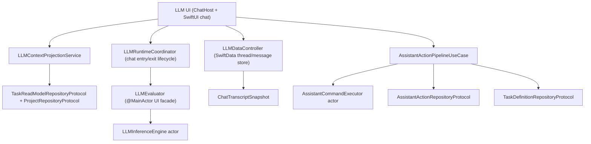

# LLM and Assistant Stack (V3 Runtime)

**Last validated against code on 2026-03-17**

This document defines the current boundary between:
- local MLX chat UX, context projection, and transcript persistence, and
- transactional assistant command execution over core task data.

Primary source anchors:
- `To Do List/LLM/Models/LLMInferenceEngine.swift`
- `To Do List/LLM/Models/LLMGenerationProfile.swift`
- `To Do List/LLM/Models/LLMEvaluator.swift`
- `To Do List/LLM/Models/LLMRuntimeCoordinator.swift`
- `To Do List/LLM/Models/AIChatModeRouter.swift`
- `To Do List/LLM/Models/Models.swift`
- `To Do List/LLM/Models/LLMDebugSmokeRunner.swift`
- `To Do List/LLM/Models/LLMDataController.swift`
- `To Do List/LLM/Views/Chat/ChatView.swift`
- `To Do List/LLM/Views/Chat/ChatTranscriptSnapshot.swift`
- `To Do List/UseCases/LLM/AssistantActionPipelineUseCase.swift`
- `To Do List/UseCases/LLM/AssistantCommandExecutor.swift`
- `To Do List/Services/V2FeatureFlags.swift`

## Boundary Model

## Responsibilities

| Surface | Owns | Must not own |
| --- | --- | --- |
| `/To Do List/LLM/*` | chat UX, prompt assembly, local inference, AI suggestion services, chat persistence, transcript rendering | direct transactional mutation of the core task graph |
| `/To Do List/UseCases/LLM/*` | propose/confirm/apply/reject/undo state machine and serialized command execution | chat rendering, prompt assembly, local model lifecycle |

## Current Model Catalog and Routing

### Supported local chat models

| Model | Visible thinking | Thinking format | Chat tuning profile |
| --- | --- | --- | --- |
| `mlx-community/Qwen3-0.6B-4bit` | yes | tagged think blocks | `384` answer-only raw tokens, `768` thinking raw tokens |
| `mlx-community/Qwen3.5-0.8B-OptiQ-4bit` | yes | tagged think blocks | `512` answer-only raw tokens, `1024` thinking raw tokens |
| `NexVeridian/Qwen3.5-0.8B-4bit` | yes | tagged think blocks | `512` answer-only raw tokens, `1024` thinking raw tokens |
| `Jackrong/MLX-Qwen3.5-0.8B-Claude-4.6-Opus-Reasoning-Distilled-4bit` | yes | plain-text preamble | `640` answer-only raw tokens, `1536` thinking raw tokens |

`Models.swift` is the source of truth for:
- `supportsVisibleThinking`
- `thinkingFormat`
- `chatTuningProfile`
- prompt-history and context token budgets

### Routing reality

`AIChatModeRouter` no longer picks different ideal models per feature. Current behavior is:
1. prefer the actively selected installed model if it is supported and within device budget,
2. otherwise fall back to the default model when possible,
3. otherwise fall back to another supported installed model,
4. otherwise prompt install/download.

`idealModelName(for:)` currently resolves to `ModelConfiguration.defaultModel.name` for all features.

## Context Projection and Prompt Assembly

### Context projection pipeline

| Component | Input | Output |
| --- | --- | --- |
| `LLMContextRepositoryProvider` | injected `taskReadModelRepository` + `projectRepository` | configured context service factory |
| `LLMContextProjectionService` | read-model task slices + project/life-area metadata | compact planning summaries for chat and structured context payloads for other AI surfaces |
| `PromptMiddleware` | task range + optional project signal | prompt-ready summaries and slash-command augmentation |
| `LLMProjectionTimeout` | async projection operation + timeout budget | bounded-latency payload or `{}` fallback |

### Chat request construction

Freeform chat now uses the MLX structured input path:
1. `ChatView` builds structured prompt history as `[Chat.Message]`.
2. `LLMInferenceEngine` constructs `UserInput(chat:additionalContext:)`.
3. `context.processor.prepare(input: userInput)` prepares the prompt.
4. `MLXLMCommon.generate(...)` runs generation with model-specific parameters.

The legacy dictionary-only `messages` path is not the canonical chat-generation contract anymore.

### Compact planning context shape

The bounded chat path still uses a compact plaintext context block:
- `Summary: X overdue, Y today, Z tomorrow, W this week`
- `Focus:` compact task lines
- `Projects:` relevant names
- `Life areas:` relevant names
- `History:` retrospective count-only lines when explicitly relevant

The bounded path intentionally omits IDs, JSON wrappers, timestamps, and exhaustive task dumps.

## Generation Request Modes

`LLMGenerationRequestOptions` is the request-level contract that separates user-visible chat from machine-readable generation:

| Mode | Used by | Thinking policy | Effective model type |
| --- | --- | --- | --- |
| `interactiveChat(for:)` | freeform chat, App Intent freeform chat | visible thinking enabled when the selected model supports it | model-native for visible-thinking chat, regular for answer-only chat |
| `structuredOutput(for:)` | planner, breakdown, daily brief, other machine-readable flows | thinking disabled, `enable_thinking=false` for Qwen-family models | regular |
| `answerCompletionRetry(for:)` | chat retry after a non-empty but unacceptable first pass | thinking disabled, answer-only continuation | regular |

Important current rules:
- Qwen-family structured-output flows pass `templateContext["enable_thinking"] = false`.
- Interactive chat uses `chatMode = .thinkingThenAnswer` only for models marked `supportsVisibleThinking`.
- Retry is not a second copy of the same chat mode. It is a shorter answer-only follow-up seeded with the first-pass assistant output.

## Chat Runtime Lifecycle

| Component | Responsibility |
| --- | --- |
| `LLMRuntimeCoordinator` | chat-screen-only lifecycle, session counting, prewarm orchestration, unload policy |
| `ChatHostViewController.viewDidAppear` | entry trigger for chat prewarm |
| `ChatHostViewController.viewWillDisappear` | definitive exit trigger for immediate unload |
| `LLMEvaluator` | main-thread observable state for progress, output, phase, and cancellation |
| `LLMInferenceEngine` | actor that owns prepare/load/generate/cancel/unload for MLX models |
| `V2FeatureFlags.llmChatPrewarmMode` | `disabled`, `adaptiveOnDemand`, or `eager` |

### Prewarm policy

- At most one model is prewarmed at a time.
- Chat entry prewarm starts when the chat host becomes visible, after one `Task.yield()`.
- Entry prewarm targets the currently selected model, not a per-feature ideal-model target.
- Entry prewarm is gated by runtime support, device memory budget, and thermal state.
- Prompt focus may request prewarm as a deduped fallback if chat entry missed.

### Unload policy

- unload immediately on memory warning.
- unload on thermal state `serious` or `critical`.
- unload immediately on definitive chat dismissal/pop.
- unload after app stays in background for `5m` unless foregrounded sooner.
- unload after chat idle timeout when no active chat sessions remain.

## Chat Rendering and Persistence

| Component | Responsibility |
| --- | --- |
| `ChatView` | send flow, retry decisions, live generation orchestration |
| `ChatTranscriptSnapshot` | immutable transcript render payload |
| `ChatMessageRenderModel` | card decode, display sanitization, thinking/answer split, markdown identity |
| `ConversationView` | renders snapshot + live stream state, applies phase haptics |
| `ChatLiveOutputState` | in-flight visible stream payload |

### Transcript rules

- assistant messages now persist `sourceModelName`.
- transcript sanitization and thinking extraction use `sourceModelName` when available instead of assuming the currently selected model.
- visible-thinking models render separate thinking and answer segments when extraction succeeds.
- assistant turns are sanitized before prompt-history reuse.

## Chat Quality Pipeline

### Extraction and sanitization

`LLMChatOutputClassifier` performs the current final-output assessment:
1. sanitize template/control artifacts,
2. preserve or strip reasoning depending on model support,
3. extract visible thinking using `LLMVisibleThinkingExtractor`,
4. evaluate answer quality on answer text when present, otherwise on sanitized non-thinking output.

Current extraction modes:
- tagged think blocks for standard Qwen visible-thinking models
- plain-text preamble parsing for the Jackrong distilled model
- no thinking split for answer-only models

### Quality gate

`LLMChatQualityGate` now separates:
- `hardFailureReasons`
- `softWarningReasons`
- `repetitionDiagnostics`
- `qualityTextSource`

Current hard failures include:
- `empty_output`
- `template_mismatch`
- `repetition_loop`
- `answer_missing_after_thinking`
- `thinking_only_output`

Current soft warnings include:
- `low_confidence_structured_repetition`
- `generic_intro` when the answer is still materially useful
- `answer_floor_low_utility`

Repetition detection is structural rather than token/ngram-dominant. It looks for repeated normalized lines, repeated substantive sentences, and tight trailing loops. Slightly repetitive planning structure is intentionally tolerated.

### Retry and fallback behavior

Chat retry is now answer-completion retry, not same-mode regeneration:
- retry thread includes the original user message,
- first-pass assistant output is seeded back in,
- retry user instruction asks for only the final answer without repeating prior analysis,
- retry uses `answerCompletionRetry(for:)` and answer-only tuning.

Fallback policy:
- preserve usable primary output if retry is worse,
- persist visible thinking when no answer was extracted but the result is still useful,
- only emit the static fallback when both attempts fail to produce usable content or when output is empty/template-broken.

## Non-Chat AI Surfaces

The non-chat AI services use structured-output generation:
- `AssistantPlannerService`
- `TaskBreakdownService`
- `DailyBriefService`
- related machine-readable flows through `LLMEvaluator`

These surfaces should use `.structuredOutput(for:)`, not `interactiveChat(for:)`, because they rely on parseable output and explicitly disable visible thinking.

## Timeouts and Budgets

| Budget | Value | Source |
| --- | --- | --- |
| undo window | 30 minutes | `AssistantActionPipelineUseCase` |
| per-command timeout | 10 seconds | `AssistantActionPipelineUseCase` |
| per-run timeout | 90 seconds | `AssistantActionPipelineUseCase` |
| sync project-name lookup timeout | 3 seconds | `LLMContextProjectionService` |
| bounded chat projection timeout | 450 ms | `ChatView` + `LLMProjectionTimeout` |
| bounded chat prompt-history budget | model token budget with `historyMessageLimit = 8` in the current catalog | `ModelConfiguration` |
| bounded chat context budget | task-context token cap from the selected model | `LLMChatPlanningContextBuilder` |
| bounded retry context budget | half of the active model task-context budget, floored at `160` tokens | `ChatView` retry path |
| streamed output publish cadence | `100 ms` minimum interval; output stride is model/profile driven | `LLMChatBudgets` + `ChatTuningProfile` |

Per-model caps and sampling now come from `chatTuningProfile`, not a single global `256 / 512` profile.

## Feature Flags

| Flag | Current role |
| --- | --- |
| `assistantApplyEnabled` | assistant apply path |
| `assistantUndoEnabled` | assistant undo path |
| `assistantCopilotEnabled` | add-task copilot suggestion surfaces |
| `assistantSemanticRetrievalEnabled` | semantic indexing/context/rerank |
| `assistantBreakdownEnabled` | task breakdown surface |
| `assistantFastModeEnabled` | defined flag; no current router/runtime behavior depends on it |
| `llmChatPrewarmMode` | chat prewarm policy |
| `llmChatContextStrategy` | bounded vs full chat context payload strategy |
| `llmChatThinkingPhaseHapticsEnabled` | phase haptics during visible thinking |
| `llmChatAnswerPhaseHapticsEnabled` | phase haptics when answering begins |
| `llmChatTemplateDiagnosticsEnabled` | debug-only template mismatch output path |
| `llmRuntimeSmokeEnabled` | debug-only runtime smoke runner |

## Debug Smoke Runner

`LLMDebugSmokeRunner` is debug-only and gated by:
- `V2FeatureFlags.llmRuntimeSmokeEnabled`
- launch argument `-TASKER_LLM_RUN_SMOKE`

It runs sequential model smoke checks through the same runtime path used by production chat, using `interactiveChat(for:)` and the same output classifier/quality pipeline.

## Failure Modes

| Failure mode | Detection | Result |
| --- | --- | --- |
| unsupported schema version | envelope bounds validation | `422` failure |
| apply disabled | feature-flag check | `403` failure |
| undo disabled | feature-flag check | `403` failure |
| invalid run status transition | status checks (`confirmed` / `applied`) | `409` conflict-style failure |
| undo window expired | `appliedAt` age check | `410` failure |
| invalid proposal payload | decode or allowlist validation failure | `422` failure |
| transaction execution failure | command pipeline catch path | run persisted as failed, rollback status captured |
| chat context projection timeout | timeout helper in turn context assembly | generation continues with compact fallback payload |
| answer missing after visible thinking | classifier sees thinking with no answer segment | answer-completion retry |
| template/control-token bleed | sanitizer detects control markers | stripped before display/persistence/history reuse |
| high-confidence repetition loop | structural repetition detector | retry once, preserve primary output if retry is worse |

## Observability

Current chat observability includes:
- prompt component sizes and prompt-history sizing
- prewarm lifecycle and readiness
- first-token and first-response latency
- generation parameters (`chat_mode`, `max_raw_tokens`, `thinking_format`, sampling)
- generation completion (`generated_tokens`, `termination_reason`, `raw_cap_hit_stage`)
- sanitization and extraction results (`thinking_length`, `answer_length`, `quality_text_source`)
- repetition diagnostics (`repetition_confidence`, `repetition_detector`, repeated line/sentence counts, tail preview)
- retry/fallback behavior (`retry_mode=answer_completion`, primary-preserved-on-retry-worse)

## Cross-Links

- `docs/architecture/llm-feature-integration-handbook.md`
- `docs/architecture/usecases-v2.md`
- `docs/architecture/domain-events-and-observability-v2.md`
