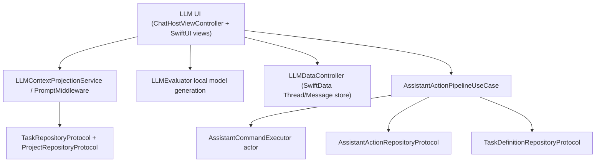
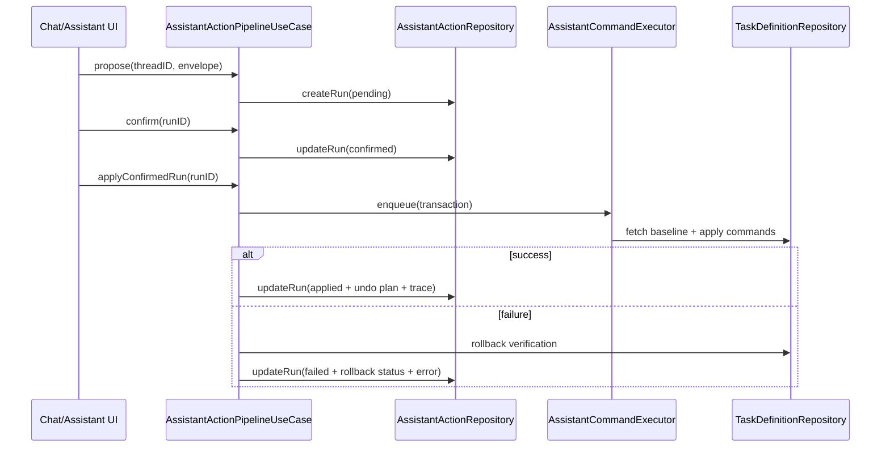

# LLM and Assistant Stack (V2)

**Last validated against code on 2026-02-18**

This doc defines the LLM and assistant architecture boundaries across UI-local model inference and transactional assistant actions.

Primary sources:
- `To Do List/LLM/ChatHostViewController.swift`
- `To Do List/LLM/Models/LLMContextProjectionService.swift`
- `To Do List/LLM/Models/PromptMiddleware.swift`
- `To Do List/LLM/Models/LLMDataController.swift`
- `To Do List/LLM/Models/LLMEvaluator.swift`
- `To Do List/LLM/Views/Chat/ChatView.swift`
- `To Do List/UseCases/LLM/AssistantActionPipelineUseCase.swift`
- `To Do List/UseCases/LLM/AssistantCommandExecutor.swift`
- `To Do List/Domain/Models/AssistantAction.swift`
- `To Do List/Services/V2FeatureFlags.swift`

## Boundary Model

## Layer Responsibilities

| Surface | Responsibility | Must Not Do |
| --- | --- | --- |
| `/To Do List/LLM/*` | local model UX, context extraction, prompt preparation, chat data persistence | perform direct V2 task-definition transactional mutations |
| `/To Do List/UseCases/LLM/*` | structured command proposal/confirm/apply/undo workflow over V2 task definitions | own UI rendering or local chat view state |

## LLM UI and Local Inference Components

| Component | Purpose | Notes |
| --- | --- | --- |
| `ChatHostViewController` | UIKit shell embedding SwiftUI chat/onboarding | routes between onboarding and chat based on installed models |
| `ChatView` / related SwiftUI views | interactive chat UX and slash-command triggers | can build task summaries/context payloads |
| `LLMEvaluator` | loads/switches local models and generates responses | local inference runtime |
| `LLMDataController` | shared SwiftData container (`Thread`, `Message`) | CloudKit disabled for this store |
| `AppManager` in `Data.swift` | installed model state and app-level LLM UI state | local app settings/state helper |

## Context Projection Pipeline

| Component | Input | Output |
| --- | --- | --- |
| `LLMContextRepositoryProvider` | injected task + project repositories | context service factory and sync project lookup |
| `LLMContextProjectionService` | repository data for today/upcoming/project | JSON context payload for prompts |
| `PromptMiddleware` | task range and optional project name | bullet summary of open tasks |

## Assistant Transaction Pipeline

| Stage | Behavior | Guards |
| --- | --- | --- |
| Propose | persist pending run with proposal envelope | `v2Enabled`, schema version bounds |
| Confirm | mark run confirmed by user | `v2Enabled` |
| Apply | execute allowlisted commands transactionally and persist undo plan | `v2Enabled`, `assistantApplyEnabled`, confirmed status, allowlist, deterministic undo validation |
| Reject | mark run rejected | `v2Enabled` |
| Undo | apply compensating commands in undo window | `v2Enabled`, `assistantUndoEnabled`, applied status, undo payload present, window check |

## End-to-End Assistant Apply Sequence

## Concurrency and Timeouts

| Concern | Implementation |
| --- | --- |
| Run serialization | `AssistantCommandExecutor` actor enqueues one transaction at a time |
| Per-command timeout | command timeout budget tracked in pipeline internals |
| Per-run timeout | run-level timeout (`runTimeoutSeconds`) enforced during apply |
| Rollback verification | transaction failure triggers rollback and baseline verification |

## Timeout and Window Budgets

| Budget | Current Value | Source |
| --- | --- | --- |
| undo window | 30 minutes (`60 * 30`) | `To Do List/UseCases/LLM/AssistantActionPipelineUseCase.swift` |
| per-command timeout | 10 seconds | `To Do List/UseCases/LLM/AssistantActionPipelineUseCase.swift` |
| per-run timeout | 90 seconds | `To Do List/UseCases/LLM/AssistantActionPipelineUseCase.swift` |
| context project lookup sync wait | 3 seconds semaphore timeout | `To Do List/LLM/Models/LLMContextProjectionService.swift` |

## Failure Modes

| Failure Mode | Detection | Outcome |
| --- | --- | --- |
| Assistant schema mismatch | envelope schema version check | `422` unsupported schema error |
| Feature gate disabled | flag guards | `403` disabled error path |
| Invalid run state transition | status checks | `409` conflict-style error |
| Undo window expired | elapsed time check from `appliedAt` | `410` undo window expired |
| Missing/invalid proposal data | decode/validation guard | `422` invalid payload error |
| Transaction execution failure | internal apply/rollback catch path | run marked failed; rollback status persisted |

## Feature Flag Dependencies

| Flow | Flags |
| --- | --- |
| assistant propose/confirm/reject | `v2Enabled` |
| assistant apply | `v2Enabled` + `assistantApplyEnabled` |
| assistant undo | `v2Enabled` + `assistantUndoEnabled` |

## Integration Contract: LLM Context vs Assistant Actions

1. Context projection uses legacy repository protocols for broad read compatibility.
2. Assistant command execution mutates canonical V2 task-definition surfaces.
3. Consumers should treat chat context and assistant action run history as separate concerns:
- chat history is local SwiftData UX state,
- assistant run state is domain workflow state in core persistence.

## Cross-Links
- Usecase contract catalog: `docs/architecture/usecases-v2.md`
- Runtime wiring and feature gates: `docs/architecture/clean-architecture-v2.md`
- State ownership internals: `docs/architecture/state-repositories-and-services-v2.md`
