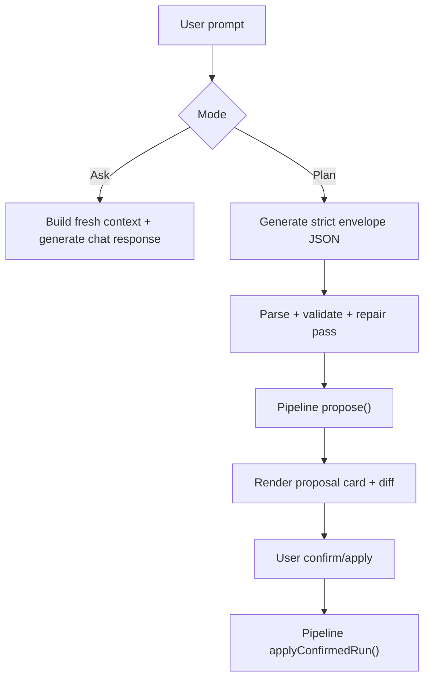
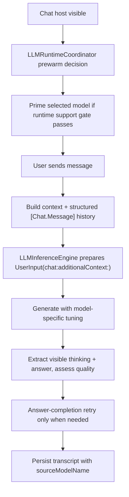

# LLM Feature Integration Handbook (Mixed Engineering + PM)

**Last validated against code on 2026-03-17**

This handbook explains what Tasker's AI surfaces do for users, how the current MLX runtime behaves, and what must stay true when shipping AI changes.

Primary source anchors:
- `To Do List/LLM/Views/Chat/ChatView.swift`
- `To Do List/LLM/Views/Chat/ConversationView.swift`
- `To Do List/LLM/Views/Chat/ChatTranscriptSnapshot.swift`
- `To Do List/LLM/Models/LLMInferenceEngine.swift`
- `To Do List/LLM/Models/LLMGenerationProfile.swift`
- `To Do List/LLM/Models/LLMRuntimeCoordinator.swift`
- `To Do List/LLM/Models/AIChatModeRouter.swift`
- `To Do List/LLM/Models/AISuggestionService.swift`
- `To Do List/LLM/Models/TaskBreakdownService.swift`
- `To Do List/LLM/Models/DailyBriefService.swift`
- `To Do List/LLM/Models/TaskSemanticRetrievalService.swift`
- `To Do List/UseCases/LLM/AssistantActionPipelineUseCase.swift`
- `To Do List/Services/V2FeatureFlags.swift`

## What Users Get

| Surface | User value | Mutation risk | Reversibility |
| --- | --- | --- | --- |
| Chat Ask mode | natural-language planning help over local task context, with visible thinking on supported models | none | n/a |
| Chat Plan mode | structured proposal cards with visible diffs before action | controlled | undo window via pipeline |
| Add Task suggestions | faster title-to-fields inference | none | user-controlled field apply |
| Home top-3 and overdue triage | ranked shortlist and recovery plan suggestions | triage path controlled | via proposal workflow |
| Task breakdown | large task split into suggested child steps | controlled | user selects subset before creation |
| Daily brief | read-only brief and next-action summary | none | n/a |
| Semantic retrieval | better relevance for ambiguous search/planning queries | none | lexical fallback remains available |

## Core Safety Model

1. Ask mode is read-only.
2. Assistant mutations always go through `propose -> confirm -> apply`.
3. Undo remains bounded to the pipeline window.
4. Chat-layer helpers must never mutate `TaskDefinition` state directly.
5. AI surfaces are kill-switchable even when default-on.

## How The Current Runtime Works

### Ask vs Plan

### Chat runtime path

### Structured-output services

Planner, breakdown, daily brief, and other machine-readable surfaces do not use visible-thinking chat mode. They run through `.structuredOutput(for:)`, which disables thinking for Qwen-family models and keeps output parseable.

## Model Selection and User Expectations

### Routing behavior

`AIChatModeRouter` now uses a single active-model policy:
- prefer the selected installed model when it is supported and within device budget,
- otherwise fall back to the default model,
- otherwise fall back to another supported installed model,
- otherwise prompt install/download.

There is no longer a meaningful per-feature ideal-model routing table.

### Current shipped chat models

The current catalog includes:
- `mlx-community/Qwen3-0.6B-4bit`
- `mlx-community/Qwen3.5-0.8B-OptiQ-4bit`
- `NexVeridian/Qwen3.5-0.8B-4bit`
- `Jackrong/MLX-Qwen3.5-0.8B-Claude-4.6-Opus-Reasoning-Distilled-4bit`

All four can be used in Ask mode. Visible thinking is enabled by default for models marked `supportsVisibleThinking`.

## Chat Quality and Fallback Rules

### First-pass behavior

Supported chat models may show visible thinking before the final answer. The chat pipeline now:
- extracts thinking and answer separately when possible,
- evaluates quality on the answer segment when present,
- tolerates soft structured repetition instead of treating it as a hard failure,
- preserves useful first-pass output when retry is worse.

### Retry behavior

Retry is now answer-completion retry:
- seeded with the first-pass assistant output,
- asks for only the final answer,
- disables visible thinking for the retry attempt,
- runs once only.

### Fallback behavior

The static "I couldn't produce a reliable answer..." message is the last resort, not the default outcome for a noisy but usable answer. It should appear only when:
- output is empty after sanitization,
- output is template-broken,
- or both the primary generation and answer-completion retry fail to produce usable content.

## Integration Contracts

### Proposal card transport

- `AssistantCardPayload` is encoded with sentinel prefix `__TASKER_CARD_V1__` in `Message.content`.
- Card actions must validate thread ownership before reject/apply/undo.

### Chat rendering contract

- `ConversationView` renders immutable `ChatTranscriptSnapshot` data instead of a live `Thread`.
- `ChatMessageRenderModel` owns per-message preprocessing: card decode, sanitization, thinking/answer split, and markdown identity.
- `sourceModelName` is persisted on assistant messages so historical rendering uses the original generating model profile.
- Live output is throttled before UI publish to reduce focus/contention issues.

### Semantic retrieval contract

- input combines task title, details, project, and tags,
- output supports top-K semantic hits and lexical fallback,
- persistence is local-only and non-CloudKit.

## Current AI Flag Matrix

| Flag | Current role |
| --- | --- |
| `assistantApplyEnabled` | assistant apply path |
| `assistantUndoEnabled` | assistant undo path |
| `assistantCopilotEnabled` | add-task copilot suggestion surfaces |
| `assistantSemanticRetrievalEnabled` | semantic indexing/context/rerank |
| `assistantBreakdownEnabled` | task-detail breakdown visibility |
| `assistantFastModeEnabled` | defined flag; currently not materially changing router/runtime behavior |
| `llmChatPrewarmMode` | chat prewarm behavior |
| `llmChatContextStrategy` | bounded vs full chat-context strategy |
| `llmChatThinkingPhaseHapticsEnabled` | visible-thinking haptics |
| `llmChatAnswerPhaseHapticsEnabled` | answer-phase haptics |
| `llmChatTemplateDiagnosticsEnabled` | debug-only template diagnostics |
| `llmRuntimeSmokeEnabled` | debug-only runtime smoke runner |

There is no current dedicated plan-mode or daily-brief feature gate in `V2FeatureFlags`.

## Release Validation Checklist For AI Changes

1. `xcodebuild` build/test gates pass.
2. Ask mode remains non-mutating.
3. Chat plan/apply/undo still works end-to-end.
4. First send reuses prewarm when prewarm completed successfully.
5. Visible-thinking models render thinking and answer correctly in transcript/live chat.
6. Structured-output surfaces still use `.structuredOutput(for:)`.
7. Retry path is answer-completion retry, not same-mode rerun.
8. `sourceModelName` persists on assistant turns and transcript rendering stays model-aware.
9. Debug smoke runner still works behind `llmRuntimeSmokeEnabled` / `-TASKER_LLM_RUN_SMOKE`.
10. Fallback only fires after unusable primary output plus unusable retry.

## Incident Triage Quick Paths

| Symptom | First checks |
| --- | --- |
| Proposal cards not rendering | sentinel payload decode, missing `run_id`, thread ownership mismatch |
| Apply keeps failing | `assistant_apply_failed`, rollback status, stale-context hints |
| Undo unavailable unexpectedly | `expires_at`, undo-window age, `assistantUndoEnabled` |
| First response too slow | `chat_model_prepare_ms`, `chat_first_token_latency_ms`, prewarm hit/miss, context-build timing |
| Visible thinking renders but no answer appears | extraction mode, `quality_text_source`, `answer_length`, `answer_missing_after_thinking`, retry-mode logs |
| Usable answer still falls back | `hard_reasons_csv`, `soft_warnings_csv`, repetition diagnostics, primary-preserved-on-retry-worse path |
| Memory stays high after leaving chat | `chat_model_unloaded`, chat exit path, lingering active session reasons |
| Suggestion quality drop | active model, router fallback banner, context payload completeness |
| Search relevance regression | `assistantSemanticRetrievalEnabled`, semantic fallback telemetry |

## Do and Don't For Future AI Changes

### Do

1. Keep mutation flows inside `AssistantActionPipelineUseCase`.
2. Update both canonical LLM docs in the same PR as runtime changes.
3. Add telemetry for every new AI failure path and fallback path.
4. Keep structured-output flows on `.structuredOutput(for:)`.
5. Preserve lexical fallback when semantic capabilities are unavailable.

### Don't

1. Avoid adding direct task-mutation logic to chat helpers or view models.
2. Avoid reintroducing hidden per-feature model routing tables that contradict `AIChatModeRouter`.
3. Avoid evaluating repetition on combined thinking + answer text.
4. Avoid regressing retry back to a same-mode rerun.
5. Avoid shipping new LLM behavior without updating `llm-assistant-stack-v2.md` and this handbook together.

## Cross-Links

- `docs/architecture/llm-assistant-stack-v2.md`
- `docs/architecture/usecases-v2.md`
- `docs/architecture/risk-register-v2.md`
- `docs/architecture/domain-events-and-observability-v2.md`
- `docs/release-gate-v2-efgh.md`
