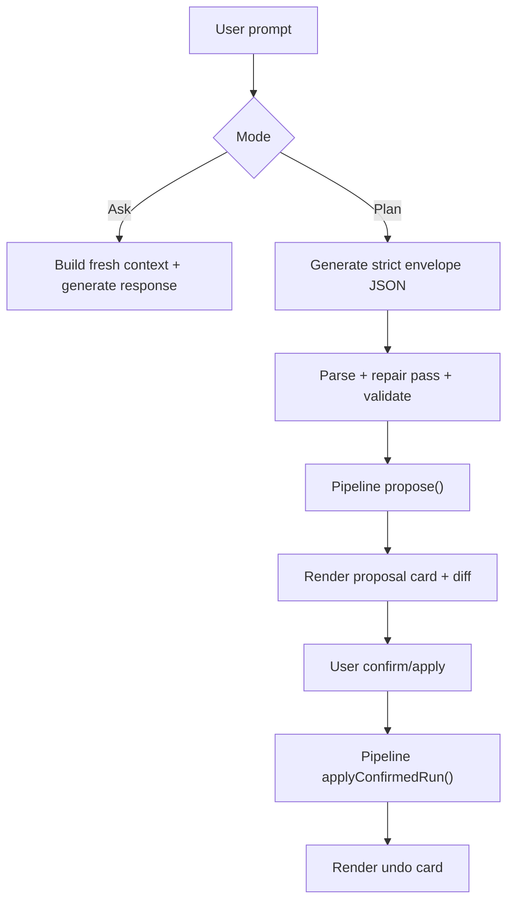
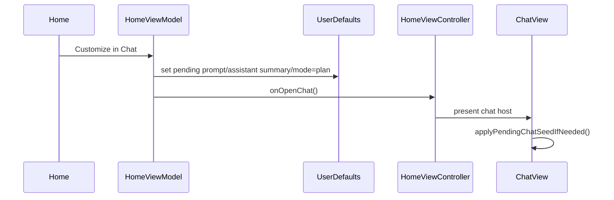
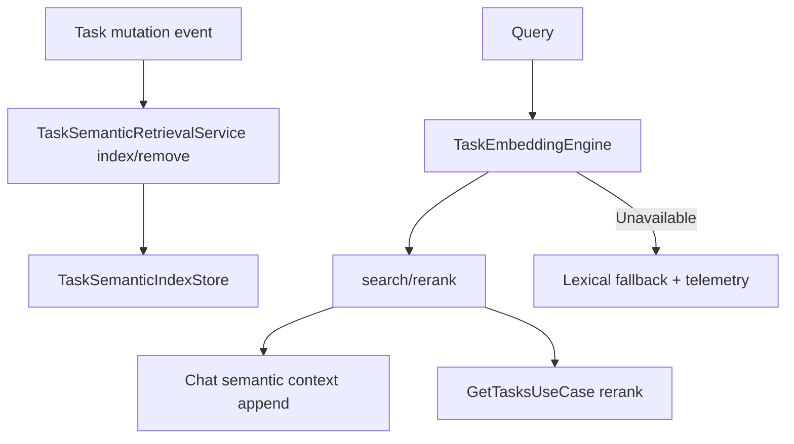

# LLM Feature Integration Handbook (Mixed Engineering + PM)

**Last validated against code on 2026-02-21**

This handbook explains what Tasker's AI features do for users, how they are implemented, and how to safely evolve them.
Use this as the first stop for product/engineering alignment before editing AI runtime code.

Primary source anchors:
- `To Do List/LLM/Views/Chat/ChatView.swift`
- `To Do List/LLM/Views/Chat/ConversationView.swift`
- `To Do List/LLM/Models/AISuggestionService.swift`
- `To Do List/LLM/Models/TaskBreakdownService.swift`
- `To Do List/LLM/Models/OverdueTriageService.swift`
- `To Do List/LLM/Models/DailyBriefService.swift`
- `To Do List/LLM/Models/AIChatModeRouter.swift`
- `To Do List/LLM/Models/TaskSemanticRetrievalService.swift`
- `To Do List/UseCases/LLM/AssistantActionPipelineUseCase.swift`
- `To Do List/AppDelegate.swift`
- `To Do List/Services/V2FeatureFlags.swift`

## What Users Get (Surface-by-Surface)

| Surface | User value | Mutation risk | Reversibility |
| --- | --- | --- | --- |
| Chat Ask mode | quick natural-language support over local task context | none | n/a |
| Chat Plan mode | structured proposal cards with visible diffs before action | controlled | undo window via pipeline |
| Add Task suggestions | faster capture from title-to-fields inference | none | user-controlled field apply |
| Home top-3 | ranked shortlist with rationale and confidence | none | read-only suggestions |
| Overdue triage | one-tap overdue recovery plan with customize/apply options | controlled | via proposal workflow |
| Task breakdown | turn a large task into 3-6 suggested steps | controlled | user selects subset before creation |
| Daily brief | morning digest + clear next action | none | read-only briefing |
| Semantic retrieval | better relevance for ambiguous search/planning queries | none | lexical fallback always available |

## Core Safety Model

1. Ask mode is default and read-only.
2. Assistant mutations always require explicit `propose -> confirm -> apply`.
3. Undo is bounded to pipeline window (30 minutes).
4. No chat-layer direct task mutation bypass path is allowed.
5. AI surfaces are default-on but kill-switchable.

## How It Works (Flow-Level)

### Ask vs Plan (chat)

### Overdue triage customize/deep-link path

### Semantic retrieval path

## Model Routing and Fallback Behavior

`AIChatModeRouter` enforces feature-based model preference with device-budget and install-awareness.

| Feature route | Preferred capacity profile |
| --- | --- |
| `.addTaskSuggestion`, `.dynamicChips`, `.dailyBrief` | lightweight |
| `.planMode`, `.topThree`, `.breakdown` | higher-capacity |

Fallback principles:
1. Fallback is explicit with visible banner messaging.
2. Download prompt appears when ideal model is absent and device budget allows.
3. No silent upgrade/downgrade of model behavior.

## Integration Contracts (Engineering)

### Proposal card transport
- `AssistantCardPayload` is encoded with sentinel prefix `__TASKER_CARD_V1__` in `Message.content`.
- Required proposal fields: `run_id`, `thread_id`, `affected_task_count`, `destructive_count`, `diff_lines`.

### Ownership checks
- Card actions must fetch run and verify `run.threadID == currentThread.id` before reject/apply/undo.

### Context contract
- Context is rebuilt on every generation request.
- Payload includes enriched task metadata (`energy`, `context`, `type`, tags, dependencies, `project_id`) and payload metadata (`timezone`, `generated_at_iso`, `context_version`).

### Semantic contract
- Input text combines task title/details/project/tag names.
- Output supports top-K semantic hits and lexical fallback path.
- Index persistence is local-only and non-CloudKit.

## Kill-Switch Matrix

| Feature flag | Controls |
| --- | --- |
| `assistantApplyEnabled` | pipeline apply path |
| `assistantUndoEnabled` | pipeline undo path |
| `assistantPlanModeEnabled` | chat plan mode entry and proposal actions |
| `assistantCopilotEnabled` | add-task/home/task-detail AI surfaces |
| `assistantSemanticRetrievalEnabled` | semantic indexing/context/rerank |
| `assistantBriefEnabled` | daily brief generation + notification path |
| `assistantBreakdownEnabled` | task-detail breakdown action visibility |

## Release Validation Checklist for AI Changes

1. Build and guardrails pass:
- `xcodebuild ... build`
- `./scripts/validate_legacy_runtime_guardrails.sh`
2. Chat plan/apply/undo smoke verified end-to-end.
3. Ask mode verified non-mutating.
4. Add Task suggestion latency and accept flow verified.
5. Overdue triage apply path verified via pipeline.
6. Daily brief notification open path seeds chat correctly.
7. Semantic fallback telemetry verified when embeddings unavailable.

## Incident Triage Quick Paths

| Symptom | First checks |
| --- | --- |
| Proposal cards not rendering | sentinel payload decode, missing `run_id`, thread ownership mismatch |
| Apply keeps failing | `assistant_apply_failed`, rollback status, stale-context hints |
| Undo unavailable unexpectedly | `expires_at`, undo-window age, `assistantUndoEnabled` flag |
| Suggestion quality drop | context payload event fields + model routing banner/fallback |
| Brief notification opens but no chat seed | pending keys + open-chat notification path |
| Search relevance regression | semantic flag state + `assistant_semantic_fallback_lexical` events |

## Do and Don't for Future AI Additions

### Do
1. Keep mutation flows inside `AssistantActionPipelineUseCase`.
2. Add telemetry for every new AI surface and failure path.
3. Add feature flags for new autonomous or user-triggered AI surfaces.
4. Document schema/contract updates in `llm-assistant-stack-v2.md` and `usecases-v2.md`.
5. Preserve lexical fallback when semantic capabilities are unavailable.

### Don't
1. Do not add direct task mutation logic in chat/view-model AI helpers.
2. Do not introduce non-explicit apply behavior.
3. Do not add card payload variants without sentinel decode compatibility strategy.
4. Do not rely on one-time context injection in long-lived sessions.
5. Do not ship new AI behavior without release-gate evidence updates.

## Cross-Links

- `docs/architecture/llm-assistant-stack-v2.md`
- `docs/architecture/usecases-v2.md`
- `docs/architecture/risk-register-v2.md`
- `docs/architecture/domain-events-and-observability-v2.md`
- `docs/release-gate-v2-efgh.md`
- `docs/architecture/v3-runtime-cutover-todo.md`
