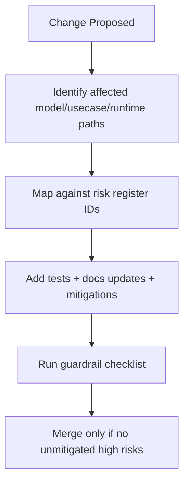

# Tasker V2 Risk Register And Guardrails

**Last validated against code on 2026-02-18**

## Scope

This document tracks architecture and migration risks specific to Tasker V2 model/usecase/runtime behavior. It is intended to protect future UI and product work from hidden regressions.

Primary sources:
- `To Do List/Domain/Models/Task.swift`
- `To Do List/TaskModelV2.xcdatamodeld/TaskModelV2.xcdatamodel/contents`
- `To Do List/State/DI/EnhancedDependencyContainer.swift`
- `To Do List/Presentation/DI/PresentationDependencyContainer.swift`
- `To Do List/UseCases/Coordinator/UseCaseCoordinator.swift`
- `To Do List/UseCases/Sync/ReconcileExternalRemindersUseCase.swift`
- `To Do List/UseCases/Sync/ReminderMergeEngine.swift`
- `To Do List/UseCases/LLM/AssistantActionPipelineUseCase.swift`
- `To Do List/Services/V2FeatureFlags.swift`
- `To Do List/AppDelegate.swift`

## Risk Register

| ID | Risk | Severity | Impact | Trigger | Mitigation | Owner Suggestion | Source Anchors |
| --- | --- | --- | --- | --- | --- | --- | --- |
| R-001 | Legacy/V2 task field overlap (`title`/`name`, `priority`/`taskPriority`, `project`/`projectID`) causes inconsistent reads/writes | High | Wrong task display/scoring/filtering and migration drift | New feature writes only one alias path | Always mutate canonical domain (`TaskDefinition`) and verify bridge mapping tests | Domain + State maintainers | `Domain/Models/Task.swift`, `TaskModelV2.../contents`, `State/Repositories/CoreDataTaskDefinitionRepository.swift` |
| R-002 | Optional V2 dependencies in coordinator allow partial runtime wiring | High | Runtime feature failures in screens expecting V2 flows | Container config misses optional V2 repo/usecase | Keep fail-closed readiness checks enforced in both DI containers | App architecture owner | `UseCases/Coordinator/UseCaseCoordinator.swift`, `State/DI/EnhancedDependencyContainer.swift`, `Presentation/DI/PresentationDependencyContainer.swift` |
| R-003 | Default-true feature flags can mask incomplete rollout assumptions | Medium | Unexpected feature activation in debug/prod | Missing explicit flag gate in new flow | Add explicit flag checks for all new side-effectful V2 flows | Feature owners | `Services/V2FeatureFlags.swift`, `UseCases/LLM/AssistantActionPipelineUseCase.swift`, `UseCases/Sync/ReconcileExternalRemindersUseCase.swift` |
| R-004 | Mixed legacy utility task usecases and V2-first usecases can diverge behavior | Medium | UX inconsistency between screens | One screen calls legacy path, another calls V2 path | Document and standardize per-screen mutation/read path; prefer V2 for new features | Presentation + Usecase maintainers | `UseCases/Task/*.swift`, `State/Repositories/CoreDataTaskDefinitionRepository.swift` |
| R-005 | Reconcile flow partial failures leave mappings/tasks/provider state temporarily divergent | High | Duplicate reminders, stale task completion status, mapping corruption risk | Provider call fails mid-loop/timeouts | Track per-item failures, retry safely, and preserve merge clocks/envelopes | Sync owner | `UseCases/Sync/ReconcileExternalRemindersUseCase.swift`, `UseCases/Sync/ReminderMergeEngine.swift` |
| R-006 | Assistant apply/undo transactional assumptions break under unsupported command schema | High | Irreversible or partially reverted assistant actions | Non-allowlisted commands or invalid envelope schema | Enforce schema bounds + allowlist + deterministic undo validation | Assistant pipeline owner | `UseCases/LLM/AssistantActionPipelineUseCase.swift`, `Domain/Models/AssistantAction.swift` |
| R-007 | Background refresh timing/timeouts cause silent maintenance gaps | Medium | Occurrence/reminder freshness drifts | BG task expiration or reconcile timeouts | Keep timeout logging, per-project fail accounting, and rescheduling logic | Runtime/platform owner | `AppDelegate.swift`, `UseCases/Schedule/MaintainOccurrencesUseCase.swift` |
| R-008 | Identity collisions in projects/tasks from historical data remain latent | Medium | Wrong project linking and orphan task behavior | Existing inconsistent IDs in migrated store | Run identity repair and orphan assignment checks on startup and migration paths | Data migration owner | `UseCases/Project/ManageProjectsUseCase.swift`, `UseCases/Task/AssignOrphanedTasksToInboxUseCase.swift`, `AppDelegate.swift` |

## Detection Signals and Rollback Actions

| Risk ID | Detection Signals | Rollback / Containment Action |
| --- | --- | --- |
| `R-001` | mismatched task names/titles in UI, inconsistent scoring fields, alias drift in regression checks | revert to canonical write helpers and run alias-sync validation; block merge until compatibility tests pass |
| `R-002` | `v2_runtime_not_ready` logs, nil V2 usecase surfaces in coordinator/presentation wiring | fail closed; restore missing DI wiring before release build |
| `R-003` | behavior active despite expected disable state, missing flag checks in PR diff | add explicit flag guard and disabled-path test, then re-run CI |
| `R-004` | inconsistent behavior across screens for same operation | align screen to canonical usecase path and document chosen contract in usecase/UI map |
| `R-005` | duplicate reminders, stale external mappings, reconcile summary mismatches | preserve latest mapping state blob, rerun reconcile with targeted project scope, inspect per-item failures |
| `R-006` | apply/undo errors (`422`, `409`, rollback failed status), missing undo commands in runs | disable apply/undo via flags for rollout containment, fix allowlist/schema/undo generation, replay tests |
| `R-007` | BG timeout/error events (`bg_reminders_project_timeout`, maintenance failure logs) | schedule rerun and investigate timeout thresholds; avoid shipping with persistent red BG signals |
| `R-008` | duplicate inbox candidates, orphan count spikes, identity repair warnings | run repair + orphan assignment paths and verify post-repair counts before release gate |

## Risk Handling Flow

## Known Migration Traps

## Trap 1: Legacy/V2 Field Overlap
- Do not assume one canonical storage field where schema intentionally carries alias columns.
- Reading only `name` or only `title` can miss data written by other paths.

Sources:
- `To Do List/TaskModelV2.xcdatamodeld/TaskModelV2.xcdatamodel/contents`
- `To Do List/Domain/Models/Task.swift`

## Trap 2: Optional V2 Coordinator Dependencies
- `UseCaseCoordinator` exposes many V2 usecases as optionals.
- Calling sites must not assume non-nil without runtime readiness enforcement.

Sources:
- `To Do List/UseCases/Coordinator/UseCaseCoordinator.swift`
- `To Do List/State/DI/EnhancedDependencyContainer.swift`
- `To Do List/Presentation/DI/PresentationDependencyContainer.swift`

## Trap 3: Feature Flags Default True
- Default `true` in user defaults is useful for dev speed but risky if code paths are incompletely guarded.
- New write/sync/assistant flows must explicitly gate on relevant flags.

Sources:
- `To Do List/Services/V2FeatureFlags.swift`

## Trap 4: Mixed Legacy Utility Usecases vs V2-First Flows
- Some utility usecases still operate through legacy `Task` semantics.
- New UI surfaces should define explicit contract choices to avoid semantic mismatch.

Sources:
- `To Do List/UseCases/Task/*.swift`
- `To Do List/State/Repositories/CoreDataTaskDefinitionRepository.swift`

## Guardrails (Do Not Bypass)

1. Do not bypass DI readiness assertions before constructing presentation runtime.
2. Do not introduce direct CoreData mutation from presentation layer.
3. Do not add new reminder-sync mutations outside merge-state/tombstone-aware reconcile paths.
4. Do not add assistant commands without allowlist updates and deterministic undo mappings.
5. Do not add new schema alias fields without documenting migration ownership and deprecation intent.
6. Do not skip canonical ID validation for V2 entities.

Source anchors:
- `To Do List/AppDelegate.swift`
- `To Do List/State/DI/EnhancedDependencyContainer.swift`
- `To Do List/Presentation/DI/PresentationDependencyContainer.swift`
- `To Do List/UseCases/Sync/ReconcileExternalRemindersUseCase.swift`
- `To Do List/UseCases/LLM/AssistantActionPipelineUseCase.swift`
- `To Do List/State/Repositories/CoreDataTaskDefinitionRepository.swift`

## Invariants To Protect During UI Integration

| Invariant | Why It Matters | Source |
| --- | --- | --- |
| Inbox project identity remains canonical and always resolvable | Prevents orphan task drift and broken defaults | `To Do List/AppDelegate.swift`, `To Do List/UseCases/Project/EnsureInboxProjectUseCase.swift` |
| `Occurrence.occurrenceKey` is immutable | Prevents duplicate/corrupt occurrence timelines | `To Do List/State/Repositories/CoreDataOccurrenceRepository.swift` |
| Reminder merge clocks must persist across sync cycles | Prevents conflict regression and ping-pong overwrites | `To Do List/Domain/Models/SyncMergeState.swift`, `To Do List/UseCases/Sync/ReminderMergeEngine.swift` |
| Assistant apply must only run on confirmed runs | Preserves user confirmation contract and trust | `To Do List/UseCases/LLM/AssistantActionPipelineUseCase.swift` |
| Assistant undo must stay within undo window and compensating command set | Prevents unsafe late rollback and undefined reversions | `To Do List/UseCases/LLM/AssistantActionPipelineUseCase.swift` |

## Verification Checklist For Every Model/Usecase Change

Use this checklist in PR review:

- [ ] Data model change documented in `docs/architecture/data-model-v2.md`.
- [ ] Usecase contract updates documented in `docs/architecture/usecases-v2.md`.
- [ ] Runtime wiring/flag behavior updates documented in `docs/architecture/clean-architecture-v2.md`.
- [ ] New or changed risk captured in this register with severity/mitigation/owner.
- [ ] Added/changed feature-gated flow has explicit gate check and disabled-path behavior.
- [ ] Compatibility aliases (if touched) include canonical-write and read-fallback behavior review.
- [ ] Startup/readiness paths still fail closed when required V2 dependencies are absent.
- [ ] Background maintenance and reconcile flows have timeout/failure logging expectations updated.

## Change Review Checklist (Risk -> Required PR Evidence)

| Risk ID | Required PR Evidence |
| --- | --- |
| `R-001` | alias/identity compatibility notes in `data-model-v2.md` plus before/after field mapping proof |
| `R-002` | DI wiring diff + runtime readiness assertion path validation (`EnhancedDependencyContainer` and presentation container) |
| `R-003` | feature-flag gate checks shown in changed flow + disabled-path test case notes |
| `R-004` | UI surface map update in `usecases-v2.md` showing normalized route |
| `R-005` | reconcile flow sequence/edge-case note update + sample failure handling evidence |
| `R-006` | assistant pipeline contract update + undo/rollback behavior validation notes |
| `R-007` | background operation behavior note update and relevant log-signal expectations |
| `R-008` | identity/orphan repair validation outputs and updated migration guardrail notes |

## Escalation Guidance

Escalate before merge when any of these occur:
- A change alters entity identity semantics (`id`, `projectID`, `taskID`, `occurrenceKey`).
- A change introduces new assistant command mutations without undo strategy.
- A change modifies reminder merge/tombstone logic without replay testing.
- A change shifts startup/bootstrap behavior and bypasses readiness gating.
