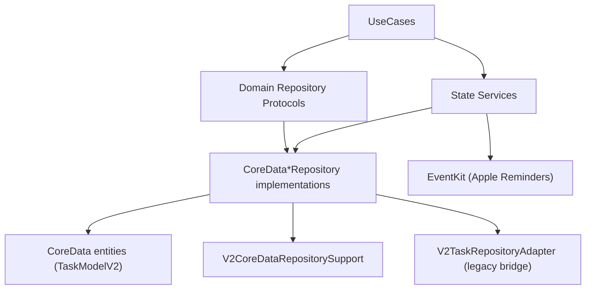

# State Repositories and Services (V2)

**Last validated against code on 2026-02-18**

This doc covers all repository and service implementations under the State layer.

Primary sources:
- `To Do List/State/Repositories/*.swift`
- `To Do List/State/Services/*.swift`
- `To Do List/Domain/Interfaces/V2RepositoryProtocols.swift`
- `To Do List/Domain/Interfaces/TaskRepositoryProtocol.swift`
- `To Do List/Domain/Interfaces/TaskReadModelRepositoryProtocol.swift`
- `To Do List/State/DI/EnhancedDependencyContainer.swift`

## State Layer Topology

## Repository Inventory

| File | Class | Protocol Surface | Primary Entities | Notes |
| --- | --- | --- | --- | --- |
| `State/Repositories/CoreDataTaskDefinitionRepository.swift` | `CoreDataTaskDefinitionRepository` | `TaskDefinitionRepositoryProtocol` | `TaskDefinition`, `TaskDependency`, `TaskTagLink` | Canonical V2 task-definition CRUD and mapping |
| `State/Repositories/CoreDataTaskDefinitionRepository.swift` | `CoreDataTaskTagLinkRepository` | `TaskTagLinkRepositoryProtocol` | `TaskTagLink` | Replaces task-tag links as full set |
| `State/Repositories/CoreDataTaskDefinitionRepository.swift` | `CoreDataTaskDependencyRepository` | `TaskDependencyRepositoryProtocol` | `TaskDependency` | Replaces dependency set with dedupe |
| `State/Repositories/CoreDataTaskDefinitionRepository.swift` | `V2TaskRepositoryAdapter` | `TaskRepositoryProtocol` | legacy `Task` bridge | Adapts legacy task usecases to V2 repository |
| `State/Repositories/CoreDataTaskReadModelRepository.swift` | `CoreDataTaskReadModelRepository` | `TaskReadModelRepositoryProtocol` | `TaskDefinition` read slices | Query-optimized read model and aggregates |
| `State/Repositories/CoreDataProjectRepository.swift` | `CoreDataProjectRepository` | `ProjectRepositoryProtocol` | `Project`, linked task counts | Inbox canonicalization + identity repair helpers |
| `State/Repositories/CoreDataLifeAreaRepository.swift` | `CoreDataLifeAreaRepository` | `LifeAreaRepositoryProtocol` | `LifeArea` | Lifecycle CRUD for life areas |
| `State/Repositories/CoreDataSectionRepository.swift` | `CoreDataSectionRepository` | `SectionRepositoryProtocol` | `ProjectSection` | Section CRUD by project |
| `State/Repositories/CoreDataTagRepository.swift` | `CoreDataTagRepository` | `TagRepositoryProtocol` | `Tag` | Tag CRUD with dedupe safety |
| `State/Repositories/CoreDataHabitRepository.swift` | `CoreDataHabitRepository` | `HabitRepositoryProtocol` | `HabitDefinition` | Habit definition CRUD |
| `State/Repositories/CoreDataScheduleRepository.swift` | `CoreDataScheduleRepository` | `ScheduleRepositoryProtocol` | `ScheduleTemplate`, `ScheduleRule`, `ScheduleException` | Scheduling metadata persistence |
| `State/Repositories/CoreDataOccurrenceRepository.swift` | `CoreDataOccurrenceRepository` | `OccurrenceRepositoryProtocol` | `Occurrence`, `OccurrenceResolution` | Occurrence key-sensitive persistence |
| `State/Repositories/CoreDataReminderRepository.swift` | `CoreDataReminderRepository` | `ReminderRepositoryProtocol` | `Reminder`, `ReminderTrigger`, `ReminderDelivery` | Reminder graph and delivery state |
| `State/Repositories/CoreDataGamificationRepository.swift` | `CoreDataGamificationRepository` | `GamificationRepositoryProtocol` | `GamificationProfile`, `XPEvent`, `AchievementUnlock` | Ledger/profile persistence |
| `State/Repositories/CoreDataAssistantActionRepository.swift` | `CoreDataAssistantActionRepository` | `AssistantActionRepositoryProtocol` | `AssistantActionRun` | Assistant run lifecycle persistence |
| `State/Repositories/CoreDataExternalSyncRepository.swift` | `CoreDataExternalSyncRepository` | `ExternalSyncRepositoryProtocol` | `ExternalContainerMap`, `ExternalItemMap` | Upsert-by-local/external key merge mapping |
| `State/Repositories/CoreDataTombstoneRepository.swift` | `CoreDataTombstoneRepository` | `TombstoneRepositoryProtocol` | `Tombstone` | Create/fetch-expired/delete tombstones |
| `State/Repositories/UserDefaultsSavedHomeViewRepository.swift` | `UserDefaultsSavedHomeViewRepository` | `SavedHomeViewRepositoryProtocol` | Saved home view snapshots | Non-CoreData local persistence |
| `State/Repositories/CoreDataTaskRepository+Domain.swift` | Extension on legacy repository | `TaskRepositoryProtocol` | Legacy entities/path | Backward-compatible legacy fetch/mutate helpers |
| `State/Repositories/V2CoreDataRepositorySupport.swift` | `V2CoreDataRepositorySupport` | shared helper | all V2 entities | ID validation, canonicalization, upsert utilities |

## Repository Contract and Failure Characteristics

| Repository | Contract Shape | Identity/Dedupe Behavior | Error Surface |
| --- | --- | --- | --- |
| `CoreDataTaskDefinitionRepository` | full task-definition CRUD + query + child fetch | canonical ID upserts, alias-field synchronization, bridge-safe mapping | validation (`422`), CoreData fetch/save errors |
| `CoreDataTaskTagLinkRepository` | fetch/replace tag links by `taskID` | replace-set semantics to avoid stale links | missing/invalid IDs, save failures |
| `CoreDataTaskDependencyRepository` | fetch/replace dependency links by `taskID` | composite dependency dedupe (`taskID`, `dependsOnTaskID`, kind) | invalid dependency payload, save failures |
| `V2TaskRepositoryAdapter` | legacy `TaskRepositoryProtocol` facade over V2 storage | maps legacy fields onto canonical `TaskDefinition` IDs | mapping/validation errors and underlying V2 repository failures |
| `CoreDataTaskReadModelRepository` | read-model query/search/count/score aggregates | deterministic sorting fallback (`taskID`, `id`) and bounded paging | predicate/sort mismatches, fetch/count failures |
| `CoreDataProjectRepository` | project CRUD + identity repair + inbox semantics | canonical inbox and collision repair across `id`/`projectID` | duplicate identity repair conflicts, save failures |
| `CoreDataLifeAreaRepository` | life area CRUD | ID-based upsert/fetch semantics | validation errors, save failures |
| `CoreDataSectionRepository` | section CRUD scoped by project | section identity tied to project scope | missing project IDs, save failures |
| `CoreDataTagRepository` | tag CRUD | dedupe-by-ID/name paths during mutation | duplicate conflict cleanup/save failures |
| `CoreDataHabitRepository` | habit definition CRUD | ID-stable updates and project/life-area linkage preservation | invalid config payload, save failures |
| `CoreDataScheduleRepository` | template/rule/exception save/fetch | template-scoped canonical fetch + update | malformed rule/exception data, save failures |
| `CoreDataOccurrenceRepository` | range fetch, save, resolve, delete | immutable `occurrenceKey` identity; key-based dedupe behavior | duplicate-key/save failures, resolution write errors |
| `CoreDataReminderRepository` | reminder/trigger/delivery save/fetch/update | reminder-rooted graph updates with trigger/delivery linkage | invalid reminder graph state, save/update failures |
| `CoreDataGamificationRepository` | profile + XP + achievement persistence | idempotency-key-aware XP event writes | duplicate idempotency conflicts, save failures |
| `CoreDataAssistantActionRepository` | create/update/fetch assistant run state | run ID canonicalization + lifecycle-safe persistence | invalid run state payload, save failures |
| `CoreDataExternalSyncRepository` | provider mapping fetch/save/upsert by local/external keys | canonical object selection and duplicate pruning on both key paths | invalid provider/key fields, merge/upsert save failures |
| `CoreDataTombstoneRepository` | create/fetch-expired/delete tombstones | expiry-bound lifecycle with explicit purge IDs | invalid expiry data, fetch/delete failures |
| `UserDefaultsSavedHomeViewRepository` | saved home-view preference persistence | key-based user-defaults replacement | serialization/defaults I/O errors |

Source anchors:
- `To Do List/Domain/Interfaces/V2RepositoryProtocols.swift`
- `To Do List/Domain/Interfaces/TaskRepositoryProtocol.swift`
- `To Do List/Domain/Interfaces/TaskReadModelRepositoryProtocol.swift`
- `To Do List/State/Repositories/*.swift`
- `To Do List/State/Repositories/V2CoreDataRepositorySupport.swift`

## Service Inventory

| File | Class | Protocol Surface | Purpose | External Dependencies |
| --- | --- | --- | --- | --- |
| `State/Services/CoreSchedulingEngine.swift` | `CoreSchedulingEngine` | `SchedulingEngineProtocol` | generate/rebuild/resolve occurrences and exceptions | schedule + occurrence repositories |
| `State/Services/EventKitAppleRemindersProvider.swift` | `EventKitAppleRemindersProvider` | `AppleRemindersProviderProtocol` | read/write Apple Reminders snapshots and merge envelope payloads | EventKit (`EKEventStore`) |

## Data Ownership Matrix

| Data Domain | Canonical Writer(s) | Read-Heavy Consumers |
| --- | --- | --- |
| Task definition graph | `CoreDataTaskDefinitionRepository`, `V2TaskRepositoryAdapter` | task usecases, read-model repository |
| Project identity/inbox defaults | `CoreDataProjectRepository`, bootstrap seed/repair in `AppDelegate` | project usecases, UI project selection |
| Schedule + occurrence timeline | `CoreDataScheduleRepository`, `CoreDataOccurrenceRepository`, `CoreSchedulingEngine` | schedule/maintenance usecases |
| Reminders + delivery state | `CoreDataReminderRepository`, sync reconcile usecases | reminder/sync usecases |
| External mapping + merge state | `CoreDataExternalSyncRepository` | link/reconcile usecases |
| Gamification ledger | `CoreDataGamificationRepository` | XP usecase, analytics views |
| Assistant action runs | `CoreDataAssistantActionRepository` | assistant pipeline |
| Tombstones | `CoreDataTombstoneRepository` | maintenance and sync flows |

## Error and Failure Surfaces

| Surface | Typical Error Source | Handling Pattern |
| --- | --- | --- |
| CoreData fetch/save | invalid/missing entities, predicate mismatches, save conflicts | return `Result.failure` to usecases; no silent swallow |
| Identity mismatch | missing/zero UUID, duplicate candidates | helper validation via `V2CoreDataRepositorySupport`; canonical selection/repair |
| External provider I/O | EventKit permission denial or item lookup failures | propagated through provider and reconcile usecases |
| Partial batch mutation | multi-entity loops with per-item failures | aggregate failure tracking with best-effort completion in specific usecases |

## Dedupe, Canonicalization, and Identity Rules

| Rule | Enforced In | Why It Matters |
| --- | --- | --- |
| Require non-empty UUID identity | `V2CoreDataRepositorySupport.requireID` | avoids writing invalid identity rows |
| Canonical object selection by predicate/ID | `V2CoreDataRepositorySupport.canonicalObject`, `upsertByID` | prevents duplicate logical entities |
| Task dependency dedupe with composite key | `CoreDataTaskDependencyRepository.replaceDependencies` | prevents duplicate edges |
| Immutable occurrence key behavior | `CoreDataOccurrenceRepository` | avoids duplicate/re-keyed timeline events |
| Project identity repair and inbox canonical selection | `CoreDataProjectRepository.repairProjectIdentityCollisions` | protects project/task linkage integrity |

## Repository/Service Wiring in Runtime

`EnhancedDependencyContainer` wires all repositories and services, then injects optional V2 dependencies into `UseCaseCoordinator`.

Wiring reference:
- `To Do List/State/DI/EnhancedDependencyContainer.swift`

## Cross-Links
- Core architecture runtime: `docs/architecture/clean-architecture-v2.md`
- Data model/entity invariants: `docs/architecture/data-model-v2.md`
- Usecase contracts: `docs/architecture/usecases-v2.md`
- LLM and assistant boundaries: `docs/architecture/llm-assistant-stack-v2.md`
