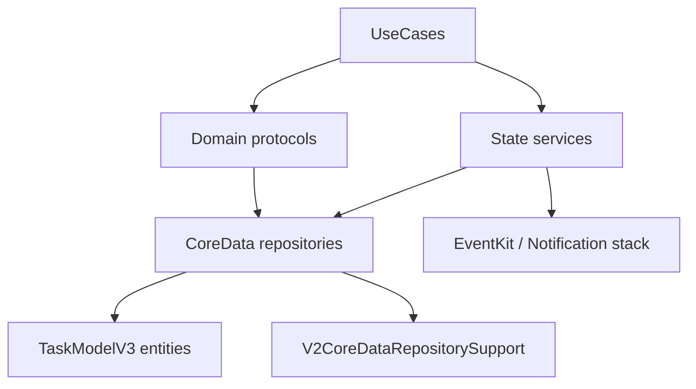

# State Repositories and Services (V3 Runtime)

**Last validated against code on 2026-02-20**

This document maps State-layer ownership for persistence repositories, supporting services, and runtime wiring.

Primary source anchors:
- `To Do List/State/Repositories/*.swift`
- `To Do List/State/Services/*.swift`
- `To Do List/State/DI/EnhancedDependencyContainer.swift`
- `To Do List/Domain/Interfaces/V2RepositoryProtocols.swift`
- `To Do List/Domain/Interfaces/TaskReadModelRepositoryProtocol.swift`
- `To Do List/TaskModelV3.xcdatamodeld/TaskModelV3.xcdatamodel/contents`

## State Topology

## Repository Inventory

| File | Types | Protocol surface | Primary entity/data domain |
| --- | --- | --- | --- |
| `State/Repositories/CoreDataTaskDefinitionRepository.swift` | `CoreDataTaskDefinitionRepository`, `CoreDataTaskTagLinkRepository`, `CoreDataTaskDependencyRepository` | `TaskDefinitionRepositoryProtocol`, `TaskTagLinkRepositoryProtocol`, `TaskDependencyRepositoryProtocol` | `TaskDefinition`, `TaskTagLink`, `TaskDependency` |
| `State/Repositories/CoreDataTaskReadModelRepository.swift` | `CoreDataTaskReadModelRepository` | `TaskReadModelRepositoryProtocol` | query slices and task aggregates |
| `State/Repositories/CoreDataProjectRepository.swift` | `CoreDataProjectRepository` | `ProjectRepositoryProtocol` | `Project` |
| `State/Repositories/CoreDataLifeAreaRepository.swift` | `CoreDataLifeAreaRepository` | `LifeAreaRepositoryProtocol` | `LifeArea` |
| `State/Repositories/CoreDataSectionRepository.swift` | `CoreDataSectionRepository` | `SectionRepositoryProtocol` | `ProjectSection` |
| `State/Repositories/CoreDataTagRepository.swift` | `CoreDataTagRepository` | `TagRepositoryProtocol` | `Tag` |
| `State/Repositories/CoreDataHabitRepository.swift` | `CoreDataHabitRepository` | `HabitRepositoryProtocol` | `HabitDefinition` |
| `State/Repositories/CoreDataScheduleRepository.swift` | `CoreDataScheduleRepository` | `ScheduleRepositoryProtocol` | `ScheduleTemplate`, `ScheduleRule`, `ScheduleException` |
| `State/Repositories/CoreDataOccurrenceRepository.swift` | `CoreDataOccurrenceRepository` | `OccurrenceRepositoryProtocol` | `Occurrence`, `OccurrenceResolution` |
| `State/Repositories/CoreDataReminderRepository.swift` | `CoreDataReminderRepository` | `ReminderRepositoryProtocol` | `Reminder`, `ReminderTrigger`, `ReminderDelivery` |
| `State/Repositories/CoreDataGamificationRepository.swift` | `CoreDataGamificationRepository` | `GamificationRepositoryProtocol` | `GamificationProfile`, `XPEvent`, `AchievementUnlock` |
| `State/Repositories/CoreDataAssistantActionRepository.swift` | `CoreDataAssistantActionRepository` | `AssistantActionRepositoryProtocol` | `AssistantActionRun` |
| `State/Repositories/CoreDataExternalSyncRepository.swift` | `CoreDataExternalSyncRepository` | `ExternalSyncRepositoryProtocol` | `ExternalContainerMap`, `ExternalItemMap` |
| `State/Repositories/CoreDataTombstoneRepository.swift` | `CoreDataTombstoneRepository` | `TombstoneRepositoryProtocol` | `Tombstone` |
| `State/Repositories/UserDefaultsSavedHomeViewRepository.swift` | `UserDefaultsSavedHomeViewRepository` | `SavedHomeViewRepositoryProtocol` | home-view preference snapshots |
| `State/Repositories/V2CoreDataRepositorySupport.swift` | `V2CoreDataRepositorySupport` | shared helper | ID validation, canonicalization, upsert helpers |

## Service Inventory

| File | Type | Protocol surface | Purpose |
| --- | --- | --- | --- |
| `State/Services/CoreSchedulingEngine.swift` | `CoreSchedulingEngine` | `SchedulingEngineProtocol` | schedule generation, occurrence maintenance/resolution orchestration |
| `State/Services/EventKitAppleRemindersProvider.swift` | `EventKitAppleRemindersProvider` | `AppleRemindersProviderProtocol` | Apple Reminders provider I/O |
| `State/Services/LocalNotificationService.swift` | `LocalNotificationService` | `NotificationServiceProtocol` | in-app reminder notifications |

## Data Ownership Matrix

| Data domain | Canonical writer(s) | Primary consumers |
| --- | --- | --- |
| Task graph (`TaskDefinition`, dependency/tag links) | `CoreDataTaskDefinitionRepository` family | task usecases, sync usecases, assistant pipeline |
| Query slices/aggregates | `CoreDataTaskReadModelRepository` | home/search/analytics/project dashboards |
| Planning hierarchy | project/life-area/section/tag repositories | project and task creation/edit flows |
| Scheduling timeline | schedule + occurrence repositories and scheduling engine | schedule maintenance and reminder orchestration |
| Reminders domain | `CoreDataReminderRepository` + provider service | reminder scheduling and external reconcile |
| External mapping state | `CoreDataExternalSyncRepository` | link/reconcile flows |
| Gamification ledger | `CoreDataGamificationRepository` | completion and analytics flows |
| Assistant action runs | `CoreDataAssistantActionRepository` | assistant propose/confirm/apply/undo |
| Tombstones | `CoreDataTombstoneRepository` | maintenance and sync merge flows |

## Identity and Dedupe Rules (State Layer)

| Rule | Enforced by | Why it matters |
| --- | --- | --- |
| Non-empty UUID IDs required for writes | `V2CoreDataRepositorySupport.requireID` | prevents invalid identity rows |
| Canonical object selection before update/upsert | `V2CoreDataRepositorySupport.canonicalObject`/`upsertByID` | prevents duplicate logical entities |
| Dependency edges deduped by `(taskID, dependsOnTaskID, kind)` | `CoreDataTaskDependencyRepository.replaceDependencies` | prevents duplicate dependency graph edges |
| Tag links replaced as set for a task | `CoreDataTaskTagLinkRepository.replaceTagLinks` | avoids stale links after edits |
| Occurrence identity uses immutable `occurrenceKey` | `CoreDataOccurrenceRepository` | deterministic recurrence lifecycle |
| External item mappings upsert by local/external key | `CoreDataExternalSyncRepository` | stable merge-state evolution |

## Error Surface Summary

| Surface | Common sources | Handling pattern |
| --- | --- | --- |
| CoreData fetch/save | invalid predicates, conflicts, missing entities | propagate as `Result.failure`, no silent swallow |
| Identity mismatches | malformed IDs, duplicate candidates | canonicalization helpers + explicit failures |
| Provider I/O | reminders permission denied, lookup/write failures | propagated through provider and sync usecases |
| Batch reconciliation | partial per-item failures/timeouts | aggregate summary and per-item failure accounting |

## Runtime Wiring

`EnhancedDependencyContainer.configure(with:)` is the only runtime entrypoint for State-layer wiring.
It builds repositories/services, constructs `UseCaseCoordinator`, and evaluates readiness through `assertV3RuntimeReady()`.

## Cross-Links

- `docs/architecture/clean-architecture-v2.md`
- `docs/architecture/data-model-v2.md`
- `docs/architecture/usecases-v2.md`
- `docs/architecture/risk-register-v2.md`
